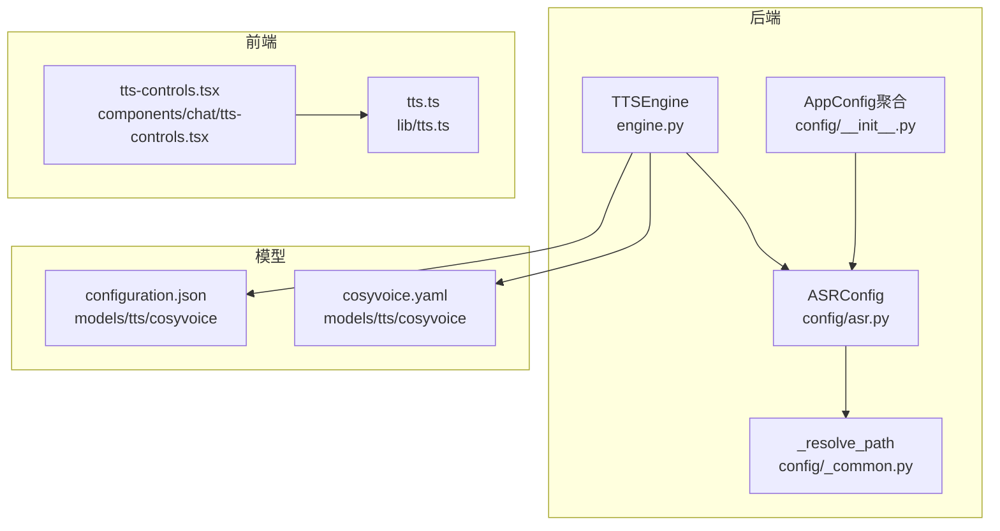
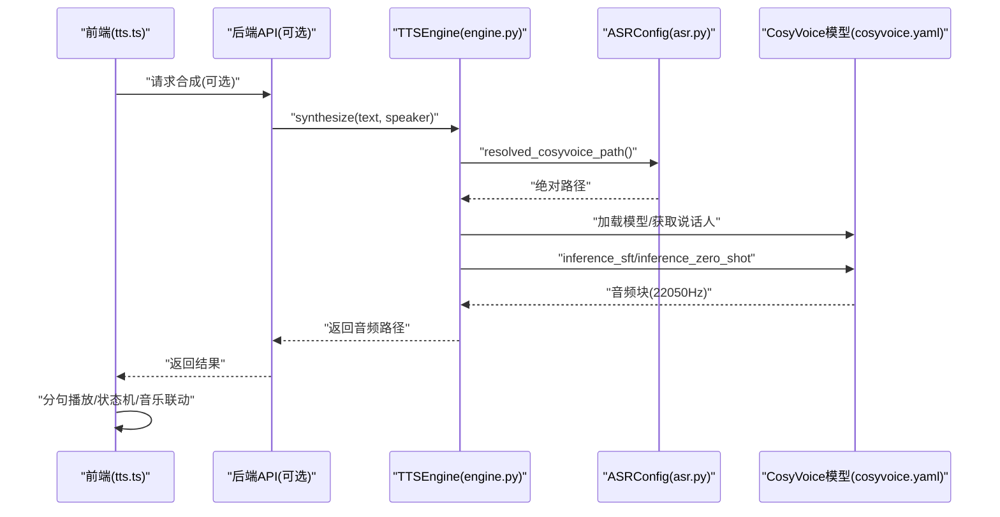
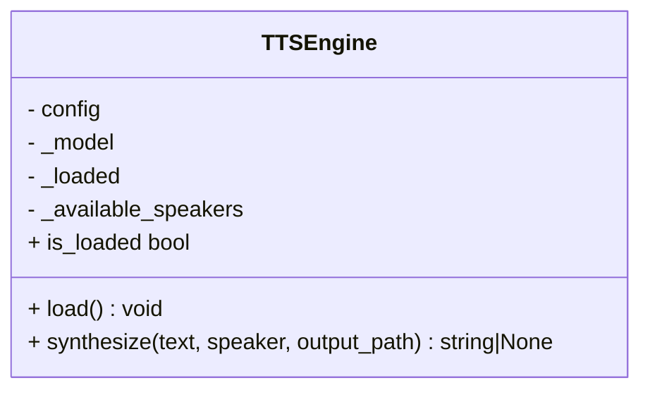
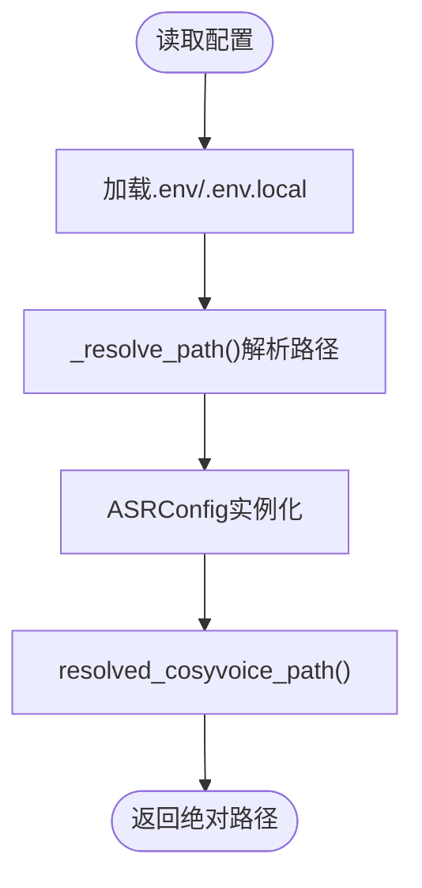
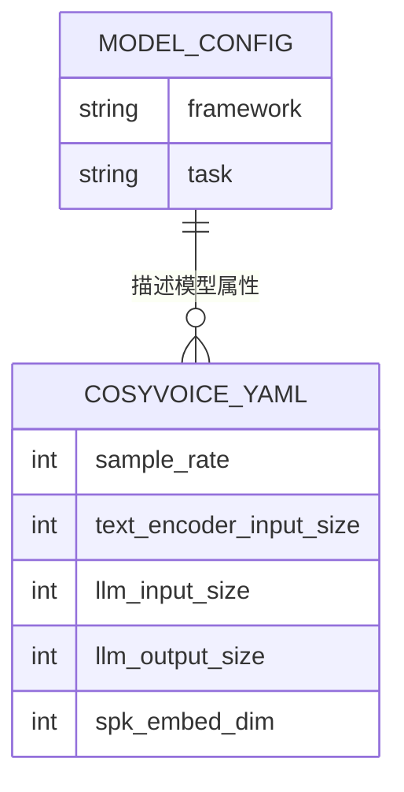
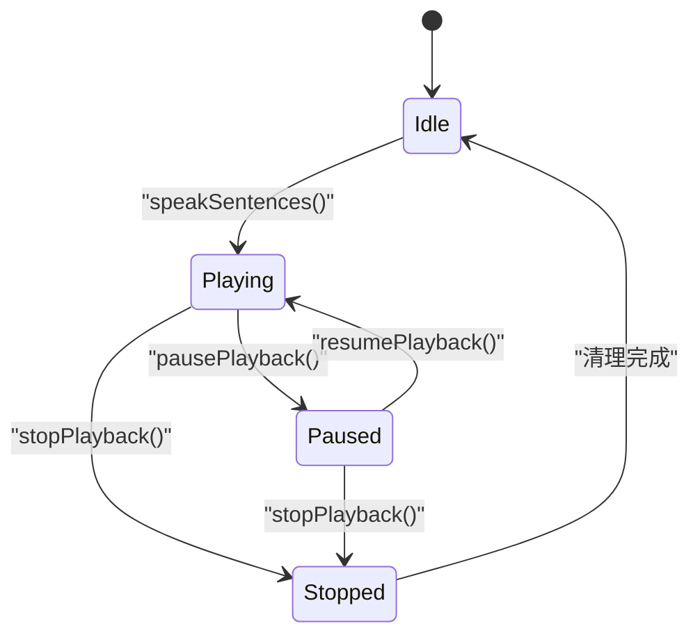
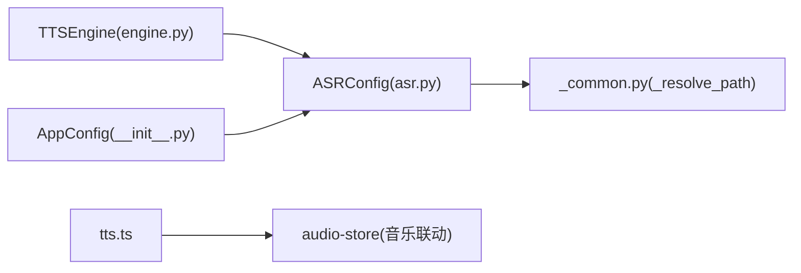

# TTS语音合成

<cite>
**本文引用的文件**   
- [engine.py](file://backend_design/nexus/tts/engine.py)
- [asr.py](file://backend_design/nexus/config/asr.py)
- [_common.py](file://backend_design/nexus/config/_common.py)
- [__init__.py](file://backend_design/nexus/config/__init__.py)
- [configuration.json](file://models/tts/cosyvoice/configuration.json)
- [cosyvoice.yaml](file://models/tts/cosyvoice/cosyvoice.yaml)
- [README.md](file://models/tts/cosyvoice/README.md)
- [tts-guide.md](file://docs/内部开发存档文档/语音技术文档/tts-guide.md)
- [tts.ts](file://frontend_design/src/lib/tts.ts)
- [tts-controls.tsx](file://frontend_design/src/components/chat/tts-controls.tsx)
</cite>

## 目录
1. [简介](#简介)
2. [项目结构](#项目结构)
3. [核心组件](#核心组件)
4. [架构总览](#架构总览)
5. [详细组件分析](#详细组件分析)
6. [依赖关系分析](#依赖关系分析)
7. [性能与延迟优化](#性能与延迟优化)
8. [故障排查指南](#故障排查指南)
9. [结论](#结论)
10. [附录：配置与示例](#附录配置与示例)

## 简介
本技术文档面向 NexusCockpit 的 TTS 语音合成模块，聚焦基于 CosyVoice 的本地端侧语音合成引擎实现。内容涵盖声音克隆、个性化音色生成、流式输出能力、模型配置与采样率设置、音频格式支持、情感控制、质量控制、延迟优化与缓存策略，以及多语言与方言处理。同时提供可操作的扩展指南，帮助开发者添加新声音模型、调整合成参数与优化输出质量。

## 项目结构
TTS 相关代码主要分布在后端引擎封装、配置中心、模型配置文件与前端播放控制层：
- 后端引擎封装：封装 CosyVoice 推理流程，负责加载模型、选择说话人、合成并保存音频。
- 配置中心：集中管理 CosyVoice 模型路径与环境变量解析，确保跨平台路径一致性。
- 模型配置：CosyVoice 的 PyTorch 任务描述与详细超参（采样率、编码器、解码器、HiFT 等）。
- 前端播放：浏览器原生 SpeechSynthesis 的分句播放、状态机与音乐联动控制。

图表来源 
- [engine.py:1-116](file://backend_design/nexus/tts/engine.py#L1-L116)
- [asr.py:1-66](file://backend_design/nexus/config/asr.py#L1-L66)
- [_common.py:1-75](file://backend_design/nexus/config/_common.py#L1-L75)
- [__init__.py:1-167](file://backend_design/nexus/config/__init__.py#L1-L167)
- [configuration.json:1-1](file://models/tts/cosyvoice/configuration.json#L1-L1)
- [cosyvoice.yaml:1-202](file://models/tts/cosyvoice/cosyvoice.yaml#L1-L202)
- [tts.ts:1-443](file://frontend_design/src/lib/tts.ts#L1-L443)
- [tts-controls.tsx:1-178](file://frontend_design/src/components/chat/tts-controls.tsx#L1-L178)

章节来源
- [engine.py:1-116](file://backend_design/nexus/tts/engine.py#L1-L116)
- [asr.py:1-66](file://backend_design/nexus/config/asr.py#L1-L66)
- [_common.py:1-75](file://backend_design/nexus/config/_common.py#L1-L75)
- [__init__.py:1-167](file://backend_design/nexus/config/__init__.py#L1-L167)
- [configuration.json:1-1](file://models/tts/cosyvoice/configuration.json#L1-L1)
- [cosyvoice.yaml:1-202](file://models/tts/cosyvoice/cosyvoice.yaml#L1-L202)
- [tts.ts:1-443](file://frontend_design/src/lib/tts.ts#L1-L443)
- [tts-controls.tsx:1-178](file://frontend_design/src/components/chat/tts-controls.tsx#L1-L178)

## 核心组件
- TTSEngine：封装 CosyVoice 模型的加载、可用说话人列表获取、零样本/指定说话人合成、音频保存与错误处理。
- ASRConfig：集中管理 CosyVoice 模型路径、声纹注册目录与用户目录，并提供绝对路径解析方法。
- AppConfig：聚合所有子系统配置，暴露统一的 get_config() 单例访问入口。
- cosyvoice.yaml：定义采样率、文本编码器、LLM、Flow、HiFT 等关键超参，决定合成质量与速度。
- configuration.json：声明框架与任务类型，便于外部工具识别模型属性。
- 前端 tts.ts：分句播放、全局播放状态机、Chrome 保活机制、与座舱音乐的联动控制。
- 前端 tts-controls.tsx：消息级 TTS 控制 UI，展示播放进度与状态。

章节来源
- [engine.py:1-116](file://backend_design/nexus/tts/engine.py#L1-L116)
- [asr.py:1-66](file://backend_design/nexus/config/asr.py#L1-L66)
- [__init__.py:1-167](file://backend_design/nexus/config/__init__.py#L1-L167)
- [cosyvoice.yaml:1-202](file://models/tts/cosyvoice/cosyvoice.yaml#L1-L202)
- [configuration.json:1-1](file://models/tts/cosyvoice/configuration.json#L1-L1)
- [tts.ts:1-443](file://frontend_design/src/lib/tts.ts#L1-L443)
- [tts-controls.tsx:1-178](file://frontend_design/src/components/chat/tts-controls.tsx#L1-L178)

## 架构总览
整体架构由“后端 TTS 引擎 + 模型配置 + 前端播放控制”构成。后端通过 TTSEngine 调用 CosyVoice 进行离线推理，输出 WAV 音频；前端使用浏览器原生 SpeechSynthesis 进行分句播报，并与座舱音乐系统联动。

图表来源 
- [engine.py:1-116](file://backend_design/nexus/tts/engine.py#L1-L116)
- [asr.py:1-66](file://backend_design/nexus/config/asr.py#L1-L66)
- [cosyvoice.yaml:1-202](file://models/tts/cosyvoice/cosyvoice.yaml#L1-L202)
- [tts.ts:1-443](file://frontend_design/src/lib/tts.ts#L1-L443)

## 详细组件分析

### TTSEngine 组件
- 功能要点
  - 懒加载模型：首次调用 load() 时初始化 CosyVoice，启用 JIT 加速，根据 GPU 可用性选择 fp16。
  - 说话人管理：自动列出可用说话人，未指定时使用第一个。
  - 合成模式：支持指定说话人的 SFT 推理与零样本推理。
  - 音频保存：默认以 22050Hz 采样率保存为 WAV，失败返回 None。
  - 错误处理：捕获导入异常与运行时异常，记录日志。

图表来源 
- [engine.py:1-116](file://backend_design/nexus/tts/engine.py#L1-L116)

章节来源
- [engine.py:1-116](file://backend_design/nexus/tts/engine.py#L1-L116)

### 配置中心与路径解析
- ASRConfig：管理 CosyVoice 模型路径、声纹注册与用户目录，提供 resolved_cosyvoice_path() 返回绝对路径。
- _resolve_path：将相对路径解析为基于项目根目录的绝对路径，避免工作目录差异导致的路径失效。
- AppConfig：聚合所有子配置，统一通过 get_config() 访问。

图表来源 
- [_common.py:1-75](file://backend_design/nexus/config/_common.py#L1-L75)
- [asr.py:1-66](file://backend_design/nexus/config/asr.py#L1-L66)
- [__init__.py:1-167](file://backend_design/nexus/config/__init__.py#L1-L167)

章节来源
- [_common.py:1-75](file://backend_design/nexus/config/_common.py#L1-L75)
- [asr.py:1-66](file://backend_design/nexus/config/asr.py#L1-L66)
- [__init__.py:1-167](file://backend_design/nexus/config/__init__.py#L1-L167)

### CosyVoice 模型配置
- configuration.json：声明框架为 PyTorch，任务为 text-to-speech。
- cosyvoice.yaml：定义采样率 22050、文本编码器、LLM、Flow、HiFT 等关键超参，影响音质、延迟与资源占用。

图表来源 
- [configuration.json:1-1](file://models/tts/cosyvoice/configuration.json#L1-L1)
- [cosyvoice.yaml:1-202](file://models/tts/cosyvoice/cosyvoice.yaml#L1-L202)

章节来源
- [configuration.json:1-1](file://models/tts/cosyvoice/configuration.json#L1-L1)
- [cosyvoice.yaml:1-202](file://models/tts/cosyvoice/cosyvoice.yaml#L1-L202)

### 前端播放控制（tts.ts）
- 分句播放：按中文/英文标点切分句子，逐句播报，提升交互体验。
- 状态机：idle/playing/paused/stopped，支持暂停、断点续播、重放、终止。
- Chrome 保活：周期性 pause→resume 防止长时间播放事件不触发。
- 音乐联动：朗读前暂停座舱音乐，结束后恢复。

图表来源 
- [tts.ts:1-443](file://frontend_design/src/lib/tts.ts#L1-L443)

章节来源
- [tts.ts:1-443](file://frontend_design/src/lib/tts.ts#L1-L443)
- [tts-controls.tsx:1-178](file://frontend_design/src/components/chat/tts-controls.tsx#L1-L178)

## 依赖关系分析
- TTSEngine 依赖 ASRConfig 获取模型路径，依赖设备检测 has_cuda() 决定是否使用 fp16。
- ASRConfig 依赖 _resolve_path 进行路径解析，依赖环境变量 .env/.env.local。
- AppConfig 聚合 ASRConfig，提供统一访问接口。
- 前端 tts.ts 依赖浏览器 SpeechSynthesis API，与 audio-store 联动控制音乐。

图表来源 
- [engine.py:1-116](file://backend_design/nexus/tts/engine.py#L1-L116)
- [asr.py:1-66](file://backend_design/nexus/config/asr.py#L1-L66)
- [_common.py:1-75](file://backend_design/nexus/config/_common.py#L1-L75)
- [__init__.py:1-167](file://backend_design/nexus/config/__init__.py#L1-L167)
- [tts.ts:1-443](file://frontend_design/src/lib/tts.ts#L1-L443)

章节来源
- [engine.py:1-116](file://backend_design/nexus/tts/engine.py#L1-L116)
- [asr.py:1-66](file://backend_design/nexus/config/asr.py#L1-L66)
- [_common.py:1-75](file://backend_design/nexus/config/_common.py#L1-L75)
- [__init__.py:1-167](file://backend_design/nexus/config/__init__.py#L1-L167)
- [tts.ts:1-443](file://frontend_design/src/lib/tts.ts#L1-L443)

## 性能与延迟优化
- 模型加载与推理
  - 启用 JIT 加速（load_jit=True），减少推理开销。
  - 在 GPU 可用时启用 fp16，降低显存占用并提升吞吐。
  - 使用 CosyVoice 内置流式推理（streaming）可降低首包延迟（参考 CosyVoice README 中关于 Bi-Streaming 的描述）。
- 音频输出
  - 固定采样率 22050Hz，WAV PCM 16-bit，便于车载系统直接播放。
  - 分句播放在前端降低感知延迟，提升交互流畅度。
- 缓存策略
  - 当前 TTS 引擎未实现音频缓存；可在上层服务对相同文本+说话人组合的结果进行缓存，以减少重复合成。
- 资源管理
  - 模型懒加载，按需初始化，避免启动开销。
  - 错误降级：当模型不可用时记录警告并禁用 TTS，保证主流程稳定。

[本节为通用指导，无需特定文件引用]

## 故障排查指南
- 模型路径问题
  - 检查 COSYVOICE_MODEL_PATH 是否指向有效目录，确认 resolved_cosyvoice_path() 返回绝对路径。
  - 若路径不存在，TTSEngine.load() 会记录警告并跳过加载。
- 依赖缺失
  - 未安装 cosyvoice 库时，TTSEngine.load() 捕获 ImportError 并记录警告。
- GPU/CPU 切换
  - has_cuda() 决定 fp16 开关；无 GPU 时将回退 CPU 推理，延迟增加但功能可用。
- 合成失败
  - 检查输入文本与说话人有效性；若为空或无效，可能触发异常并返回 None。
- 前端播放异常
  - 浏览器不支持 SpeechSynthesis 时，tts.ts 会直接返回；Chrome 保活定时器用于避免长时间播放卡死。

章节来源
- [engine.py:1-116](file://backend_design/nexus/tts/engine.py#L1-L116)
- [asr.py:1-66](file://backend_design/nexus/config/asr.py#L1-L66)
- [tts.ts:1-443](file://frontend_design/src/lib/tts.ts#L1-L443)

## 结论
NexusCockpit 的 TTS 模块以 CosyVoice 为核心，结合本地化配置与前端播放控制，实现了低延迟、高质量、可定制的语音合成能力。通过合理的模型加载策略、采样率与格式设置、以及前端分句播放与状态机，系统在车载场景下具备良好的自然度与用户体验。未来可在上层引入音频缓存与更细粒度的情感控制，进一步提升性能与可控性。

[本节为总结，无需特定文件引用]

## 附录：配置与示例

### 配置项说明
- 模型路径
  - COSYVOICE_MODEL_PATH：CosyVoice 模型目录，默认 ./models/tts/cosyvoice。
- 采样率与格式
  - 采样率：22050 Hz（见 cosyvoice.yaml 与 engine.py 保存逻辑）。
  - 输出格式：WAV（PCM 16-bit）。
- 多语言与方言
  - CosyVoice 支持多语言与多种中文方言（参考 models/tts/cosyvoice/README.md）。
- 情感控制
  - 可通过指令控制语速、音量、情感等（参考 CosyVoice README 中的 Instruct Support）。

章节来源
- [asr.py:1-66](file://backend_design/nexus/config/asr.py#L1-L66)
- [cosyvoice.yaml:1-202](file://models/tts/cosyvoice/cosyvoice.yaml#L1-L202)
- [README.md:1-205](file://models/tts/cosyvoice/README.md#L1-L205)

### 添加新声音模型
- 步骤概览
  - 准备模型目录与必要权重文件。
  - 更新 COSYVOICE_MODEL_PATH 指向新模型目录。
  - 重启服务，TTSEngine.load() 将自动加载新模型并列出可用说话人。
  - 在 synthesize() 中指定新的说话人 ID 进行合成。

章节来源
- [engine.py:1-116](file://backend_design/nexus/tts/engine.py#L1-L116)
- [asr.py:1-66](file://backend_design/nexus/config/asr.py#L1-L66)

### 调整合成参数
- 采样率与格式
  - 修改 cosyvoice.yaml 中的 sample_rate 与 HiFT 参数，影响音质与延迟。
- 推理模式
  - 在 TTSEngine.synthesize() 中选择 inference_sft 或 inference_zero_shot，决定是否使用说话人提示。
- 流式输出
  - 启用 stream=True（需 CosyVoice 支持），以降低首包延迟。

章节来源
- [cosyvoice.yaml:1-202](file://models/tts/cosyvoice/cosyvoice.yaml#L1-L202)
- [engine.py:1-116](file://backend_design/nexus/tts/engine.py#L1-L116)

### 优化输出质量
- 文本预处理
  - 在前端或上游进行文本规范化，去除 Markdown 标记与多余空格（参考 tts.ts 的分句逻辑）。
- 说话人选择
  - 优先选择与目标音色最接近的说话人，或使用零样本提示提升相似度。
- 情感与语速
  - 通过 CosyVoice 指令控制情感与语速，提升自然度。

章节来源
- [tts.ts:1-443](file://frontend_design/src/lib/tts.ts#L1-L443)
- [README.md:1-205](file://models/tts/cosyvoice/README.md#L1-L205)

### 实际代码示例（路径引用）
- 加载模型与合成
  - 参考 [engine.py:33-62](file://backend_design/nexus/tts/engine.py#L33-L62) 与 [engine.py:63-111](file://backend_design/nexus/tts/engine.py#L63-L111)。
- 配置路径解析
  - 参考 [asr.py:47-66](file://backend_design/nexus/config/asr.py#L47-L66) 与 [_common.py:56-75](file://backend_design/nexus/config/_common.py#L56-L75)。
- 前端分句播放
  - 参考 [tts.ts:104-124](file://frontend_design/src/lib/tts.ts#L104-L124) 与 [tts.ts:282-312](file://frontend_design/src/lib/tts.ts#L282-L312)。

[本节为示例指引，无需额外引用]