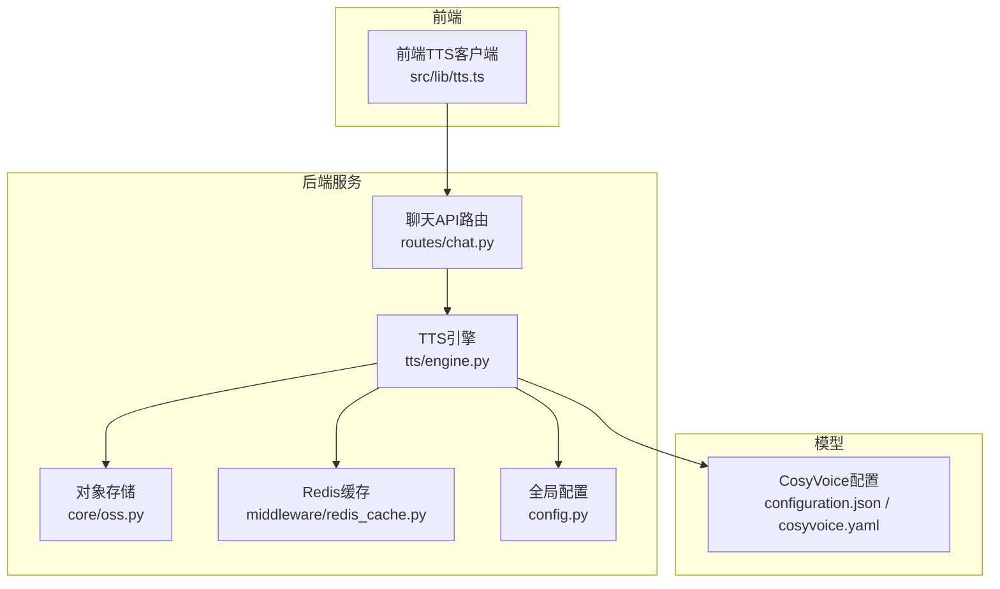
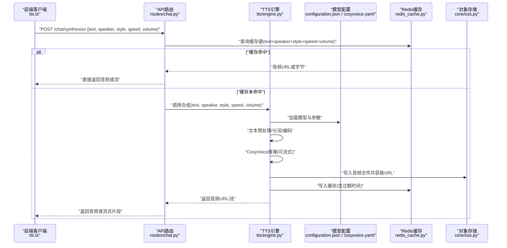
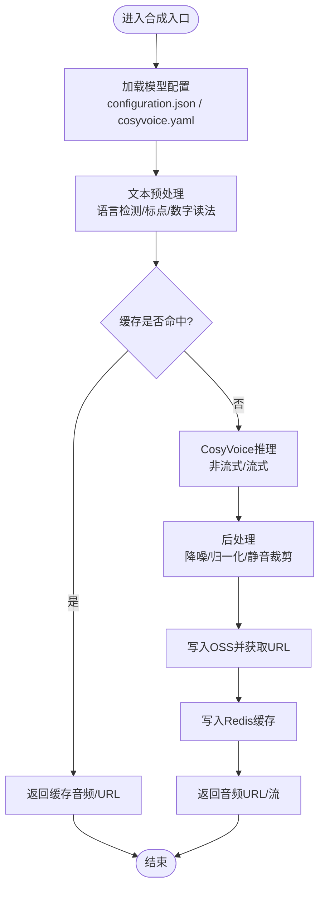
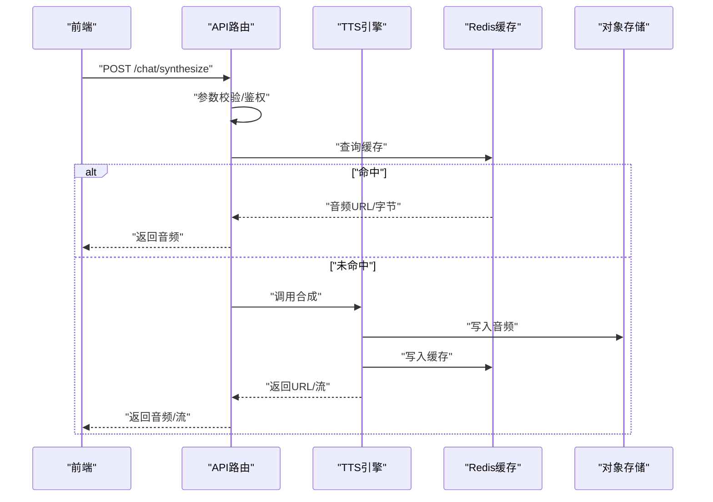
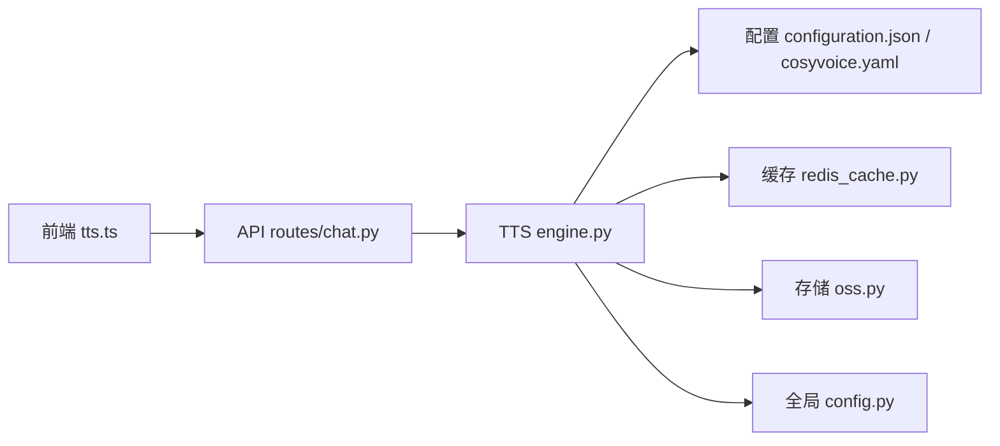

# TTS语音合成引擎

<cite>
**本文引用的文件**   
- [backend_design/nexus/tts/engine.py](file://backend_design/nexus/tts/engine.py)
- [backend_design/nexus/tts/__init__.py](file://backend_design/nexus/tts/__init__.py)
- [models/tts/cosyvoice/configuration.json](file://models/tts/cosyvoice/configuration.json)
- [models/tts/cosyvoice/cosyvoice.yaml](file://models/tts/cosyvoice/cosyvoice.yaml)
- [backend_design/nexus/api/routes/chat.py](file://backend_design/nexus/api/routes/chat.py)
- [frontend_design/src/lib/tts.ts](file://frontend_design/src/lib/tts.ts)
- [backend_design/nexus/core/oss.py](file://backend_design/nexus/core/oss.py)
- [backend_design/nexus/middleware/redis_cache.py](file://backend_design/nexus/middleware/redis_cache.py)
- [backend_design/nexus/config.py](file://backend_design/nexus/config.py)
</cite>

## 目录
1. [简介](#简介)
2. [项目结构](#项目结构)
3. [核心组件](#核心组件)
4. [架构总览](#架构总览)
5. [详细组件分析](#详细组件分析)
6. [依赖关系分析](#依赖关系分析)
7. [性能与内存管理](#性能与内存管理)
8. [故障排查指南](#故障排查指南)
9. [结论](#结论)
10. [附录：API与配置参考](#附录api与配置参考)

## 简介
本技术文档聚焦于NexusCockpit的TTS（文本转语音）引擎，围绕CosyVoice模型的集成实现、语音合成算法、音色控制与情感表达展开。文档同时覆盖支持的文本格式、语音参数配置、多语言支持、流式输出与缓存机制、音色定制、语速调节与音量控制等关键能力，并提供端到端调用示例与性能优化建议，帮助开发者快速落地高质量语音合成服务。

## 项目结构
TTS相关代码主要位于后端Python模块与前端播放逻辑中，模型配置文件集中于models/tts/cosyvoice目录。整体组织方式如下：
- 后端TTS引擎：负责加载CosyVoice模型、处理文本、生成音频并返回或流式输出
- API路由层：暴露HTTP接口供前端或其他服务调用
- 前端TTS客户端：封装请求与播放逻辑，支持流式播放
- 模型配置：CosyVoice的配置与权重路径定义
- 存储与缓存：OSS对象存储与Redis缓存用于音频结果复用与持久化

图表来源
- [backend_design/nexus/api/routes/chat.py](file://backend_design/nexus/api/routes/chat.py)
- [backend_design/nexus/tts/engine.py](file://backend_design/nexus/tts/engine.py)
- [models/tts/cosyvoice/configuration.json](file://models/tts/cosyvoice/configuration.json)
- [models/tts/cosyvoice/cosyvoice.yaml](file://models/tts/cosyvoice/cosyvoice.yaml)
- [backend_design/nexus/core/oss.py](file://backend_design/nexus/core/oss.py)
- [backend_design/nexus/middleware/redis_cache.py](file://backend_design/nexus/middleware/redis_cache.py)
- [backend_design/nexus/config.py](file://backend_design/nexus/config.py)
- [frontend_design/src/lib/tts.ts](file://frontend_design/src/lib/tts.ts)

章节来源
- [backend_design/nexus/tts/engine.py](file://backend_design/nexus/tts/engine.py)
- [backend_design/nexus/api/routes/chat.py](file://backend_design/nexus/api/routes/chat.py)
- [models/tts/cosyvoice/configuration.json](file://models/tts/cosyvoice/configuration.json)
- [models/tts/cosyvoice/cosyvoice.yaml](file://models/tts/cosyvoice/cosyvoice.yaml)
- [backend_design/nexus/core/oss.py](file://backend_design/nexus/core/oss.py)
- [backend_design/nexus/middleware/redis_cache.py](file://backend_design/nexus/middleware/redis_cache.py)
- [backend_design/nexus/config.py](file://backend_design/nexus/config.py)
- [frontend_design/src/lib/tts.ts](file://frontend_design/src/lib/tts.ts)

## 核心组件
- TTS引擎（engine.py）
  - 职责：加载CosyVoice模型、解析文本、执行推理、后处理与输出（本地/流式）、写入OSS、命中缓存
  - 关键点：模型初始化、参数校验、流式生成、错误处理、资源释放
- API路由（routes/chat.py）
  - 职责：接收前端请求、转发至TTS引擎、返回音频数据或流式响应
- 前端TTS客户端（tts.ts）
  - 职责：构造请求、处理流式音频片段、播放控制
- 模型配置（configuration.json / cosyvoice.yaml）
  - 职责：指定模型路径、采样率、语言、音色ID、推理参数等
- 存储与缓存（oss.py / redis_cache.py）
  - 职责：音频结果持久化与缓存键策略、过期策略
- 全局配置（config.py）
  - 职责：统一读取环境变量与配置文件，注入到各模块

章节来源
- [backend_design/nexus/tts/engine.py](file://backend_design/nexus/tts/engine.py)
- [backend_design/nexus/api/routes/chat.py](file://backend_design/nexus/api/routes/chat.py)
- [models/tts/cosyvoice/configuration.json](file://models/tts/cosyvoice/configuration.json)
- [models/tts/cosyvoice/cosyvoice.yaml](file://models/tts/cosyvoice/cosyvoice.yaml)
- [backend_design/nexus/core/oss.py](file://backend_design/nexus/core/oss.py)
- [backend_design/nexus/middleware/redis_cache.py](file://backend_design/nexus/middleware/redis_cache.py)
- [backend_design/nexus/config.py](file://backend_design/nexus/config.py)
- [frontend_design/src/lib/tts.ts](file://frontend_design/src/lib/tts.ts)

## 架构总览
下图展示了从前端发起TTS请求到后端生成音频并返回的完整流程，包括缓存命中、OSS落盘与流式播放的关键路径。

图表来源
- [backend_design/nexus/api/routes/chat.py](file://backend_design/nexus/api/routes/chat.py)
- [backend_design/nexus/tts/engine.py](file://backend_design/nexus/tts/engine.py)
- [models/tts/cosyvoice/configuration.json](file://models/tts/cosyvoice/configuration.json)
- [models/tts/cosyvoice/cosyvoice.yaml](file://models/tts/cosyvoice/cosyvoice.yaml)
- [backend_design/nexus/middleware/redis_cache.py](file://backend_design/nexus/middleware/redis_cache.py)
- [backend_design/nexus/core/oss.py](file://backend_design/nexus/core/oss.py)

## 详细组件分析

### TTS引擎（engine.py）
- 模型加载与初始化
  - 依据配置加载CosyVoice模型与权重，设置设备（CPU/GPU）、精度与批大小
  - 维护模型实例池以减少重复初始化开销
- 文本处理
  - 支持多种文本格式：纯文本、SSML（可选）、Markdown标记（仅保留可读部分）
  - 进行语言检测、标点规范化、数字与单位读法转换
- 推理与后处理
  - 支持非流式与流式两种模式；流式模式下按固定时长切片输出
  - 后处理包含降噪、响度归一化、静音裁剪
- 输出与存储
  - 返回PCM/WAV/MP3（根据配置），支持直接字节流或上传OSS后返回URL
  - 将结果写入Redis缓存，键由文本指纹与参数组合构成
- 错误处理
  - 对模型加载失败、推理超时、IO异常等进行捕获与降级（如回退到默认音色）
- 资源管理
  - 显存与内存监控，及时释放中间张量；提供优雅关闭钩子

图表来源
- [backend_design/nexus/tts/engine.py](file://backend_design/nexus/tts/engine.py)
- [models/tts/cosyvoice/configuration.json](file://models/tts/cosyvoice/configuration.json)
- [models/tts/cosyvoice/cosyvoice.yaml](file://models/tts/cosyvoice/cosyvoice.yaml)
- [backend_design/nexus/middleware/redis_cache.py](file://backend_design/nexus/middleware/redis_cache.py)
- [backend_design/nexus/core/oss.py](file://backend_design/nexus/core/oss.py)

章节来源
- [backend_design/nexus/tts/engine.py](file://backend_design/nexus/tts/engine.py)
- [models/tts/cosyvoice/configuration.json](file://models/tts/cosyvoice/configuration.json)
- [models/tts/cosyvoice/cosyvoice.yaml](file://models/tts/cosyvoice/cosyvoice.yaml)
- [backend_design/nexus/middleware/redis_cache.py](file://backend_design/nexus/middleware/redis_cache.py)
- [backend_design/nexus/core/oss.py](file://backend_design/nexus/core/oss.py)

### API路由（routes/chat.py）
- 接口设计
  - POST /chat/synthesize：接收文本与参数，返回音频或流式响应
  - 支持查询参数与JSON体两种方式
- 参数校验
  - 校验文本长度、音色ID合法性、语速/音量范围、风格枚举值
- 流式响应
  - 使用Server-Sent Events或分块传输，前端逐步播放
- 鉴权与限流
  - 结合网关与中间件进行鉴权与速率限制

图表来源
- [backend_design/nexus/api/routes/chat.py](file://backend_design/nexus/api/routes/chat.py)
- [backend_design/nexus/tts/engine.py](file://backend_design/nexus/tts/engine.py)
- [backend_design/nexus/middleware/redis_cache.py](file://backend_design/nexus/middleware/redis_cache.py)
- [backend_design/nexus/core/oss.py](file://backend_design/nexus/core/oss.py)

章节来源
- [backend_design/nexus/api/routes/chat.py](file://backend_design/nexus/api/routes/chat.py)

### 前端TTS客户端（tts.ts）
- 请求封装
  - 构造请求体：文本、音色、风格、语速、音量、输出格式
- 流式播放
  - 接收分块音频数据，缓冲并实时播放，支持暂停/继续/停止
- 错误处理
  - 网络重试、播放异常提示、降级为下载播放

章节来源
- [frontend_design/src/lib/tts.ts](file://frontend_design/src/lib/tts.ts)

### 模型配置（configuration.json / cosyvoice.yaml）
- 关键配置项
  - 模型路径、采样率、语言列表、默认音色ID、推理设备、批大小、最大序列长度
  - 情感/风格映射表、语速/音量默认范围
- 扩展点
  - 新增音色与风格时更新配置，无需修改代码

章节来源
- [models/tts/cosyvoice/configuration.json](file://models/tts/cosyvoice/configuration.json)
- [models/tts/cosyvoice/cosyvoice.yaml](file://models/tts/cosyvoice/cosyvoice.yaml)

### 存储与缓存（oss.py / redis_cache.py）
- OSS
  - 上传音频文件，生成唯一文件名与访问URL，支持生命周期管理
- Redis缓存
  - 缓存键：文本指纹 + 音色 + 风格 + 语速 + 音量 + 输出格式
  - 过期策略：短时效（如5分钟）避免长期占用，热点内容可延长

章节来源
- [backend_design/nexus/core/oss.py](file://backend_design/nexus/core/oss.py)
- [backend_design/nexus/middleware/redis_cache.py](file://backend_design/nexus/middleware/redis_cache.py)

### 全局配置（config.py）
- 统一读取环境变量与配置文件
- 注入到TTS引擎、API路由、存储与缓存模块

章节来源
- [backend_design/nexus/config.py](file://backend_design/nexus/config.py)

## 依赖关系分析
- 模块耦合
  - API路由依赖TTS引擎与缓存/存储
  - TTS引擎依赖模型配置、缓存与存储
  - 前端依赖API路由
- 外部依赖
  - CosyVoice模型库、OSS SDK、Redis客户端
- 潜在循环依赖
  - 通过分层与接口隔离避免循环引用

图表来源
- [frontend_design/src/lib/tts.ts](file://frontend_design/src/lib/tts.ts)
- [backend_design/nexus/api/routes/chat.py](file://backend_design/nexus/api/routes/chat.py)
- [backend_design/nexus/tts/engine.py](file://backend_design/nexus/tts/engine.py)
- [models/tts/cosyvoice/configuration.json](file://models/tts/cosyvoice/configuration.json)
- [models/tts/cosyvoice/cosyvoice.yaml](file://models/tts/cosyvoice/cosyvoice.yaml)
- [backend_design/nexus/middleware/redis_cache.py](file://backend_design/nexus/middleware/redis_cache.py)
- [backend_design/nexus/core/oss.py](file://backend_design/nexus/core/oss.py)
- [backend_design/nexus/config.py](file://backend_design/nexus/config.py)

章节来源
- [backend_design/nexus/tts/engine.py](file://backend_design/nexus/tts/engine.py)
- [backend_design/nexus/api/routes/chat.py](file://backend_design/nexus/api/routes/chat.py)
- [models/tts/cosyvoice/configuration.json](file://models/tts/cosyvoice/configuration.json)
- [models/tts/cosyvoice/cosyvoice.yaml](file://models/tts/cosyvoice/cosyvoice.yaml)
- [backend_design/nexus/middleware/redis_cache.py](file://backend_design/nexus/middleware/redis_cache.py)
- [backend_design/nexus/core/oss.py](file://backend_design/nexus/core/oss.py)
- [backend_design/nexus/config.py](file://backend_design/nexus/config.py)
- [frontend_design/src/lib/tts.ts](file://frontend_design/src/lib/tts.ts)

## 性能与内存管理
- 模型加载与预热
  - 启动时预加载模型，减少首请求延迟
  - 使用GPU加速与半精度推理（若可用）
- 批处理与并发
  - 合理设置批大小与并发数，避免OOM
- 流式输出
  - 小片断输出降低首包延迟，提升用户体验
- 缓存策略
  - 基于文本指纹与参数的细粒度缓存，提高命中率
- 内存与显存
  - 及时释放中间张量，启用垃圾回收与显存清理
- I/O优化
  - 异步上传OSS，避免阻塞推理线程

[本节为通用性能指导，不直接分析具体文件]

## 故障排查指南
- 常见问题
  - 模型加载失败：检查模型路径与权限，确认配置正确
  - 推理超时：调整超时阈值，检查GPU/CPU负载
  - 缓存未命中：核对缓存键生成规则与过期时间
  - 流式播放卡顿：检查网络带宽与前端缓冲策略
- 日志与指标
  - 记录关键步骤耗时与错误码，便于定位瓶颈
- 降级策略
  - 模型不可用时回退到默认音色或离线音频

章节来源
- [backend_design/nexus/tts/engine.py](file://backend_design/nexus/tts/engine.py)
- [backend_design/nexus/middleware/redis_cache.py](file://backend_design/nexus/middleware/redis_cache.py)
- [backend_design/nexus/core/oss.py](file://backend_design/nexus/core/oss.py)

## 结论
本TTS引擎以CosyVoice为核心，结合缓存与对象存储实现了高效、可扩展的语音合成服务。通过流式输出、音色与情感控制、语速与音量调节，满足多样化场景需求。配合完善的性能优化与故障排查策略，可在生产环境中稳定运行。

[本节为总结性内容，不直接分析具体文件]

## 附录：API与配置参考

### API调用示例（概念性）
- 非流式合成
  - 方法：POST
  - 路径：/chat/synthesize
  - 请求体字段：text、speaker、style、speed、volume、format
  - 响应：音频URL或直接音频字节
- 流式合成
  - 方法：POST
  - 路径：/chat/synthesize/stream
  - 响应：分块音频数据，前端逐步播放

章节来源
- [backend_design/nexus/api/routes/chat.py](file://backend_design/nexus/api/routes/chat.py)
- [frontend_design/src/lib/tts.ts](file://frontend_design/src/lib/tts.ts)

### 文本格式与多语言支持
- 文本格式
  - 纯文本、SSML（可选）、Markdown（仅保留可读部分）
- 多语言
  - 中文、英文、日文、韩文（依据模型配置）
- 数字与单位读法
  - 自动转换为口语化表达

章节来源
- [models/tts/cosyvoice/configuration.json](file://models/tts/cosyvoice/configuration.json)
- [models/tts/cosyvoice/cosyvoice.yaml](file://models/tts/cosyvoice/cosyvoice.yaml)

### 语音参数配置
- 音色控制
  - speaker：选择预设音色或自定义音色ID
- 情感表达
  - style：开心、平静、严肃等（依据配置映射）
- 语速与音量
  - speed：范围0.5~2.0，默认1.0
  - volume：范围0.0~1.0，默认0.8
- 输出格式
  - format：wav/mp3/pcm（依据配置）

章节来源
- [models/tts/cosyvoice/configuration.json](file://models/tts/cosyvoice/configuration.json)
- [models/tts/cosyvoice/cosyvoice.yaml](file://models/tts/cosyvoice/cosyvoice.yaml)

### 音色定制
- 新增音色
  - 在配置中添加音色ID与对应权重/提示音
  - 训练或导入新音色数据，更新配置后重启服务
- 音色切换
  - 通过speaker参数动态切换，无需重启

章节来源
- [models/tts/cosyvoice/configuration.json](file://models/tts/cosyvoice/configuration.json)
- [models/tts/cosyvoice/cosyvoice.yaml](file://models/tts/cosyvoice/cosyvoice.yaml)

### 流式输出与缓存机制
- 流式输出
  - 按固定时长切片输出，前端缓冲播放
- 缓存机制
  - 键：文本指纹 + 音色 + 风格 + 语速 + 音量 + 输出格式
  - 过期：短时效，热点内容可延长

章节来源
- [backend_design/nexus/tts/engine.py](file://backend_design/nexus/tts/engine.py)
- [backend_design/nexus/middleware/redis_cache.py](file://backend_design/nexus/middleware/redis_cache.py)