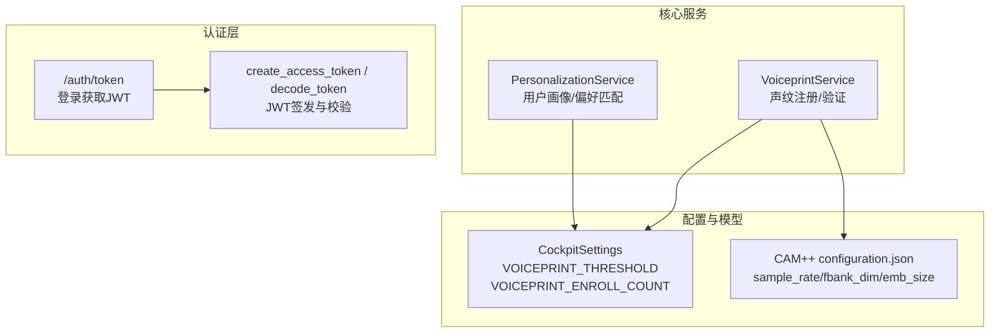
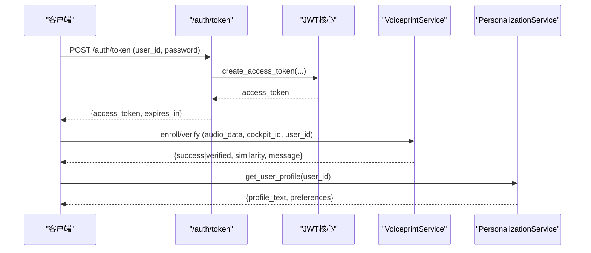
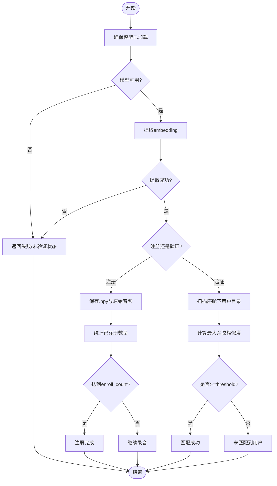
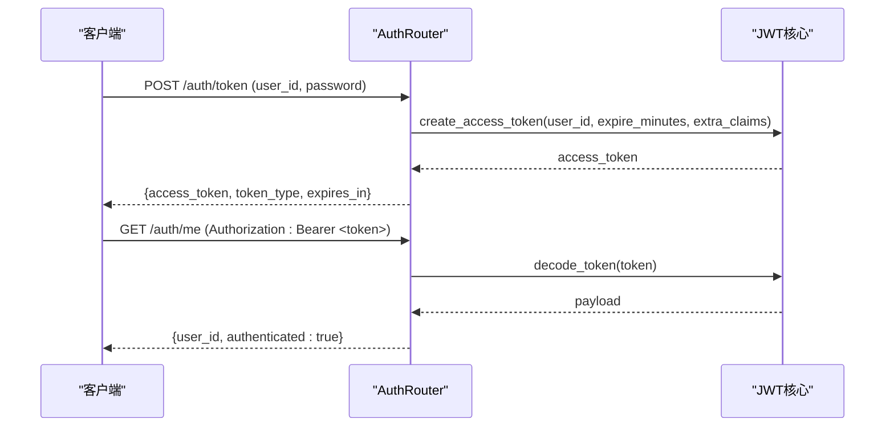
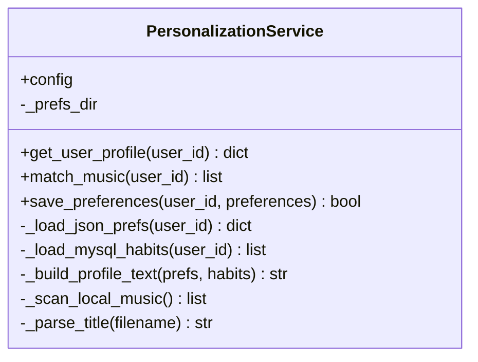
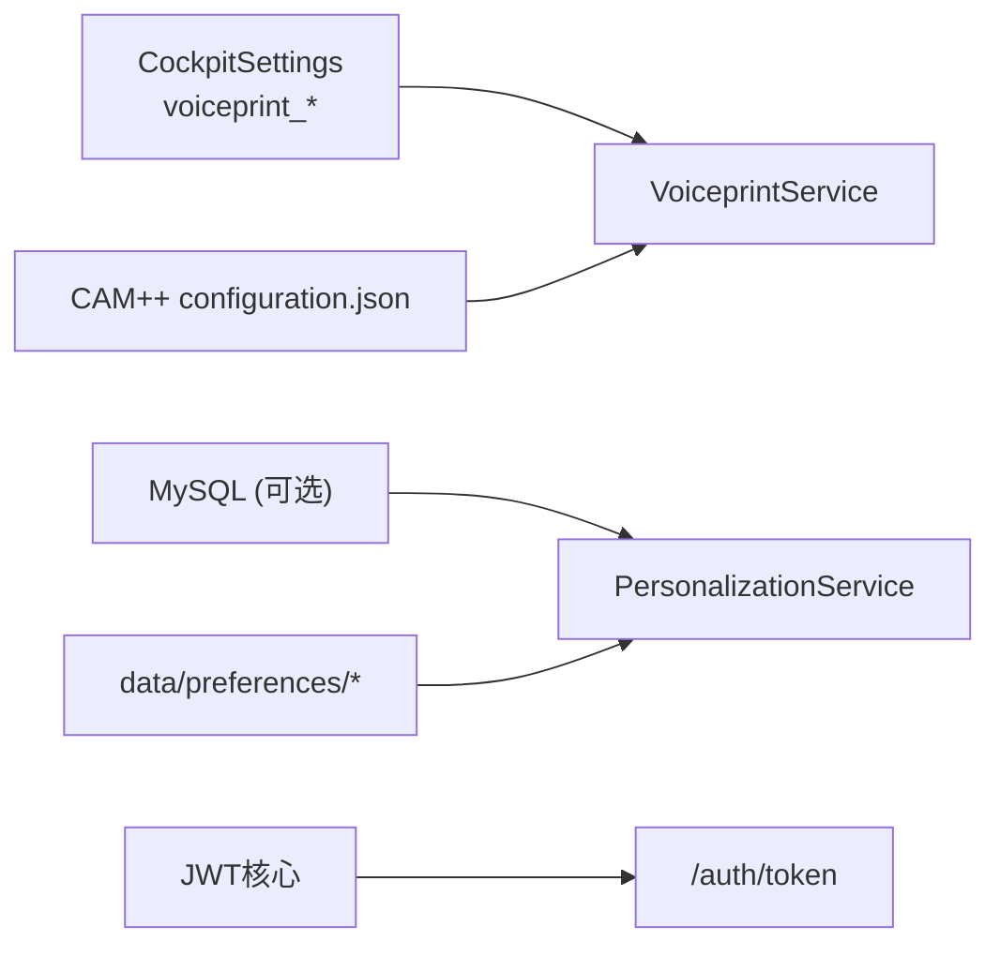

# 声纹识别与用户认证

<cite>
**本文引用的文件**   
- [voiceprint.py](file://backend_design/nexus/core/voiceprint.py)
- [auth.py](file://backend_design/nexus/api/routes/auth.py)
- [auth_core.py](file://backend_design/nexus/core/auth.py)
- [cockpit_config.py](file://backend_design/nexus/config/cockpit.py)
- [configuration.json](file://models/sv/cam_plus/configuration.json)
- [voiceprint-guide.md](file://docs/内部开发存档文档\语音技术文档\voiceprint-guide.md)
- [personalization.py](file://backend_design/nexus/core/personalization.py)
</cite>

## 目录
1. [引言](#引言)
2. [项目结构](#项目结构)
3. [核心组件](#核心组件)
4. [架构总览](#架构总览)
5. [详细组件分析](#详细组件分析)
6. [依赖关系分析](#依赖关系分析)
7. [性能考虑](#性能考虑)
8. [故障排查指南](#故障排查指南)
9. [结论](#结论)
10. [附录](#附录)

## 引言
本技术文档围绕 NexusCockpit 的声纹识别与用户认证模块，系统阐述基于 CAM++（3D-Speaker）的声纹识别方案，覆盖用户注册流程、声纹特征提取、身份验证算法、个性化服务匹配、声纹数据库管理、用户画像构建与隐私保护机制。同时给出准确率优化、抗干扰能力与防伪造策略，并提供集成新模型、配置阈值与管理用户声纹数据的实践指引。

## 项目结构
与声纹识别与认证相关的代码主要分布在以下位置：
- 核心服务：声纹服务 VoiceprintService、个性化服务 PersonalizationService
- 认证路由与 JWT：/auth/token、JWT 签发与校验
- 配置项：声纹阈值、注册次数、模型路径等
- 模型配置：CAM++ 模型元数据与参数

图表来源 
- [voiceprint.py:43-106](file://backend_design/nexus/core/voiceprint.py#L43-L106)
- [personalization.py:32-45](file://backend_design/nexus/core/personalization.py#L32-L45)
- [auth.py:48-77](file://backend_design/nexus/api/routes/auth.py#L48-L77)
- [auth_core.py:35-61](file://backend_design/nexus/core/auth.py#L35-L61)
- [cockpit_config.py:31-33](file://backend_design/nexus/config/cockpit.py#L31-L33)
- [configuration.json:1-17](file://models/sv/cam_plus/configuration.json#L1-L17)

章节来源
- [voiceprint.py:43-106](file://backend_design/nexus/core/voiceprint.py#L43-L106)
- [auth.py:48-77](file://backend_design/nexus/api/routes/auth.py#L48-L77)
- [auth_core.py:35-61](file://backend_design/nexus/core/auth.py#L35-L61)
- [cockpit_config.py:31-33](file://backend_design/nexus/config/cockpit.py#L31-L33)
- [configuration.json:1-17](file://models/sv/cam_plus/configuration.json#L1-L17)
- [personalization.py:32-45](file://backend_design/nexus/core/personalization.py#L32-L45)

## 核心组件
- VoiceprintService：负责声纹注册、验证、状态查询与删除；使用 CAM++ 模型通过 modelscope pipeline 加载并提取 embedding；按 cockpit_id/user_id 隔离存储 .npy 特征与原始音频；相似度计算采用余弦相似度，阈值由配置控制。
- PersonalizationService：根据 user_id 读取 JSON 偏好与 MySQL 习惯记录，构建用户画像文本注入 Prompt，并支持本地音乐库匹配。
- 认证路由与 JWT：/auth/token 签发 JWT；get_current_user 依赖校验 Token 并返回 user_id；支持可选认证 get_optional_user。
- 配置项：CockpitSettings 提供 voiceprint_threshold、voiceprint_enroll_count 等关键开关；CAM++ 模型配置包含采样率、fbank 维度与 embedding 大小。

章节来源
- [voiceprint.py:43-106](file://backend_design/nexus/core/voiceprint.py#L43-L106)
- [personalization.py:32-45](file://backend_design/nexus/core/personalization.py#L32-L45)
- [auth.py:48-77](file://backend_design/nexus/api/routes/auth.py#L48-L77)
- [auth_core.py:85-122](file://backend_design/nexus/core/auth.py#L85-L122)
- [cockpit_config.py:31-33](file://backend_design/nexus/config/cockpit.py#L31-L33)
- [configuration.json:1-17](file://models/sv/cam_plus/configuration.json#L1-L17)

## 架构总览
整体流程包括：客户端发起认证或声纹操作 → 路由层处理 → 核心服务执行 → 结果返回。声纹识别与认证解耦，但可在业务中串联：先声纹识别得到 user_id，再结合 JWT 进行权限控制与个性化服务。

图表来源 
- [auth.py:48-77](file://backend_design/nexus/api/routes/auth.py#L48-L77)
- [auth_core.py:35-61](file://backend_design/nexus/core/auth.py#L35-L61)
- [voiceprint.py:108-190](file://backend_design/nexus/core/voiceprint.py#L108-L190)
- [personalization.py:46-70](file://backend_design/nexus/core/personalization.py#L46-L70)

## 详细组件分析

### 声纹服务 VoiceprintService
- 模型加载：延迟加载 CAM++ 模型，优先从 modelscope pipeline 加载；若不可用则进入“mock 模式”并记录警告，避免返回假向量。
- 注册流程：对每次音频调用 _extract_embedding 生成 embedding，保存为 .npy 与原始音频；统计已注册条数，达到 enroll_count 即完成。
- 验证流程：提取待验证音频 embedding，遍历该座舱下所有用户的已注册 embedding，计算余弦相似度取最大值，超过 threshold 即视为匹配成功。
- 管理与状态：提供 get_status 查询各用户注册进度；delete_voiceprint 删除用户目录及数据。
- 相似度计算：归一化后点积等价于余弦相似度，空向量时返回 0.0。

图表来源 
- [voiceprint.py:62-93](file://backend_design/nexus/core/voiceprint.py#L62-L93)
- [voiceprint.py:108-190](file://backend_design/nexus/core/voiceprint.py#L108-L190)
- [voiceprint.py:192-269](file://backend_design/nexus/core/voiceprint.py#L192-L269)
- [voiceprint.py:322-370](file://backend_design/nexus/core/voiceprint.py#L322-L370)
- [voiceprint.py:372-388](file://backend_design/nexus/core/voiceprint.py#L372-L388)

章节来源
- [voiceprint.py:43-106](file://backend_design/nexus/core/voiceprint.py#L43-L106)
- [voiceprint.py:108-190](file://backend_design/nexus/core/voiceprint.py#L108-L190)
- [voiceprint.py:192-269](file://backend_design/nexus/core/voiceprint.py#L192-L269)
- [voiceprint.py:322-370](file://backend_design/nexus/core/voiceprint.py#L322-L370)
- [voiceprint.py:372-388](file://backend_design/nexus/core/voiceprint.py#L372-L388)

### 认证路由与 JWT
- /auth/token：在开发模式下直接签发 JWT，生产环境应接入用户数据库验证密码与角色。
- get_current_user：从 Authorization 头解析 Bearer Token，解码并校验，返回 user_id；未提供或无效时返回 401。
- get_optional_user：可选认证，Token 有效返回 user_id，否则返回 None，适用于聊天等非强制认证场景。

图表来源 
- [auth.py:48-77](file://backend_design/nexus/api/routes/auth.py#L48-L77)
- [auth_core.py:35-61](file://backend_design/nexus/core/auth.py#L35-L61)
- [auth_core.py:85-122](file://backend_design/nexus/core/auth.py#L85-L122)

章节来源
- [auth.py:48-77](file://backend_design/nexus/api/routes/auth.py#L48-L77)
- [auth_core.py:35-61](file://backend_design/nexus/core/auth.py#L35-L61)
- [auth_core.py:85-122](file://backend_design/nexus/core/auth.py#L85-L122)

### 个性化服务 PersonalizationService
- 用户画像构建：合并 JSON 偏好与 MySQL 习惯记录，生成 profile_text 注入 Prompt 的占位符。
- 音乐匹配：扫描 assets/audio/music/ 目录，按用户偏好的歌曲名模糊匹配，若无偏好则返回全部。
- 偏好保存：将用户偏好写入 data/preferences/{user_id}.json，维护 created_at/updated_at。

图表来源 
- [personalization.py:32-45](file://backend_design/nexus/core/personalization.py#L32-L45)
- [personalization.py:46-70](file://backend_design/nexus/core/personalization.py#L46-L70)
- [personalization.py:199-273](file://backend_design/nexus/core/personalization.py#L199-L273)
- [personalization.py:297-336](file://backend_design/nexus/core/personalization.py#L297-L336)

章节来源
- [personalization.py:32-45](file://backend_design/nexus/core/personalization.py#L32-L45)
- [personalization.py:46-70](file://backend_design/nexus/core/personalization.py#L46-L70)
- [personalization.py:199-273](file://backend_design/nexus/core/personalization.py#L199-L273)
- [personalization.py:297-336](file://backend_design/nexus/core/personalization.py#L297-L336)

### CAM++ 模型配置
- framework：pytorch
- task：speaker-verification
- model.type：campplus-sv
- model.model_config：sample_rate=16000，fbank_dim=80，emb_size=512
- model.pretrained_model：campplus_cn_3dspeaker.bin
- pipeline.type：speaker-verification

章节来源
- [configuration.json:1-17](file://models/sv/cam_plus/configuration.json#L1-L17)

## 依赖关系分析
- VoiceprintService 依赖 CockpitSettings 中的 voiceprint_threshold 与 voiceprint_enroll_count，以及 CAM++ 模型配置。
- PersonalizationService 依赖数据目录 preferences_dir 与 MySQL 连接池（可选）。
- 认证路由依赖 JWT 核心函数进行签发与校验。

图表来源 
- [cockpit_config.py:31-33](file://backend_design/nexus/config/cockpit.py#L31-L33)
- [configuration.json:1-17](file://models/sv/cam_plus/configuration.json#L1-L17)
- [personalization.py:103-142](file://backend_design/nexus/core/personalization.py#L103-L142)
- [auth_core.py:35-61](file://backend_design/nexus/core/auth.py#L35-L61)
- [auth.py:48-77](file://backend_design/nexus/api/routes/auth.py#L48-L77)

章节来源
- [cockpit_config.py:31-33](file://backend_design/nexus/config/cockpit.py#L31-L33)
- [configuration.json:1-17](file://models/sv/cam_plus/configuration.json#L1-L17)
- [personalization.py:103-142](file://backend_design/nexus/core/personalization.py#L103-L142)
- [auth_core.py:35-61](file://backend_design/nexus/core/auth.py#L35-L61)
- [auth.py:48-77](file://backend_design/nexus/api/routes/auth.py#L48-L77)

## 性能考虑
- 模型加载延迟：首次调用才加载 CAM++ 模型，减少启动开销。
- 特征缓存：可考虑对短音频的 embedding 做短时缓存（注意隐私），降低重复计算。
- I/O 优化：批量注册时合并写入，减少磁盘 I/O；必要时使用内存映射或异步写入。
- 相似度计算：余弦相似度已在向量层面高效实现，避免不必要的归一化重复计算。
- 资源限制：车载 CPU/GPU 资源有限，建议限制并发与队列长度，避免阻塞主线程。

[本节为通用指导，不直接分析具体文件]

## 故障排查指南
- 模型未加载：检查 modelscope 安装与 CAM++ 模型路径；日志会记录警告并回退到 mock 模式。
- 特征提取失败：确认音频格式与时长（建议不少于 3 秒）；查看临时文件创建与 torchaudio 加载异常。
- 阈值设置不当：调整 VOICEPRINT_THRESHOLD，过低易误识，过高易漏识；可通过 get_status 观察注册进度与相似度分布。
- 认证失败：检查 Authorization 头是否正确携带 Bearer Token；确认 secret_key 与算法一致；查看过期时间。
- 个性化数据缺失：确认 data/preferences/{user_id}.json 是否存在且可读；MySQL 连接是否正常。

章节来源
- [voiceprint.py:62-93](file://backend_design/nexus/core/voiceprint.py#L62-L93)
- [voiceprint.py:322-370](file://backend_design/nexus/core/voiceprint.py#L322-L370)
- [auth_core.py:64-83](file://backend_design/nexus/core/auth.py#L64-L83)
- [personalization.py:103-142](file://backend_design/nexus/core/personalization.py#L103-L142)

## 结论
NexusCockpit 的声纹识别与认证模块以 CAM++ 为核心，结合灵活的配置与清晰的职责划分，实现了安全的用户身份识别与个性化服务。通过合理的阈值与注册策略、完善的错误处理与日志记录，系统在车载环境下具备较好的可用性与可扩展性。后续可引入更丰富的质量评估指标与对抗样本检测，进一步提升准确率与安全性。

[本节为总结性内容，不直接分析具体文件]

## 附录

### 用户注册流程（批量注册）
- 步骤：多次录制音频（默认 3 次），每次调用 enroll 接口；服务端提取 embedding 并保存；当 enroll_count 达到配置值即完成。
- 建议：保证音频清晰、无背景噪声；必要时增加多次采集以提升鲁棒性。

章节来源
- [voiceprint.py:108-190](file://backend_design/nexus/core/voiceprint.py#L108-L190)
- [voiceprint-guide.md:33-44](file://docs/内部开发存档文档\语音技术文档\voiceprint-guide.md#L33-L44)

### 声纹质量评估
- 指标建议：信噪比（SNR）、语音时长、频谱稳定性、重放检测分数；可在 _extract_embedding 前后加入质量检测。
- 阈值校准：依据历史数据绘制 ROC 曲线，选择合适 threshold；定期评估 FAR/FRR。

[本节为通用指导，不直接分析具体文件]

### 抗干扰与防伪造策略
- 抗干扰：多段音频融合、动态阈值、噪声抑制预处理。
- 防伪造：重放检测、活体检测（如要求说话特定口令）、频域一致性检验。
- 安全存储：embedding 加密存储，访问控制与审计日志。

[本节为通用指导，不直接分析具体文件]

### 集成新声纹模型
- 替换模型路径：修改 _ensure_model 中的 model_path 指向新模型目录。
- 适配 pipeline：确保 modelscope pipeline 任务类型与模型兼容；必要时扩展 _extract_embedding 以适配不同输出。
- 更新配置：在 CockpitSettings 中新增或调整相关字段。

章节来源
- [voiceprint.py:62-93](file://backend_design/nexus/core/voiceprint.py#L62-L93)
- [cockpit_config.py:31-33](file://backend_design/nexus/config/cockpit.py#L31-L33)

### 配置识别阈值与管理用户声纹数据
- 阈值配置：VOICEPRINT_THRESHOLD 控制验证阈值；VOICEPRINT_ENROLL_COUNT 控制注册次数。
- 数据管理：使用 get_status 查询注册进度；delete_voiceprint 删除用户数据；确保按 cockpit_id/user_id 隔离。

章节来源
- [cockpit_config.py:31-33](file://backend_design/nexus/config/cockpit.py#L31-L33)
- [voiceprint.py:271-320](file://backend_design/nexus/core/voiceprint.py#L271-L320)

### 实际代码示例（路径引用）
- 注册声纹：参考 enroll 方法
  - [voiceprint.py:108-190](file://backend_design/nexus/core/voiceprint.py#L108-L190)
- 验证声纹：参考 verify 方法
  - [voiceprint.py:192-269](file://backend_design/nexus/core/voiceprint.py#L192-L269)
- 获取注册状态：参考 get_status 方法
  - [voiceprint.py:271-302](file://backend_design/nexus/core/voiceprint.py#L271-L302)
- 删除声纹数据：参考 delete_voiceprint 方法
  - [voiceprint.py:304-320](file://backend_design/nexus/core/voiceprint.py#L304-L320)
- 签发 JWT：参考 create_access_token
  - [auth_core.py:35-61](file://backend_design/nexus/core/auth.py#L35-L61)
- 校验 JWT：参考 get_current_user
  - [auth_core.py:85-122](file://backend_design/nexus/core/auth.py#L85-L122)
- 用户画像构建：参考 get_user_profile
  - [personalization.py:46-70](file://backend_design/nexus/core/personalization.py#L46-L70)