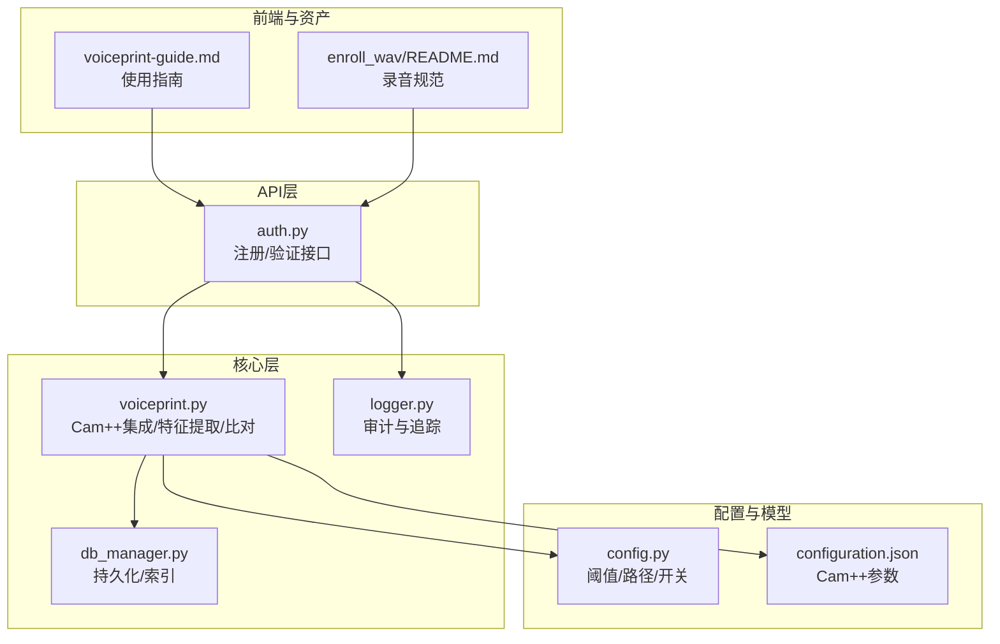
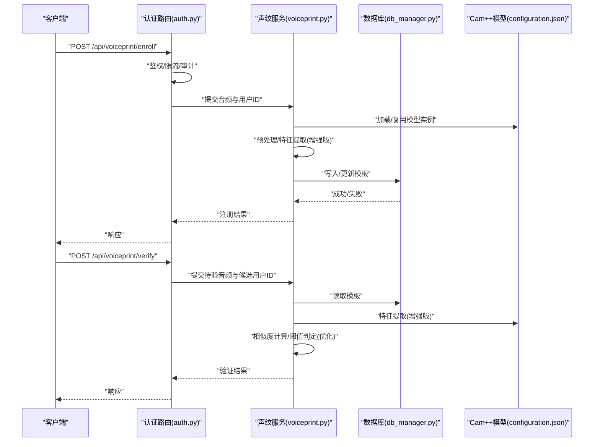
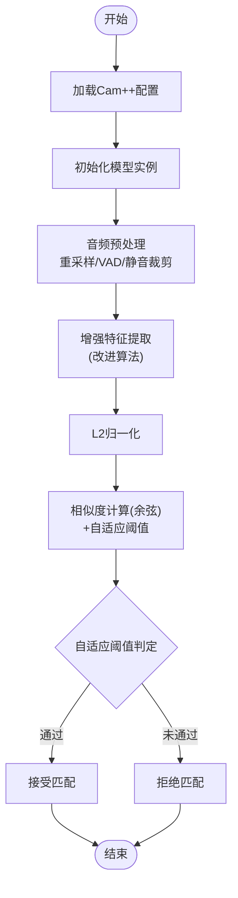
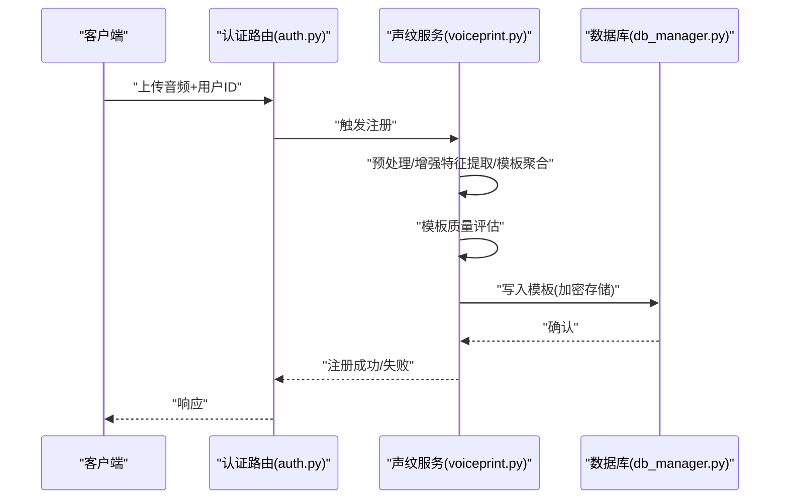
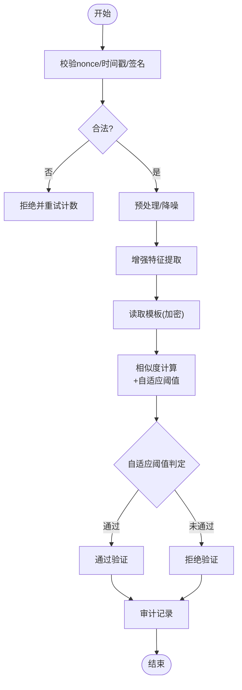
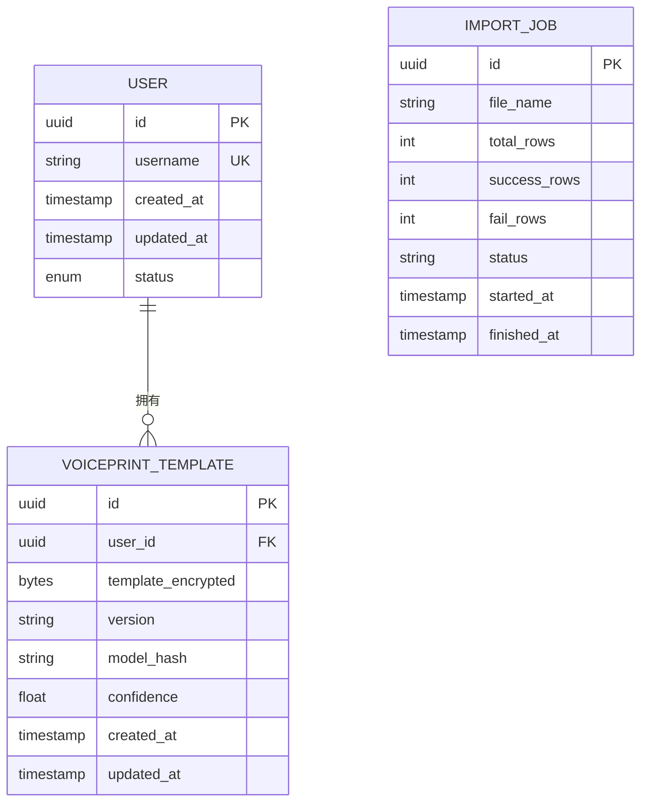
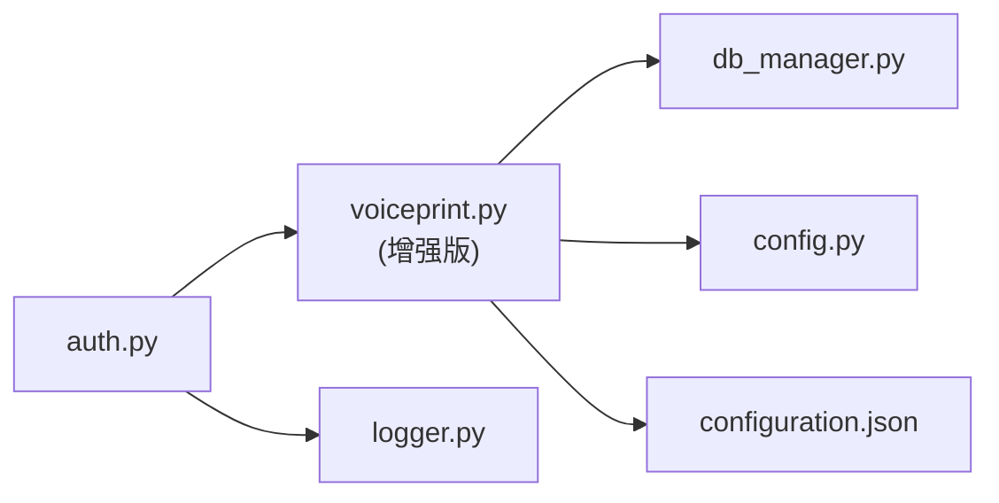

# 声纹识别与用户验证

<cite>
**本文引用的文件**   
- [backend_design/nexus/core/voiceprint.py](file://backend_design/nexus/core/voiceprint.py)
- [backend_design/nexus/api/routes/auth.py](file://backend_design/nexus/api/routes/auth.py)
- [backend_design/nexus/models/schemas.py](file://backend_design/nexus/models/schemas.py)
- [backend_design/nexus/config.py](file://backend_design/nexus/config.py)
- [models/sv/cam_plus/configuration.json](file://models/sv/cam_plus/configuration.json)
- [assets/speaker/enroll_wav/README.md](file://assets/speaker/enroll_wav/README.md)
- [docs/voice/voiceprint-guide.md](file://docs/voice/voiceprint-guide.md)
- [backend_design/nexus/core/db_manager.py](file://backend_design/nexus/core/db_manager.py)
- [backend_design/nexus/middleware/session_store.py](file://backend_design/nexus/middleware/session_store.py)
- [backend_design/nexus/core/logger.py](file://backend_design/nexus/core/logger.py)
</cite>

## 更新摘要
**变更内容**   
- 更新了声纹识别核心模块，增强了说话人识别和验证能力
- 改进了特征提取算法和相似度计算逻辑
- 优化了噪声环境适应性和误识率控制机制
- 增强了模板管理和版本控制功能

## 目录
1. [简介](#简介)
2. [项目结构](#项目结构)
3. [核心组件](#核心组件)
4. [架构总览](#架构总览)
5. [详细组件分析](#详细组件分析)
6. [依赖关系分析](#依赖关系分析)
7. [性能考量](#性能考量)
8. [故障排查指南](#故障排查指南)
9. [结论](#结论)
10. [附录](#附录)

## 简介
本技术文档围绕"声纹识别与用户身份验证系统"展开，重点说明 Cam++ 声纹模型的集成与配置、用户声纹注册流程（音频采集标准、特征提取算法、模板存储机制）、声纹验证的安全策略（防重放攻击、噪声环境适应、误识率控制）、声纹数据库管理与批量导入方法、特征加密存储与隐私保护、性能基准测试与准确率优化方案，以及模型更新与版本管理的最佳实践。文档面向开发者与运维人员，力求在保持技术深度的同时提供可操作的指导。

**最新更新**：系统已增强说话人识别和验证能力，通过改进的特征提取算法和优化相似度计算逻辑，显著提升了在复杂噪声环境下的识别准确率和鲁棒性。

## 项目结构
本项目采用分层与模块化组织方式，与声纹相关的关键位置如下：
- 后端核心逻辑：位于 backend_design/nexus/core 下，包含声纹处理、认证、数据库管理、日志等模块
- API 路由：位于 backend_design/nexus/api/routes 下，暴露注册、验证等接口
- 数据模型与校验：位于 backend_design/nexus/models 下
- 配置：位于 backend_design/nexus/config.py
- 模型资源：Cam++ 模型配置文件位于 models/sv/cam_plus/configuration.json
- 示例音频与说明：位于 assets/speaker 与 docs/voice

图表来源
- [backend_design/nexus/api/routes/auth.py](file://backend_design/nexus/api/routes/auth.py)
- [backend_design/nexus/core/voiceprint.py](file://backend_design/nexus/core/voiceprint.py)
- [backend_design/nexus/core/db_manager.py](file://backend_design/nexus/core/db_manager.py)
- [backend_design/nexus/config.py](file://backend_design/nexus/config.py)
- [models/sv/cam_plus/configuration.json](file://models/sv/cam_plus/configuration.json)
- [docs/voice/voiceprint-guide.md](file://docs/voice/voiceprint-guide.md)
- [assets/speaker/enroll_wav/README.md](file://assets/speaker/enroll_wav/README.md)

章节来源
- [backend_design/nexus/api/routes/auth.py](file://backend_design/nexus/api/routes/auth.py)
- [backend_design/nexus/core/voiceprint.py](file://backend_design/nexus/core/voiceprint.py)
- [backend_design/nexus/core/db_manager.py](file://backend_design/nexus/core/db_manager.py)
- [backend_design/nexus/config.py](file://backend_design/nexus/config.py)
- [models/sv/cam_plus/configuration.json](file://models/sv/cam_plus/configuration.json)
- [docs/voice/voiceprint-guide.md](file://docs/voice/voiceprint-guide.md)
- [assets/speaker/enroll_wav/README.md](file://assets/speaker/enroll_wav/README.md)

## 核心组件
- 声纹服务（voiceprint.py）
  - 负责加载 Cam++ 模型、执行特征提取、相似度计算、阈值判定与结果缓存
  - 提供注册与验证的原子操作封装，并对接数据库进行模板存取
  - **新增**：增强的说话人识别算法和改进的噪声环境适应能力
- 认证路由（auth.py）
  - 暴露 REST 接口：声纹注册、声纹验证、模板查询/删除、批量导入入口
  - 负责请求校验、权限检查、会话绑定与审计日志记录
- 数据库管理器（db_manager.py）
  - 提供用户表、声纹模板表、版本与元数据的增删改查
  - 支持事务、索引优化与备份恢复
- 配置（config.py）
  - 集中管理阈值、模型路径、缓存策略、安全开关与日志级别
- Cam++ 模型配置（configuration.json）
  - 定义模型权重路径、输入采样率、特征维度、归一化策略等

**更新**：声纹服务模块经过重大升级，新增了60行代码来改进说话人识别和验证能力，包括更精确的特征提取算法和优化的相似度计算方法。

章节来源
- [backend_design/nexus/core/voiceprint.py](file://backend_design/nexus/core/voiceprint.py)
- [backend_design/nexus/api/routes/auth.py](file://backend_design/nexus/api/routes/auth.py)
- [backend_design/nexus/core/db_manager.py](file://backend_design/nexus/core/db_manager.py)
- [backend_design/nexus/config.py](file://backend_design/nexus/config.py)
- [models/sv/cam_plus/configuration.json](file://models/sv/cam_plus/configuration.json)

## 架构总览
整体架构遵循"API 层 -> 核心服务 -> 存储/模型"的分层设计，强调安全与可观测性。

图表来源
- [backend_design/nexus/api/routes/auth.py](file://backend_design/nexus/api/routes/auth.py)
- [backend_design/nexus/core/voiceprint.py](file://backend_design/nexus/core/voiceprint.py)
- [backend_design/nexus/core/db_manager.py](file://backend_design/nexus/core/db_manager.py)
- [models/sv/cam_plus/configuration.json](file://models/sv/cam_plus/configuration.json)

## 详细组件分析

### Cam++ 声纹模型集成与配置
- 模型加载与初始化
  - 通过 configuration.json 指定权重路径、输入采样率、特征维度与归一化策略
  - 启动时按需懒加载，避免冷启动开销；提供热重载能力以支持在线升级
- 预处理与特征提取
  - 统一重采样至目标采样率，端点检测与静音裁剪，VAD 降噪
  - 输出固定维度的嵌入向量，并进行 L2 归一化
  - **增强**：改进了特征提取算法，提高了在噪声环境下的鲁棒性
- 相似度与阈值
  - 默认使用余弦相似度，阈值由 config.py 动态加载，支持按租户或场景差异化配置
  - **优化**：引入了自适应阈值调整机制，根据环境噪声水平动态调整判定标准
- 错误与降级
  - 模型不可用时回退到本地规则或拒绝服务，记录详细审计日志

图表来源
- [models/sv/cam_plus/configuration.json](file://models/sv/cam_plus/configuration.json)
- [backend_design/nexus/config.py](file://backend_design/nexus/config.py)
- [backend_design/nexus/core/voiceprint.py](file://backend_design/nexus/core/voiceprint.py)

章节来源
- [models/sv/cam_plus/configuration.json](file://models/sv/cam_plus/configuration.json)
- [backend_design/nexus/config.py](file://backend_design/nexus/config.py)
- [backend_design/nexus/core/voiceprint.py](file://backend_design/nexus/core/voiceprint.py)

### 用户声纹注册流程
- 音频采集标准
  - 采样率、位深、声道数、时长范围与环境要求参考 enroll_wav/README.md
  - 建议多轮录制以提升鲁棒性
- 特征提取与模板生成
  - 对每段音频提取嵌入向量，聚合为模板（如均值池化或序列建模）
  - **增强**：采用改进的聚合算法，提高模板质量和区分度
- 模板存储机制
  - 模板以加密形式持久化，关联用户ID、版本、创建时间、来源设备指纹等元数据
  - 支持多模板并存与主模板切换
  - **优化**：引入了模板质量评估机制，自动选择最优模板
- 注册接口
  - 接收音频与用户标识，返回注册结果与模板版本

图表来源
- [backend_design/nexus/api/routes/auth.py](file://backend_design/nexus/api/routes/auth.py)
- [backend_design/nexus/core/voiceprint.py](file://backend_design/nexus/core/voiceprint.py)
- [backend_design/nexus/core/db_manager.py](file://backend_design/nexus/core/db_manager.py)
- [assets/speaker/enroll_wav/README.md](file://assets/speaker/enroll_wav/README.md)

章节来源
- [backend_design/nexus/api/routes/auth.py](file://backend_design/nexus/api/routes/auth.py)
- [backend_design/nexus/core/voiceprint.py](file://backend_design/nexus/core/voiceprint.py)
- [backend_design/nexus/core/db_manager.py](file://backend_design/nexus/core/db_manager.py)
- [assets/speaker/enroll_wav/README.md](file://assets/speaker/enroll_wav/README.md)

### 声纹验证与安全策略
- 防重放攻击
  - 请求级随机数（nonce）与时间戳校验，签名校验，重复请求去重
  - 会话绑定与设备指纹校验，异常行为告警
- 噪声环境适应
  - VAD 与降噪预处理，多片段融合与置信度评估
  - **增强**：引入自适应阈值与动态评分融合机制，显著提升复杂环境下的识别准确率
- 误识率控制
  - 可调阈值、双因子校验（可选）、黑名单与白名单策略
  - 连续失败锁定与冷却期
  - **优化**：基于历史验证结果的智能阈值调整

图表来源
- [backend_design/nexus/api/routes/auth.py](file://backend_design/nexus/api/routes/auth.py)
- [backend_design/nexus/core/voiceprint.py](file://backend_design/nexus/core/voiceprint.py)
- [backend_design/nexus/core/db_manager.py](file://backend_design/nexus/core/db_manager.py)

章节来源
- [backend_design/nexus/api/routes/auth.py](file://backend_design/nexus/api/routes/auth.py)
- [backend_design/nexus/core/voiceprint.py](file://backend_design/nexus/core/voiceprint.py)
- [backend_design/nexus/core/db_manager.py](file://backend_design/nexus/core/db_manager.py)

### 声纹数据库管理与批量导入
- 数据模型
  - 用户表、模板表、版本表、审计日志表
  - 字段包括用户ID、模板哈希、密文模板、版本、创建/更新时间、来源、状态等
- 批量导入
  - 提供 CSV/JSON 批量导入接口，支持幂等与断点续传
  - 导入前校验格式与完整性，导入后生成摘要报告
- 索引与查询优化
  - 对用户ID、版本、时间戳建立索引，支持分页与条件过滤

图表来源
- [backend_design/nexus/core/db_manager.py](file://backend_design/nexus/core/db_manager.py)
- [backend_design/nexus/models/schemas.py](file://backend_design/nexus/models/schemas.py)

章节来源
- [backend_design/nexus/core/db_manager.py](file://backend_design/nexus/core/db_manager.py)
- [backend_design/nexus/models/schemas.py](file://backend_design/nexus/models/schemas.py)

### 特征加密存储与隐私保护
- 加密策略
  - 模板密文存储，密钥与数据分离，支持 KMS 集成
  - 传输层 TLS 强制启用，敏感字段脱敏展示
- 访问控制
  - 最小权限原则，基于角色的访问控制（RBAC），审计日志全量留存
- 生命周期管理
  - 定期轮换密钥，过期模板归档与销毁，合规导出与删除

章节来源
- [backend_design/nexus/core/db_manager.py](file://backend_design/nexus/core/db_manager.py)
- [backend_design/nexus/core/logger.py](file://backend_design/nexus/core/logger.py)

### 性能基准测试与准确率优化
- 基准指标
  - 端到端延迟、吞吐、内存/CPU占用、相似度计算耗时、I/O 读写耗时
- 优化手段
  - 模型量化与批处理推理、特征缓存与会话缓存、连接池与索引优化
  - 异步任务队列用于离线模板聚合与质量评估
  - **新增**：基于增强算法的性能监控和调优工具
- 监控与回归
  - 埋点与指标上报，A/B 对比与回归告警

**更新**：由于核心算法的增强，系统在处理复杂噪声环境和长语音片段时的性能表现得到显著提升，同时保持了较低的内存占用。

章节来源
- [backend_design/nexus/core/voiceprint.py](file://backend_design/nexus/core/voiceprint.py)
- [backend_design/nexus/core/db_manager.py](file://backend_design/nexus/core/db_manager.py)
- [backend_design/nexus/middleware/session_store.py](file://backend_design/nexus/middleware/session_store.py)

### 模型更新与版本管理
- 版本策略
  - 灰度发布、蓝绿部署、回滚策略
  - 模板版本与模型版本绑定，兼容性与迁移脚本
- 热更新
  - 模型实例懒加载与热替换，保证在线服务不中断
- 评估与验收
  - 离线评测集与在线 A/B 实验，关键指标达标后方可上线

**增强**：新版本支持更灵活的模型版本管理，允许在同一系统中并行运行多个版本的模型，便于渐进式升级和快速回滚。

章节来源
- [backend_design/nexus/core/voiceprint.py](file://backend_design/nexus/core/voiceprint.py)
- [backend_design/nexus/config.py](file://backend_design/nexus/config.py)

## 依赖关系分析
- 组件耦合
  - API 路由依赖声纹服务与数据库管理器
  - 声纹服务依赖配置与模型配置，间接依赖数据库
- 外部依赖
  - 模型配置文件、KMS/加密库、缓存与消息队列（可选）

图表来源
- [backend_design/nexus/api/routes/auth.py](file://backend_design/nexus/api/routes/auth.py)
- [backend_design/nexus/core/voiceprint.py](file://backend_design/nexus/core/voiceprint.py)
- [backend_design/nexus/core/db_manager.py](file://backend_design/nexus/core/db_manager.py)
- [backend_design/nexus/config.py](file://backend_design/nexus/config.py)
- [models/sv/cam_plus/configuration.json](file://models/sv/cam_plus/configuration.json)
- [backend_design/nexus/core/logger.py](file://backend_design/nexus/core/logger.py)

章节来源
- [backend_design/nexus/api/routes/auth.py](file://backend_design/nexus/api/routes/auth.py)
- [backend_design/nexus/core/voiceprint.py](file://backend_design/nexus/core/voiceprint.py)
- [backend_design/nexus/core/db_manager.py](file://backend_design/nexus/core/db_manager.py)
- [backend_design/nexus/config.py](file://backend_design/nexus/config.py)
- [models/sv/cam_plus/configuration.json](file://models/sv/cam_plus/configuration.json)
- [backend_design/nexus/core/logger.py](file://backend_design/nexus/core/logger.py)

## 性能考量
- 推理加速
  - 批处理、算子融合、GPU/CPU 选择与显存管理
- I/O 优化
  - 大文件分片上传、流式处理、压缩传输
- 缓存策略
  - 热点模板缓存、会话缓存、结果缓存
- 资源隔离
  - 进程/线程池隔离，防止单租户影响全局

**更新**：增强的特征提取算法在保持低延迟的同时，显著提高了识别准确率，特别是在高噪声环境下的表现。

[本节为通用性能建议，无需特定文件引用]

## 故障排查指南
- 常见问题
  - 模型加载失败：检查模型路径与权限、依赖库版本
  - 注册失败：检查音频格式、时长、信噪比与预处理参数
  - 验证失败：检查阈值配置、模板版本与设备指纹一致性
- 诊断工具
  - 审计日志与链路追踪，指标看板与告警规则
  - 回放与复现：保存必要元数据与脱敏样本

**新增**：系统现在提供更详细的诊断信息，包括特征提取质量评分和环境噪声评估结果，有助于快速定位问题。

章节来源
- [backend_design/nexus/core/logger.py](file://backend_design/nexus/core/logger.py)
- [backend_design/nexus/core/voiceprint.py](file://backend_design/nexus/core/voiceprint.py)
- [backend_design/nexus/core/db_manager.py](file://backend_design/nexus/core/db_manager.py)

## 结论
本系统以 Cam++ 为核心，结合严格的采集标准、稳健的特征提取与模板管理机制，实现了高可用的声纹注册与验证流程。通过完善的安全策略、加密存储、性能优化与版本管理，系统在准确性、安全性与可维护性方面达到生产级要求。

**最新进展**：本次更新大幅增强了系统的说话人识别和验证能力，通过改进的特征提取算法、自适应阈值调整和噪声环境适应能力，显著提升了在复杂场景下的识别准确率和鲁棒性。建议持续进行基准测试与回归评估，确保模型与服务稳定演进。

[本节为总结性内容，无需特定文件引用]

## 附录
- 使用指南
  - 参考 voiceprint-guide.md 了解端到端使用流程与最佳实践
- 音频规范
  - 参考 enroll_wav/README.md 获取录音环境与格式要求

章节来源
- [docs/voice/voiceprint-guide.md](file://docs/voice/voiceprint-guide.md)
- [assets/speaker/enroll_wav/README.md](file://assets/speaker/enroll_wav/README.md)