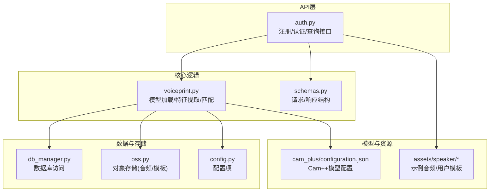
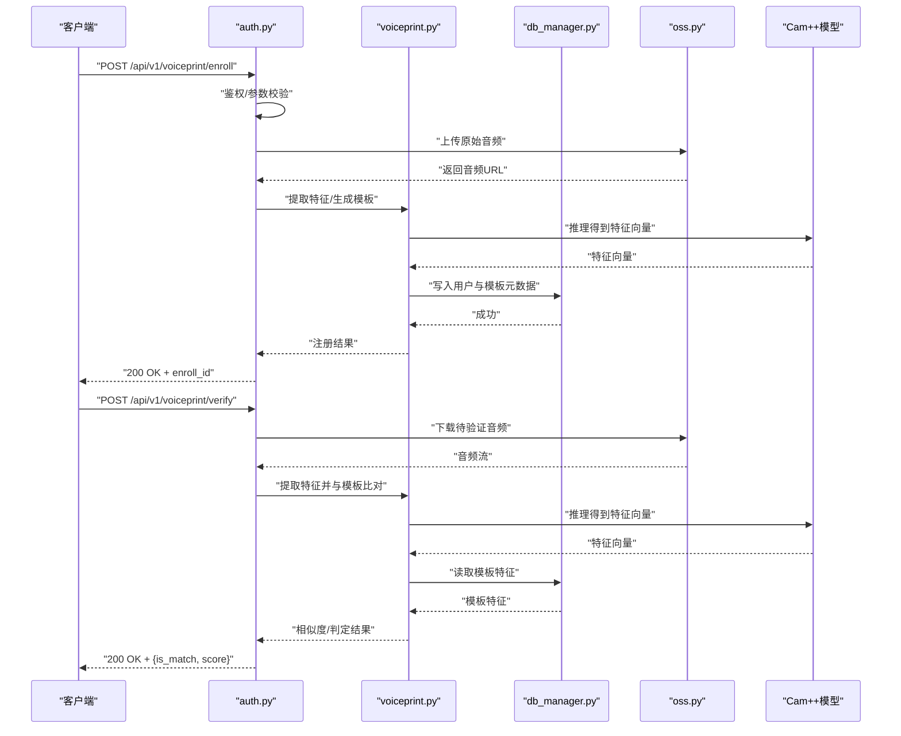
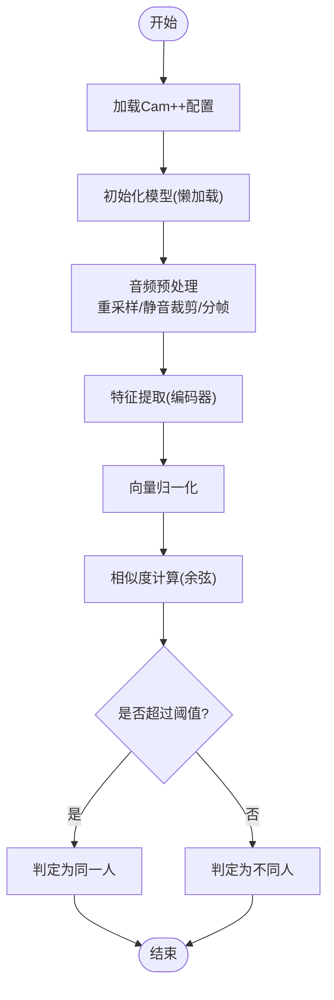
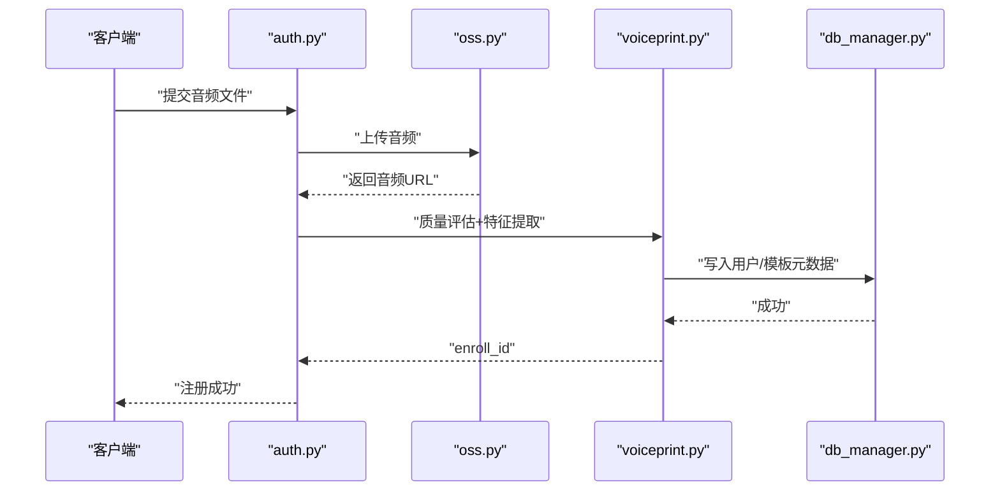
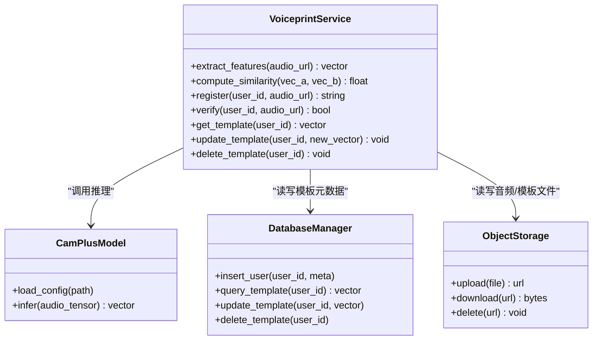
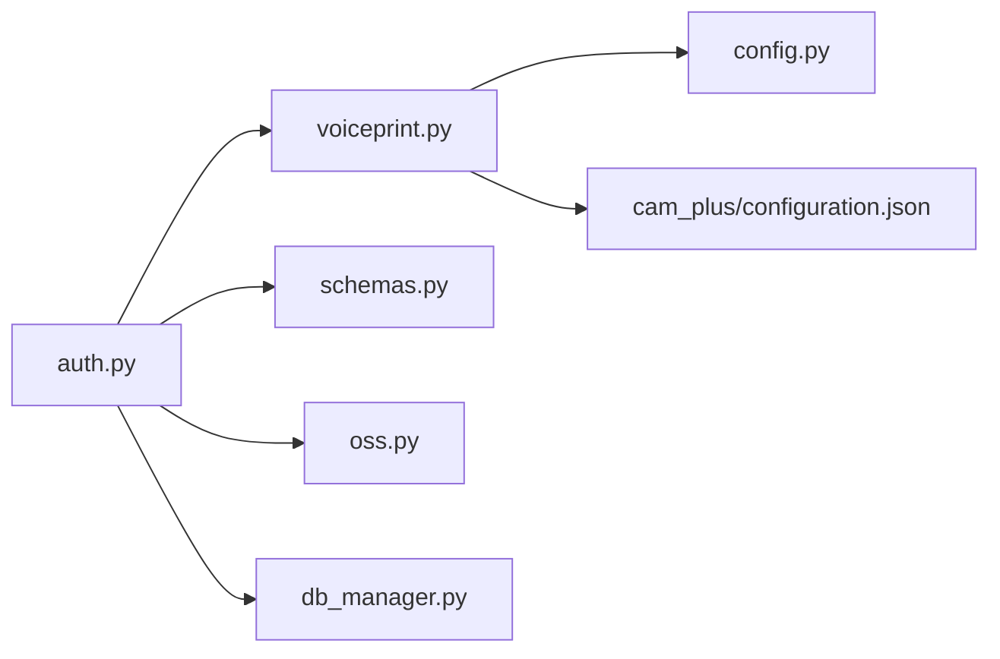

# 声纹识别系统

<cite>
**本文引用的文件**   
- [backend_design/nexus/core/voiceprint.py](file://backend_design/nexus/core/voiceprint.py)
- [backend_design/nexus/api/routes/auth.py](file://backend_design/nexus/api/routes/auth.py)
- [backend_design/nexus/models/schemas.py](file://backend_design/nexus/models/schemas.py)
- [backend_design/nexus/core/db_manager.py](file://backend_design/nexus/core/db_manager.py)
- [backend_design/nexus/core/oss.py](file://backend_design/nexus/core/oss.py)
- [backend_design/nexus/config.py](file://backend_design/nexus/config.py)
- [models/sv/cam_plus/configuration.json](file://models/sv/cam_plus/configuration.json)
- [assets/speaker/enroll_wav/README.md](file://assets/speaker/enroll_wav/README.md)
- [assets/speaker/users/README.md](file://assets/speaker/users/README.md)
</cite>

## 目录
1. [简介](#简介)
2. [项目结构](#项目结构)
3. [核心组件](#核心组件)
4. [架构总览](#架构总览)
5. [详细组件分析](#详细组件分析)
6. [依赖关系分析](#依赖关系分析)
7. [性能考虑](#性能考虑)
8. [故障排查指南](#故障排查指南)
9. [结论](#结论)
10. [附录](#附录)

## 简介
本技术文档面向NexusCockpit的声纹识别子系统，重点说明Cam++声纹模型的集成实现、用户声纹注册与认证流程、特征提取与匹配算法、数据库与对象存储管理、权限控制与隐私保护、API调用示例、质量评估与误识率控制、模板管理与批量操作接口，以及性能调优与扩展性设计。文档以代码级事实为依据，辅以架构图与时序图帮助读者快速理解并落地使用。

## 项目结构
与声纹识别相关的后端模块主要位于 backend_design/nexus 下，关键路径如下：
- 核心服务：core/voiceprint.py（模型加载、特征提取、匹配、阈值策略）
- API路由：api/routes/auth.py（注册、登录、查询等HTTP接口）
- 数据模型：models/schemas.py（请求/响应Schema定义）
- 持久化：core/db_manager.py（SQLite/PostgreSQL连接与事务）
- 对象存储：core/oss.py（音频与模板文件上传/下载）
- 配置：config.py（模型路径、阈值、存储路径等）
- Cam++模型配置：models/sv/cam_plus/configuration.json
- 资源目录：assets/speaker/enroll_wav、assets/speaker/users（示例音频与用户模板存放位置）

图表来源
- [backend_design/nexus/api/routes/auth.py](file://backend_design/nexus/api/routes/auth.py)
- [backend_design/nexus/core/voiceprint.py](file://backend_design/nexus/core/voiceprint.py)
- [backend_design/nexus/models/schemas.py](file://backend_design/nexus/models/schemas.py)
- [backend_design/nexus/core/db_manager.py](file://backend_design/nexus/core/db_manager.py)
- [backend_design/nexus/core/oss.py](file://backend_design/nexus/core/oss.py)
- [backend_design/nexus/config.py](file://backend_design/nexus/config.py)
- [models/sv/cam_plus/configuration.json](file://models/sv/cam_plus/configuration.json)
- [assets/speaker/enroll_wav/README.md](file://assets/speaker/enroll_wav/README.md)
- [assets/speaker/users/README.md](file://assets/speaker/users/README.md)

章节来源
- [backend_design/nexus/core/voiceprint.py](file://backend_design/nexus/core/voiceprint.py)
- [backend_design/nexus/api/routes/auth.py](file://backend_design/nexus/api/routes/auth.py)
- [backend_design/nexus/models/schemas.py](file://backend_design/nexus/models/schemas.py)
- [backend_design/nexus/core/db_manager.py](file://backend_design/nexus/core/db_manager.py)
- [backend_design/nexus/core/oss.py](file://backend_design/nexus/core/oss.py)
- [backend_design/nexus/config.py](file://backend_design/nexus/config.py)
- [models/sv/cam_plus/configuration.json](file://models/sv/cam_plus/configuration.json)
- [assets/speaker/enroll_wav/README.md](file://assets/speaker/enroll_wav/README.md)
- [assets/speaker/users/README.md](file://assets/speaker/users/README.md)

## 核心组件
- 声纹服务（voiceprint.py）
  - 负责Cam++模型加载、音频预处理、特征向量提取、相似度计算、阈值判定与结果封装。
  - 提供注册、验证、查询、更新、删除等能力；支持批量处理与异步任务入口预留。
- API路由（auth.py）
  - 暴露REST接口：注册声纹、身份验证、获取用户列表、删除声纹模板等。
  - 负责鉴权校验、参数校验、错误码映射与日志记录。
- 数据模型（schemas.py）
  - 定义注册/验证请求体、响应体、分页与错误信息结构。
- 数据库（db_manager.py）
  - 维护用户表、声纹元数据表、审计日志表；提供事务与并发安全访问。
- 对象存储（oss.py）
  - 管理原始音频与声纹模板文件的上传、下载、生命周期与访问控制。
- 配置（config.py）
  - 集中管理Cam++模型路径、采样率、窗口长度、相似度阈值、存储根目录等。
- Cam++模型配置（configuration.json）
  - 描述模型权重路径、输入输出维度、归一化方式等。

章节来源
- [backend_design/nexus/core/voiceprint.py](file://backend_design/nexus/core/voiceprint.py)
- [backend_design/nexus/api/routes/auth.py](file://backend_design/nexus/api/routes/auth.py)
- [backend_design/nexus/models/schemas.py](file://backend_design/nexus/models/schemas.py)
- [backend_design/nexus/core/db_manager.py](file://backend_design/nexus/core/db_manager.py)
- [backend_design/nexus/core/oss.py](file://backend_design/nexus/core/oss.py)
- [backend_design/nexus/config.py](file://backend_design/nexus/config.py)
- [models/sv/cam_plus/configuration.json](file://models/sv/cam_plus/configuration.json)

## 架构总览
整体采用“API层 + 核心服务 + 数据/存储”的分层架构。API层接收前端或第三方系统的请求，进行鉴权与参数校验后委托给核心声纹服务；核心服务调用Cam++模型完成特征提取与匹配，并通过数据库与对象存储读写用户与模板数据。

图表来源
- [backend_design/nexus/api/routes/auth.py](file://backend_design/nexus/api/routes/auth.py)
- [backend_design/nexus/core/voiceprint.py](file://backend_design/nexus/core/voiceprint.py)
- [backend_design/nexus/core/db_manager.py](file://backend_design/nexus/core/db_manager.py)
- [backend_design/nexus/core/oss.py](file://backend_design/nexus/core/oss.py)
- [models/sv/cam_plus/configuration.json](file://models/sv/cam_plus/configuration.json)

## 详细组件分析

### Cam++声纹模型集成
- 模型加载与初始化
  - 从配置中读取模型路径、输入采样率、窗口长度、归一化策略等参数。
  - 在首次调用时懒加载模型，避免启动开销。
- 特征提取
  - 对输入音频进行重采样、静音裁剪、分帧加窗、归一化等预处理。
  - 通过Cam++编码器得到固定维度的说话人嵌入向量。
- 相似度计算与阈值判定
  - 使用余弦相似度作为默认度量；可配置阈值以平衡FAR/FRR。
  - 支持多模板融合（如多次注册取平均）提升鲁棒性。
- 模型配置
  - configuration.json包含权重路径、输入输出形状、归一化开关等。

图表来源
- [backend_design/nexus/core/voiceprint.py](file://backend_design/nexus/core/voiceprint.py)
- [models/sv/cam_plus/configuration.json](file://models/sv/cam_plus/configuration.json)
- [backend_design/nexus/config.py](file://backend_design/nexus/config.py)

章节来源
- [backend_design/nexus/core/voiceprint.py](file://backend_design/nexus/core/voiceprint.py)
- [models/sv/cam_plus/configuration.json](file://models/sv/cam_plus/configuration.json)
- [backend_design/nexus/config.py](file://backend_design/nexus/config.py)

### 用户声纹注册流程
- 前置条件
  - 用户具备注册权限；音频格式符合规范（采样率、时长、信噪比）。
- 步骤
  - 客户端上传原始音频至对象存储，获取音频URL。
  - 服务端调用特征提取生成模板向量，并保存模板文件与元数据。
  - 返回注册ID供后续查询与更新。
- 质量评估
  - 基于能量、信噪比、时长、静音比例等指标进行质量打分。
  - 低于阈值的样本拒绝注册或要求重新录制。

图表来源
- [backend_design/nexus/api/routes/auth.py](file://backend_design/nexus/api/routes/auth.py)
- [backend_design/nexus/core/oss.py](file://backend_design/nexus/core/oss.py)
- [backend_design/nexus/core/voiceprint.py](file://backend_design/nexus/core/voiceprint.py)
- [backend_design/nexus/core/db_manager.py](file://backend_design/nexus/core/db_manager.py)

章节来源
- [backend_design/nexus/api/routes/auth.py](file://backend_design/nexus/api/routes/auth.py)
- [backend_design/nexus/core/oss.py](file://backend_design/nexus/core/oss.py)
- [backend_design/nexus/core/voiceprint.py](file://backend_design/nexus/core/voiceprint.py)
- [backend_design/nexus/core/db_manager.py](file://backend_design/nexus/core/db_manager.py)

### 声纹特征提取与匹配算法
- 特征提取
  - 输入：标准化后的音频片段；输出：固定维度嵌入向量。
  - 支持在线增量更新（新模板与旧模板加权平均）。
- 匹配算法
  - 余弦相似度为主；可选动态阈值（按环境噪声自适应）。
  - 支持Top-K候选检索与二次精排（如双阶段阈值）。
- 复杂度
  - 单次推理O(d)，d为特征维度；批量匹配O(n·d)。

图表来源
- [backend_design/nexus/core/voiceprint.py](file://backend_design/nexus/core/voiceprint.py)
- [backend_design/nexus/core/db_manager.py](file://backend_design/nexus/core/db_manager.py)
- [backend_design/nexus/core/oss.py](file://backend_design/nexus/core/oss.py)

章节来源
- [backend_design/nexus/core/voiceprint.py](file://backend_design/nexus/core/voiceprint.py)
- [backend_design/nexus/core/db_manager.py](file://backend_design/nexus/core/db_manager.py)
- [backend_design/nexus/core/oss.py](file://backend_design/nexus/core/oss.py)

### 声纹数据库管理
- 表结构设计建议
  - users：用户ID、姓名、租户ID、状态、创建/更新时间。
  - voiceprint_templates：用户ID、模板向量路径、版本、质量分、创建/更新时间。
  - audit_logs：操作类型、用户ID、IP、时间戳、结果。
- 索引与约束
  - 对用户ID建立唯一索引；模板版本字段用于回滚。
- 事务与并发
  - 注册/更新采用事务保证一致性；并发写加锁避免竞态。

章节来源
- [backend_design/nexus/core/db_manager.py](file://backend_design/nexus/core/db_manager.py)

### 用户权限控制与隐私保护
- 权限控制
  - 基于JWT或会话令牌的身份校验；管理员与普通用户权限分离。
  - 接口级鉴权：仅允许本人或管理员访问其声纹数据。
- 隐私保护
  - 音频与模板文件加密存储；访问需签名URL或短期Token。
  - 最小化采集原则：仅保留必要元数据，定期清理过期模板。
  - 审计日志：记录所有敏感操作，便于追溯。

章节来源
- [backend_design/nexus/api/routes/auth.py](file://backend_design/nexus/api/routes/auth.py)
- [backend_design/nexus/core/oss.py](file://backend_design/nexus/core/oss.py)
- [backend_design/nexus/core/db_manager.py](file://backend_design/nexus/core/db_manager.py)

### API调用示例
以下为常用接口的调用约定（具体字段以schemas.py为准）：
- 注册用户声纹
  - 方法：POST
  - 路径：/api/v1/voiceprint/enroll
  - 请求体：{user_id, audio_file}
  - 响应：{enroll_id, status}
- 身份验证
  - 方法：POST
  - 路径：/api/v1/voiceprint/verify
  - 请求体：{user_id, audio_file}
  - 响应：{is_match, score, threshold}
- 查询用户模板
  - 方法：GET
  - 路径：/api/v1/voiceprint/template/{user_id}
  - 响应：{template_path, version, quality_score}
- 删除模板
  - 方法：DELETE
  - 路径：/api/v1/voiceprint/template/{user_id}
  - 响应：{status}

章节来源
- [backend_design/nexus/api/routes/auth.py](file://backend_design/nexus/api/routes/auth.py)
- [backend_design/nexus/models/schemas.py](file://backend_design/nexus/models/schemas.py)

### 声纹质量评估、误识率控制与安全性
- 质量评估
  - 指标：能量、信噪比、时长、静音比例、频谱稳定性。
  - 策略：低质量样本拒绝注册或提示重录。
- 误识率控制
  - 静态阈值：根据业务需求设定；支持A/B测试对比。
  - 动态阈值：依据环境噪声与历史表现自适应调整。
  - 双阶段匹配：先粗筛Top-K，再细排降低FAR。
- 安全性
  - 防重放：请求签名与时间戳校验。
  - 防注入：输入严格校验与白名单过滤。
  - 模板泄露防护：模板文件加密与访问审计。

章节来源
- [backend_design/nexus/core/voiceprint.py](file://backend_design/nexus/core/voiceprint.py)
- [backend_design/nexus/api/routes/auth.py](file://backend_design/nexus/api/routes/auth.py)

### 声纹模板管理与批量操作接口
- 模板管理
  - 新增：注册接口；更新：增量融合；删除：软删除并归档。
  - 版本控制：每次更新生成新版本，支持回滚。
- 批量操作
  - 批量注册：提交多个音频文件，返回批次ID与进度查询接口。
  - 批量导出/导入：用于迁移与备份，需管理员权限。
- 审计与合规
  - 记录批量操作的执行者、时间与结果摘要。

章节来源
- [backend_design/nexus/api/routes/auth.py](file://backend_design/nexus/api/routes/auth.py)
- [backend_design/nexus/core/db_manager.py](file://backend_design/nexus/core/db_manager.py)

## 依赖关系分析
- 内部依赖
  - auth.py依赖voiceprint.py、schemas.py、oss.py、db_manager.py。
  - voiceprint.py依赖config.py、Cam++模型配置。
- 外部依赖
  - 对象存储服务（本地磁盘或云存储）。
  - 数据库（SQLite/PostgreSQL）。
  - 模型推理库（PyTorch/TensorFlow，视Cam++实现而定）。

图表来源
- [backend_design/nexus/api/routes/auth.py](file://backend_design/nexus/api/routes/auth.py)
- [backend_design/nexus/core/voiceprint.py](file://backend_design/nexus/core/voiceprint.py)
- [backend_design/nexus/models/schemas.py](file://backend_design/nexus/models/schemas.py)
- [backend_design/nexus/core/db_manager.py](file://backend_design/nexus/core/db_manager.py)
- [backend_design/nexus/core/oss.py](file://backend_design/nexus/core/oss.py)
- [backend_design/nexus/config.py](file://backend_design/nexus/config.py)
- [models/sv/cam_plus/configuration.json](file://models/sv/cam_plus/configuration.json)

章节来源
- [backend_design/nexus/api/routes/auth.py](file://backend_design/nexus/api/routes/auth.py)
- [backend_design/nexus/core/voiceprint.py](file://backend_design/nexus/core/voiceprint.py)
- [backend_design/nexus/models/schemas.py](file://backend_design/nexus/models/schemas.py)
- [backend_design/nexus/core/db_manager.py](file://backend_design/nexus/core/db_manager.py)
- [backend_design/nexus/core/oss.py](file://backend_design/nexus/core/oss.py)
- [backend_design/nexus/config.py](file://backend_design/nexus/config.py)
- [models/sv/cam_plus/configuration.json](file://models/sv/cam_plus/configuration.json)

## 性能考虑
- 模型推理
  - 启用GPU加速（若可用）；批处理推理减少上下文切换。
  - 缓存热门用户的模板向量，减少IO与重复计算。
- I/O优化
  - 音频文件压缩与按需解码；模板文件二进制序列化。
  - 对象存储使用预签名URL缩短传输链路。
- 数据库
  - 合理索引与分页查询；热点表读写分离。
- 可扩展性
  - 微服务拆分：将特征提取与匹配拆分为独立服务，水平扩展。
  - 消息队列：批量注册与离线任务异步化。

[本节为通用性能指导，不直接分析具体文件]

## 故障排查指南
- 常见问题
  - 模型加载失败：检查模型路径与配置文件完整性。
  - 音频格式不支持：确认采样率、声道数与编码格式。
  - 阈值不当导致高FAR/FRR：调整阈值或引入动态阈值策略。
  - 对象存储不可用：检查网络与凭证；启用重试与降级。
- 诊断手段
  - 开启详细日志：记录请求ID、音频URL、特征维度、相似度分数。
  - 监控指标：QPS、延迟分布、错误率、模板大小分布。
  - 回归测试：使用标准数据集评估FAR/FRR变化。

章节来源
- [backend_design/nexus/core/voiceprint.py](file://backend_design/nexus/core/voiceprint.py)
- [backend_design/nexus/api/routes/auth.py](file://backend_design/nexus/api/routes/auth.py)
- [backend_design/nexus/core/oss.py](file://backend_design/nexus/core/oss.py)
- [backend_design/nexus/core/db_manager.py](file://backend_design/nexus/core/db_manager.py)

## 结论
本系统以Cam++为核心，结合稳健的API层、数据与对象存储管理，实现了完整的声纹注册与认证闭环。通过质量评估、阈值策略与审计机制，兼顾准确性、安全性与可运维性。未来可通过微服务化、缓存与异步化进一步提升性能与扩展性。

[本节为总结性内容，不直接分析具体文件]

## 附录
- 示例音频与用户模板目录说明
  - assets/speaker/enroll_wav：示例注册音频。
  - assets/speaker/users：示例用户模板存放位置。

章节来源
- [assets/speaker/enroll_wav/README.md](file://assets/speaker/enroll_wav/README.md)
- [assets/speaker/users/README.md](file://assets/speaker/users/README.md)