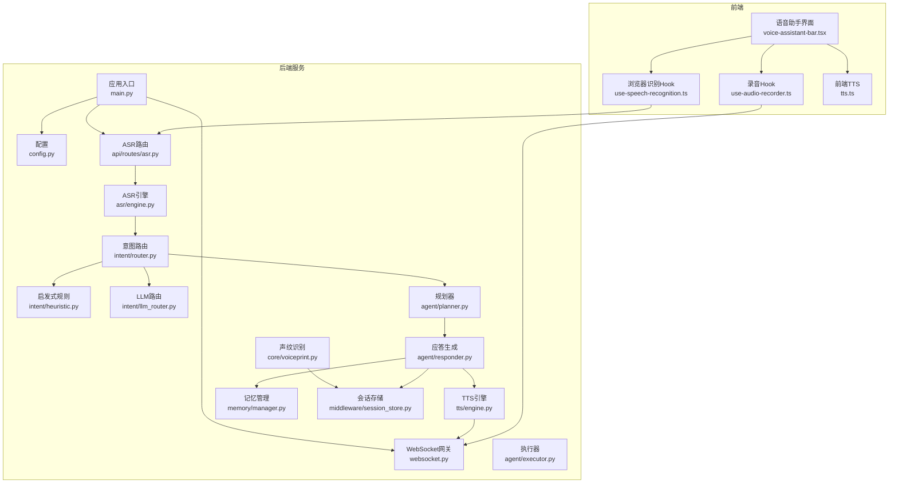
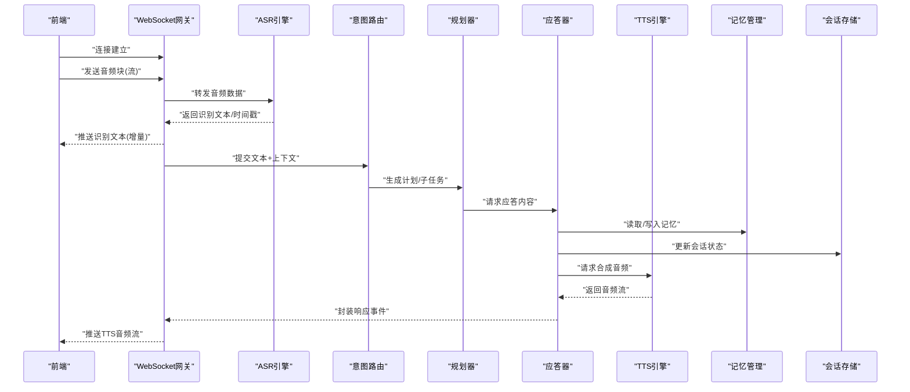
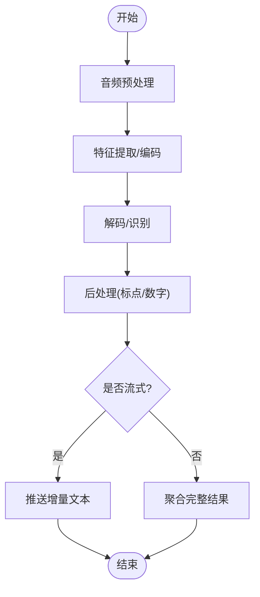
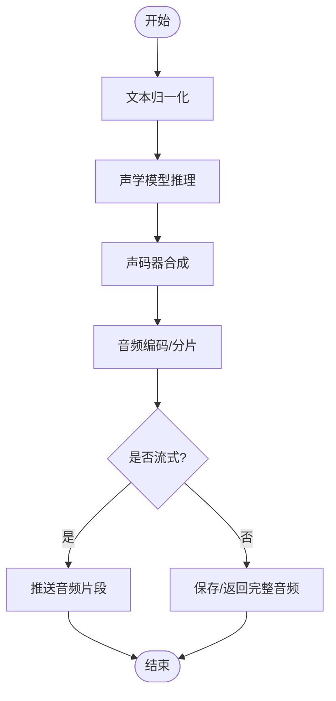
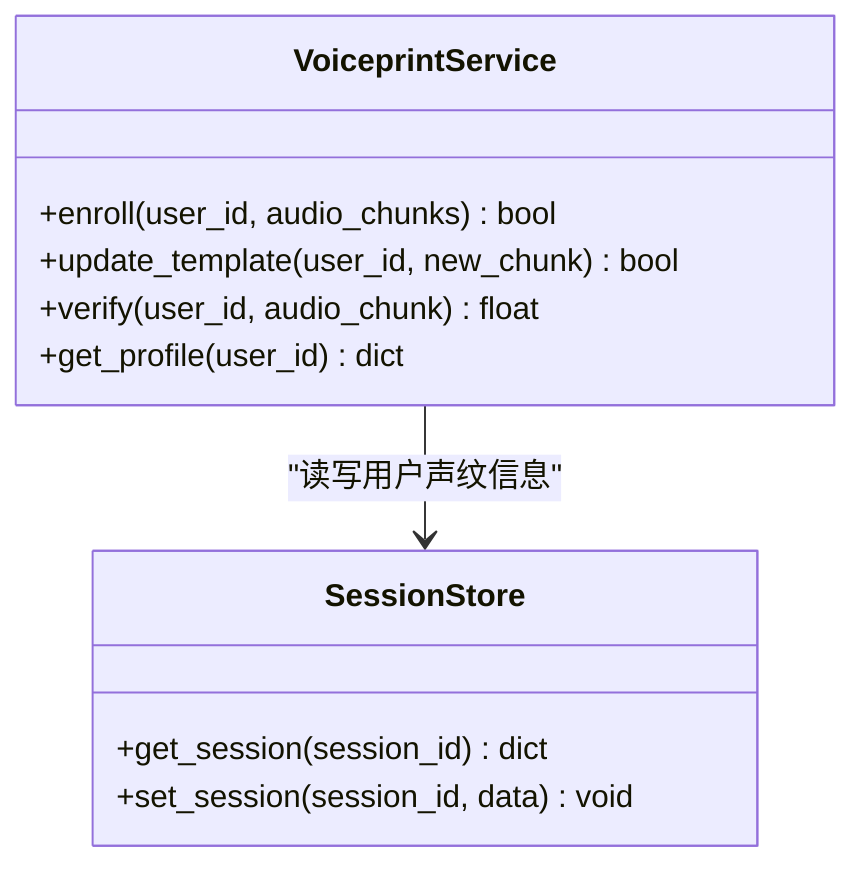
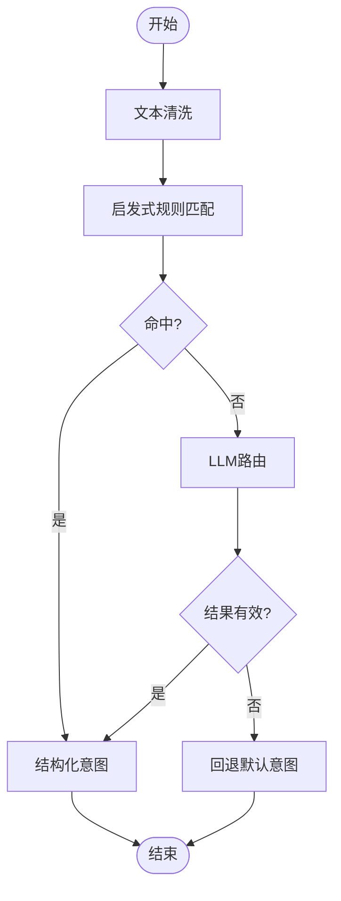
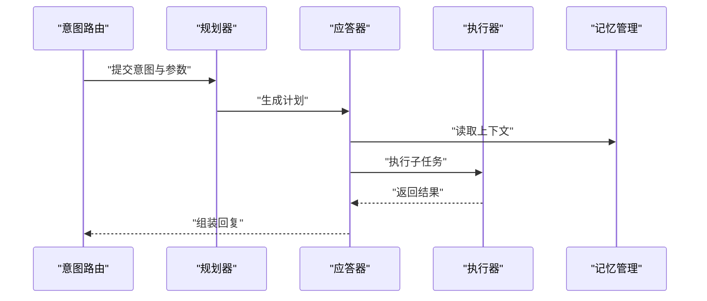
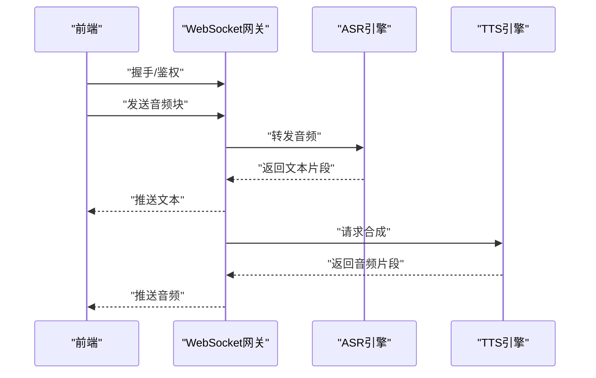
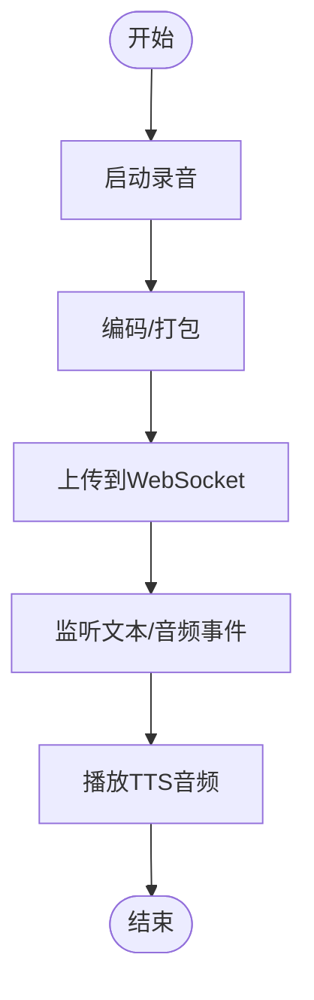
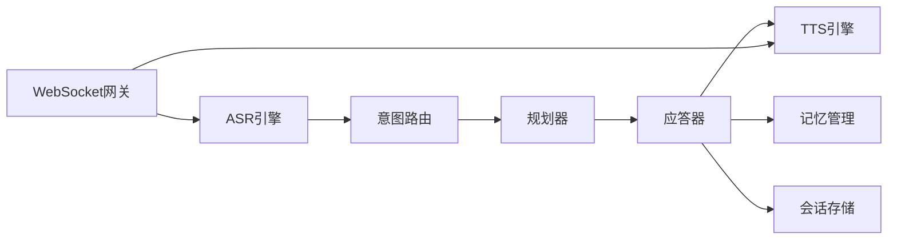

# 语音交互系统

<cite>
**本文引用的文件**   
- [backend_design/nexus/asr/engine.py](file://backend_design/nexus/asr/engine.py)
- [backend_design/nexus/tts/engine.py](file://backend_design/nexus/tts/engine.py)
- [backend_design/nexus/core/voiceprint.py](file://backend_design/nexus/core/voiceprint.py)
- [backend_design/nexus/api/routes/asr.py](file://backend_design/nexus/api/routes/asr.py)
- [backend_design/nexus/api/websocket.py](file://backend_design/nexus/api/websocket.py)
- [backend_design/nexus/main.py](file://backend_design/nexus/main.py)
- [backend_design/nexus/config.py](file://backend_design/nexus/config.py)
- [backend_design/nexus/models/schemas.py](file://backend_design/nexus/models/schemas.py)
- [backend_design/nexus/intent/router.py](file://backend_design/nexus/intent/router.py)
- [backend_design/nexus/intent/heuristic.py](file://backend_design/nexus/intent/heuristic.py)
- [backend_design/nexus/intent/llm_router.py](file://backend_design/nexus/intent/llm_router.py)
- [backend_design/nexus/agent/planner.py](file://backend_design/nexus/agent/planner.py)
- [backend_design/nexus/agent/responder.py](file://backend_design/nexus/agent/responder.py)
- [backend_design/nexus/agent/executor.py](file://backend_design/nexus/agent/executor.py)
- [backend_design/nexus/memory/manager.py](file://backend_design/nexus/memory/manager.py)
- [backend_design/nexus/middleware/session_store.py](file://backend_design/nexus/middleware/session_store.py)
- [frontend_design/src/hooks/use-audio-recorder.ts](file://frontend_design/src/hooks/use-audio-recorder.ts)
- [frontend_design/src/hooks/use-speech-recognition.ts](file://frontend_design/src/hooks/use-speech-recognition.ts)
- [frontend_design/src/lib/tts.ts](file://frontend_design/src/lib/tts.ts)
- [frontend_design/src/components/vehicle/voice-assistant-bar.tsx](file://frontend_design/src/components/vehicle/voice-assistant-bar.tsx)
</cite>

## 目录
1. [简介](#简介)
2. [项目结构](#项目结构)
3. [核心组件](#核心组件)
4. [架构总览](#架构总览)
5. [详细组件分析](#详细组件分析)
6. [依赖关系分析](#依赖关系分析)
7. [性能考虑](#性能考虑)
8. [故障排除指南](#故障排除指南)
9. [结论](#结论)
10. [附录](#附录)

## 简介
本技术文档面向NexusCockpit的语音交互子系统，覆盖ASR（自动语音识别）、TTS（文本转语音）与声纹识别的实现细节、音频处理流程、语音指令解析与用户交互模式。文档同时给出API调用示例与配置项说明，解释与Agent系统的集成方式及实时通信机制，并提供性能优化建议与故障排除指导，涵盖多语言支持与个性化声纹注册等能力。

## 项目结构
语音交互相关代码主要分布在后端Python服务与前端TypeScript应用中：
- 后端
  - ASR引擎：backend_design/nexus/asr/engine.py
  - TTS引擎：backend_design/nexus/tts/engine.py
  - 声纹识别：backend_design/nexus/core/voiceprint.py
  - API路由：backend_design/nexus/api/routes/asr.py
  - WebSocket网关：backend_design/nexus/api/websocket.py
  - 应用入口与中间件：backend_design/nexus/main.py, backend_design/nexus/config.py
  - 意图路由与解析：backend_design/nexus/intent/*.py
  - Agent编排与执行：backend_design/nexus/agent/*.py
  - 会话与记忆：backend_design/nexus/middleware/session_store.py, backend_design/nexus/memory/manager.py
- 前端
  - 录音与播放：frontend_design/src/hooks/use-audio-recorder.ts
  - 浏览器端语音识别：frontend_design/src/hooks/use-speech-recognition.ts
  - 前端TTS：frontend_design/src/lib/tts.ts
  - 语音助手UI：frontend_design/src/components/vehicle/voice-assistant-bar.tsx

图表来源
- [backend_design/nexus/main.py](file://backend_design/nexus/main.py)
- [backend_design/nexus/config.py](file://backend_design/nexus/config.py)
- [backend_design/nexus/api/websocket.py](file://backend_design/nexus/api/websocket.py)
- [backend_design/nexus/api/routes/asr.py](file://backend_design/nexus/api/routes/asr.py)
- [backend_design/nexus/asr/engine.py](file://backend_design/nexus/asr/engine.py)
- [backend_design/nexus/tts/engine.py](file://backend_design/nexus/tts/engine.py)
- [backend_design/nexus/core/voiceprint.py](file://backend_design/nexus/core/voiceprint.py)
- [backend_design/nexus/intent/router.py](file://backend_design/nexus/intent/router.py)
- [backend_design/nexus/intent/heuristic.py](file://backend_design/nexus/intent/heuristic.py)
- [backend_design/nexus/intent/llm_router.py](file://backend_design/nexus/intent/llm_router.py)
- [backend_design/nexus/agent/planner.py](file://backend_design/nexus/agent/planner.py)
- [backend_design/nexus/agent/responder.py](file://backend_design/nexus/agent/responder.py)
- [backend_design/nexus/agent/executor.py](file://backend_design/nexus/agent/executor.py)
- [backend_design/nexus/memory/manager.py](file://backend_design/nexus/memory/manager.py)
- [backend_design/nexus/middleware/session_store.py](file://backend_design/nexus/middleware/session_store.py)
- [frontend_design/src/components/vehicle/voice-assistant-bar.tsx](file://frontend_design/src/components/vehicle/voice-assistant-bar.tsx)
- [frontend_design/src/hooks/use-audio-recorder.ts](file://frontend_design/src/hooks/use-audio-recorder.ts)
- [frontend_design/src/hooks/use-speech-recognition.ts](file://frontend_design/src/hooks/use-speech-recognition.ts)
- [frontend_design/src/lib/tts.ts](file://frontend_design/src/lib/tts.ts)

章节来源
- [backend_design/nexus/main.py](file://backend_design/nexus/main.py)
- [backend_design/nexus/config.py](file://backend_design/nexus/config.py)
- [backend_design/nexus/api/websocket.py](file://backend_design/nexus/api/websocket.py)
- [backend_design/nexus/api/routes/asr.py](file://backend_design/nexus/api/routes/asr.py)
- [backend_design/nexus/asr/engine.py](file://backend_design/nexus/asr/engine.py)
- [backend_design/nexus/tts/engine.py](file://backend_design/nexus/tts/engine.py)
- [backend_design/nexus/core/voiceprint.py](file://backend_design/nexus/core/voiceprint.py)
- [backend_design/nexus/intent/router.py](file://backend_design/nexus/intent/router.py)
- [backend_design/nexus/intent/heuristic.py](file://backend_design/nexus/intent/heuristic.py)
- [backend_design/nexus/intent/llm_router.py](file://backend_design/nexus/intent/llm_router.py)
- [backend_design/nexus/agent/planner.py](file://backend_design/nexus/agent/planner.py)
- [backend_design/nexus/agent/responder.py](file://backend_design/nexus/agent/responder.py)
- [backend_design/nexus/agent/executor.py](file://backend_design/nexus/agent/executor.py)
- [backend_design/nexus/memory/manager.py](file://backend_design/nexus/memory/manager.py)
- [backend_design/nexus/middleware/session_store.py](file://backend_design/nexus/middleware/session_store.py)
- [frontend_design/src/components/vehicle/voice-assistant-bar.tsx](file://frontend_design/src/components/vehicle/voice-assistant-bar.tsx)
- [frontend_design/src/hooks/use-audio-recorder.ts](file://frontend_design/src/hooks/use-audio-recorder.ts)
- [frontend_design/src/hooks/use-speech-recognition.ts](file://frontend_design/src/hooks/use-speech-recognition.ts)
- [frontend_design/src/lib/tts.ts](file://frontend_design/src/lib/tts.ts)

## 核心组件
- ASR引擎
  - 负责接收音频流或文件，进行降噪、分帧、特征提取与解码，输出文本与可选的时间戳、置信度、多语言结果。
  - 支持本地模型与远程服务两种接入方式，通过配置切换。
- TTS引擎
  - 将文本转换为可播放音频流，支持多种音色、语速、音量与语言风格控制。
  - 提供流式与非流式两种返回模式，适配不同前端播放策略。
- 声纹识别
  - 完成用户注册、模板更新与在线比对，用于个性化TTS音色选择与权限控制。
  - 提供阈值调节与回退策略，保障误识率与拒识率的平衡。
- 意图路由
  - 基于启发式规则与LLM路由的组合，将识别文本映射到具体技能或Agent动作。
  - 支持澄清问题与二次确认，提升复杂任务成功率。
- Agent编排
  - 规划器根据意图生成步骤序列，应答器生成自然语言回复，执行器驱动外部工具或服务。
- 会话与记忆
  - 维护对话上下文、短期记忆与长期记忆，支撑连续对话与个性化体验。
- 实时通信
  - WebSocket作为前后端双向通道，承载音频上行、文本下行与状态事件。

章节来源
- [backend_design/nexus/asr/engine.py](file://backend_design/nexus/asr/engine.py)
- [backend_design/nexus/tts/engine.py](file://backend_design/nexus/tts/engine.py)
- [backend_design/nexus/core/voiceprint.py](file://backend_design/nexus/core/voiceprint.py)
- [backend_design/nexus/intent/router.py](file://backend_design/nexus/intent/router.py)
- [backend_design/nexus/intent/heuristic.py](file://backend_design/nexus/intent/heuristic.py)
- [backend_design/nexus/intent/llm_router.py](file://backend_design/nexus/intent/llm_router.py)
- [backend_design/nexus/agent/planner.py](file://backend_design/nexus/agent/planner.py)
- [backend_design/nexus/agent/responder.py](file://backend_design/nexus/agent/responder.py)
- [backend_design/nexus/agent/executor.py](file://backend_design/nexus/agent/executor.py)
- [backend_design/nexus/memory/manager.py](file://backend_design/nexus/memory/manager.py)
- [backend_design/nexus/middleware/session_store.py](file://backend_design/nexus/middleware/session_store.py)
- [backend_design/nexus/api/websocket.py](file://backend_design/nexus/api/websocket.py)

## 架构总览
语音交互系统采用“前端采集/播放 + 后端ASR/TTS/声纹 + 意图路由 + Agent编排”的分层架构。前端通过WebSocket上传音频片段并接收文本与TTS音频；后端ASR将音频转为文本后交由意图路由，路由结合启发式与LLM决策，进入Agent规划与执行阶段；最终由TTS合成语音并推送至前端。

图表来源
- [backend_design/nexus/api/websocket.py](file://backend_design/nexus/api/websocket.py)
- [backend_design/nexus/asr/engine.py](file://backend_design/nexus/asr/engine.py)
- [backend_design/nexus/intent/router.py](file://backend_design/nexus/intent/router.py)
- [backend_design/nexus/agent/planner.py](file://backend_design/nexus/agent/planner.py)
- [backend_design/nexus/agent/responder.py](file://backend_design/nexus/agent/responder.py)
- [backend_design/nexus/tts/engine.py](file://backend_design/nexus/tts/engine.py)
- [backend_design/nexus/memory/manager.py](file://backend_design/nexus/memory/manager.py)
- [backend_design/nexus/middleware/session_store.py](file://backend_design/nexus/middleware/session_store.py)

## 详细组件分析

### ASR引擎
- 功能要点
  - 输入：PCM/WAV/OPUS等格式音频流或文件路径
  - 输出：文本、时间戳、置信度、语言标签
  - 模式：流式增量识别、整段识别
  - 多语言：支持按语种或自动检测
- 关键流程
  - 音频预处理（降噪、重采样、静音裁剪）
  - 特征提取与编码
  - 解码与后处理（标点恢复、数字规范化）
  - 结果聚合与推送
- 错误处理
  - 网络超时重试、降级到本地模型
  - 异常日志与指标上报

图表来源
- [backend_design/nexus/asr/engine.py](file://backend_design/nexus/asr/engine.py)

章节来源
- [backend_design/nexus/asr/engine.py](file://backend_design/nexus/asr/engine.py)
- [backend_design/nexus/api/routes/asr.py](file://backend_design/nexus/api/routes/asr.py)

### TTS引擎
- 功能要点
  - 输入：文本、说话人ID、语言、风格参数
  - 输出：音频流（PCM/Opus）或文件
  - 模式：非流式批量合成、流式边合成边播放
- 关键流程
  - 文本归一化与韵律预测
  - 声学模型推理与声码器合成
  - 音频编码与分片推送
- 错误处理
  - 合成失败回退为默认音色
  - 超时与断线重连

图表来源
- [backend_design/nexus/tts/engine.py](file://backend_design/nexus/tts/engine.py)

章节来源
- [backend_design/nexus/tts/engine.py](file://backend_design/nexus/tts/engine.py)

### 声纹识别
- 功能要点
  - 注册：采集多段语音，提取嵌入向量并持久化
  - 更新：增量融合新样本，平滑更新模板
  - 验证：在线比对，返回相似度与判定结果
- 关键流程
  - 预训练特征提取
  - 模板构建与存储
  - 相似度计算与阈值判定
- 错误处理
  - 低质量音频拒绝
  - 阈值自适应调整

图表来源
- [backend_design/nexus/core/voiceprint.py](file://backend_design/nexus/core/voiceprint.py)
- [backend_design/nexus/middleware/session_store.py](file://backend_design/nexus/middleware/session_store.py)

章节来源
- [backend_design/nexus/core/voiceprint.py](file://backend_design/nexus/core/voiceprint.py)
- [backend_design/nexus/middleware/session_store.py](file://backend_design/nexus/middleware/session_store.py)

### 意图路由与解析
- 功能要点
  - 启发式规则：关键词匹配、槽位抽取、条件分支
  - LLM路由：语义理解、意图分类、参数提取
  - 组合策略：先启发式快速命中，未命中再走LLM
- 关键流程
  - 文本清洗与标准化
  - 规则匹配与打分
  - LLM调用与结果校验
  - 输出结构化意图与参数

图表来源
- [backend_design/nexus/intent/router.py](file://backend_design/nexus/intent/router.py)
- [backend_design/nexus/intent/heuristic.py](file://backend_design/nexus/intent/heuristic.py)
- [backend_design/nexus/intent/llm_router.py](file://backend_design/nexus/intent/llm_router.py)

章节来源
- [backend_design/nexus/intent/router.py](file://backend_design/nexus/intent/router.py)
- [backend_design/nexus/intent/heuristic.py](file://backend_design/nexus/intent/heuristic.py)
- [backend_design/nexus/intent/llm_router.py](file://backend_design/nexus/intent/llm_router.py)

### Agent编排与执行
- 规划器
  - 根据意图生成步骤序列，处理依赖与并行度
- 应答器
  - 生成自然语言回复，整合记忆与上下文
- 执行器
  - 驱动外部工具与服务，返回执行结果

图表来源
- [backend_design/nexus/agent/planner.py](file://backend_design/nexus/agent/planner.py)
- [backend_design/nexus/agent/responder.py](file://backend_design/nexus/agent/responder.py)
- [backend_design/nexus/agent/executor.py](file://backend_design/nexus/agent/executor.py)
- [backend_design/nexus/memory/manager.py](file://backend_design/nexus/memory/manager.py)

章节来源
- [backend_design/nexus/agent/planner.py](file://backend_design/nexus/agent/planner.py)
- [backend_design/nexus/agent/responder.py](file://backend_design/nexus/agent/responder.py)
- [backend_design/nexus/agent/executor.py](file://backend_design/nexus/agent/executor.py)
- [backend_design/nexus/memory/manager.py](file://backend_design/nexus/memory/manager.py)

### 实时通信机制
- WebSocket连接建立与鉴权
- 音频上行：分块上传、心跳保活、断线重连
- 文本下行：增量识别结果、状态事件
- 音频下行：TTS流式片段、播放控制事件

图表来源
- [backend_design/nexus/api/websocket.py](file://backend_design/nexus/api/websocket.py)
- [backend_design/nexus/asr/engine.py](file://backend_design/nexus/asr/engine.py)
- [backend_design/nexus/tts/engine.py](file://backend_design/nexus/tts/engine.py)

章节来源
- [backend_design/nexus/api/websocket.py](file://backend_design/nexus/api/websocket.py)

### 前端交互与播放
- 录音Hook：捕获麦克风、编码压缩、定时上传
- 浏览器识别Hook：使用Web Speech API做本地识别，作为快速回退
- 前端TTS：接收后端音频流并播放，支持暂停/继续
- 语音助手UI：展示识别文本、播放进度、状态提示

图表来源
- [frontend_design/src/hooks/use-audio-recorder.ts](file://frontend_design/src/hooks/use-audio-recorder.ts)
- [frontend_design/src/hooks/use-speech-recognition.ts](file://frontend_design/src/hooks/use-speech-recognition.ts)
- [frontend_design/src/lib/tts.ts](file://frontend_design/src/lib/tts.ts)
- [frontend_design/src/components/vehicle/voice-assistant-bar.tsx](file://frontend_design/src/components/vehicle/voice-assistant-bar.tsx)

章节来源
- [frontend_design/src/hooks/use-audio-recorder.ts](file://frontend_design/src/hooks/use-audio-recorder.ts)
- [frontend_design/src/hooks/use-speech-recognition.ts](file://frontend_design/src/hooks/use-speech-recognition.ts)
- [frontend_design/src/lib/tts.ts](file://frontend_design/src/lib/tts.ts)
- [frontend_design/src/components/vehicle/voice-assistant-bar.tsx](file://frontend_design/src/components/vehicle/voice-assistant-bar.tsx)

## 依赖关系分析
- 模块耦合
  - ASR与意图路由强耦合，需保证文本质量与延迟
  - 意图路由与Agent编排松耦合，通过结构化意图契约解耦
  - TTS与WebSocket紧密配合，需保证音频流稳定
- 外部依赖
  - 声纹模型、ASR/TTS模型加载与缓存
  - 会话存储与记忆管理的持久化接口
- 潜在循环依赖
  - 避免在意图路由中直接调用TTS，应通过应答器统一出口

图表来源
- [backend_design/nexus/asr/engine.py](file://backend_design/nexus/asr/engine.py)
- [backend_design/nexus/intent/router.py](file://backend_design/nexus/intent/router.py)
- [backend_design/nexus/agent/planner.py](file://backend_design/nexus/agent/planner.py)
- [backend_design/nexus/agent/responder.py](file://backend_design/nexus/agent/responder.py)
- [backend_design/nexus/tts/engine.py](file://backend_design/nexus/tts/engine.py)
- [backend_design/nexus/memory/manager.py](file://backend_design/nexus/memory/manager.py)
- [backend_design/nexus/middleware/session_store.py](file://backend_design/nexus/middleware/session_store.py)
- [backend_design/nexus/api/websocket.py](file://backend_design/nexus/api/websocket.py)

章节来源
- [backend_design/nexus/asr/engine.py](file://backend_design/nexus/asr/engine.py)
- [backend_design/nexus/intent/router.py](file://backend_design/nexus/intent/router.py)
- [backend_design/nexus/agent/planner.py](file://backend_design/nexus/agent/planner.py)
- [backend_design/nexus/agent/responder.py](file://backend_design/nexus/agent/responder.py)
- [backend_design/nexus/tts/engine.py](file://backend_design/nexus/tts/engine.py)
- [backend_design/nexus/memory/manager.py](file://backend_design/nexus/memory/manager.py)
- [backend_design/nexus/middleware/session_store.py](file://backend_design/nexus/middleware/session_store.py)
- [backend_design/nexus/api/websocket.py](file://backend_design/nexus/api/websocket.py)

## 性能考虑
- ASR
  - 启用流式识别减少首字延迟
  - 合理设置分帧大小与采样率，平衡精度与吞吐
  - 模型预热与GPU显存复用
- TTS
  - 流式合成与前端缓冲播放降低感知延迟
  - 音色与语言缓存，避免重复初始化
- 意图路由
  - 启发式优先命中，减少LLM调用次数
  - 结果缓存与去抖，避免重复计算
- 实时通信
  - 心跳与断线重连策略
  - 背压控制与队列限流，防止雪崩
- 资源监控
  - 指标上报与告警，定位瓶颈

[本节为通用性能建议，不直接分析具体文件]

## 故障排除指南
- 常见问题
  - 音频无法上传：检查WebSocket连接状态与鉴权
  - 识别结果为空：查看ASR日志与输入音频质量
  - TTS无声：确认音频编码与前端播放器兼容性
  - 声纹验证失败：检查阈值设置与样本数量
- 诊断步骤
  - 开启调试日志，记录端到端时序
  - 使用测试脚本回放音频，隔离前端/后端问题
  - 检查配置项与环境变量是否正确加载
- 回退策略
  - ASR失败时切换到本地模型或浏览器识别
  - TTS失败时使用默认音色或文本提示

章节来源
- [backend_design/nexus/api/routes/asr.py](file://backend_design/nexus/api/routes/asr.py)
- [backend_design/nexus/api/websocket.py](file://backend_design/nexus/api/websocket.py)
- [backend_design/nexus/asr/engine.py](file://backend_design/nexus/asr/engine.py)
- [backend_design/nexus/tts/engine.py](file://backend_design/nexus/tts/engine.py)
- [backend_design/nexus/core/voiceprint.py](file://backend_design/nexus/core/voiceprint.py)

## 结论
本语音交互系统通过分层架构与模块化设计，实现了从音频采集、识别、意图理解到智能应答与语音合成的完整闭环。借助流式通信与多语言、个性化声纹能力，系统在实时性与用户体验方面具备良好基础。后续可在模型优化、缓存策略与监控告警方面持续改进，进一步提升稳定性与性能。

[本节为总结性内容，不直接分析具体文件]

## 附录

### API调用示例与配置选项
- ASR接口
  - 方法：POST /api/asr/transcribe
  - 请求体：包含音频文件或流式分块、语言偏好、是否流式标志
  - 响应：文本、时间戳、置信度、语言标签
  - 参考实现路径：[backend_design/nexus/api/routes/asr.py](file://backend_design/nexus/api/routes/asr.py)
- WebSocket事件
  - 事件类型：audio_upload、text_update、tts_audio、status_event
  - 参考实现路径：[backend_design/nexus/api/websocket.py](file://backend_design/nexus/api/websocket.py)
- 配置项
  - ASR模型路径、采样率、分帧大小、是否启用流式
  - TTS音色、语言、语速、是否启用流式
  - 声纹阈值、模板更新策略
  - 参考实现路径：[backend_design/nexus/config.py](file://backend_design/nexus/config.py)

章节来源
- [backend_design/nexus/api/routes/asr.py](file://backend_design/nexus/api/routes/asr.py)
- [backend_design/nexus/api/websocket.py](file://backend_design/nexus/api/websocket.py)
- [backend_design/nexus/config.py](file://backend_design/nexus/config.py)

### 数据结构定义
- 识别结果
  - 字段：文本、时间戳、置信度、语言
  - 参考实现路径：[backend_design/nexus/models/schemas.py](file://backend_design/nexus/models/schemas.py)
- 会话状态
  - 字段：会话ID、上下文、最近意图、用户ID
  - 参考实现路径：[backend_design/nexus/middleware/session_store.py](file://backend_design/nexus/middleware/session_store.py)

章节来源
- [backend_design/nexus/models/schemas.py](file://backend_design/nexus/models/schemas.py)
- [backend_design/nexus/middleware/session_store.py](file://backend_design/nexus/middleware/session_store.py)