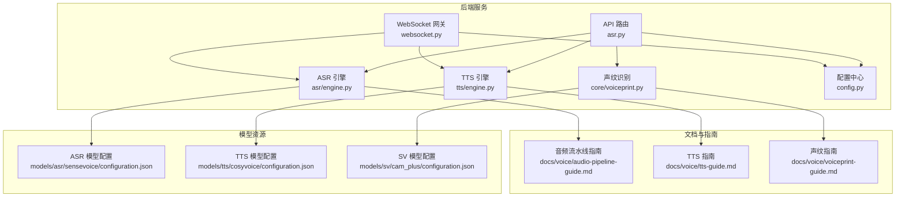
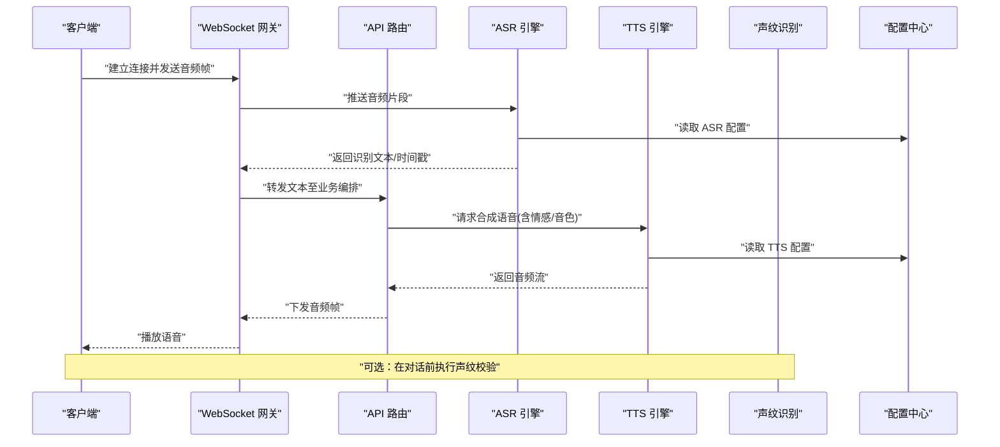
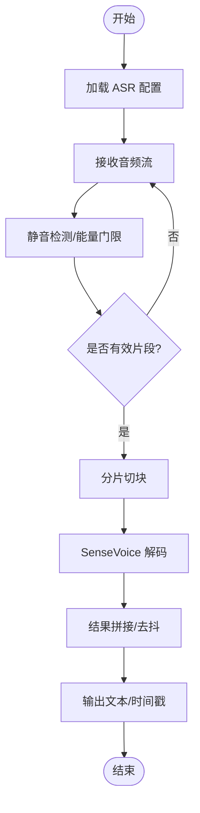
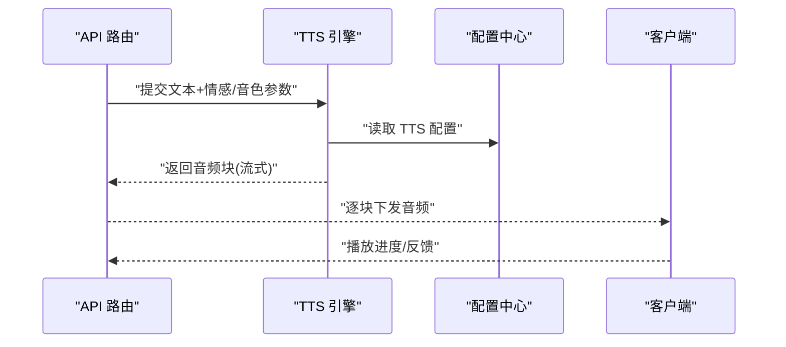
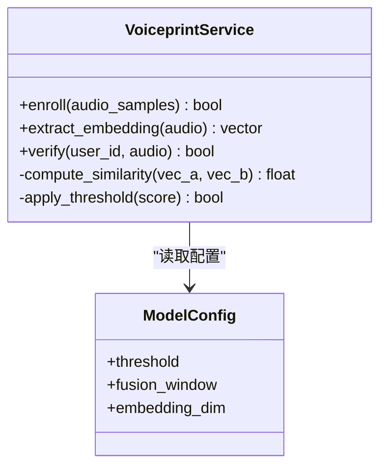
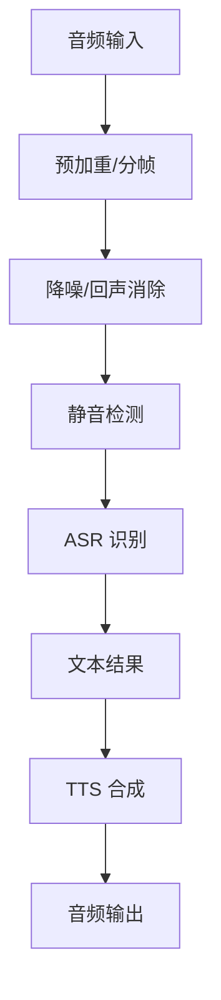
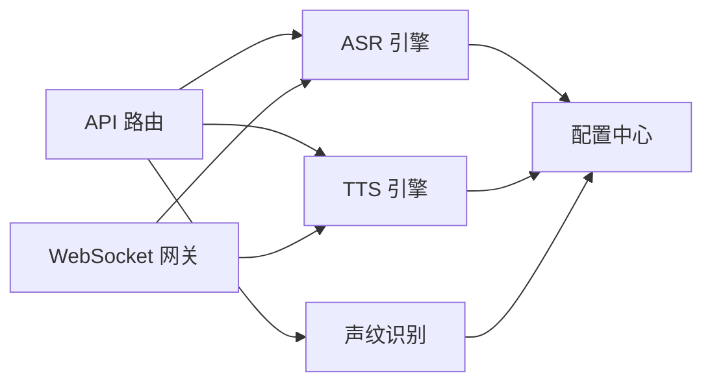

# 语音交互系统

<cite>
**本文引用的文件**   
- [backend_design/nexus/asr/engine.py](file://backend_design/nexus/asr/engine.py)
- [backend_design/nexus/tts/engine.py](file://backend_design/nexus/tts/engine.py)
- [backend_design/nexus/core/voiceprint.py](file://backend_design/nexus/core/voiceprint.py)
- [backend_design/nexus/api/routes/asr.py](file://backend_design/nexus/api/routes/asr.py)
- [backend_design/nexus/api/websocket.py](file://backend_design/nexus/api/websocket.py)
- [backend_design/nexus/config.py](file://backend_design/nexus/config.py)
- [models/asr/sensevoice/configuration.json](file://models/asr/sensevoice/configuration.json)
- [models/tts/cosyvoice/configuration.json](file://models/tts/cosyvoice/configuration.json)
- [models/sv/cam_plus/configuration.json](file://models/sv/cam_plus/configuration.json)
- [docs/voice/audio-pipeline-guide.md](file://docs/voice/audio-pipeline-guide.md)
- [docs/voice/tts-guide.md](file://docs/voice/tts-guide.md)
- [docs/voice/voiceprint-guide.md](file://docs/voice/voiceprint-guide.md)
</cite>

## 目录
1. [引言](#引言)
2. [项目结构](#项目结构)
3. [核心组件](#核心组件)
4. [架构总览](#架构总览)
5. [详细组件分析](#详细组件分析)
6. [依赖关系分析](#依赖关系分析)
7. [性能与延迟优化](#性能与延迟优化)
8. [故障排查指南](#故障排查指南)
9. [结论](#结论)
10. [附录](#附录)

## 引言
本技术文档面向语音交互系统的研发与运维人员，围绕自动语音识别（ASR）、文本转语音（TTS）、声纹识别（SV）三大能力，结合实时音频流处理、降噪策略、模型替换与定制、多语言与方言支持、以及端到端性能优化进行系统化说明。文档同时提供架构图、流程图和时序图，帮助读者快速理解数据流与控制流，并给出可操作的配置与排障建议。

## 项目结构
本项目采用前后端分离与模块化后端设计：
- 后端服务位于 backend_design/nexus，包含 ASR/TTS/SV 引擎、API 路由、WebSocket 网关、配置与核心工具等模块。
- 模型资源位于 models 目录，按能力域划分（asr、tts、sv），每个子模型附带 configuration.json 描述关键参数。
- 语音相关使用指南集中于 docs/voice 目录，涵盖音频流水线、TTS 与声纹注册流程。
- 前端位于 frontend_design，负责录音、播放与交互界面。

图表来源
- [backend_design/nexus/api/routes/asr.py](file://backend_design/nexus/api/routes/asr.py)
- [backend_design/nexus/api/websocket.py](file://backend_design/nexus/api/websocket.py)
- [backend_design/nexus/asr/engine.py](file://backend_design/nexus/asr/engine.py)
- [backend_design/nexus/tts/engine.py](file://backend_design/nexus/tts/engine.py)
- [backend_design/nexus/core/voiceprint.py](file://backend_design/nexus/core/voiceprint.py)
- [backend_design/nexus/config.py](file://backend_design/nexus/config.py)
- [models/asr/sensevoice/configuration.json](file://models/asr/sensevoice/configuration.json)
- [models/tts/cosyvoice/configuration.json](file://models/tts/cosyvoice/configuration.json)
- [models/sv/cam_plus/configuration.json](file://models/sv/cam_plus/configuration.json)
- [docs/voice/audio-pipeline-guide.md](file://docs/voice/audio-pipeline-guide.md)
- [docs/voice/tts-guide.md](file://docs/voice/tts-guide.md)
- [docs/voice/voiceprint-guide.md](file://docs/voice/voiceprint-guide.md)

章节来源
- [backend_design/nexus/asr/engine.py](file://backend_design/nexus/asr/engine.py)
- [backend_design/nexus/tts/engine.py](file://backend_design/nexus/tts/engine.py)
- [backend_design/nexus/core/voiceprint.py](file://backend_design/nexus/core/voiceprint.py)
- [backend_design/nexus/api/routes/asr.py](file://backend_design/nexus/api/routes/asr.py)
- [backend_design/nexus/api/websocket.py](file://backend_design/nexus/api/websocket.py)
- [backend_design/nexus/config.py](file://backend_design/nexus/config.py)
- [models/asr/sensevoice/configuration.json](file://models/asr/sensevoice/configuration.json)
- [models/tts/cosyvoice/configuration.json](file://models/tts/cosyvoice/configuration.json)
- [models/sv/cam_plus/configuration.json](file://models/sv/cam_plus/configuration.json)
- [docs/voice/audio-pipeline-guide.md](file://docs/voice/audio-pipeline-guide.md)
- [docs/voice/tts-guide.md](file://docs/voice/tts-guide.md)
- [docs/voice/voiceprint-guide.md](file://docs/voice/voiceprint-guide.md)

## 核心组件
- ASR 自动语音识别引擎
  - 负责将音频流或音频文件转换为文本，支持多语言与方言识别，具备静音检测、分段与结果拼接能力。
  - 通过配置加载 SenseVoice 模型参数，支持热词、采样率、分片大小等调优项。
- TTS 文本转语音引擎
  - 负责将文本合成语音，支持情感化合成与个性化音色选择，输出 PCM/WAV 等格式。
  - 通过 CosyVoice 模型配置控制语速、音高、情感强度与说话人 ID。
- 声纹识别（SV）
  - 负责用户身份验证与说话人区分，提供注册、提取特征、比对与阈值判定。
  - 基于 Cam++ 模型配置，支持动态阈值与多轮融合策略。
- 实时音频流与 WebSocket
  - 提供低延迟的音频上行与语音下行通道，实现边录边识、边算边播。
- 配置中心
  - 集中管理各引擎与模型的运行参数，支持热更新与环境隔离。

章节来源
- [backend_design/nexus/asr/engine.py](file://backend_design/nexus/asr/engine.py)
- [backend_design/nexus/tts/engine.py](file://backend_design/nexus/tts/engine.py)
- [backend_design/nexus/core/voiceprint.py](file://backend_design/nexus/core/voiceprint.py)
- [backend_design/nexus/config.py](file://backend_design/nexus/config.py)

## 架构总览
整体架构以“接入层—编排层—能力层—模型层”分层组织：
- 接入层：REST API 与 WebSocket 网关，统一鉴权、限流与协议适配。
- 编排层：会话管理、任务队列与中间件（缓存、速率限制）。
- 能力层：ASR/TTS/SV 引擎，封装推理与后处理逻辑。
- 模型层：SenseVoice、CosyVoice、Cam++ 等模型及其配置。

图表来源
- [backend_design/nexus/api/websocket.py](file://backend_design/nexus/api/websocket.py)
- [backend_design/nexus/api/routes/asr.py](file://backend_design/nexus/api/routes/asr.py)
- [backend_design/nexus/asr/engine.py](file://backend_design/nexus/asr/engine.py)
- [backend_design/nexus/tts/engine.py](file://backend_design/nexus/tts/engine.py)
- [backend_design/nexus/core/voiceprint.py](file://backend_design/nexus/core/voiceprint.py)
- [backend_design/nexus/config.py](file://backend_design/nexus/config.py)

## 详细组件分析

### ASR 自动语音识别引擎
- 集成与配置
  - 通过配置中心加载 SenseVoice 模型参数，包括语言/方言列表、采样率、分片大小、静音阈值、热词表等。
  - 支持流式与非流式两种模式；流式模式下按固定时长切分音频块，增量返回部分结果，最终合并为完整文本。
- 多语言与方言识别
  - 依据模型配置中的语言标签与方言映射，动态切换解码器与词典。
  - 对混合语种输入，采用置信度评分与回退策略，提升鲁棒性。
- 实时处理与降噪
  - 前置 VAD（静音检测）与能量门限过滤，减少无效片段进入推理。
  - 可选频域降噪与回声消除模块，降低车载/室内噪声影响。
- 错误处理与降级
  - 超时重试、断线重连、结果去抖与重复抑制。
  - 当模型不可用时，回退到轻量规则识别或提示用户重试。

图表来源
- [backend_design/nexus/asr/engine.py](file://backend_design/nexus/asr/engine.py)
- [models/asr/sensevoice/configuration.json](file://models/asr/sensevoice/configuration.json)
- [docs/voice/audio-pipeline-guide.md](file://docs/voice/audio-pipeline-guide.md)

章节来源
- [backend_design/nexus/asr/engine.py](file://backend_design/nexus/asr/engine.py)
- [models/asr/sensevoice/configuration.json](file://models/asr/sensevoice/configuration.json)
- [docs/voice/audio-pipeline-guide.md](file://docs/voice/audio-pipeline-guide.md)

### TTS 文本转语音引擎
- 情感化合成与个性化音色
  - 通过 CosyVoice 配置指定情感类型（如开心、平静、严肃）与强度系数，调节韵律与基频。
  - 支持说话人 ID 与音色风格，实现个性化声音克隆或品牌音色。
- 流式合成与缓冲播放
  - 按句子或短语粒度生成音频块，配合前端缓冲播放以降低首包延迟。
- 质量与稳定性
  - 内置断句与标点恢复，避免长文本导致的合成不稳定。
  - 失败重试与降级策略（如切换默认音色或降低情感强度）。

图表来源
- [backend_design/nexus/tts/engine.py](file://backend_design/nexus/tts/engine.py)
- [models/tts/cosyvoice/configuration.json](file://models/tts/cosyvoice/configuration.json)
- [docs/voice/tts-guide.md](file://docs/voice/tts-guide.md)

章节来源
- [backend_design/nexus/tts/engine.py](file://backend_design/nexus/tts/engine.py)
- [models/tts/cosyvoice/configuration.json](file://models/tts/cosyvoice/configuration.json)
- [docs/voice/tts-guide.md](file://docs/voice/tts-guide.md)

### 声纹识别（SV）用户身份验证与安全策略
- 注册与特征提取
  - 采集用户语音样本，经预处理与归一化后提取嵌入向量，持久化存储于用户档案。
- 认证与阈值策略
  - 在线比对时计算相似度分数，结合动态阈值与多轮融合策略，降低误识率。
- 安全策略
  - 防重放攻击（加入随机盐与时间戳）、最小权限访问、审计日志与异常告警。
  - 敏感数据加密存储与传输，定期轮换密钥。

图表来源
- [backend_design/nexus/core/voiceprint.py](file://backend_design/nexus/core/voiceprint.py)
- [models/sv/cam_plus/configuration.json](file://models/sv/cam_plus/configuration.json)
- [docs/voice/voiceprint-guide.md](file://docs/voice/voiceprint-guide.md)

章节来源
- [backend_design/nexus/core/voiceprint.py](file://backend_design/nexus/core/voiceprint.py)
- [models/sv/cam_plus/configuration.json](file://models/sv/cam_plus/configuration.json)
- [docs/voice/voiceprint-guide.md](file://docs/voice/voiceprint-guide.md)

### 实时音频流处理与降噪算法
- 流式管线
  - 客户端通过 WebSocket 持续上传音频帧，服务端按固定窗口聚合，触发 ASR 增量识别。
  - 识别结果与 TTS 合成并行推进，形成“边听边说”的低延迟体验。
- 降噪与增强
  - 频域滤波、谱减法与自适应噪声估计，针对车内风噪、路噪与空调噪声优化。
  - 回声消除（AEC）与双讲检测，保障多人场景下的清晰度。
- 质量控制
  - 信噪比估计、丢包补偿与抖动缓冲，确保稳定播放与识别。

图表来源
- [backend_design/nexus/api/websocket.py](file://backend_design/nexus/api/websocket.py)
- [backend_design/nexus/asr/engine.py](file://backend_design/nexus/asr/engine.py)
- [backend_design/nexus/tts/engine.py](file://backend_design/nexus/tts/engine.py)
- [docs/voice/audio-pipeline-guide.md](file://docs/voice/audio-pipeline-guide.md)

章节来源
- [backend_design/nexus/api/websocket.py](file://backend_design/nexus/api/websocket.py)
- [backend_design/nexus/asr/engine.py](file://backend_design/nexus/asr/engine.py)
- [backend_design/nexus/tts/engine.py](file://backend_design/nexus/tts/engine.py)
- [docs/voice/audio-pipeline-guide.md](file://docs/voice/audio-pipeline-guide.md)

### 语音模型替换与定制指南
- ASR 模型替换
  - 更换 models/asr 下对应模型目录，更新 configuration.json 中的路径、语言标签与解码参数。
  - 重启服务或触发配置热更新，确保新模型生效。
- TTS 模型定制
  - 在 models/tts 中部署新音色或情感模型，调整 configuration.json 的说话人 ID、情感权重与采样率。
  - 通过 API 传入目标音色 ID 与情感参数，实现个性化合成。
- SV 模型升级
  - 更新 models/sv 的配置与权重，重新校准阈值与融合窗口，保证认证准确率。
- 版本管理与回滚
  - 采用灰度发布与 A/B 测试，监控指标（WER、延迟、误识率）决定回滚策略。

章节来源
- [models/asr/sensevoice/configuration.json](file://models/asr/sensevoice/configuration.json)
- [models/tts/cosyvoice/configuration.json](file://models/tts/cosyvoice/configuration.json)
- [models/sv/cam_plus/configuration.json](file://models/sv/cam_plus/configuration.json)
- [backend_design/nexus/config.py](file://backend_design/nexus/config.py)

### 多语言支持与方言识别实现方法
- 语言/方言映射
  - 在 ASR 配置中维护语言代码与方言标签的映射表，根据用户偏好或上下文自动选择。
- 混合语种处理
  - 采用置信度阈值与回退策略，对不确定片段进行二次识别或人工复核。
- 用户体验
  - 前端展示当前识别语言，并提供手动切换选项；记录用户偏好用于后续自动选择。

章节来源
- [backend_design/nexus/asr/engine.py](file://backend_design/nexus/asr/engine.py)
- [models/asr/sensevoice/configuration.json](file://models/asr/sensevoice/configuration.json)
- [docs/voice/audio-pipeline-guide.md](file://docs/voice/audio-pipeline-guide.md)

## 依赖关系分析
- 组件耦合
  - API 路由依赖 ASR/TTS/SV 引擎，WebSocket 网关负责实时数据转发。
  - 所有引擎均依赖配置中心，模型配置独立于运行时，便于替换与灰度。
- 外部依赖
  - 模型库（SenseVoice、CosyVoice、Cam++）通过配置文件驱动，不直接硬编码路径。
  - 可选中间件（缓存、队列）用于削峰填谷与状态共享。

图表来源
- [backend_design/nexus/api/routes/asr.py](file://backend_design/nexus/api/routes/asr.py)
- [backend_design/nexus/api/websocket.py](file://backend_design/nexus/api/websocket.py)
- [backend_design/nexus/asr/engine.py](file://backend_design/nexus/asr/engine.py)
- [backend_design/nexus/tts/engine.py](file://backend_design/nexus/tts/engine.py)
- [backend_design/nexus/core/voiceprint.py](file://backend_design/nexus/core/voiceprint.py)
- [backend_design/nexus/config.py](file://backend_design/nexus/config.py)

章节来源
- [backend_design/nexus/api/routes/asr.py](file://backend_design/nexus/api/routes/asr.py)
- [backend_design/nexus/api/websocket.py](file://backend_design/nexus/api/websocket.py)
- [backend_design/nexus/asr/engine.py](file://backend_design/nexus/asr/engine.py)
- [backend_design/nexus/tts/engine.py](file://backend_design/nexus/tts/engine.py)
- [backend_design/nexus/core/voiceprint.py](file://backend_design/nexus/core/voiceprint.py)
- [backend_design/nexus/config.py](file://backend_design/nexus/config.py)

## 性能与延迟优化
- 流式处理
  - 小批量分片与增量识别，缩短首包延迟；TTS 按句级流式合成，配合前端缓冲播放。
- 资源调度
  - GPU/CPU 资源隔离与批处理，避免热点请求抢占；异步 I/O 与连接池复用。
- 缓存与预热
  - 常用词汇与短句结果缓存；模型权重预热与懒加载，冷启动更快。
- 监控与降级
  - 关键指标（WER、P95/P99 延迟、CPU/GPU 利用率）上报；异常时自动降级到轻量模型或规则引擎。

[本节为通用性能指导，无需特定文件引用]

## 故障排查指南
- 常见问题定位
  - 识别失败：检查音频格式、采样率与静音阈值；查看 ASR 日志与置信度分布。
  - 合成卡顿：确认 TTS 配置的情感强度与说话人 ID 是否合法；检查网络带宽与缓冲策略。
  - 声纹误识：调整阈值与融合窗口；核对注册样本质量与噪声环境。
- 日志与观测
  - 启用结构化日志与链路追踪，记录关键节点耗时与错误码。
  - 结合 Prometheus/Grafana 面板观察吞吐与延迟趋势。
- 回滚与应急
  - 配置热更新失败时，立即回滚至上一个稳定版本；必要时切换到离线规则引擎。

章节来源
- [backend_design/nexus/asr/engine.py](file://backend_design/nexus/asr/engine.py)
- [backend_design/nexus/tts/engine.py](file://backend_design/nexus/tts/engine.py)
- [backend_design/nexus/core/voiceprint.py](file://backend_design/nexus/core/voiceprint.py)
- [backend_design/nexus/config.py](file://backend_design/nexus/config.py)

## 结论
本语音交互系统以模块化架构整合 ASR、TTS 与 SV 三大能力，通过配置驱动的模型管理与流式处理机制，实现了低延迟、高质量且可扩展的语音交互体验。借助完善的降噪、多语言/方言支持与性能优化策略，系统可在复杂环境中保持稳定表现。建议在生产环境持续监控关键指标，并结合业务需求迭代模型与策略。

[本节为总结性内容，无需特定文件引用]

## 附录
- 术语表
  - WER：词错误率，衡量 ASR 识别准确性。
  - P95/P99：延迟分位数，反映端到端响应时间的稳定性。
  - VAD：静音检测，用于剔除无效音频片段。
  - AEC：回声消除，提升多人或强混响场景的清晰度。
- 参考文档
  - 音频流水线指南：docs/voice/audio-pipeline-guide.md
  - TTS 使用指南：docs/voice/tts-guide.md
  - 声纹注册与认证指南：docs/voice/voiceprint-guide.md

[本节为补充信息，无需特定文件引用]