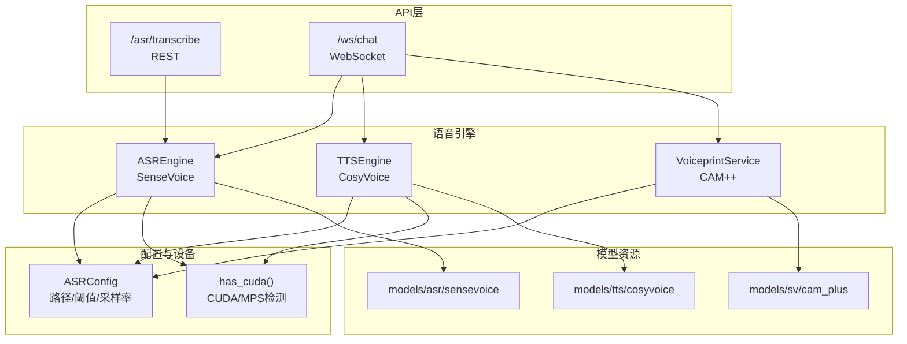
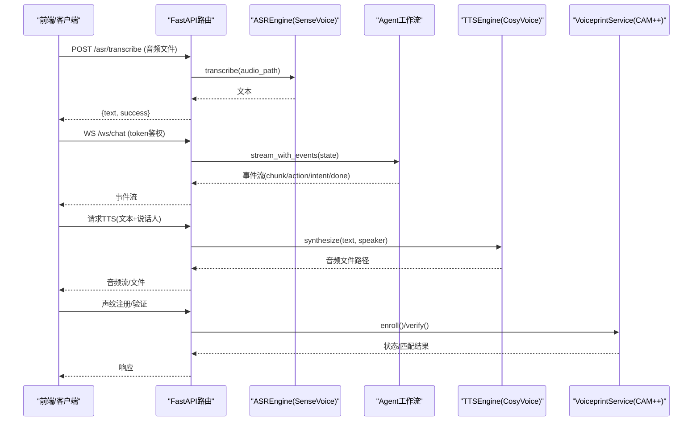
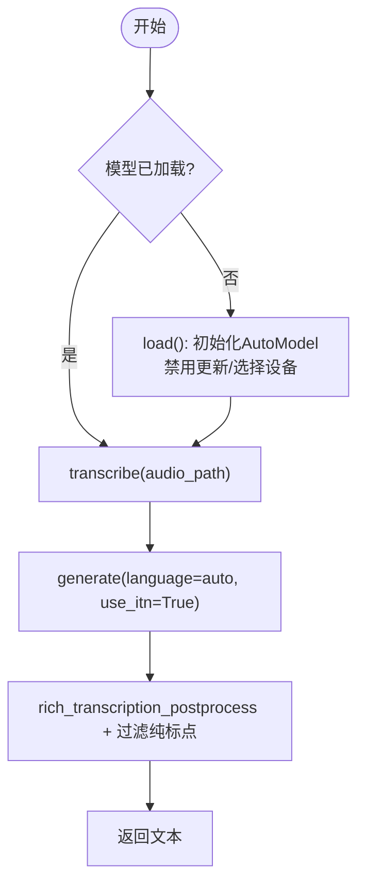
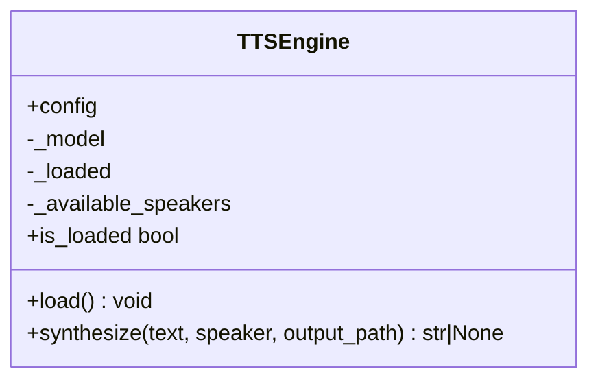
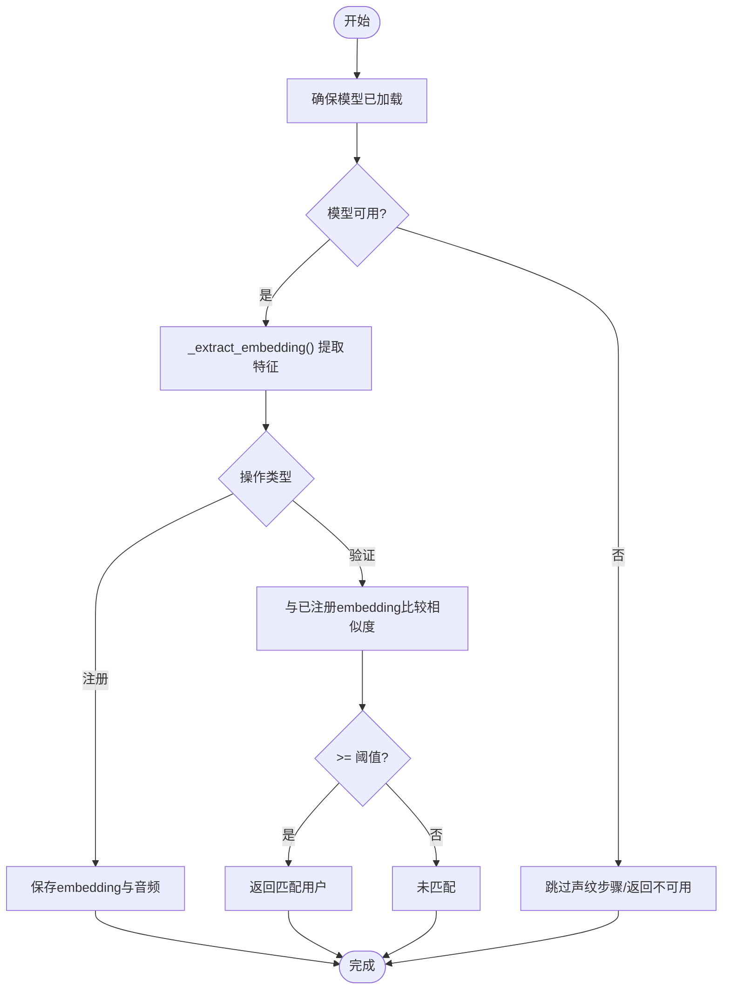
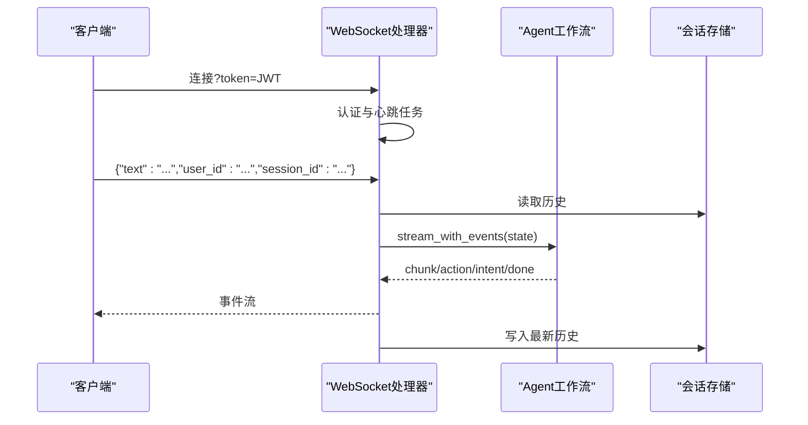
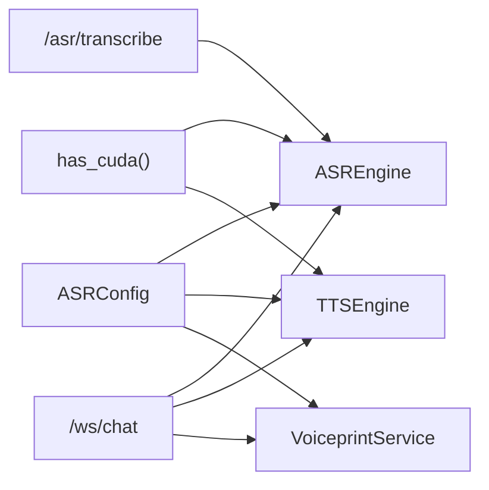

# 语音交互系统

<cite>
**本文引用的文件**   
- [backend_design/nexus/asr/engine.py](file://backend_design/nexus/asr/engine.py)
- [backend_design/nexus/tts/engine.py](file://backend_design/nexus/tts/engine.py)
- [backend_design/nexus/core/voiceprint.py](file://backend_design/nexus/core/voiceprint.py)
- [backend_design/nexus/config/asr.py](file://backend_design/nexus/config/asr.py)
- [backend_design/nexus/config/__init__.py](file://backend_design/nexus/config/__init__.py)
- [backend_design/nexus/api/routes/asr.py](file://backend_design/nexus/api/routes/asr.py)
- [backend_design/nexus/api/websocket.py](file://backend_design/nexus/api/websocket.py)
- [backend_design/nexus/core/device.py](file://backend_design/nexus/core/device.py)
- [models/asr/sensevoice/configuration.json](file://models/asr/sensevoice/configuration.json)
- [models/tts/cosyvoice/configuration.json](file://models/tts/cosyvoice/configuration.json)
- [models/sv/cam_plus/configuration.json](file://models/sv/cam_plus/configuration.json)
</cite>

## 目录
1. [简介](#简介)
2. [项目结构](#项目结构)
3. [核心组件](#核心组件)
4. [架构总览](#架构总览)
5. [详细组件分析](#详细组件分析)
6. [依赖关系分析](#依赖关系分析)
7. [性能考虑](#性能考虑)
8. [故障排查指南](#故障排查指南)
9. [结论](#结论)
10. [附录](#附录)

## 简介
本技术文档面向 NexusCockpit 语音交互系统的开发者与集成者，系统性阐述 ASR（SenseVoice）、TTS（CosyVoice）与声纹识别（CAM++）的集成方式、配置方法、音频预处理与后处理策略、实时流式对话流程与延迟优化技巧，并提供可操作的代码示例路径与最佳实践。文档覆盖音频格式支持、采样率配置、硬件加速选项，帮助读者快速完成模型接入与性能调优。

## 项目结构
NexusCockpit 将语音相关能力拆分为独立模块：
- ASR 引擎：封装 FunASR SenseVoice，提供离线本地识别能力
- TTS 引擎：封装 CosyVoice，提供离线本地合成与说话人选择
- 声纹服务：基于 CAM++ 提取特征，按座舱/用户隔离存储，实现注册与验证
- 配置中心：集中管理模型路径、阈值、采样率等参数
- API/WebSocket：对外暴露 REST 与实时双向通信接口

```mermaid
graph TB
subgraph "API层"
A1["/asr/transcribe<br/>REST"]
A2["/ws/chat<br/>WebSocket"]
end
subgraph "语音引擎"
E1["ASREngine<br/>SenseVoice"]
E2["TTSEngine<br/>CosyVoice"]
E3["VoiceprintService<br/>CAM++"]
end
subgraph "配置与设备"
C1["ASRConfig<br/>路径/阈值/采样率"]
D1["has_cuda()<br/>CUDA/MPS检测"]
end
subgraph "模型资源"
M1["models/asr/sensevoice"]
M2["models/tts/cosyvoice"]
M3["models/sv/cam_plus"]
end
A1 --> E1
A2 --> E1
A2 --> E2
A2 --> E3
E1 --> C1
E2 --> C1
E3 --> C1
E1 --> D1
E2 --> D1
E1 --> M1
E2 --> M2
E3 --> M3
```

**图表来源** 
- [backend_design/nexus/api/routes/asr.py:48-121](file://backend_design/nexus/api/routes/asr.py#L48-L121)
- [backend_design/nexus/api/websocket.py:71-209](file://backend_design/nexus/api/websocket.py#L71-L209)
- [backend_design/nexus/asr/engine.py:78-178](file://backend_design/nexus/asr/engine.py#L78-L178)
- [backend_design/nexus/tts/engine.py:21-116](file://backend_design/nexus/tts/engine.py#L21-L116)
- [backend_design/nexus/core/voiceprint.py:43-401](file://backend_design/nexus/core/voiceprint.py#L43-L401)
- [backend_design/nexus/config/asr.py:15-66](file://backend_design/nexus/config/asr.py#L15-L66)
- [backend_design/nexus/core/device.py:10-21](file://backend_design/nexus/core/device.py#L10-L21)

**章节来源**
- [backend_design/nexus/config/__init__.py:84-138](file://backend_design/nexus/config/__init__.py#L84-L138)
- [backend_design/nexus/config/asr.py:15-66](file://backend_design/nexus/config/asr.py#L15-L66)

## 核心组件
- ASREngine（SenseVoice）
  - 懒加载模型，抑制第三方噪音日志，自动选择 CUDA/MPS/CPU
  - 支持多格式输入转换（WebM/MP3/M4A → 16kHz 单声道 WAV）
  - 结果后处理过滤纯标点噪声
- TTSEngine（CosyVoice）
  - 懒加载模型，JIT 加速，可选 fp16
  - 支持 SFT 说话人与零样本克隆模式
  - 输出 22050Hz WAV 片段并保存
- VoiceprintService（CAM++）
  - 通过 ModelScope pipeline 加载 CAM++ 模型
  - 按座舱/用户隔离存储 embedding（.npy）与原始音频
  - 注册需多次采集（默认3次），验证使用余弦相似度与阈值判定
- 配置与设备
  - ASRConfig 统一管理模型路径、阈值、采样率与环境变量映射
  - has_cuda() 检测 CUDA/MPS 可用性，驱动硬件加速

**章节来源**
- [backend_design/nexus/asr/engine.py:78-178](file://backend_design/nexus/asr/engine.py#L78-L178)
- [backend_design/nexus/tts/engine.py:21-116](file://backend_design/nexus/tts/engine.py#L21-L116)
- [backend_design/nexus/core/voiceprint.py:43-401](file://backend_design/nexus/core/voiceprint.py#L43-L401)
- [backend_design/nexus/config/asr.py:15-66](file://backend_design/nexus/config/asr.py#L15-L66)
- [backend_design/nexus/core/device.py:10-21](file://backend_design/nexus/core/device.py#L10-L21)

## 架构总览
下图展示从前端到后端的核心数据流：上传或流式音频进入 ASR，文本经 Agent 工作流生成回复，再由 TTS 合成语音；声纹服务在需要时进行身份认证与个性化服务。

```mermaid
sequenceDiagram
participant FE as "前端/客户端"
participant API as "FastAPI路由"
participant ASR as "ASREngine(SenseVoice)"
participant AG as "Agent工作流"
participant TTS as "TTSEngine(CosyVoice)"
participant VP as "VoiceprintService(CAM++)"
FE->>API : POST /asr/transcribe (音频文件)
API->>ASR : transcribe(audio_path)
ASR-->>API : 文本
API-->>FE : {text, success}
FE->>API : WS /ws/chat (token鉴权)
API->>AG : stream_with_events(state)
AG-->>API : 事件流(chunk/action/intent/done)
API-->>FE : 事件流
FE->>API : 请求TTS(文本+说话人)
API->>TTS : synthesize(text, speaker)
TTS-->>API : 音频文件路径
API-->>FE : 音频流/文件
FE->>API : 声纹注册/验证
API->>VP : enroll()/verify()
VP-->>API : 状态/匹配结果
API-->>FE : 响应
```

**图表来源** 
- [backend_design/nexus/api/routes/asr.py:48-121](file://backend_design/nexus/api/routes/asr.py#L48-L121)
- [backend_design/nexus/api/websocket.py:71-209](file://backend_design/nexus/api/websocket.py#L71-L209)
- [backend_design/nexus/asr/engine.py:138-173](file://backend_design/nexus/asr/engine.py#L138-L173)
- [backend_design/nexus/tts/engine.py:63-111](file://backend_design/nexus/tts/engine.py#L63-L111)
- [backend_design/nexus/core/voiceprint.py:108-269](file://backend_design/nexus/core/voiceprint.py#L108-L269)

## 详细组件分析

### ASR 引擎（SenseVoice）集成与配置
- 模型加载
  - 懒加载，首次调用 load() 初始化 AutoModel，禁用更新检查，自动选择 cuda/cpu
  - 抑制 FunASR/PyTorch 噪音日志，避免启动干扰
- 转录流程
  - 接收音频路径，调用 generate(language="auto", use_itn=True)
  - rich_transcription_postprocess 后处理，过滤纯标点结果
- 音频格式支持
  - 路由层对 WebM/MP3/M4A/OGG 转换为 16kHz 单声道 WAV（优先 ffmpeg，其次 torchaudio/soundfile）
- 配置项
  - funasr_model_path、环境变量 FUNASR_MODEL_PATH
  - 采样率与通道数由转换层统一为 16kHz mono

```mermaid
flowchart TD
Start(["开始"]) --> Load{"模型已加载?"}
Load --> |否| Init["load(): 初始化AutoModel<br/>禁用更新/选择设备"]
Load --> |是| Transcribe["transcribe(audio_path)"]
Init --> Transcribe
Transcribe --> Gen["generate(language=auto, use_itn=True)"]
Gen --> Post["rich_transcription_postprocess + 过滤纯标点"]
Post --> Return["返回文本"]
```

**图表来源** 
- [backend_design/nexus/asr/engine.py:89-137](file://backend_design/nexus/asr/engine.py#L89-L137)
- [backend_design/nexus/asr/engine.py:138-173](file://backend_design/nexus/asr/engine.py#L138-L173)
- [backend_design/nexus/api/routes/asr.py:142-247](file://backend_design/nexus/api/routes/asr.py#L142-L247)

**章节来源**
- [backend_design/nexus/asr/engine.py:78-178](file://backend_design/nexus/asr/engine.py#L78-L178)
- [backend_design/nexus/api/routes/asr.py:48-121](file://backend_design/nexus/api/routes/asr.py#L48-L121)
- [backend_design/nexus/api/routes/asr.py:142-247](file://backend_design/nexus/api/routes/asr.py#L142-L247)
- [models/asr/sensevoice/configuration.json:1-14](file://models/asr/sensevoice/configuration.json#L1-L14)

### TTS 引擎（CosyVoice）实现与个性化声音克隆
- 模型加载
  - 懒加载 CosyVoice，启用 JIT，fp16 根据 has_cuda() 决定
  - 列出可用说话人列表
- 合成流程
  - 指定说话人则走 inference_sft；未指定则走 zero-shot 克隆
  - 输出 22050Hz WAV 片段，保存至临时文件或指定路径
- 配置项
  - cosyvoice_model_path、环境变量 COSYVOICE_MODEL_PATH

```mermaid
classDiagram
class TTSEngine {
+config
-_model
-_loaded
-_available_speakers
+load() void
+synthesize(text, speaker, output_path) str|None
+is_loaded bool
}
```

**图表来源** 
- [backend_design/nexus/tts/engine.py:21-116](file://backend_design/nexus/tts/engine.py#L21-L116)

**章节来源**
- [backend_design/nexus/tts/engine.py:21-116](file://backend_design/nexus/tts/engine.py#L21-L116)
- [models/tts/cosyvoice/configuration.json:1-1](file://models/tts/cosyvoice/configuration.json#L1-L1)

### 声纹识别（CAM++）用户身份验证与个性化服务
- 模型加载
  - 通过 ModelScope pipeline 加载 speaker-verification 任务
  - 失败回退到 mock 模式并记录警告
- 注册流程
  - 提取 embedding（numpy 向量），按 cockpit_id/user_id 隔离存储 .npy 与原始音频
  - 累计注册次数达到阈值视为完成
- 验证流程
  - 遍历该座舱下所有用户的 embedding，计算余弦相似度，超过阈值即匹配成功
- 配置项
  - voiceprint_threshold、voiceprint_enroll_count、CAM++ 模型路径

```mermaid
flowchart TD
VStart(["开始"]) --> Ensure["确保模型已加载"]
Ensure --> Mode{"模型可用?"}
Mode --> |否| Skip["跳过声纹步骤/返回不可用"]
Mode --> |是| Extract["_extract_embedding() 提取特征"]
Extract --> EnrollOrVerify{"操作类型"}
EnrollOrVerify --> |注册| SaveEmbed["保存embedding与音频"]
EnrollOrVerify --> |验证| Compare["与已注册embedding比较相似度"]
SaveEmbed --> DoneV(["完成"])
Compare --> Threshold{">= 阈值?"}
Threshold --> |是| Match["返回匹配用户"]
Threshold --> |否| NoMatch["未匹配"]
Match --> DoneV
NoMatch --> DoneV
Skip --> DoneV
```

**图表来源** 
- [backend_design/nexus/core/voiceprint.py:108-269](file://backend_design/nexus/core/voiceprint.py#L108-L269)
- [backend_design/nexus/core/voiceprint.py:322-370](file://backend_design/nexus/core/voiceprint.py#L322-L370)
- [models/sv/cam_plus/configuration.json:1-17](file://models/sv/cam_plus/configuration.json#L1-L17)

**章节来源**
- [backend_design/nexus/core/voiceprint.py:43-401](file://backend_design/nexus/core/voiceprint.py#L43-L401)

### 实时语音对话的流式处理流程与延迟优化
- WebSocket 会话
  - 连接时通过 query token 进行 JWT 认证
  - 每 30 秒心跳 ping/pong，清理僵尸连接
- 流式执行
  - 接收 JSON 消息，构建初始 state，调用 agent_graph.stream_with_events 逐块推送
  - 完成后更新会话历史，统计端到端延迟
- 延迟优化建议
  - 预加载 ASR/TTS 模型，减少首帧延迟
  - 使用 JIT/ONNX（TTS 已支持 JIT）与 fp16 推理
  - 合理设置采样率与分片大小，降低网络传输开销
  - 利用缓存与会话历史，减少重复计算

```mermaid
sequenceDiagram
participant Client as "客户端"
participant WS as "WebSocket处理器"
participant Agent as "Agent工作流"
participant Store as "会话存储"
Client->>WS : 连接?token=JWT
WS->>WS : 认证与心跳任务
Client->>WS : {"text" : "...","user_id" : "...","session_id" : "..."}
WS->>Store : 读取历史
WS->>Agent : stream_with_events(state)
Agent-->>WS : chunk/action/intent/done
WS-->>Client : 事件流
WS->>Store : 写入最新历史
```

**图表来源** 
- [backend_design/nexus/api/websocket.py:71-209](file://backend_design/nexus/api/websocket.py#L71-L209)

**章节来源**
- [backend_design/nexus/api/websocket.py:71-209](file://backend_design/nexus/api/websocket.py#L71-L209)

## 依赖关系分析
- 组件耦合
  - ASR/TTS/声纹均依赖配置中心获取模型路径与阈值
  - ASR/TTS 共享设备检测 has_cuda() 以选择硬件加速
  - API 路由与 WebSocket 作为入口，分别承载 REST 与实时流式交互
- 外部依赖
  - FunASR（ASR）、CosyVoice（TTS）、ModelScope（声纹）
  - torchaudio/soundfile/ffmpeg（音频格式转换）
  - PyTorch（CUDA/MPS 检测与推理）

```mermaid
graph LR
Config["ASRConfig"] --> ASR["ASREngine"]
Config --> TTS["TTSEngine"]
Config --> VP["VoiceprintService"]
Device["has_cuda()"] --> ASR
Device --> TTS
API["/asr/transcribe"] --> ASR
WSS["/ws/chat"] --> ASR
WSS --> TTS
WSS --> VP
```

**图表来源** 
- [backend_design/nexus/config/asr.py:15-66](file://backend_design/nexus/config/asr.py#L15-L66)
- [backend_design/nexus/core/device.py:10-21](file://backend_design/nexus/core/device.py#L10-L21)
- [backend_design/nexus/api/routes/asr.py:48-121](file://backend_design/nexus/api/routes/asr.py#L48-L121)
- [backend_design/nexus/api/websocket.py:71-209](file://backend_design/nexus/api/websocket.py#L71-L209)

**章节来源**
- [backend_design/nexus/config/asr.py:15-66](file://backend_design/nexus/config/asr.py#L15-L66)
- [backend_design/nexus/core/device.py:10-21](file://backend_design/nexus/core/device.py#L10-L21)

## 性能考虑
- 模型加载与预热
  - 应用启动时预加载 ASR/TTS 模型，避免首次请求冷启动
  - 使用 JIT（TTS）与 fp16（有 GPU 时）提升推理速度
- 音频处理优化
  - 统一 16kHz 单声道输入，减少带宽与计算量
  - 优先使用系统 ffmpeg，其次 torchaudio/soundfile，提高兼容性
- 内存与并发
  - 使用临时文件与及时释放，避免内存泄漏
  - WebSocket 心跳与限流保护，防止僵尸连接与过载
- 硬件加速
  - has_cuda() 检测 CUDA/MPS，自动选择最优后端
  - 在 CPU 环境降级运行，保证可用性

[本节为通用指导，不直接分析具体文件]

## 故障排查指南
- ASR 无法识别
  - 检查模型路径是否存在且正确
  - 确认音频格式是否被转换（WebM/MP3/M4A/OGG）
  - 查看日志中“模型未加载”或“转换失败”提示
- TTS 合成失败
  - 检查 CosyVoice 模型路径与可用说话人列表
  - 确认输出路径权限与磁盘空间
- 声纹注册/验证异常
  - 确认 ModelScope 安装与 CAM++ 模型路径
  - 检查阈值配置与注册条数是否满足要求
  - 查看 embedding 文件是否完整（.npy）

**章节来源**
- [backend_design/nexus/asr/engine.py:124-137](file://backend_design/nexus/asr/engine.py#L124-L137)
- [backend_design/nexus/tts/engine.py:58-61](file://backend_design/nexus/tts/engine.py#L58-L61)
- [backend_design/nexus/core/voiceprint.py:86-91](file://backend_design/nexus/core/voiceprint.py#L86-L91)

## 结论
NexusCockpit 语音交互系统通过模块化设计实现了 ASR、TTS 与声纹识别的解耦与灵活组合。借助统一的配置中心与设备检测机制，系统可在不同硬件环境下稳定运行，并通过流式 WebSocket 提供低延迟的实时对话体验。开发者可依据本文档快速集成新模型、优化识别效果与整体性能。

[本节为总结性内容，不直接分析具体文件]

## 附录
- 音频格式支持与采样率
  - 输入：WAV/FLAC（torchaudio）、WebM/MP3/M4A/OGG（ffmpeg/soundfile）
  - 统一转为 16kHz 单声道 WAV 供 ASR 使用
  - TTS 输出 22050Hz WAV 片段
- 硬件加速选项
  - CUDA/MPS 检测与自动选择
  - TTS 支持 JIT 与 fp16
- 集成新模型的步骤
  - 在 ASRConfig 中添加新模型路径与环境变量映射
  - 在对应引擎类中实现 load() 与推理接口
  - 在 API 路由中新增端点或扩展现有逻辑
  - 测试音频转换与后处理流程，确保稳定性

[本节为补充信息，不直接分析具体文件]