# 音频处理管道

<cite>
**本文引用的文件**   
- [backend_design/nexus/asr/engine.py](file://backend_design/nexus/asr/engine.py)
- [backend_design/nexus/tts/engine.py](file://backend_design/nexus/tts/engine.py)
- [backend_design/nexus/core/voiceprint.py](file://backend_design/nexus/core/voiceprint.py)
- [backend_design/nexus/api/websocket.py](file://backend_design/nexus/api/websocket.py)
- [backend_design/nexus/api/routes/asr.py](file://backend_design/nexus/api/routes/asr.py)
- [backend_design/nexus/models/schemas.py](file://backend_design/nexus/models/schemas.py)
- [backend_design/nexus/config.py](file://backend_design/nexus/config.py)
- [backend_design/nexus/observability/metrics.py](file://backend_design/nexus/observability/metrics.py)
- [backend_design/nexus/observability/cockpit_metrics.py](file://backend_design/nexus/observability/cockpit_metrics.py)
- [backend_design/nexus/core/logger.py](file://backend_design/nexus/core/logger.py)
- [backend_design/nexus/core/circuit_breaker.py](file://backend_design/nexus/core/circuit_breaker.py)
- [backend_design/nexus/middleware/task_queue.py](file://backend_design/nexus/middleware/task_queue.py)
- [frontend_design/src/hooks/use-audio-recorder.ts](file://frontend_design/src/hooks/use-audio-recorder.ts)
- [frontend_design/src/lib/tts.ts](file://frontend_design/src/lib/tts.ts)
- [backend_design/nexus_gate/internal/ws/hub.go](file://backend_design/nexus_gate/internal/ws/hub.go)
- [backend_design/nexus_gate/proto/nexus.proto](file://backend_design/nexus_gate/proto/nexus.proto)
</cite>

## 目录
1. [简介](#简介)
2. [项目结构](#项目结构)
3. [核心组件](#核心组件)
4. [架构总览](#架构总览)
5. [详细组件分析](#详细组件分析)
6. [依赖关系分析](#依赖关系分析)
7. [性能考虑](#性能考虑)
8. [故障排查指南](#故障排查指南)
9. [结论](#结论)
10. [附录](#附录)

## 简介
本技术文档聚焦于 NexusCockpit 的音频处理管道，覆盖从前端采集到后端统一处理的完整链路。内容涵盖：
- 统一音频流处理架构与数据模型
- 格式转换、降噪与音质增强策略
- 缓冲管理、实时流处理与异步机制
- 编码解码、压缩优化与传输协议
- 与 ASR（语音识别）、TTS（语音合成）和声纹识别的数据流转
- 质量控制、延迟优化与并发处理最佳实践
- 错误恢复、重试机制与监控指标

## 项目结构
NexusCockpit 在前后端均涉及音频能力：
- 前端负责录音、播放与基础控制
- 网关层提供 WebSocket 接入与消息路由
- 后端服务实现 ASR/TTS/声纹等能力，并通过中间件与可观测性模块支撑质量与稳定性

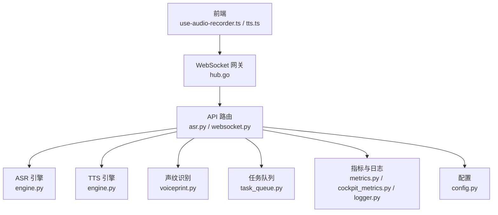

图表来源
- [frontend_design/src/hooks/use-audio-recorder.ts](file://frontend_design/src/hooks/use-audio-recorder.ts)
- [frontend_design/src/lib/tts.ts](file://frontend_design/src/lib/tts.ts)
- [backend_design/nexus_gate/internal/ws/hub.go](file://backend_design/nexus_gate/internal/ws/hub.go)
- [backend_design/nexus/api/routes/asr.py](file://backend_design/nexus/api/routes/asr.py)
- [backend_design/nexus/api/websocket.py](file://backend_design/nexus/api/websocket.py)
- [backend_design/nexus/asr/engine.py](file://backend_design/nexus/asr/engine.py)
- [backend_design/nexus/tts/engine.py](file://backend_design/nexus/tts/engine.py)
- [backend_design/nexus/core/voiceprint.py](file://backend_design/nexus/core/voiceprint.py)
- [backend_design/nexus/middleware/task_queue.py](file://backend_design/nexus/middleware/task_queue.py)
- [backend_design/nexus/observability/metrics.py](file://backend_design/nexus/observability/metrics.py)
- [backend_design/nexus/observability/cockpit_metrics.py](file://backend_design/nexus/observability/cockpit_metrics.py)
- [backend_design/nexus/core/logger.py](file://backend_design/nexus/core/logger.py)
- [backend_design/nexus/config.py](file://backend_design/nexus/config.py)

章节来源
- [backend_design/nexus/asr/engine.py](file://backend_design/nexus/asr/engine.py)
- [backend_design/nexus/tts/engine.py](file://backend_design/nexus/tts/engine.py)
- [backend_design/nexus/core/voiceprint.py](file://backend_design/nexus/core/voiceprint.py)
- [backend_design/nexus/api/websocket.py](file://backend_design/nexus/api/websocket.py)
- [backend_design/nexus/api/routes/asr.py](file://backend_design/nexus/api/routes/asr.py)
- [backend_design/nexus/models/schemas.py](file://backend_design/nexus/models/schemas.py)
- [backend_design/nexus/config.py](file://backend_design/nexus/config.py)
- [backend_design/nexus/observability/metrics.py](file://backend_design/nexus/observability/metrics.py)
- [backend_design/nexus/observability/cockpit_metrics.py](file://backend_design/nexus/observability/cockpit_metrics.py)
- [backend_design/nexus/core/logger.py](file://backend_design/nexus/core/logger.py)
- [backend_design/nexus/middleware/task_queue.py](file://backend_design/nexus/middleware/task_queue.py)
- [frontend_design/src/hooks/use-audio-recorder.ts](file://frontend_design/src/hooks/use-audio-recorder.ts)
- [frontend_design/src/lib/tts.ts](file://frontend_design/src/lib/tts.ts)
- [backend_design/nexus_gate/internal/ws/hub.go](file://backend_design/nexus_gate/internal/ws/hub.go)
- [backend_design/nexus_gate/proto/nexus.proto](file://backend_design/nexus_gate/proto/nexus.proto)

## 核心组件
- 前端录音与播放
  - 录音 Hook：封装浏览器媒体流采集、分片与状态管理
  - TTS 客户端：负责播放服务端返回的音频片段或流式片段
- 网关 WebSocket Hub
  - 维护连接、转发二进制帧、广播与订阅
- API 路由与 WebSocket 处理器
  - 暴露 ASR 接口、WebSocket 音频通道、会话上下文绑定
- ASR 引擎
  - 接收音频帧/块，执行识别并输出文本或增量结果
- TTS 引擎
  - 接收文本或结构化指令，生成音频流或片段
- 声纹识别
  - 基于音频特征进行用户身份校验或个性化适配
- 任务队列
  - 将耗时任务（如离线转写、批量处理）异步化
- 可观测性与配置
  - 指标上报、日志记录、熔断器与全局配置

章节来源
- [frontend_design/src/hooks/use-audio-recorder.ts](file://frontend_design/src/hooks/use-audio-recorder.ts)
- [frontend_design/src/lib/tts.ts](file://frontend_design/src/lib/tts.ts)
- [backend_design/nexus_gate/internal/ws/hub.go](file://backend_design/nexus_gate/internal/ws/hub.go)
- [backend_design/nexus/api/websocket.py](file://backend_design/nexus/api/websocket.py)
- [backend_design/nexus/api/routes/asr.py](file://backend_design/nexus/api/routes/asr.py)
- [backend_design/nexus/asr/engine.py](file://backend_design/nexus/asr/engine.py)
- [backend_design/nexus/tts/engine.py](file://backend_design/nexus/tts/engine.py)
- [backend_design/nexus/core/voiceprint.py](file://backend_design/nexus/core/voiceprint.py)
- [backend_design/nexus/middleware/task_queue.py](file://backend_design/nexus/middleware/task_queue.py)
- [backend_design/nexus/observability/metrics.py](file://backend_design/nexus/observability/metrics.py)
- [backend_design/nexus/observability/cockpit_metrics.py](file://backend_design/nexus/observability/cockpit_metrics.py)
- [backend_design/nexus/core/logger.py](file://backend_design/nexus/core/logger.py)
- [backend_design/nexus/config.py](file://backend_design/nexus/config.py)

## 架构总览
整体采用“前端采集 -> 网关透传 -> 后端统一处理 -> 多模态能力”的分层架构。关键特性：
- 统一音频帧模型：通过数据模型定义采样率、编码格式、时间戳等元信息
- 流式优先：WebSocket 承载双向音频帧，支持增量识别与边播边识
- 异步编排：任务队列承接非实时任务，避免阻塞主路径
- 可观测闭环：指标与日志贯穿全链路，结合熔断器提升鲁棒性

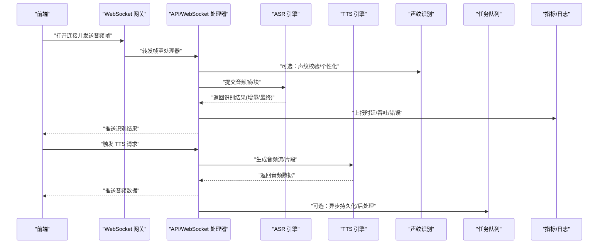

图表来源
- [backend_design/nexus_gate/internal/ws/hub.go](file://backend_design/nexus_gate/internal/ws/hub.go)
- [backend_design/nexus/api/websocket.py](file://backend_design/nexus/api/websocket.py)
- [backend_design/nexus/api/routes/asr.py](file://backend_design/nexus/api/routes/asr.py)
- [backend_design/nexus/asr/engine.py](file://backend_design/nexus/asr/engine.py)
- [backend_design/nexus/tts/engine.py](file://backend_design/nexus/tts/engine.py)
- [backend_design/nexus/core/voiceprint.py](file://backend_design/nexus/core/voiceprint.py)
- [backend_design/nexus/middleware/task_queue.py](file://backend_design/nexus/middleware/task_queue.py)
- [backend_design/nexus/observability/metrics.py](file://backend_design/nexus/observability/metrics.py)
- [backend_design/nexus/observability/cockpit_metrics.py](file://backend_design/nexus/observability/cockpit_metrics.py)

## 详细组件分析

### 统一音频帧与数据模型
- 目标：为不同来源（前端采集、网关转发、内部模块）提供一致的音频帧描述
- 关键字段建议：采样率、声道数、编码格式、时间戳、序列号、会话 ID、质量参数
- 使用位置：API 路由与引擎间传递、WebSocket 消息体、任务队列作业

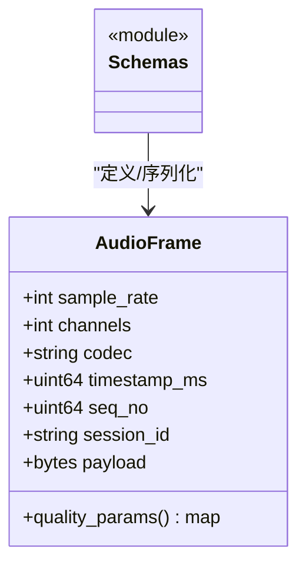

图表来源
- [backend_design/nexus/models/schemas.py](file://backend_design/nexus/models/schemas.py)

章节来源
- [backend_design/nexus/models/schemas.py](file://backend_design/nexus/models/schemas.py)

### 前端录音与播放
- 录音 Hook
  - 职责：初始化媒体流、按固定时长切片、携带时间戳与序列号、异常重连
  - 输出：音频帧数组或字节流，供 WebSocket 发送
- TTS 客户端
  - 职责：建立连接、接收音频片段、拼接播放、处理中断与重放
  - 输出：播放器事件（开始、暂停、结束、错误）

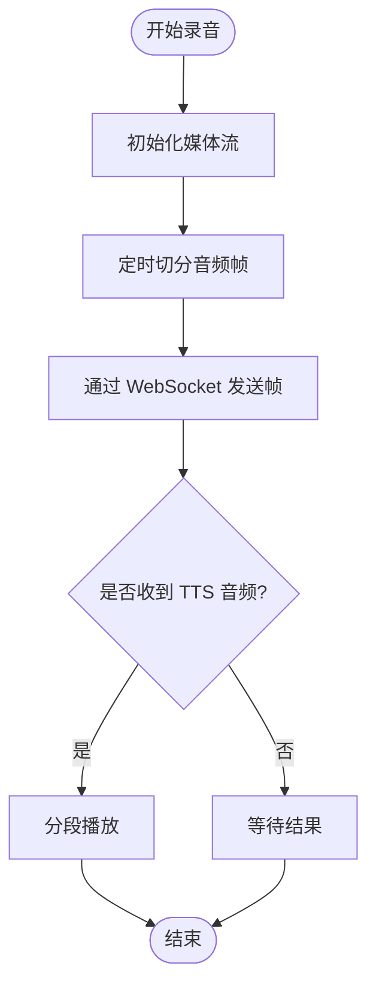

图表来源
- [frontend_design/src/hooks/use-audio-recorder.ts](file://frontend_design/src/hooks/use-audio-recorder.ts)
- [frontend_design/src/lib/tts.ts](file://frontend_design/src/lib/tts.ts)

章节来源
- [frontend_design/src/hooks/use-audio-recorder.ts](file://frontend_design/src/hooks/use-audio-recorder.ts)
- [frontend_design/src/lib/tts.ts](file://frontend_design/src/lib/tts.ts)

### 网关 WebSocket Hub
- 职责：连接生命周期管理、消息路由、心跳检测、背压控制
- 关键点：二进制帧透传、扇出广播、错误隔离

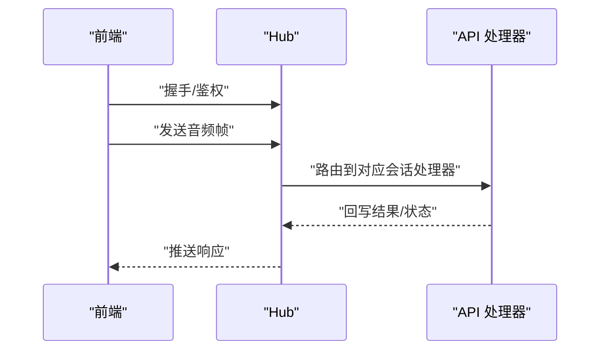

图表来源
- [backend_design/nexus_gate/internal/ws/hub.go](file://backend_design/nexus_gate/internal/ws/hub.go)
- [backend_design/nexus_gate/proto/nexus.proto](file://backend_design/nexus_gate/proto/nexus.proto)

章节来源
- [backend_design/nexus_gate/internal/ws/hub.go](file://backend_design/nexus_gate/internal/ws/hub.go)
- [backend_design/nexus_gate/proto/nexus.proto](file://backend_design/nexus_gate/proto/nexus.proto)

### API 路由与 WebSocket 处理器
- 职责：解析请求、绑定会话上下文、调用 ASR/TTS/声纹、上报指标、错误处理
- 要点：流式读写、超时控制、幂等与去抖

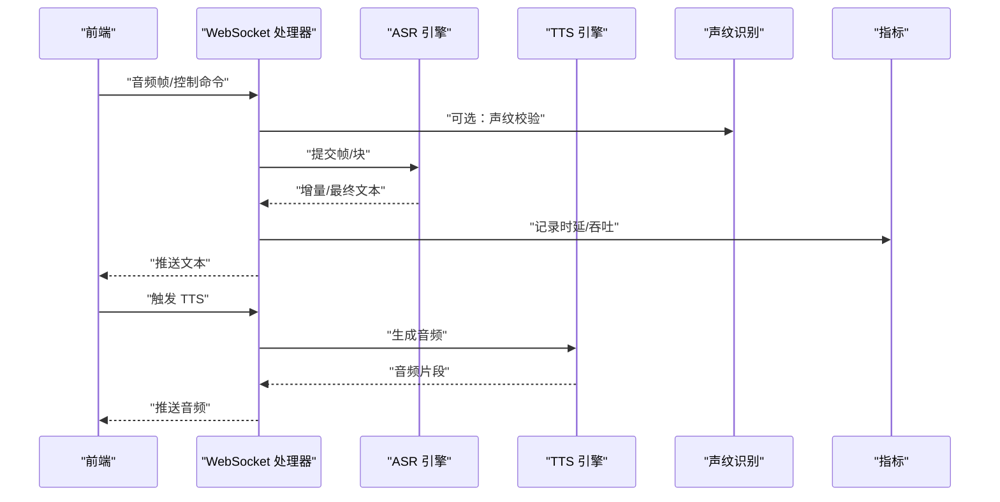

图表来源
- [backend_design/nexus/api/websocket.py](file://backend_design/nexus/api/websocket.py)
- [backend_design/nexus/api/routes/asr.py](file://backend_design/nexus/api/routes/asr.py)
- [backend_design/nexus/asr/engine.py](file://backend_design/nexus/asr/engine.py)
- [backend_design/nexus/tts/engine.py](file://backend_design/nexus/tts/engine.py)
- [backend_design/nexus/core/voiceprint.py](file://backend_design/nexus/core/voiceprint.py)
- [backend_design/nexus/observability/metrics.py](file://backend_design/nexus/observability/metrics.py)

章节来源
- [backend_design/nexus/api/websocket.py](file://backend_design/nexus/api/websocket.py)
- [backend_design/nexus/api/routes/asr.py](file://backend_design/nexus/api/routes/asr.py)
- [backend_design/nexus/asr/engine.py](file://backend_design/nexus/asr/engine.py)
- [backend_design/nexus/tts/engine.py](file://backend_design/nexus/tts/engine.py)
- [backend_design/nexus/core/voiceprint.py](file://backend_design/nexus/core/voiceprint.py)
- [backend_design/nexus/observability/metrics.py](file://backend_design/nexus/observability/metrics.py)

### ASR 引擎
- 输入：标准化后的音频帧/块
- 处理：VAD/降噪/增强（可选前置）、声学模型推理、语言模型后处理
- 输出：增量文本、置信度、时间戳对齐信息
- 注意：批大小与窗口长度对延迟的影响；失败降级与缓存

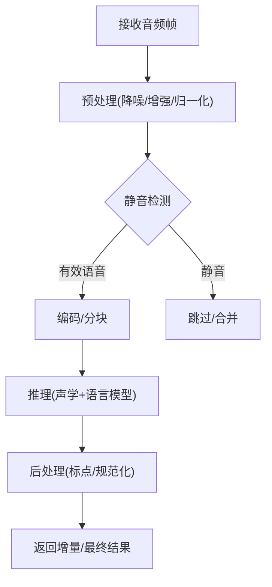

图表来源
- [backend_design/nexus/asr/engine.py](file://backend_design/nexus/asr/engine.py)

章节来源
- [backend_design/nexus/asr/engine.py](file://backend_design/nexus/asr/engine.py)

### TTS 引擎
- 输入：文本或结构化指令（含说话人、风格、语速等）
- 处理：文本归一化、韵律预测、声学/声码器合成
- 输出：PCM/Opus 等编码的音频片段或流
- 注意：首包延迟优化、流式拼接、断点续播

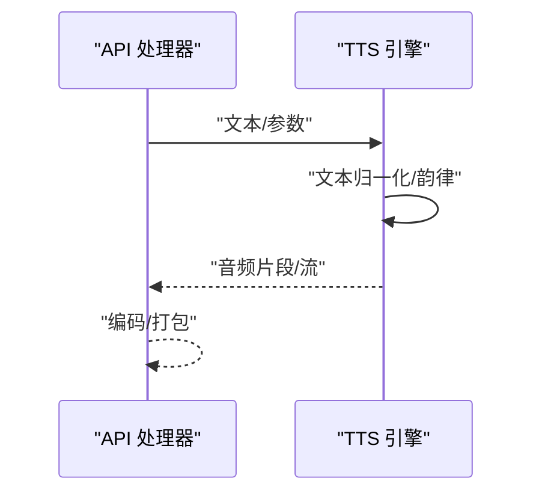

图表来源
- [backend_design/nexus/tts/engine.py](file://backend_design/nexus/tts/engine.py)

章节来源
- [backend_design/nexus/tts/engine.py](file://backend_design/nexus/tts/engine.py)

### 声纹识别
- 输入：短时音频片段或特征向量
- 处理：特征提取、相似度计算、阈值判定
- 输出：用户 ID/置信度/拒绝理由
- 用途：个性化 TTS、权限控制、对话记忆关联

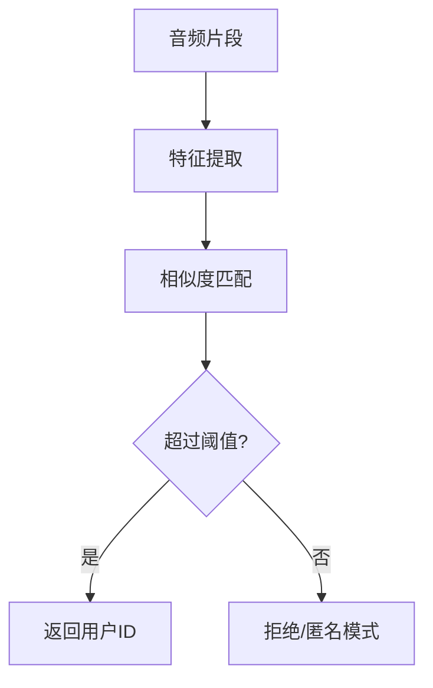

图表来源
- [backend_design/nexus/core/voiceprint.py](file://backend_design/nexus/core/voiceprint.py)

章节来源
- [backend_design/nexus/core/voiceprint.py](file://backend_design/nexus/core/voiceprint.py)

### 任务队列与异步处理
- 适用场景：离线转写、批量增强、长音频归档、统计聚合
- 设计要点：优先级、重试、死信队列、进度回调

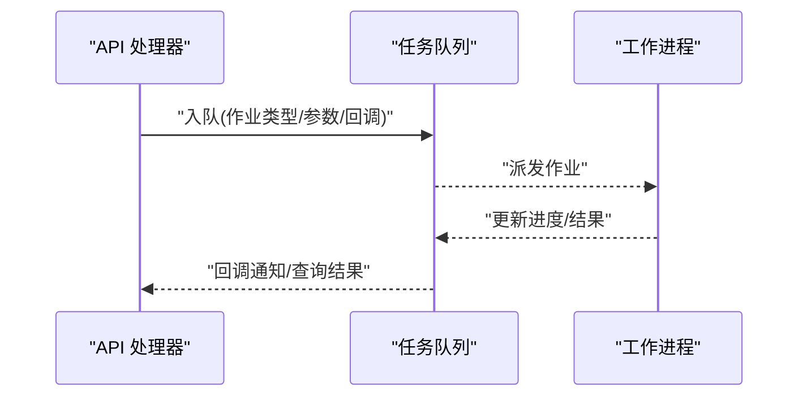

图表来源
- [backend_design/nexus/middleware/task_queue.py](file://backend_design/nexus/middleware/task_queue.py)

章节来源
- [backend_design/nexus/middleware/task_queue.py](file://backend_design/nexus/middleware/task_queue.py)

### 配置与可观测性
- 配置项：采样率、编码格式、超时、重试次数、队列容量、限流阈值
- 指标：端到端时延、首包时延、吞吐、错误率、队列积压、CPU/内存
- 日志：结构化字段（session_id、seq_no、component、latency_ms、error_code）

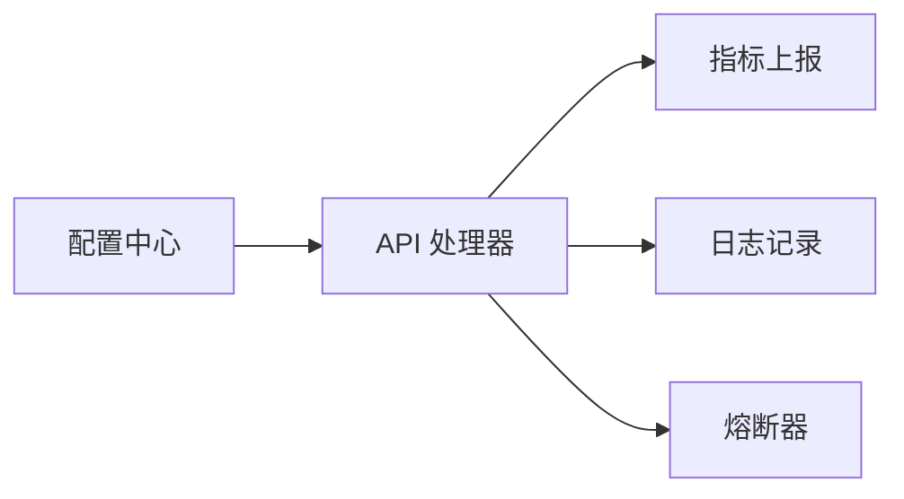

图表来源
- [backend_design/nexus/config.py](file://backend_design/nexus/config.py)
- [backend_design/nexus/observability/metrics.py](file://backend_design/nexus/observability/metrics.py)
- [backend_design/nexus/observability/cockpit_metrics.py](file://backend_design/nexus/observability/cockpit_metrics.py)
- [backend_design/nexus/core/logger.py](file://backend_design/nexus/core/logger.py)
- [backend_design/nexus/core/circuit_breaker.py](file://backend_design/nexus/core/circuit_breaker.py)

章节来源
- [backend_design/nexus/config.py](file://backend_design/nexus/config.py)
- [backend_design/nexus/observability/metrics.py](file://backend_design/nexus/observability/metrics.py)
- [backend_design/nexus/observability/cockpit_metrics.py](file://backend_design/nexus/observability/cockpit_metrics.py)
- [backend_design/nexus/core/logger.py](file://backend_design/nexus/core/logger.py)
- [backend_design/nexus/core/circuit_breaker.py](file://backend_design/nexus/core/circuit_breaker.py)

## 依赖关系分析
- 耦合关系
  - API 处理器依赖 ASR/TTS/声纹/队列/指标/配置
  - 网关 Hub 仅关注连接与转发，降低业务耦合
- 外部依赖
  - 模型库（ASR/TTS/声纹）
  - 存储/缓存（可选用于会话与结果缓存）
  - 监控系统（Prometheus/Grafana/Loki）

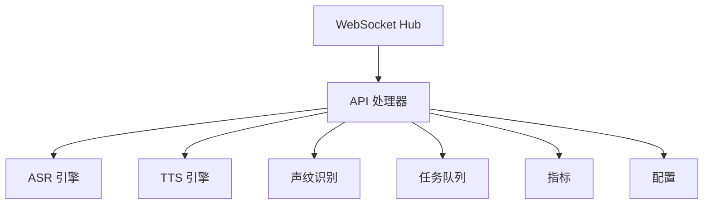

图表来源
- [backend_design/nexus/api/websocket.py](file://backend_design/nexus/api/websocket.py)
- [backend_design/nexus/api/routes/asr.py](file://backend_design/nexus/api/routes/asr.py)
- [backend_design/nexus/asr/engine.py](file://backend_design/nexus/asr/engine.py)
- [backend_design/nexus/tts/engine.py](file://backend_design/nexus/tts/engine.py)
- [backend_design/nexus/core/voiceprint.py](file://backend_design/nexus/core/voiceprint.py)
- [backend_design/nexus/middleware/task_queue.py](file://backend_design/nexus/middleware/task_queue.py)
- [backend_design/nexus/observability/metrics.py](file://backend_design/nexus/observability/metrics.py)
- [backend_design/nexus/config.py](file://backend_design/nexus/config.py)
- [backend_design/nexus_gate/internal/ws/hub.go](file://backend_design/nexus_gate/internal/ws/hub.go)

章节来源
- [backend_design/nexus/api/websocket.py](file://backend_design/nexus/api/websocket.py)
- [backend_design/nexus/api/routes/asr.py](file://backend_design/nexus/api/routes/asr.py)
- [backend_design/nexus/asr/engine.py](file://backend_design/nexus/asr/engine.py)
- [backend_design/nexus/tts/engine.py](file://backend_design/nexus/tts/engine.py)
- [backend_design/nexus/core/voiceprint.py](file://backend_design/nexus/core/voiceprint.py)
- [backend_design/nexus/middleware/task_queue.py](file://backend_design/nexus/middleware/task_queue.py)
- [backend_design/nexus/observability/metrics.py](file://backend_design/nexus/observability/metrics.py)
- [backend_design/nexus/config.py](file://backend_design/nexus/config.py)
- [backend_design/nexus_gate/internal/ws/hub.go](file://backend_design/nexus_gate/internal/ws/hub.go)

## 性能考虑
- 缓冲管理
  - 前端：固定时长切片（如 20-50ms），减少网络抖动影响
  - 后端：环形缓冲/双缓冲，避免拷贝开销
- 实时流处理
  - 增量识别：滑动窗口 + 早停策略
  - 流式 TTS：首包快速返回，后续片段低延迟拼接
- 异步处理
  - 非关键路径任务入队，释放主线程
  - 背压控制：当队列深度超限时主动降采样或丢弃低优先级帧
- 编码与压缩
  - 传输层优先选择 Opus/MP3/AAC 等高效编码
  - 根据带宽自适应码率
- 并发与资源
  - 引擎侧线程池/协程池隔离，避免热点会话互相影响
  - GPU/CPU 资源配额与抢占策略

[本节为通用指导，不直接分析具体文件]

## 故障排查指南
- 常见问题定位
  - 连接断开：检查网关心跳与会话清理逻辑
  - 识别卡顿：查看 ASR 队列积压、模型加载耗时、VAD 误判
  - 播放卡顿：检查 TTS 首包延迟、网络丢包、前端缓冲策略
- 重试与熔断
  - 指数退避重试：限制最大重试次数与总超时
  - 熔断器：当错误率/时延超阈自动降级（如切换轻量模型或关闭增强）
- 指标与日志
  - 关键指标：端到端时延、首包时延、吞吐、错误率、队列深度、CPU/内存
  - 日志字段：session_id、seq_no、component、latency_ms、error_code、retry_count

章节来源
- [backend_design/nexus/core/circuit_breaker.py](file://backend_design/nexus/core/circuit_breaker.py)
- [backend_design/nexus/observability/metrics.py](file://backend_design/nexus/observability/metrics.py)
- [backend_design/nexus/observability/cockpit_metrics.py](file://backend_design/nexus/observability/cockpit_metrics.py)
- [backend_design/nexus/core/logger.py](file://backend_design/nexus/core/logger.py)

## 结论
NexusCockpit 的音频处理管道以“统一帧模型 + 流式优先 + 异步编排 + 可观测闭环”为核心，兼顾低延迟与高可用。通过合理的前端切片、网关透传、后端引擎编排与指标监控，可在复杂环境下稳定提供高质量的语音交互体验。

## 附录
- 术语
  - VAD：语音活动检测
  - Opus：高效音频编码格式
  - 首包时延：从请求到首个音频/文本返回的时间
- 参考实现路径
  - 前端录音与播放：[use-audio-recorder.ts](file://frontend_design/src/hooks/use-audio-recorder.ts)、[tts.ts](file://frontend_design/src/lib/tts.ts)
  - 网关与协议：[hub.go](file://backend_design/nexus_gate/internal/ws/hub.go)、[nexus.proto](file://backend_design/nexus_gate/proto/nexus.proto)
  - 后端处理：[websocket.py](file://backend_design/nexus/api/websocket.py)、[asr.py](file://backend_design/nexus/api/routes/asr.py)、[engine.py (ASR)](file://backend_design/nexus/asr/engine.py)、[engine.py (TTS)](file://backend_design/nexus/tts/engine.py)、[voiceprint.py](file://backend_design/nexus/core/voiceprint.py)
  - 可观测性与配置：[metrics.py](file://backend_design/nexus/observability/metrics.py)、[cockpit_metrics.py](file://backend_design/nexus/observability/cockpit_metrics.py)、[logger.py](file://backend_design/nexus/core/logger.py)、[config.py](file://backend_design/nexus/config.py)