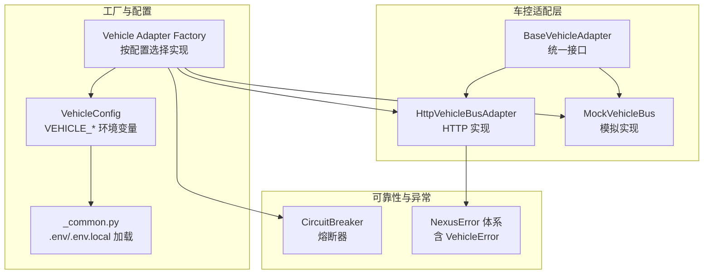
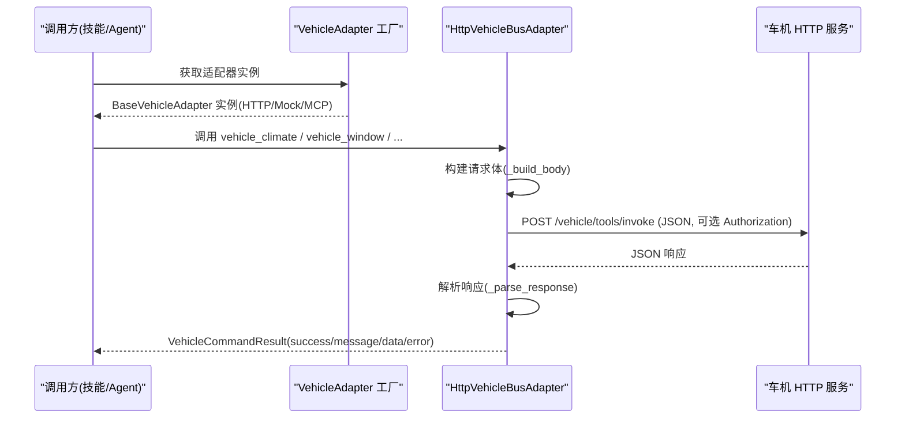
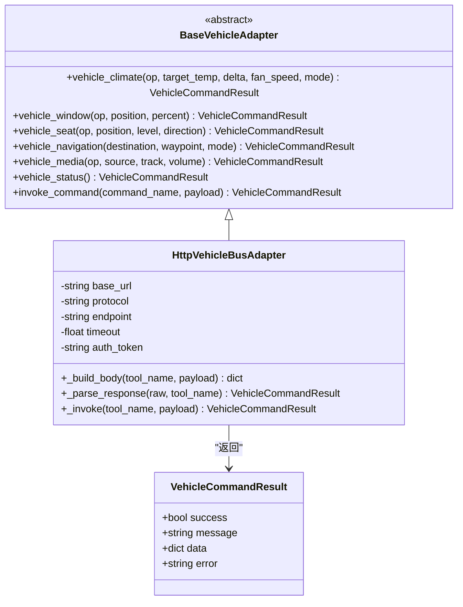
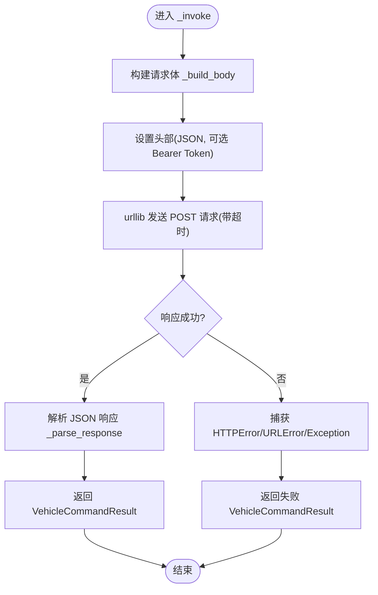
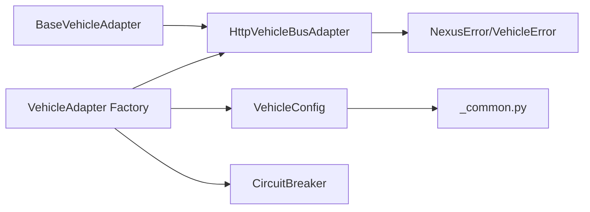

# HTTP RESTful 传输层

<cite>
**本文引用的文件**   
- [backend_design/nexus/vehicle/http.py](file://backend_design/nexus/vehicle/http.py)
- [backend_design/nexus/vehicle/base.py](file://backend_design/nexus/vehicle/base.py)
- [backend_design/nexus/vehicle/factory.py](file://backend_design/nexus/vehicle/factory.py)
- [backend_design/nexus/config/vehicle.py](file://backend_design/nexus/config/vehicle.py)
- [backend_design/nexus/core/circuit_breaker.py](file://backend_design/nexus/core/circuit_breaker.py)
- [backend_design/nexus/core/exceptions.py](file://backend_design/nexus/core/exceptions.py)
- [backend_design/nexus/config/_common.py](file://backend_design/nexus/config/_common.py)
</cite>

## 目录
1. [简介](#简介)
2. [项目结构](#项目结构)
3. [核心组件](#核心组件)
4. [架构总览](#架构总览)
5. [详细组件分析](#详细组件分析)
6. [依赖关系分析](#依赖关系分析)
7. [性能与安全性](#性能与安全性)
8. [故障排查指南](#故障排查指南)
9. [结论](#结论)
10. [附录：配置与使用示例](#附录配置与使用示例)

## 简介
本技术文档聚焦 NexusCockpit 的 HTTP RESTful 传输层，即通过 HTTP/REST 与真实车辆服务进行通信的适配实现。内容涵盖：
- HTTP 适配器的工作原理、请求构建与响应解析
- 错误处理、重试策略与超时配置
- 不同车辆 API 端点与认证方式的配置方法
- 网络安全性、性能优化与故障排查建议
- 结合工厂模式与熔断器的集成方式

该传输层以统一的抽象接口暴露车控能力（空调、车窗、座椅、导航、媒体、状态查询等），并通过 HTTP 适配器将上层技能与具体车机后端解耦。

## 项目结构
HTTP 传输层位于 vehicle 模块中，围绕 base 抽象、http 实现与 factory 工厂组织代码；配置由 config.vehicle 提供；异常与熔断器分别位于 core.exceptions 与 core.circuit_breaker。

图表来源
- [backend_design/nexus/vehicle/base.py:1-92](file://backend_design/nexus/vehicle/base.py#L1-L92)
- [backend_design/nexus/vehicle/http.py:1-127](file://backend_design/nexus/vehicle/http.py#L1-L127)
- [backend_design/nexus/vehicle/factory.py:1-147](file://backend_design/nexus/vehicle/factory.py#L1-L147)
- [backend_design/nexus/config/vehicle.py:1-50](file://backend_design/nexus/config/vehicle.py#L1-L50)
- [backend_design/nexus/config/_common.py:1-75](file://backend_design/nexus/config/_common.py#L1-L75)
- [backend_design/nexus/core/circuit_breaker.py:1-177](file://backend_design/nexus/core/circuit_breaker.py#L1-L177)
- [backend_design/nexus/core/exceptions.py:1-128](file://backend_design/nexus/core/exceptions.py#L1-L128)

章节来源
- [backend_design/nexus/vehicle/base.py:1-92](file://backend_design/nexus/vehicle/base.py#L1-L92)
- [backend_design/nexus/vehicle/http.py:1-127](file://backend_design/nexus/vehicle/http.py#L1-L127)
- [backend_design/nexus/vehicle/factory.py:1-147](file://backend_design/nexus/vehicle/factory.py#L1-L147)
- [backend_design/nexus/config/vehicle.py:1-50](file://backend_design/nexus/config/vehicle.py#L1-L50)
- [backend_design/nexus/config/_common.py:1-75](file://backend_design/nexus/config/_common.py#L1-L75)
- [backend_design/nexus/core/circuit_breaker.py:1-177](file://backend_design/nexus/core/circuit_breaker.py#L1-L177)
- [backend_design/nexus/core/exceptions.py:1-128](file://backend_design/nexus/core/exceptions.py#L1-L128)

## 核心组件
- BaseVehicleAdapter：定义车控能力的统一抽象接口，包括空调、车窗、座椅、导航、媒体、状态查询与通用命令调用。所有实现（HTTP/Mock/MCP）均遵循此契约。
- HttpVehicleBusAdapter：基于标准库 urllib 的 HTTP 客户端实现，负责构建请求体、设置头部（含可选 Bearer Token）、发送 POST 请求并解析 JSON 响应，返回统一的 VehicleCommandResult。
- VehicleAdapter Factory：根据环境变量 VEHICLE_ADAPTER 与相关 VEHICLE_API_* 配置动态创建 HTTP/Mock/MCP 适配器实例，并提供多座舱隔离能力（Mock 模式下）。
- VehicleConfig：集中管理车控适配器类型、HTTP 地址、协议、端点、超时、Token 以及 MCP 启动参数等配置项，支持从 .env/.env.local 加载。
- CircuitBreaker：为外部服务调用提供熔断保护，防止级联失败。
- NexusError 体系：包含 VehicleError 等专用异常，便于上层统一捕获与处理。

章节来源
- [backend_design/nexus/vehicle/base.py:1-92](file://backend_design/nexus/vehicle/base.py#L1-L92)
- [backend_design/nexus/vehicle/http.py:1-127](file://backend_design/nexus/vehicle/http.py#L1-L127)
- [backend_design/nexus/vehicle/factory.py:1-147](file://backend_design/nexus/vehicle/factory.py#L1-L147)
- [backend_design/nexus/config/vehicle.py:1-50](file://backend_design/nexus/config/vehicle.py#L1-L50)
- [backend_design/nexus/core/circuit_breaker.py:1-177](file://backend_design/nexus/core/circuit_breaker.py#L1-L177)
- [backend_design/nexus/core/exceptions.py:1-128](file://backend_design/nexus/core/exceptions.py#L1-L128)

## 架构总览
HTTP 传输层在整体架构中的位置如下：上层技能或 Agent 通过 BaseVehicleAdapter 抽象调用车控能力；Factory 根据配置选择 HttpVehicleBusAdapter；HTTP 适配器通过 urllib 向车机服务发起 POST 请求；响应经统一解析后封装为 VehicleCommandResult 返回给调用方。

图表来源
- [backend_design/nexus/vehicle/factory.py:1-147](file://backend_design/nexus/vehicle/factory.py#L1-L147)
- [backend_design/nexus/vehicle/http.py:1-127](file://backend_design/nexus/vehicle/http.py#L1-L127)

## 详细组件分析

### BaseVehicleAdapter 抽象接口
- 职责：定义车控能力的统一方法签名与返回值类型 VehicleCommandResult，屏蔽底层实现差异。
- 关键方法：vehicle_climate、vehicle_window、vehicle_seat、vehicle_navigation、vehicle_media、vehicle_status、invoke_command。
- 复杂度：接口方法均为 O(1) 声明，实际复杂度取决于具体实现。

图表来源
- [backend_design/nexus/vehicle/base.py:1-92](file://backend_design/nexus/vehicle/base.py#L1-L92)
- [backend_design/nexus/vehicle/http.py:1-127](file://backend_design/nexus/vehicle/http.py#L1-L127)

章节来源
- [backend_design/nexus/vehicle/base.py:1-92](file://backend_design/nexus/vehicle/base.py#L1-L92)

### HttpVehicleBusAdapter 实现
- 请求构建：
  - 根据 protocol 决定请求体格式：rest 模式生成 {"tool": name, "arguments": payload}；jsonrpc 模式生成 {"jsonrpc":"2.0","id":...,"method":name,"params":payload}。
  - 头部设置 Content-Type/Accept 为 application/json；若配置了 auth_token，则附加 Authorization: Bearer <token>。
  - 使用 urllib.request.Request 构造 POST 请求，base_url 与 endpoint 拼接为完整 URL。
- 发送与超时：
  - 通过 urllib.request.urlopen 发送请求，timeout 由配置 api_timeout 控制。
- 响应解析：
  - 优先尝试 JSON 解析；若存在 result 字段且为字典，则提取 result 作为数据主体。
  - 支持多种响应结构：{"success","message","data","error"} 或 {"error":{...}} 或直接返回原始数据。
  - 非 JSON 或解析失败时，返回失败结果并附带错误码 invalid_response。
- 错误处理：
  - HTTPError：返回失败结果，携带 HTTP 状态码信息。
  - URLError：连接失败，错误码 connection_failed。
  - 其他异常：调用失败，错误码 invoke_failed。

图表来源
- [backend_design/nexus/vehicle/http.py:1-127](file://backend_design/nexus/vehicle/http.py#L1-L127)

章节来源
- [backend_design/nexus/vehicle/http.py:1-127](file://backend_design/nexus/vehicle/http.py#L1-L127)

### VehicleAdapter Factory 与多座舱隔离
- 单例与缓存：
  - build_vehicle_adapter 首次创建后缓存为模块级单例，避免重复初始化。
  - get_cockpit_vehicle_adapter 为每个 cockpit_id 维护独立实例映射；Mock 模式每座舱独立，HTTP/MCP 无状态复用单例。
- 创建逻辑：
  - 读取 VehicleConfig 的 adapter、api_base_url、api_protocol、api_endpoint、api_timeout、api_token 等。
  - 当 adapter 为 http/rest/remote 且 api_base_url 非空时，创建 HttpVehicleBusAdapter。
  - 否则回退到 Mock 模式（默认）。

章节来源
- [backend_design/nexus/vehicle/factory.py:1-147](file://backend_design/nexus/vehicle/factory.py#L1-L147)

### VehicleConfig 配置项与环境加载
- 配置项说明：
  - adapter：适配器类型（mock/http/mcp）
  - api_base_url：HTTP 模式的车机 API 地址
  - api_protocol：协议类型（rest/jsonrpc）
  - api_endpoint：HTTP 接口路径（默认 /vehicle/tools/invoke）
  - api_timeout：HTTP 调用超时（秒）
  - api_token：HTTP 认证 Token（Bearer）
  - mcp_command/mcp_args/mcp_workdir/mcp_validate_tools：MCP 模式相关配置
- 环境加载：
  - 通过 pydantic_settings.BaseSettings 与 SettingsConfigDict(env_file=...) 加载 .env/.env.local。
  - _common.py 自动定位项目根目录并优先加载 .env.local，再回退 .env。

章节来源
- [backend_design/nexus/config/vehicle.py:1-50](file://backend_design/nexus/config/vehicle.py#L1-L50)
- [backend_design/nexus/config/_common.py:1-75](file://backend_design/nexus/config/_common.py#L1-L75)

### 熔断器与异常体系
- CircuitBreaker：
  - 三态转换：CLOSED → OPEN（连续失败阈值）→ HALF_OPEN（恢复期后试探）→ CLOSED（试探成功）或 OPEN（试探失败）。
  - 适用于 LLM API、Milvus、车控服务等外部依赖，防止级联失败。
- NexusError 体系：
  - VehicleError 用于车控错误场景；CircuitBreakerError 用于熔断器拒绝请求。
  - 上层可统一捕获这些异常并进行降级或告警。

章节来源
- [backend_design/nexus/core/circuit_breaker.py:1-177](file://backend_design/nexus/core/circuit_breaker.py#L1-L177)
- [backend_design/nexus/core/exceptions.py:1-128](file://backend_design/nexus/core/exceptions.py#L1-L128)

## 依赖关系分析
- 模块耦合：
  - HttpVehicleBusAdapter 依赖 BaseVehicleAdapter 接口与 VehicleCommandResult 数据结构。
  - Factory 依赖 VehicleConfig 与 Logger，按需导入具体实现。
  - Config 依赖 _common 的环境文件加载逻辑。
- 外部依赖：
  - HTTP 适配器使用 Python 标准库 urllib.request 与 urllib.error。
  - 配置使用 pydantic_settings 与 dotenv。
- 潜在循环依赖：
  - 通过延迟导入（如 Factory 内部导入 MCP 实现）避免循环。

图表来源
- [backend_design/nexus/vehicle/base.py:1-92](file://backend_design/nexus/vehicle/base.py#L1-L92)
- [backend_design/nexus/vehicle/http.py:1-127](file://backend_design/nexus/vehicle/http.py#L1-L127)
- [backend_design/nexus/vehicle/factory.py:1-147](file://backend_design/nexus/vehicle/factory.py#L1-L147)
- [backend_design/nexus/config/vehicle.py:1-50](file://backend_design/nexus/config/vehicle.py#L1-L50)
- [backend_design/nexus/config/_common.py:1-75](file://backend_design/nexus/config/_common.py#L1-L75)
- [backend_design/nexus/core/circuit_breaker.py:1-177](file://backend_design/nexus/core/circuit_breaker.py#L1-L177)
- [backend_design/nexus/core/exceptions.py:1-128](file://backend_design/nexus/core/exceptions.py#L1-L128)

章节来源
- [backend_design/nexus/vehicle/base.py:1-92](file://backend_design/nexus/vehicle/base.py#L1-L92)
- [backend_design/nexus/vehicle/http.py:1-127](file://backend_design/nexus/vehicle/http.py#L1-L127)
- [backend_design/nexus/vehicle/factory.py:1-147](file://backend_design/nexus/vehicle/factory.py#L1-L147)
- [backend_design/nexus/config/vehicle.py:1-50](file://backend_design/nexus/config/vehicle.py#L1-L50)
- [backend_design/nexus/config/_common.py:1-75](file://backend_design/nexus/config/_common.py#L1-L75)
- [backend_design/nexus/core/circuit_breaker.py:1-177](file://backend_design/nexus/core/circuit_breaker.py#L1-L177)
- [backend_design/nexus/core/exceptions.py:1-128](file://backend_design/nexus/core/exceptions.py#L1-L128)

## 性能与安全性
- 性能优化建议：
  - 连接复用：当前实现每次调用新建 Request，未显式启用连接池。生产环境建议使用支持连接池的 HTTP 客户端（如 requests.Session 或 aiohttp.ClientSession）以减少握手开销。
  - 超时调优：根据车机服务 SLA 调整 api_timeout，避免过短导致误判失败，过长影响用户体验。
  - 并发控制：在高并发场景下，结合熔断器与限流策略，避免雪崩。
  - 响应体压缩：若车机支持 gzip/deflate，启用压缩可降低带宽占用。
- 安全性建议：
  - 强制 HTTPS：确保 api_base_url 使用 https 协议，避免明文传输。
  - 证书校验：保持默认 CA 校验开启，必要时自定义 CA 证书路径。
  - 认证：使用 api_token 传递 Bearer Token，避免在日志中打印敏感信息。
  - 输入校验：对 payload 进行白名单校验，防止注入攻击。
  - 最小权限：Token 应具备最小必要权限，定期轮换。

[本节为通用指导，不直接分析具体文件]

## 故障排查指南
- 常见错误与定位：
  - HTTPError：检查车机服务可达性与端口、防火墙规则、API 路径是否正确。
  - URLError（connection_failed）：检查网络连通性、DNS 解析、代理设置。
  - invalid_response：确认车机返回 JSON 结构与字段命名是否符合预期。
  - invoke_failed：查看异常堆栈，定位具体失败原因。
- 诊断步骤：
  - 启用调试日志，记录请求体与响应体（注意脱敏）。
  - 使用 curl 或 Postman 验证车机 API 是否可用。
  - 检查 .env/.env.local 配置项是否正确加载。
  - 观察熔断器状态，判断是否因连续失败触发熔断。
- 降级策略：
  - 熔断器开启时，可切换至 Mock 模式进行功能验证。
  - 上层业务可根据 VehicleCommandResult.success 与 error 字段进行友好提示与重试。

章节来源
- [backend_design/nexus/vehicle/http.py:1-127](file://backend_design/nexus/vehicle/http.py#L1-L127)
- [backend_design/nexus/core/circuit_breaker.py:1-177](file://backend_design/nexus/core/circuit_breaker.py#L1-L177)
- [backend_design/nexus/core/exceptions.py:1-128](file://backend_design/nexus/core/exceptions.py#L1-L128)

## 结论
HTTP RESTful 传输层通过清晰的抽象接口与灵活的工厂模式，实现了与真实车辆服务的松耦合集成。其请求构建、响应解析与错误处理机制完备，配合熔断器与统一异常体系，具备较强的健壮性与可观测性。在生产环境中，建议进一步优化连接复用、超时策略与安全配置，以提升性能与稳定性。

[本节为总结性内容，不直接分析具体文件]

## 附录：配置与使用示例
- 环境变量配置（.env 或 .env.local）：
  - VEHICLE_ADAPTER=http
  - VEHICLE_API_BASE_URL=https://your-vehicle-api.example.com
  - VEHICLE_API_PROTOCOL=rest（或 jsonrpc）
  - VEHICLE_API_ENDPOINT=/vehicle/tools/invoke
  - VEHICLE_API_TIMEOUT=5.0
  - VEHICLE_API_TOKEN=your-bearer-token
- 使用示例（概念流程）：
  - 启动应用后，Factory 根据配置创建 HttpVehicleBusAdapter。
  - 调用 vehicle_climate("status") 或 vehicle_climate("set", target_temp=22) 等接口。
  - 适配器构建请求体并发送 POST 请求，解析响应后返回 VehicleCommandResult。
  - 上层根据 success 与 message 进行业务处理或用户反馈。

章节来源
- [backend_design/nexus/config/vehicle.py:1-50](file://backend_design/nexus/config/vehicle.py#L1-L50)
- [backend_design/nexus/vehicle/factory.py:1-147](file://backend_design/nexus/vehicle/factory.py#L1-L147)
- [backend_design/nexus/vehicle/http.py:1-127](file://backend_design/nexus/vehicle/http.py#L1-L127)