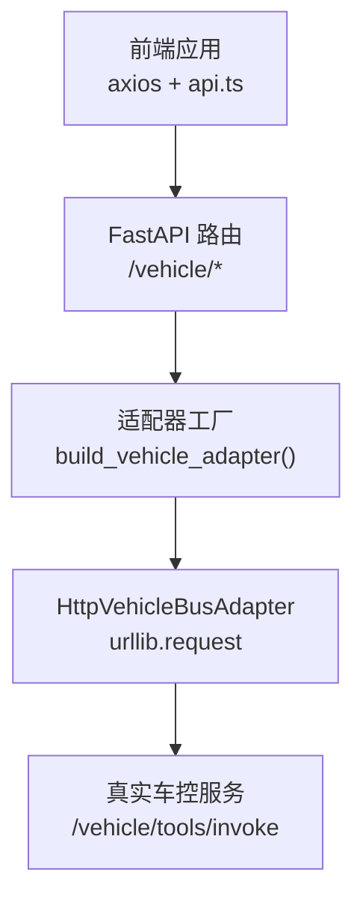
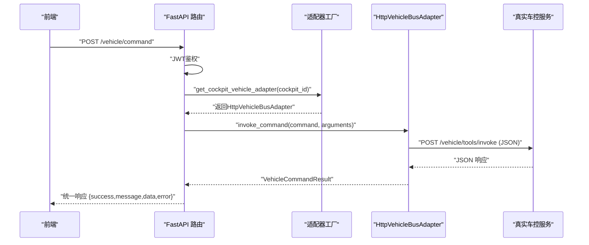
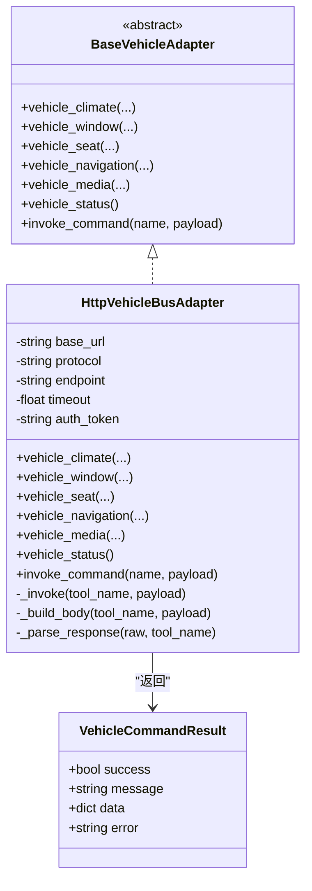
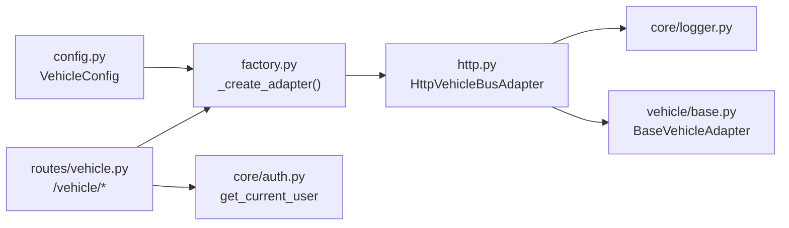

# HTTP模式（标准API）

<cite>
**本文引用的文件列表**
- [http.py](file://backend_design/nexus/vehicle/http.py)
- [base.py](file://backend_design/nexus/vehicle/base.py)
- [factory.py](file://backend_design/nexus/vehicle/factory.py)
- [config.py](file://backend_design/nexus/config.py)
- [vehicle.py](file://backend_design/nexus/api/routes/vehicle.py)
- [auth.py](file://backend_design/nexus/core/auth.py)
- [api.ts](file://frontend_design/src/lib/api.ts)
</cite>

## 目录
1. [简介](#简介)
2. [项目结构](#项目结构)
3. [核心组件](#核心组件)
4. [架构总览](#架构总览)
5. [详细组件分析](#详细组件分析)
6. [依赖关系分析](#依赖关系分析)
7. [性能与并发](#性能与并发)
8. [部署配置](#部署配置)
9. [故障排查指南](#故障排查指南)
10. [结论](#结论)

## 简介
本章节聚焦HTTP模式下的车控通信实现，围绕HttpVehicleBusAdapter类展开，说明其HTTP客户端封装、请求构建与响应处理机制；阐述与车机系统的REST API通信协议、认证方式（Authorization: Bearer）、超时配置、重试策略与错误处理；并给出连接池管理、并发控制与性能优化建议。同时提供HTTP接口的调用示例（车辆状态查询、设备控制命令发送、批量操作），以及部署配置与故障排查要点。

## 项目结构
HTTP模式涉及后端适配器、工厂装配、路由暴露、认证鉴权以及前端API封装等模块：
- 适配器层：HttpVehicleBusAdapter通过urllib发起HTTP请求，统一封装为VehicleCommandResult返回
- 工厂层：根据环境变量选择HTTP适配器并注入配置
- 路由层：FastAPI暴露POST /vehicle/command与GET /vehicle/status等接口
- 认证层：JWT鉴权，Authorization头携带Bearer Token
- 前端层：axios拦截器自动附加Token与座舱ID，并提供车控API方法

图示来源
- [vehicle.py:47-91](file://backend_design/nexus/api/routes/vehicle.py#L47-L91)
- [factory.py:87-103](file://backend_design/nexus/vehicle/factory.py#L87-L103)
- [http.py:63-86](file://backend_design/nexus/vehicle/http.py#L63-L86)
- [api.ts:357-375](file://frontend_design/src/lib/api.ts#L357-L375)

章节来源
- [vehicle.py:1-129](file://backend_design/nexus/api/routes/vehicle.py#L1-L129)
- [factory.py:1-148](file://backend_design/nexus/vehicle/factory.py#L1-L148)
- [http.py:1-118](file://backend_design/nexus/vehicle/http.py#L1-L118)
- [api.ts:114-175](file://frontend_design/src/lib/api.ts#L114-L175)

## 核心组件
- HttpVehicleBusAdapter：HTTP/REST车控适配器，负责构造请求体、设置认证头、发起HTTP POST、解析响应并转换为统一的VehicleCommandResult
- BaseVehicleAdapter与VehicleCommandResult：定义抽象接口与结果数据结构，确保多态与一致性
- Vehicle Routes：暴露直接执行车控命令与获取状态的REST接口，支持多座舱隔离
- Auth中间件：基于JWT的Bearer Token鉴权
- 前端API封装：自动附加Token与X-Cockpit-Id，统一错误处理与重试

章节来源
- [http.py:23-118](file://backend_design/nexus/vehicle/http.py#L23-L118)
- [base.py:19-92](file://backend_design/nexus/vehicle/base.py#L19-L92)
- [vehicle.py:47-91](file://backend_design/nexus/api/routes/vehicle.py#L47-L91)
- [auth.py:86-125](file://backend_design/nexus/core/auth.py#L86-L125)
- [api.ts:114-175](file://frontend_design/src/lib/api.ts#L114-L175)

## 架构总览
HTTP模式的整体数据流如下：
- 前端通过axios调用后端FastAPI的vehicle接口
- FastAPI路由在JWT鉴权后，从工厂获取当前座舱对应的适配器实例
- 适配器使用urllib向真实车控服务的统一入口发起POST请求
- 响应被解析为VehicleCommandResult，再映射到统一的JSON格式返回给前端

图示来源
- [vehicle.py:47-91](file://backend_design/nexus/api/routes/vehicle.py#L47-L91)
- [factory.py:87-103](file://backend_design/nexus/vehicle/factory.py#L87-L103)
- [http.py:63-86](file://backend_design/nexus/vehicle/http.py#L63-L86)

## 详细组件分析

### HttpVehicleBusAdapter类
- 初始化参数
  - base_url：车控服务基础地址
  - protocol：协议类型，默认rest，可选jsonrpc
  - endpoint：统一工具调用端点，默认/vehicle/tools/invoke
  - timeout：单次HTTP调用超时秒数
  - auth_token：可选的Bearer Token，用于Authorization头
- 请求构建
  - _build_body：根据protocol生成请求体
    - rest：{"tool": tool_name, "arguments": payload}
    - jsonrpc：{"jsonrpc":"2.0","id":毫秒时间戳,"method":tool_name,"params":payload}
  - headers：Content-Type与Accept均为application/json；若配置auth_token则添加Authorization: Bearer <token>
- 请求发送
  - 使用urllib.request.Request进行POST，data为UTF-8编码的JSON字符串
  - 超时由timeout控制
- 响应处理
  - 成功路径：读取响应体并尝试JSON解析；若包含result字段且为dict则取result作为最终数据
  - 兼容多种返回结构：
    - {"success":bool,"message":str,"data":dict,"error":str}
    - {"error":...}
    - 其他dict或原始值
  - 异常路径：
    - HTTPError：返回失败结果，附带HTTP状态码与原始响应
    - URLError：连接失败
    - 其他异常：调用失败
- 统一结果
  - 所有方法返回VehicleCommandResult，包含success、message、data、error字段

图示来源
- [base.py:35-92](file://backend_design/nexus/vehicle/base.py#L35-L92)
- [http.py:23-118](file://backend_design/nexus/vehicle/http.py#L23-L118)

章节来源
- [http.py:23-118](file://backend_design/nexus/vehicle/http.py#L23-L118)
- [base.py:19-92](file://backend_design/nexus/vehicle/base.py#L19-L92)

### REST API通信协议
- 统一入口：POST /vehicle/tools/invoke
- 请求体（REST协议）：
  - {"tool": "<command>", "arguments": {...}}
- 请求体（JSON-RPC协议）：
  - {"jsonrpc":"2.0","id":<毫秒时间戳>,"method":"<command>","params":{...}}
- 认证：
  - Authorization: Bearer <token>（当配置了auth_token时）
- 响应：
  - 可能包裹在{"result": ...}中，内部结构可包含success/message/data/error或error块
- 错误：
  - HTTP错误（如4xx/5xx）会被捕获并包装为失败结果
  - 连接失败或网络异常会返回特定错误信息

章节来源
- [http.py:88-117](file://backend_design/nexus/vehicle/http.py#L88-L117)

### 认证机制（auth_token）
- 后端适配器侧：
  - 若配置了auth_token，则在请求头中添加Authorization: Bearer <token>
- 前端侧：
  - axios拦截器自动附加Authorization头与X-Cockpit-Id头
  - 401时自动刷新Token并重试一次
- 服务端鉴权：
  - FastAPI依赖get_current_user校验JWT，未提供或无效返回401

章节来源
- [http.py:65-67](file://backend_design/nexus/vehicle/http.py#L65-L67)
- [api.ts:134-169](file://frontend_design/src/lib/api.ts#L134-L169)
- [auth.py:86-125](file://backend_design/nexus/core/auth.py#L86-L125)

### 超时配置
- 适配器超时：
  - 通过config.api_timeout传入，默认5秒
- 前端超时：
  - axios实例默认30秒
- 建议：
  - 根据车控服务SLA调整超时，避免长尾请求阻塞

章节来源
- [config.py:314-315](file://backend_design/nexus/config.py#L314-L315)
- [api.ts:115-121](file://frontend_design/src/lib/api.ts#L115-L121)

### 重试策略
- 当前实现：
  - 适配器层无内置重试逻辑
  - 前端在401时自动刷新Token并重试一次
- 建议：
  - 对幂等读操作（如vehicle_status）增加指数退避重试
  - 写操作谨慎重试，避免重复下发指令

章节来源
- [api.ts:150-169](file://frontend_design/src/lib/api.ts#L150-L169)

### 错误处理
- 适配器层：
  - HTTPError：返回失败结果，包含HTTP状态码与原始响应
  - URLError：连接失败
  - 其他异常：调用失败
- 前端层：
  - 区分401鉴权失败、5xx服务异常、网络异常，并提示用户
- 建议：
  - 记录错误上下文（tool_name、payload、HTTP状态码）便于排障

章节来源
- [http.py:80-86](file://backend_design/nexus/vehicle/http.py#L80-L86)
- [api.ts:150-169](file://frontend_design/src/lib/api.ts#L150-L169)

### 连接池管理与并发控制
- 当前实现：
  - 使用Python标准库urllib.request，每次请求创建新连接，无连接池复用
  - 适配器为单例（HTTP/MCP模式），但底层连接不共享
- 影响：
  - 高并发下频繁建立TCP连接，增加延迟与资源消耗
- 建议：
  - 引入异步HTTP客户端（如httpx.AsyncClient）并启用连接池
  - 限制最大并发数，避免雪崩
  - 结合网关层限流（nexus_gate）保护后端

章节来源
- [http.py:69-79](file://backend_design/nexus/vehicle/http.py#L69-L79)
- [factory.py:32-53](file://backend_design/nexus/vehicle/factory.py#L32-L53)

### 性能优化策略
- 减少序列化开销：
  - 仅传递非空参数（已实现cleaned过滤）
- 合理超时与重试：
  - 读操作短超时+有限重试；写操作谨慎重试
- 连接复用：
  - 采用带连接池的HTTP客户端
- 批量化：
  - 将多个独立命令合并为批量接口，降低往返次数

章节来源
- [http.py:59-61](file://backend_design/nexus/vehicle/http.py#L59-L61)

## 依赖关系分析
- 适配器依赖：
  - 日志：nexus.core.logger
  - 基类：nexus.vehicle.base.BaseVehicleAdapter、VehicleCommandResult
- 工厂依赖：
  - 配置：nexus.config.get_config().vehicle.*
  - 适配器：HttpVehicleBusAdapter
- 路由依赖：
  - 认证：nexus.core.auth.get_current_user
  - 租户上下文：nexus.core.tenant_context.get_cockpit_id
  - 指标：nexus.observability.metrics.SKILL_EXECUTIONS
  - 适配器工厂：nexus.vehicle.factory.get_cockpit_vehicle_adapter

图示来源
- [config.py:305-317](file://backend_design/nexus/config.py#L305-L317)
- [factory.py:87-103](file://backend_design/nexus/vehicle/factory.py#L87-L103)
- [vehicle.py:20-28](file://backend_design/nexus/api/routes/vehicle.py#L20-L28)
- [auth.py:86-125](file://backend_design/nexus/core/auth.py#L86-L125)
- [http.py:17-18](file://backend_design/nexus/vehicle/http.py#L17-L18)

章节来源
- [factory.py:87-103](file://backend_design/nexus/vehicle/factory.py#L87-L103)
- [vehicle.py:20-28](file://backend_design/nexus/api/routes/vehicle.py#L20-L28)
- [http.py:17-18](file://backend_design/nexus/vehicle/http.py#L17-L18)

## 性能与并发
- 连接池：
  - 当前未使用连接池，建议替换为httpx.AsyncClient并配置连接池大小与空闲回收
- 并发控制：
  - 在网关层（nexus_gate）已实现按座舱限流，可在业务层增加信号量或队列限制并发
- 超时与重试：
  - 读操作可开启指数退避重试；写操作需幂等设计或去重
- 监控与观测：
  - 通过SKILL_EXECUTIONS指标统计技能执行成功率，结合日志定位慢请求

[本节为通用性能建议，无需具体文件引用]

## 部署配置
- 环境变量（VEHICLE_*前缀）：
  - VEHICLE_ADAPTER=http（启用HTTP模式）
  - VEHICLE_API_BASE_URL=真实车控服务基础URL
  - VEHICLE_API_PROTOCOL=rest或jsonrpc
  - VEHICLE_API_ENDPOINT=/vehicle/tools/invoke
  - VEHICLE_API_TIMEOUT=5.0（秒）
  - VEHICLE_API_TOKEN=Bearer Token（可选）
- 前端配置：
  - API_BASE指向后端FastAPI地址
  - 自动附加Authorization与X-Cockpit-Id头
- 网关限流：
  - nexus_gate按座舱维度限流，防止突发流量冲击后端

章节来源
- [config.py:305-317](file://backend_design/nexus/config.py#L305-L317)
- [api.ts:134-147](file://frontend_design/src/lib/api.ts#L134-L147)

## 故障排查指南
- 常见问题
  - 401鉴权失败：检查Authorization头是否携带有效Token，确认Token未过期
  - 连接失败：检查VEHICLE_API_BASE_URL与网络连通性，确认防火墙放行
  - 超时：适当增大VEHICLE_API_TIMEOUT，或优化车控服务响应
  - 非JSON响应：检查车控服务返回格式是否符合约定
- 诊断步骤
  - 查看适配器日志（tool_name、payload、HTTP状态码）
  - 使用curl或Postman直接调用/vehicle/tools/invoke验证服务可用性
  - 在前端控制台观察axios拦截器的错误信息与重试行为
- 建议改进
  - 增加重试与熔断策略
  - 完善错误码与结构化错误消息
  - 接入链路追踪与指标采集

章节来源
- [http.py:80-86](file://backend_design/nexus/vehicle/http.py#L80-L86)
- [api.ts:150-169](file://frontend_design/src/lib/api.ts#L150-L169)

## 结论
HttpVehicleBusAdapter以简洁的方式实现了HTTP模式的车控通信，支持REST与JSON-RPC两种协议，具备基础的认证、超时与错误处理能力。当前实现未使用连接池与重试，建议在后续版本引入异步HTTP客户端、连接池复用、指数退避重试与更完善的错误分类，以提升在高并发场景下的稳定性与性能。配合网关限流与前端自动重试，整体系统可获得更好的用户体验与鲁棒性。