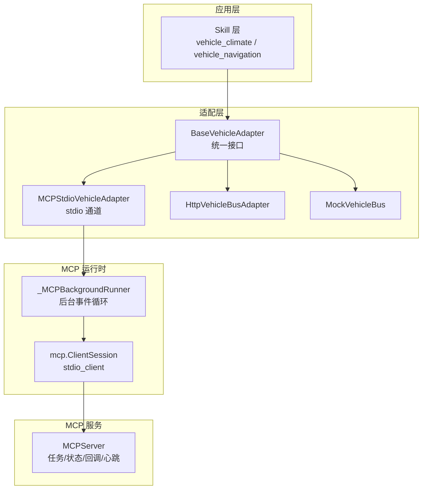
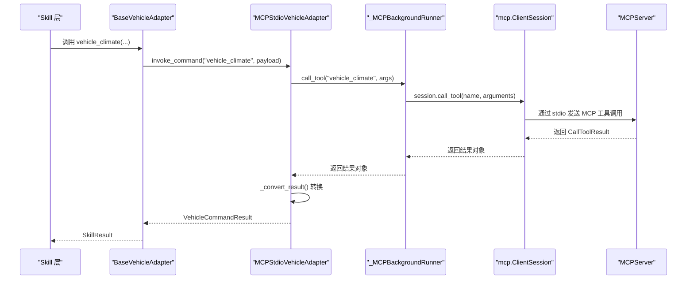
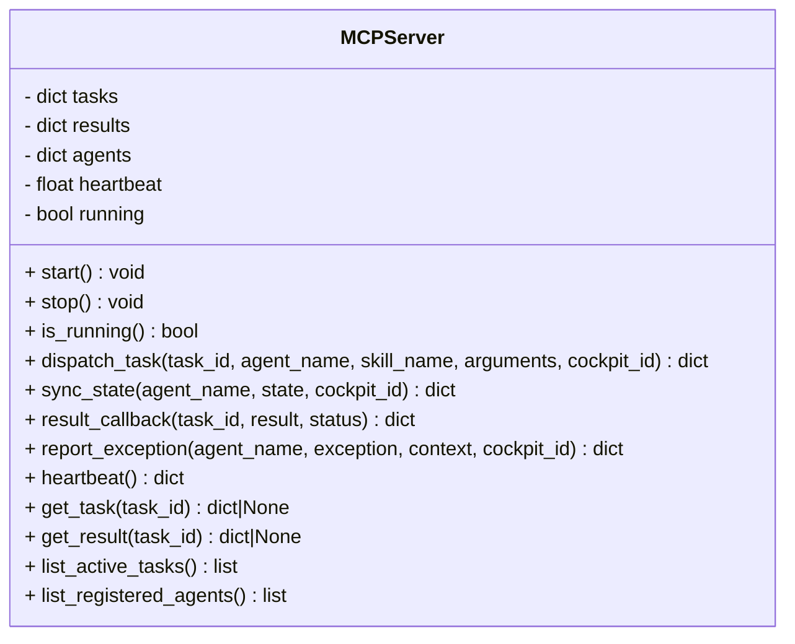
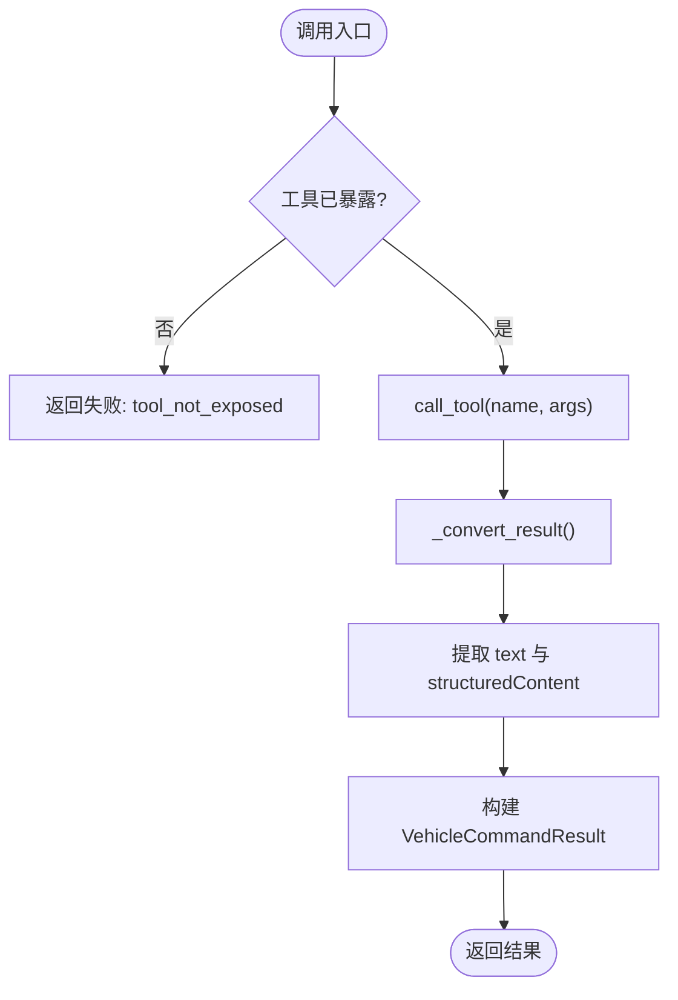
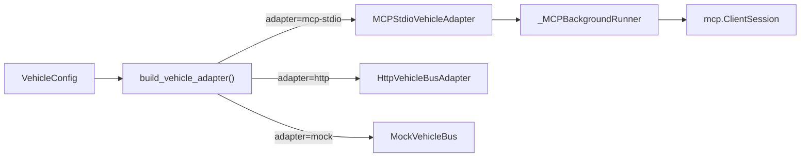

# MCP 标准协议实现

<cite>
**本文引用的文件**
- [backend_design/nexus/mcp/server.py](file://backend_design/nexus/mcp/server.py)
- [backend_design/nexus/vehicle/mcp.py](file://backend_design/nexus/vehicle/mcp.py)
- [backend_design/nexus/vehicle/base.py](file://backend_design/nexus/vehicle/base.py)
- [backend_design/nexus/vehicle/factory.py](file://backend_design/nexus/vehicle/factory.py)
- [backend_design/nexus/config/vehicle.py](file://backend_design/nexus/config/vehicle.py)
- [backend_design/nexus/skills/vehicle/__init__.py](file://backend_design/nexus/skills/vehicle/__init__.py)
- [backend_design/nexus/skills/vehicle/climate.py](file://backend_design/nexus/skills/vehicle/climate.py)
- [backend_design/nexus/skills/vehicle/navigation.py](file://backend_design/nexus/skills/vehicle/navigation.py)
</cite>

## 目录
1. [简介](#简介)
2. [项目结构](#项目结构)
3. [核心组件](#核心组件)
4. [架构总览](#架构总览)
5. [详细组件分析](#详细组件分析)
6. [依赖关系分析](#依赖关系分析)
7. [性能考虑](#性能考虑)
8. [故障排查指南](#故障排查指南)
9. [结论](#结论)
10. [附录](#附录)

## 简介
本技术文档围绕 NexusCockpit 中的 Model Context Protocol（MCP）标准协议实现展开，重点阐述：
- MCP 在跨平台车辆控制中的标准化优势与价值
- MCP 消息格式、命令定义与响应结构的约定
- MCP 客户端与服务端的通信机制与生命周期管理
- 命令注册、参数校验与结果转换流程
- 协议版本兼容性与扩展机制
- 集成最佳实践与常见问题定位方法

通过统一的 MCP 总线，NexusCockpit 将 Agent/Skill 层与车控后端解耦，支持 Mock/HTTP/MCP stdio 三种适配模式，确保在不同部署环境与多座舱隔离场景下的一致行为。

## 项目结构
与 MCP 相关的代码主要分布在以下模块：
- MCP 服务端：提供任务分发、状态同步、结果回调、异常上报、心跳保活等标准接口
- 车控适配器层：抽象统一接口，包含 Mock/HTTP/MCP stdio 三种实现
- 配置中心：基于环境变量驱动适配器选择与 MCP 启动参数
- 技能层：通过 BaseVehicleAdapter 调用具体适配器，屏蔽底层差异

图表来源
- [backend_design/nexus/vehicle/base.py:35-92](file://backend_design/nexus/vehicle/base.py#L35-L92)
- [backend_design/nexus/vehicle/mcp.py:167-285](file://backend_design/nexus/vehicle/mcp.py#L167-L285)
- [backend_design/nexus/mcp/server.py:36-243](file://backend_design/nexus/mcp/server.py#L36-L243)

章节来源
- [backend_design/nexus/vehicle/base.py:35-92](file://backend_design/nexus/vehicle/base.py#L35-L92)
- [backend_design/nexus/vehicle/mcp.py:167-285](file://backend_design/nexus/vehicle/mcp.py#L167-L285)
- [backend_design/nexus/mcp/server.py:36-243](file://backend_design/nexus/mcp/server.py#L36-L243)

## 核心组件
- MCPServer：提供标准化的协同接口，包括任务分发、状态同步、结果回调、异常上报与心跳保活，便于多 Agent/Skill 间协作与监控。
- MCPStdioVehicleAdapter：通过 mcp.ClientSession + stdio 与外部 MCP 服务通信，封装异步调用为同步接口，并负责工具列表发现、参数过滤与结果转换。
- BaseVehicleAdapter：定义车控统一接口（空调、车窗、座椅、导航、媒体、状态查询、通用命令），所有适配器必须实现该接口。
- VehicleConfig：基于环境变量配置适配器类型、HTTP 参数、MCP 启动命令与参数、超时与工具校验开关。
- VehicleBaseSkill：技能基类，按座舱上下文获取对应适配器实例，统一调用 invoke_command 并转换为 SkillResult。

章节来源
- [backend_design/nexus/mcp/server.py:36-243](file://backend_design/nexus/mcp/server.py#L36-L243)
- [backend_design/nexus/vehicle/mcp.py:167-285](file://backend_design/nexus/vehicle/mcp.py#L167-L285)
- [backend_design/nexus/vehicle/base.py:35-92](file://backend_design/nexus/vehicle/base.py#L35-L92)
- [backend_design/nexus/config/vehicle.py:15-50](file://backend_design/nexus/config/vehicle.py#L15-50)
- [backend_design/nexus/skills/vehicle/__init__.py:21-55](file://backend_design/nexus/skills/vehicle/__init__.py#L21-L55)

## 架构总览
下图展示了从 Skill 到 MCP 服务端的完整调用链路，以及结果回传路径。

图表来源
- [backend_design/nexus/skills/vehicle/climate.py:15-37](file://backend_design/nexus/skills/vehicle/climate.py#L15-L37)
- [backend_design/nexus/skills/vehicle/__init__.py:44-55](file://backend_design/nexus/skills/vehicle/__init__.py#L44-L55)
- [backend_design/nexus/vehicle/mcp.py:198-237](file://backend_design/nexus/vehicle/mcp.py#L198-L237)
- [backend_design/nexus/vehicle/mcp.py:239-280](file://backend_design/nexus/vehicle/mcp.py#L239-L280)
- [backend_design/nexus/mcp/server.py:76-110](file://backend_design/nexus/mcp/server.py#L76-L110)

## 详细组件分析

### MCPServer 组件
- 职责：提供任务分发、状态同步、结果回调、异常上报、心跳保活五类标准接口；维护任务队列、结果缓存、Agent 状态与心跳时间戳。
- 关键方法：
  - dispatch_task：接收 task_id、agent_name、skill_name、arguments、cockpit_id，记录任务并返回分发状态
  - sync_state：按 cockpit_id:agent_name 键存储状态，支持多 Agent 间共享
  - result_callback：记录任务结果并更新任务状态
  - report_exception：记录异常信息
  - heartbeat：返回运行状态、活跃任务数与 Agent 数
- 设计要点：
  - 使用内存字典存储任务、结果与 Agent 状态，适合单进程内轻量级协同
  - 提供 is_running 属性与 start/stop 生命周期管理
  - 日志记录关键事件，便于可观测性

图表来源
- [backend_design/nexus/mcp/server.py:36-243](file://backend_design/nexus/mcp/server.py#L36-L243)

章节来源
- [backend_design/nexus/mcp/server.py:36-243](file://backend_design/nexus/mcp/server.py#L36-L243)

### MCPStdioVehicleAdapter 组件
- 职责：通过 MCP SDK 的 ClientSession 与外部 MCP 服务进行 stdio 通信，暴露与 BaseVehicleAdapter 一致的同步接口。
- 关键特性：
  - 后台线程运行 asyncio 事件循环，避免阻塞主线程
  - 初始化阶段执行 session.initialize() 与 session.list_tools()，缓存可用工具集合
  - 调用前校验工具是否暴露，未暴露直接返回失败结果
  - 调用时过滤 None 值参数，减少无效传输
  - 结果转换：将 CallToolResult 的 content、structuredContent、isError 映射为 VehicleCommandResult
- 生命周期：
  - __init__：启动后台线程，等待初始化完成
  - close：通知停止事件并等待线程退出

图表来源
- [backend_design/nexus/vehicle/mcp.py:225-280](file://backend_design/nexus/vehicle/mcp.py#L225-L280)

章节来源
- [backend_design/nexus/vehicle/mcp.py:167-285](file://backend_design/nexus/vehicle/mcp.py#L167-L285)

### BaseVehicleAdapter 抽象接口
- 职责：定义车控统一接口，包括空调、车窗、座椅、导航、媒体、状态查询与通用命令调用。
- 设计要点：
  - 所有适配器必须实现这些方法，保证上层调用一致性
  - 返回类型为 VehicleCommandResult，包含 success、message、data、error

章节来源
- [backend_design/nexus/vehicle/base.py:35-92](file://backend_design/nexus/vehicle/base.py#L35-L92)

### VehicleConfig 配置项
- 作用：根据环境变量选择适配器类型与 MCP 启动参数
- 关键字段：
  - adapter：mock/http/mcp-stdio
  - api_base_url/api_protocol/api_endpoint/api_timeout/api_token：HTTP 模式参数
  - mcp_command/mcp_args/mcp_workdir：MCP 启动命令与参数
  - mcp_validate_tools：是否验证工具列表

章节来源
- [backend_design/nexus/config/vehicle.py:15-50](file://backend_design/nexus/config/vehicle.py#L15-50)

### VehicleBaseSkill 技能基类
- 作用：通过 tenant_context 获取当前座舱的适配器实例，调用 invoke_command 并转换为 SkillResult
- 关键点：
  - 多座舱隔离：每个座舱独立适配器实例（Mock 模式）或复用无状态实例（HTTP/MCP）
  - 统一错误处理：将 VehicleCommandResult 转为 SkillResult

章节来源
- [backend_design/nexus/skills/vehicle/__init__.py:21-55](file://backend_design/nexus/skills/vehicle/__init__.py#L21-L55)

### 示例技能：ClimateControlSkill 与 NavigationSkill
- ClimateControlSkill：空调控制，支持温度调节、风量设置、模式切换
- NavigationSkill：导航控制，支持目的地设置、途经点、模式选择与位置查询

章节来源
- [backend_design/nexus/skills/vehicle/climate.py:15-37](file://backend_design/nexus/skills/vehicle/climate.py#L15-L37)
- [backend_design/nexus/skills/vehicle/navigation.py:15-39](file://backend_design/nexus/skills/vehicle/navigation.py#L15-L39)

## 依赖关系分析
- 适配器工厂：根据 VEHICLE_ADAPTER 环境变量选择 Mock/HTTP/MCP stdio 适配器
- MCP stdio 模式：解析 mcp_command 与 mcp_args，构造命令行参数，创建 MCPStdioVehicleAdapter
- 多座舱隔离：Mock 模式每座舱独立实例，HTTP/MCP 模式复用单例

图表来源
- [backend_design/nexus/vehicle/factory.py:86-123](file://backend_design/nexus/vehicle/factory.py#L86-L123)
- [backend_design/nexus/config/vehicle.py:15-50](file://backend_design/nexus/config/vehicle.py#L15-50)

章节来源
- [backend_design/nexus/vehicle/factory.py:86-123](file://backend_design/nexus/vehicle/factory.py#L86-L123)

## 性能考虑
- 后台事件循环：_MCPBackgroundRunner 在独立线程中运行 asyncio 事件循环，避免阻塞主线程
- 工具列表缓存：初始化时缓存 available_tools，减少重复探测开销
- 超时控制：tool_timeout 限制单次工具调用耗时，防止长时间阻塞
- 资源清理：close() 方法确保会话与线程正确释放，避免资源泄漏

[本节为通用性能建议，不直接分析具体文件]

## 故障排查指南
- 初始化超时：检查 mcp_command 是否正确，确保子进程可启动并完成 initialize
- 工具未暴露：确认 MCP 服务暴露的工具名称与调用名称一致
- 调用失败：查看 _convert_result 的错误码与 message，定位上游异常
- 心跳检测：通过 heartbeat 接口检查服务状态与活跃任务/Agent 数量
- 日志定位：关注 MCP 相关日志输出，包括初始化、工具列表、调用与回调

章节来源
- [backend_design/nexus/vehicle/mcp.py:77-81](file://backend_design/nexus/vehicle/mcp.py#L77-L81)
- [backend_design/nexus/vehicle/mcp.py:225-237](file://backend_design/nexus/vehicle/mcp.py#L225-L237)
- [backend_design/nexus/mcp/server.py:209-223](file://backend_design/nexus/mcp/server.py#L209-L223)

## 结论
NexusCockpit 的 MCP 标准协议实现通过统一的适配器层与后台事件循环，将 Agent/Skill 与车控后端解耦，支持跨平台、多座舱隔离与可扩展的命令体系。配合配置中心与环境变量，可在 Mock/HTTP/MCP stdio 之间灵活切换，满足开发与生产环境的多样化需求。通过标准化的消息格式与结果转换机制，系统具备良好的可观测性与可维护性。

[本节为总结性内容，不直接分析具体文件]

## 附录
- 协议版本兼容性：MCP 客户端默认使用协议版本 "2024-11-05"，可通过配置调整
- 扩展机制：新增车控能力只需在 MCP 服务暴露新工具，并在适配器中增加对应方法
- 集成最佳实践：
  - 合理设置 tool_timeout，避免长耗时操作阻塞
  - 启用 mcp_validate_tools，确保工具存在后再调用
  - 使用多座舱隔离，避免状态污染
  - 结合日志与心跳接口进行健康检查与监控

[本节为通用指导，不直接分析具体文件]