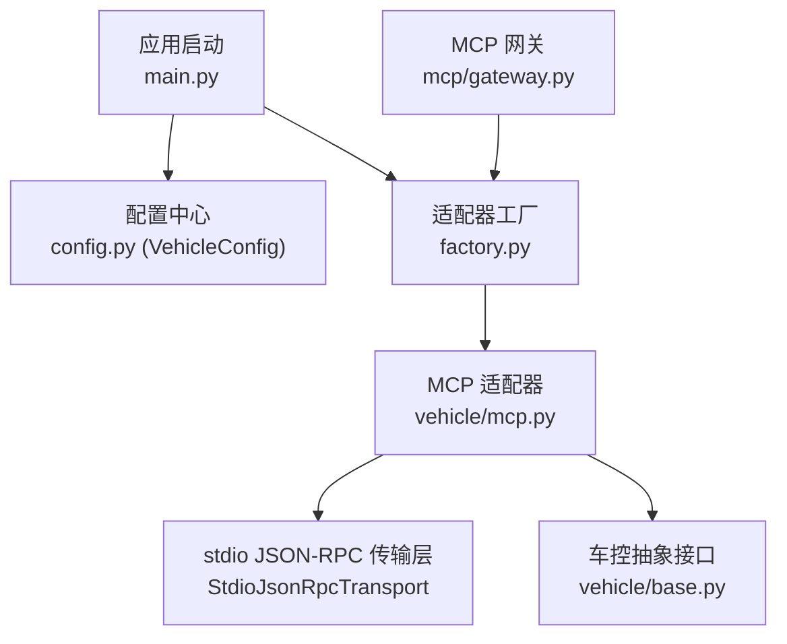
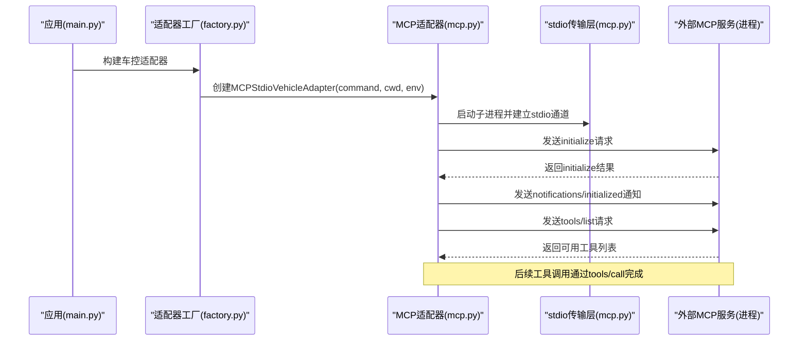
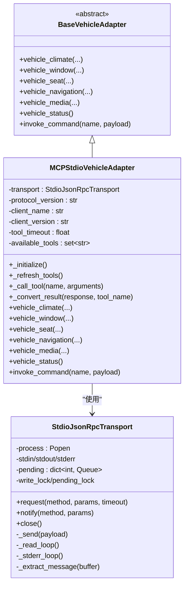
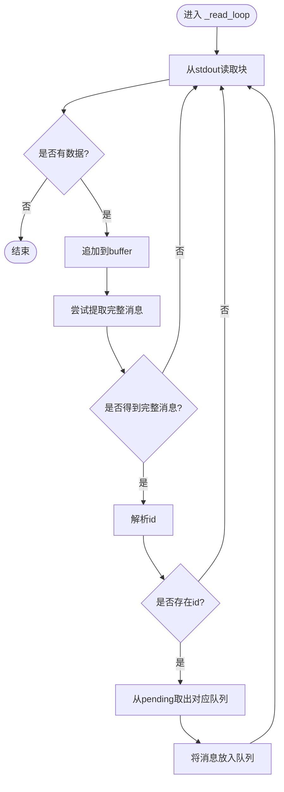
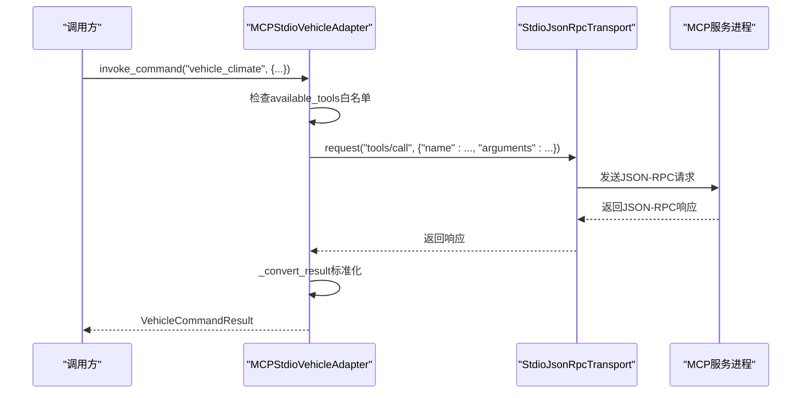
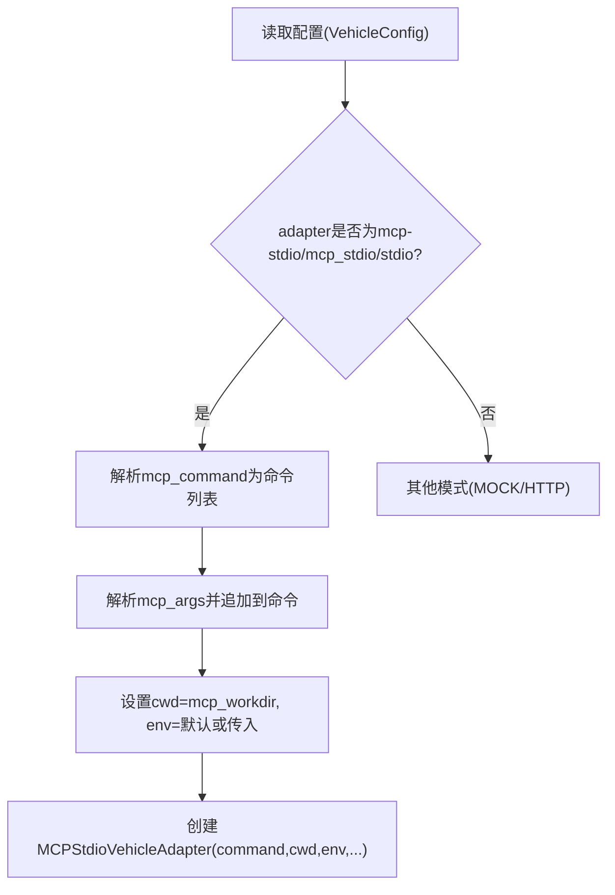
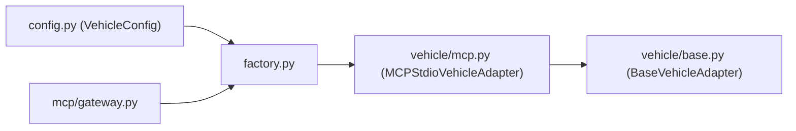
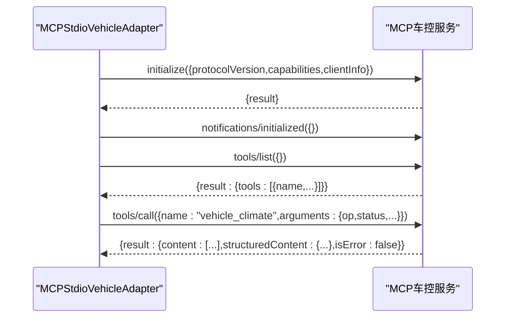

# MCP模式（stdio协议）

<cite>
**本文引用的文件**   
- [backend_design/nexus/vehicle/mcp.py](file://backend_design/nexus/vehicle/mcp.py)
- [backend_design/nexus/vehicle/base.py](file://backend_design/nexus/vehicle/base.py)
- [backend_design/nexus/vehicle/factory.py](file://backend_design/nexus/vehicle/factory.py)
- [backend_design/nexus/config.py](file://backend_design/nexus/config.py)
- [backend_design/nexus/main.py](file://backend_design/nexus/main.py)
- [backend_design/nexus/mcp/gateway.py](file://backend_design/nexus/mcp/gateway.py)
</cite>

## 目录
1. [简介](#简介)
2. [项目结构](#项目结构)
3. [核心组件](#核心组件)
4. [架构总览](#架构总览)
5. [详细组件分析](#详细组件分析)
6. [依赖关系分析](#依赖关系分析)
7. [性能与并发特性](#性能与并发特性)
8. [配置示例与环境变量](#配置示例与环境变量)
9. [MCP服务开发指南](#mcp服务开发指南)
10. [调试与故障诊断](#调试与故障诊断)
11. [结论](#结论)

## 简介
本文件面向“MCP模式（stdio协议）”的技术文档，聚焦以下目标：
- 深入解析 MCPStdioVehicleAdapter 的实现原理，包括 stdio 进程间通信、JSON-RPC 消息序列化/反序列化、异步处理与错误处理。
- 解释 MCP 协议的工具发现、调用与结果返回流程。
- 描述 MCP 服务的启动与管理方式，包括命令行参数解析、工作目录设置与环境变量传递。
- 提供 MCP 模式的配置示例（mcp_command、mcp_args 等）。
- 给出 MCP 车控服务开发指南，说明如何编写符合 MCP 协议的对外工具服务。
- 提供 MCP 模式的调试工具与故障诊断方法。

## 项目结构
与 MCP 模式相关的代码主要位于 backend_design/nexus 下，关键文件如下：
- 传输层与适配器：nexus/vehicle/mcp.py
- 车控抽象接口与结果模型：nexus/vehicle/base.py
- 适配器工厂与命令解析：nexus/vehicle/factory.py
- 全局配置中心（含 VehicleConfig）：nexus/config.py
- 应用启动入口（初始化车控适配器）：nexus/main.py
- MCP 网关统一入口：nexus/mcp/gateway.py

图表来源
- [backend_design/nexus/main.py:106-108](file://backend_design/nexus/main.py#L106-L108)
- [backend_design/nexus/config.py:295-329](file://backend_design/nexus/config.py#L295-L329)
- [backend_design/nexus/vehicle/factory.py:87-124](file://backend_design/nexus/vehicle/factory.py#L87-L124)
- [backend_design/nexus/vehicle/mcp.py:28-179](file://backend_design/nexus/vehicle/mcp.py#L28-L179)
- [backend_design/nexus/vehicle/base.py:19-92](file://backend_design/nexus/vehicle/base.py#L19-L92)
- [backend_design/nexus/mcp/gateway.py:20-37](file://backend_design/nexus/mcp/gateway.py#L20-L37)

章节来源
- [backend_design/nexus/main.py:106-108](file://backend_design/nexus/main.py#L106-L108)
- [backend_design/nexus/config.py:295-329](file://backend_design/nexus/config.py#L295-L329)
- [backend_design/nexus/vehicle/factory.py:87-124](file://backend_design/nexus/vehicle/factory.py#L87-L124)
- [backend_design/nexus/vehicle/mcp.py:28-179](file://backend_design/nexus/vehicle/mcp.py#L28-L179)
- [backend_design/nexus/vehicle/base.py:19-92](file://backend_design/nexus/vehicle/base.py#L19-L92)
- [backend_design/nexus/mcp/gateway.py:20-37](file://backend_design/nexus/mcp/gateway.py#L20-L37)

## 核心组件
- StdioJsonRpcTransport：基于子进程的 stdio 通道实现 JSON-RPC 2.0 传输层，使用 Content-Length 帧头进行分帧，内部维护请求-响应队列与线程安全读写。
- MCPStdioVehicleAdapter：实现 BaseVehicleAdapter 的 MCP 模式适配器，负责 MCP 握手、工具列表刷新、工具调用封装与结果转换。
- VehicleCommandResult：统一的命令执行结果数据结构，包含成功标志、人类可读消息、结构化数据与错误码。
- VehicleConfig：集中管理 MCP 模式相关配置项（命令、参数、工作目录、超时、工具校验开关等）。
- MCPGateway：统一工具调用入口，屏蔽底层适配器差异，向上层暴露 invoke/list_tools 接口。

章节来源
- [backend_design/nexus/vehicle/mcp.py:28-179](file://backend_design/nexus/vehicle/mcp.py#L28-L179)
- [backend_design/nexus/vehicle/mcp.py:181-291](file://backend_design/nexus/vehicle/mcp.py#L181-L291)
- [backend_design/nexus/vehicle/base.py:19-92](file://backend_design/nexus/vehicle/base.py#L19-L92)
- [backend_design/nexus/config.py:295-329](file://backend_design/nexus/config.py#L295-L329)
- [backend_design/nexus/mcp/gateway.py:20-37](file://backend_design/nexus/mcp/gateway.py#L20-L37)

## 架构总览
下图展示了从应用启动到 MCP 工具调用的整体流程，以及各组件之间的交互关系。

图表来源
- [backend_design/nexus/main.py:106-108](file://backend_design/nexus/main.py#L106-L108)
- [backend_design/nexus/vehicle/factory.py:105-119](file://backend_design/nexus/vehicle/factory.py#L105-L119)
- [backend_design/nexus/vehicle/mcp.py:181-229](file://backend_design/nexus/vehicle/mcp.py#L181-L229)

## 详细组件分析

### MCPStdioVehicleAdapter 类
职责与要点：
- 构造时创建 StdioJsonRpcTransport，传入命令、工作目录与环境变量。
- 初始化阶段向服务端发送 initialize 请求，随后发送 notifications/initialized 通知。
- 可选地刷新工具列表 tools/list，缓存可用工具名集合用于白名单校验。
- 将上层车控方法映射为 MCP 工具调用（如 vehicle_climate、vehicle_window 等），最终通过 tools/call 发起调用。
- 对返回结果进行标准化，转换为 VehicleCommandResult。

图表来源
- [backend_design/nexus/vehicle/base.py:35-92](file://backend_design/nexus/vehicle/base.py#L35-L92)
- [backend_design/nexus/vehicle/mcp.py:181-291](file://backend_design/nexus/vehicle/mcp.py#L181-L291)
- [backend_design/nexus/vehicle/mcp.py:28-179](file://backend_design/nexus/vehicle/mcp.py#L28-L179)

章节来源
- [backend_design/nexus/vehicle/mcp.py:181-291](file://backend_design/nexus/vehicle/mcp.py#L181-L291)
- [backend_design/nexus/vehicle/base.py:35-92](file://backend_design/nexus/vehicle/base.py#L35-L92)

### stdio 传输层（StdioJsonRpcTransport）
- 进程管理：通过 subprocess.Popen 启动外部 MCP 服务进程，绑定 stdin/stdout/stderr。
- 分帧协议：采用 Content-Length 头部 + \r\n\r\n 分隔 + UTF-8 JSON 体的帧格式。
- 读写并发：
  - 写端使用锁保护，避免并发写入导致帧交错。
  - 读端在独立线程中循环读取 stdout，按帧解析后根据 id 投递到对应 response_queue。
  - stderr 在独立线程中读取并记录日志，便于调试。
- 请求-响应匹配：
  - request 方法生成唯一 id，注册 pending 队列，发送 JSON-RPC 请求，阻塞等待响应或超时。
  - 收到响应后从 pending 移除并返回；若响应包含 error 字段则抛出异常。
- 资源清理：close 方法终止子进程并关闭流，注册 atexit 钩子确保退出时释放。

图表来源
- [backend_design/nexus/vehicle/mcp.py:113-179](file://backend_design/nexus/vehicle/mcp.py#L113-L179)

章节来源
- [backend_design/nexus/vehicle/mcp.py:28-179](file://backend_design/nexus/vehicle/mcp.py#L28-L179)

### 工具发现、调用与结果返回流程
- 工具发现：
  - 适配器初始化后调用 tools/list，解析返回的 tools 列表，缓存工具名称集合。
  - 若 validate_tools 为真，则在构造时自动刷新工具列表。
- 工具调用：
  - 上层通过 invoke_command 或直接调用具体方法（如 vehicle_climate）触发 _call_tool。
  - _call_tool 先检查工具是否在 available_tools 白名单内，再发送 tools/call 请求。
- 结果返回：
  - 将 JSON-RPC 响应中的 result 或原始响应进行标准化。
  - 支持 content 文本片段拼接、structuredContent 结构化数据透传。
  - 统一包装为 VehicleCommandResult，包含 success/message/data/error。

图表来源
- [backend_design/nexus/vehicle/mcp.py:221-291](file://backend_design/nexus/vehicle/mcp.py#L221-L291)

章节来源
- [backend_design/nexus/vehicle/mcp.py:221-291](file://backend_design/nexus/vehicle/mcp.py#L221-L291)

### MCP 服务启动与管理
- 启动入口：
  - main.py 在应用生命周期中调用 build_vehicle_adapter()，根据配置选择适配器。
- 适配器选择：
  - factory.py 根据 VEHICLE_ADAPTER 值判断模式。当值为 mcp-stdio/mcp_stdio/stdio 且配置了 mcp_command 时，创建 MCPStdioVehicleAdapter。
- 命令解析：
  - _parse_command_line 支持两种格式：
    - JSON 数组字符串，如 '["python","server.py"]'
    - 空格/制表符分隔的命令串，使用 shlex 解析
  - _parse_args_list 同理解析 mcp_args，支持 JSON 数组或空格分隔。
- 工作目录与环境变量：
  - 通过 config.mcp_workdir 指定子进程工作目录。
  - env 默认使用当前进程环境拷贝，可传入自定义环境变量字典以覆盖。
- 超时与工具校验：
  - tool_timeout 来自 config.api_timeout。
  - mcp_validate_tools 控制是否在初始化时拉取工具列表。

图表来源
- [backend_design/nexus/vehicle/factory.py:87-124](file://backend_design/nexus/vehicle/factory.py#L87-L124)
- [backend_design/nexus/vehicle/factory.py:126-147](file://backend_design/nexus/vehicle/factory.py#L126-L147)
- [backend_design/nexus/config.py:295-329](file://backend_design/nexus/config.py#L295-L329)

章节来源
- [backend_design/nexus/vehicle/factory.py:87-124](file://backend_design/nexus/vehicle/factory.py#L87-L124)
- [backend_design/nexus/vehicle/factory.py:126-147](file://backend_design/nexus/vehicle/factory.py#L126-L147)
- [backend_design/nexus/config.py:295-329](file://backend_design/nexus/config.py#L295-L329)

## 依赖关系分析
- 模块耦合：
  - MCPStdioVehicleAdapter 依赖 StdioJsonRpcTransport 进行 I/O，依赖 BaseVehicleAdapter 定义接口契约。
  - factory.py 依赖 config.py 获取配置，动态导入 mcp.py 以避免循环依赖。
  - gateway.py 通过 factory.py 获取适配器实例，向上层提供统一 invoke 接口。
- 外部依赖：
  - subprocess、threading、queue 用于进程管理与异步消息分发。
  - json 用于序列化/反序列化。
  - shlex 用于命令行参数解析。

图表来源
- [backend_design/nexus/config.py:295-329](file://backend_design/nexus/config.py#L295-L329)
- [backend_design/nexus/vehicle/factory.py:87-124](file://backend_design/nexus/vehicle/factory.py#L87-L124)
- [backend_design/nexus/vehicle/mcp.py:181-291](file://backend_design/nexus/vehicle/mcp.py#L181-L291)
- [backend_design/nexus/vehicle/base.py:35-92](file://backend_design/nexus/vehicle/base.py#L35-L92)
- [backend_design/nexus/mcp/gateway.py:20-37](file://backend_design/nexus/mcp/gateway.py#L20-L37)

章节来源
- [backend_design/nexus/config.py:295-329](file://backend_design/nexus/config.py#L295-L329)
- [backend_design/nexus/vehicle/factory.py:87-124](file://backend_design/nexus/vehicle/factory.py#L87-L124)
- [backend_design/nexus/vehicle/mcp.py:181-291](file://backend_design/nexus/vehicle/mcp.py#L181-L291)
- [backend_design/nexus/vehicle/base.py:35-92](file://backend_design/nexus/vehicle/base.py#L35-L92)
- [backend_design/nexus/mcp/gateway.py:20-37](file://backend_design/nexus/mcp/gateway.py#L20-L37)

## 性能与并发特性
- 单例与复用：
  - factory.py 维护模块级单例适配器，避免重复初始化带来的开销。
  - 多座舱场景下，Mock 模式每座舱独立实例，HTTP/MCP 模式复用单例（无状态）。
- 线程与锁：
  - 写端加锁保证帧顺序正确；读端与主线程通过 queue 解耦，降低阻塞风险。
  - pending 字典加锁保护，避免并发插入/删除竞态。
- 超时与健壮性：
  - request 支持超时，防止长期阻塞；stderr 线程持续输出日志，便于定位问题。
- 内存与缓冲：
  - 使用 bufsize=0 的管道，减少缓冲延迟；按固定大小读取 stdout，避免一次性加载大消息。

[本节为通用性能讨论，不直接分析具体文件]

## 配置示例与环境变量
- 启用 MCP 模式的关键配置项（VehicleConfig）：
  - VEHICLE_ADAPTER：设置为 mcp-stdio 或 mcp_stdio 或 stdio
  - VEHICLE_MCP_COMMAND：外部 MCP 服务启动命令（支持 JSON 数组或空格分隔）
  - VEHICLE_MCP_ARGS：附加参数（支持 JSON 数组或空格分隔）
  - VEHICLE_MCP_WORKDIR：子进程工作目录
  - VEHICLE_API_TIMEOUT：工具调用超时时间（秒）
  - VEHICLE_MCP_VALIDATE_TOOLS：是否验证工具列表
- 示例（.env.local 风格）：
  - VEHICLE_ADAPTER=mcp-stdio
  - VEHICLE_MCP_COMMAND=["python","vehicle_mcp_server.py"]
  - VEHICLE_MCP_ARGS='["--port","8080","--log-level","debug"]'
  - VEHICLE_MCP_WORKDIR="./scripts"
  - VEHICLE_API_TIMEOUT=10
  - VEHICLE_MCP_VALIDATE_TOOLS=true

章节来源
- [backend_design/nexus/config.py:295-329](file://backend_design/nexus/config.py#L295-L329)
- [backend_design/nexus/vehicle/factory.py:126-147](file://backend_design/nexus/vehicle/factory.py#L126-L147)

## MCP服务开发指南
目标：编写一个符合 MCP 协议的“车控服务”，作为外部进程被 MCPStdioVehicleAdapter 启动并通过 stdio 通信。

- 进程启动与标准输入输出：
  - 服务需监听 stdin/stdout，接收 JSON-RPC 2.0 消息，并以相同协议返回。
  - 必须实现 Content-Length 帧头 + \r\n\r\n 分隔 + UTF-8 JSON 体。
- 协议握手：
  - 客户端会发送 initialize 请求，包含 protocolVersion、capabilities、clientInfo。
  - 服务端应返回 initialize 结果，随后客户端发送 notifications/initialized 通知。
- 工具发现与调用：
  - 实现 tools/list 接口，返回工具元信息（至少包含 name）。
  - 实现 tools/call 接口，接收 name 与 arguments，返回 result 或 error。
- 结果格式建议：
  - 支持 content 文本片段数组（每项可为字符串或包含 text 字段的对象）。
  - 支持 structuredContent 结构化数据（如 message/summary 字段）。
  - 支持 isError 布尔字段表示失败语义。
- 错误处理：
  - 对于 JSON-RPC 错误，返回 error 字段（message 或结构化错误对象）。
  - 对于业务错误，可在 result 中使用 isError=true 并附带 message/structuredContent。
- 示例工具命名约定（与适配器映射一致）：
  - vehicle_climate、vehicle_window、vehicle_seat、vehicle_navigation、vehicle_media、vehicle_status

图表来源
- [backend_design/nexus/vehicle/mcp.py:206-229](file://backend_design/nexus/vehicle/mcp.py#L206-L229)
- [backend_design/nexus/vehicle/mcp.py:251-291](file://backend_design/nexus/vehicle/mcp.py#L251-L291)

章节来源
- [backend_design/nexus/vehicle/mcp.py:206-229](file://backend_design/nexus/vehicle/mcp.py#L206-L229)
- [backend_design/nexus/vehicle/mcp.py:251-291](file://backend_design/nexus/vehicle/mcp.py#L251-L291)

## 调试与故障诊断
- 常见错误与定位：
  - 启动失败：检查 VEHICLE_MCP_COMMAND 是否正确，路径与权限是否满足；查看 stderr 日志输出。
  - 工具未暴露：确认 tools/list 返回的工具名与调用名一致；必要时关闭 mcp_validate_tools 进行排查。
  - 调用超时：调整 VEHICLE_API_TIMEOUT；检查服务端处理耗时与网络/IO瓶颈。
  - 结果异常：检查 tools/call 返回的 content/structuredContent/isError 是否符合预期。
- 日志与监控：
  - stderr 线程会将外部服务输出记录为 DEBUG 级别日志，便于追踪。
  - 可通过应用日志系统观察 MCP 调用失败告警（gateway.py 中记录警告）。
- 实用技巧：
  - 使用最小化命令与参数逐步验证（例如仅启动脚本，不带复杂参数）。
  - 在工作目录下放置临时日志文件，辅助定位环境问题。
  - 在本地运行外部 MCP 服务，手动模拟 JSON-RPC 帧，验证分帧与解析逻辑。

章节来源
- [backend_design/nexus/vehicle/mcp.py:135-148](file://backend_design/nexus/vehicle/mcp.py#L135-L148)
- [backend_design/nexus/mcp/gateway.py:30-37](file://backend_design/nexus/mcp/gateway.py#L30-L37)

## 结论
MCP 模式通过 stdio JSON-RPC 实现了轻量、可靠的外部工具集成方案。MCPStdioVehicleAdapter 将复杂的进程通信、消息分帧、异步处理与结果标准化封装为简洁的车控接口，配合工厂与配置中心，提供了灵活的部署与扩展能力。遵循本文的开发指南与调试方法，可以快速构建符合 MCP 协议的車控服务，并在生产环境中稳定运行。