# Mock 模拟环境实现

<cite>
**本文引用的文件**   
- [backend_design/nexus/vehicle/mock/__init__.py](file://backend_design/nexus/vehicle/mock/__init__.py)
- [backend_design/nexus/vehicle/base.py](file://backend_design/nexus/vehicle/base.py)
- [backend_design/nexus/vehicle/factory.py](file://backend_design/nexus/vehicle/factory.py)
- [backend_design/nexus/vehicle/mock/climate_state.py](file://backend_design/nexus/vehicle/mock/climate_state.py)
- [backend_design/nexus/vehicle/mock/window_state.py](file://backend_design/nexus/vehicle/mock/window_state.py)
- [backend_design/nexus/vehicle/mock/seat_state.py](file://backend_design/nexus/vehicle/mock/seat_state.py)
- [backend_design/nexus/vehicle/mock/navigation_state.py](file://backend_design/nexus/vehicle/mock/navigation_state.py)
- [backend_design/nexus/vehicle/mock/media_state.py](file://backend_design/nexus/vehicle/mock/media_state.py)
- [backend_design/nexus/vehicle/mock/status_state.py](file://backend_design/nexus/vehicle/mock/status_state.py)
- [backend_design/nexus/skills/base.py](file://backend_design/nexus/skills/base.py)
- [backend_design/nexus/skills/vehicle/climate.py](file://backend_design/nexus/skills/vehicle/climate.py)
- [backend_design/nexus/skills/vehicle/media.py](file://backend_design/nexus/skills/vehicle/media.py)
- [backend_design/nexus/config/vehicle.py](file://backend_design/nexus/config/vehicle.py)
</cite>

## 目录
1. [简介](#简介)
2. [项目结构](#项目结构)
3. [核心组件](#核心组件)
4. [架构总览](#架构总览)
5. [详细组件分析](#详细组件分析)
6. [依赖关系分析](#依赖关系分析)
7. [性能与延迟模拟](#性能与延迟模拟)
8. [使用示例与启用方式](#使用示例与启用方式)
9. [状态同步与事件驱动更新](#状态同步与事件驱动更新)
10. [数据持久化与调试技巧](#数据持久化与调试技巧)
11. [故障排查指南](#故障排查指南)
12. [结论](#结论)

## 简介
本技术文档聚焦于 NexusCockpit 的 Mock 模拟环境，系统阐述 Mock 适配器的设计目的、在开发与测试阶段的重要作用，以及各状态模块（空调、媒体、导航、座椅、状态、车窗）的实现逻辑与数据模拟策略。文档还涵盖状态同步机制、事件驱动的更新模式、如何在 Mock 环境中模拟真实车辆行为与响应延迟，并给出在开发/测试中启用和使用 Mock 模式的具体示例。最后提供状态管理、数据持久化与调试技巧，帮助读者快速上手并高效排障。

## 项目结构
Mock 子系统位于 backend_design/nexus/vehicle/mock 目录下，采用门面（Facade）模式将多个状态子模块统一暴露为一致的接口，并通过工厂按配置选择适配器（mock/http/mcp）。关键文件组织如下：
- 门面与命令路由：MockVehicleBus（__init__.py）
- 状态模块：climate_state.py、window_state.py、seat_state.py、navigation_state.py、media_state.py、status_state.py
- 抽象基类与结果模型：base.py
- 适配器工厂：factory.py
- 技能层（Skill）：skills/base.py、skills/vehicle/*.py
- 车控配置：config/vehicle.py

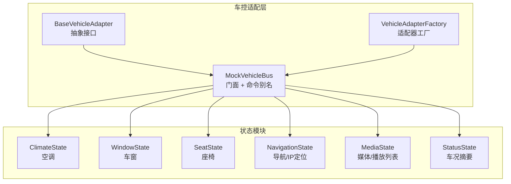

**图表来源** 
- [backend_design/nexus/vehicle/mock/__init__.py:39-220](file://backend_design/nexus/vehicle/mock/__init__.py#L39-L220)
- [backend_design/nexus/vehicle/base.py:19-92](file://backend_design/nexus/vehicle/base.py#L19-L92)
- [backend_design/nexus/vehicle/factory.py:38-123](file://backend_design/nexus/vehicle/factory.py#L38-L123)

**章节来源**
- [backend_design/nexus/vehicle/mock/__init__.py:1-220](file://backend_design/nexus/vehicle/mock/__init__.py#L1-L220)
- [backend_design/nexus/vehicle/base.py:1-92](file://backend_design/nexus/vehicle/base.py#L1-L92)
- [backend_design/nexus/vehicle/factory.py:1-147](file://backend_design/nexus/vehicle/factory.py#L1-L147)

## 核心组件
- 抽象接口与结果模型
  - VehicleCommandResult：统一封装成功/失败、消息、结构化数据与错误码。
  - BaseVehicleAdapter：定义空调、车窗、座椅、导航、媒体、状态查询与通用命令入口的统一方法签名，确保多态替换。
- 门面与命令路由
  - MockVehicleBus：对外保持与 BaseVehicleAdapter 一致的方法；内部通过 COMMAND_ALIASES 将多种命令名映射到具体处理器；invoke_command 统一解析参数并调用对应方法。
- 适配器工厂
  - build_vehicle_adapter/get_cockpit_vehicle_adapter：根据配置选择 mock/http/mcp；Mock 模式下每座舱独立实例，实现状态隔离。
- 技能层（Skill）
  - BaseSkill：定义技能元信息、工具 Schema 生成、LangChain StructuredTool 包装等；VehicleBaseSkill（由 vehicle 子包提供）用于调用车控适配器。

**章节来源**
- [backend_design/nexus/vehicle/base.py:19-92](file://backend_design/nexus/vehicle/base.py#L19-L92)
- [backend_design/nexus/vehicle/mock/__init__.py:39-220](file://backend_design/nexus/vehicle/mock/__init__.py#L39-L220)
- [backend_design/nexus/vehicle/factory.py:38-123](file://backend_design/nexus/vehicle/factory.py#L38-L123)
- [backend_design/nexus/skills/base.py:92-264](file://backend_design/nexus/skills/base.py#L92-L264)

## 架构总览
Mock 环境的核心流程：上层 Skill 通过统一的 invoke_command 或具体方法（如 vehicle_climate）下发指令，MockVehicleBus 根据命令别名路由到对应状态模块处理，返回标准化的 VehicleCommandResult。工厂负责在不同运行环境下切换适配器，Mock 模式保证每个座舱的状态隔离。

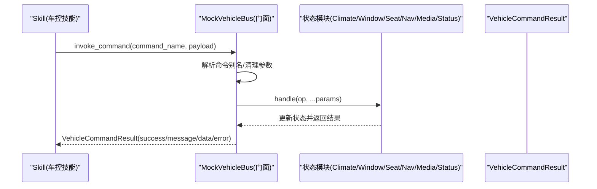

**图表来源** 
- [backend_design/nexus/vehicle/mock/__init__.py:194-220](file://backend_design/nexus/vehicle/mock/__init__.py#L194-L220)
- [backend_design/nexus/vehicle/base.py:19-92](file://backend_design/nexus/vehicle/base.py#L19-L92)

## 详细组件分析

### 门面与命令路由：MockVehicleBus
- 设计要点
  - 门面模式：对外接口稳定，内部委托到各状态子模块。
  - 命令别名：COMMAND_ALIASES 支持多种自然语言风格命令映射到统一处理器。
  - 统一入口：invoke_command 负责参数清洗、异常捕获与错误码返回。
  - 聚合状态：vehicle_status 可聚合所有子系统状态，便于前端展示与调试。
- 关键行为
  - 位置查询：当 op 为 location/where/我在哪 等时，优先从导航状态获取 current_location，否则触发 IP 定位。
  - 健壮性：对未支持的命令返回 command_not_found；执行异常返回 invoke_failed。

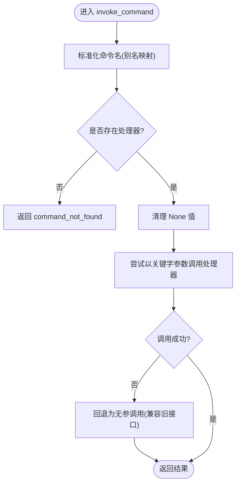

**图表来源** 
- [backend_design/nexus/vehicle/mock/__init__.py:194-220](file://backend_design/nexus/vehicle/mock/__init__.py#L194-L220)

**章节来源**
- [backend_design/nexus/vehicle/mock/__init__.py:39-220](file://backend_design/nexus/vehicle/mock/__init__.py#L39-L220)

### 空调状态：ClimateState
- 状态字段：temperature、fan_speed、mode、power
- 操作语义
  - 电源开关：power_on/on/open 与 power_off/off/close 仅修改 power，不提前返回，允许后续温度/风量/模式设置同时生效。
  - 温度调节：target_temp 直接设置；delta 相对调整；temp_up/temp_down 微调。
  - 风量与模式：fan_speed 限制在 1-7；mode 支持 auto/cool/heat/defog/vent/defrost。
  - 状态查询：status/query/query_status 返回当前状态。
- 复合指令优化：确保“打开空调温度22度风速1”这类指令能一次性生效。

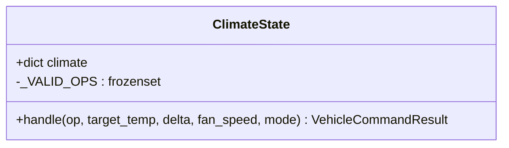

**图表来源** 
- [backend_design/nexus/vehicle/mock/climate_state.py:22-143](file://backend_design/nexus/vehicle/mock/climate_state.py#L22-L143)

**章节来源**
- [backend_design/nexus/vehicle/mock/climate_state.py:1-143](file://backend_design/nexus/vehicle/mock/climate_state.py#L1-L143)

### 车窗状态：WindowState
- 状态字段：windows（all/front_left/front_right/rear_left/rear_right/sunroof）
- 操作语义
  - open/up/raise：设置为 100%（可指定 percent）
  - close/down/lower：设置为 0%（可指定 percent）
  - set/set_position/move_to：精确设置百分比
  - status/query/query_status：返回当前状态
  - all 字段维护为所有车窗的最大值，便于整体控制。

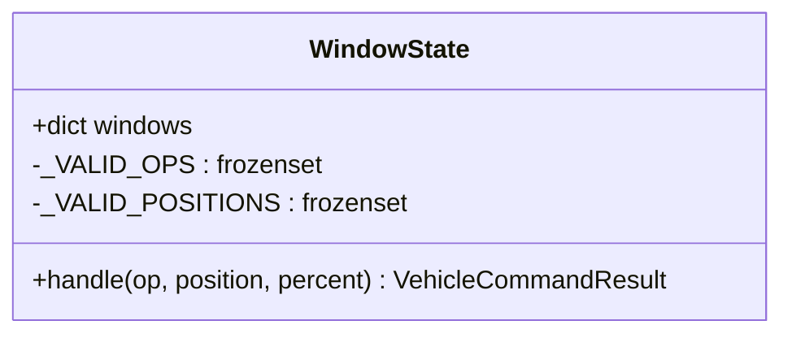

**图表来源** 
- [backend_design/nexus/vehicle/mock/window_state.py:12-89](file://backend_design/nexus/vehicle/mock/window_state.py#L12-L89)

**章节来源**
- [backend_design/nexus/vehicle/mock/window_state.py:1-89](file://backend_design/nexus/vehicle/mock/window_state.py#L1-L89)

### 座椅状态：SeatState
- 状态字段：seats（driver/passenger/rear_left/rear_right），每项包含 heat/cool/massage/position
- 操作语义
  - 加热/制冷：heat_on/heat/seat_heat 与 cool_on/cool/seat_cool，级别 1-3，互斥
  - 按摩：massage_on/massage 与 massage_off/stop_massage
  - 位置：forward/backward/forward_adjust/back_adjust
  - 状态查询：status/query/query_status

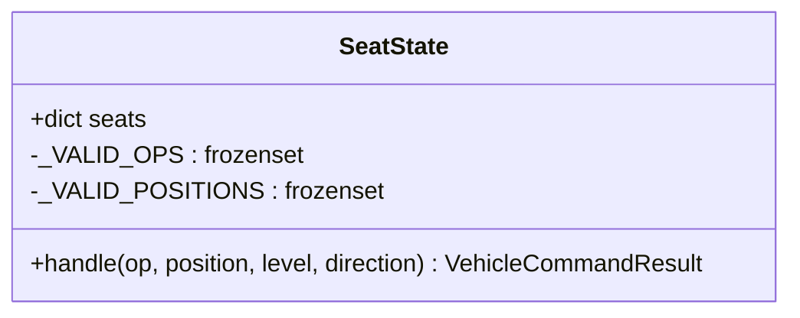

**图表来源** 
- [backend_design/nexus/vehicle/mock/seat_state.py:14-91](file://backend_design/nexus/vehicle/mock/seat_state.py#L14-L91)

**章节来源**
- [backend_design/nexus/vehicle/mock/seat_state.py:1-91](file://backend_design/nexus/vehicle/mock/seat_state.py#L1-L91)

### 导航状态：NavigationState
- 状态字段：destination、waypoint、mode、current_location、latitude、longitude、speed_kmh、heading、client_ip
- 定位优先级
  - 浏览器 GPS 坐标 → 逆地理编码（高德优先，Nominatim 备选）
  - IP 定位（高德 IP API 优先，ip-api.com 备选）
  - 降级：返回坐标字符串
- 特殊逻辑：当显式传入 latitude/longitude 时，绕过 current_location 缓存，强制调用逆地理编码，避免返回旧的 IP 级位置。

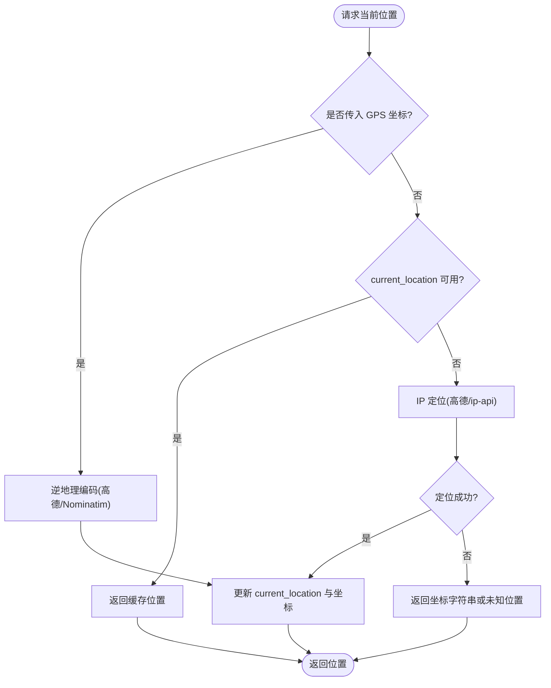

**图表来源** 
- [backend_design/nexus/vehicle/mock/navigation_state.py:33-216](file://backend_design/nexus/vehicle/mock/navigation_state.py#L33-L216)

**章节来源**
- [backend_design/nexus/vehicle/mock/navigation_state.py:1-216](file://backend_design/nexus/vehicle/mock/navigation_state.py#L1-L216)

### 媒体状态：MediaState
- 状态字段：playing、volume、source、track、track_index、play_mode、playlist
- 播放列表扫描：启动时扫描 assets/audio/music/ 下的 .mp3/.wav，构建 playlist，解析标题（支持“歌手-歌名”格式）
- 操作语义
  - 播放控制：play/resume/pause/stop/next/prev/select_track
  - 音量：set_volume/volume（0-30）
  - 来源：set_source（local/bluetooth/radio 等）
  - 播放模式：sequential/single/shuffle
  - 状态查询：status/query/query_status

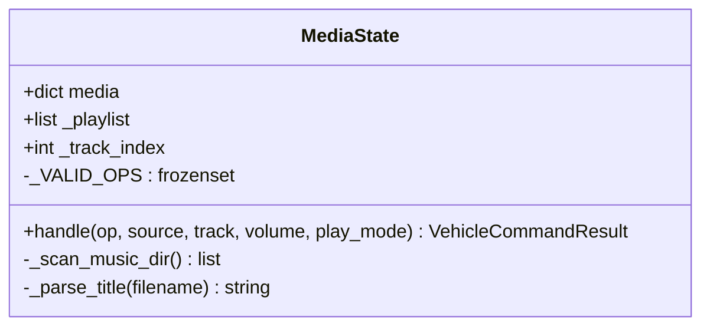

**图表来源** 
- [backend_design/nexus/vehicle/mock/media_state.py:25-226](file://backend_design/nexus/vehicle/mock/media_state.py#L25-L226)

**章节来源**
- [backend_design/nexus/vehicle/mock/media_state.py:1-226](file://backend_design/nexus/vehicle/mock/media_state.py#L1-L226)

### 车况状态：StatusState
- 状态字段：tire_pressure、range_km、fuel_percent、battery_percent、maintenance
- 操作语义：status 返回车况摘要，便于仪表盘展示与健康检查。

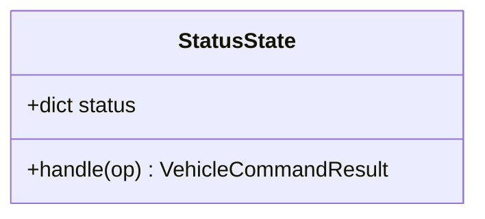

**图表来源** 
- [backend_design/nexus/vehicle/mock/status_state.py:14-38](file://backend_design/nexus/vehicle/mock/status_state.py#L14-L38)

**章节来源**
- [backend_design/nexus/vehicle/mock/status_state.py:1-38](file://backend_design/nexus/vehicle/mock/status_state.py#L1-L38)

### 技能层与车控集成
- BaseSkill：定义技能元信息、参数 Schema、工具包装（LangChain StructuredTool）、副作用与缓存 TTL 控制。
- VehicleBaseSkill（由 vehicle 子包提供）：封装对车控适配器的调用，使 Skill 无需关心底层通信细节。
- 示例技能：ClimateControlSkill、MediaControlSkill 定义了名称、描述、参数与示例，execute 调用 _invoke 完成实际车控操作。

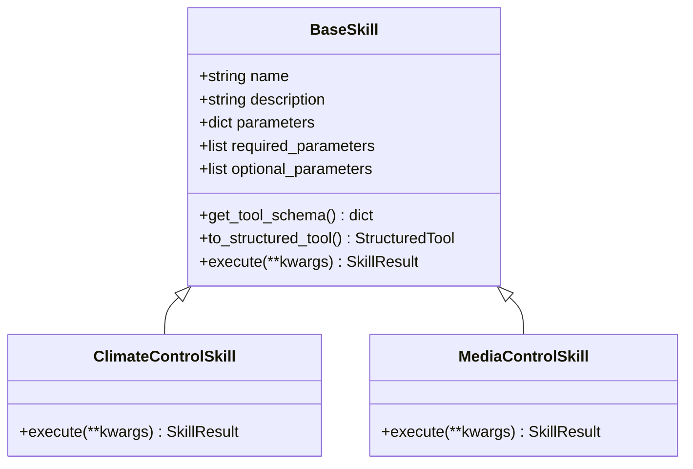

**图表来源** 
- [backend_design/nexus/skills/base.py:92-264](file://backend_design/nexus/skills/base.py#L92-L264)
- [backend_design/nexus/skills/vehicle/climate.py:15-37](file://backend_design/nexus/skills/vehicle/climate.py#L15-L37)
- [backend_design/nexus/skills/vehicle/media.py:15-36](file://backend_design/nexus/skills/vehicle/media.py#L15-L36)

**章节来源**
- [backend_design/nexus/skills/base.py:1-264](file://backend_design/nexus/skills/base.py#L1-L264)
- [backend_design/nexus/skills/vehicle/climate.py:1-37](file://backend_design/nexus/skills/vehicle/climate.py#L1-L37)
- [backend_design/nexus/skills/vehicle/media.py:1-36](file://backend_design/nexus/skills/vehicle/media.py#L1-L36)

## 依赖关系分析
- 适配器工厂依赖配置（VEHICLE_ADAPTER、HTTP/MCP 相关项）决定运行时使用的适配器类型。
- MockVehicleBus 依赖各状态模块，状态模块依赖 VehicleCommandResult。
- 技能层通过 VehicleBaseSkill 间接依赖车控适配器，屏蔽底层差异。

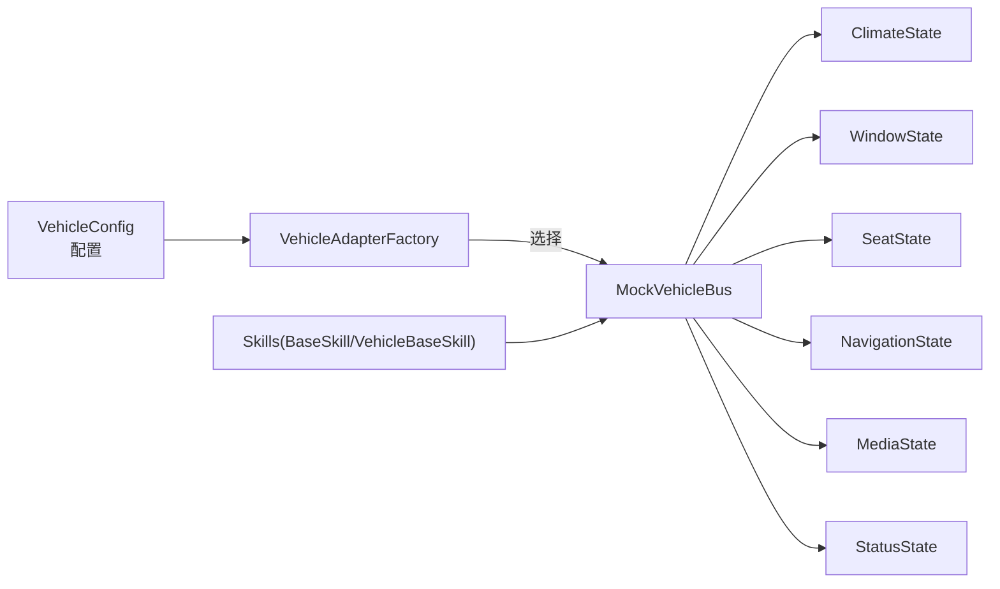

**图表来源** 
- [backend_design/nexus/config/vehicle.py:15-50](file://backend_design/nexus/config/vehicle.py#L15-L50)
- [backend_design/nexus/vehicle/factory.py:38-123](file://backend_design/nexus/vehicle/factory.py#L38-L123)
- [backend_design/nexus/vehicle/mock/__init__.py:39-220](file://backend_design/nexus/vehicle/mock/__init__.py#L39-L220)

**章节来源**
- [backend_design/nexus/config/vehicle.py:1-50](file://backend_design/nexus/config/vehicle.py#L1-L50)
- [backend_design/nexus/vehicle/factory.py:1-147](file://backend_design/nexus/vehicle/factory.py#L1-L147)
- [backend_design/nexus/vehicle/mock/__init__.py:1-220](file://backend_design/nexus/vehicle/mock/__init__.py#L1-L220)

## 性能与延迟模拟
- 当前实现为纯内存状态，无网络 I/O 与外部依赖，响应时间极短，适合高频测试。
- 如需模拟真实延迟与抖动：
  - 可在 invoke_command 或各状态 handle 中加入随机 sleep（例如 0.1-0.5s）模拟网络/设备响应。
  - 针对导航定位，可注入失败场景（如 httpx 超时/异常）以验证降级与重试逻辑。
  - 媒体播放列表扫描仅在初始化时执行一次，避免重复 IO。
- 建议：在生产切换至 HTTP/MCP 前，先在 Mock 下覆盖边界条件（非法 op、越界参数、空列表等）。

[本节为通用指导，不涉及具体文件分析]

## 使用示例与启用方式
- 启用 Mock 模式
  - 设置环境变量 VEHICLE_ADAPTER=mock（默认即为 mock）
  - 若需 HTTP/MCP，则相应设置 VEHICLE_API_BASE_URL、VEHICLE_MCP_COMMAND 等
- 通过 Skill 调用
  - 空调：调用 vehicle_climate，op 可为 temp_up/temp_down/set_temp/set_fan/set_mode/status
  - 媒体：调用 vehicle_media，op 可为 play/pause/next/prev/set_volume/set_source/play_mode
- 直接调用门面
  - MockVehicleBus.invoke_command("climate.set", {"target_temp": 24, "fan_speed": 3})
  - MockVehicleBus.vehicle_status("status") 聚合所有子系统状态
- 多座舱隔离
  - get_cockpit_vehicle_adapter(cockpit_id) 返回该座舱独立的 MockVehicleBus，状态互不影响

**章节来源**
- [backend_design/nexus/config/vehicle.py:15-50](file://backend_design/nexus/config/vehicle.py#L15-L50)
- [backend_design/nexus/vehicle/factory.py:55-84](file://backend_design/nexus/vehicle/factory.py#L55-L84)
- [backend_design/nexus/vehicle/mock/__init__.py:194-220](file://backend_design/nexus/vehicle/mock/__init__.py#L194-L220)
- [backend_design/nexus/skills/vehicle/climate.py:15-37](file://backend_design/nexus/skills/vehicle/climate.py#L15-L37)
- [backend_design/nexus/skills/vehicle/media.py:15-36](file://backend_design/nexus/skills/vehicle/media.py#L15-L36)

## 状态同步与事件驱动更新
- 当前实现为同步状态更新：每次 handle 直接修改内存状态并返回最新快照。
- 事件驱动扩展建议
  - 引入事件总线（如基于队列或内存广播），状态变更后发布事件（如 climate_updated、media_playing_changed）。
  - 订阅者（UI、日志、监控）监听事件进行增量更新，避免全量轮询。
  - 对于导航定位，可在逆地理编码完成后推送 location_updated 事件。
- 一致性保障
  - 原子更新：同一时刻只允许一个线程/协程修改状态，或使用锁保护临界区。
  - 版本戳：为状态增加版本号，防止并发写入导致脏读。

[本节为概念性说明，不涉及具体文件分析]

## 数据持久化与调试技巧
- 数据持久化
  - 当前状态为内存字典，重启后丢失。建议在状态变更时落盘（JSON/SQLite），并在启动时恢复。
  - 媒体播放列表可缓存索引文件，避免频繁扫描磁盘。
- 调试技巧
  - 使用 vehicle_status 聚合状态，快速查看各子系统快照。
  - 记录 invoke_command 的请求与响应，便于追踪命令别名与参数清洗过程。
  - 在导航定位失败路径添加警告日志，辅助定位服务可用性。
  - 单元测试覆盖非法 op、越界参数、空播放列表、IP 定位失败等边界情况。

[本节为通用指导，不涉及具体文件分析]

## 故障排查指南
- 常见错误
  - 不支持的操作符：检查 op 是否在 _VALID_OPS 内（各状态模块分别定义）。
  - 命令未找到：确认 COMMAND_ALIASES 映射是否正确，或 invoke_command 的参数传递是否符合处理器签名。
  - 定位失败：检查 Amap Key、网络连通性与 ip-api.com 可达性；必要时启用坐标降级。
  - 媒体播放列表为空：确认 assets/audio/music/ 存在且包含 .mp3/.wav 文件。
- 定位步骤
  - 打印 VehicleCommandResult.error 与 data 字段，确认失败原因与当前状态。
  - 逐步缩小范围：先调用具体状态模块的 handle，再回到门面层。
  - 在工厂层确认选择的适配器类型与配置项。

**章节来源**
- [backend_design/nexus/vehicle/mock/climate_state.py:41-143](file://backend_design/nexus/vehicle/mock/climate_state.py#L41-L143)
- [backend_design/nexus/vehicle/mock/window_state.py:38-89](file://backend_design/nexus/vehicle/mock/window_state.py#L38-L89)
- [backend_design/nexus/vehicle/mock/seat_state.py:39-91](file://backend_design/nexus/vehicle/mock/seat_state.py#L39-L91)
- [backend_design/nexus/vehicle/mock/navigation_state.py:67-216](file://backend_design/nexus/vehicle/mock/navigation_state.py#L67-L216)
- [backend_design/nexus/vehicle/mock/media_state.py:42-226](file://backend_design/nexus/vehicle/mock/media_state.py#L42-L226)
- [backend_design/nexus/vehicle/mock/__init__.py:194-220](file://backend_design/nexus/vehicle/mock/__init__.py#L194-L220)

## 结论
Mock 模拟环境通过门面模式与状态模块解耦，提供了稳定、可扩展的车控仿真能力。其清晰的职责划分、统一的命令路由与标准化的结果模型，使得开发与测试阶段能够高效验证业务逻辑与交互流程。结合事件驱动与持久化扩展，可进一步提升系统的可观测性与可靠性。建议在切换至真实车机通信前，充分在 Mock 环境下覆盖边界与异常场景，确保上线质量。