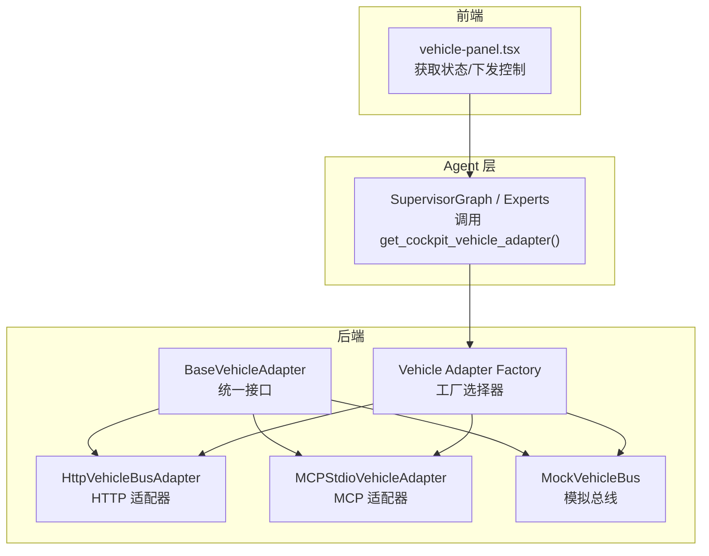
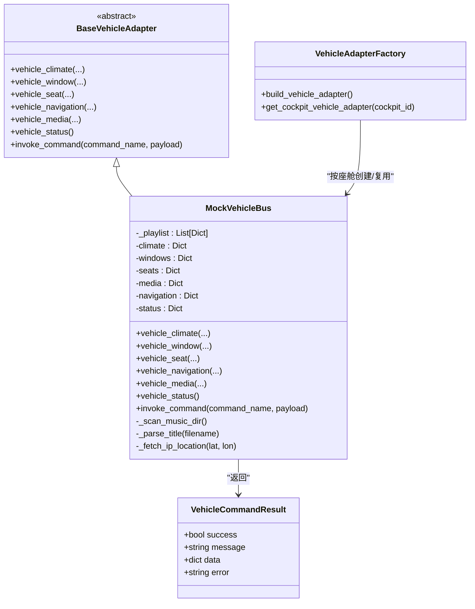
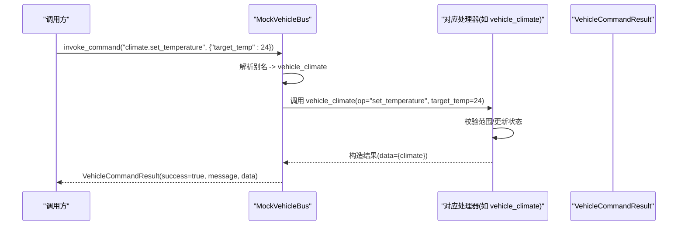
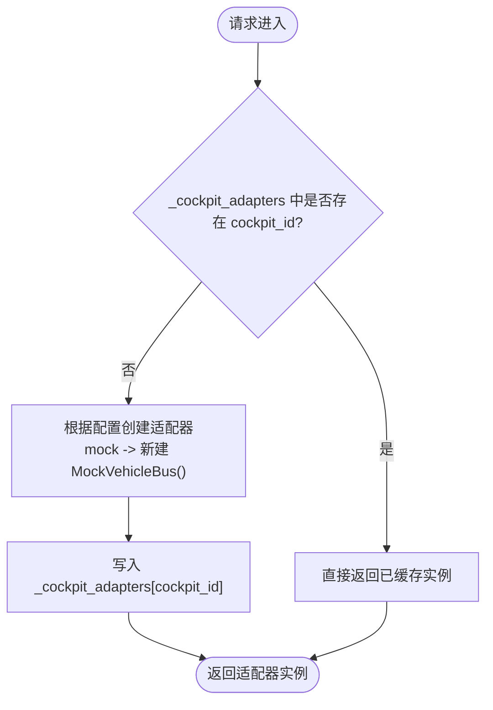
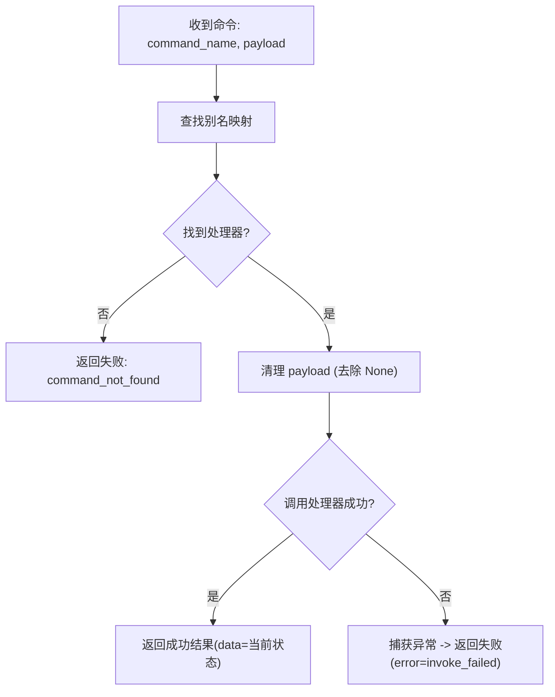
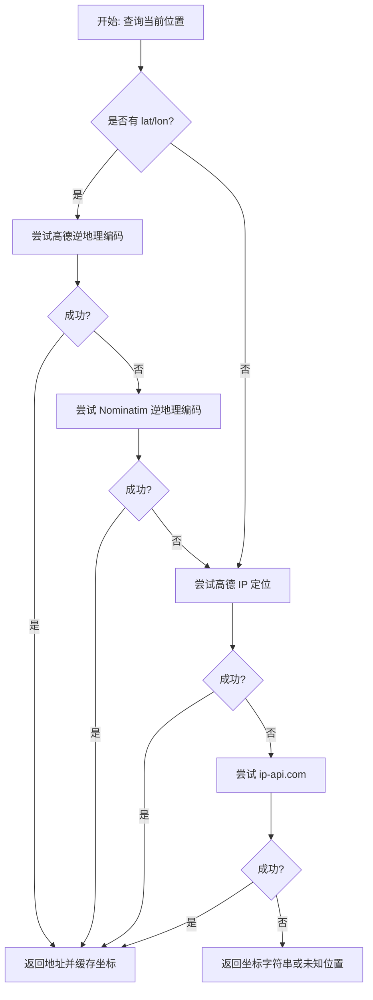
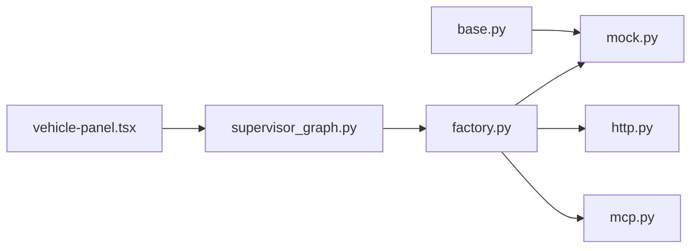

# Mock模式（开发调试）

<cite>
**本文引用的文件**
- [backend_design/nexus/vehicle/mock.py](file://backend_design/nexus/vehicle/mock.py)
- [backend_design/nexus/vehicle/factory.py](file://backend_design/nexus/vehicle/factory.py)
- [backend_design/nexus/vehicle/base.py](file://backend_design/nexus/vehicle/base.py)
- [backend_design/nexus/agent/supervisor_graph.py](file://backend_design/nexus/agent/supervisor_graph.py)
- [frontend_design/src/components/vehicle/vehicle-panel.tsx](file://frontend_design/src/components/vehicle/vehicle-panel.tsx)
</cite>

## 目录
1. [简介](#简介)
2. [项目结构](#项目结构)
3. [核心组件](#核心组件)
4. [架构总览](#架构总览)
5. [详细组件分析](#详细组件分析)
6. [依赖关系分析](#依赖关系分析)
7. [性能与可扩展性](#性能与可扩展性)
8. [配置与使用场景](#配置与使用场景)
9. [故障排查指南](#故障排查指南)
10. [结论](#结论)

## 简介
本文件面向开发与测试人员，系统性阐述 Mock 模式的实现原理与使用方法。重点覆盖：
- MockVehicleBus 类的实现原理：模拟车辆状态管理、指令执行模拟与响应生成机制
- v2.1 多座舱隔离特性：每个座舱独立 MockVehicleBus 实例的状态隔离实现
- Mock 模式下车辆状态数据结构：空调温度、车窗状态、座椅位置等模拟数据的维护
- Mock 模式的配置方法和使用场景：开发测试、功能演示、集成测试最佳实践
- Mock 数据持久化与重置机制：当前实现现状与扩展建议

## 项目结构
Mock 相关代码位于后端车控适配层，包含抽象接口、工厂选择器与 Mock 实现；前端在离线或后端不可用时回退到本地 Mock 数据展示。

图示来源
- [backend_design/nexus/vehicle/base.py:1-92](file://backend_design/nexus/vehicle/base.py#L1-L92)
- [backend_design/nexus/vehicle/factory.py:1-148](file://backend_design/nexus/vehicle/factory.py#L1-L148)
- [backend_design/nexus/vehicle/mock.py:1-589](file://backend_design/nexus/vehicle/mock.py#L1-L589)
- [backend_design/nexus/agent/supervisor_graph.py:845-848](file://backend_design/nexus/agent/supervisor_graph.py#L845-L848)
- [frontend_design/src/components/vehicle/vehicle-panel.tsx:140-185](file://frontend_design/src/components/vehicle/vehicle-panel.tsx#L140-L185)

章节来源
- [backend_design/nexus/vehicle/base.py:1-92](file://backend_design/nexus/vehicle/base.py#L1-L92)
- [backend_design/nexus/vehicle/factory.py:1-148](file://backend_design/nexus/vehicle/factory.py#L1-L148)
- [backend_design/nexus/vehicle/mock.py:1-589](file://backend_design/nexus/vehicle/mock.py#L1-L589)
- [backend_design/nexus/agent/supervisor_graph.py:845-848](file://backend_design/nexus/agent/supervisor_graph.py#L845-L848)
- [frontend_design/src/components/vehicle/vehicle-panel.tsx:140-185](file://frontend_design/src/components/vehicle/vehicle-panel.tsx#L140-L185)

## 核心组件
- BaseVehicleAdapter：定义统一的车辆控制接口，包括空调、车窗、座椅、导航、媒体、状态查询与通用命令入口。
- VehicleCommandResult：标准化命令返回结果，包含成功标志、消息、结构化数据与错误信息。
- MockVehicleBus：基于内存字典的完整车辆状态模型，提供各子系统控制与查询逻辑，并支持命令别名映射。
- Vehicle Adapter Factory：根据配置选择具体适配器；v2.1 引入按座舱维度缓存 MockVehicleBus 实例，实现状态隔离。

章节来源
- [backend_design/nexus/vehicle/base.py:1-92](file://backend_design/nexus/vehicle/base.py#L1-L92)
- [backend_design/nexus/vehicle/mock.py:1-589](file://backend_design/nexus/vehicle/mock.py#L1-L589)
- [backend_design/nexus/vehicle/factory.py:1-148](file://backend_design/nexus/vehicle/factory.py#L1-L148)

## 架构总览
Mock 模式通过“工厂 + 适配器”解耦上层 Agent 与底层车控实现。Mock 模式下，每个座舱持有独立的 MockVehicleBus 实例，确保空调、车窗、座椅等状态互不影响。

图示来源
- [backend_design/nexus/vehicle/base.py:1-92](file://backend_design/nexus/vehicle/base.py#L1-L92)
- [backend_design/nexus/vehicle/mock.py:1-589](file://backend_design/nexus/vehicle/mock.py#L1-L589)
- [backend_design/nexus/vehicle/factory.py:1-148](file://backend_design/nexus/vehicle/factory.py#L1-L148)

## 详细组件分析

### MockVehicleBus 类实现原理
- 状态模型
  - 空调 climate：温度、风量、模式、电源开关
  - 车窗 windows：全车与各窗位百分比
  - 座椅 seats：主副驾加热/制冷/按摩/位置
  - 媒体 media：播放状态、音量、来源、曲目、播放列表
  - 导航 navigation：目的地、途经点、模式、当前位置、坐标、速度、朝向
  - 状态 status：胎压、续航、油量、电量、保养
- 指令执行模拟
  - 统一入口 invoke_command 将外部命令名映射至内部处理器（如 vehicle_climate、vehicle_window 等），支持多种别名
  - 参数清理与容错：移除 None 值，参数不匹配时降级为无参调用，异常捕获后返回失败结果
- 响应生成机制
  - 所有操作均返回 VehicleCommandResult，包含 success、message、data（当前状态快照）与可选 error
- 多媒体能力
  - 启动时扫描 assets/audio/music 目录，动态构建播放列表，支持 mp3/wav
  - 支持播放/暂停/下一首/上一首/指定曲目/设置音量/切换来源等操作
- 定位能力
  - 优先尝试浏览器 GPS 逆地理编码（高德地图、Nominatim），其次 IP 定位（高德 IP API、ip-api.com），最终降级为坐标字符串
  - 无论是否成功，都会尽量保存坐标以便后续使用

图示来源
- [backend_design/nexus/vehicle/mock.py:563-589](file://backend_design/nexus/vehicle/mock.py#L563-L589)
- [backend_design/nexus/vehicle/mock.py:167-209](file://backend_design/nexus/vehicle/mock.py#L167-L209)
- [backend_design/nexus/vehicle/base.py:19-33](file://backend_design/nexus/vehicle/base.py#L19-L33)

章节来源
- [backend_design/nexus/vehicle/mock.py:1-589](file://backend_design/nexus/vehicle/mock.py#L1-L589)
- [backend_design/nexus/vehicle/base.py:1-92](file://backend_design/nexus/vehicle/base.py#L1-L92)

### v2.1 多座舱隔离特性
- 设计目标
  - 每个座舱拥有独立的 MockVehicleBus 实例，避免跨座舱状态污染（例如座舱 A 调温不影响座舱 B）
- 实现方式
  - 工厂模块维护 _cockpit_adapters 字典，以 cockpit_id 为键缓存适配器实例
  - 首次访问某座舱时创建 MockVehicleBus，后续直接复用该实例
  - HTTP/MCP 模式为无状态，复用全局单例；Mock 模式为有状态，按座舱隔离
- 调用链路
  - Agent 侧通过 get_cockpit_vehicle_adapter(cockpit_id) 获取对应座舱的适配器
  - 前端在座舱切换时重新拉取状态，保证 UI 显示与后端状态一致

图示来源
- [backend_design/nexus/vehicle/factory.py:56-84](file://backend_design/nexus/vehicle/factory.py#L56-L84)
- [backend_design/nexus/agent/supervisor_graph.py:845-848](file://backend_design/nexus/agent/supervisor_graph.py#L845-L848)
- [frontend_design/src/components/vehicle/vehicle-panel.tsx:161-164](file://frontend_design/src/components/vehicle/vehicle-panel.tsx#L161-L164)

章节来源
- [backend_design/nexus/vehicle/factory.py:1-148](file://backend_design/nexus/vehicle/factory.py#L1-L148)
- [backend_design/nexus/agent/supervisor_graph.py:845-848](file://backend_design/nexus/agent/supervisor_graph.py#L845-L848)
- [frontend_design/src/components/vehicle/vehicle-panel.tsx:161-164](file://frontend_design/src/components/vehicle/vehicle-panel.tsx#L161-L164)

### Mock 模式下的车辆状态数据结构
- 空调 climate
  - 字段：temperature、fan_speed、mode、power
  - 行为：支持开关、设置温度/风量/模式、温度增减
- 车窗 windows
  - 字段：all、front_left、front_right、rear_left、rear_right、sunroof
  - 行为：支持全部/单个窗位设置百分比、开/关
- 座椅 seats
  - 字段：driver/passenger 各自包含 heat、cool、massage、position
  - 行为：加热/制冷开/关、按摩开/关、前后调节
- 媒体 media
  - 字段：playing、volume、source、track、track_index、playlist
  - 行为：播放/暂停/下一首/上一首/选曲/设置音量/切换来源
- 导航 navigation
  - 字段：destination、waypoint、mode、current_location、latitude、longitude、speed_kmh、heading
  - 行为：设置目的地/途经点/模式、查询当前位置（IP/GPS 逆地理编码）
- 状态 status
  - 字段：tire_pressure、range_km、fuel_percent、battery_percent、maintenance
  - 行为：只读汇总

章节来源
- [backend_design/nexus/vehicle/mock.py:61-108](file://backend_design/nexus/vehicle/mock.py#L61-L108)
- [backend_design/nexus/vehicle/mock.py:167-209](file://backend_design/nexus/vehicle/mock.py#L167-L209)
- [backend_design/nexus/vehicle/mock.py:211-242](file://backend_design/nexus/vehicle/mock.py#L211-L242)
- [backend_design/nexus/vehicle/mock.py:244-274](file://backend_design/nexus/vehicle/mock.py#L244-L274)
- [backend_design/nexus/vehicle/mock.py:276-303](file://backend_design/nexus/vehicle/mock.py#L276-L303)
- [backend_design/nexus/vehicle/mock.py:451-531](file://backend_design/nexus/vehicle/mock.py#L451-L531)
- [backend_design/nexus/vehicle/mock.py:533-561](file://backend_design/nexus/vehicle/mock.py#L533-L561)

### 指令执行与响应生成流程
- 命令别名映射：COMMAND_ALIASES 将高层命令名归一化为内部处理器方法名
- 参数处理：剔除 None 值，避免多余参数导致 TypeError
- 异常处理：捕获执行异常，返回失败结果并附带错误码
- 响应内容：data 中包含当前子系统的状态快照，便于前端即时刷新

图示来源
- [backend_design/nexus/vehicle/mock.py:563-589](file://backend_design/nexus/vehicle/mock.py#L563-L589)

章节来源
- [backend_design/nexus/vehicle/mock.py:563-589](file://backend_design/nexus/vehicle/mock.py#L563-L589)

### 定位与地理位置服务流程
- 优先级策略
  - 浏览器 GPS 坐标 + 逆地理编码（高德地图优先，Nominatim 备选）
  - IP 定位（高德 IP API 优先，ip-api.com 备选）
  - 降级：返回坐标字符串
- 健壮性
  - 多次超时/失败保护，记录警告日志
  - 即使地址解析失败，仍尽可能保存经纬度

图示来源
- [backend_design/nexus/vehicle/mock.py:305-449](file://backend_design/nexus/vehicle/mock.py#L305-L449)

章节来源
- [backend_design/nexus/vehicle/mock.py:305-449](file://backend_design/nexus/vehicle/mock.py#L305-L449)

## 依赖关系分析
- 模块耦合
  - MockVehicleBus 依赖 BaseVehicleAdapter 接口与 VehicleCommandResult 类型
  - 工厂模块依赖配置与日志，负责选择并缓存适配器实例
  - Agent 层通过工厂获取座舱专属适配器，屏蔽底层差异
- 外部依赖
  - 媒体播放列表扫描依赖文件系统
  - 定位功能依赖 httpx 与第三方 API（高德地图、Nominatim、ip-api.com）

图示来源
- [backend_design/nexus/vehicle/base.py:1-92](file://backend_design/nexus/vehicle/base.py#L1-L92)
- [backend_design/nexus/vehicle/mock.py:1-589](file://backend_design/nexus/vehicle/mock.py#L1-L589)
- [backend_design/nexus/vehicle/factory.py:1-148](file://backend_design/nexus/vehicle/factory.py#L1-L148)
- [backend_design/nexus/agent/supervisor_graph.py:845-848](file://backend_design/nexus/agent/supervisor_graph.py#L845-L848)
- [frontend_design/src/components/vehicle/vehicle-panel.tsx:140-185](file://frontend_design/src/components/vehicle/vehicle-panel.tsx#L140-L185)

章节来源
- [backend_design/nexus/vehicle/base.py:1-92](file://backend_design/nexus/vehicle/base.py#L1-L92)
- [backend_design/nexus/vehicle/mock.py:1-589](file://backend_design/nexus/vehicle/mock.py#L1-L589)
- [backend_design/nexus/vehicle/factory.py:1-148](file://backend_design/nexus/vehicle/factory.py#L1-L148)
- [backend_design/nexus/agent/supervisor_graph.py:845-848](file://backend_design/nexus/agent/supervisor_graph.py#L845-L848)
- [frontend_design/src/components/vehicle/vehicle-panel.tsx:140-185](file://frontend_design/src/components/vehicle/vehicle-panel.tsx#L140-L185)

## 性能与可扩展性
- 时间复杂度
  - 指令路由：O(1) 哈希表查找
  - 状态更新：O(1) 字典赋值
  - 媒体播放列表扫描：O(N) 遍历音频文件
- 空间复杂度
  - 每座舱 MockVehicleBus 实例占用内存与状态规模线性相关
- 优化建议
  - 媒体播放列表可考虑懒加载与增量更新
  - 定位结果可按座舱缓存，减少重复网络请求
  - 对频繁查询的子系统进行局部快照缓存

## 配置与使用场景
- 配置项
  - VEHICLE_ADAPTER：选择适配器类型（mock/http/mcp-stdio）
  - 其他 HTTP/MCP 相关配置项用于真实车机通信（非 Mock 模式）
- 使用场景
  - 开发联调：无需真实车机，快速验证技能与对话流
  - 功能演示：稳定可控的模拟状态，便于演示与录屏
  - 集成测试：多座舱并行测试，状态隔离避免相互干扰
- 前端行为
  - 后端离线时，前端回退到本地 Mock 数据展示，保持界面可用

章节来源
- [backend_design/nexus/vehicle/factory.py:1-148](file://backend_design/nexus/vehicle/factory.py#L1-L148)
- [frontend_design/src/components/vehicle/vehicle-panel.tsx:140-185](file://frontend_design/src/components/vehicle/vehicle-panel.tsx#L140-L185)

## 故障排查指南
- 常见问题
  - 命令未识别：检查 COMMAND_ALIASES 映射与调用参数
  - 定位失败：确认网络连通性与 API Key 配置，查看警告日志
  - 媒体无法播放：确认 assets/audio/music 目录下存在支持的音频文件
- 诊断要点
  - 观察 VehicleCommandResult 的 success/message/error 字段
  - 检查各子系统状态快照 data 是否与预期一致
  - 多座舱场景下确认 cockpit_id 是否正确传递

章节来源
- [backend_design/nexus/vehicle/mock.py:563-589](file://backend_design/nexus/vehicle/mock.py#L563-L589)
- [backend_design/nexus/vehicle/mock.py:305-449](file://backend_design/nexus/vehicle/mock.py#L305-L449)

## 结论
Mock 模式通过统一的适配器接口与按座舱隔离的实例管理，为开发、演示与测试提供了稳定可靠的模拟环境。MockVehicleBus 实现了完整的车辆状态模型与丰富的控制能力，结合工厂模式与前端回退机制，形成端到端的闭环体验。当前实现未内置持久化与重置接口，建议在需要时按需扩展。