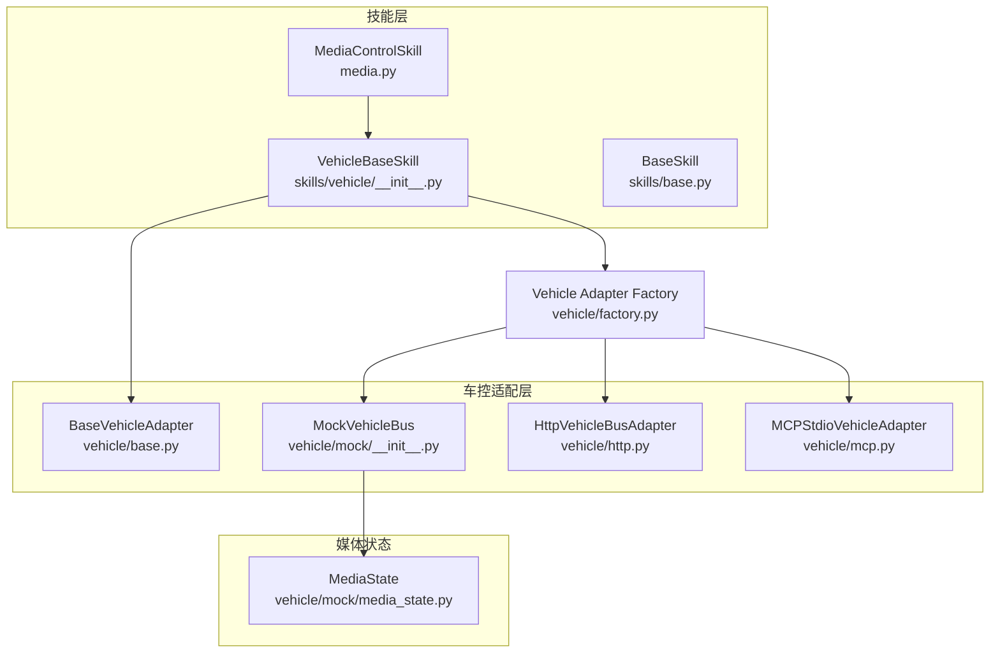
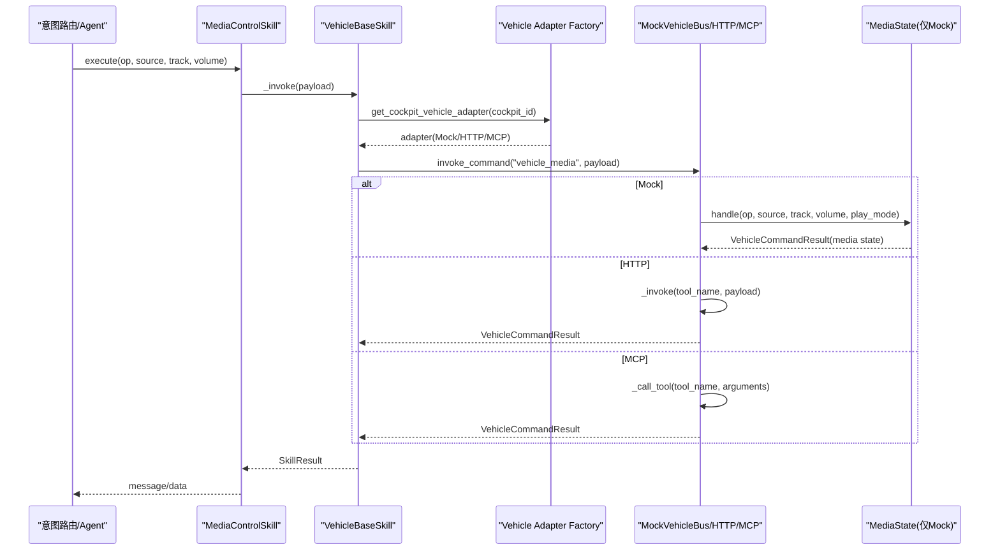
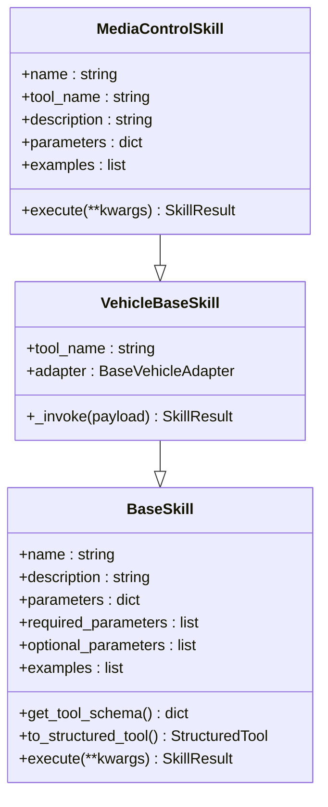
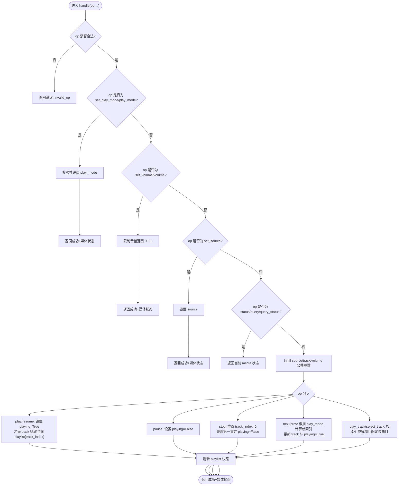
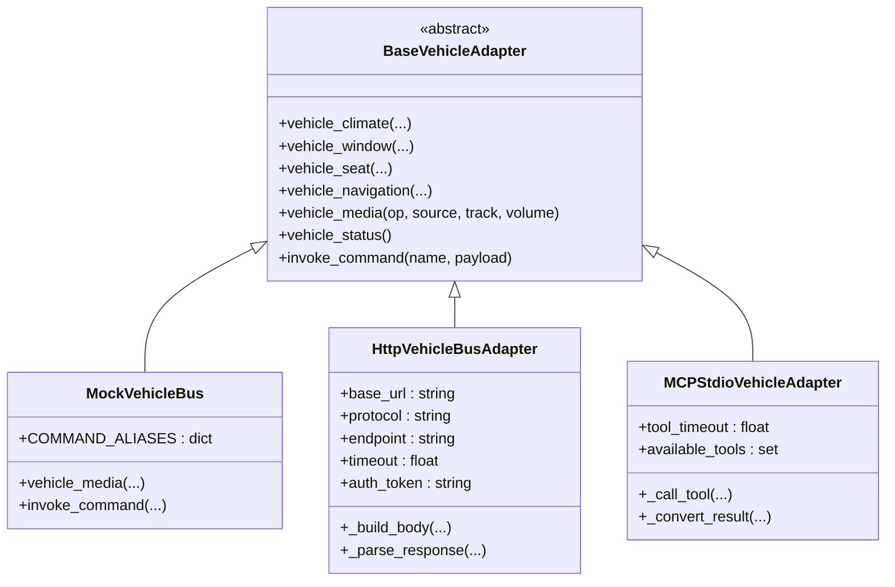
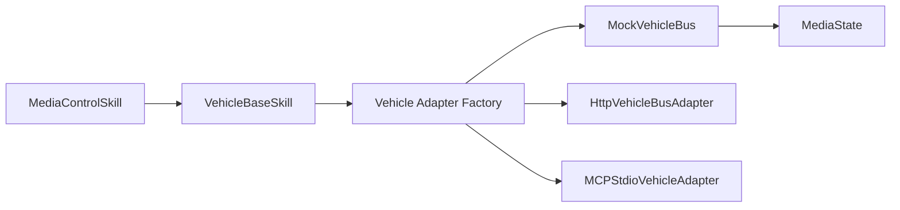

# 媒体播放技能

<cite>
**本文引用的文件**   
- [backend_design/nexus/skills/vehicle/media.py](file://backend_design/nexus/skills/vehicle/media.py)
- [backend_design/nexus/skills/base.py](file://backend_design/nexus/skills/base.py)
- [backend_design/nexus/skills/vehicle/__init__.py](file://backend_design/nexus/skills/vehicle/__init__.py)
- [backend_design/nexus/vehicle/base.py](file://backend_design/nexus/vehicle/base.py)
- [backend_design/nexus/vehicle/mock/__init__.py](file://backend_design/nexus/vehicle/mock/__init__.py)
- [backend_design/nexus/vehicle/mock/media_state.py](file://backend_design/nexus/vehicle/mock/media_state.py)
- [backend_design/nexus/vehicle/factory.py](file://backend_design/nexus/vehicle/factory.py)
- [backend_design/nexus/vehicle/http.py](file://backend_design/nexus/vehicle/http.py)
- [backend_design/nexus/vehicle/mcp.py](file://backend_design/nexus/vehicle/mcp.py)
</cite>

## 目录
1. [简介](#简介)
2. [项目结构](#项目结构)
3. [核心组件](#核心组件)
4. [架构总览](#架构总览)
5. [详细组件分析](#详细组件分析)
6. [依赖关系分析](#依赖关系分析)
7. [性能与可靠性](#性能与可靠性)
8. [故障排查指南](#故障排查指南)
9. [结论](#结论)
10. [附录：使用示例与最佳实践](#附录使用示例与最佳实践)

## 简介
本技术文档聚焦 NexusCockpit 的“媒体播放技能”，系统性阐述其控制能力（播放、暂停、切歌、音量调节、来源切换、播放模式）、媒体源管理与播放状态同步机制、与车载娱乐系统的集成方式（Mock/HTTP/MCP）及协议支持，并给出语音指令控制媒体的具体用法。同时覆盖播放列表管理、音频格式支持与故障恢复策略，帮助开发者与集成方快速落地与排障。

## 项目结构
媒体播放相关代码主要分布在以下模块：
- 技能层：定义媒体控制技能的元数据与执行入口
- 车控适配层：抽象统一接口，提供 Mock/HTTP/MCP 三种实现
- 媒体状态：本地模拟播放列表扫描、曲目解析与状态机
- 工厂与上下文：按座舱隔离适配器实例，选择后端实现

图示来源 
- [backend_design/nexus/skills/vehicle/media.py:15-36](file://backend_design/nexus/skills/vehicle/media.py#L15-L36)
- [backend_design/nexus/skills/vehicle/__init__.py:21-55](file://backend_design/nexus/skills/vehicle/__init__.py#L21-L55)
- [backend_design/nexus/skills/base.py:116-175](file://backend_design/nexus/skills/base.py#L116-L175)
- [backend_design/nexus/vehicle/base.py:35-92](file://backend_design/nexus/vehicle/base.py#L35-L92)
- [backend_design/nexus/vehicle/mock/__init__.py:39-91](file://backend_design/nexus/vehicle/mock/__init__.py#L39-L91)
- [backend_design/nexus/vehicle/http.py:23-64](file://backend_design/nexus/vehicle/http.py#L23-L64)
- [backend_design/nexus/vehicle/mcp.py:167-224](file://backend_design/nexus/vehicle/mcp.py#L167-L224)
- [backend_design/nexus/vehicle/mock/media_state.py:25-41](file://backend_design/nexus/vehicle/mock/media_state.py#L25-L41)
- [backend_design/nexus/vehicle/factory.py:38-84](file://backend_design/nexus/vehicle/factory.py#L38-L84)

章节来源
- [backend_design/nexus/skills/vehicle/media.py:15-36](file://backend_design/nexus/skills/vehicle/media.py#L15-L36)
- [backend_design/nexus/skills/vehicle/__init__.py:21-55](file://backend_design/nexus/skills/vehicle/__init__.py#L21-L55)
- [backend_design/nexus/vehicle/base.py:35-92](file://backend_design/nexus/vehicle/base.py#L35-L92)
- [backend_design/nexus/vehicle/mock/__init__.py:39-91](file://backend_design/nexus/vehicle/mock/__init__.py#L39-L91)
- [backend_design/nexus/vehicle/mock/media_state.py:25-41](file://backend_design/nexus/vehicle/mock/media_state.py#L25-L41)
- [backend_design/nexus/vehicle/factory.py:38-84](file://backend_design/nexus/vehicle/factory.py#L38-L84)

## 核心组件
- MediaControlSkill：媒体控制技能类，声明工具名、参数、示例与描述，并将调用委托给车控适配器。
- VehicleBaseSkill：车载技能基类，负责通过当前座舱的适配器统一调用 invoke_command。
- BaseSkill：技能通用基类，提供 Tool Schema 生成、结构化参数模型与缓存/副作用标记等能力。
- BaseVehicleAdapter：车控适配器抽象，定义 vehicle_media 等统一方法签名。
- MockVehicleBus：模拟总线门面，将命令分发到各子系统（含媒体），并提供命令别名映射。
- MediaState：媒体状态与播放列表扫描、操作处理（播放/暂停/切歌/音量/来源/模式/查询）。
- HttpVehicleBusAdapter / MCPStdioVehicleAdapter：真实车控服务 HTTP/MCP 对接实现。
- Vehicle Adapter Factory：根据配置选择 Mock/HTTP/MCP 适配器，并按座舱隔离实例。

章节来源
- [backend_design/nexus/skills/vehicle/media.py:15-36](file://backend_design/nexus/skills/vehicle/media.py#L15-L36)
- [backend_design/nexus/skills/vehicle/__init__.py:21-55](file://backend_design/nexus/skills/vehicle/__init__.py#L21-L55)
- [backend_design/nexus/skills/base.py:116-175](file://backend_design/nexus/skills/base.py#L116-L175)
- [backend_design/nexus/vehicle/base.py:35-92](file://backend_design/nexus/vehicle/base.py#L35-L92)
- [backend_design/nexus/vehicle/mock/__init__.py:39-91](file://backend_design/nexus/vehicle/mock/__init__.py#L39-L91)
- [backend_design/nexus/vehicle/mock/media_state.py:91-226](file://backend_design/nexus/vehicle/mock/media_state.py#L91-L226)
- [backend_design/nexus/vehicle/http.py:23-64](file://backend_design/nexus/vehicle/http.py#L23-L64)
- [backend_design/nexus/vehicle/mcp.py:167-224](file://backend_design/nexus/vehicle/mcp.py#L167-L224)
- [backend_design/nexus/vehicle/factory.py:38-84](file://backend_design/nexus/vehicle/factory.py#L38-L84)

## 架构总览
媒体播放控制的端到端流程如下：
- 上层意图路由识别出“媒体控制”意图后，调用 MediaControlSkill.execute()
- VehicleBaseSkill._invoke() 通过当前座舱的适配器调用 invoke_command("vehicle_media", payload)
- MockVehicleBus 将命令分发给 MediaState.handle() 更新状态并返回结果
- HTTP/MCP 适配器则将请求转发至外部车控服务，并解析响应

图示来源 
- [backend_design/nexus/skills/vehicle/media.py:34-36](file://backend_design/nexus/skills/vehicle/media.py#L34-L36)
- [backend_design/nexus/skills/vehicle/__init__.py:44-55](file://backend_design/nexus/skills/vehicle/__init__.py#L44-L55)
- [backend_design/nexus/vehicle/factory.py:55-84](file://backend_design/nexus/vehicle/factory.py#L55-L84)
- [backend_design/nexus/vehicle/mock/__init__.py:194-220](file://backend_design/nexus/vehicle/mock/__init__.py#L194-L220)
- [backend_design/nexus/vehicle/mock/media_state.py:91-226](file://backend_design/nexus/vehicle/mock/media_state.py#L91-L226)
- [backend_design/nexus/vehicle/http.py:65-93](file://backend_design/nexus/vehicle/http.py#L65-93)
- [backend_design/nexus/vehicle/mcp.py:222-237](file://backend_design/nexus/vehicle/mcp.py#L222-L237)

## 详细组件分析

### 媒体控制技能 MediaControlSkill
- 职责：声明媒体控制工具的元信息（名称、描述、参数、示例），并将执行委托给车控适配器。
- 关键属性：
  - name/tool_name：标识工具为 vehicle_media
  - parameters：op/source/track/volume 的定义与说明
  - examples：常见语音输入与对应参数的映射
- 执行流程：execute() 直接调用 _invoke(kwargs)，由 VehicleBaseSkill 完成适配器调用与结果封装。

图示来源 
- [backend_design/nexus/skills/base.py:116-175](file://backend_design/nexus/skills/base.py#L116-L175)
- [backend_design/nexus/skills/vehicle/__init__.py:21-55](file://backend_design/nexus/skills/vehicle/__init__.py#L21-L55)
- [backend_design/nexus/skills/vehicle/media.py:15-36](file://backend_design/nexus/skills/vehicle/media.py#L15-L36)

章节来源
- [backend_design/nexus/skills/vehicle/media.py:15-36](file://backend_design/nexus/skills/vehicle/media.py#L15-L36)
- [backend_design/nexus/skills/vehicle/__init__.py:44-55](file://backend_design/nexus/skills/vehicle/__init__.py#L44-L55)
- [backend_design/nexus/skills/base.py:116-175](file://backend_design/nexus/skills/base.py#L116-L175)

### 媒体状态与播放列表 MediaState
- 播放列表扫描：
  - 自动扫描 assets/audio/music/ 目录，支持 .mp3/.wav
  - 从文件名解析标题（支持“歌手-歌曲”或“歌手 - 歌曲”格式）
  - 构建包含 title/filename/url/format 的条目
- 状态字段：
  - playing、volume、source、track、track_index、play_mode、playlist
- 操作集：
  - 播放/暂停/停止/下一首/上一首/恢复
  - 设置音量、来源、播放模式（顺序/单曲循环/随机）
  - 指定曲目（索引或模糊匹配标题/文件名）
  - 查询状态
- 边界与校验：
  - 非法 op 返回错误
  - 音量范围限制 0~30
  - 播放模式校验
  - 空播放列表时的安全回退

图示来源 
- [backend_design/nexus/vehicle/mock/media_state.py:91-226](file://backend_design/nexus/vehicle/mock/media_state.py#L91-L226)

章节来源
- [backend_design/nexus/vehicle/mock/media_state.py:42-67](file://backend_design/nexus/vehicle/mock/media_state.py#L42-L67)
- [backend_design/nexus/vehicle/mock/media_state.py:69-83](file://backend_design/nexus/vehicle/mock/media_state.py#L69-L83)
- [backend_design/nexus/vehicle/mock/media_state.py:91-226](file://backend_design/nexus/vehicle/mock/media_state.py#L91-L226)

### 车控适配器与命令分发
- BaseVehicleAdapter：定义 vehicle_media 等方法签名，确保多实现一致。
- MockVehicleBus：
  - COMMAND_ALIASES：支持 media.control/media.play/media.pause/media.next/media.prev/media.set_volume/media.set_source/media.query_status 等别名映射到 vehicle_media
  - vehicle_media：将参数透传到 MediaState.handle()
  - invoke_command：统一入口，清理 None 值并容错调用
- HttpVehicleBusAdapter：
  - 构造 JSON-RPC 或 REST 请求体
  - 统一解析响应，兼容 result/error/data 多种结构
- MCPStdioVehicleAdapter：
  - 后台线程运行 MCP SDK 异步会话
  - 暴露同步接口，内部桥接 call_tool
  - 转换 CallToolResult 为 VehicleCommandResult

图示来源 
- [backend_design/nexus/vehicle/base.py:35-92](file://backend_design/nexus/vehicle/base.py#L35-L92)
- [backend_design/nexus/vehicle/mock/__init__.py:39-91](file://backend_design/nexus/vehicle/mock/__init__.py#L39-L91)
- [backend_design/nexus/vehicle/http.py:23-64](file://backend_design/nexus/vehicle/http.py#L23-L64)
- [backend_design/nexus/vehicle/mcp.py:167-224](file://backend_design/nexus/vehicle/mcp.py#L167-L224)

章节来源
- [backend_design/nexus/vehicle/base.py:35-92](file://backend_design/nexus/vehicle/base.py#L35-L92)
- [backend_design/nexus/vehicle/mock/__init__.py:194-220](file://backend_design/nexus/vehicle/mock/__init__.py#L194-L220)
- [backend_design/nexus/vehicle/http.py:65-93](file://backend_design/nexus/vehicle/http.py#L65-93)
- [backend_design/nexus/vehicle/mcp.py:222-237](file://backend_design/nexus/vehicle/mcp.py#L222-L237)

### 工厂与座舱隔离
- build_vehicle_adapter：按配置选择 Mock/HTTP/MCP 单例
- get_cockpit_vehicle_adapter：按 cockpit_id 获取适配器实例（Mock 模式每座舱独立，HTTP/MCP 复用单例）
- _create_adapter：解析配置项（adapter、api_base_url、api_protocol、api_endpoint、api_timeout、api_token、mcp_command、mcp_args、mcp_workdir、mcp_validate_tools）

章节来源
- [backend_design/nexus/vehicle/factory.py:38-84](file://backend_design/nexus/vehicle/factory.py#L38-L84)
- [backend_design/nexus/vehicle/factory.py:86-123](file://backend_design/nexus/vehicle/factory.py#L86-L123)

## 依赖关系分析
- 技能层依赖车控适配层，不关心具体通信方式
- Mock 模式下，媒体状态完全在进程内维护；HTTP/MCP 模式下，状态由远端服务维护
- 工厂层集中管理适配器生命周期与座舱隔离
- 媒体状态对文件系统有读取依赖（assets/audio/music）

图示来源 
- [backend_design/nexus/skills/vehicle/media.py:15-36](file://backend_design/nexus/skills/vehicle/media.py#L15-L36)
- [backend_design/nexus/skills/vehicle/__init__.py:44-55](file://backend_design/nexus/skills/vehicle/__init__.py#L44-L55)
- [backend_design/nexus/vehicle/factory.py:38-84](file://backend_design/nexus/vehicle/factory.py#L38-L84)
- [backend_design/nexus/vehicle/mock/__init__.py:39-91](file://backend_design/nexus/vehicle/mock/__init__.py#L39-L91)
- [backend_design/nexus/vehicle/mock/media_state.py:25-41](file://backend_design/nexus/vehicle/mock/media_state.py#L25-L41)

章节来源
- [backend_design/nexus/skills/vehicle/media.py:15-36](file://backend_design/nexus/skills/vehicle/media.py#L15-L36)
- [backend_design/nexus/vehicle/factory.py:38-84](file://backend_design/nexus/vehicle/factory.py#L38-L84)

## 性能与可靠性
- 播放列表扫描：仅在 MediaState 初始化时执行一次，避免重复 IO
- 操作复杂度：
  - next/prev：O(1) 索引计算（shuffle 需去重随机，最坏 O(n)）
  - select_track：字符串匹配最坏 O(n)
- 网络调用：
  - HTTP：超时与异常捕获，返回标准化错误码
  - MCP：后台事件循环 + 超时控制，避免阻塞主线程
- 幂等性：
  - 技能层可标记 has_side_effect（媒体控制通常为 true，禁止缓存）
  - 查询类操作（status/query）适合缓存以提升响应速度

章节来源
- [backend_design/nexus/vehicle/mock/media_state.py:42-67](file://backend_design/nexus/vehicle/mock/media_state.py#L42-L67)
- [backend_design/nexus/vehicle/mock/media_state.py:172-217](file://backend_design/nexus/vehicle/mock/media_state.py#L172-L217)
- [backend_design/nexus/vehicle/http.py:82-93](file://backend_design/nexus/vehicle/http.py#L82-93)
- [backend_design/nexus/vehicle/mcp.py:137-151](file://backend_design/nexus/vehicle/mcp.py#L137-L151)
- [backend_design/nexus/skills/base.py:176-184](file://backend_design/nexus/skills/base.py#L176-L184)

## 故障排查指南
- 无法找到音频文件
  - 检查 assets/audio/music/ 是否存在且包含 .mp3/.wav
  - 查看日志中加载数量提示
- 不支持的操作符
  - 确认 op 是否在合法集合内
  - 检查命令别名映射是否正确
- 音量越界
  - 系统会自动限制到 0~30 范围
- 网络不可达或服务异常
  - HTTP：检查 base_url、endpoint、鉴权 token、超时配置
  - MCP：检查 mcp_command、mcp_args、工作目录、工具可用性
- 播放模式无效
  - 仅支持 sequential/single/shuffle

章节来源
- [backend_design/nexus/vehicle/mock/media_state.py:62-67](file://backend_design/nexus/vehicle/mock/media_state.py#L62-L67)
- [backend_design/nexus/vehicle/mock/media_state.py:100-106](file://backend_design/nexus/vehicle/mock/media_state.py#L100-L106)
- [backend_design/nexus/vehicle/mock/media_state.py:126-133](file://backend_design/nexus/vehicle/mock/media_state.py#L126-L133)
- [backend_design/nexus/vehicle/mock/media_state.py:109-124](file://backend_design/nexus/vehicle/mock/media_state.py#L109-L124)
- [backend_design/nexus/vehicle/http.py:86-93](file://backend_design/nexus/vehicle/http.py#L86-93)
- [backend_design/nexus/vehicle/mcp.py:226-237](file://backend_design/nexus/vehicle/mcp.py#L226-L237)

## 结论
NexusCockpit 媒体播放技能以清晰的技能-适配器分层设计，实现了统一的媒体控制接口与灵活的接入方式。Mock 模式便于开发与演示，HTTP/MCP 模式支撑生产环境对接真实车机。MediaState 提供了完整的播放列表管理与状态机，结合工厂与座舱隔离，满足多用户场景下的状态独立性。通过标准化的错误处理与超时控制，系统在可用性与稳定性方面具备良好基础。

## 附录：使用示例与最佳实践

### 语音指令到参数映射
- “播放音乐” → {"op": "play", "source": "local"}
- “下一首” → {"op": "next"}
- “上一首” → {"op": "prev"}
- “音量调到16” → {"op": "set_volume", "volume": 16}
- “切换到蓝牙” → {"op": "set_source", "source": "bluetooth"}
- “随机播放” → {"op": "set_play_mode", "play_mode": "shuffle"}
- “查询媒体状态” → {"op": "query_status"}

章节来源
- [backend_design/nexus/skills/vehicle/media.py:21-32](file://backend_design/nexus/skills/vehicle/media.py#L21-L32)

### 播放列表与音频格式
- 支持的格式：.mp3、.wav
- 标题解析规则：支持“歌手-歌曲”或“歌手 - 歌曲”
- URL 路径：/audio/music/{filename}

章节来源
- [backend_design/nexus/vehicle/mock/media_state.py:42-67](file://backend_design/nexus/vehicle/mock/media_state.py#L42-L67)
- [backend_design/nexus/vehicle/mock/media_state.py:69-83](file://backend_design/nexus/vehicle/mock/media_state.py#L69-L83)

### 与车载娱乐系统集成
- Mock 模式：本地内存状态，无需外部服务
- HTTP 模式：REST/JSON-RPC 两种协议，支持鉴权与超时
- MCP 模式：通过 stdio 与 MCP 服务通信，支持工具发现与结构化内容

章节来源
- [backend_design/nexus/vehicle/http.py:94-98](file://backend_design/nexus/vehicle/http.py#L94-98)
- [backend_design/nexus/vehicle/mcp.py:96-136](file://backend_design/nexus/vehicle/mcp.py#L96-136)

### 最佳实践
- 在 Agent 编排中将媒体控制标记为有副作用，避免缓存
- 查询状态类操作可启用短时缓存提升响应
- 生产环境优先使用 HTTP/MCP 模式，并确保超时与重试策略合理
- 定期巡检播放目录，保证媒体资源可用