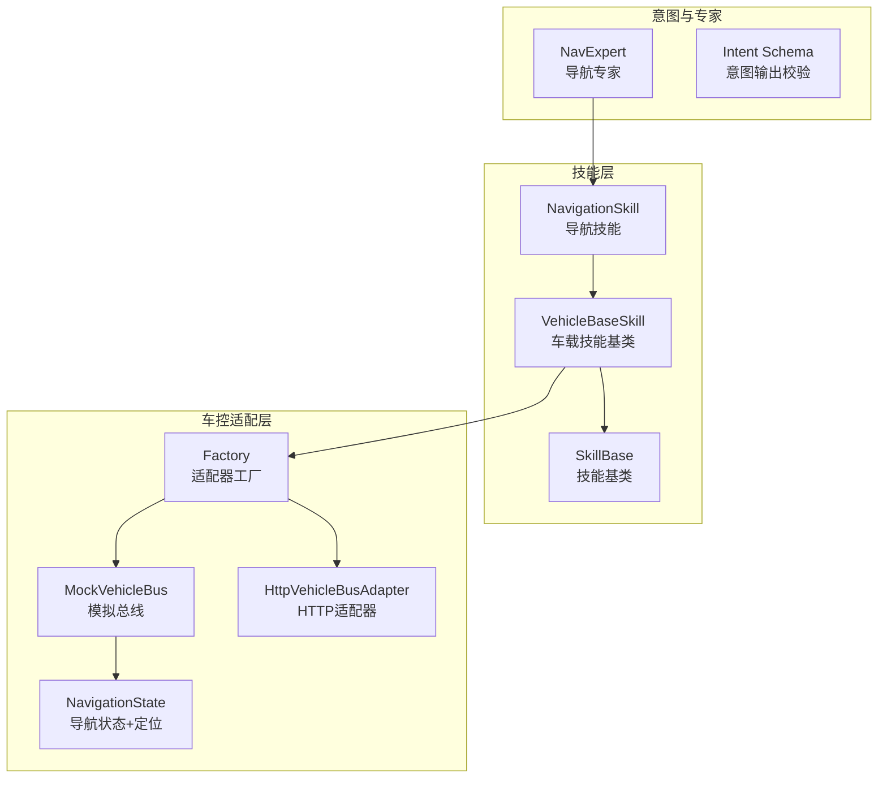
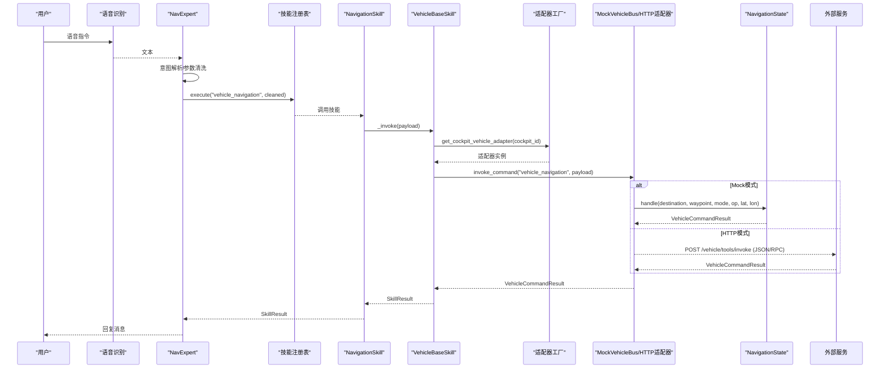
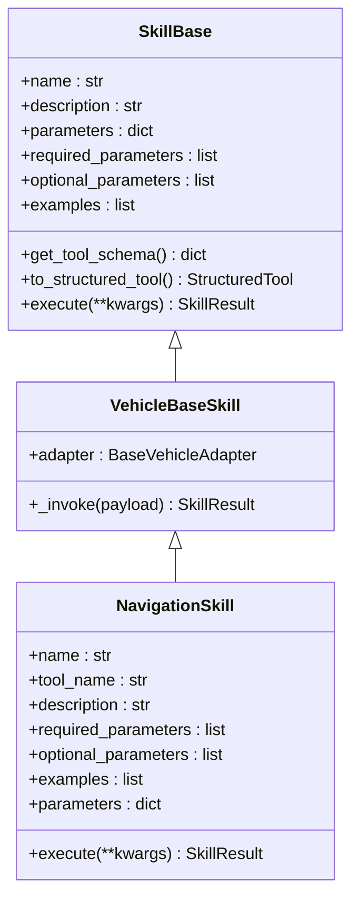
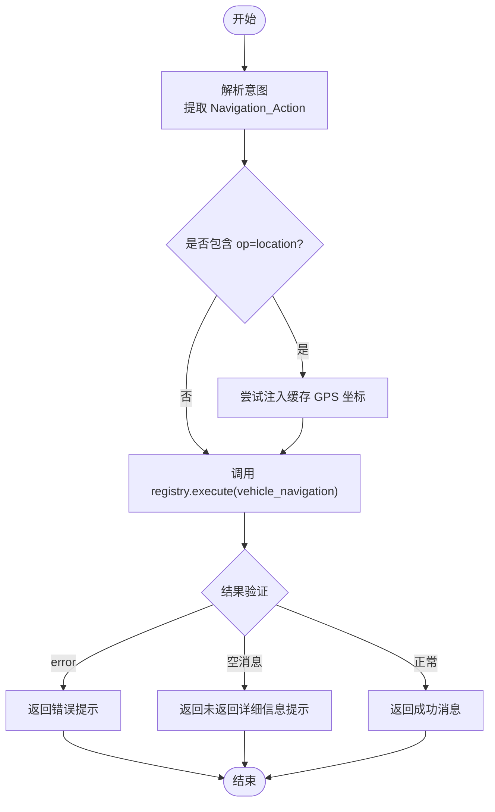
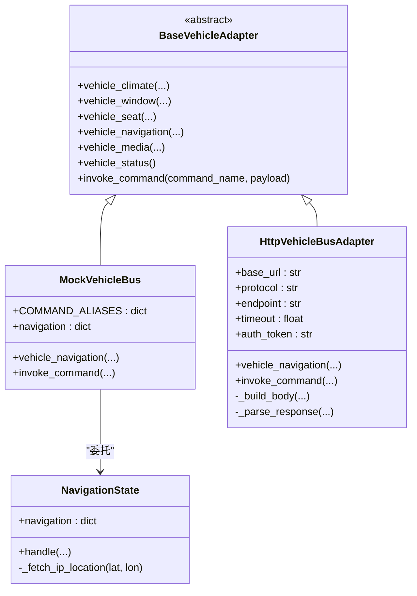
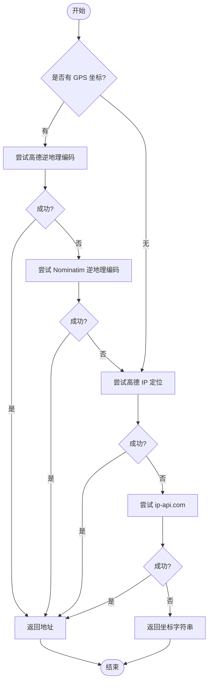
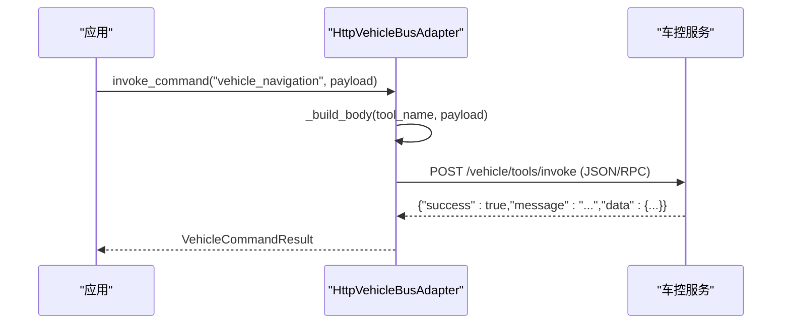
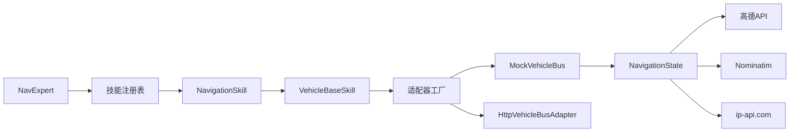

# 导航控制技能

<cite>
**本文引用的文件**   
- [backend_design/nexus/skills/vehicle/navigation.py](file://backend_design/nexus/skills/vehicle/navigation.py)
- [backend_design/nexus/agent/experts/nav_expert.py](file://backend_design/nexus/agent/experts/nav_expert.py)
- [backend_design/nexus/skills/base.py](file://backend_design/nexus/skills/base.py)
- [backend_design/nexus/skills/vehicle/__init__.py](file://backend_design/nexus/skills/vehicle/__init__.py)
- [backend_design/nexus/vehicle/base.py](file://backend_design/nexus/vehicle/base.py)
- [backend_design/nexus/vehicle/mock/__init__.py](file://backend_design/nexus/vehicle/mock/__init__.py)
- [backend_design/nexus/vehicle/mock/navigation_state.py](file://backend_design/nexus/vehicle/mock/navigation_state.py)
- [backend_design/nexus/vehicle/factory.py](file://backend_design/nexus/vehicle/factory.py)
- [backend_design/nexus/vehicle/http.py](file://backend_design/nexus/vehicle/http.py)
- [backend_design/nexus/intent/schema.py](file://backend_design/nexus/intent/schema.py)
</cite>

## 目录
1. [简介](#简介)
2. [项目结构](#项目结构)
3. [核心组件](#核心组件)
4. [架构总览](#架构总览)
5. [详细组件分析](#详细组件分析)
6. [依赖关系分析](#依赖关系分析)
7. [性能与可靠性](#性能与可靠性)
8. [故障排查指南](#故障排查指南)
9. [结论](#结论)
10. [附录：使用示例与协议说明](#附录使用示例与协议说明)

## 简介
本技术文档聚焦 NexusCockpit 的“导航控制技能”，系统性阐述其从语音指令到车载导航执行的完整链路，包括：
- 目的地设置、途经点配置、导航模式选择与启动
- 当前位置查询（GPS/逆地理编码/IP 定位）
- 与车控适配层（Mock/HTTP/MCP）的通信协议与数据格式
- 意图识别与工具调用编排
- 路径优化算法、实时交通信息集成与导航状态监控的实现现状与建议

该技能通过“专家 Agent + 技能注册 + 车控适配器”的分层设计，实现高内聚、低耦合的可扩展导航能力。

## 项目结构
导航相关代码主要分布在以下模块：
- 技能定义与注册：skills/vehicle/navigation.py、skills/base.py、skills/vehicle/__init__.py
- 专家 Agent：agent/experts/nav_expert.py
- 车控适配层：vehicle/base.py、vehicle/mock/__init__.py、vehicle/mock/navigation_state.py、vehicle/http.py、vehicle/factory.py
- 意图输出校验：intent/schema.py

**图表来源** 
- [backend_design/nexus/agent/experts/nav_expert.py:1-98](file://backend_design/nexus/agent/experts/nav_expert.py#L1-L98)
- [backend_design/nexus/skills/vehicle/navigation.py:1-39](file://backend_design/nexus/skills/vehicle/navigation.py#L1-L39)
- [backend_design/nexus/skills/base.py:1-264](file://backend_design/nexus/skills/base.py#L1-L264)
- [backend_design/nexus/skills/vehicle/__init__.py:1-55](file://backend_design/nexus/skills/vehicle/__init__.py#L1-L55)
- [backend_design/nexus/vehicle/base.py:1-92](file://backend_design/nexus/vehicle/base.py#L1-L92)
- [backend_design/nexus/vehicle/mock/__init__.py:1-220](file://backend_design/nexus/vehicle/mock/__init__.py#L1-L220)
- [backend_design/nexus/vehicle/mock/navigation_state.py:1-216](file://backend_design/nexus/vehicle/mock/navigation_state.py#L1-L216)
- [backend_design/nexus/vehicle/http.py:1-127](file://backend_design/nexus/vehicle/http.py#L1-L127)
- [backend_design/nexus/vehicle/factory.py:1-147](file://backend_design/nexus/vehicle/factory.py#L1-L147)
- [backend_design/nexus/intent/schema.py:1-160](file://backend_design/nexus/intent/schema.py#L1-L160)

**章节来源**
- [backend_design/nexus/agent/experts/nav_expert.py:1-98](file://backend_design/nexus/agent/experts/nav_expert.py#L1-L98)
- [backend_design/nexus/skills/vehicle/navigation.py:1-39](file://backend_design/nexus/skills/vehicle/navigation.py#L1-L39)
- [backend_design/nexus/skills/base.py:1-264](file://backend_design/nexus/skills/base.py#L1-L264)
- [backend_design/nexus/skills/vehicle/__init__.py:1-55](file://backend_design/nexus/skills/vehicle/__init__.py#L1-L55)
- [backend_design/nexus/vehicle/base.py:1-92](file://backend_design/nexus/vehicle/base.py#L1-L92)
- [backend_design/nexus/vehicle/mock/__init__.py:1-220](file://backend_design/nexus/vehicle/mock/__init__.py#L1-L220)
- [backend_design/nexus/vehicle/mock/navigation_state.py:1-216](file://backend_design/nexus/vehicle/mock/navigation_state.py#L1-L216)
- [backend_design/nexus/vehicle/http.py:1-127](file://backend_design/nexus/vehicle/http.py#L1-L127)
- [backend_design/nexus/vehicle/factory.py:1-147](file://backend_design/nexus/vehicle/factory.py#L1-L147)
- [backend_design/nexus/intent/schema.py:1-160](file://backend_design/nexus/intent/schema.py#L1-L160)

## 核心组件
- 导航技能 NavigationSkill：声明工具名、参数与示例，统一通过 VehicleBaseSkill 调用车控适配器。
- 车载技能基类 VehicleBaseSkill：按座舱隔离获取适配器实例，封装 invoke_command 调用并返回 SkillResult。
- 技能基类 SkillBase：提供 Tool Schema 生成、结构化参数模型、缓存与副作用控制等通用能力。
- 导航专家 NavExpert：解析意图，注入 GPS 坐标（避免 IP 定位超时），执行 vehicle_navigation 工具并验证结果。
- 车控适配器 BaseVehicleAdapter：抽象接口，包含 vehicle_navigation 等方法；具体由 Mock/HTTP/MCP 实现。
- 模拟车控 MockVehicleBus：门面模式聚合各子系统状态，支持命令别名映射与统一入口。
- 导航状态 NavigationState：维护导航上下文（目的地、途经点、模式、位置、坐标等），实现 IP/GPS 定位与逆地理编码。
- HTTP 适配器 HttpVehicleBusAdapter：将工具调用转为 JSON/RPC 请求，处理认证、超时与错误。
- 适配器工厂 Factory：根据配置选择 Mock/HTTP/MCP 适配器，并提供多座舱隔离。
- 意图输出 Schema：对 LLM 输出的意图决策进行 Pydantic 校验，保证路由稳定。

**章节来源**
- [backend_design/nexus/skills/vehicle/navigation.py:1-39](file://backend_design/nexus/skills/vehicle/navigation.py#L1-L39)
- [backend_design/nexus/skills/vehicle/__init__.py:1-55](file://backend_design/nexus/skills/vehicle/__init__.py#L1-L55)
- [backend_design/nexus/skills/base.py:1-264](file://backend_design/nexus/skills/base.py#L1-L264)
- [backend_design/nexus/agent/experts/nav_expert.py:1-98](file://backend_design/nexus/agent/experts/nav_expert.py#L1-L98)
- [backend_design/nexus/vehicle/base.py:1-92](file://backend_design/nexus/vehicle/base.py#L1-L92)
- [backend_design/nexus/vehicle/mock/__init__.py:1-220](file://backend_design/nexus/vehicle/mock/__init__.py#L1-L220)
- [backend_design/nexus/vehicle/mock/navigation_state.py:1-216](file://backend_design/nexus/vehicle/mock/navigation_state.py#L1-L216)
- [backend_design/nexus/vehicle/http.py:1-127](file://backend_design/nexus/vehicle/http.py#L1-L127)
- [backend_design/nexus/vehicle/factory.py:1-147](file://backend_design/nexus/vehicle/factory.py#L1-L147)
- [backend_design/nexus/intent/schema.py:1-160](file://backend_design/nexus/intent/schema.py#L1-L160)

## 架构总览
导航控制的整体流程如下：
- 用户语音输入经 ASR/TTS 后进入 Agent 工作流
- 意图路由识别为“导航”意图，交由 NavExpert 处理
- NavExpert 清理参数并在需要时注入 GPS 坐标，调用 registry.execute("vehicle_navigation", ...)
- NavigationSkill 通过 VehicleBaseSkill 获取当前座舱适配器，调用 invoke_command("vehicle_navigation", payload)
- 适配器根据配置选择 Mock 或 HTTP/MCP：
  - Mock：MockVehicleBus 委托 NavigationState.handle() 更新导航状态与定位
  - HTTP：HttpVehicleBusAdapter 构造 JSON/RPC 请求，转发至真实车控服务
- 最终返回 SkillResult，经 NavExpert 验证后形成回复

**图表来源** 
- [backend_design/nexus/agent/experts/nav_expert.py:1-98](file://backend_design/nexus/agent/experts/nav_expert.py#L1-L98)
- [backend_design/nexus/skills/vehicle/navigation.py:1-39](file://backend_design/nexus/skills/vehicle/navigation.py#L1-L39)
- [backend_design/nexus/skills/vehicle/__init__.py:1-55](file://backend_design/nexus/skills/vehicle/__init__.py#L1-L55)
- [backend_design/nexus/vehicle/base.py:1-92](file://backend_design/nexus/vehicle/base.py#L1-L92)
- [backend_design/nexus/vehicle/mock/__init__.py:1-220](file://backend_design/nexus/vehicle/mock/__init__.py#L1-L220)
- [backend_design/nexus/vehicle/mock/navigation_state.py:1-216](file://backend_design/nexus/vehicle/mock/navigation_state.py#L1-L216)
- [backend_design/nexus/vehicle/http.py:1-127](file://backend_design/nexus/vehicle/http.py#L1-L127)
- [backend_design/nexus/vehicle/factory.py:1-147](file://backend_design/nexus/vehicle/factory.py#L1-L147)

## 详细组件分析

### 导航技能 NavigationSkill
- 作用：声明导航工具名、参数与示例，统一通过 VehicleBaseSkill 执行。
- 关键行为：execute() 直接委托给 _invoke()，由基类完成适配器调用与结果封装。
- 参数：destination、waypoint、mode、op（location 表示查询当前位置）。

**图表来源** 
- [backend_design/nexus/skills/base.py:1-264](file://backend_design/nexus/skills/base.py#L1-L264)
- [backend_design/nexus/skills/vehicle/__init__.py:1-55](file://backend_design/nexus/skills/vehicle/__init__.py#L1-L55)
- [backend_design/nexus/skills/vehicle/navigation.py:1-39](file://backend_design/nexus/skills/vehicle/navigation.py#L1-L39)

**章节来源**
- [backend_design/nexus/skills/vehicle/navigation.py:1-39](file://backend_design/nexus/skills/vehicle/navigation.py#L1-L39)
- [backend_design/nexus/skills/vehicle/__init__.py:1-55](file://backend_design/nexus/skills/vehicle/__init__.py#L1-L55)
- [backend_design/nexus/skills/base.py:1-264](file://backend_design/nexus/skills/base.py#L1-L264)

### 导航专家 NavExpert
- 作用：解析导航意图，过滤 None 值，必要时注入 GPS 坐标，执行 vehicle_navigation 工具并验证结果。
- 关键点：当 op 为 location/current_location/where/位置/我在哪 时，优先从 adapter 缓存读取 GPS 坐标，避免 IP 定位超时导致“未知位置”。

**图表来源** 
- [backend_design/nexus/agent/experts/nav_expert.py:1-98](file://backend_design/nexus/agent/experts/nav_expert.py#L1-L98)

**章节来源**
- [backend_design/nexus/agent/experts/nav_expert.py:1-98](file://backend_design/nexus/agent/experts/nav_expert.py#L1-L98)

### 车控适配层与导航状态
- BaseVehicleAdapter：定义 vehicle_navigation 等抽象方法，确保 Mock/HTTP/MCP 一致性。
- MockVehicleBus：门面模式聚合子模块，COMMAND_ALIASES 支持命令别名映射，invoke_command 统一入口。
- NavigationState：维护导航上下文，handle() 支持导航启动与位置查询；_fetch_ip_location() 实现多级定位策略。

**图表来源** 
- [backend_design/nexus/vehicle/base.py:1-92](file://backend_design/nexus/vehicle/base.py#L1-L92)
- [backend_design/nexus/vehicle/mock/__init__.py:1-220](file://backend_design/nexus/vehicle/mock/__init__.py#L1-L220)
- [backend_design/nexus/vehicle/mock/navigation_state.py:1-216](file://backend_design/nexus/vehicle/mock/navigation_state.py#L1-L216)
- [backend_design/nexus/vehicle/http.py:1-127](file://backend_design/nexus/vehicle/http.py#L1-L127)

**章节来源**
- [backend_design/nexus/vehicle/base.py:1-92](file://backend_design/nexus/vehicle/base.py#L1-L92)
- [backend_design/nexus/vehicle/mock/__init__.py:1-220](file://backend_design/nexus/vehicle/mock/__init__.py#L1-L220)
- [backend_design/nexus/vehicle/mock/navigation_state.py:1-216](file://backend_design/nexus/vehicle/mock/navigation_state.py#L1-L216)
- [backend_design/nexus/vehicle/http.py:1-127](file://backend_design/nexus/vehicle/http.py#L1-L127)

### 地理位置数据处理与地图服务集成
- 优先级策略：浏览器 GPS 坐标 → 高德逆地理编码 → Nominatim → 高德 IP 定位 → ip-api.com → 降级为坐标字符串。
- 客户端 IP 使用：通过 navigation.client_ip 存储客户端 IP，避免服务器 IP 导致的定位偏差。
- 坐标存储：无论逆地理编码是否成功，都会保存 latitude/longitude，便于后续使用。

**图表来源** 
- [backend_design/nexus/vehicle/mock/navigation_state.py:1-216](file://backend_design/nexus/vehicle/mock/navigation_state.py#L1-L216)

**章节来源**
- [backend_design/nexus/vehicle/mock/navigation_state.py:1-216](file://backend_design/nexus/vehicle/mock/navigation_state.py#L1-L216)

### 与车载导航系统的通信协议与数据交换格式
- HTTP 适配器支持两种协议：
  - JSON-RPC：{"jsonrpc":"2.0","id":...,"method":"vehicle_navigation","params":{...}}
  - 自定义 JSON：{"tool":"vehicle_navigation","arguments":{...}}
- 响应解析：
  - 若 result 字段存在且为对象，则取 result 作为实际数据
  - 若包含 success/message/data/error 字段，则映射为 VehicleCommandResult
  - 否则按原始数据包装返回
- 认证与超时：
  - Authorization: Bearer token
  - 可配置 timeout

**图表来源** 
- [backend_design/nexus/vehicle/http.py:1-127](file://backend_design/nexus/vehicle/http.py#L1-L127)

**章节来源**
- [backend_design/nexus/vehicle/http.py:1-127](file://backend_design/nexus/vehicle/http.py#L1-L127)

### 路径优化算法、实时交通信息与导航状态监控
- 路径优化算法：当前实现未包含路径规划与优化逻辑，仅维护导航上下文（目的地、途经点、模式）。如需增强，可在 NavigationState.handle() 中接入第三方路线规划 API（如高德/百度地图），并结合实时路况进行权重调整。
- 实时交通信息集成：当前未集成实时交通数据。建议通过外部服务订阅交通事件，结合 ETA 计算与动态重规划。
- 导航状态监控：Mock 模式下可通过 navigation 字典观察状态变化；生产环境建议在车控服务侧暴露状态查询接口，并通过 WebSocket/轮询推送至前端。

[本节为概念性内容，不直接分析具体文件]

## 依赖关系分析
- 技能层依赖车控适配层，通过工厂按座舱隔离获取适配器实例。
- 导航专家依赖技能注册表执行工具调用，并对结果进行验证。
- 导航状态依赖外部地图服务（高德/Nominatim/ip-api.com）进行定位与逆地理编码。
- HTTP 适配器依赖网络库与认证配置，负责协议转换与错误处理。

**图表来源** 
- [backend_design/nexus/agent/experts/nav_expert.py:1-98](file://backend_design/nexus/agent/experts/nav_expert.py#L1-L98)
- [backend_design/nexus/skills/vehicle/navigation.py:1-39](file://backend_design/nexus/skills/vehicle/navigation.py#L1-L39)
- [backend_design/nexus/skills/vehicle/__init__.py:1-55](file://backend_design/nexus/skills/vehicle/__init__.py#L1-L55)
- [backend_design/nexus/vehicle/factory.py:1-147](file://backend_design/nexus/vehicle/factory.py#L1-L147)
- [backend_design/nexus/vehicle/mock/__init__.py:1-220](file://backend_design/nexus/vehicle/mock/__init__.py#L1-L220)
- [backend_design/nexus/vehicle/mock/navigation_state.py:1-216](file://backend_design/nexus/vehicle/mock/navigation_state.py#L1-L216)
- [backend_design/nexus/vehicle/http.py:1-127](file://backend_design/nexus/vehicle/http.py#L1-L127)

**章节来源**
- [backend_design/nexus/agent/experts/nav_expert.py:1-98](file://backend_design/nexus/agent/experts/nav_expert.py#L1-L98)
- [backend_design/nexus/skills/vehicle/navigation.py:1-39](file://backend_design/nexus/skills/vehicle/navigation.py#L1-L39)
- [backend_design/nexus/skills/vehicle/__init__.py:1-55](file://backend_design/nexus/skills/vehicle/__init__.py#L1-L55)
- [backend_design/nexus/vehicle/factory.py:1-147](file://backend_design/nexus/vehicle/factory.py#L1-L147)
- [backend_design/nexus/vehicle/mock/__init__.py:1-220](file://backend_design/nexus/vehicle/mock/__init__.py#L1-L220)
- [backend_design/nexus/vehicle/mock/navigation_state.py:1-216](file://backend_design/nexus/vehicle/mock/navigation_state.py#L1-L216)
- [backend_design/nexus/vehicle/http.py:1-127](file://backend_design/nexus/vehicle/http.py#L1-L127)

## 性能与可靠性
- 定位服务超时与降级：
  - 高德/Nominatim 逆地理编码与 IP 定位均设置较短超时（约 3s），失败时快速降级至下一方案或坐标字符串。
- 适配器选择与复用：
  - 单例适配器避免重复初始化；Mock 模式按座舱隔离，HTTP/MCP 模式复用无状态实例。
- 错误处理：
  - HTTP 适配器捕获 HTTPError/URLError/通用异常，返回明确的 error 字段与人类可读消息。
- 建议优化：
  - 引入连接池与重试机制（指数退避）
  - 增加熔断与限流保护
  - 对定位服务增加缓存与 TTL

[本节为通用指导，不直接分析具体文件]

## 故障排查指南
- 常见问题：
  - “未知位置”：检查 client_ip 是否正确传递；确认高德/Nominatim/ip-api.com 可用性与 Key 配置。
  - 导航未启动：确认 destination 非空；检查 op 是否为 navigate；查看适配器日志与返回的 message。
  - 协议不匹配：确认 HTTP 适配器的 protocol 配置（rest/jsonrpc）与后端一致。
- 诊断步骤：
  - 查看 NavExpert 日志中的 GPS 注入与工具调用记录
  - 检查 MockVehicleBus.invoke_command 的命令别名映射
  - 在 HTTP 适配器中打印请求体与响应体，确认字段映射

**章节来源**
- [backend_design/nexus/agent/experts/nav_expert.py:1-98](file://backend_design/nexus/agent/experts/nav_expert.py#L1-L98)
- [backend_design/nexus/vehicle/mock/__init__.py:1-220](file://backend_design/nexus/vehicle/mock/__init__.py#L1-L220)
- [backend_design/nexus/vehicle/http.py:1-127](file://backend_design/nexus/vehicle/http.py#L1-L127)

## 结论
NexusCockpit 的导航控制技能通过清晰的层次结构与可扩展的适配器设计，实现了从语音指令到车载导航的稳定执行链路。当前版本已具备完整的目的地设置、途经点配置、当前位置查询与多源定位能力。未来可在此基础上增强路径优化、实时交通集成与导航状态监控，进一步提升用户体验与系统鲁棒性。

[本节为总结性内容，不直接分析具体文件]

## 附录：使用示例与协议说明

### 语音指令示例
- “导航到上海虹桥火车站”
  - 参数：destination="上海虹桥火车站", mode="drive"
- “带我去公司”
  - 参数：destination="公司", mode="drive"
- “我在哪里”
  - 参数：op="location"
- “导航到机场，途经充电站”
  - 参数：destination="机场", waypoint="充电站", mode="drive"

**章节来源**
- [backend_design/nexus/skills/vehicle/navigation.py:1-39](file://backend_design/nexus/skills/vehicle/navigation.py#L1-L39)

### 工具调用与协议格式
- 工具名：vehicle_navigation
- 参数：destination、waypoint、mode、op（location 表示查询当前位置）
- HTTP 请求体（REST）：{"tool":"vehicle_navigation","arguments":{"destination":"...","waypoint":"...","mode":"drive"}}
- HTTP 请求体（JSON-RPC）：{"jsonrpc":"2.0","id":...,"method":"vehicle_navigation","params":{"destination":"...","waypoint":"...","mode":"drive"}}
- 响应体：{"success":true,"message":"已开始导航到 ...","data":{"navigation":{...}}}

**章节来源**
- [backend_design/nexus/vehicle/http.py:1-127](file://backend_design/nexus/vehicle/http.py#L1-L127)
- [backend_design/nexus/vehicle/mock/__init__.py:1-220](file://backend_design/nexus/vehicle/mock/__init__.py#L1-L220)