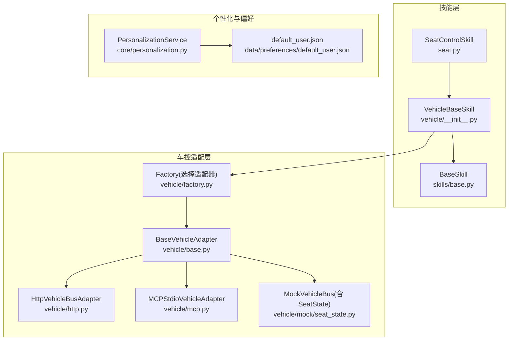
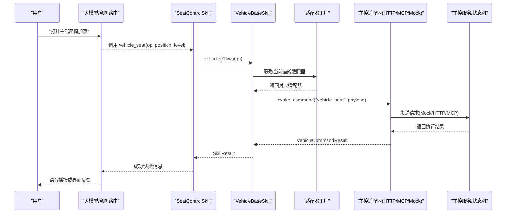
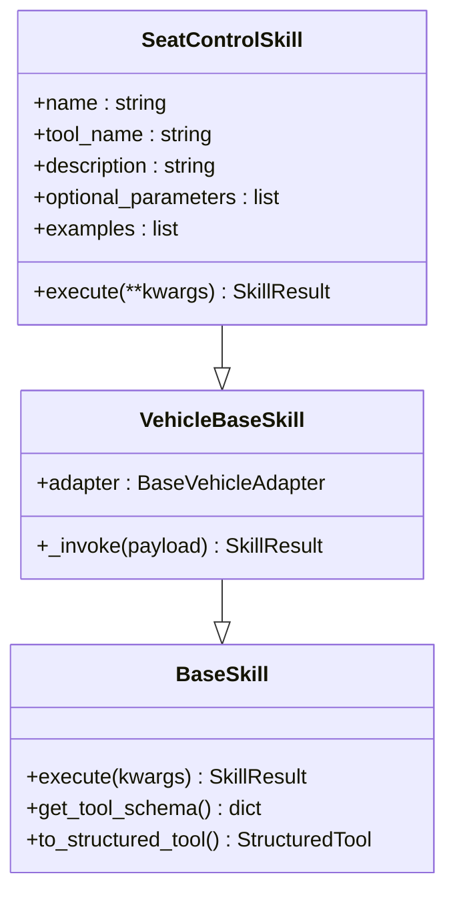
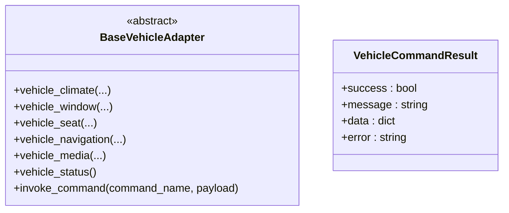
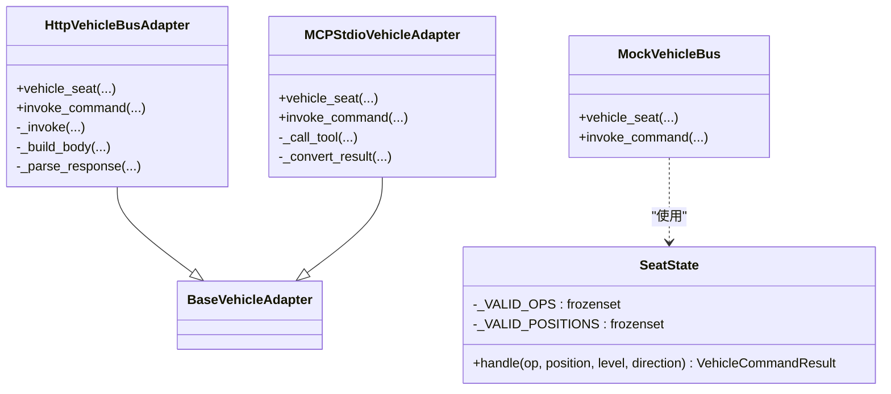
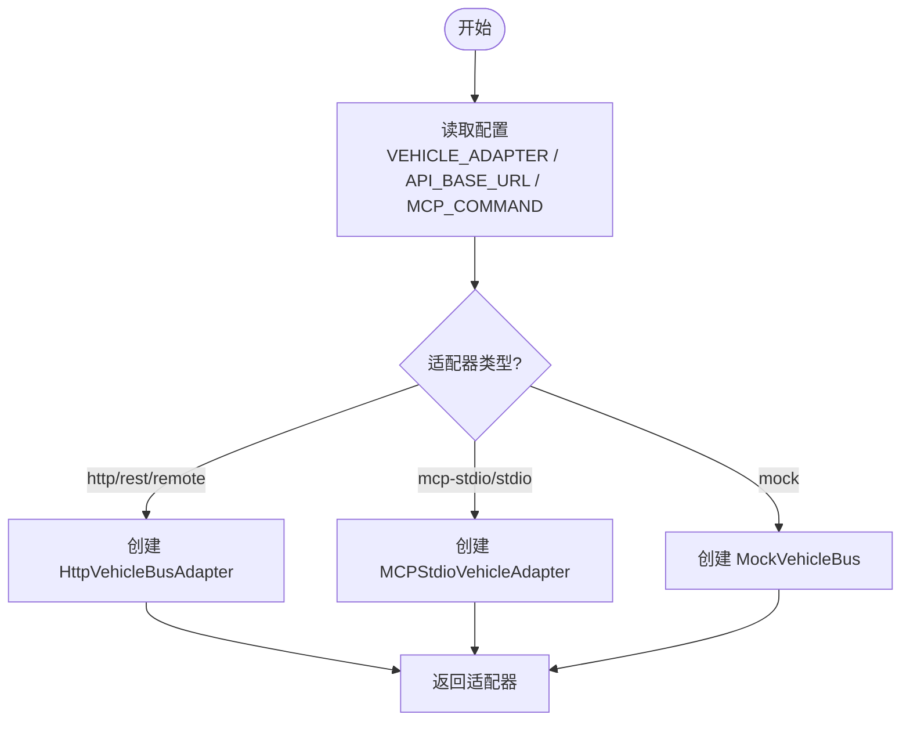
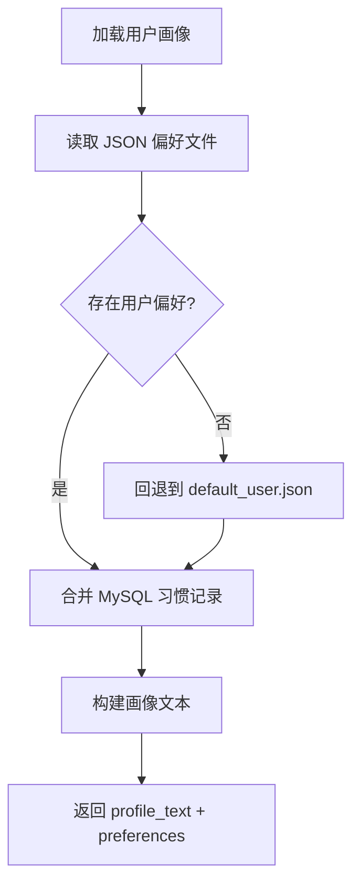
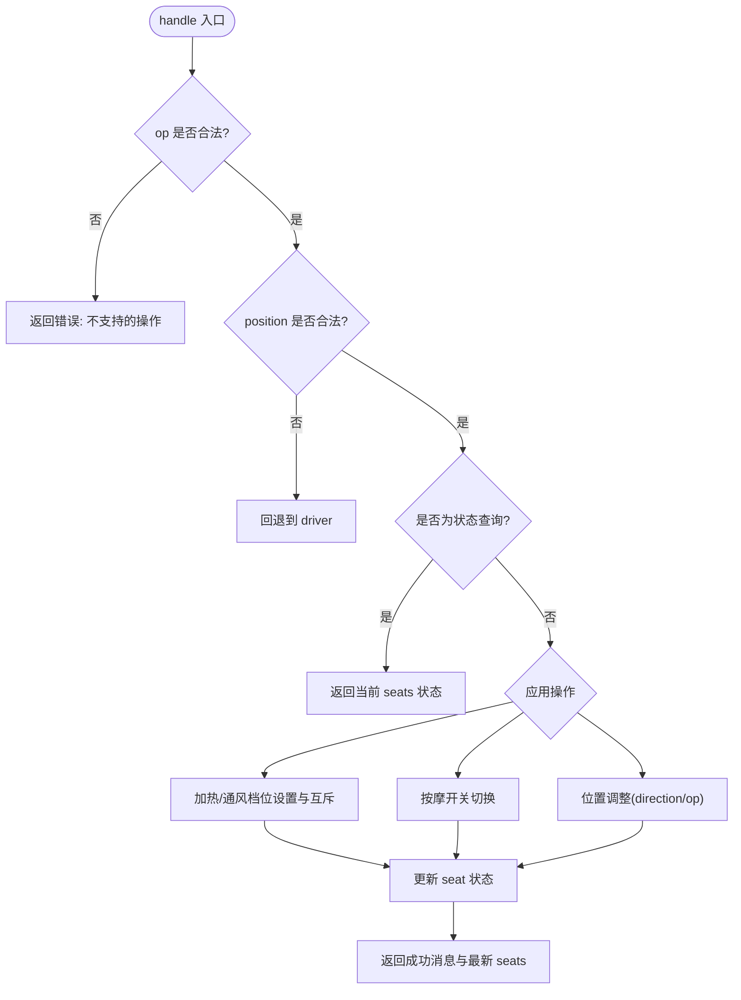
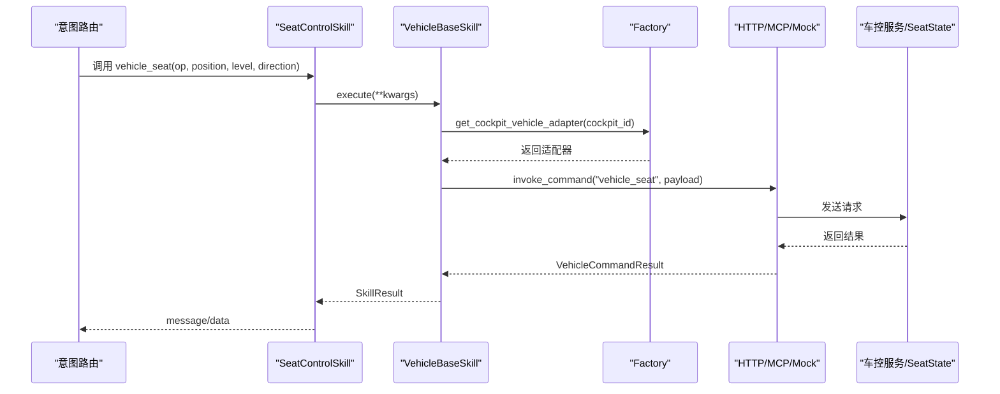
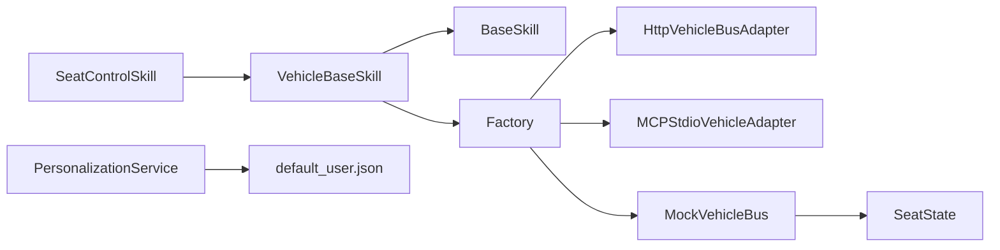

# 座椅控制技能

<cite>
**本文引用的文件**   
- [seat.py](file://backend_design/nexus/skills/vehicle/seat.py)
- [base.py](file://backend_design/nexus/skills/base.py)
- [__init__.py](file://backend_design/nexus/skills/vehicle/__init__.py)
- [seat_state.py](file://backend_design/nexus/vehicle/mock/seat_state.py)
- [base.py](file://backend_design/nexus/vehicle/base.py)
- [factory.py](file://backend_design/nexus/vehicle/factory.py)
- [http.py](file://backend_design/nexus/vehicle/http.py)
- [mcp.py](file://backend_design/nexus/vehicle/mcp.py)
- [personalization.py](file://backend_design/nexus/core/personalization.py)
- [default_user.json](file://data/preferences/default_user.json)
</cite>

## 目录
1. [简介](#简介)
2. [项目结构](#项目结构)
3. [核心组件](#核心组件)
4. [架构总览](#架构总览)
5. [详细组件分析](#详细组件分析)
6. [依赖关系分析](#依赖关系分析)
7. [性能考量](#性能考量)
8. [故障排查指南](#故障排查指南)
9. [结论](#结论)
10. [附录](#附录)

## 简介
本技术文档围绕 NexusCockpit 的“座椅控制技能”展开，系统性阐述以下能力与实现：
- 座椅位置调节（前后、方向）
- 靠背角度调整（通过方向参数扩展）
- 加热、通风、按摩功能开关与档位
- 状态查询与结果回传
- 用户偏好与记忆配置（个性化服务）
- 与座椅控制模块的通信协议与安全机制（Mock/HTTP/MCP 三种适配器）
- 语音指令示例与端到端调用流程
- 安全限制、边界校验与错误处理

该技能以“技能层 + 车控适配层”的分层设计实现，既支持本地 Mock 调试，也支持真实车控服务的 HTTP/MCP 接入。

## 项目结构
与座椅控制相关的代码主要分布在以下模块：
- 技能定义与注册：skills/vehicle/seat.py
- 车载技能基类：skills/vehicle/__init__.py
- 通用技能基类与工具化封装：skills/base.py
- 车控适配抽象与统一结果：vehicle/base.py
- 适配器工厂与多座舱隔离：vehicle/factory.py
- 具体适配器实现：vehicle/http.py、vehicle/mcp.py
- Mock 状态机与操作语义：vehicle/mock/seat_state.py
- 用户偏好与画像：core/personalization.py、data/preferences/default_user.json

图表来源 
- [seat.py:15-35](file://backend_design/nexus/skills/vehicle/seat.py#L15-L35)
- [__init__.py:21-55](file://backend_design/nexus/skills/vehicle/__init__.py#L21-L55)
- [base.py:116-264](file://backend_design/nexus/skills/base.py#L116-L264)
- [base.py:35-92](file://backend_design/nexus/vehicle/base.py#L35-L92)
- [factory.py:38-123](file://backend_design/nexus/vehicle/factory.py#L38-L123)
- [http.py:23-127](file://backend_design/nexus/vehicle/http.py#L23-L127)
- [mcp.py:167-285](file://backend_design/nexus/vehicle/mcp.py#L167-L285)
- [seat_state.py:14-91](file://backend_design/nexus/vehicle/mock/seat_state.py#L14-L91)
- [personalization.py:32-349](file://backend_design/nexus/core/personalization.py#L32-L349)
- [default_user.json:1-46](file://data/preferences/default_user.json#L1-L46)

章节来源
- [seat.py:15-35](file://backend_design/nexus/skills/vehicle/seat.py#L15-L35)
- [__init__.py:21-55](file://backend_design/nexus/skills/vehicle/__init__.py#L21-L55)
- [base.py:116-264](file://backend_design/nexus/skills/base.py#L116-L264)
- [base.py:35-92](file://backend_design/nexus/vehicle/base.py#L35-L92)
- [factory.py:38-123](file://backend_design/nexus/vehicle/factory.py#L38-L123)
- [http.py:23-127](file://backend_design/nexus/vehicle/http.py#L23-L127)
- [mcp.py:167-285](file://backend_design/nexus/vehicle/mcp.py#L167-L285)
- [seat_state.py:14-91](file://backend_design/nexus/vehicle/mock/seat_state.py#L14-L91)
- [personalization.py:32-349](file://backend_design/nexus/core/personalization.py#L32-L349)
- [default_user.json:1-46](file://data/preferences/default_user.json#L1-L46)

## 核心组件
- 座椅控制技能 SeatControlSkill
  - 定义工具名、描述、可选参数与示例输入
  - 将自然语言意图转换为结构化参数后调用车控适配器
- 车载技能基类 VehicleBaseSkill
  - 提供 _invoke 方法，统一通过 adapter.invoke_command 执行命令
  - 支持按座舱隔离获取适配器实例
- 通用技能基类 BaseSkill
  - 定义 SkillResult 统一返回结构
  - 提供 to_structured_tool() 将技能转为 LangChain StructuredTool，便于 LLM 路由
- 车控适配抽象 BaseVehicleAdapter
  - 定义 vehicle_seat 等统一接口与 invoke_command 动态分发
- 适配器实现
  - HttpVehicleBusAdapter：REST/JSON-RPC 调用真实车控服务
  - MCPStdioVehicleAdapter：通过 MCP SDK 标准 IO 与外部服务交互
  - MockVehicleBus（含 SeatState）：开发测试用状态机，模拟座椅行为
- 工厂与多座舱隔离
  - 根据配置选择适配器；Mock 模式为每个座舱创建独立实例
- 个性化与偏好
  - PersonalizationService 读取 JSON 偏好与 MySQL 习惯，生成用户画像文本
  - default_user.json 提供默认用户偏好模板

章节来源
- [seat.py:15-35](file://backend_design/nexus/skills/vehicle/seat.py#L15-L35)
- [__init__.py:21-55](file://backend_design/nexus/skills/vehicle/__init__.py#L21-L55)
- [base.py:116-264](file://backend_design/nexus/skills/base.py#L116-L264)
- [base.py:35-92](file://backend_design/nexus/vehicle/base.py#L35-L92)
- [factory.py:38-123](file://backend_design/nexus/vehicle/factory.py#L38-L123)
- [http.py:23-127](file://backend_design/nexus/vehicle/http.py#L23-L127)
- [mcp.py:167-285](file://backend_design/nexus/vehicle/mcp.py#L167-L285)
- [seat_state.py:14-91](file://backend_design/nexus/vehicle/mock/seat_state.py#L14-L91)
- [personalization.py:32-349](file://backend_design/nexus/core/personalization.py#L32-L349)
- [default_user.json:1-46](file://data/preferences/default_user.json#L1-L46)

## 架构总览
下图展示从语音指令到座椅控制的完整链路：LLM 路由 → 技能解析 → 适配器调用 → 后端执行 → 结果回传。

图表来源 
- [seat.py:33-35](file://backend_design/nexus/skills/vehicle/seat.py#L33-L35)
- [__init__.py:44-55](file://backend_design/nexus/skills/vehicle/__init__.py#L44-L55)
- [factory.py:55-84](file://backend_design/nexus/vehicle/factory.py#L55-L84)
- [http.py:65-92](file://backend_design/nexus/vehicle/http.py#L65-L92)
- [mcp.py:222-237](file://backend_design/nexus/vehicle/mcp.py#L222-L237)
- [seat_state.py:39-91](file://backend_design/nexus/vehicle/mock/seat_state.py#L39-L91)

## 详细组件分析

### 座椅控制技能 SeatControlSkill
- 作用：将自然语言意图映射为结构化参数 op、position、level、direction，并调用车控适配器。
- 关键特性：
  - tool_name = "vehicle_seat"
  - optional_parameters 包含 op、position、level、direction
  - examples 给出典型输入与参数映射
  - execute 委托给 VehicleBaseSkill._invoke

图表来源 
- [base.py:116-264](file://backend_design/nexus/skills/base.py#L116-L264)
- [__init__.py:21-55](file://backend_design/nexus/skills/vehicle/__init__.py#L21-L55)
- [seat.py:15-35](file://backend_design/nexus/skills/vehicle/seat.py#L15-L35)

章节来源
- [seat.py:15-35](file://backend_design/nexus/skills/vehicle/seat.py#L15-L35)
- [__init__.py:21-55](file://backend_design/nexus/skills/vehicle/__init__.py#L21-L55)
- [base.py:116-264](file://backend_design/nexus/skills/base.py#L116-L264)

### 车控适配抽象与统一结果
- BaseVehicleAdapter 定义了统一的车辆控制接口，包括 vehicle_seat、vehicle_climate、vehicle_window 等。
- VehicleCommandResult 作为所有适配器返回的统一结构，包含 success、message、data、error。

图表来源 
- [base.py:35-92](file://backend_design/nexus/vehicle/base.py#L35-L92)

章节来源
- [base.py:35-92](file://backend_design/nexus/vehicle/base.py#L35-L92)

### 适配器实现：HTTP、MCP、Mock
- HTTP 适配器
  - 通过 REST 或 JSON-RPC 协议调用真实车控服务
  - 支持 Authorization Bearer 认证
  - 统一解析响应为 VehicleCommandResult
- MCP 适配器
  - 使用 MCP SDK 异步会话，后台线程驱动事件循环
  - 暴露 available_tools 白名单校验
  - 将 CallToolResult 转换为 VehicleCommandResult
- Mock 适配器（SeatState）
  - 维护 seats 字典，记录 heat、cool、massage、position
  - 支持合法操作符与位置枚举校验
  - 对非法 op 直接返回错误，非法 position 回退到 driver

图表来源 
- [http.py:23-127](file://backend_design/nexus/vehicle/http.py#L23-L127)
- [mcp.py:167-285](file://backend_design/nexus/vehicle/mcp.py#L167-L285)
- [seat_state.py:14-91](file://backend_design/nexus/vehicle/mock/seat_state.py#L14-L91)
- [base.py:35-92](file://backend_design/nexus/vehicle/base.py#L35-L92)

章节来源
- [http.py:23-127](file://backend_design/nexus/vehicle/http.py#L23-L127)
- [mcp.py:167-285](file://backend_design/nexus/vehicle/mcp.py#L167-L285)
- [seat_state.py:14-91](file://backend_design/nexus/vehicle/mock/seat_state.py#L14-L91)

### 工厂与多座舱隔离
- build_vehicle_adapter：根据配置选择 HTTP/MCP/Mock 单例
- get_cockpit_vehicle_adapter：Mock 模式下为每个座舱创建独立实例，实现状态隔离；HTTP/MCP 复用无状态单例

图表来源 
- [factory.py:38-123](file://backend_design/nexus/vehicle/factory.py#L38-L123)

章节来源
- [factory.py:38-123](file://backend_design/nexus/vehicle/factory.py#L38-L123)

### 用户偏好与记忆配置
- PersonalizationService
  - 读取 data/preferences/{user_id}.json，不存在则回退到 default_user.json
  - 合并 MySQL user_habits 频次记录，构建用户画像文本注入 Prompt
  - 提供 save_preferences 持久化更新
- default_user.json
  - 包含音乐、美食、位置、空调、导航等偏好模板

图表来源 
- [personalization.py:46-198](file://backend_design/nexus/core/personalization.py#L46-L198)
- [personalization.py:297-336](file://backend_design/nexus/core/personalization.py#L297-L336)
- [default_user.json:1-46](file://data/preferences/default_user.json#L1-L46)

章节来源
- [personalization.py:46-198](file://backend_design/nexus/core/personalization.py#L46-L198)
- [personalization.py:297-336](file://backend_design/nexus/core/personalization.py#L297-L336)
- [default_user.json:1-46](file://data/preferences/default_user.json#L1-L46)

### 座椅状态机与操作语义（Mock）
- 合法操作符集合：heat_on/heat/seat_heat、heat_off/heat_stop、cool_on/cool/seat_cool、cool_off/cool_stop、massage_on/massage、massage_off/stop_massage、forward/backward/forward_adjust/back_adjust、status/query/query_status
- 合法位置集合：driver、passenger、rear_left、rear_right
- 状态字段：heat、cool、massage、position
- 处理逻辑：
  - 非法 op 直接返回错误
  - 非法 position 回退到 driver
  - 状态查询直接返回当前 seats
  - 加热/通风设置档位并互斥关闭另一功能
  - 按摩开关切换
  - 位置调整依据 direction 或 op

图表来源 
- [seat_state.py:39-91](file://backend_design/nexus/vehicle/mock/seat_state.py#L39-L91)

章节来源
- [seat_state.py:39-91](file://backend_design/nexus/vehicle/mock/seat_state.py#L39-L91)

### 端到端调用序列（HTTP/MCP/Mock）

图表来源 
- [seat.py:33-35](file://backend_design/nexus/skills/vehicle/seat.py#L33-L35)
- [__init__.py:44-55](file://backend_design/nexus/skills/vehicle/__init__.py#L44-L55)
- [factory.py:55-84](file://backend_design/nexus/vehicle/factory.py#L55-L84)
- [http.py:65-92](file://backend_design/nexus/vehicle/http.py#L65-L92)
- [mcp.py:222-237](file://backend_design/nexus/vehicle/mcp.py#L222-L237)
- [seat_state.py:39-91](file://backend_design/nexus/vehicle/mock/seat_state.py#L39-L91)

## 依赖关系分析
- 技能层依赖车控适配抽象，不关心具体实现
- 适配器工厂根据配置动态选择实现，Mock 模式支持多座舱状态隔离
- 个性化服务与偏好文件解耦，支持默认回退与数据库融合
- 统一结果 VehicleCommandResult/SkillResult 贯穿全链路，便于编排器处理

图表来源 
- [seat.py:15-35](file://backend_design/nexus/skills/vehicle/seat.py#L15-L35)
- [__init__.py:21-55](file://backend_design/nexus/skills/vehicle/__init__.py#L21-L55)
- [base.py:116-264](file://backend_design/nexus/skills/base.py#L116-L264)
- [factory.py:38-123](file://backend_design/nexus/vehicle/factory.py#L38-L123)
- [http.py:23-127](file://backend_design/nexus/vehicle/http.py#L23-L127)
- [mcp.py:167-285](file://backend_design/nexus/vehicle/mcp.py#L167-L285)
- [seat_state.py:14-91](file://backend_design/nexus/vehicle/mock/seat_state.py#L14-L91)
- [personalization.py:32-349](file://backend_design/nexus/core/personalization.py#L32-L349)
- [default_user.json:1-46](file://data/preferences/default_user.json#L1-L46)

章节来源
- [seat.py:15-35](file://backend_design/nexus/skills/vehicle/seat.py#L15-L35)
- [__init__.py:21-55](file://backend_design/nexus/skills/vehicle/__init__.py#L21-L55)
- [base.py:116-264](file://backend_design/nexus/skills/base.py#L116-L264)
- [factory.py:38-123](file://backend_design/nexus/vehicle/factory.py#L38-L123)
- [http.py:23-127](file://backend_design/nexus/vehicle/http.py#L23-L127)
- [mcp.py:167-285](file://backend_design/nexus/vehicle/mcp.py#L167-L285)
- [seat_state.py:14-91](file://backend_design/nexus/vehicle/mock/seat_state.py#L14-L91)
- [personalization.py:32-349](file://backend_design/nexus/core/personalization.py#L32-L349)
- [default_user.json:1-46](file://data/preferences/default_user.json#L1-L46)

## 性能考量
- 适配器选择与缓存
  - 单例适配器避免重复初始化；Mock 模式按座舱隔离，避免跨座舱状态污染
- 网络与超时
  - HTTP 适配器支持超时配置；MCP 适配器通过后台事件循环与工具超时控制
- 状态查询优化
  - 状态查询直接返回内存数据，减少不必要计算
- 个性化服务
  - JSON 偏好文件读取与 MySQL 习惯记录合并，失败时降级为空列表，保证鲁棒性

[本节为通用指导，不直接分析具体文件]

## 故障排查指南
- 常见错误与定位
  - 不支持的操作符：检查 op 是否在合法集合内
  - 非法位置：position 不在合法集合时会回退到 driver，确认传入值
  - HTTP 连接失败：检查 base_url、endpoint、auth_token 与网络连通性
  - MCP 工具未暴露：available_tools 白名单校验失败，确认服务端暴露的工具名
  - 非 JSON 响应：HTTP 适配器解析失败，检查后端返回格式
- 日志与诊断
  - 适配器初始化与工具列表输出
  - 个性化服务偏好文件加载失败警告
  - 车控服务调用异常堆栈

章节来源
- [seat_state.py:46-56](file://backend_design/nexus/vehicle/mock/seat_state.py#L46-L56)
- [http.py:82-92](file://backend_design/nexus/vehicle/http.py#L82-L92)
- [mcp.py:225-237](file://backend_design/nexus/vehicle/mcp.py#L225-L237)
- [personalization.py:96-101](file://backend_design/nexus/core/personalization.py#L96-L101)

## 结论
NexusCockpit 的座椅控制技能采用清晰的分层设计与统一的适配抽象，既能满足开发调试的 Mock 需求，也能平滑迁移至真实车控服务（HTTP/MCP）。通过工厂与多座舱隔离，确保不同座舱的状态独立性；结合个性化服务，可实现基于用户偏好的智能推荐与记忆配置。整体架构具备良好的可扩展性与可维护性。

[本节为总结，不直接分析具体文件]

## 附录

### 使用示例（语音指令与参数映射）
- “打开主驾座椅加热”
  - 参数：op=heat_on, position=driver, level=1
- “副驾座椅通风开到2档”
  - 参数：op=cool_on, position=passenger, level=2
- “打开按摩”
  - 参数：op=massage_on, position=driver, level=1
- “主驾座椅向前移动”
  - 参数：op=forward, position=driver, direction=forward
- “查询当前座椅状态”
  - 参数：op=status, position=driver

章节来源
- [seat.py:21-31](file://backend_design/nexus/skills/vehicle/seat.py#L21-L31)

### 安全限制与边界校验
- 操作符与位置枚举校验，非法值拒绝或回退
- 加热/通风档位范围限制（1-3），互斥关闭
- 位置调整依赖 direction 或 op，空值时使用 op
- HTTP 认证头与超时保护
- MCP 工具白名单校验

章节来源
- [seat_state.py:18-30](file://backend_design/nexus/vehicle/mock/seat_state.py#L18-L30)
- [seat_state.py:68-84](file://backend_design/nexus/vehicle/mock/seat_state.py#L68-L84)
- [http.py:72-74](file://backend_design/nexus/vehicle/http.py#L72-L74)
- [mcp.py:225-228](file://backend_design/nexus/vehicle/mcp.py#L225-L228)

### 用户偏好与记忆配置
- 读取 data/preferences/{user_id}.json，不存在则回退到 default_user.json
- 合并 MySQL user_habits 高频习惯，生成画像文本注入 Prompt
- 支持 save_preferences 持久化更新

章节来源
- [personalization.py:72-101](file://backend_design/nexus/core/personalization.py#L72-L101)
- [personalization.py:103-142](file://backend_design/nexus/core/personalization.py#L103-L142)
- [personalization.py:297-336](file://backend_design/nexus/core/personalization.py#L297-L336)
- [default_user.json:1-46](file://data/preferences/default_user.json#L1-L46)