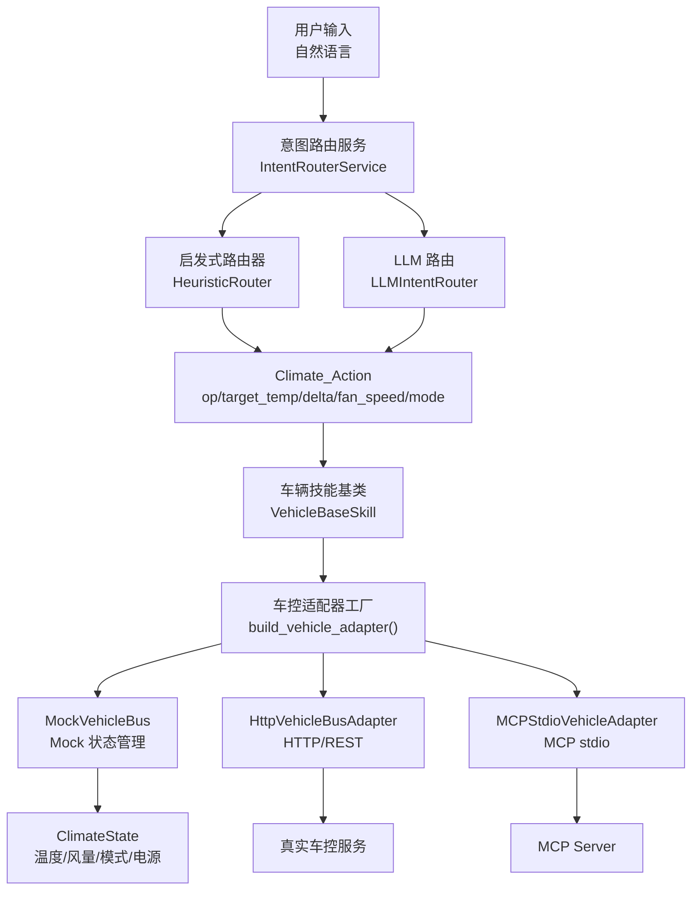
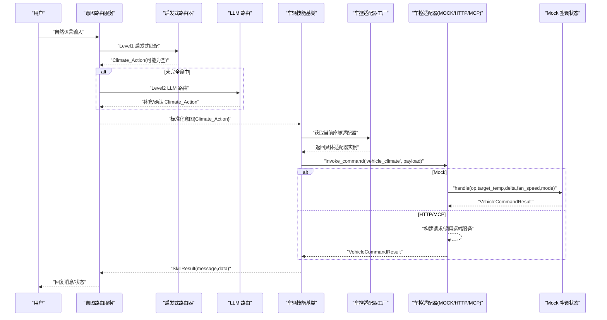
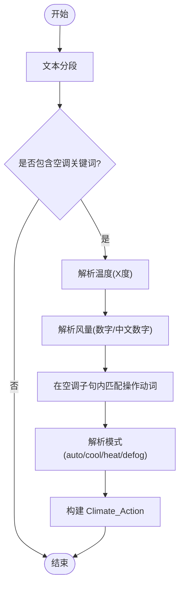
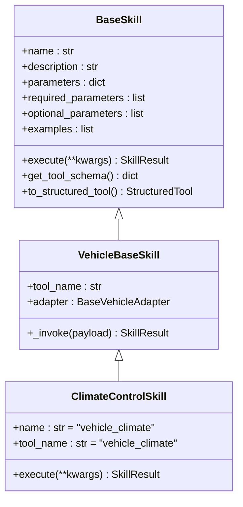
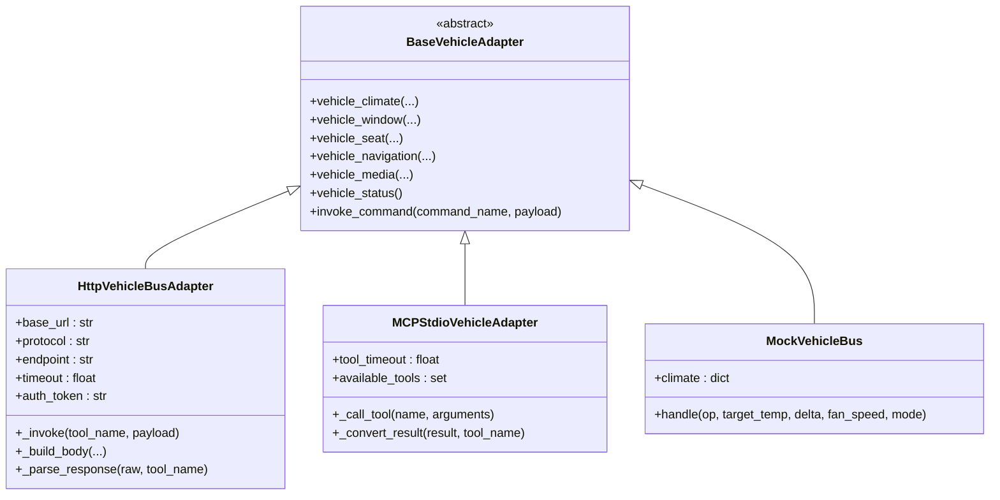
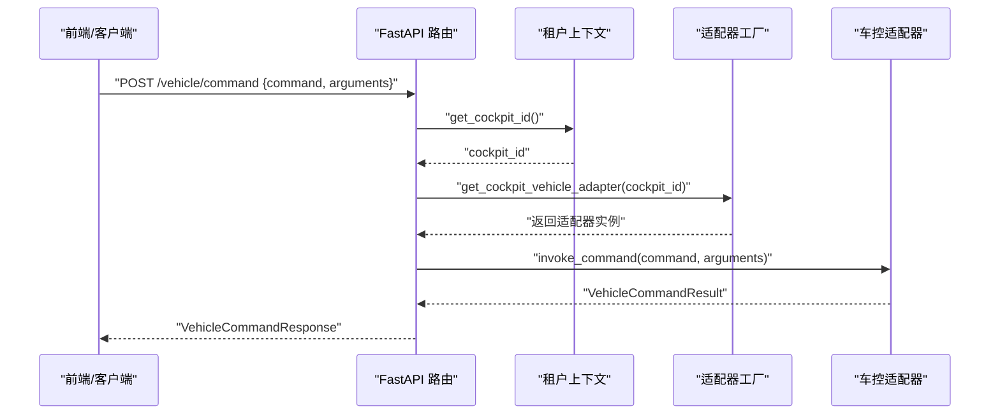
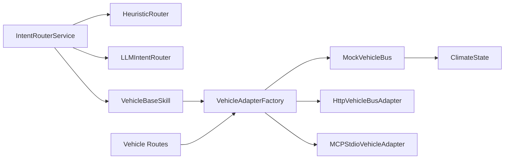

# 空调控制技能

<cite>
**本文引用的文件**   
- [backend_design/nexus/skills/vehicle/climate.py](file://backend_design/nexus/skills/vehicle/climate.py)
- [backend_design/nexus/skills/base.py](file://backend_design/nexus/skills/base.py)
- [backend_design/nexus/skills/vehicle/__init__.py](file://backend_design/nexus/skills/vehicle/__init__.py)
- [backend_design/nexus/vehicle/base.py](file://backend_design/nexus/vehicle/base.py)
- [backend_design/nexus/vehicle/mock/climate_state.py](file://backend_design/nexus/vehicle/mock/climate_state.py)
- [backend_design/nexus/vehicle/factory.py](file://backend_design/nexus/vehicle/factory.py)
- [backend_design/nexus/vehicle/http.py](file://backend_design/nexus/vehicle/http.py)
- [backend_design/nexus/vehicle/mcp.py](file://backend_design/nexus/vehicle/mcp.py)
- [backend_design/nexus/intent/router.py](file://backend_design/nexus/intent/router.py)
- [backend_design/nexus/intent/heuristic.py](file://backend_design/nexus/intent/heuristic.py)
- [backend_design/nexus/api/routes/vehicle.py](file://backend_design/nexus/api/routes/vehicle.py)
</cite>

## 目录
1. [简介](#简介)
2. [项目结构](#项目结构)
3. [核心组件](#核心组件)
4. [架构总览](#架构总览)
5. [详细组件分析](#详细组件分析)
6. [依赖关系分析](#依赖关系分析)
7. [性能考虑](#性能考虑)
8. [故障排查指南](#故障排查指南)
9. [结论](#结论)
10. [附录：使用示例与参数说明](#附录使用示例与参数说明)

## 简介
本技术文档聚焦 NexusCockpit 的“空调控制技能”，系统性阐述从自然语言到空调命令的转换逻辑、参数解析、与底层车控适配器的交互方式与数据格式，以及错误处理、状态同步和性能优化策略。读者可据此理解并扩展空调控制能力，或在不同部署模式（Mock/HTTP/MCP）下稳定集成真实车控系统。

## 项目结构
围绕空调控制的关键代码分布在以下模块：
- 意图路由层：启发式规则与 LLM 路由，将自然语言转换为结构化意图（含 Climate_Action）。
- 技能层：VehicleBaseSkill 与 ClimateControlSkill，封装工具调用与结果统一返回。
- 车控适配层：BaseVehicleAdapter 抽象接口，Mock/HTTP/MCP 三种实现。
- 状态模型：Mock 模式下模拟空调状态与操作执行。
- API 暴露：REST 接口用于直接下发车控命令或查询状态。

**图示来源** 
- [backend_design/nexus/intent/router.py:103-217](file://backend_design/nexus/intent/router.py#L103-L217)
- [backend_design/nexus/intent/heuristic.py:137-270](file://backend_design/nexus/intent/heuristic.py#L137-L270)
- [backend_design/nexus/skills/vehicle/__init__.py:21-55](file://backend_design/nexus/skills/vehicle/__init__.py#L21-L55)
- [backend_design/nexus/vehicle/factory.py:38-122](file://backend_design/nexus/vehicle/factory.py#L38-L122)
- [backend_design/nexus/vehicle/mock/climate_state.py:22-143](file://backend_design/nexus/vehicle/mock/climate_state.py#L22-L143)
- [backend_design/nexus/vehicle/http.py:23-127](file://backend_design/nexus/vehicle/http.py#L23-L127)
- [backend_design/nexus/vehicle/mcp.py:167-285](file://backend_design/nexus/vehicle/mcp.py#L167-L285)

**章节来源**
- [backend_design/nexus/intent/router.py:103-217](file://backend_design/nexus/intent/router.py#L103-L217)
- [backend_design/nexus/intent/heuristic.py:137-270](file://backend_design/nexus/intent/heuristic.py#L137-L270)
- [backend_design/nexus/skills/vehicle/__init__.py:21-55](file://backend_design/nexus/skills/vehicle/__init__.py#L21-L55)
- [backend_design/nexus/vehicle/factory.py:38-122](file://backend_design/nexus/vehicle/factory.py#L38-L122)
- [backend_design/nexus/vehicle/mock/climate_state.py:22-143](file://backend_design/nexus/vehicle/mock/climate_state.py#L22-L143)
- [backend_design/nexus/vehicle/http.py:23-127](file://backend_design/nexus/vehicle/http.py#L23-L127)
- [backend_design/nexus/vehicle/mcp.py:167-285](file://backend_design/nexus/vehicle/mcp.py#L167-L285)

## 核心组件
- 意图路由服务：三级路由（启发式→LLM→默认闲聊），输出标准意图字典，包含 Climate_Action。
- 启发式路由器：按领域关键词分段解析，提取 op、target_temp、delta、fan_speed、mode。
- 车辆技能基类：通过 adapter.invoke_command(tool_name, payload) 调用车控适配器。
- 车控适配器抽象：定义 vehicle_climate 等统一方法；Mock/HTTP/MCP 分别实现。
- Mock 空调状态：维护 temperature、fan_speed、mode、power，支持复合指令顺序执行。
- HTTP/MCP 适配器：封装请求体构建、响应解析、错误处理与超时。

**章节来源**
- [backend_design/nexus/intent/router.py:103-217](file://backend_design/nexus/intent/router.py#L103-L217)
- [backend_design/nexus/intent/heuristic.py:137-270](file://backend_design/nexus/intent/heuristic.py#L137-L270)
- [backend_design/nexus/skills/base.py:116-264](file://backend_design/nexus/skills/base.py#L116-L264)
- [backend_design/nexus/skills/vehicle/__init__.py:21-55](file://backend_design/nexus/skills/vehicle/__init__.py#L21-L55)
- [backend_design/nexus/vehicle/base.py:19-92](file://backend_design/nexus/vehicle/base.py#L19-L92)
- [backend_design/nexus/vehicle/mock/climate_state.py:22-143](file://backend_design/nexus/vehicle/mock/climate_state.py#L22-L143)
- [backend_design/nexus/vehicle/http.py:23-127](file://backend_design/nexus/vehicle/http.py#L23-L127)
- [backend_design/nexus/vehicle/mcp.py:167-285](file://backend_design/nexus/vehicle/mcp.py#L167-L285)

## 架构总览
下图展示从语音输入到空调控制的完整链路，包括多座舱隔离与适配器选择。

**图示来源** 
- [backend_design/nexus/intent/router.py:103-217](file://backend_design/nexus/intent/router.py#L103-L217)
- [backend_design/nexus/intent/heuristic.py:137-270](file://backend_design/nexus/intent/heuristic.py#L137-L270)
- [backend_design/nexus/skills/vehicle/__init__.py:44-55](file://backend_design/nexus/skills/vehicle/__init__.py#L44-L55)
- [backend_design/nexus/vehicle/factory.py:55-83](file://backend_design/nexus/vehicle/factory.py#L55-L83)
- [backend_design/nexus/vehicle/mock/climate_state.py:41-143](file://backend_design/nexus/vehicle/mock/climate_state.py#L41-L143)
- [backend_design/nexus/vehicle/http.py:65-92](file://backend_design/nexus/vehicle/http.py#L65-L92)
- [backend_design/nexus/vehicle/mcp.py:222-237](file://backend_design/nexus/vehicle/mcp.py#L222-L237)

## 详细组件分析

### 意图路由与参数解析（自然语言 → Climate_Action）
- 三级路由策略：
  - Level1 启发式：快速匹配关键词，支持复合指令分段解析，避免跨域误匹配。
  - Level1.5 复合查询增强：当仅部分命中时，触发 LLM 多意图路由补充。
  - Level2 LLM 路由：语义理解，处理复杂/模糊意图。
- 空调参数解析要点：
  - 温度：支持“X度”数字解析；无显式目标温度时，根据 op 决定 delta。
  - 风量：支持多种表达（如“风量2”“两级风速”“2档风速”），中文数字映射。
  - 模式：自动/制冷/制热/除雾/除霜等关键词映射。
  - 操作动词优先级：关闭 > 打开 > 调高 > 调低 > 设温度 > 制冷/制热。
- 输出标准意图字段：
  - Climate_Action.op / target_temp / delta / fan_speed / mode。

**图示来源** 
- [backend_design/nexus/intent/heuristic.py:137-270](file://backend_design/nexus/intent/heuristic.py#L137-L270)
- [backend_design/nexus/intent/router.py:103-217](file://backend_design/nexus/intent/router.py#L103-L217)

**章节来源**
- [backend_design/nexus/intent/heuristic.py:137-270](file://backend_design/nexus/intent/heuristic.py#L137-L270)
- [backend_design/nexus/intent/router.py:103-217](file://backend_design/nexus/intent/router.py#L103-L217)

### 车辆技能与适配器调用
- VehicleBaseSkill：
  - 通过 tenant_context 获取当前座舱 ID，动态选择对应适配器实例，实现多座舱隔离。
  - _invoke 统一调用 adapter.invoke_command(tool_name, payload)，返回 SkillResult。
- ClimateControlSkill：
  - 声明 tool_name="vehicle_climate"，描述与参数 schema，供 LLM 识别与调用。
  - execute 委托给 _invoke，透传 payload。

**图示来源** 
- [backend_design/nexus/skills/base.py:116-264](file://backend_design/nexus/skills/base.py#L116-L264)
- [backend_design/nexus/skills/vehicle/__init__.py:21-55](file://backend_design/nexus/skills/vehicle/__init__.py#L21-L55)
- [backend_design/nexus/skills/vehicle/climate.py:15-37](file://backend_design/nexus/skills/vehicle/climate.py#L15-L37)

**章节来源**
- [backend_design/nexus/skills/base.py:116-264](file://backend_design/nexus/skills/base.py#L116-L264)
- [backend_design/nexus/skills/vehicle/__init__.py:21-55](file://backend_design/nexus/skills/vehicle/__init__.py#L21-L55)
- [backend_design/nexus/skills/vehicle/climate.py:15-37](file://backend_design/nexus/skills/vehicle/climate.py#L15-L37)

### 车控适配器与状态模型
- BaseVehicleAdapter：
  - 定义 vehicle_climate/window/seat/navigation/media/status/invoke_command 等抽象方法。
- MockVehicleBus（状态模型）：
  - 维护 climate 状态（temperature、fan_speed、mode、power）。
  - handle 方法顺序执行：电源操作 → 参数设置 → 温度微调 → 状态查询。
  - 确保复合指令（如“打开空调温度22度风速1”）同时生效。
- HTTP 适配器：
  - 构建 JSON/RPC 请求体，处理超时、连接失败、非 JSON 响应等异常。
- MCP 适配器：
  - 后台线程运行异步事件循环，桥接同步接口与 MCP SDK 异步调用。
  - 支持工具白名单校验、结构化内容解析。

**图示来源** 
- [backend_design/nexus/vehicle/base.py:19-92](file://backend_design/nexus/vehicle/base.py#L19-L92)
- [backend_design/nexus/vehicle/http.py:23-127](file://backend_design/nexus/vehicle/http.py#L23-L127)
- [backend_design/nexus/vehicle/mcp.py:167-285](file://backend_design/nexus/vehicle/mcp.py#L167-L285)
- [backend_design/nexus/vehicle/mock/climate_state.py:22-143](file://backend_design/nexus/vehicle/mock/climate_state.py#L22-L143)

**章节来源**
- [backend_design/nexus/vehicle/base.py:19-92](file://backend_design/nexus/vehicle/base.py#L19-L92)
- [backend_design/nexus/vehicle/http.py:23-127](file://backend_design/nexus/vehicle/http.py#L23-L127)
- [backend_design/nexus/vehicle/mcp.py:167-285](file://backend_design/nexus/vehicle/mcp.py#L167-L285)
- [backend_design/nexus/vehicle/mock/climate_state.py:22-143](file://backend_design/nexus/vehicle/mock/climate_state.py#L22-L143)

### API 暴露与多座舱隔离
- REST 接口：
  - POST /vehicle/command：直接执行车控命令（绕过 Agent 工作流），需要 JWT 认证。
  - GET /vehicle/status：获取车辆当前状态（空调/车窗/座椅/媒体/导航/车况）。
- 多座舱隔离：
  - 从请求头 X-Cockpit-Id 或 tenant_context 获取 cockpit_id，选择对应适配器实例。
  - Mock 模式下每个座舱独立状态；HTTP/MCP 模式复用无状态单例。

**图示来源** 
- [backend_design/nexus/api/routes/vehicle.py:48-86](file://backend_design/nexus/api/routes/vehicle.py#L48-L86)
- [backend_design/nexus/vehicle/factory.py:55-83](file://backend_design/nexus/vehicle/factory.py#L55-L83)

**章节来源**
- [backend_design/nexus/api/routes/vehicle.py:48-86](file://backend_design/nexus/api/routes/vehicle.py#L48-L86)
- [backend_design/nexus/vehicle/factory.py:55-83](file://backend_design/nexus/vehicle/factory.py#L55-L83)

## 依赖关系分析
- 意图路由依赖启发式与 LLM 路由，输出标准意图。
- 技能层依赖车控适配器抽象，运行时根据配置与座舱上下文选择具体实现。
- Mock/HTTP/MCP 适配器各自负责状态管理与通信协议差异。
- API 层通过 FastAPI 暴露接口，结合认证与度量指标。

**图示来源** 
- [backend_design/nexus/intent/router.py:103-217](file://backend_design/nexus/intent/router.py#L103-L217)
- [backend_design/nexus/skills/vehicle/__init__.py:21-55](file://backend_design/nexus/skills/vehicle/__init__.py#L21-L55)
- [backend_design/nexus/vehicle/factory.py:38-122](file://backend_design/nexus/vehicle/factory.py#L38-L122)
- [backend_design/nexus/api/routes/vehicle.py:48-86](file://backend_design/nexus/api/routes/vehicle.py#L48-L86)

**章节来源**
- [backend_design/nexus/intent/router.py:103-217](file://backend_design/nexus/intent/router.py#L103-L217)
- [backend_design/nexus/skills/vehicle/__init__.py:21-55](file://backend_design/nexus/skills/vehicle/__init__.py#L21-L55)
- [backend_design/nexus/vehicle/factory.py:38-122](file://backend_design/nexus/vehicle/factory.py#L38-L122)
- [backend_design/nexus/api/routes/vehicle.py:48-86](file://backend_design/nexus/api/routes/vehicle.py#L48-L86)

## 性能考虑
- 启发式路由优先：常见车控指令毫秒级命中，避免 LLM 延迟。
- 复合查询增强：仅在部分命中时触发 LLM 多意图路由，减少不必要调用。
- 适配器选择：Mock 模式本地状态更新最快；HTTP/MCP 模式注意超时与重试策略。
- 多座舱隔离：Mock 模式每座舱独立实例，避免状态竞争；HTTP/MCP 无状态复用单例。
- 日志与度量：记录路由命中、错误与执行次数，便于监控与优化。

[本节为通用指导，不直接分析具体文件]

## 故障排查指南
- 意图路由失败：
  - 检查启发式关键词覆盖与分段解析是否正确。
  - 查看 LLM 路由置信度阈值与澄清提示。
- 参数解析异常：
  - 确认温度/风量/模式关键词匹配逻辑，避免跨域误匹配。
- 适配器调用失败：
  - HTTP：检查 base_url、endpoint、超时、鉴权 token、响应格式。
  - MCP：检查命令解析、工具白名单、会话初始化与超时。
- Mock 状态不一致：
  - 确认 handle 执行顺序（电源→参数→温度微调→状态查询）。
- API 错误：
  - 检查 JWT 认证、座舱 ID 传递、适配器初始化状态。

**章节来源**
- [backend_design/nexus/intent/heuristic.py:137-270](file://backend_design/nexus/intent/heuristic.py#L137-L270)
- [backend_design/nexus/vehicle/http.py:65-92](file://backend_design/nexus/vehicle/http.py#L65-L92)
- [backend_design/nexus/vehicle/mcp.py:222-237](file://backend_design/nexus/vehicle/mcp.py#L222-L237)
- [backend_design/nexus/vehicle/mock/climate_state.py:41-143](file://backend_design/nexus/vehicle/mock/climate_state.py#L41-L143)
- [backend_design/nexus/api/routes/vehicle.py:48-86](file://backend_design/nexus/api/routes/vehicle.py#L48-L86)

## 结论
NexusCockpit 的空调控制技能通过“意图路由→技能封装→适配器调用”的分层架构，实现了从自然语言到车控命令的稳定转换与执行。Mock/HTTP/MCP 三种适配器满足开发与生产环境的不同需求，多座舱隔离保障状态独立性。建议在生产环境中启用 HTTP/MCP 适配器，并结合日志与度量持续优化性能与可靠性。

[本节为总结性内容，不直接分析具体文件]

## 附录：使用示例与参数说明

### 自然语言示例与对应参数
- “有点冷，调高一点温度” → op=temp_up, delta=1
- “把空调调到24度” → op=set_temp, target_temp=24
- “风量调到3档” → op=set_fan, fan_speed=3
- “切到自动空调” → op=set_mode, mode=auto

**章节来源**
- [backend_design/nexus/skills/vehicle/climate.py:21-33](file://backend_design/nexus/skills/vehicle/climate.py#L21-L33)

### 参数说明
- op：操作类型（temp_up/temp_down/set_temp/set_fan/set_mode/power_on/power_off/status）
- target_temp：目标温度（整数，范围 16-30）
- delta：相对调节幅度（+1/-1）
- fan_speed：风量档位（1-7）
- mode：模式（auto/cool/heat/defog/vent/defrost）

**章节来源**
- [backend_design/nexus/skills/vehicle/climate.py:27-33](file://backend_design/nexus/skills/vehicle/climate.py#L27-L33)
- [backend_design/nexus/vehicle/mock/climate_state.py:83-96](file://backend_design/nexus/vehicle/mock/climate_state.py#L83-L96)

### 与底层车控适配器的交互
- 技能层调用：adapter.invoke_command("vehicle_climate", payload)
- Mock：本地状态更新，返回结构化结果
- HTTP：JSON/RPC 请求，解析响应体
- MCP：通过 stdio 调用远端工具，解析 structuredContent

**章节来源**
- [backend_design/nexus/skills/vehicle/__init__.py:44-55](file://backend_design/nexus/skills/vehicle/__init__.py#L44-L55)
- [backend_design/nexus/vehicle/http.py:65-92](file://backend_design/nexus/vehicle/http.py#L65-L92)
- [backend_design/nexus/vehicle/mcp.py:222-237](file://backend_design/nexus/vehicle/mcp.py#L222-L237)