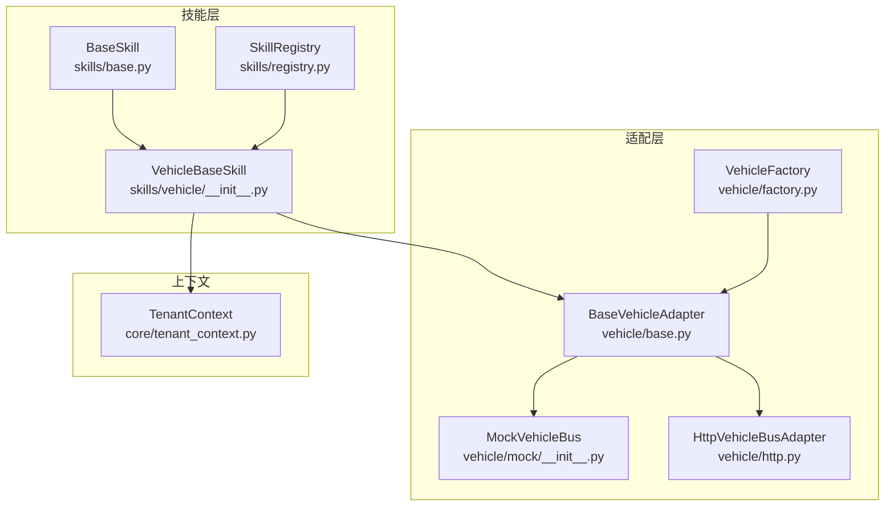
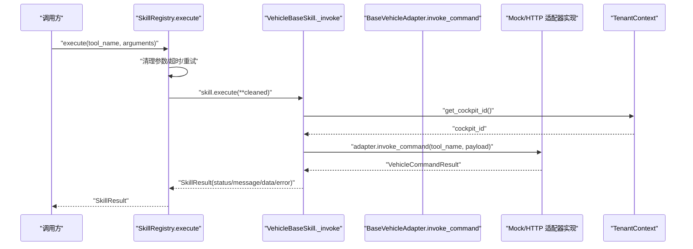
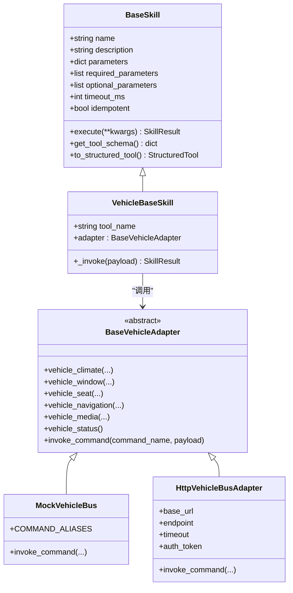
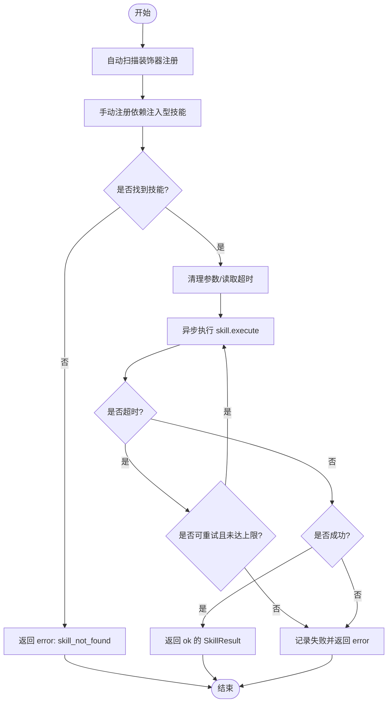
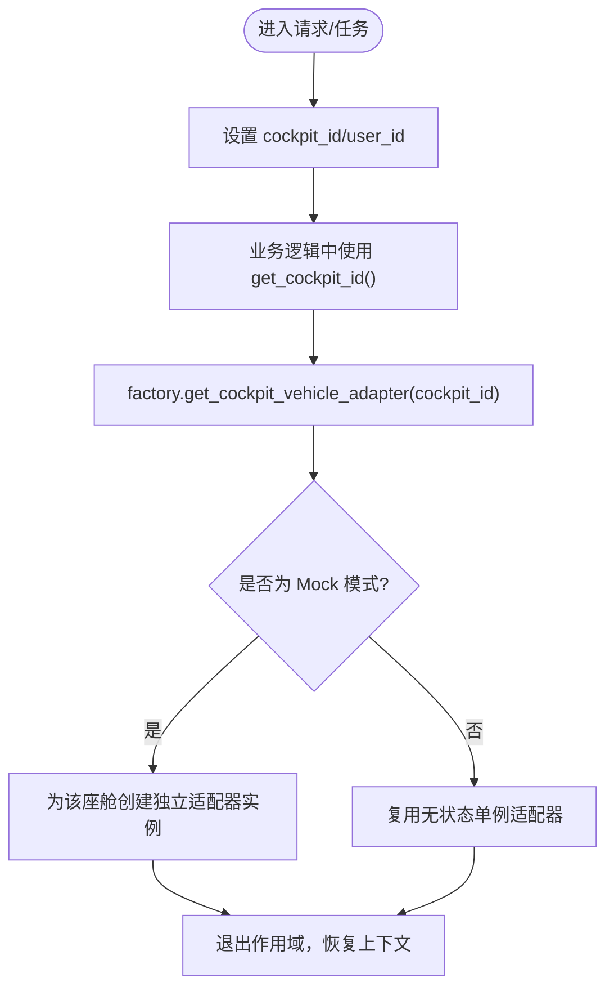
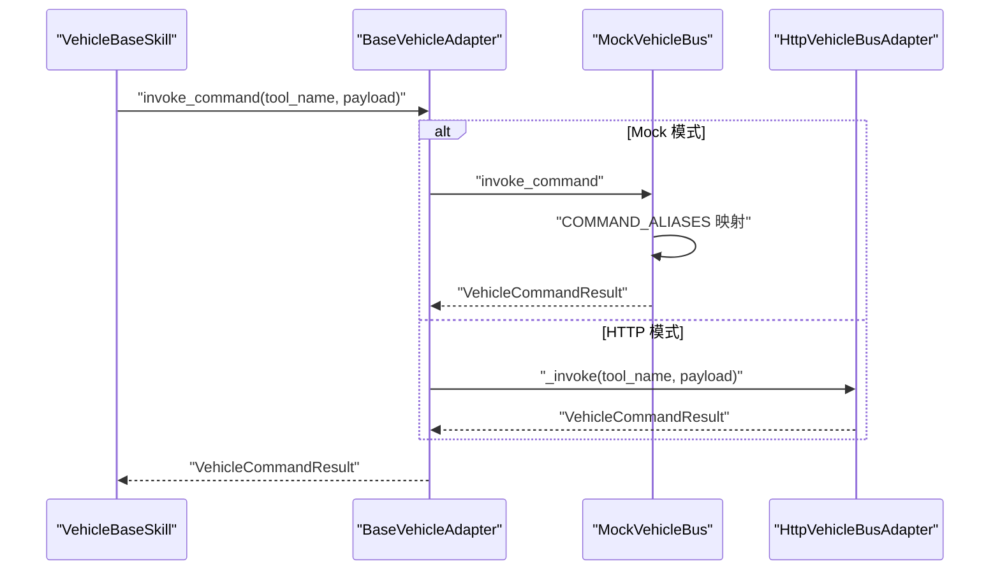
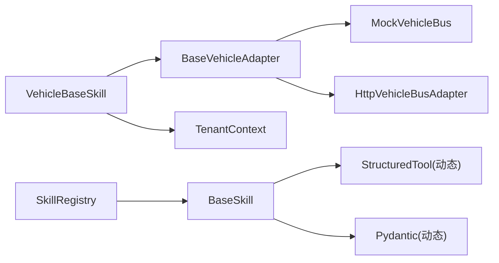

# 车控技能基类

<cite>
**本文引用的文件**   
- [backend_design/nexus/skills/base.py](file://backend_design/nexus/skills/base.py)
- [backend_design/nexus/skills/registry.py](file://backend_design/nexus/skills/registry.py)
- [backend_design/nexus/core/tenant_context.py](file://backend_design/nexus/core/tenant_context.py)
- [backend_design/nexus/skills/vehicle/__init__.py](file://backend_design/nexus/skills/vehicle/__init__.py)
- [backend_design/nexus/vehicle/base.py](file://backend_design/nexus/vehicle/base.py)
- [backend_design/nexus/vehicle/factory.py](file://backend_design/nexus/vehicle/factory.py)
- [backend_design/nexus/vehicle/mock/__init__.py](file://backend_design/nexus/vehicle/mock/__init__.py)
- [backend_design/nexus/vehicle/http.py](file://backend_design/nexus/vehicle/http.py)
- [backend_design/nexus/skills/vehicle/climate.py](file://backend_design/nexus/skills/vehicle/climate.py)
- [backend_design/nexus/skills/vehicle/media.py](file://backend_design/nexus/skills/vehicle/media.py)
- [backend_design/nexus/skills/vehicle/navigation.py](file://backend_design/nexus/skills/vehicle/navigation.py)
</cite>

## 目录
1. [简介](#简介)
2. [项目结构](#项目结构)
3. [核心组件](#核心组件)
4. [架构总览](#架构总览)
5. [详细组件分析](#详细组件分析)
6. [依赖关系分析](#依赖关系分析)
7. [性能考虑](#性能考虑)
8. [故障排查指南](#故障排查指南)
9. [结论](#结论)
10. [附录：如何继承基类开发新技能](#附录如何继承基类开发新技能)

## 简介
本技术文档聚焦于 NexusCockpit 的车控技能基类与相关适配层，系统性阐述 VehicleBaseSkill 的架构设计、多座舱隔离机制、适配器模式的应用、工具方法实现以及 _invoke 方法的执行流程。同时覆盖技能注册机制、错误处理策略与性能优化建议，并提供基于现有代码路径的示例指引，帮助开发者快速扩展新的车控技能。

## 项目结构
围绕车控技能与适配层的关键目录与文件如下：
- 技能基类与注册中心
  - skills/base.py：定义 BaseSkill、SkillResult、装饰器与结构化能力
  - skills/registry.py：SkillRegistry 自动发现与手动注册、统一执行入口
- 车控技能基类（车载）
  - skills/vehicle/__init__.py：VehicleBaseSkill 与 _invoke 实现
- 车控适配器抽象与工厂
  - vehicle/base.py：BaseVehicleAdapter 抽象接口与结果模型
  - vehicle/factory.py：按配置选择 Mock/HTTP/MCP 适配器，支持多座舱隔离
- 具体适配器实现
  - vehicle/mock/__init__.py：MockVehicleBus 门面与命令别名映射
  - vehicle/http.py：HttpVehicleBusAdapter HTTP/REST 调用封装
- 上下文隔离
  - core/tenant_context.py：基于 contextvars 的多租户（座舱）上下文管理
- 典型车控技能示例
  - skills/vehicle/climate.py、media.py、navigation.py：继承 VehicleBaseSkill 并委托 _invoke

图表来源
- [backend_design/nexus/skills/base.py:116-264](file://backend_design/nexus/skills/base.py#L116-L264)
- [backend_design/nexus/skills/registry.py:36-321](file://backend_design/nexus/skills/registry.py#L36-L321)
- [backend_design/nexus/skills/vehicle/__init__.py:21-55](file://backend_design/nexus/skills/vehicle/__init__.py#L21-L55)
- [backend_design/nexus/vehicle/base.py:35-92](file://backend_design/nexus/vehicle/base.py#L35-L92)
- [backend_design/nexus/vehicle/factory.py:38-147](file://backend_design/nexus/vehicle/factory.py#L38-L147)
- [backend_design/nexus/vehicle/mock/__init__.py:39-220](file://backend_design/nexus/vehicle/mock/__init__.py#L39-L220)
- [backend_design/nexus/vehicle/http.py:23-127](file://backend_design/nexus/vehicle/http.py#L23-L127)
- [backend_design/nexus/core/tenant_context.py:1-103](file://backend_design/nexus/core/tenant_context.py#L1-L103)

章节来源
- [backend_design/nexus/skills/base.py:1-264](file://backend_design/nexus/skills/base.py#L1-L264)
- [backend_design/nexus/skills/registry.py:1-321](file://backend_design/nexus/skills/registry.py#L1-L321)
- [backend_design/nexus/core/tenant_context.py:1-103](file://backend_design/nexus/core/tenant_context.py#L1-L103)
- [backend_design/nexus/skills/vehicle/__init__.py:1-55](file://backend_design/nexus/skills/vehicle/__init__.py#L1-L55)
- [backend_design/nexus/vehicle/base.py:1-92](file://backend_design/nexus/vehicle/base.py#L1-L92)
- [backend_design/nexus/vehicle/factory.py:1-147](file://backend_design/nexus/vehicle/factory.py#L1-L147)
- [backend_design/nexus/vehicle/mock/__init__.py:1-220](file://backend_design/nexus/vehicle/mock/__init__.py#L1-L220)
- [backend_design/nexus/vehicle/http.py:1-127](file://backend_design/nexus/vehicle/http.py#L1-L127)

## 核心组件
- BaseSkill 与 SkillResult
  - 提供统一的技能元数据描述、Tool Schema 生成、LangChain StructuredTool 转换、副作用与缓存 TTL 控制等能力
  - SkillResult 作为所有 execute() 的统一返回体，便于编排器一致处理
- SkillRegistry
  - 自动扫描 @register_skill 装饰的技能，并支持手动注册需要依赖注入的技能
  - 提供按分组查询、批量执行、超时保护与重试、指标上报等能力
- VehicleBaseSkill
  - 继承 BaseSkill，通过 adapter.invoke_command(tool_name, payload) 调用车控适配器
  - 通过 tenant_context.get_cockpit_id() 获取当前座舱 ID，并使用 factory.get_cockpit_vehicle_adapter(cockpit_id) 获取对应座舱的适配器实例，实现多座舱隔离
- BaseVehicleAdapter 与具体实现
  - 定义空调、车窗、座椅、导航、媒体、状态查询与通用 invoke_command 的抽象接口
  - MockVehicleBus 提供本地模拟状态与命令别名映射；HttpVehicleBusAdapter 通过 HTTP/REST 调用真实服务
- TenantContext
  - 使用 contextvars 在协程级别传递 cockpit_id 与 user_id，确保中间件与上层逻辑的座舱隔离

章节来源
- [backend_design/nexus/skills/base.py:92-264](file://backend_design/nexus/skills/base.py#L92-L264)
- [backend_design/nexus/skills/registry.py:36-321](file://backend_design/nexus/skills/registry.py#L36-L321)
- [backend_design/nexus/skills/vehicle/__init__.py:21-55](file://backend_design/nexus/skills/vehicle/__init__.py#L21-L55)
- [backend_design/nexus/vehicle/base.py:19-92](file://backend_design/nexus/vehicle/base.py#L19-L92)
- [backend_design/nexus/vehicle/mock/__init__.py:39-220](file://backend_design/nexus/vehicle/mock/__init__.py#L39-L220)
- [backend_design/nexus/vehicle/http.py:23-127](file://backend_design/nexus/vehicle/http.py#L23-L127)
- [backend_design/nexus/core/tenant_context.py:16-103](file://backend_design/nexus/core/tenant_context.py#L16-L103)

## 架构总览
下图展示了从技能到适配器的调用链路，以及多座舱隔离的实现方式。

图表来源
- [backend_design/nexus/skills/registry.py:222-286](file://backend_design/nexus/skills/registry.py#L222-L286)
- [backend_design/nexus/skills/vehicle/__init__.py:44-55](file://backend_design/nexus/skills/vehicle/__init__.py#L44-L55)
- [backend_design/nexus/core/tenant_context.py:35-42](file://backend_design/nexus/core/tenant_context.py#L35-L42)
- [backend_design/nexus/vehicle/base.py:90-92](file://backend_design/nexus/vehicle/base.py#L90-L92)

## 详细组件分析

### VehicleBaseSkill 与 _invoke 工作流程
- 多座舱隔离
  - 通过 tenant_context.get_cockpit_id() 获取当前座舱 ID
  - 使用 factory.get_cockpit_vehicle_adapter(cockpit_id) 获取该座舱专属适配器实例
  - 若无法获取或异常，回退到默认单例适配器
- 调用车控适配器
  - 将 tool_name 与 payload 传入 adapter.invoke_command
  - 将 VehicleCommandResult 转换为 SkillResult，设置 status、message、data、error、action、handled 等字段
- 典型子类（如 ClimateControlSkill、MediaControlSkill、NavigationSkill）仅声明 name、tool_name、parameters 等元信息，并在 execute 中直接 return self._invoke(kwargs)，避免重复逻辑

图表来源
- [backend_design/nexus/skills/base.py:116-264](file://backend_design/nexus/skills/base.py#L116-L264)
- [backend_design/nexus/skills/vehicle/__init__.py:21-55](file://backend_design/nexus/skills/vehicle/__init__.py#L21-L55)
- [backend_design/nexus/vehicle/base.py:35-92](file://backend_design/nexus/vehicle/base.py#L35-L92)
- [backend_design/nexus/vehicle/mock/__init__.py:39-220](file://backend_design/nexus/vehicle/mock/__init__.py#L39-L220)
- [backend_design/nexus/vehicle/http.py:23-127](file://backend_design/nexus/vehicle/http.py#L23-L127)

章节来源
- [backend_design/nexus/skills/vehicle/__init__.py:21-55](file://backend_design/nexus/skills/vehicle/__init__.py#L21-L55)
- [backend_design/nexus/skills/vehicle/climate.py:15-37](file://backend_design/nexus/skills/vehicle/climate.py#L15-L37)
- [backend_design/nexus/skills/vehicle/media.py:15-36](file://backend_design/nexus/skills/vehicle/media.py#L15-L36)
- [backend_design/nexus/skills/vehicle/navigation.py:15-39](file://backend_design/nexus/skills/vehicle/navigation.py#L15-L39)

### 技能注册机制与执行入口
- 自动注册
  - 使用 @register_skill(name, group, has_side_effect, cache_ttl) 标记技能类，写入全局表
  - SkillRegistry._auto_discover 扫描全局表并实例化
- 手动注册
  - 对于需要依赖注入（如 vehicle_adapter、graph_store）的技能，SkillRegistry._register_manual_skills 进行集中注册
- 执行入口
  - SkillRegistry.execute 负责参数清理、超时保护、瞬时故障重试、指标上报
  - 对未知技能返回 handled=False 的错误结果

图表来源
- [backend_design/nexus/skills/registry.py:59-167](file://backend_design/nexus/skills/registry.py#L59-L167)
- [backend_design/nexus/skills/registry.py:222-286](file://backend_design/nexus/skills/registry.py#L222-L286)

章节来源
- [backend_design/nexus/skills/base.py:50-89](file://backend_design/nexus/skills/base.py#L50-L89)
- [backend_design/nexus/skills/registry.py:36-167](file://backend_design/nexus/skills/registry.py#L36-L167)
- [backend_design/nexus/skills/registry.py:222-286](file://backend_design/nexus/skills/registry.py#L222-L286)

### 多座舱隔离机制与 tenant_context
- 上下文变量
  - 使用 contextvars 保存 cockpit_id 与 user_id，保证协程安全
- 获取与设置
  - set_cockpit_id/get_cockpit_id、set_user_id/get_user_id
  - CockpitContext 上下文管理器用于 with/async with 作用域内自动设置与恢复
- 与适配器工厂协作
  - get_cockpit_vehicle_adapter(cockpit_id) 根据配置为每个座舱创建独立 Mock 实例，或复用无状态 HTTP/MCP 单例

图表来源
- [backend_design/nexus/core/tenant_context.py:16-103](file://backend_design/nexus/core/tenant_context.py#L16-L103)
- [backend_design/nexus/vehicle/factory.py:55-83](file://backend_design/nexus/vehicle/factory.py#L55-L83)

章节来源
- [backend_design/nexus/core/tenant_context.py:26-103](file://backend_design/nexus/core/tenant_context.py#L26-L103)
- [backend_design/nexus/vehicle/factory.py:38-83](file://backend_design/nexus/vehicle/factory.py#L38-L83)

### 适配器模式与命令分发
- 抽象接口
  - BaseVehicleAdapter 定义标准方法族与通用 invoke_command
- MockVehicleBus
  - 维护各子系统状态，COMMAND_ALIASES 将多种命令名归一化为标准方法名
  - invoke_command 解析命令名后反射调用对应方法，捕获异常并返回统一结果
- HttpVehicleBusAdapter
  - 构建 JSON/RPC 请求体，发送 HTTP 请求，解析响应并映射为 VehicleCommandResult

图表来源
- [backend_design/nexus/vehicle/mock/__init__.py:194-220](file://backend_design/nexus/vehicle/mock/__init__.py#L194-L220)
- [backend_design/nexus/vehicle/http.py:65-98](file://backend_design/nexus/vehicle/http.py#L65-L98)

章节来源
- [backend_design/nexus/vehicle/base.py:35-92](file://backend_design/nexus/vehicle/base.py#L35-L92)
- [backend_design/nexus/vehicle/mock/__init__.py:39-220](file://backend_design/nexus/vehicle/mock/__init__.py#L39-L220)
- [backend_design/nexus/vehicle/http.py:23-127](file://backend_design/nexus/vehicle/http.py#L23-L127)

## 依赖关系分析
- 组件耦合
  - VehicleBaseSkill 依赖 BaseVehicleAdapter 抽象，解耦具体通信实现
  - SkillRegistry 依赖 BaseSkill 与 SkillResult，屏蔽执行细节
  - TenantContext 被 VehicleBaseSkill 与工厂函数共同使用，实现跨层隔离
- 外部依赖
  - LangChain StructuredTool（由 BaseSkill.to_structured_tool 动态创建）
  - Pydantic（动态 args_schema）
  - HTTP/JSON-RPC（HttpVehicleBusAdapter）
  - 进程间通信（MCP stdio，由工厂选择）

图表来源
- [backend_design/nexus/skills/base.py:191-258](file://backend_design/nexus/skills/base.py#L191-L258)
- [backend_design/nexus/skills/vehicle/__init__.py:21-55](file://backend_design/nexus/skills/vehicle/__init__.py#L21-L55)
- [backend_design/nexus/vehicle/base.py:35-92](file://backend_design/nexus/vehicle/base.py#L35-L92)
- [backend_design/nexus/vehicle/mock/__init__.py:39-220](file://backend_design/nexus/vehicle/mock/__init__.py#L39-L220)
- [backend_design/nexus/vehicle/http.py:23-127](file://backend_design/nexus/vehicle/http.py#L23-L127)
- [backend_design/nexus/core/tenant_context.py:16-103](file://backend_design/nexus/core/tenant_context.py#L16-L103)
- [backend_design/nexus/skills/registry.py:36-167](file://backend_design/nexus/skills/registry.py#L36-L167)

章节来源
- [backend_design/nexus/skills/base.py:191-258](file://backend_design/nexus/skills/base.py#L191-L258)
- [backend_design/nexus/skills/registry.py:36-167](file://backend_design/nexus/skills/registry.py#L36-L167)
- [backend_design/nexus/vehicle/factory.py:86-147](file://backend_design/nexus/vehicle/factory.py#L86-L147)

## 性能考虑
- 超时保护与重试
  - SkillRegistry.execute 对每个技能执行设置最小超时（至少 3s），并对网络类技能进行有限次重试，防止慢响应阻塞
- 并发批量执行
  - SkillRegistry.execute_batch 使用 asyncio.gather 并行执行多个无冲突技能，提升组合指令吞吐
- 适配器选择
  - Mock 模式为每座舱独立实例，避免状态污染；HTTP/MCP 模式复用无状态单例，降低资源占用
- 结构化 Tool 转换
  - BaseSkill.to_structured_tool 动态生成 Pydantic 模型，减少运行时校验开销

章节来源
- [backend_design/nexus/skills/registry.py:217-321](file://backend_design/nexus/skills/registry.py#L217-L321)
- [backend_design/nexus/vehicle/factory.py:55-83](file://backend_design/nexus/vehicle/factory.py#L55-L83)
- [backend_design/nexus/skills/base.py:191-258](file://backend_design/nexus/skills/base.py#L191-L258)

## 故障排查指南
- 常见错误类型
  - 未知技能：SkillRegistry.execute 返回 handled=False 与 skill_not_found
  - 超时：记录警告日志并可能触发重试
  - 连接失败：HTTP 模式下 URLError/HTTPError 被捕获并转为错误结果
  - 命令不支持：MockVehicleBus.invoke_command 返回 command_not_found
- 定位建议
  - 检查 SkillRegistry 是否正确注册目标技能
  - 确认 tenant_context 中的 cockpit_id 是否与预期一致
  - 查看适配器日志与返回值，区分 Mock/HTTP 差异
  - 对非幂等技能谨慎重试，避免副作用重复执行

章节来源
- [backend_design/nexus/skills/registry.py:222-286](file://backend_design/nexus/skills/registry.py#L222-L286)
- [backend_design/nexus/vehicle/mock/__init__.py:194-220](file://backend_design/nexus/vehicle/mock/__init__.py#L194-L220)
- [backend_design/nexus/vehicle/http.py:82-98](file://backend_design/nexus/vehicle/http.py#L82-L98)

## 结论
VehicleBaseSkill 以适配器模式为核心，结合多座舱隔离与统一的结果模型，为车控技能提供了稳定、可扩展的执行框架。SkillRegistry 提供自动化注册与健壮的执行保障，配合 TenantContext 实现请求级隔离。通过 Mock/HTTP/MCP 三种适配器，系统既能满足开发与测试需求，也能平滑对接真实车控服务。遵循本文档的设计与实践，开发者可以快速、可靠地扩展新的车控技能。

## 附录：如何继承基类开发新技能
- 步骤概览
  - 新建技能类，继承 VehicleBaseSkill
  - 声明 name、tool_name、description、parameters、required/optional_parameters、examples 等元信息
  - 在 execute 中直接 return self._invoke(kwargs)
  - 如需注册，可使用 @register_skill 装饰器或通过 SkillRegistry 手动注册
- 参考路径
  - 空调技能示例：[climate.py:15-37](file://backend_design/nexus/skills/vehicle/climate.py#L15-L37)
  - 媒体技能示例：[media.py:15-36](file://backend_design/nexus/skills/vehicle/media.py#L15-L36)
  - 导航技能示例：[navigation.py:15-39](file://backend_design/nexus/skills/vehicle/navigation.py#L15-L39)
  - 基类实现：[VehicleBaseSkill:21-55](file://backend_design/nexus/skills/vehicle/__init__.py#L21-L55)
  - 注册中心：[SkillRegistry:36-167](file://backend_design/nexus/skills/registry.py#L36-L167)
  - 装饰器：[register_skill:50-89](file://backend_design/nexus/skills/base.py#L50-L89)

章节来源
- [backend_design/nexus/skills/vehicle/climate.py:15-37](file://backend_design/nexus/skills/vehicle/climate.py#L15-L37)
- [backend_design/nexus/skills/vehicle/media.py:15-36](file://backend_design/nexus/skills/vehicle/media.py#L15-L36)
- [backend_design/nexus/skills/vehicle/navigation.py:15-39](file://backend_design/nexus/skills/vehicle/navigation.py#L15-L39)
- [backend_design/nexus/skills/vehicle/__init__.py:21-55](file://backend_design/nexus/skills/vehicle/__init__.py#L21-L55)
- [backend_design/nexus/skills/registry.py:36-167](file://backend_design/nexus/skills/registry.py#L36-L167)
- [backend_design/nexus/skills/base.py:50-89](file://backend_design/nexus/skills/base.py#L50-L89)