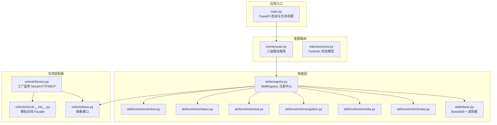
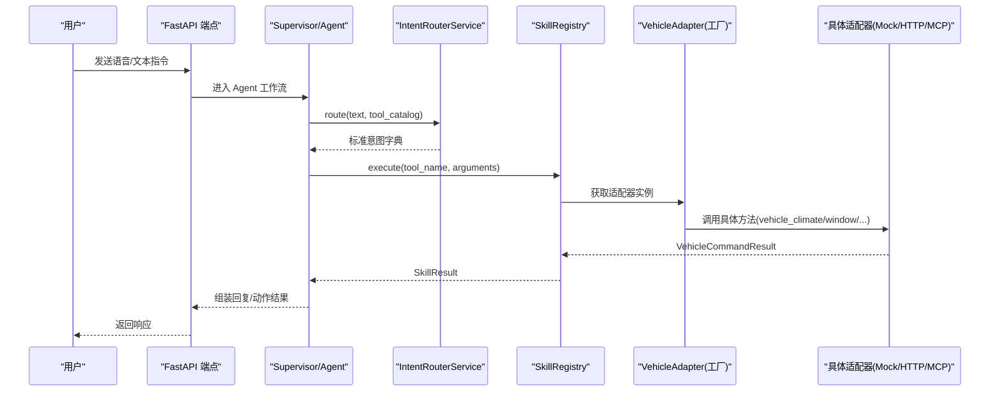
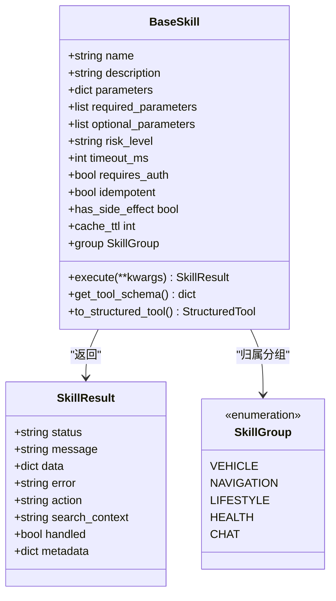
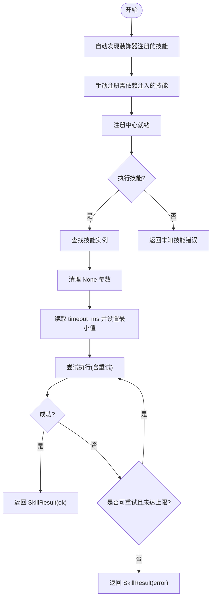
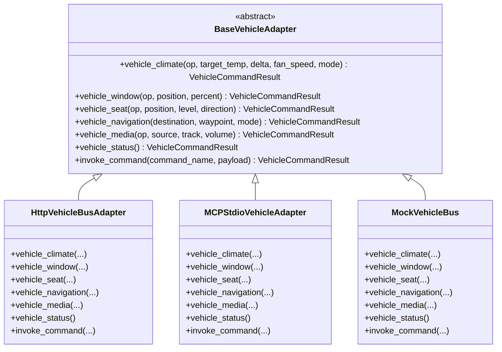
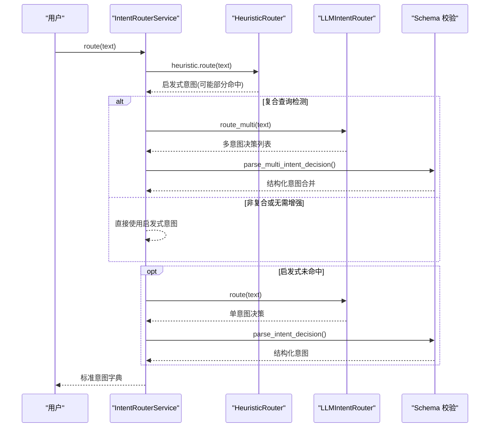
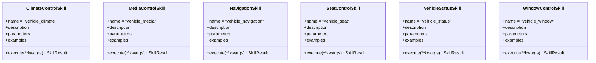
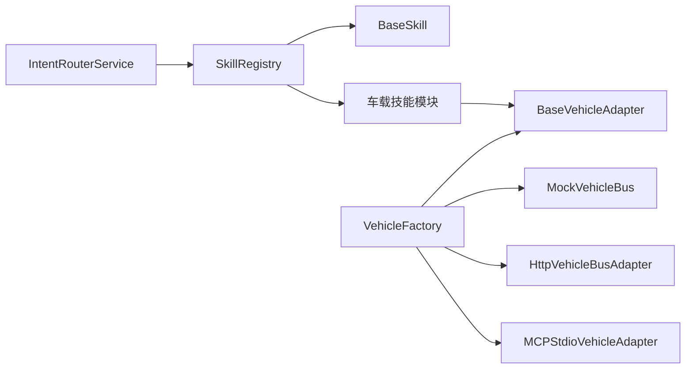

# 车控技能系统

<cite>
**本文引用的文件**   
- [backend_design/nexus/skills/base.py](file://backend_design/nexus/skills/base.py)
- [backend_design/nexus/skills/registry.py](file://backend_design/nexus/skills/registry.py)
- [backend_design/nexus/skills/__init__.py](file://backend_design/nexus/skills/__init__.py)
- [backend_design/nexus/skills/vehicle/climate.py](file://backend_design/nexus/skills/vehicle/climate.py)
- [backend_design/nexus/skills/vehicle/media.py](file://backend_design/nexus/skills/vehicle/media.py)
- [backend_design/nexus/skills/vehicle/navigation.py](file://backend_design/nexus/skills/vehicle/navigation.py)
- [backend_design/nexus/skills/vehicle/seat.py](file://backend_design/nexus/skills/vehicle/seat.py)
- [backend_design/nexus/skills/vehicle/status.py](file://backend_design/nexus/skills/vehicle/status.py)
- [backend_design/nexus/skills/vehicle/window.py](file://backend_design/nexus/skills/vehicle/window.py)
- [backend_design/nexus/vehicle/base.py](file://backend_design/nexus/vehicle/base.py)
- [backend_design/nexus/vehicle/factory.py](file://backend_design/nexus/vehicle/factory.py)
- [backend_design/nexus/vehicle/mock/__init__.py](file://backend_design/nexus/vehicle/mock/__init__.py)
- [backend_design/nexus/intent/router.py](file://backend_design/nexus/intent/router.py)
- [backend_design/nexus/intent/schema.py](file://backend_design/nexus/intent/schema.py)
- [backend_design/nexus/main.py](file://backend_design/nexus/main.py)
</cite>

## 目录
1. [引言](#引言)
2. [项目结构](#项目结构)
3. [核心组件](#核心组件)
4. [架构总览](#架构总览)
5. [详细组件分析](#详细组件分析)
6. [依赖关系分析](#依赖关系分析)
7. [性能考量](#性能考量)
8. [故障排查指南](#故障排查指南)
9. [结论](#结论)
10. [附录：开发规范、测试策略与部署指南](#附录开发规范测试策略与部署指南)

## 引言
本技术文档面向 NexusCockpit 车控技能系统，系统性阐述其架构设计、与底层适配器的解耦机制、各技能模块（空调、媒体、导航、座椅、状态、车窗）的实现与业务逻辑、技能注册中心的动态加载机制，以及自然语言到车控命令的意图解析流程。文档同时提供新技能开发与扩展的实践指引、测试策略与部署建议，帮助开发者快速上手并高质量交付。

## 项目结构
NexusCockpit 后端采用分层与模块化组织方式：
- 技能层（skills）：定义技能基类、装饰器自动注册、按领域划分的车载与非车载技能实现。
- 车控适配器层（vehicle）：抽象统一接口与多种实现（Mock/HTTP/MCP），通过工厂按需创建。
- 意图路由层（intent）：三级路由策略（启发式→LLM→默认闲聊），结构化输出校验。
- 应用入口（main）：生命周期管理、组件初始化、中间件与异常处理。

**图表来源** 
- [backend_design/nexus/main.py](file://backend_design/nexus/main.py)
- [backend_design/nexus/intent/router.py](file://backend_design/nexus/intent/router.py)
- [backend_design/nexus/intent/schema.py](file://backend_design/nexus/intent/schema.py)
- [backend_design/nexus/skills/base.py](file://backend_design/nexus/skills/base.py)
- [backend_design/nexus/skills/registry.py](file://backend_design/nexus/skills/registry.py)
- [backend_design/nexus/vehicle/base.py](file://backend_design/nexus/vehicle/base.py)
- [backend_design/nexus/vehicle/factory.py](file://backend_design/nexus/vehicle/factory.py)
- [backend_design/nexus/vehicle/mock/__init__.py](file://backend_design/nexus/vehicle/mock/__init__.py)

**章节来源**
- [backend_design/nexus/main.py](file://backend_design/nexus/main.py)

## 核心组件
- 技能基类与装饰器：定义统一的技能元数据、Tool Schema 生成、LangChain StructuredTool 转换、副作用与缓存控制等。
- 技能注册中心：扫描全局注册表、手动注入依赖、分组查询、批量执行与超时重试。
- 车控适配器抽象与工厂：统一接口隔离具体通信方式；根据配置选择 Mock/HTTP/MCP，支持多座舱状态隔离。
- 意图路由服务：启发式规则快速命中，复合查询增强，LLM 语义理解，结构化输出校验。
- 应用生命周期：在启动时完成所有组件初始化，包括 SkillRegistry、IntentRouterService、VehicleAdapter 等。

**章节来源**
- [backend_design/nexus/skills/base.py](file://backend_design/nexus/skills/base.py)
- [backend_design/nexus/skills/registry.py](file://backend_design/nexus/skills/registry.py)
- [backend_design/nexus/vehicle/base.py](file://backend_design/nexus/vehicle/base.py)
- [backend_design/nexus/vehicle/factory.py](file://backend_design/nexus/vehicle/factory.py)
- [backend_design/nexus/intent/router.py](file://backend_design/nexus/intent/router.py)
- [backend_design/nexus/intent/schema.py](file://backend_design/nexus/intent/schema.py)
- [backend_design/nexus/main.py](file://backend_design/nexus/main.py)

## 架构总览
车控技能系统以“意图路由 → 技能注册中心 → 车控适配器”为主线，形成高内聚、低耦合的架构：
- 用户输入经 IntentRouterService 进行三级路由，产出标准意图字典。
- SupervisorGraph/Agent 工作流调用 SkillRegistry.execute() 执行对应技能。
- 车载技能通过 VehicleBaseAdapter 抽象接口与具体 Mock/HTTP/MCP 实现解耦。
- 启动阶段由 main.py 统一初始化各组件，确保运行时可用性与可观测性。

**图表来源** 
- [backend_design/nexus/intent/router.py](file://backend_design/nexus/intent/router.py)
- [backend_design/nexus/skills/registry.py](file://backend_design/nexus/skills/registry.py)
- [backend_design/nexus/vehicle/factory.py](file://backend_design/nexus/vehicle/factory.py)
- [backend_design/nexus/vehicle/base.py](file://backend_design/nexus/vehicle/base.py)

## 详细组件分析

### 技能基类与装饰器（BaseSkill + register_skill）
- 职责：定义技能元数据（name/description/parameters）、Tool Schema 生成、LangChain StructuredTool 包装、副作用与缓存 TTL 控制。
- 关键点：
  - @register_skill 装饰器将类信息写入全局注册表，供 SkillRegistry 自动发现。
  - to_structured_tool() 动态构建 Pydantic args_schema，封装异步 execute() 为 StructuredTool 调用。
  - has_side_effect/cache_ttl 用于缓存安全控制（车控类通常禁止缓存）。

**图表来源** 
- [backend_design/nexus/skills/base.py](file://backend_design/nexus/skills/base.py)

**章节来源**
- [backend_design/nexus/skills/base.py](file://backend_design/nexus/skills/base.py)

### 技能注册中心（SkillRegistry）
- 职责：自动发现装饰器注册的技能、手动注入依赖、分组查询、批量执行、超时与重试保护。
- 关键点：
  - _auto_discover() 扫描全局 _SKILL_REGISTRY，实例化所有被标记的技能。
  - _register_manual_skills() 为需要依赖注入的车载/非车载技能注册实例。
  - execute() 提供超时保护与瞬时故障重试，记录指标 SKILL_EXECUTIONS。
  - execute_batch() 并行执行多个无冲突技能，适用于组合指令场景。

**图表来源** 
- [backend_design/nexus/skills/registry.py](file://backend_design/nexus/skills/registry.py)

**章节来源**
- [backend_design/nexus/skills/registry.py](file://backend_design/nexus/skills/registry.py)

### 车控适配器抽象与工厂（BaseVehicleAdapter + Factory）
- 职责：定义统一车控接口（climate/window/seat/navigation/media/status/invoke_command），按配置选择具体实现（Mock/HTTP/MCP），支持多座舱状态隔离。
- 关键点：
  - BaseVehicleAdapter 抽象出所有车控方法签名。
  - build_vehicle_adapter() 单例模式避免重复初始化；get_cockpit_vehicle_adapter(cockpit_id) 支持 Mock 模式下的座舱状态隔离。
  - _create_adapter() 根据配置选择 HTTP/MCP/Mock，并解析 MCP 命令行参数。

**图表来源** 
- [backend_design/nexus/vehicle/base.py](file://backend_design/nexus/vehicle/base.py)
- [backend_design/nexus/vehicle/factory.py](file://backend_design/nexus/vehicle/factory.py)
- [backend_design/nexus/vehicle/mock/__init__.py](file://backend_design/nexus/vehicle/mock/__init__.py)

**章节来源**
- [backend_design/nexus/vehicle/base.py](file://backend_design/nexus/vehicle/base.py)
- [backend_design/nexus/vehicle/factory.py](file://backend_design/nexus/vehicle/factory.py)

### 意图路由与自然语言到车控命令（IntentRouterService）
- 职责：将用户输入转换为标准意图字典，支持三级路由与复合查询增强。
- 关键点：
  - Level 1 启发式规则：关键词匹配，快速命中常见车控指令。
  - Level 1.5 复合查询增强：当部分意图被识别时，使用 LLM 多意图路由补充剩余需求。
  - Level 2 LLM 路由：语义理解复杂/模糊意图，返回结构化决策。
  - Level 3 默认闲聊：兜底策略。
  - schema.py 提供 Pydantic 模型验证 LLM 输出，防止格式漂移。

**图表来源** 
- [backend_design/nexus/intent/router.py](file://backend_design/nexus/intent/router.py)
- [backend_design/nexus/intent/schema.py](file://backend_design/nexus/intent/schema.py)

**章节来源**
- [backend_design/nexus/intent/router.py](file://backend_design/nexus/intent/router.py)
- [backend_design/nexus/intent/schema.py](file://backend_design/nexus/intent/schema.py)

### 车控技能模块详解
以下模块均继承自 VehicleBaseSkill（位于 skills/vehicle 包中），通过统一基类转发到适配器调用。每个技能定义了名称、描述、参数结构与示例，便于 LLM 理解与 Tool Schema 生成。

- 空调控制（ClimateControlSkill）
  - 功能：温度调节、风量设置、模式切换。
  - 参数：op/target_temp/delta/fan_speed/mode。
  - 示例：升高温度、设定目标温度、设置风量档位、切换自动模式。

- 媒体控制（MediaControlSkill）
  - 功能：播放/暂停/切歌/音量调节/音源切换。
  - 参数：op/source/track/volume。
  - 示例：播放本地音乐、下一首、音量调到指定值、切换到蓝牙。

- 导航（NavigationSkill）
  - 功能：发起导航、途经点设置、当前位置查询。
  - 参数：destination/waypoint/mode/op。
  - 示例：导航到目的地、查询当前位置、带途经点的导航。

- 座椅控制（SeatControlSkill）
  - 功能：加热/通风/按摩、位置调整。
  - 参数：op/position/level/direction。
  - 示例：主驾加热、副驾通风、按摩开启、前后移动。

- 车辆状态（VehicleStatusSkill）
  - 功能：胎压/续航/电量/油量/保养信息查询、当前位置查询。
  - 参数：op。
  - 示例：查询车辆状态、查询位置。

- 车窗控制（WindowControlSkill）
  - 功能：开合/升降/百分比位置控制。
  - 参数：op/position/percent。
  - 示例：打开全部车窗、关闭天窗、左前窗半开。

**图表来源** 
- [backend_design/nexus/skills/vehicle/climate.py](file://backend_design/nexus/skills/vehicle/climate.py)
- [backend_design/nexus/skills/vehicle/media.py](file://backend_design/nexus/skills/vehicle/media.py)
- [backend_design/nexus/skills/vehicle/navigation.py](file://backend_design/nexus/skills/vehicle/navigation.py)
- [backend_design/nexus/skills/vehicle/seat.py](file://backend_design/nexus/skills/vehicle/seat.py)
- [backend_design/nexus/skills/vehicle/status.py](file://backend_design/nexus/skills/vehicle/status.py)
- [backend_design/nexus/skills/vehicle/window.py](file://backend_design/nexus/skills/vehicle/window.py)

**章节来源**
- [backend_design/nexus/skills/vehicle/climate.py](file://backend_design/nexus/skills/vehicle/climate.py)
- [backend_design/nexus/skills/vehicle/media.py](file://backend_design/nexus/skills/vehicle/media.py)
- [backend_design/nexus/skills/vehicle/navigation.py](file://backend_design/nexus/skills/vehicle/navigation.py)
- [backend_design/nexus/skills/vehicle/seat.py](file://backend_design/nexus/skills/vehicle/seat.py)
- [backend_design/nexus/skills/vehicle/status.py](file://backend_design/nexus/skills/vehicle/status.py)
- [backend_design/nexus/skills/vehicle/window.py](file://backend_design/nexus/skills/vehicle/window.py)

### 模拟车控总线（MockVehicleBus Facade）
- 职责：对外暴露与 BaseVehicleAdapter 一致的接口，内部委托到各状态子模块（空调/车窗/座椅/导航/媒体/状态）。
- 关键点：
  - COMMAND_ALIASES 提供命令别名映射，兼容不同命名风格。
  - invoke_command() 统一入口，支持动态参数清理与异常处理。
  - vehicle_status() 聚合所有子系统数据，支持 location 查询回退到 IP 定位。

**章节来源**
- [backend_design/nexus/vehicle/mock/__init__.py](file://backend_design/nexus/vehicle/mock/__init__.py)

## 依赖关系分析
- 组件耦合：
  - IntentRouterService 依赖 SkillRegistry.get_all_tools() 提供 Tool Catalog。
  - SkillRegistry 依赖 BaseSkill 装饰器全局表与手动注册映射。
  - 车载技能依赖 VehicleBaseAdapter 抽象接口，通过工厂选择具体实现。
- 外部依赖：
  - LangChain StructuredTool 用于技能包装。
  - Pydantic 用于 LLM 输出校验。
  - Prometheus 指标采集（SKILL_EXECUTIONS、REQUEST_COUNT、REQUEST_LATENCY）。
- 潜在循环依赖：
  - 通过延迟导入与模块级单例避免循环引用。
  - SkillRegistry 的 _register_manual_skills() 仅在初始化时执行导入。

**图表来源** 
- [backend_design/nexus/intent/router.py](file://backend_design/nexus/intent/router.py)
- [backend_design/nexus/skills/registry.py](file://backend_design/nexus/skills/registry.py)
- [backend_design/nexus/skills/base.py](file://backend_design/nexus/skills/base.py)
- [backend_design/nexus/vehicle/factory.py](file://backend_design/nexus/vehicle/factory.py)
- [backend_design/nexus/vehicle/base.py](file://backend_design/nexus/vehicle/base.py)
- [backend_design/nexus/vehicle/mock/__init__.py](file://backend_design/nexus/vehicle/mock/__init__.py)

**章节来源**
- [backend_design/nexus/intent/router.py](file://backend_design/nexus/intent/router.py)
- [backend_design/nexus/skills/registry.py](file://backend_design/nexus/skills/registry.py)
- [backend_design/nexus/skills/base.py](file://backend_design/nexus/skills/base.py)
- [backend_design/nexus/vehicle/factory.py](file://backend_design/nexus/vehicle/factory.py)

## 性能考量
- 意图路由优化：
  - 启发式规则快速路径（<1ms），减少 LLM 调用开销。
  - 复合查询增强仅在必要时触发 LLM 多意图路由。
- 技能执行保护：
  - 超时保护（默认 3s 起，按技能 timeout_ms 配置）。
  - 瞬时故障重试（最多 2 次），不可幂等技能不重试。
- 并发与批处理：
  - execute_batch() 并行执行无冲突技能，提升组合指令响应速度。
- 缓存策略：
  - has_side_effect 控制缓存（车控类禁用缓存）。
  - cache_ttl 控制查询类技能缓存时间。
- 资源管理：
  - 单例适配器避免重复初始化。
  - Mock 模式下按座舱隔离状态，避免跨座舱污染。

[本节为通用性能指导，不直接分析具体文件]

## 故障排查指南
- 技能未找到：
  - 检查 SkillRegistry._skills 是否包含该技能名。
  - 确认装饰器 @register_skill 是否正确标记，或手动注册映射是否完整。
- 超时失败：
  - 检查技能 timeout_ms 配置，适当增大超时阈值。
  - 查看日志中的 skill_timeout 警告，定位外部依赖慢响应。
- LLM 路由失败：
  - 检查 tool_catalog 是否传入（SkillRegistry.get_all_tools()）。
  - 确认 LLM 客户端可用，查看 LLM_Error 字段。
- 适配器连接问题：
  - 检查 VEHICLE_ADAPTER 配置（mock/http/mcp）。
  - HTTP/MCP 模式确认 base_url/command 正确，网络可达。
- 缓存命中导致不执行：
  - 确认 has_side_effect=True 的车控技能未被错误缓存。
  - 启动时会清理旧缓存条目，确保行为一致。

**章节来源**
- [backend_design/nexus/skills/registry.py](file://backend_design/nexus/skills/registry.py)
- [backend_design/nexus/intent/router.py](file://backend_design/nexus/intent/router.py)
- [backend_design/nexus/vehicle/factory.py](file://backend_design/nexus/vehicle/factory.py)
- [backend_design/nexus/main.py](file://backend_design/nexus/main.py)

## 结论
NexusCockpit 车控技能系统通过清晰的层次划分与解耦设计，实现了高可扩展性与高可用性。技能基类与装饰器简化了开发流程，注册中心提供了动态加载与批量执行能力，车控适配器抽象屏蔽了底层差异，意图路由服务保障了自然语言到车控命令的高精度转换。结合完善的测试策略与部署指南，开发者可以快速扩展新功能并稳定运行于生产环境。

[本节为总结性内容，不直接分析具体文件]

## 附录：开发规范、测试策略与部署指南

### 技能开发规范
- 新建技能步骤：
  1. 在 skills/vehicle 下创建新模块（如 my_feature.py）。
  2. 继承 VehicleBaseSkill，定义 name/description/parameters/examples。
  3. 实现 execute(**kwargs)，调用 self._invoke(kwargs) 转发到适配器。
  4. 如需装饰器自动注册，添加 @register_skill("vehicle_my_feature", SkillGroup.VEHICLE, has_side_effect=True)。
  5. 若需依赖注入（如 vehicle_adapter），在 SkillRegistry._register_manual_skills() 中添加映射。
- 参数设计：
  - 明确必填/可选参数，提供清晰描述与示例。
  - 使用 OpenAPI 类型映射（string/number/integer/boolean/array/object）。
- 副作用与缓存：
  - 车控类操作设置 has_side_effect=True，禁用缓存。
  - 查询类操作设置合理 cache_ttl，提升性能。

**章节来源**
- [backend_design/nexus/skills/base.py](file://backend_design/nexus/skills/base.py)
- [backend_design/nexus/skills/registry.py](file://backend_design/nexus/skills/registry.py)

### 测试策略
- 单元测试：
  - 覆盖技能 execute() 分支逻辑，验证参数清理与返回值结构。
  - 模拟适配器返回，断言 SkillResult.status/message/data。
- 集成测试：
  - 使用 MockVehicleBus 验证端到端流程（意图路由 → 技能执行 → 适配器调用）。
  - 验证复合查询与多意图路由场景。
- 性能测试：
  - 压测 execute_batch() 并行执行，评估超时与重试效果。
  - 监控 Prometheus 指标（SKILL_EXECUTIONS、REQUEST_LATENCY）。

[本节为通用测试指导，不直接分析具体文件]

### 部署指南
- 环境变量配置：
  - VEHICLE_ADAPTER：选择 mock/http/mcp。
  - HTTP 模式：配置 api_base_url/api_protocol/api_endpoint/api_timeout/api_token。
  - MCP 模式：配置 mcp_command/mcp_args/mcp_workdir/mcp_validate_tools。
- 启动流程：
  - 运行 backend_design 目录下 python -m nexus.main。
  - 确认日志输出：LLM Key 加载、适配器选择、SkillRegistry 初始化。
- 监控与日志：
  - 访问 /metrics 查看 Prometheus 指标。
  - 检查结构化日志中的 Router LOG 与 Skill 执行日志。

**章节来源**
- [backend_design/nexus/main.py](file://backend_design/nexus/main.py)
- [backend_design/nexus/vehicle/factory.py](file://backend_design/nexus/vehicle/factory.py)