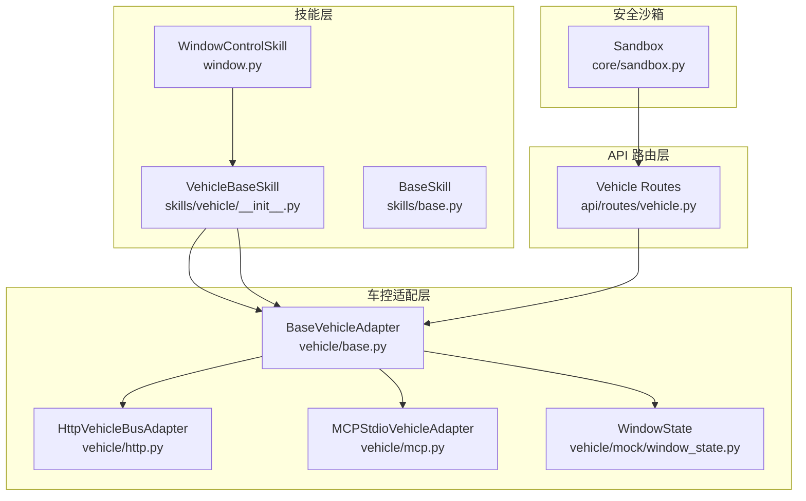
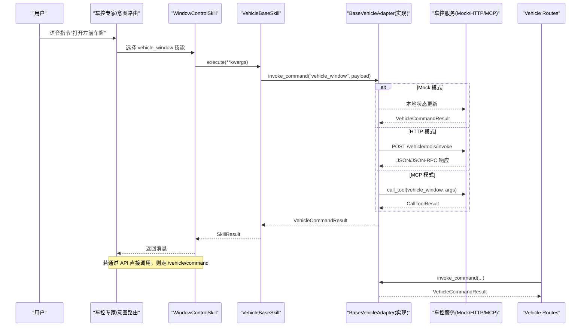
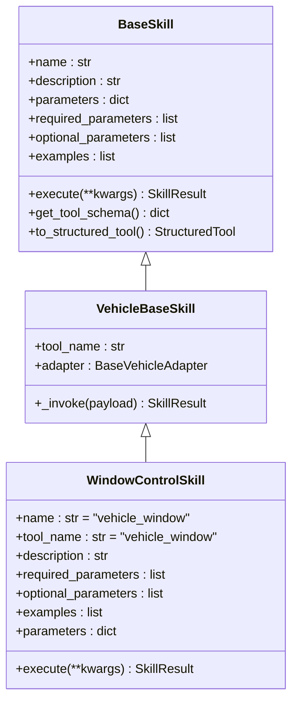
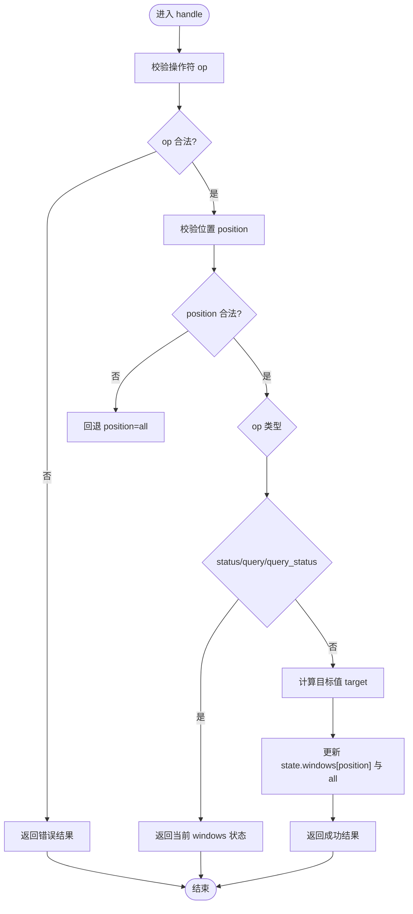
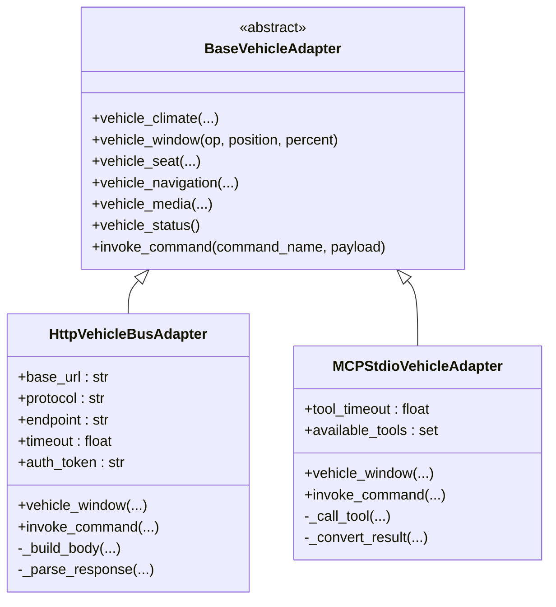
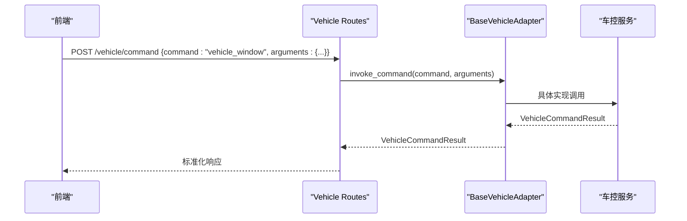
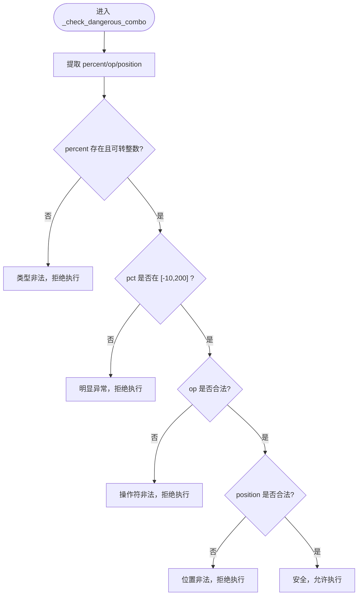
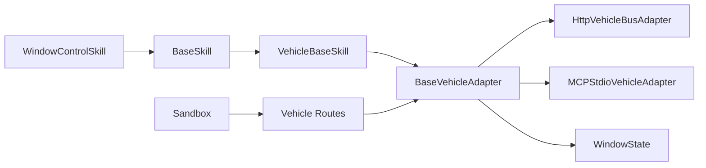

# 车窗控制技能

<cite>
**本文引用的文件**   
- [window.py](file://backend_design/nexus/skills/vehicle/window.py)
- [__init__.py](file://backend_design/nexus/skills/vehicle/__init__.py)
- [base.py](file://backend_design/nexus/skills/base.py)
- [window_state.py](file://backend_design/nexus/vehicle/mock/window_state.py)
- [base.py](file://backend_design/nexus/vehicle/base.py)
- [http.py](file://backend_design/nexus/vehicle/http.py)
- [mcp.py](file://backend_design/nexus/vehicle/mcp.py)
- [vehicle.py](file://backend_design/nexus/api/routes/vehicle.py)
- [sandbox.py](file://backend_design/nexus/core/sandbox.py)
</cite>

## 目录
1. [简介](#简介)
2. [项目结构](#项目结构)
3. [核心组件](#核心组件)
4. [架构总览](#架构总览)
5. [详细组件分析](#详细组件分析)
6. [依赖关系分析](#依赖关系分析)
7. [性能与可靠性](#性能与可靠性)
8. [故障排查指南](#故障排查指南)
9. [结论](#结论)
10. [附录：使用示例与最佳实践](#附录使用示例与最佳实践)

## 简介
本技术文档聚焦 NexusCockpit 的车窗控制技能，系统阐述从语音指令到车控执行的完整链路。内容涵盖：
- 车窗升降、天窗控制、百分比位置设置
- 车窗状态管理与位置检测（Mock 实现）
- 与车窗电机控制模块的通信协议（HTTP REST 与 MCP stdio）
- 安全机制（参数校验、危险组合拦截、审计日志）
- 校准、障碍物检测与紧急停止的实现思路与集成点
- 通过语音指令控制车窗开关的使用示例

## 项目结构
车窗控制相关代码分布在“技能层”“车控适配层”“API 路由层”和“安全沙箱”四个层次：
- 技能层：定义车窗控制技能的元数据与执行入口
- 车控适配层：统一抽象接口，提供 Mock、HTTP、MCP 三种实现
- API 路由层：暴露 REST 接口，支持直接调用车控命令与查询状态
- 安全沙箱：对高危指令进行参数范围校验、频率限制与审计记录

**图表来源** 
- [window.py:15-34](file://backend_design/nexus/skills/vehicle/window.py#L15-L34)
- [__init__.py:21-55](file://backend_design/nexus/skills/vehicle/__init__.py#L21-L55)
- [base.py:116-175](file://backend_design/nexus/skills/base.py#L116-L175)
- [base.py:35-92](file://backend_design/nexus/vehicle/base.py#L35-L92)
- [http.py:23-68](file://backend_design/nexus/vehicle/http.py#L23-L68)
- [mcp.py:167-224](file://backend_design/nexus/vehicle/mcp.py#L167-L224)
- [window_state.py:12-89](file://backend_design/nexus/vehicle/mock/window_state.py#L12-L89)
- [vehicle.py:48-108](file://backend_design/nexus/api/routes/vehicle.py#L48-L108)
- [sandbox.py:209-332](file://backend_design/nexus/core/sandbox.py#L209-L332)

**章节来源**
- [window.py:15-34](file://backend_design/nexus/skills/vehicle/window.py#L15-L34)
- [__init__.py:21-55](file://backend_design/nexus/skills/vehicle/__init__.py#L21-L55)
- [base.py:116-175](file://backend_design/nexus/skills/base.py#L116-L175)
- [base.py:35-92](file://backend_design/nexus/vehicle/base.py#L35-L92)
- [http.py:23-68](file://backend_design/nexus/vehicle/http.py#L23-L68)
- [mcp.py:167-224](file://backend_design/nexus/vehicle/mcp.py#L167-L224)
- [window_state.py:12-89](file://backend_design/nexus/vehicle/mock/window_state.py#L12-L89)
- [vehicle.py:48-108](file://backend_design/nexus/api/routes/vehicle.py#L48-L108)
- [sandbox.py:209-332](file://backend_design/nexus/core/sandbox.py#L209-L332)

## 核心组件
- 车窗控制技能 WindowControlSkill
  - 定义工具名、描述、参数与示例，execute 委托给 VehicleBaseSkill._invoke
- 车载技能基类 VehicleBaseSkill
  - 根据座舱上下文获取对应车控适配器，统一封装 invoke_command 调用并返回 SkillResult
- 车控适配层 BaseVehicleAdapter
  - 定义 vehicle_window 等抽象方法，以及通用 invoke_command
- HTTP 适配器 HttpVehicleBusAdapter
  - 通过 REST JSON 或 JSON-RPC 协议调用后端服务，解析响应为 VehicleCommandResult
- MCP 适配器 MCPStdioVehicleAdapter
  - 通过 MCP SDK 异步会话桥接同步接口，将结果转换为 VehicleCommandResult
- Mock 状态管理 WindowState
  - 维护各车窗开合百分比，处理 open/close/set_position 等操作，返回当前状态

**章节来源**
- [window.py:15-34](file://backend_design/nexus/skills/vehicle/window.py#L15-L34)
- [__init__.py:21-55](file://backend_design/nexus/skills/vehicle/__init__.py#L21-L55)
- [base.py:35-92](file://backend_design/nexus/vehicle/base.py#L35-L92)
- [http.py:23-68](file://backend_design/nexus/vehicle/http.py#L23-L68)
- [mcp.py:167-224](file://backend_design/nexus/vehicle/mcp.py#L167-L224)
- [window_state.py:12-89](file://backend_design/nexus/vehicle/mock/window_state.py#L12-L89)

## 架构总览
车窗控制的端到端流程如下：
- 用户语音指令经意图识别后，由车控专家选择 vehicle_window 技能
- 技能实例化并调用 VehicleBaseSkill._invoke，根据座舱上下文获取适配器
- 适配器将命令转发至具体实现（Mock/HTTP/MCP），返回 VehicleCommandResult
- API 路由层提供 /vehicle/command 与 /vehicle/status 供前端直接调用
- 安全沙箱在调用前进行参数校验与危险组合检查，并对高危操作审计

**图表来源** 
- [window.py:32-34](file://backend_design/nexus/skills/vehicle/window.py#L32-L34)
- [__init__.py:44-55](file://backend_design/nexus/skills/vehicle/__init__.py#L44-L55)
- [base.py:54-57](file://backend_design/nexus/vehicle/base.py#L54-L57)
- [http.py:50-68](file://backend_design/nexus/vehicle/http.py#L50-L68)
- [mcp.py:207-224](file://backend_design/nexus/vehicle/mcp.py#L207-L224)
- [vehicle.py:48-108](file://backend_design/nexus/api/routes/vehicle.py#L48-L108)

## 详细组件分析

### 车窗控制技能 WindowControlSkill
- 职责：声明工具名、描述、参数与示例；execute 委托给 VehicleBaseSkill._invoke
- 参数：op（open/close/set_position/up/down）、position（all/front_left/front_right/rear_left/rear_right/sunroof）、percent（0-100）
- 行为：将参数原样传递给适配器，最终由适配器决定执行策略（Mock/HTTP/MCP）

**图表来源** 
- [base.py:116-175](file://backend_design/nexus/skills/base.py#L116-L175)
- [__init__.py:21-55](file://backend_design/nexus/skills/vehicle/__init__.py#L21-L55)
- [window.py:15-34](file://backend_design/nexus/skills/vehicle/window.py#L15-L34)

**章节来源**
- [window.py:15-34](file://backend_design/nexus/skills/vehicle/window.py#L15-L34)
- [__init__.py:21-55](file://backend_design/nexus/skills/vehicle/__init__.py#L21-L55)
- [base.py:116-175](file://backend_design/nexus/skills/base.py#L116-L175)

### 车窗状态与运动控制逻辑（Mock）
- 合法操作符：open/close/set/set_position/move_to/up/down/raise/lower/status/query/query_status
- 合法位置：all/front_left/front_right/rear_left/rear_right/sunroof
- 状态模型：维护每个位置的百分比，all 字段为其他位置的最大值
- 处理流程：
  - 校验 op，非法直接返回错误
  - 校验 position，非法回退到 all
  - 根据 op 计算目标值（open/up/raise→100；close/down/lower→0；set_position/set/move_to→percent 或当前位置）
  - 更新状态并返回结果

**图表来源** 
- [window_state.py:38-89](file://backend_design/nexus/vehicle/mock/window_state.py#L38-L89)

**章节来源**
- [window_state.py:12-89](file://backend_design/nexus/vehicle/mock/window_state.py#L12-L89)

### 车控适配层与通信协议
- BaseVehicleAdapter：定义 vehicle_window 与 invoke_command 抽象接口
- HttpVehicleBusAdapter：
  - 支持 REST JSON 与 JSON-RPC 两种协议
  - 构建请求体、设置超时与鉴权头，捕获 HTTP/网络异常并返回结构化结果
- MCPStdioVehicleAdapter：
  - 后台线程运行 MCP SDK 异步会话，同步桥接 call_tool
  - 将 CallToolResult 转换为 VehicleCommandResult，提取文本与结构化内容

**图表来源** 
- [base.py:35-92](file://backend_design/nexus/vehicle/base.py#L35-L92)
- [http.py:23-68](file://backend_design/nexus/vehicle/http.py#L23-L68)
- [mcp.py:167-224](file://backend_design/nexus/vehicle/mcp.py#L167-L224)

**章节来源**
- [base.py:35-92](file://backend_design/nexus/vehicle/base.py#L35-L92)
- [http.py:23-68](file://backend_design/nexus/vehicle/http.py#L23-L68)
- [mcp.py:167-224](file://backend_design/nexus/vehicle/mcp.py#L167-L224)

### API 路由与多座舱隔离
- /vehicle/command：直接执行车控命令，绕过 Agent 工作流，适合前端面板按钮调用
- /vehicle/status：获取车辆当前状态，包含空调、车窗、座椅、媒体、导航、车况
- 多座舱隔离：通过 X-Cockpit-Id 或 tenant_context 获取 cockpit_id，按座舱独立适配器实例

**图表来源** 
- [vehicle.py:48-108](file://backend_design/nexus/api/routes/vehicle.py#L48-L108)

**章节来源**
- [vehicle.py:48-108](file://backend_design/nexus/api/routes/vehicle.py#L48-L108)

### 安全沙箱与防夹保护
- 参数范围校验：
  - 车窗百分比：期望整数，默认安全范围 0-100；极端值（<-10 或 >200）拒绝执行
  - 操作符与位置枚举校验，非法值阻断
- 危险组合检查：
  - 针对车窗的 op、position、percent 进行联合校验，防止误操作
- 审计日志：
  - 对高危指令（含车窗）执行结果进行审计，持久化到数据库（可选）

**图表来源** 
- [sandbox.py:285-332](file://backend_design/nexus/core/sandbox.py#L285-L332)

**章节来源**
- [sandbox.py:209-332](file://backend_design/nexus/core/sandbox.py#L209-L332)

## 依赖关系分析
- 技能层依赖车控适配层抽象接口，解耦具体通信方式
- 车控适配层实现 Mock、HTTP、MCP，便于在不同部署环境切换
- API 路由层通过适配器统一调用，保证多座舱隔离
- 安全沙箱在调用前进行参数校验与审计，保障系统安全

**图表来源** 
- [window.py:15-34](file://backend_design/nexus/skills/vehicle/window.py#L15-L34)
- [base.py:116-175](file://backend_design/nexus/skills/base.py#L116-L175)
- [__init__.py:21-55](file://backend_design/nexus/skills/vehicle/__init__.py#L21-L55)
- [base.py:35-92](file://backend_design/nexus/vehicle/base.py#L35-L92)
- [http.py:23-68](file://backend_design/nexus/vehicle/http.py#L23-L68)
- [mcp.py:167-224](file://backend_design/nexus/vehicle/mcp.py#L167-L224)
- [window_state.py:12-89](file://backend_design/nexus/vehicle/mock/window_state.py#L12-L89)
- [vehicle.py:48-108](file://backend_design/nexus/api/routes/vehicle.py#L48-L108)
- [sandbox.py:209-332](file://backend_design/nexus/core/sandbox.py#L209-L332)

**章节来源**
- [window.py:15-34](file://backend_design/nexus/skills/vehicle/window.py#L15-L34)
- [base.py:116-175](file://backend_design/nexus/skills/base.py#L116-L175)
- [__init__.py:21-55](file://backend_design/nexus/skills/vehicle/__init__.py#L21-L55)
- [base.py:35-92](file://backend_design/nexus/vehicle/base.py#L35-L92)
- [http.py:23-68](file://backend_design/nexus/vehicle/http.py#L23-L68)
- [mcp.py:167-224](file://backend_design/nexus/vehicle/mcp.py#L167-L224)
- [window_state.py:12-89](file://backend_design/nexus/vehicle/mock/window_state.py#L12-L89)
- [vehicle.py:48-108](file://backend_design/nexus/api/routes/vehicle.py#L48-L108)
- [sandbox.py:209-332](file://backend_design/nexus/core/sandbox.py#L209-L332)

## 性能与可靠性
- 超时与重试：
  - HTTP 适配器支持配置超时时间，避免长时间阻塞
  - MCP 适配器通过后台事件循环与超时控制，确保调用及时返回
- 连接与异常处理：
  - HTTP 适配器捕获 HTTPError、URLError 与通用异常，返回结构化错误信息
  - MCP 适配器捕获调用异常并转换为标准结果
- 多座舱隔离：
  - 基于 cockpit_id 的适配器实例隔离，避免跨座舱状态污染
- 建议优化：
  - 在高并发场景下引入连接池与缓存（如最近一次状态）
  - 对频繁操作增加限流与去抖，减少重复指令

[本节为通用指导，不直接分析具体文件]

## 故障排查指南
- 常见错误与定位：
  - 无法连接真实车控服务：检查 HTTP 地址、端口、网络连通性与鉴权 Token
  - MCP 初始化超时：确认 MCP 服务进程启动正常，命令与环境变量正确
  - 车窗百分比非法：检查输入是否为整数且在安全范围内
  - 操作符或位置非法：核对 op 与 position 是否在合法枚举内
- 调试步骤：
  - 查看适配器返回的 VehicleCommandResult 中的 message 与 error 字段
  - 启用日志输出，关注 HTTP 响应体与 MCP CallToolResult
  - 通过 /vehicle/status 接口验证当前车窗状态是否与预期一致
- 安全沙箱审计：
  - 查看审计日志，确认高危指令的执行情况与参数

**章节来源**
- [http.py:82-92](file://backend_design/nexus/vehicle/http.py#L82-L92)
- [mcp.py:225-237](file://backend_design/nexus/vehicle/mcp.py#L225-L237)
- [sandbox.py:285-332](file://backend_design/nexus/core/sandbox.py#L285-L332)
- [vehicle.py:48-108](file://backend_design/nexus/api/routes/vehicle.py#L48-L108)

## 结论
NexusCockpit 的车窗控制技能通过清晰的层次化设计与统一的适配层抽象，实现了从语音指令到车控执行的稳定链路。Mock 状态管理提供了快速开发与测试能力，HTTP 与 MCP 适配器覆盖不同部署场景，安全沙箱确保指令执行的安全性与可审计性。未来可在防夹保护、位置校准与紧急停止方面进一步扩展，结合传感器反馈与更严格的控制策略提升安全性与用户体验。

[本节为总结性内容，不直接分析具体文件]

## 附录：使用示例与最佳实践
- 语音指令示例：
  - “打开车窗” → op=open, position=all, percent=100
  - “关闭天窗” → op=close, position=sunroof, percent=0
  - “把左前窗调到一半” → op=set_position, position=front_left, percent=50
- 最佳实践：
  - 始终校验 percent 为整数并在安全范围内
  - 明确指定 position，避免误操作其他车窗
  - 在高频操作中增加去抖与限流，避免重复指令
  - 通过 /vehicle/status 定期刷新状态，确保 UI 与真实状态一致
  - 在生产环境优先使用 HTTP/MCP 适配器，Mock 仅用于开发测试

[本节为概念性说明，不直接分析具体文件]