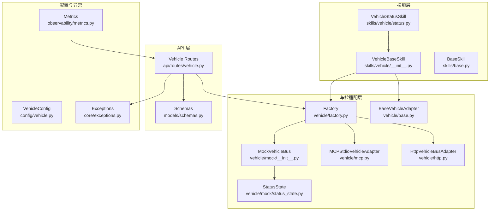
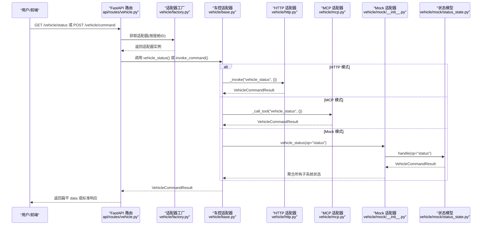
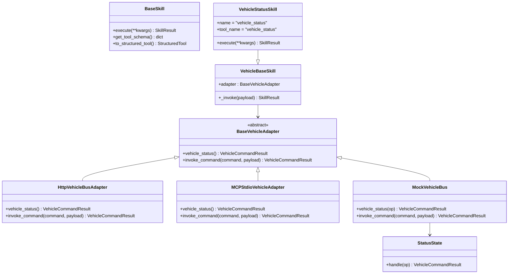
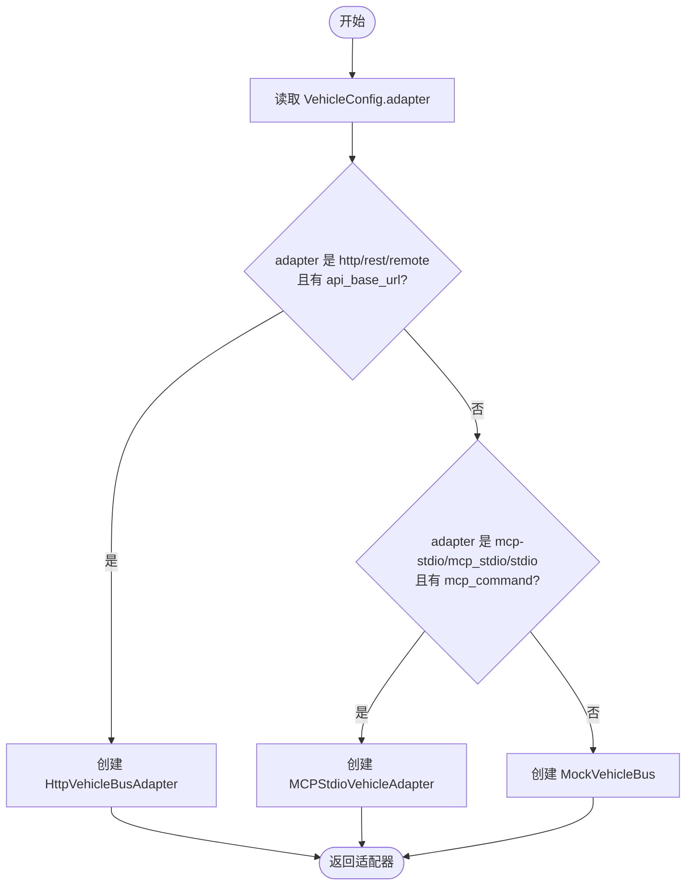
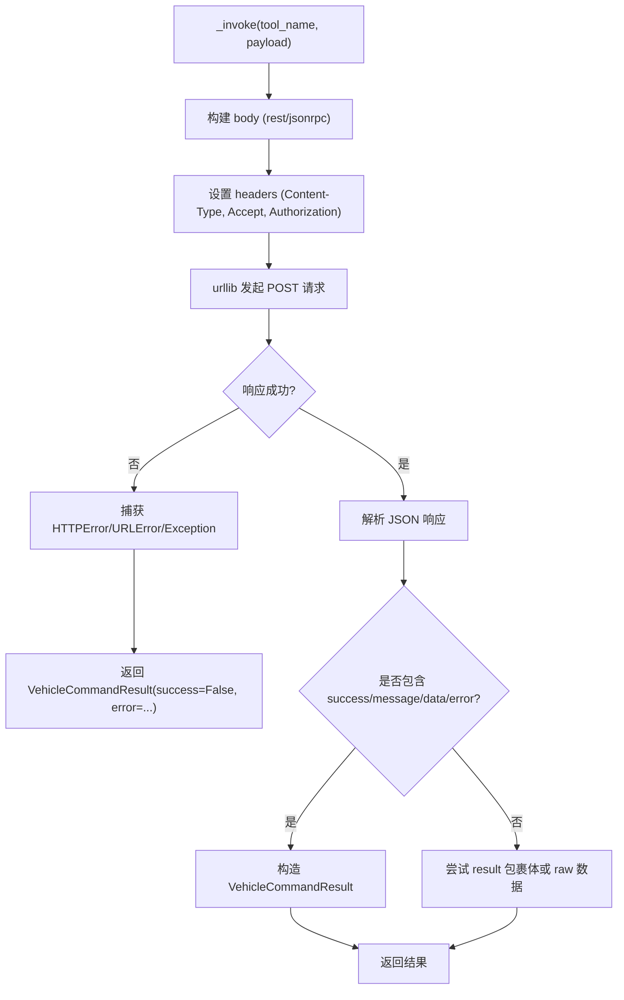
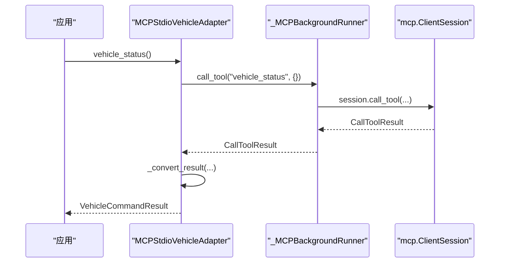
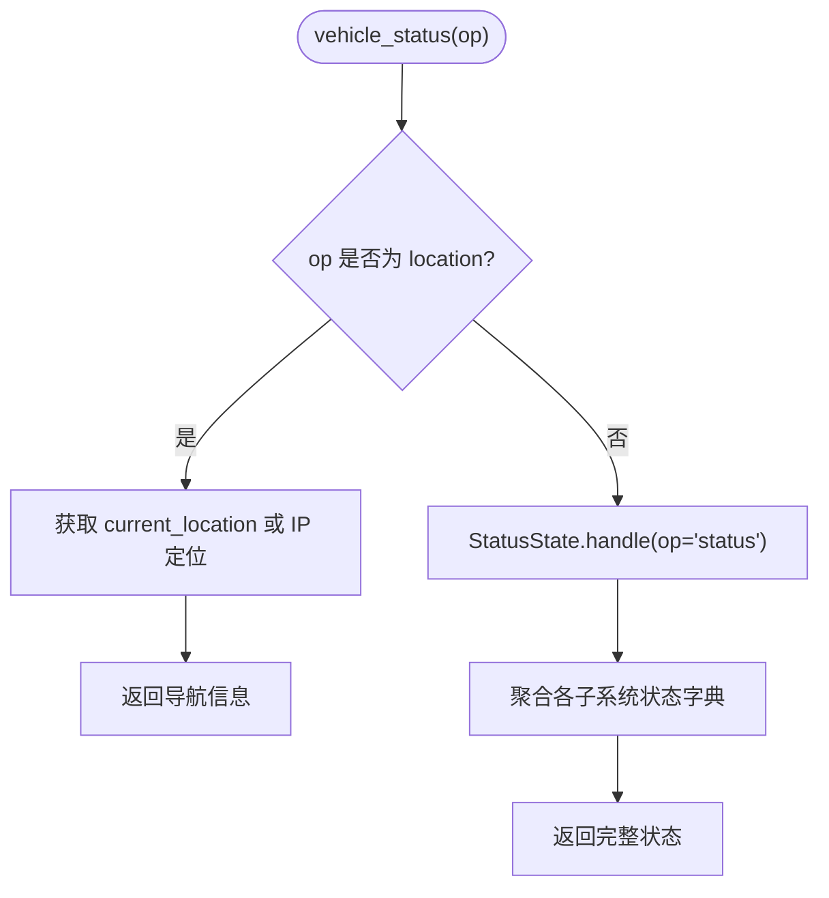
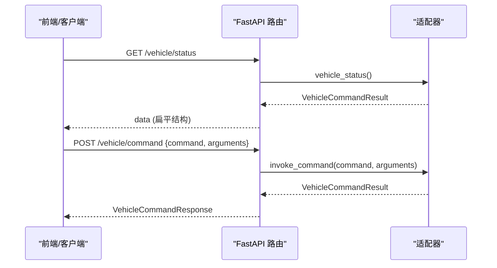
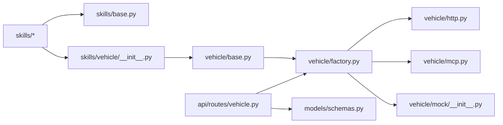

# 车辆状态技能

<cite>
**本文引用的文件**   
- [backend_design/nexus/skills/vehicle/status.py](file://backend_design/nexus/skills/vehicle/status.py)
- [backend_design/nexus/skills/base.py](file://backend_design/nexus/skills/base.py)
- [backend_design/nexus/skills/vehicle/__init__.py](file://backend_design/nexus/skills/vehicle/__init__.py)
- [backend_design/nexus/vehicle/base.py](file://backend_design/nexus/vehicle/base.py)
- [backend_design/nexus/vehicle/factory.py](file://backend_design/nexus/vehicle/factory.py)
- [backend_design/nexus/vehicle/http.py](file://backend_design/nexus/vehicle/http.py)
- [backend_design/nexus/vehicle/mcp.py](file://backend_design/nexus/vehicle/mcp.py)
- [backend_design/nexus/vehicle/mock/__init__.py](file://backend_design/nexus/vehicle/mock/__init__.py)
- [backend_design/nexus/vehicle/mock/status_state.py](file://backend_design/nexus/vehicle/mock/status_state.py)
- [backend_design/nexus/api/routes/vehicle.py](file://backend_design/nexus/api/routes/vehicle.py)
- [backend_design/nexus/models/schemas.py](file://backend_design/nexus/models/schemas.py)
- [backend_design/nexus/config/vehicle.py](file://backend_design/nexus/config/vehicle.py)
- [backend_design/nexus/core/exceptions.py](file://backend_design/nexus/core/exceptions.py)
- [backend_design/nexus/observability/metrics.py](file://backend_design/nexus/observability/metrics.py)
</cite>

## 目录
1. [简介](#简介)
2. [项目结构](#项目结构)
3. [核心组件](#核心组件)
4. [架构总览](#架构总览)
5. [详细组件分析](#详细组件分析)
6. [依赖关系分析](#依赖关系分析)
7. [性能与采集频率](#性能与采集频率)
8. [故障排查指南](#故障排查指南)
9. [结论](#结论)
10. [附录：使用示例与最佳实践](#附录使用示例与最佳实践)

## 简介
本技术文档聚焦于 NexusCockpit 的“车辆状态技能”，围绕以下目标展开：
- 解释车辆状态查询的具体实现，包括电量、油量、续航、胎压、保养等关键指标。
- 说明状态数据的采集频率与更新机制（Mock/HTTP/MCP 三种适配器模式）。
- 阐述与车控后端（HTTP REST 或 MCP stdio）的通信方式及数据流转。
- 给出语音指令获取车辆状态的完整使用示例。
- 覆盖异常检测、告警机制与数据持久化策略（当前为内存态，可扩展至持久化）。

## 项目结构
与车辆状态技能相关的代码主要分布在以下模块：
- 技能层：skills/vehicle/status.py 定义“vehicle_status”技能，负责参数解析与调用适配层。
- 车控适配层：vehicle/base.py 定义统一抽象接口；factory.py 根据配置选择 Mock/HTTP/MCP 适配器；http.py、mcp.py、mock/__init__.py 分别实现具体适配器。
- API 路由：api/routes/vehicle.py 暴露 /vehicle/command 和 /vehicle/status 两个端点，支持直接车控与状态查询。
- 模型与配置：models/schemas.py 定义请求/响应结构；config/vehicle.py 提供车控适配器配置项。
- 异常与可观测性：core/exceptions.py 定义 VehicleError 等；observability/metrics.py 暴露 Prometheus 指标。

**图表来源** 
- [backend_design/nexus/skills/vehicle/status.py:15-33](file://backend_design/nexus/skills/vehicle/status.py#L15-L33)
- [backend_design/nexus/skills/vehicle/__init__.py:21-55](file://backend_design/nexus/skills/vehicle/__init__.py#L21-L55)
- [backend_design/nexus/skills/base.py:116-264](file://backend_design/nexus/skills/base.py#L116-L264)
- [backend_design/nexus/vehicle/base.py:35-92](file://backend_design/nexus/vehicle/base.py#L35-L92)
- [backend_design/nexus/vehicle/factory.py:38-123](file://backend_design/nexus/vehicle/factory.py#L38-L123)
- [backend_design/nexus/vehicle/http.py:23-127](file://backend_design/nexus/vehicle/http.py#L23-L127)
- [backend_design/nexus/vehicle/mcp.py:167-285](file://backend_design/nexus/vehicle/mcp.py#L167-L285)
- [backend_design/nexus/vehicle/mock/__init__.py:39-220](file://backend_design/nexus/vehicle/mock/__init__.py#L39-L220)
- [backend_design/nexus/vehicle/mock/status_state.py:14-38](file://backend_design/nexus/vehicle/mock/status_state.py#L14-L38)
- [backend_design/nexus/api/routes/vehicle.py:48-108](file://backend_design/nexus/api/routes/vehicle.py#L48-L108)
- [backend_design/nexus/models/schemas.py:55-68](file://backend_design/nexus/models/schemas.py#L55-L68)
- [backend_design/nexus/config/vehicle.py:15-50](file://backend_design/nexus/config/vehicle.py#L15-L50)
- [backend_design/nexus/core/exceptions.py:91-96](file://backend_design/nexus/core/exceptions.py#L91-L96)
- [backend_design/nexus/observability/metrics.py:48-54](file://backend_design/nexus/observability/metrics.py#L48-L54)

**章节来源**
- [backend_design/nexus/skills/vehicle/status.py:15-33](file://backend_design/nexus/skills/vehicle/status.py#L15-L33)
- [backend_design/nexus/vehicle/factory.py:38-123](file://backend_design/nexus/vehicle/factory.py#L38-L123)
- [backend_design/nexus/api/routes/vehicle.py:48-108](file://backend_design/nexus/api/routes/vehicle.py#L48-L108)

## 核心组件
- 车辆状态技能 VehicleStatusSkill
  - 定义工具名 vehicle_status，描述涵盖胎压、续航、电量、油量、保养与位置查询。
  - 通过基类 VehicleBaseSkill._invoke 调用车控适配器的 invoke_command。
- 车控适配器抽象 BaseVehicleAdapter
  - 统一接口：vehicle_climate、vehicle_window、vehicle_seat、vehicle_navigation、vehicle_media、vehicle_status、invoke_command。
  - 返回统一的 VehicleCommandResult（success、message、data、error）。
- 适配器工厂 Vehicle Adapter Factory
  - 根据配置 VEHICLE_ADAPTER 选择 mock/http/mcp。
  - 支持多座舱隔离：Mock 模式按座舱独立实例，HTTP/MCP 复用单例。
- HTTP 适配器 HttpVehicleBusAdapter
  - 通过 urllib 发送 JSON/JSON-RPC 到远端车控服务，封装错误与超时处理。
- MCP 适配器 MCPStdioVehicleAdapter
  - 通过 mcp.ClientSession 与外部 MCP 服务通信，后台线程运行异步事件循环，同步桥接调用。
- Mock 适配器 MockVehicleBus
  - Facade 门面模式，聚合空调、车窗、座椅、导航、媒体、车况子状态。
  - 支持命令别名映射与 location 查询。
- StatusState 状态模型
  - 维护胎压、续航、油量、电量、保养等字段，handle 返回结构化摘要。

**章节来源**
- [backend_design/nexus/skills/vehicle/status.py:15-33](file://backend_design/nexus/skills/vehicle/status.py#L15-L33)
- [backend_design/nexus/skills/vehicle/__init__.py:21-55](file://backend_design/nexus/skills/vehicle/__init__.py#L21-L55)
- [backend_design/nexus/vehicle/base.py:35-92](file://backend_design/nexus/vehicle/base.py#L35-L92)
- [backend_design/nexus/vehicle/factory.py:38-123](file://backend_design/nexus/vehicle/factory.py#L38-L123)
- [backend_design/nexus/vehicle/http.py:23-127](file://backend_design/nexus/vehicle/http.py#L23-L127)
- [backend_design/nexus/vehicle/mcp.py:167-285](file://backend_design/nexus/vehicle/mcp.py#L167-L285)
- [backend_design/nexus/vehicle/mock/__init__.py:39-220](file://backend_design/nexus/vehicle/mock/__init__.py#L39-L220)
- [backend_design/nexus/vehicle/mock/status_state.py:14-38](file://backend_design/nexus/vehicle/mock/status_state.py#L14-L38)

## 架构总览
下图展示从前端/语音到车控后端的整体流程，以及不同适配器的选择与数据流向。

**图表来源** 
- [backend_design/nexus/api/routes/vehicle.py:88-108](file://backend_design/nexus/api/routes/vehicle.py#L88-L108)
- [backend_design/nexus/vehicle/factory.py:38-123](file://backend_design/nexus/vehicle/factory.py#L38-L123)
- [backend_design/nexus/vehicle/base.py:85-92](file://backend_design/nexus/vehicle/base.py#L85-L92)
- [backend_design/nexus/vehicle/http.py:62-68](file://backend_design/nexus/vehicle/http.py#L62-L68)
- [backend_design/nexus/vehicle/mcp.py:219-224](file://backend_design/nexus/vehicle/mcp.py#L219-L224)
- [backend_design/nexus/vehicle/mock/__init__.py:169-192](file://backend_design/nexus/vehicle/mock/__init__.py#L169-L192)
- [backend_design/nexus/vehicle/mock/status_state.py:26-38](file://backend_design/nexus/vehicle/mock/status_state.py#L26-L38)

## 详细组件分析

### 车辆状态技能 VehicleStatusSkill
- 功能要点
  - 工具名 vehicle_status，支持 op=location 查询当前位置，默认 status 查询车况摘要。
  - 通过 VehicleBaseSkill._invoke 将参数清理并转发给适配器 invoke_command。
- 执行路径
  - 技能 execute -> _invoke -> adapter.invoke_command -> 具体适配器实现 -> VehicleCommandResult -> SkillResult。

**图表来源** 
- [backend_design/nexus/skills/base.py:116-264](file://backend_design/nexus/skills/base.py#L116-L264)
- [backend_design/nexus/skills/vehicle/__init__.py:21-55](file://backend_design/nexus/skills/vehicle/__init__.py#L21-L55)
- [backend_design/nexus/skills/vehicle/status.py:15-33](file://backend_design/nexus/skills/vehicle/status.py#L15-L33)
- [backend_design/nexus/vehicle/base.py:35-92](file://backend_design/nexus/vehicle/base.py#L35-L92)
- [backend_design/nexus/vehicle/http.py:23-127](file://backend_design/nexus/vehicle/http.py#L23-L127)
- [backend_design/nexus/vehicle/mcp.py:167-285](file://backend_design/nexus/vehicle/mcp.py#L167-L285)
- [backend_design/nexus/vehicle/mock/__init__.py:39-220](file://backend_design/nexus/vehicle/mock/__init__.py#L39-L220)
- [backend_design/nexus/vehicle/mock/status_state.py:14-38](file://backend_design/nexus/vehicle/mock/status_state.py#L14-L38)

**章节来源**
- [backend_design/nexus/skills/vehicle/status.py:15-33](file://backend_design/nexus/skills/vehicle/status.py#L15-L33)
- [backend_design/nexus/skills/vehicle/__init__.py:21-55](file://backend_design/nexus/skills/vehicle/__init__.py#L21-L55)

### 车控适配器与工厂
- 工厂选择逻辑
  - 读取配置 VehicleConfig.adapter，若为 http/rest/remote 且存在 base_url，则创建 HttpVehicleBusAdapter。
  - 若为 mcp-stdio/mcp_stdio/stdio 且存在 mcp_command，则创建 MCPStdioVehicleAdapter。
  - 否则默认 MockVehicleBus。
- 多座舱隔离
  - get_cockpit_vehicle_adapter(cockpit_id) 在 Mock 模式下为每个座舱创建独立实例；HTTP/MCP 复用单例。

**图表来源** 
- [backend_design/nexus/vehicle/factory.py:86-123](file://backend_design/nexus/vehicle/factory.py#L86-L123)
- [backend_design/nexus/config/vehicle.py:15-50](file://backend_design/nexus/config/vehicle.py#L15-L50)

**章节来源**
- [backend_design/nexus/vehicle/factory.py:38-123](file://backend_design/nexus/vehicle/factory.py#L38-L123)
- [backend_design/nexus/config/vehicle.py:15-50](file://backend_design/nexus/config/vehicle.py#L15-L50)

### HTTP 适配器通信细节
- 请求构建
  - 支持 rest 与 jsonrpc 两种协议格式，自动拼接 endpoint 与 headers（含可选 Authorization）。
- 响应解析
  - 兼容多种返回结构：包含 success/message/data/error 的标准体，或 result 包裹体。
- 错误处理
  - HTTPError/URLError/通用异常均被捕获并转换为 VehicleCommandResult，便于上层统一处理。

**图表来源** 
- [backend_design/nexus/vehicle/http.py:69-127](file://backend_design/nexus/vehicle/http.py#L69-L127)

**章节来源**
- [backend_design/nexus/vehicle/http.py:23-127](file://backend_design/nexus/vehicle/http.py#L23-L127)

### MCP 适配器通信细节
- 后台事件循环
  - 通过 _MCPBackgroundRunner 在后台线程启动 asyncio 事件循环，管理 stdio_client 与 ClientSession 生命周期。
- 工具发现与调用
  - 初始化时 list_tools 获取可用工具集合；调用 call_tool 通过 run_coroutine_threadsafe 桥接到异步 session.call_tool。
- 结果转换
  - 将 CallToolResult 的 content/structuredContent/isError 转换为 VehicleCommandResult。

**图表来源** 
- [backend_design/nexus/vehicle/mcp.py:96-151](file://backend_design/nexus/vehicle/mcp.py#L96-L151)
- [backend_design/nexus/vehicle/mcp.py:225-280](file://backend_design/nexus/vehicle/mcp.py#L225-L280)

**章节来源**
- [backend_design/nexus/vehicle/mcp.py:167-285](file://backend_design/nexus/vehicle/mcp.py#L167-L285)

### Mock 适配器与状态模型
- MockVehicleBus
  - 门面聚合各子系统状态，vehicle_status 聚合 climate/windows/seats/media/navigation/status。
  - 支持 location 查询，优先取已缓存地址，否则通过 IP 定位。
- StatusState
  - 维护 tire_pressure/range_km/fuel_percent/battery_percent/maintenance 等键值。
  - handle 返回人类可读摘要与结构化数据。

**图表来源** 
- [backend_design/nexus/vehicle/mock/__init__.py:169-192](file://backend_design/nexus/vehicle/mock/__init__.py#L169-L192)
- [backend_design/nexus/vehicle/mock/status_state.py:26-38](file://backend_design/nexus/vehicle/mock/status_state.py#L26-L38)

**章节来源**
- [backend_design/nexus/vehicle/mock/__init__.py:39-220](file://backend_design/nexus/vehicle/mock/__init__.py#L39-L220)
- [backend_design/nexus/vehicle/mock/status_state.py:14-38](file://backend_design/nexus/vehicle/mock/status_state.py#L14-L38)

### API 路由与数据模型
- 路由
  - GET /vehicle/status：调用 adapter.vehicle_status()，返回扁平 data。
  - POST /vehicle/command：调用 adapter.invoke_command(command, arguments)，返回标准响应。
- 模型
  - VehicleCommandRequest/Response：command、arguments、success、message、data、error。

**图表来源** 
- [backend_design/nexus/api/routes/vehicle.py:48-108](file://backend_design/nexus/api/routes/vehicle.py#L48-L108)
- [backend_design/nexus/models/schemas.py:55-68](file://backend_design/nexus/models/schemas.py#L55-L68)

**章节来源**
- [backend_design/nexus/api/routes/vehicle.py:48-108](file://backend_design/nexus/api/routes/vehicle.py#L48-L108)
- [backend_design/nexus/models/schemas.py:55-68](file://backend_design/nexus/models/schemas.py#L55-L68)

## 依赖关系分析
- 组件耦合
  - 技能层依赖 VehicleBaseSkill，后者依赖 BaseVehicleAdapter 抽象。
  - 工厂解耦具体适配器实现，依据配置动态选择。
  - API 路由仅依赖抽象接口与模型，屏蔽底层差异。
- 外部依赖
  - HTTP 适配器依赖 urllib；MCP 适配器依赖 mcp SDK；Mock 适配器无外部依赖。
- 潜在循环依赖
  - 通过延迟导入（如 from nexus.vehicle.factory import build_vehicle_adapter）避免循环。

**图表来源** 
- [backend_design/nexus/skills/base.py:116-264](file://backend_design/nexus/skills/base.py#L116-L264)
- [backend_design/nexus/skills/vehicle/__init__.py:21-55](file://backend_design/nexus/skills/vehicle/__init__.py#L21-L55)
- [backend_design/nexus/vehicle/base.py:35-92](file://backend_design/nexus/vehicle/base.py#L35-L92)
- [backend_design/nexus/vehicle/factory.py:38-123](file://backend_design/nexus/vehicle/factory.py#L38-L123)
- [backend_design/nexus/api/routes/vehicle.py:48-108](file://backend_design/nexus/api/routes/vehicle.py#L48-L108)
- [backend_design/nexus/models/schemas.py:55-68](file://backend_design/nexus/models/schemas.py#L55-L68)

**章节来源**
- [backend_design/nexus/vehicle/factory.py:38-123](file://backend_design/nexus/vehicle/factory.py#L38-L123)
- [backend_design/nexus/api/routes/vehicle.py:48-108](file://backend_design/nexus/api/routes/vehicle.py#L48-L108)

## 性能与采集频率
- 采集频率与更新机制
  - Mock 模式：状态保存在内存字典中，由上层定时任务或前端轮询触发更新（当前未内置定时器，需外部驱动）。
  - HTTP 模式：每次请求实时调用远端车控服务，频率受限于网络与远端能力。
  - MCP 模式：通过 stdio 通道调用外部服务，频率同样受外部服务限制。
- 性能特征
  - HTTP/MCP 适配器具备超时控制（默认 5s/10s），失败快速返回。
  - Mock 模式无 IO 开销，适合开发与测试。
- 监控指标
  - SKILL_EXECUTIONS 计数器记录技能执行次数与状态。
  - REQUEST_LATENCY/HISTOGRAM 可用于评估接口延迟分布。

[本节为通用指导，不直接分析具体文件]

## 故障排查指南
- 常见错误类型
  - VehicleError：车控指令执行失败（HTTP 错误、连接失败、调用失败）。
  - 适配器未初始化：返回 503，检查工厂初始化与配置。
- 排查步骤
  - 确认 VEHICLE_ADAPTER 配置正确（mock/http/mcp）。
  - HTTP 模式检查 api_base_url、api_endpoint、api_timeout、api_token。
  - MCP 模式检查 mcp_command、mcp_args、mcp_workdir、mcp_validate_tools。
  - 查看日志中的 VehicleError 详情与 error 字段。
- 指标与诊断
  - 通过 /metrics 观察 SKILL_EXECUTIONS、REQUEST_LATENCY 等指标。
  - 针对频繁失败的命令，结合 error 码定位问题（如 tool_not_exposed、connection_failed）。

**章节来源**
- [backend_design/nexus/core/exceptions.py:91-96](file://backend_design/nexus/core/exceptions.py#L91-96)
- [backend_design/nexus/api/routes/vehicle.py:66-108](file://backend_design/nexus/api/routes/vehicle.py#L66-L108)
- [backend_design/nexus/observability/metrics.py:48-54](file://backend_design/nexus/observability/metrics.py#L48-L54)

## 结论
NexusCockpit 的车辆状态技能通过清晰的技能层与适配层分离，实现了灵活的车控通信方案。Mock/HTTP/MCP 三种适配器满足开发、集成与生产环境的不同需求。状态数据以内存态为主，可通过外部定时任务或前端轮询驱动更新。异常体系与指标采集为故障定位与运维提供了基础支撑。后续可在状态异常检测、告警机制与数据持久化方面进一步增强。

[本节为总结，不直接分析具体文件]

## 附录：使用示例与最佳实践
- 语音指令示例
  - “车辆状态怎么样”：调用 vehicle_status 技能，返回胎压、续航、油量、电量、保养摘要。
  - “查一下胎压和续航”：同上，强调关注特定字段。
  - “我在哪里”：op=location，返回当前位置与朝向。
- API 调用示例
  - GET /vehicle/status：获取当前车辆状态（JSON 扁平 data）。
  - POST /vehicle/command：{command:"vehicle_status", arguments:{}}，返回标准响应。
- 最佳实践
  - 在生产环境优先使用 HTTP/MCP 适配器对接真实车控服务。
  - 合理设置超时与重试策略，避免雪崩。
  - 对敏感操作启用鉴权与限流。
  - 结合 Prometheus/Grafana 监控关键指标，建立告警规则。

[本节为概念性内容，不直接分析具体文件]