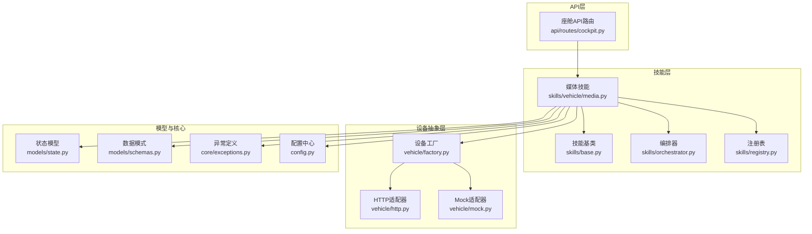
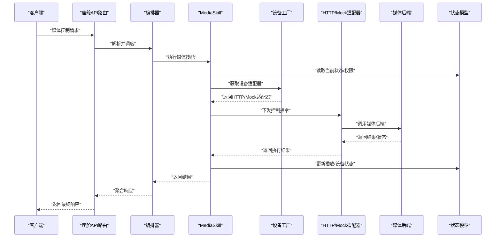
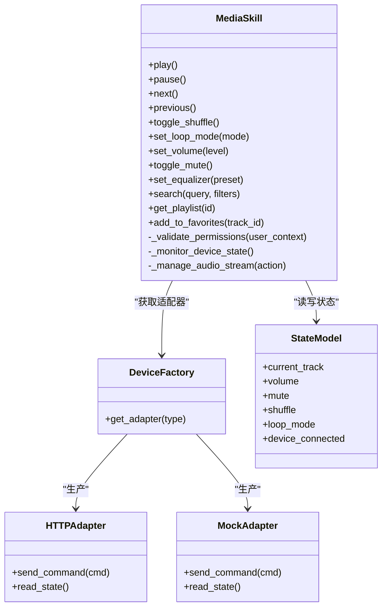
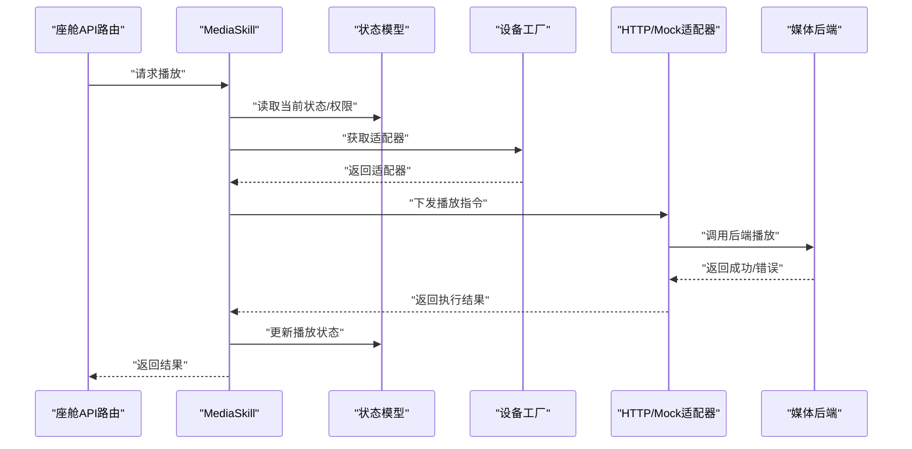
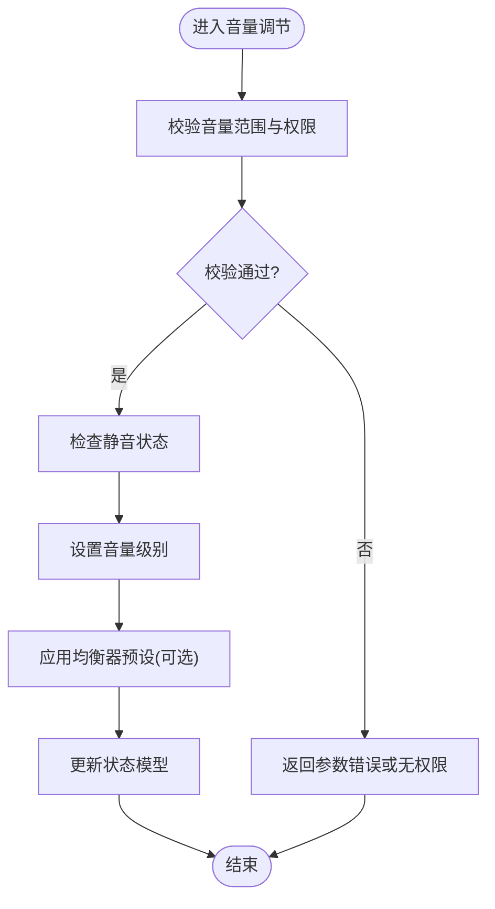
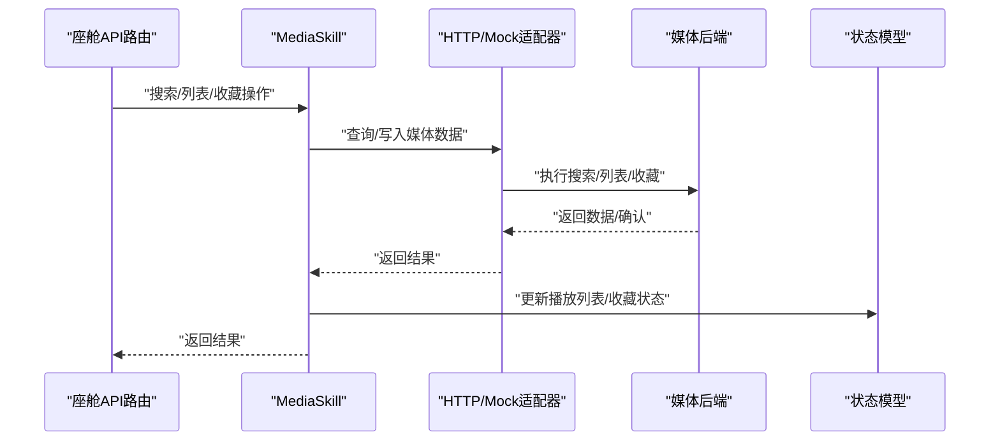
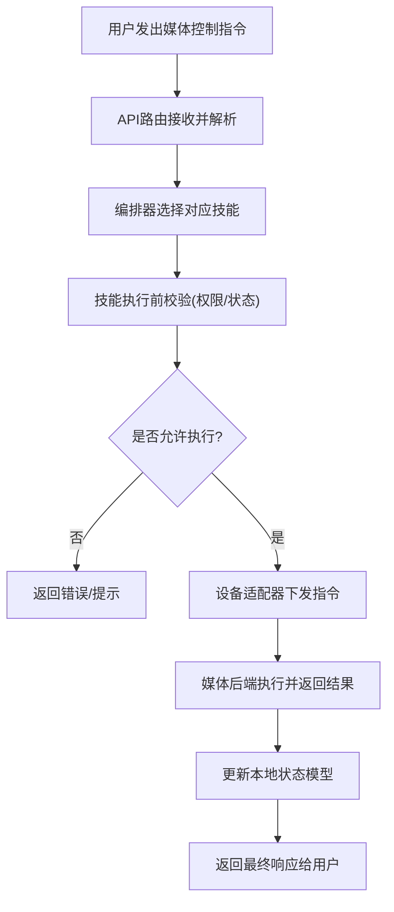
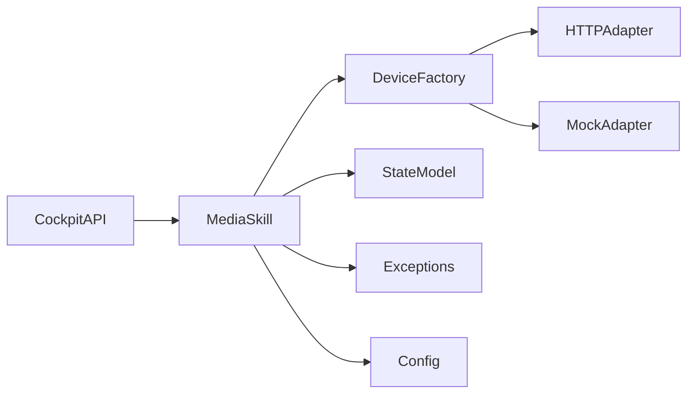

# 媒体控制操作

<cite>
**本文引用的文件**   
- [backend_design/nexus/skills/vehicle/media.py](file://backend_design/nexus/skills/vehicle/media.py)
- [backend_design/nexus/skills/base.py](file://backend_design/nexus/skills/base.py)
- [backend_design/nexus/skills/orchestrator.py](file://backend_design/nexus/skills/orchestrator.py)
- [backend_design/nexus/skills/registry.py](file://backend_design/nexus/skills/registry.py)
- [backend_design/nexus/api/routes/cockpit.py](file://backend_design/nexus/api/routes/cockpit.py)
- [backend_design/nexus/core/exceptions.py](file://backend_design/nexus/core/exceptions.py)
- [backend_design/nexus/models/state.py](file://backend_design/nexus/models/state.py)
- [backend_design/nexus/models/schemas.py](file://backend_design/nexus/models/schemas.py)
- [backend_design/nexus/vehicle/factory.py](file://backend_design/nexus/vehicle/factory.py)
- [backend_design/nexus/vehicle/http.py](file://backend_design/nexus/vehicle/http.py)
- [backend_design/nexus/vehicle/mock.py](file://backend_design/nexus/vehicle/mock.py)
- [backend_design/nexus/config.py](file://backend_design/nexus/config.py)
</cite>

## 目录
1. [简介](#简介)
2. [项目结构](#项目结构)
3. [核心组件](#核心组件)
4. [架构总览](#架构总览)
5. [详细组件分析](#详细组件分析)
6. [依赖关系分析](#依赖关系分析)
7. [性能考虑](#性能考虑)
8. [故障排查指南](#故障排查指南)
9. [结论](#结论)
10. [附录](#附录)

## 简介
本技术文档聚焦车载多媒体系统的媒体控制能力，覆盖播放控制（播放/暂停、上一首/下一首、随机播放、循环模式）、音量调节（音量大小、静音切换、均衡器设置）以及曲目管理（歌曲搜索、播放列表、收藏管理）。文档重点解析 MediaSkill 的实现机制，包括音频流管理、设备连接状态监控与用户权限控制，并提供完整的媒体控制 API 示例，展示常见音乐播放场景的操作指令。同时给出音频设备兼容性处理、播放状态同步与错误恢复机制的设计建议与实践要点。

## 项目结构
本项目采用分层与按功能域组织相结合的结构：
- skills/vehicle 下包含车辆相关技能实现，其中 media.py 承载媒体控制的核心逻辑。
- skills 基础框架提供技能基类、编排器与注册表，用于统一生命周期、参数校验与调用编排。
- api/routes 暴露 HTTP/WebSocket 接口，供前端或外部系统调用。
- vehicle 层抽象底层硬件/服务访问，支持 HTTP、MCP、Mock 等多种后端适配。
- models 定义数据模型与状态结构，core 提供异常、配置等通用能力。

图表来源
- [backend_design/nexus/skills/vehicle/media.py](file://backend_design/nexus/skills/vehicle/media.py)
- [backend_design/nexus/skills/base.py](file://backend_design/nexus/skills/base.py)
- [backend_design/nexus/skills/orchestrator.py](file://backend_design/nexus/skills/orchestrator.py)
- [backend_design/nexus/skills/registry.py](file://backend_design/nexus/skills/registry.py)
- [backend_design/nexus/api/routes/cockpit.py](file://backend_design/nexus/api/routes/cockpit.py)
- [backend_design/nexus/vehicle/factory.py](file://backend_design/nexus/vehicle/factory.py)
- [backend_design/nexus/vehicle/http.py](file://backend_design/nexus/vehicle/http.py)
- [backend_design/nexus/vehicle/mock.py](file://backend_design/nexus/vehicle/mock.py)
- [backend_design/nexus/models/state.py](file://backend_design/nexus/models/state.py)
- [backend_design/nexus/models/schemas.py](file://backend_design/nexus/models/schemas.py)
- [backend_design/nexus/core/exceptions.py](file://backend_design/nexus/core/exceptions.py)
- [backend_design/nexus/config.py](file://backend_design/nexus/config.py)

章节来源
- [backend_design/nexus/skills/vehicle/media.py](file://backend_design/nexus/skills/vehicle/media.py)
- [backend_design/nexus/skills/base.py](file://backend_design/nexus/skills/base.py)
- [backend_design/nexus/skills/orchestrator.py](file://backend_design/nexus/skills/orchestrator.py)
- [backend_design/nexus/skills/registry.py](file://backend_design/nexus/skills/registry.py)
- [backend_design/nexus/api/routes/cockpit.py](file://backend_design/nexus/api/routes/cockpit.py)
- [backend_design/nexus/vehicle/factory.py](file://backend_design/nexus/vehicle/factory.py)
- [backend_design/nexus/vehicle/http.py](file://backend_design/nexus/vehicle/http.py)
- [backend_design/nexus/vehicle/mock.py](file://backend_design/nexus/vehicle/mock.py)
- [backend_design/nexus/models/state.py](file://backend_design/nexus/models/state.py)
- [backend_design/nexus/models/schemas.py](file://backend_design/nexus/models/schemas.py)
- [backend_design/nexus/core/exceptions.py](file://backend_design/nexus/core/exceptions.py)
- [backend_design/nexus/config.py](file://backend_design/nexus/config.py)

## 核心组件
- MediaSkill：媒体控制技能，封装播放控制、音量调节、曲目管理等业务逻辑，协调设备抽象层完成实际命令下发与状态读取。
- 设备抽象层（Factory/HTTP/Mock）：屏蔽不同车机/媒体后端差异，提供统一的播放、音量、列表、搜索等接口。
- 编排器与注册表：负责技能的发现、注册与执行编排，确保多技能协同时的顺序与一致性。
- 状态与模式：集中维护当前播放状态、设备连接状态、用户上下文与权限信息。
- API 路由：对外暴露 REST/WS 接口，将用户意图转换为技能调用。

章节来源
- [backend_design/nexus/skills/vehicle/media.py](file://backend_design/nexus/skills/vehicle/media.py)
- [backend_design/nexus/vehicle/factory.py](file://backend_design/nexus/vehicle/factory.py)
- [backend_design/nexus/vehicle/http.py](file://backend_design/nexus/vehicle/http.py)
- [backend_design/nexus/vehicle/mock.py](file://backend_design/nexus/vehicle/mock.py)
- [backend_design/nexus/skills/orchestrator.py](file://backend_design/nexus/skills/orchestrator.py)
- [backend_design/nexus/skills/registry.py](file://backend_design/nexus/skills/registry.py)
- [backend_design/nexus/models/state.py](file://backend_design/nexus/models/state.py)
- [backend_design/nexus/models/schemas.py](file://backend_design/nexus/models/schemas.py)
- [backend_design/nexus/api/routes/cockpit.py](file://backend_design/nexus/api/routes/cockpit.py)

## 架构总览
媒体控制的整体流程如下：
- 客户端通过 API 路由发起媒体控制请求。
- 路由解析并校验参数，调用编排器选择并执行 MediaSkill。
- MediaSkill 根据当前状态与权限策略进行决策，调用设备工厂获取具体适配器（HTTP/Mock）。
- 适配器向真实媒体后端发送控制指令，并回传结果与状态变更。
- 编排器聚合结果，更新状态模型并通过 API 返回给客户端。

图表来源
- [backend_design/nexus/api/routes/cockpit.py](file://backend_design/nexus/api/routes/cockpit.py)
- [backend_design/nexus/skills/orchestrator.py](file://backend_design/nexus/skills/orchestrator.py)
- [backend_design/nexus/skills/vehicle/media.py](file://backend_design/nexus/skills/vehicle/media.py)
- [backend_design/nexus/vehicle/factory.py](file://backend_design/nexus/vehicle/factory.py)
- [backend_design/nexus/vehicle/http.py](file://backend_design/nexus/vehicle/http.py)
- [backend_design/nexus/vehicle/mock.py](file://backend_design/nexus/vehicle/mock.py)
- [backend_design/nexus/models/state.py](file://backend_design/nexus/models/state.py)

## 详细组件分析

### MediaSkill 类分析
MediaSkill 作为媒体控制的核心技能，承担以下职责：
- 播放控制：播放/暂停、上一首/下一首、随机播放、循环模式切换。
- 音量调节：音量大小设置、静音切换、均衡器设置。
- 曲目管理：歌曲搜索、播放列表操作、收藏管理。
- 音频流管理：启动/停止流式播放、缓冲与断点续播。
- 设备连接状态监控：检测媒体后端可达性、重连与降级策略。
- 用户权限控制：基于用户上下文与角色策略限制敏感操作。

图表来源
- [backend_design/nexus/skills/vehicle/media.py](file://backend_design/nexus/skills/vehicle/media.py)
- [backend_design/nexus/vehicle/factory.py](file://backend_design/nexus/vehicle/factory.py)
- [backend_design/nexus/vehicle/http.py](file://backend_design/nexus/vehicle/http.py)
- [backend_design/nexus/vehicle/mock.py](file://backend_design/nexus/vehicle/mock.py)
- [backend_design/nexus/models/state.py](file://backend_design/nexus/models/state.py)

章节来源
- [backend_design/nexus/skills/vehicle/media.py](file://backend_design/nexus/skills/vehicle/media.py)
- [backend_design/nexus/vehicle/factory.py](file://backend_design/nexus/vehicle/factory.py)
- [backend_design/nexus/vehicle/http.py](file://backend_design/nexus/vehicle/http.py)
- [backend_design/nexus/vehicle/mock.py](file://backend_design/nexus/vehicle/mock.py)
- [backend_design/nexus/models/state.py](file://backend_design/nexus/models/state.py)

#### 播放控制流程
播放控制涉及状态校验、权限检查、设备可用性与指令下发。以下为典型“播放”流程的时序图：

图表来源
- [backend_design/nexus/api/routes/cockpit.py](file://backend_design/nexus/api/routes/cockpit.py)
- [backend_design/nexus/skills/vehicle/media.py](file://backend_design/nexus/skills/vehicle/media.py)
- [backend_design/nexus/vehicle/factory.py](file://backend_design/nexus/vehicle/factory.py)
- [backend_design/nexus/vehicle/http.py](file://backend_design/nexus/vehicle/http.py)
- [backend_design/nexus/vehicle/mock.py](file://backend_design/nexus/vehicle/mock.py)
- [backend_design/nexus/models/state.py](file://backend_design/nexus/models/state.py)

章节来源
- [backend_design/nexus/skills/vehicle/media.py](file://backend_design/nexus/skills/vehicle/media.py)
- [backend_design/nexus/api/routes/cockpit.py](file://backend_design/nexus/api/routes/cockpit.py)
- [backend_design/nexus/models/state.py](file://backend_design/nexus/models/state.py)

#### 音量调节流程
音量调节需考虑范围校验、静音互斥与均衡器预设应用。

图表来源
- [backend_design/nexus/skills/vehicle/media.py](file://backend_design/nexus/skills/vehicle/media.py)
- [backend_design/nexus/models/state.py](file://backend_design/nexus/models/state.py)

章节来源
- [backend_design/nexus/skills/vehicle/media.py](file://backend_design/nexus/skills/vehicle/media.py)
- [backend_design/nexus/models/state.py](file://backend_design/nexus/models/state.py)

#### 曲目管理与搜索流程
曲目管理涵盖搜索、播放列表与收藏操作，通常结合过滤条件与分页。

图表来源
- [backend_design/nexus/skills/vehicle/media.py](file://backend_design/nexus/skills/vehicle/media.py)
- [backend_design/nexus/vehicle/http.py](file://backend_design/nexus/vehicle/http.py)
- [backend_design/nexus/vehicle/mock.py](file://backend_design/nexus/vehicle/mock.py)
- [backend_design/nexus/models/state.py](file://backend_design/nexus/models/state.py)

章节来源
- [backend_design/nexus/skills/vehicle/media.py](file://backend_design/nexus/skills/vehicle/media.py)
- [backend_design/nexus/vehicle/http.py](file://backend_design/nexus/vehicle/http.py)
- [backend_design/nexus/vehicle/mock.py](file://backend_design/nexus/vehicle/mock.py)
- [backend_design/nexus/models/state.py](file://backend_design/nexus/models/state.py)

### 概念性概览
以下流程图展示了媒体控制的通用工作流，便于理解整体交互而不绑定具体代码文件。

[此图为概念性流程，不直接映射到具体源码文件]

## 依赖关系分析
媒体控制的关键依赖关系如下：
- MediaSkill 依赖设备工厂以动态选择 HTTP 或 Mock 适配器，从而兼容不同后端。
- 状态模型贯穿整个流程，保证播放状态、音量、静音、随机与循环模式的一致性。
- 异常定义与配置中心为错误处理与环境参数提供支撑。
- API 路由与编排器负责入口与调度，确保技能可插拔与可扩展。

图表来源
- [backend_design/nexus/skills/vehicle/media.py](file://backend_design/nexus/skills/vehicle/media.py)
- [backend_design/nexus/vehicle/factory.py](file://backend_design/nexus/vehicle/factory.py)
- [backend_design/nexus/vehicle/http.py](file://backend_design/nexus/vehicle/http.py)
- [backend_design/nexus/vehicle/mock.py](file://backend_design/nexus/vehicle/mock.py)
- [backend_design/nexus/models/state.py](file://backend_design/nexus/models/state.py)
- [backend_design/nexus/core/exceptions.py](file://backend_design/nexus/core/exceptions.py)
- [backend_design/nexus/config.py](file://backend_design/nexus/config.py)
- [backend_design/nexus/api/routes/cockpit.py](file://backend_design/nexus/api/routes/cockpit.py)

章节来源
- [backend_design/nexus/skills/vehicle/media.py](file://backend_design/nexus/skills/vehicle/media.py)
- [backend_design/nexus/vehicle/factory.py](file://backend_design/nexus/vehicle/factory.py)
- [backend_design/nexus/vehicle/http.py](file://backend_design/nexus/vehicle/http.py)
- [backend_design/nexus/vehicle/mock.py](file://backend_design/nexus/vehicle/mock.py)
- [backend_design/nexus/models/state.py](file://backend_design/nexus/models/state.py)
- [backend_design/nexus/core/exceptions.py](file://backend_design/nexus/core/exceptions.py)
- [backend_design/nexus/config.py](file://backend_design/nexus/config.py)
- [backend_design/nexus/api/routes/cockpit.py](file://backend_design/nexus/api/routes/cockpit.py)

## 性能考虑
- 批量操作合并：对同一会话内的连续控制指令进行批处理，减少网络往返。
- 状态缓存：在内存中缓存最近播放状态与设备可达性，避免频繁查询后端。
- 异步执行：对耗时操作（如搜索、列表加载）采用异步回调与事件推送，提升用户体验。
- 降级策略：当媒体后端不可用时，自动切换到 Mock 适配器或仅返回只读状态，保障基本可用性。
- 资源回收：及时释放音频流资源，防止内存泄漏与句柄耗尽。

[本节为通用指导，不直接分析具体文件]

## 故障排查指南
常见问题与定位方法：
- 设备连接失败：检查设备工厂选择的适配器类型与后端可达性；查看状态模型中的 device_connected 字段。
- 权限拒绝：确认用户上下文与权限策略；核对 API 路由的参数校验与中间件拦截。
- 状态不一致：对比状态模型与后端返回的实际状态，必要时触发一次全量状态同步。
- 错误恢复：捕获适配器异常，记录日志并尝试重连或降级；返回明确的错误码与提示信息。

章节来源
- [backend_design/nexus/core/exceptions.py](file://backend_design/nexus/core/exceptions.py)
- [backend_design/nexus/models/state.py](file://backend_design/nexus/models/state.py)
- [backend_design/nexus/vehicle/factory.py](file://backend_design/nexus/vehicle/factory.py)
- [backend_design/nexus/vehicle/http.py](file://backend_design/nexus/vehicle/http.py)
- [backend_design/nexus/vehicle/mock.py](file://backend_design/nexus/vehicle/mock.py)

## 结论
MediaSkill 通过清晰的职责划分与良好的分层设计，实现了车载多媒体系统的媒体控制能力。借助设备抽象层与状态模型，系统在兼容性、一致性与可维护性方面具备良好基础。配合完善的 API 路由与编排器，媒体控制流程易于扩展与集成。建议在后续迭代中持续优化异步与降级策略，完善监控与可观测性指标，以提升整体稳定性与用户体验。

[本节为总结性内容，不直接分析具体文件]

## 附录

### 媒体控制 API 示例（场景化指令）
以下为常见音乐播放场景的 API 调用示例（以描述为主，不包含具体代码片段）：
- 播放控制
  - 播放：调用播放接口，传入当前会话 ID 与目标曲目标识（可选）。
  - 暂停：调用暂停接口，传入会话 ID。
  - 上一首/下一首：调用切歌接口，传入会话 ID 与方向。
  - 随机播放：调用随机开关接口，传入布尔值。
  - 循环模式：调用循环模式设置接口，传入模式枚举（单曲循环/列表循环/全部循环）。
- 音量调节
  - 音量大小：调用音量设置接口，传入数值与单位（百分比或分贝）。
  - 静音切换：调用静音开关接口，传入布尔值。
  - 均衡器设置：调用均衡器预设接口，传入预设名称或自定义频段参数。
- 曲目管理
  - 歌曲搜索：调用搜索接口，传入关键词与过滤条件（歌手/专辑/风格）。
  - 播放列表：调用列表接口，传入列表 ID 与分页参数。
  - 收藏管理：调用收藏接口，传入曲目 ID 与操作类型（添加/移除/查询）。

章节来源
- [backend_design/nexus/api/routes/cockpit.py](file://backend_design/nexus/api/routes/cockpit.py)
- [backend_design/nexus/skills/vehicle/media.py](file://backend_design/nexus/skills/vehicle/media.py)
- [backend_design/nexus/models/schemas.py](file://backend_design/nexus/models/schemas.py)

### 音频设备兼容性处理
- 适配器选择：根据配置或运行时探测选择 HTTP 或 Mock 适配器。
- 协议适配：对不同后端的控制协议进行统一封装，屏蔽差异。
- 特性协商：在连接建立时协商支持的媒体特性（如均衡器预设、随机/循环模式）。
- 降级与回退：当某特性不可用时，自动回退到最接近的功能或提示用户。

章节来源
- [backend_design/nexus/vehicle/factory.py](file://backend_design/nexus/vehicle/factory.py)
- [backend_design/nexus/vehicle/http.py](file://backend_design/nexus/vehicle/http.py)
- [backend_design/nexus/vehicle/mock.py](file://backend_design/nexus/vehicle/mock.py)
- [backend_design/nexus/config.py](file://backend_design/nexus/config.py)

### 播放状态同步与错误恢复机制
- 状态同步：在每次控制成功后主动拉取或推送最新状态，确保前后端一致。
- 心跳检测：定期检测设备连接与健康度，异常时触发重连。
- 错误分类：区分参数错误、权限错误、设备错误与网络错误，分别处理。
- 重试与补偿：对幂等操作进行有限次重试，非幂等操作采用补偿事务或提示用户手动恢复。

章节来源
- [backend_design/nexus/models/state.py](file://backend_design/nexus/models/state.py)
- [backend_design/nexus/core/exceptions.py](file://backend_design/nexus/core/exceptions.py)
- [backend_design/nexus/vehicle/http.py](file://backend_design/nexus/vehicle/http.py)
- [backend_design/nexus/vehicle/mock.py](file://backend_design/nexus/vehicle/mock.py)