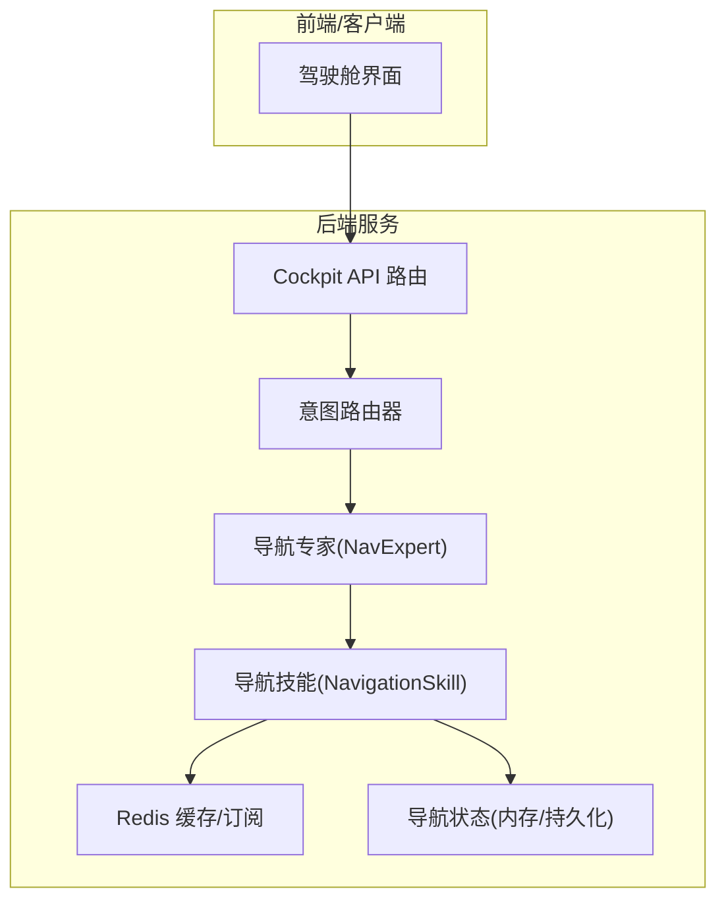
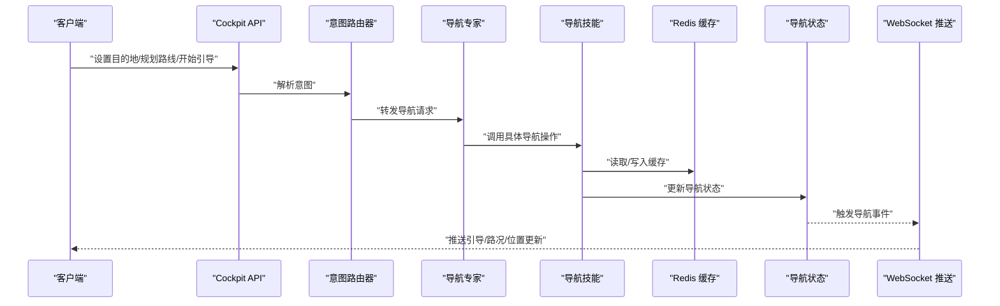
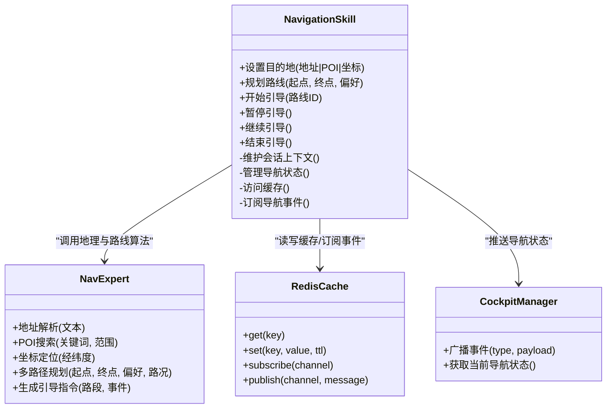
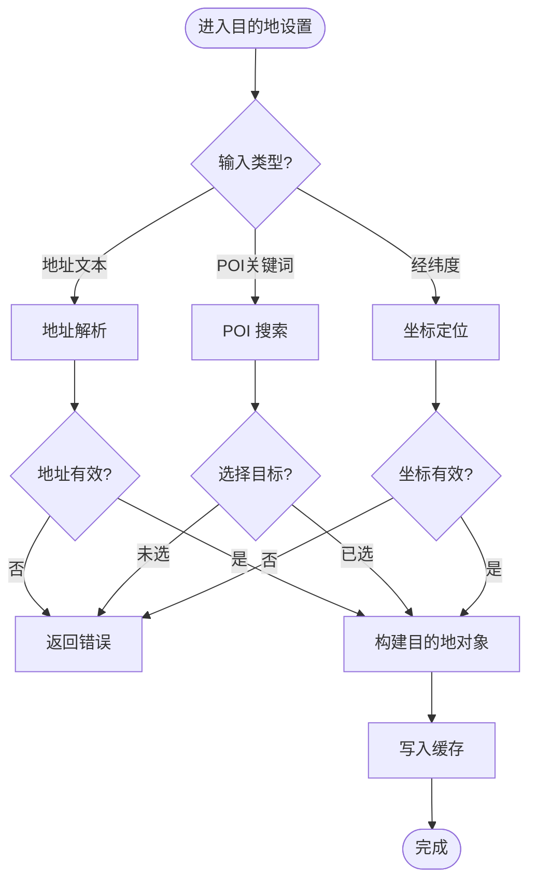
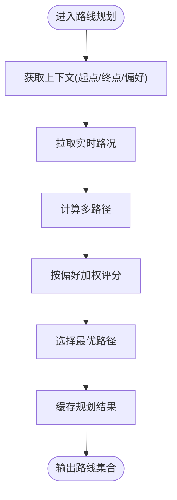
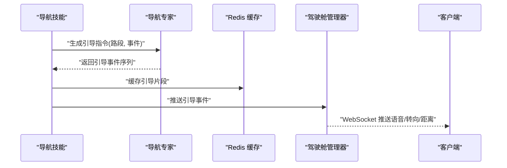
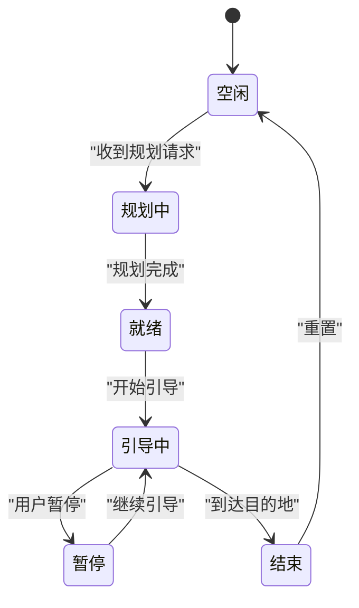
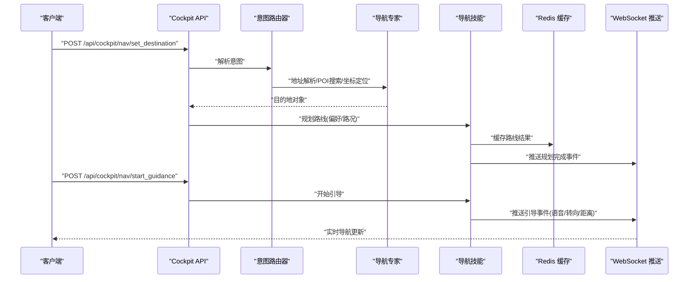
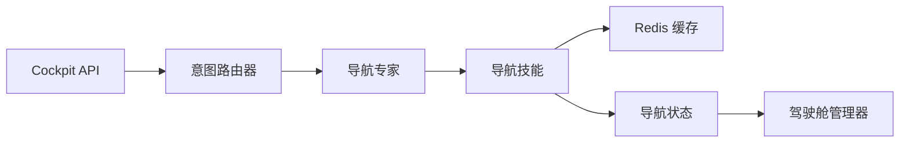

# 导航控制操作

<cite>
**本文引用的文件**   
- [backend_design/nexus/skills/vehicle/navigation.py](file://backend_design/nexus/skills/vehicle/navigation.py)
- [backend_design/nexus/skills/base.py](file://backend_design/nexus/skills/base.py)
- [backend_design/nexus/models/schemas.py](file://backend_design/nexus/models/schemas.py)
- [backend_design/nexus/core/cockpit_manager.py](file://backend_design/nexus/core/cockpit_manager.py)
- [backend_design/nexus/middleware/redis_cache.py](file://backend_design/nexus/middleware/redis_cache.py)
- [backend_design/nexus/api/routes/cockpit.py](file://backend_design/nexus/api/routes/cockpit.py)
- [backend_design/nexus/intent/router.py](file://backend_design/nexus/intent/router.py)
- [backend_design/nexus/agent/experts/nav_expert.py](file://backend_design/nexus/agent/experts/nav_expert.py)
</cite>

## 目录
1. [简介](#简介)
2. [项目结构](#项目结构)
3. [核心组件](#核心组件)
4. [架构总览](#架构总览)
5. [详细组件分析](#详细组件分析)
6. [依赖关系分析](#依赖关系分析)
7. [性能考虑](#性能考虑)
8. [故障排查指南](#故障排查指南)
9. [结论](#结论)
10. [附录](#附录)

## 简介
本技术文档聚焦车载导航系统的“导航控制操作”，围绕目的地设置、路线规划与路径引导三大能力，系统阐述 NavigationSkill 的实现架构与数据流。内容覆盖：
- 目的地设置：地址解析、POI 搜索、坐标定位
- 路线规划：多路径选择、偏好设置、实时路况
- 路径引导：语音提示、转向指示、距离提醒
- 状态管理：导航会话生命周期、事件驱动更新
- API 调用示例：从目的地输入到路径执行的端到端流程
- 缓存策略、实时更新机制与离线导航支持方案

## 项目结构
导航相关代码主要位于后端 Python 服务中，采用“技能（Skill）+ 专家（Expert）+ 路由（Router）”的分层组织方式：
- 技能层：NavigationSkill 封装导航业务入口，负责参数校验、上下文组装、结果编排
- 专家层：NavExpert 提供地理信息处理、路线算法集成、导航状态管理
- 模型层：Schemas 定义请求/响应数据结构
- 中间件层：RedisCache 提供缓存与订阅能力
- 接口层：Cockpit API 暴露导航相关 HTTP/WebSocket 接口
- 意图层：Intent Router 将自然语言指令路由至导航专家或技能

图表来源
- [backend_design/nexus/api/routes/cockpit.py](file://backend_design/nexus/api/routes/cockpit.py)
- [backend_design/nexus/intent/router.py](file://backend_design/nexus/intent/router.py)
- [backend_design/nexus/agent/experts/nav_expert.py](file://backend_design/nexus/agent/experts/nav_expert.py)
- [backend_design/nexus/skills/vehicle/navigation.py](file://backend_design/nexus/skills/vehicle/navigation.py)
- [backend_design/nexus/middleware/redis_cache.py](file://backend_design/nexus/middleware/redis_cache.py)
- [backend_design/nexus/core/cockpit_manager.py](file://backend_design/nexus/core/cockpit_manager.py)

章节来源
- [backend_design/nexus/api/routes/cockpit.py](file://backend_design/nexus/api/routes/cockpit.py)
- [backend_design/nexus/intent/router.py](file://backend_design/nexus/intent/router.py)
- [backend_design/nexus/agent/experts/nav_expert.py](file://backend_design/nexus/agent/experts/nav_expert.py)
- [backend_design/nexus/skills/vehicle/navigation.py](file://backend_design/nexus/skills/vehicle/navigation.py)
- [backend_design/nexus/middleware/redis_cache.py](file://backend_design/nexus/middleware/redis_cache.py)
- [backend_design/nexus/core/cockpit_manager.py](file://backend_design/nexus/core/cockpit_manager.py)

## 核心组件
- NavigationSkill：导航技能的统一入口，负责目的地设置、路线规划、路径引导等操作的编排与执行；维护导航会话上下文与状态机；对外暴露结构化 API。
- NavExpert：导航专家，承担地理信息处理（地址解析、POI 搜索、坐标定位）、路线算法集成（多路径、偏好、实时路况）、导航状态管理与事件分发。
- Schemas：统一的请求/响应数据模型，确保前后端契约一致。
- RedisCache：基于 Redis 的缓存与发布/订阅通道，用于热点路线、POI 结果、实时路况与导航事件的缓存与推送。
- CockpitManager：驾驶舱管理器，协调导航状态与前端展示，提供 WebSocket 事件广播。

章节来源
- [backend_design/nexus/skills/vehicle/navigation.py](file://backend_design/nexus/skills/vehicle/navigation.py)
- [backend_design/nexus/agent/experts/nav_expert.py](file://backend_design/nexus/agent/experts/nav_expert.py)
- [backend_design/nexus/models/schemas.py](file://backend_design/nexus/models/schemas.py)
- [backend_design/nexus/middleware/redis_cache.py](file://backend_design/nexus/middleware/redis_cache.py)
- [backend_design/nexus/core/cockpit_manager.py](file://backend_design/nexus/core/cockpit_manager.py)

## 架构总览
导航控制的整体架构遵循“意图识别 → 专家处理 → 技能编排 → 缓存/状态 → 前端推送”的数据流模式。

图表来源
- [backend_design/nexus/api/routes/cockpit.py](file://backend_design/nexus/api/routes/cockpit.py)
- [backend_design/nexus/intent/router.py](file://backend_design/nexus/intent/router.py)
- [backend_design/nexus/agent/experts/nav_expert.py](file://backend_design/nexus/agent/experts/nav_expert.py)
- [backend_design/nexus/skills/vehicle/navigation.py](file://backend_design/nexus/skills/vehicle/navigation.py)
- [backend_design/nexus/middleware/redis_cache.py](file://backend_design/nexus/middleware/redis_cache.py)
- [backend_design/nexus/core/cockpit_manager.py](file://backend_design/nexus/core/cockpit_manager.py)

## 详细组件分析

### NavigationSkill 类实现架构
NavigationSkill 作为导航能力的统一入口，职责包括：
- 目的地设置：地址解析、POI 搜索、坐标定位
- 路线规划：多路径选择、偏好设置、实时路况融合
- 路径引导：语音提示、转向指示、距离提醒
- 状态管理：会话初始化、运行中、暂停、结束、异常恢复
- 缓存策略：热点 POI、常用路线、实时路况片段缓存
- 实时更新：基于 Redis 订阅的导航事件与路况变更推送

图表来源
- [backend_design/nexus/skills/vehicle/navigation.py](file://backend_design/nexus/skills/vehicle/navigation.py)
- [backend_design/nexus/agent/experts/nav_expert.py](file://backend_design/nexus/agent/experts/nav_expert.py)
- [backend_design/nexus/middleware/redis_cache.py](file://backend_design/nexus/middleware/redis_cache.py)
- [backend_design/nexus/core/cockpit_manager.py](file://backend_design/nexus/core/cockpit_manager.py)

章节来源
- [backend_design/nexus/skills/vehicle/navigation.py](file://backend_design/nexus/skills/vehicle/navigation.py)
- [backend_design/nexus/agent/experts/nav_expert.py](file://backend_design/nexus/agent/experts/nav_expert.py)
- [backend_design/nexus/middleware/redis_cache.py](file://backend_design/nexus/middleware/redis_cache.py)
- [backend_design/nexus/core/cockpit_manager.py](file://backend_design/nexus/core/cockpit_manager.py)

### 目的地设置（地址解析、POI 搜索、坐标定位）
- 地址解析：将自然语言地址转换为结构化坐标与地点元数据
- POI 搜索：按关键词与地理范围检索兴趣点，返回候选列表
- 坐标定位：将经纬度反转为可读地址并校验有效性

图表来源
- [backend_design/nexus/agent/experts/nav_expert.py](file://backend_design/nexus/agent/experts/nav_expert.py)
- [backend_design/nexus/middleware/redis_cache.py](file://backend_design/nexus/middleware/redis_cache.py)

章节来源
- [backend_design/nexus/agent/experts/nav_expert.py](file://backend_design/nexus/agent/experts/nav_expert.py)
- [backend_design/nexus/middleware/redis_cache.py](file://backend_design/nexus/middleware/redis_cache.py)

### 路线规划（多路径选择、偏好设置、实时路况）
- 多路径选择：根据起点、终点与约束条件生成若干备选路线
- 偏好设置：支持最短时间、最少拥堵、最少收费、最少转弯等权重
- 实时路况：融合交通事件与历史数据，动态调整评分与推荐

图表来源
- [backend_design/nexus/agent/experts/nav_expert.py](file://backend_design/nexus/agent/experts/nav_expert.py)
- [backend_design/nexus/middleware/redis_cache.py](file://backend_design/nexus/middleware/redis_cache.py)

章节来源
- [backend_design/nexus/agent/experts/nav_expert.py](file://backend_design/nexus/agent/experts/nav_expert.py)
- [backend_design/nexus/middleware/redis_cache.py](file://backend_design/nexus/middleware/redis_cache.py)

### 路径引导（语音提示、转向指示、距离提醒）
- 语音提示：在关键节点生成语音播报文案
- 转向指示：根据路段拓扑生成转向动作序列
- 距离提醒：依据当前位置与下一动作距离触发提醒

图表来源
- [backend_design/nexus/skills/vehicle/navigation.py](file://backend_design/nexus/skills/vehicle/navigation.py)
- [backend_design/nexus/agent/experts/nav_expert.py](file://backend_design/nexus/agent/experts/nav_expert.py)
- [backend_design/nexus/middleware/redis_cache.py](file://backend_design/nexus/middleware/redis_cache.py)
- [backend_design/nexus/core/cockpit_manager.py](file://backend_design/nexus/core/cockpit_manager.py)

章节来源
- [backend_design/nexus/skills/vehicle/navigation.py](file://backend_design/nexus/skills/vehicle/navigation.py)
- [backend_design/nexus/agent/experts/nav_expert.py](file://backend_design/nexus/agent/experts/nav_expert.py)
- [backend_design/nexus/middleware/redis_cache.py](file://backend_design/nexus/middleware/redis_cache.py)
- [backend_design/nexus/core/cockpit_manager.py](file://backend_design/nexus/core/cockpit_manager.py)

### 导航状态管理
- 状态机：空闲 → 规划中 → 就绪 → 引导中 → 暂停 → 结束
- 事件驱动：通过 Redis 订阅导航事件，驱动前端与外部子系统同步
- 持久化：关键状态落盘，保证重启后可恢复

图表来源
- [backend_design/nexus/skills/vehicle/navigation.py](file://backend_design/nexus/skills/vehicle/navigation.py)
- [backend_design/nexus/core/cockpit_manager.py](file://backend_design/nexus/core/cockpit_manager.py)

章节来源
- [backend_design/nexus/skills/vehicle/navigation.py](file://backend_design/nexus/skills/vehicle/navigation.py)
- [backend_design/nexus/core/cockpit_manager.py](file://backend_design/nexus/core/cockpit_manager.py)

### 完整导航 API 调用示例（端到端流程）
以下示例展示从目的地输入到路径执行的典型调用链：
- 客户端调用 Cockpit API 设置目的地
- 意图路由器识别为导航意图并转发至导航专家
- 导航专家进行地址解析/POI 搜索/坐标定位
- 导航技能编排路线规划与引导
- 通过 Redis 缓存与 WebSocket 推送更新前端

图表来源
- [backend_design/nexus/api/routes/cockpit.py](file://backend_design/nexus/api/routes/cockpit.py)
- [backend_design/nexus/intent/router.py](file://backend_design/nexus/intent/router.py)
- [backend_design/nexus/agent/experts/nav_expert.py](file://backend_design/nexus/agent/experts/nav_expert.py)
- [backend_design/nexus/skills/vehicle/navigation.py](file://backend_design/nexus/skills/vehicle/navigation.py)
- [backend_design/nexus/middleware/redis_cache.py](file://backend_design/nexus/middleware/redis_cache.py)
- [backend_design/nexus/core/cockpit_manager.py](file://backend_design/nexus/core/cockpit_manager.py)

章节来源
- [backend_design/nexus/api/routes/cockpit.py](file://backend_design/nexus/api/routes/cockpit.py)
- [backend_design/nexus/intent/router.py](file://backend_design/nexus/intent/router.py)
- [backend_design/nexus/agent/experts/nav_expert.py](file://backend_design/nexus/agent/experts/nav_expert.py)
- [backend_design/nexus/skills/vehicle/navigation.py](file://backend_design/nexus/skills/vehicle/navigation.py)
- [backend_design/nexus/middleware/redis_cache.py](file://backend_design/nexus/middleware/redis_cache.py)
- [backend_design/nexus/core/cockpit_manager.py](file://backend_design/nexus/core/cockpit_manager.py)

## 依赖关系分析
导航模块之间的依赖关系如下：
- Cockpit API 依赖意图路由器进行意图识别
- 意图路由器依赖导航专家执行地理与路线算法
- 导航技能依赖导航专家与缓存/状态管理
- 导航状态由驾驶舱管理器统一协调并推送

图表来源
- [backend_design/nexus/api/routes/cockpit.py](file://backend_design/nexus/api/routes/cockpit.py)
- [backend_design/nexus/intent/router.py](file://backend_design/nexus/intent/router.py)
- [backend_design/nexus/agent/experts/nav_expert.py](file://backend_design/nexus/agent/experts/nav_expert.py)
- [backend_design/nexus/skills/vehicle/navigation.py](file://backend_design/nexus/skills/vehicle/navigation.py)
- [backend_design/nexus/middleware/redis_cache.py](file://backend_design/nexus/middleware/redis_cache.py)
- [backend_design/nexus/core/cockpit_manager.py](file://backend_design/nexus/core/cockpit_manager.py)

章节来源
- [backend_design/nexus/api/routes/cockpit.py](file://backend_design/nexus/api/routes/cockpit.py)
- [backend_design/nexus/intent/router.py](file://backend_design/nexus/intent/router.py)
- [backend_design/nexus/agent/experts/nav_expert.py](file://backend_design/nexus/agent/experts/nav_expert.py)
- [backend_design/nexus/skills/vehicle/navigation.py](file://backend_design/nexus/skills/vehicle/navigation.py)
- [backend_design/nexus/middleware/redis_cache.py](file://backend_design/nexus/middleware/redis_cache.py)
- [backend_design/nexus/core/cockpit_manager.py](file://backend_design/nexus/core/cockpit_manager.py)

## 性能考虑
- 缓存策略：对热点 POI、常用路线与实时路况片段进行分级缓存，合理设置 TTL 与失效策略
- 实时更新：使用 Redis 发布/订阅降低轮询开销，按需增量推送导航事件
- 并发控制：对高并发导航请求进行限流与去重，避免重复计算
- 降级策略：当外部地图服务不可用时，回退到本地离线数据与静态规则

[本节为通用指导，不直接分析具体文件]

## 故障排查指南
- 常见问题
  - 地址解析失败：检查输入格式与地理编码服务可用性
  - POI 搜索无结果：确认关键词与地理范围是否合理
  - 路线规划超时：检查实时路况拉取与算法复杂度
  - 引导事件缺失：验证 Redis 订阅连接与事件通道配置
- 诊断步骤
  - 查看导航状态机当前状态与最近事件
  - 检查缓存命中与过期情况
  - 核对 WebSocket 推送是否正常
  - 审查日志中的错误码与堆栈信息

章节来源
- [backend_design/nexus/skills/vehicle/navigation.py](file://backend_design/nexus/skills/vehicle/navigation.py)
- [backend_design/nexus/middleware/redis_cache.py](file://backend_design/nexus/middleware/redis_cache.py)
- [backend_design/nexus/core/cockpit_manager.py](file://backend_design/nexus/core/cockpit_manager.py)

## 结论
NavigationSkill 以清晰的职责边界与事件驱动架构，实现了从目的地设置到路径引导的完整导航闭环。结合 Redis 缓存与 WebSocket 推送，系统在实时性与可扩展性方面具备良好表现。建议在生产环境中完善监控指标与降级策略，进一步提升稳定性与用户体验。

[本节为总结性内容，不直接分析具体文件]

## 附录
- 数据模型参考：Schemas 定义了导航相关的请求/响应结构，确保前后端契约一致
- 技能基类参考：BaseSkill 提供了通用的技能注册、生命周期与错误处理模板

章节来源
- [backend_design/nexus/models/schemas.py](file://backend_design/nexus/models/schemas.py)
- [backend_design/nexus/skills/base.py](file://backend_design/nexus/skills/base.py)