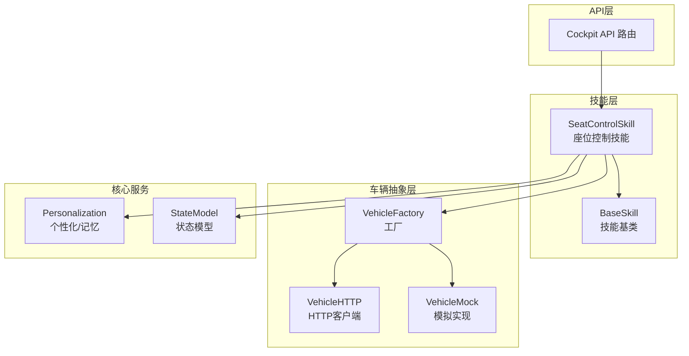
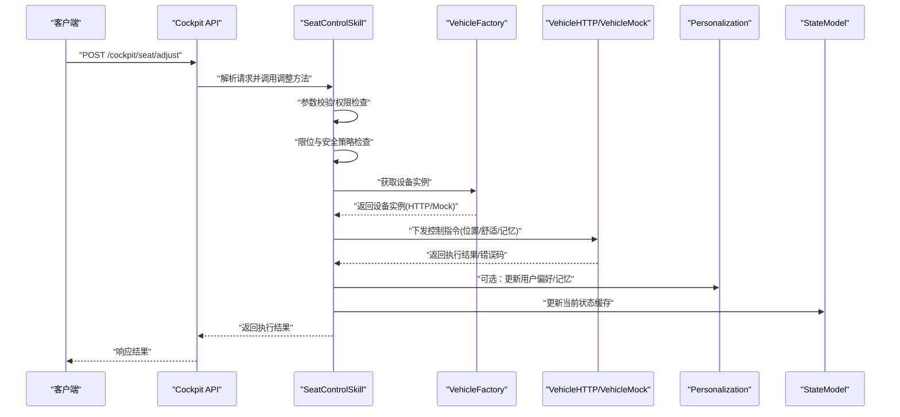
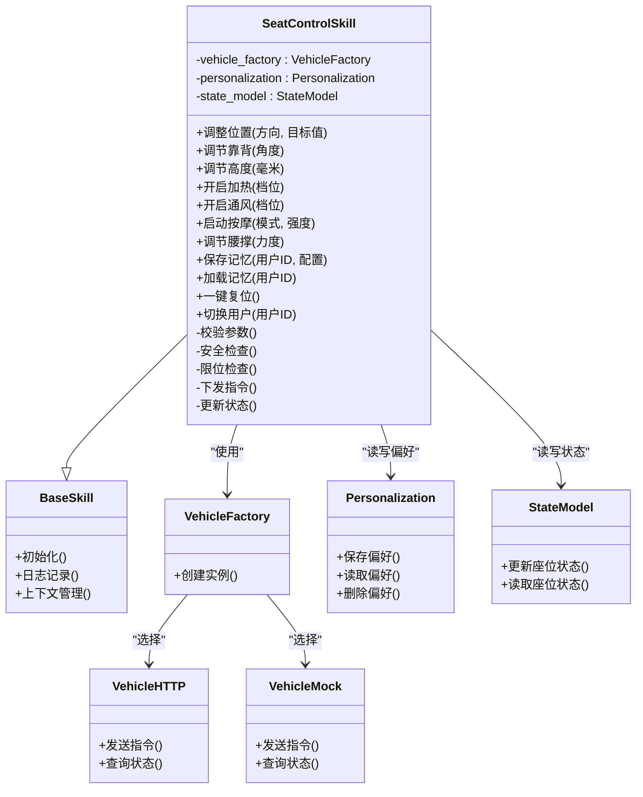
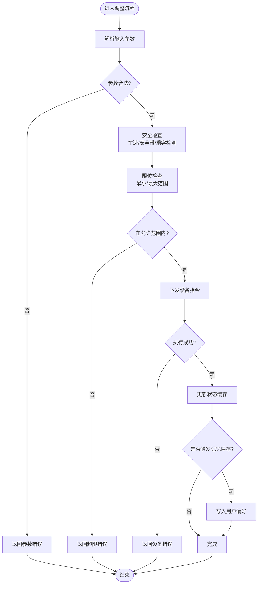
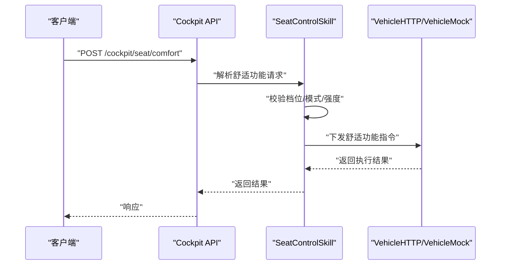
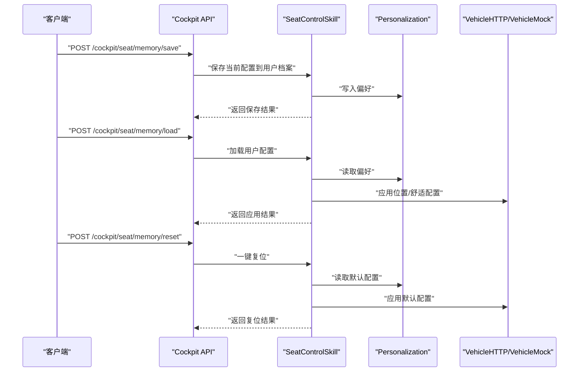
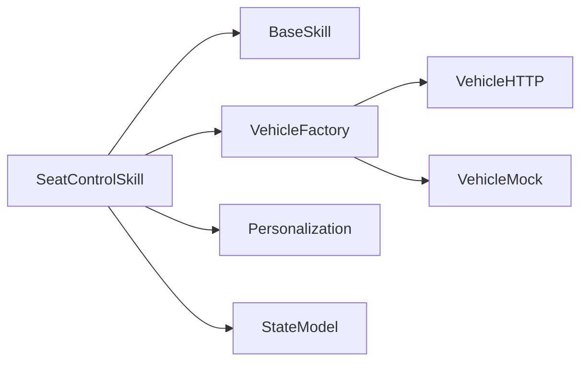

# 座椅控制操作

<cite>
**本文引用的文件**   
- [backend_design/nexus/skills/vehicle/seat.py](file://backend_design/nexus/skills/vehicle/seat.py)
- [backend_design/nexus/skills/base.py](file://backend_design/nexus/skills/base.py)
- [backend_design/nexus/vehicle/factory.py](file://backend_design/nexus/vehicle/factory.py)
- [backend_design/nexus/vehicle/http.py](file://backend_design/nexus/vehicle/http.py)
- [backend_design/nexus/vehicle/mock.py](file://backend_design/nexus/vehicle/mock.py)
- [backend_design/nexus/core/personalization.py](file://backend_design/nexus/core/personalization.py)
- [backend_design/nexus/models/state.py](file://backend_design/nexus/models/state.py)
- [backend_design/nexus/api/routes/cockpit.py](file://backend_design/nexus/api/routes/cockpit.py)
</cite>

## 目录
1. [简介](#简介)
2. [项目结构](#项目结构)
3. [核心组件](#核心组件)
4. [架构总览](#架构总览)
5. [详细组件分析](#详细组件分析)
6. [依赖关系分析](#依赖关系分析)
7. [性能考虑](#性能考虑)
8. [故障诊断与排错](#故障诊断与排错)
9. [结论](#结论)
10. [附录：API调用示例](#附录api调用示例)

## 简介
本技术文档聚焦于智能座椅控制能力，覆盖位置调节（前后移动、靠背角度、高度调节）、舒适性配置（加热通风、按摩、腰部支撑）以及记忆设置（用户配置文件、一键复位、多用户切换）。文档围绕 SeatControlSkill 的实现架构展开，说明电机控制接口、位置传感器数据读取与用户偏好管理，并提供完整的 API 调用示例与安全保护机制说明。

## 项目结构
与座椅控制相关的代码主要位于后端技能层与车辆抽象层：
- 技能层：SeatControlSkill 实现具体业务逻辑，协调车辆抽象层与个性化服务。
- 车辆抽象层：提供统一的车辆设备访问接口（HTTP/Mock），屏蔽底层差异。
- 个性化服务：负责用户偏好与记忆配置读写。
- API 路由：暴露 HTTP/WebSocket 入口供前端或语音系统调用。

**图示来源**
- [backend_design/nexus/skills/vehicle/seat.py](file://backend_design/nexus/skills/vehicle/seat.py)
- [backend_design/nexus/skills/base.py](file://backend_design/nexus/skills/base.py)
- [backend_design/nexus/vehicle/factory.py](file://backend_design/nexus/vehicle/factory.py)
- [backend_design/nexus/vehicle/http.py](file://backend_design/nexus/vehicle/http.py)
- [backend_design/nexus/vehicle/mock.py](file://backend_design/nexus/vehicle/mock.py)
- [backend_design/nexus/core/personalization.py](file://backend_design/nexus/core/personalization.py)
- [backend_design/nexus/models/state.py](file://backend_design/nexus/models/state.py)
- [backend_design/nexus/api/routes/cockpit.py](file://backend_design/nexus/api/routes/cockpit.py)

**章节来源**
- [backend_design/nexus/skills/vehicle/seat.py](file://backend_design/nexus/skills/vehicle/seat.py)
- [backend_design/nexus/skills/base.py](file://backend_design/nexus/skills/base.py)
- [backend_design/nexus/vehicle/factory.py](file://backend_design/nexus/vehicle/factory.py)
- [backend_design/nexus/vehicle/http.py](file://backend_design/nexus/vehicle/http.py)
- [backend_design/nexus/vehicle/mock.py](file://backend_design/nexus/vehicle/mock.py)
- [backend_design/nexus/core/personalization.py](file://backend_design/nexus/core/personalization.py)
- [backend_design/nexus/models/state.py](file://backend_design/nexus/models/state.py)
- [backend_design/nexus/api/routes/cockpit.py](file://backend_design/nexus/api/routes/cockpit.py)

## 核心组件
- SeatControlSkill：封装座椅相关的所有控制能力，包括位置调节、舒适功能与记忆管理。
- BaseSkill：技能基类，提供通用生命周期、上下文与日志等能力。
- VehicleFactory：根据运行环境选择真实 HTTP 客户端或 Mock 实现。
- VehicleHTTP/VehicleMock：统一车辆设备通信接口，屏蔽底层协议差异。
- Personalization：用户偏好与记忆配置的持久化与检索。
- StateModel：当前车辆/座舱状态的数据模型。
- Cockpit API：对外暴露的 HTTP 接口，用于接收并转发座椅控制请求。

**章节来源**
- [backend_design/nexus/skills/vehicle/seat.py](file://backend_design/nexus/skills/vehicle/seat.py)
- [backend_design/nexus/skills/base.py](file://backend_design/nexus/skills/base.py)
- [backend_design/nexus/vehicle/factory.py](file://backend_design/nexus/vehicle/factory.py)
- [backend_design/nexus/vehicle/http.py](file://backend_design/nexus/vehicle/http.py)
- [backend_design/nexus/vehicle/mock.py](file://backend_design/nexus/vehicle/mock.py)
- [backend_design/nexus/core/personalization.py](file://backend_design/nexus/core/personalization.py)
- [backend_design/nexus/models/state.py](file://backend_design/nexus/models/state.py)
- [backend_design/nexus/api/routes/cockpit.py](file://backend_design/nexus/api/routes/cockpit.py)

## 架构总览
下图展示了从 API 到座椅设备的端到端调用路径，包含安全校验、参数校验、限位检查、执行与结果回写。

**图示来源**
- [backend_design/nexus/api/routes/cockpit.py](file://backend_design/nexus/api/routes/cockpit.py)
- [backend_design/nexus/skills/vehicle/seat.py](file://backend_design/nexus/skills/vehicle/seat.py)
- [backend_design/nexus/vehicle/factory.py](file://backend_design/nexus/vehicle/factory.py)
- [backend_design/nexus/vehicle/http.py](file://backend_design/nexus/vehicle/http.py)
- [backend_design/nexus/vehicle/mock.py](file://backend_design/nexus/vehicle/mock.py)
- [backend_design/nexus/core/personalization.py](file://backend_design/nexus/core/personalization.py)
- [backend_design/nexus/models/state.py](file://backend_design/nexus/models/state.py)

## 详细组件分析

### SeatControlSkill 类设计
SeatControlSkill 作为座椅控制的中心编排器，职责包括：
- 解析与校验用户意图与参数
- 应用安全策略与限位约束
- 调度设备控制接口
- 管理用户偏好与记忆配置
- 维护与同步当前状态

**图示来源**
- [backend_design/nexus/skills/vehicle/seat.py](file://backend_design/nexus/skills/vehicle/seat.py)
- [backend_design/nexus/skills/base.py](file://backend_design/nexus/skills/base.py)
- [backend_design/nexus/vehicle/factory.py](file://backend_design/nexus/vehicle/factory.py)
- [backend_design/nexus/vehicle/http.py](file://backend_design/nexus/vehicle/http.py)
- [backend_design/nexus/vehicle/mock.py](file://backend_design/nexus/vehicle/mock.py)
- [backend_design/nexus/core/personalization.py](file://backend_design/nexus/core/personalization.py)
- [backend_design/nexus/models/state.py](file://backend_design/nexus/models/state.py)

**章节来源**
- [backend_design/nexus/skills/vehicle/seat.py](file://backend_design/nexus/skills/vehicle/seat.py)
- [backend_design/nexus/skills/base.py](file://backend_design/nexus/skills/base.py)
- [backend_design/nexus/vehicle/factory.py](file://backend_design/nexus/vehicle/factory.py)
- [backend_design/nexus/vehicle/http.py](file://backend_design/nexus/vehicle/http.py)
- [backend_design/nexus/vehicle/mock.py](file://backend_design/nexus/vehicle/mock.py)
- [backend_design/nexus/core/personalization.py](file://backend_design/nexus/core/personalization.py)
- [backend_design/nexus/models/state.py](file://backend_design/nexus/models/state.py)

### 位置调节流程（前后移动、靠背角度、高度）
该流程涵盖参数校验、安全与限位检查、设备指令下发与结果回写。

**图示来源**
- [backend_design/nexus/skills/vehicle/seat.py](file://backend_design/nexus/skills/vehicle/seat.py)
- [backend_design/nexus/core/personalization.py](file://backend_design/nexus/core/personalization.py)
- [backend_design/nexus/models/state.py](file://backend_design/nexus/models/state.py)

**章节来源**
- [backend_design/nexus/skills/vehicle/seat.py](file://backend_design/nexus/skills/vehicle/seat.py)
- [backend_design/nexus/core/personalization.py](file://backend_design/nexus/core/personalization.py)
- [backend_design/nexus/models/state.py](file://backend_design/nexus/models/state.py)

### 舒适性配置（加热、通风、按摩、腰撑）
- 加热/通风：支持档位控制，具备温度/风量上限与超时保护。
- 按摩：支持多种模式与强度，具备连续工作时长限制。
- 腰撑：支持力度分级与左右分区控制。

**图示来源**
- [backend_design/nexus/api/routes/cockpit.py](file://backend_design/nexus/api/routes/cockpit.py)
- [backend_design/nexus/skills/vehicle/seat.py](file://backend_design/nexus/skills/vehicle/seat.py)
- [backend_design/nexus/vehicle/http.py](file://backend_design/nexus/vehicle/http.py)
- [backend_design/nexus/vehicle/mock.py](file://backend_design/nexus/vehicle/mock.py)

**章节来源**
- [backend_design/nexus/skills/vehicle/seat.py](file://backend_design/nexus/skills/vehicle/seat.py)
- [backend_design/nexus/vehicle/http.py](file://backend_design/nexus/vehicle/http.py)
- [backend_design/nexus/vehicle/mock.py](file://backend_design/nexus/vehicle/mock.py)
- [backend_design/nexus/api/routes/cockpit.py](file://backend_design/nexus/api/routes/cockpit.py)

### 记忆设置（用户配置、一键复位、多用户切换）
- 用户配置文件：按用户 ID 存储位置与舒适配置快照。
- 一键复位：将当前用户配置恢复至默认或上次保存位置。
- 多用户切换：切换当前会话用户后自动加载对应配置。

**图示来源**
- [backend_design/nexus/api/routes/cockpit.py](file://backend_design/nexus/api/routes/cockpit.py)
- [backend_design/nexus/skills/vehicle/seat.py](file://backend_design/nexus/skills/vehicle/seat.py)
- [backend_design/nexus/core/personalization.py](file://backend_design/nexus/core/personalization.py)
- [backend_design/nexus/vehicle/http.py](file://backend_design/nexus/vehicle/http.py)
- [backend_design/nexus/vehicle/mock.py](file://backend_design/nexus/vehicle/mock.py)

**章节来源**
- [backend_design/nexus/skills/vehicle/seat.py](file://backend_design/nexus/skills/vehicle/seat.py)
- [backend_design/nexus/core/personalization.py](file://backend_design/nexus/core/personalization.py)
- [backend_design/nexus/vehicle/http.py](file://backend_design/nexus/vehicle/http.py)
- [backend_design/nexus/vehicle/mock.py](file://backend_design/nexus/vehicle/mock.py)
- [backend_design/nexus/api/routes/cockpit.py](file://backend_design/nexus/api/routes/cockpit.py)

## 依赖关系分析
SeatControlSkill 通过工厂模式解耦设备访问，结合个性化服务与状态模型，形成清晰的分层与职责边界。

**图示来源**
- [backend_design/nexus/skills/vehicle/seat.py](file://backend_design/nexus/skills/vehicle/seat.py)
- [backend_design/nexus/skills/base.py](file://backend_design/nexus/skills/base.py)
- [backend_design/nexus/vehicle/factory.py](file://backend_design/nexus/vehicle/factory.py)
- [backend_design/nexus/vehicle/http.py](file://backend_design/nexus/vehicle/http.py)
- [backend_design/nexus/vehicle/mock.py](file://backend_design/nexus/vehicle/mock.py)
- [backend_design/nexus/core/personalization.py](file://backend_design/nexus/core/personalization.py)
- [backend_design/nexus/models/state.py](file://backend_design/nexus/models/state.py)

**章节来源**
- [backend_design/nexus/skills/vehicle/seat.py](file://backend_design/nexus/skills/vehicle/seat.py)
- [backend_design/nexus/vehicle/factory.py](file://backend_design/nexus/vehicle/factory.py)
- [backend_design/nexus/core/personalization.py](file://backend_design/nexus/core/personalization.py)
- [backend_design/nexus/models/state.py](file://backend_design/nexus/models/state.py)

## 性能考虑
- 批量操作合并：将多个调节动作合并为一次设备调用，减少总线负载。
- 异步执行与回调：对耗时操作采用异步处理，避免阻塞主线程。
- 限流与去抖：对高频调节请求进行限流与去抖，防止设备过载。
- 缓存热点配置：常用用户配置缓存于内存，降低持久化 I/O 压力。
- 状态增量更新：仅更新变更字段，减少状态同步开销。

[本节为通用指导，不直接分析具体文件]

## 故障诊断与排错
- 常见错误分类
  - 参数错误：越界、非法档位、缺失必填项。
  - 安全拦截：车速过高、未系安全带、检测到儿童座椅。
  - 设备异常：通信超时、设备离线、执行失败。
  - 权限不足：非授权用户或租户。
- 诊断要点
  - 检查限位与安全策略日志。
  - 查看设备返回的错误码与重试次数。
  - 确认用户偏好是否存在且格式正确。
  - 验证网络连通性与设备心跳状态。
- 恢复建议
  - 降级到 Mock 模式进行回归测试。
  - 重置用户配置到默认值。
  - 重启设备连接通道并重试。

**章节来源**
- [backend_design/nexus/skills/vehicle/seat.py](file://backend_design/nexus/skills/vehicle/seat.py)
- [backend_design/nexus/vehicle/http.py](file://backend_design/nexus/vehicle/http.py)
- [backend_design/nexus/vehicle/mock.py](file://backend_design/nexus/vehicle/mock.py)
- [backend_design/nexus/core/personalization.py](file://backend_design/nexus/core/personalization.py)

## 结论
SeatControlSkill 以清晰的职责分层与安全的策略控制为核心，提供了完整的座椅控制能力。通过工厂模式与统一设备接口，系统具备良好的可扩展性与可测试性；配合个性化服务与状态模型，实现了用户记忆与实时状态的一致性。建议在后续迭代中完善监控指标与告警规则，进一步提升系统的稳定性与可观测性。

[本节为总结性内容，不直接分析具体文件]

## 附录：API调用示例
以下为典型场景的 API 调用示例（基于 REST 风格，实际字段以接口定义为准）：

- 前后移动
  - 请求：POST /cockpit/seat/adjust
  - 主体字段：direction="forward"/"backward", target=数值
  - 预期：返回执行结果与当前状态

- 靠背角度调节
  - 请求：POST /cockpit/seat/backrest
  - 主体字段：angle=度数
  - 预期：返回执行结果与当前状态

- 高度调节
  - 请求：POST /cockpit/seat/height
  - 主体字段：mm=毫米数
  - 预期：返回执行结果与当前状态

- 加热/通风
  - 请求：POST /cockpit/seat/comfort
  - 主体字段：type="heat"/"ventilation", level=档位
  - 预期：返回执行结果与当前状态

- 按摩
  - 请求：POST /cockpit/seat/massage
  - 主体字段：mode=模式, intensity=强度
  - 预期：返回执行结果与当前状态

- 腰撑
  - 请求：POST /cockpit/seat/lumbar
  - 主体字段：force=力度, side="left"/"right"
  - 预期：返回执行结果与当前状态

- 记忆保存/加载/复位
  - 保存：POST /cockpit/seat/memory/save {user_id, config}
  - 加载：POST /cockpit/seat/memory/load {user_id}
  - 复位：POST /cockpit/seat/memory/reset {user_id}

- 多用户切换
  - 请求：POST /cockpit/seat/user/switch
  - 主体字段：user_id
  - 预期：返回新用户的已加载配置与当前状态

**章节来源**
- [backend_design/nexus/api/routes/cockpit.py](file://backend_design/nexus/api/routes/cockpit.py)
- [backend_design/nexus/skills/vehicle/seat.py](file://backend_design/nexus/skills/vehicle/seat.py)
- [backend_design/nexus/core/personalization.py](file://backend_design/nexus/core/personalization.py)
- [backend_design/nexus/models/state.py](file://backend_design/nexus/models/state.py)