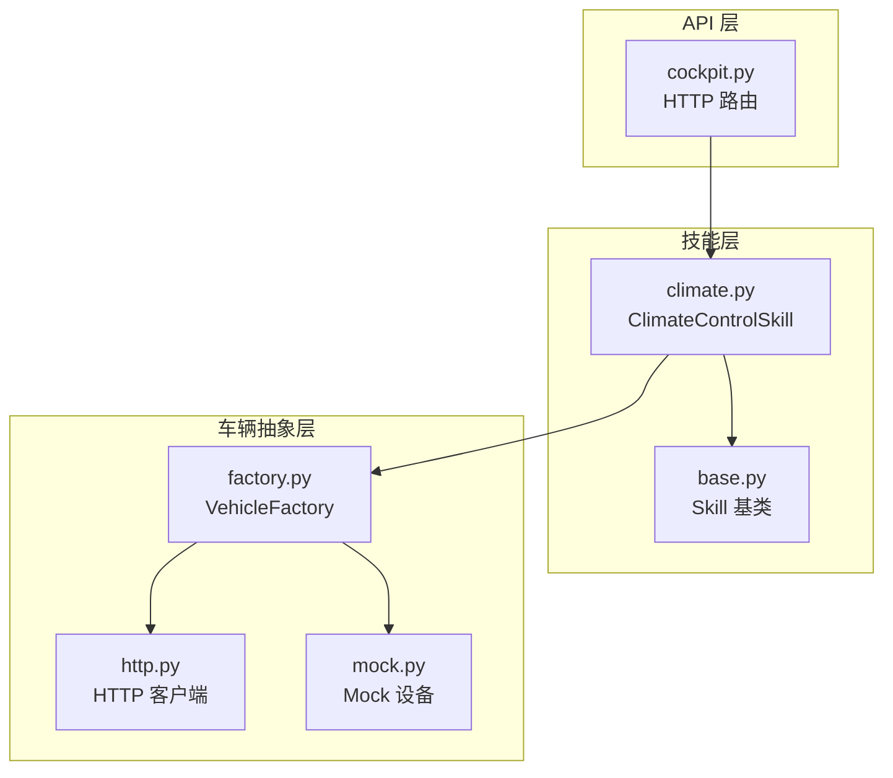
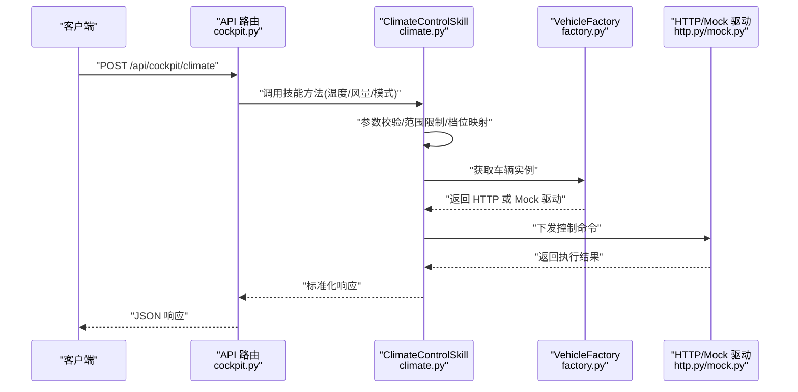
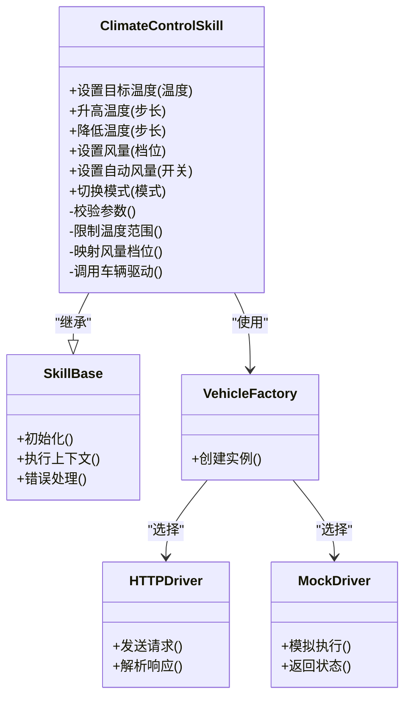
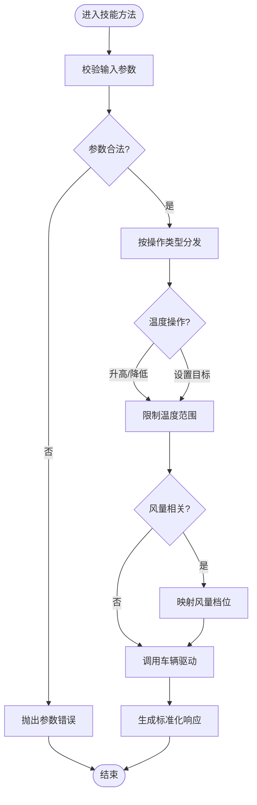
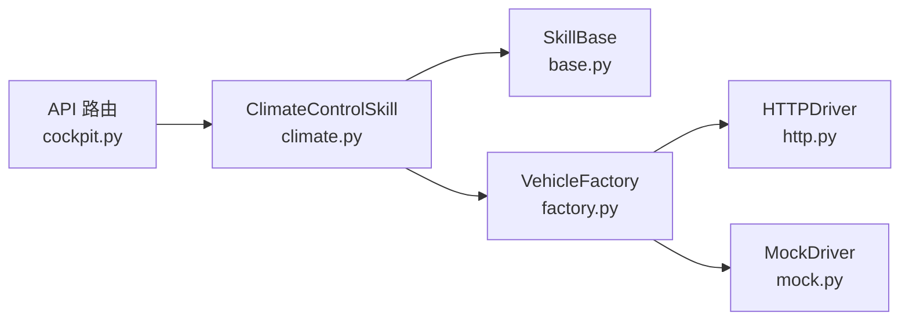

# 气候控制操作

<cite>
**本文引用的文件**   
- [backend_design/nexus/skills/vehicle/climate.py](file://backend_design/nexus/skills/vehicle/climate.py)
- [backend_design/nexus/skills/base.py](file://backend_design/nexus/skills/base.py)
- [backend_design/nexus/vehicle/factory.py](file://backend_design/nexus/vehicle/factory.py)
- [backend_design/nexus/vehicle/http.py](file://backend_design/nexus/vehicle/http.py)
- [backend_design/nexus/vehicle/mock.py](file://backend_design/nexus/vehicle/mock.py)
- [backend_design/nexus/api/routes/cockpit.py](file://backend_design/nexus/api/routes/cockpit.py)
- [backend_design/nexus/core/exceptions.py](file://backend_design/nexus/core/exceptions.py)
</cite>

## 目录
1. [简介](#简介)
2. [项目结构](#项目结构)
3. [核心组件](#核心组件)
4. [架构总览](#架构总览)
5. [详细组件分析](#详细组件分析)
6. [依赖关系分析](#依赖关系分析)
7. [性能考虑](#性能考虑)
8. [故障排查指南](#故障排查指南)
9. [结论](#结论)
10. [附录](#附录)

## 简介
本技术文档聚焦于“气候控制操作”，围绕空调系统的温度调节（升高/降低、设置目标温度）、风量控制（档位调节、自动风量）与模式切换（自动/制冷/制热）展开。重点解析 ClimateControlSkill 的实现原理，包括参数校验、操作类型分发、温度范围限制与风量档位映射；并提供完整的 API 调用示例与异常处理机制说明，确保系统稳定与安全。

## 项目结构
与气候控制相关的代码主要位于后端技能层与车辆抽象层：
- 技能实现：skills/vehicle/climate.py
- 技能基类：skills/base.py
- 车辆驱动抽象与工厂：vehicle/factory.py, vehicle/http.py, vehicle/mock.py
- API 路由入口：api/routes/cockpit.py
- 通用异常定义：core/exceptions.py

图表来源
- [backend_design/nexus/api/routes/cockpit.py](file://backend_design/nexus/api/routes/cockpit.py)
- [backend_design/nexus/skills/vehicle/climate.py](file://backend_design/nexus/skills/vehicle/climate.py)
- [backend_design/nexus/skills/base.py](file://backend_design/nexus/skills/base.py)
- [backend_design/nexus/vehicle/factory.py](file://backend_design/nexus/vehicle/factory.py)
- [backend_design/nexus/vehicle/http.py](file://backend_design/nexus/vehicle/http.py)
- [backend_design/nexus/vehicle/mock.py](file://backend_design/nexus/vehicle/mock.py)

章节来源
- [backend_design/nexus/skills/vehicle/climate.py](file://backend_design/nexus/skills/vehicle/climate.py)
- [backend_design/nexus/skills/base.py](file://backend_design/nexus/skills/base.py)
- [backend_design/nexus/vehicle/factory.py](file://backend_design/nexus/vehicle/factory.py)
- [backend_design/nexus/vehicle/http.py](file://backend_design/nexus/vehicle/http.py)
- [backend_design/nexus/vehicle/mock.py](file://backend_design/nexus/vehicle/mock.py)
- [backend_design/nexus/api/routes/cockpit.py](file://backend_design/nexus/api/routes/cockpit.py)

## 核心组件
- ClimateControlSkill：封装空调控制的业务逻辑，负责参数校验、操作分发、温度边界约束与风量档位映射，并调用底层车辆接口执行。
- Skill 基类：提供统一的技能生命周期、上下文与错误处理约定。
- VehicleFactory：根据配置或运行时环境选择 HTTP 或 Mock 设备驱动。
- HTTP/Mock 驱动：分别对接真实车载服务或本地模拟设备。
- API 路由：暴露 REST 接口，接收用户指令并转发至对应技能。

章节来源
- [backend_design/nexus/skills/vehicle/climate.py](file://backend_design/nexus/skills/vehicle/climate.py)
- [backend_design/nexus/skills/base.py](file://backend_design/nexus/skills/base.py)
- [backend_design/nexus/vehicle/factory.py](file://backend_design/nexus/vehicle/factory.py)
- [backend_design/nexus/vehicle/http.py](file://backend_design/nexus/vehicle/http.py)
- [backend_design/nexus/vehicle/mock.py](file://backend_design/nexus/vehicle/mock.py)

## 架构总览
下图展示了从 API 到技能再到车辆驱动的完整调用链路。

图表来源
- [backend_design/nexus/api/routes/cockpit.py](file://backend_design/nexus/api/routes/cockpit.py)
- [backend_design/nexus/skills/vehicle/climate.py](file://backend_design/nexus/skills/vehicle/climate.py)
- [backend_design/nexus/vehicle/factory.py](file://backend_design/nexus/vehicle/factory.py)
- [backend_design/nexus/vehicle/http.py](file://backend_design/nexus/vehicle/http.py)
- [backend_design/nexus/vehicle/mock.py](file://backend_design/nexus/vehicle/mock.py)

## 详细组件分析

### ClimateControlSkill 类设计
- 职责
  - 参数校验：检查输入字段存在性与合法性（如温度数值、风量档位、模式枚举）。
  - 操作分发：根据操作类型（升高/降低/设置温度、调节风量、切换模式）路由到具体处理方法。
  - 范围约束：对目标温度进行上下限裁剪，避免越界。
  - 档位映射：将用户输入的风量档位映射为设备可识别的档位值。
  - 调用驱动：通过 VehicleFactory 获取驱动实例并执行控制。
  - 统一响应：将不同驱动的结果转换为标准 JSON 格式返回。

图表来源
- [backend_design/nexus/skills/vehicle/climate.py](file://backend_design/nexus/skills/vehicle/climate.py)
- [backend_design/nexus/skills/base.py](file://backend_design/nexus/skills/base.py)
- [backend_design/nexus/vehicle/factory.py](file://backend_design/nexus/vehicle/factory.py)
- [backend_design/nexus/vehicle/http.py](file://backend_design/nexus/vehicle/http.py)
- [backend_design/nexus/vehicle/mock.py](file://backend_design/nexus/vehicle/mock.py)

章节来源
- [backend_design/nexus/skills/vehicle/climate.py](file://backend_design/nexus/skills/vehicle/climate.py)
- [backend_design/nexus/skills/base.py](file://backend_design/nexus/skills/base.py)

#### 参数验证与操作类型处理流程

图表来源
- [backend_design/nexus/skills/vehicle/climate.py](file://backend_design/nexus/skills/vehicle/climate.py)

章节来源
- [backend_design/nexus/skills/vehicle/climate.py](file://backend_design/nexus/skills/vehicle/climate.py)

### API 调用示例
以下示例展示常见气候控制场景的请求与响应结构。请根据实际部署替换主机地址与端口。

- 设置目标温度
  - 请求
    - 方法：POST
    - 路径：/api/cockpit/climate
    - 主体字段：operation="set_temperature", temperature=24.5
  - 响应
    - 成功：包含 status="ok" 与当前温度、目标温度等摘要信息
    - 失败：包含 error_code 与 message 描述

- 升高/降低温度
  - 请求
    - 方法：POST
    - 路径：/api/cockpit/climate
    - 主体字段：operation="increase_temperature"/"decrease_temperature", step=0.5
  - 响应
    - 成功：返回新温度与操作结果
    - 失败：返回越界或设备不可用等错误码

- 设置风量档位
  - 请求
    - 方法：POST
    - 路径：/api/cockpit/climate
    - 主体字段：operation="set_fan_speed", fan_level=3
  - 响应
    - 成功：返回当前风量档位
    - 失败：返回非法档位或设备错误

- 自动风量
  - 请求
    - 方法：POST
    - 路径：/api/cockpit/climate
    - 主体字段：operation="auto_fan", enabled=true/false
  - 响应
    - 成功：返回自动风量状态
    - 失败：返回不支持或设备错误

- 切换模式
  - 请求
    - 方法：POST
    - 路径：/api/cockpit/climate
    - 主体字段：operation="set_mode", mode="auto"/"cool"/"heat"
  - 响应
    - 成功：返回当前模式
    - 失败：返回非法模式或设备错误

章节来源
- [backend_design/nexus/api/routes/cockpit.py](file://backend_design/nexus/api/routes/cockpit.py)
- [backend_design/nexus/skills/vehicle/climate.py](file://backend_design/nexus/skills/vehicle/climate.py)

### 异常处理与错误恢复策略
- 参数错误
  - 触发条件：缺少必填字段、类型不匹配、超出允许范围
  - 行为：立即返回错误响应，不进行设备调用
- 设备通信错误
  - 触发条件：网络超时、设备无响应、协议不一致
  - 行为：记录日志并返回设备错误码；上层可进行重试或降级
- 设备状态异常
  - 触发条件：设备处于锁定、维护或保护状态
  - 行为：返回特定错误码，提示用户稍后重试
- 恢复策略
  - 幂等性：同一操作多次提交应得到一致结果
  - 重试与退避：对瞬时错误采用指数退避重试
  - 降级：在设备不可用时回退到 Mock 驱动或缓存状态
  - 熔断：连续失败达到阈值时快速失败，避免雪崩

章节来源
- [backend_design/nexus/core/exceptions.py](file://backend_design/nexus/core/exceptions.py)
- [backend_design/nexus/vehicle/http.py](file://backend_design/nexus/vehicle/http.py)
- [backend_design/nexus/vehicle/mock.py](file://backend_design/nexus/vehicle/mock.py)

## 依赖关系分析
- 耦合与内聚
  - ClimateControlSkill 与 SkillBase 高内聚，职责清晰
  - 通过 VehicleFactory 解耦具体驱动实现，提升可测试性与可替换性
- 外部依赖
  - HTTP 驱动依赖网络与车载服务
  - Mock 驱动用于开发与联调阶段
- 潜在循环依赖
  - 当前分层清晰，未见循环导入风险

图表来源
- [backend_design/nexus/api/routes/cockpit.py](file://backend_design/nexus/api/routes/cockpit.py)
- [backend_design/nexus/skills/vehicle/climate.py](file://backend_design/nexus/skills/vehicle/climate.py)
- [backend_design/nexus/skills/base.py](file://backend_design/nexus/skills/base.py)
- [backend_design/nexus/vehicle/factory.py](file://backend_design/nexus/vehicle/factory.py)
- [backend_design/nexus/vehicle/http.py](file://backend_design/nexus/vehicle/http.py)
- [backend_design/nexus/vehicle/mock.py](file://backend_design/nexus/vehicle/mock.py)

章节来源
- [backend_design/nexus/vehicle/factory.py](file://backend_design/nexus/vehicle/factory.py)
- [backend_design/nexus/vehicle/http.py](file://backend_design/nexus/vehicle/http.py)
- [backend_design/nexus/vehicle/mock.py](file://backend_design/nexus/vehicle/mock.py)

## 性能考虑
- 参数校验前置：减少无效设备调用，降低网络开销
- 批量操作合并：若支持，合并多个控制指令以减少往返
- 连接复用：HTTP 驱动使用连接池，提高并发能力
- 超时与重试：合理设置超时与最大重试次数，避免长时间阻塞
- 降级与缓存：设备不可用时返回最近已知状态，保障用户体验

[本节为通用指导，无需源码引用]

## 故障排查指南
- 常见问题
  - 参数错误：检查 operation、temperature、fan_level、mode 等字段是否齐全且合法
  - 设备不可达：确认网络连接、车载服务状态与认证凭据
  - 模式冲突：某些模式下不允许调整风量或温度，需先切换到兼容模式
- 定位步骤
  - 查看 API 层日志，确认请求体与路由命中
  - 检查技能层日志，关注参数校验与范围限制结果
  - 观察驱动层日志，确认 HTTP 请求与响应内容
- 恢复建议
  - 修正参数后重试
  - 等待设备恢复或切换至 Mock 驱动进行验证
  - 启用熔断与降级策略，避免级联故障

章节来源
- [backend_design/nexus/core/exceptions.py](file://backend_design/nexus/core/exceptions.py)
- [backend_design/nexus/vehicle/http.py](file://backend_design/nexus/vehicle/http.py)
- [backend_design/nexus/vehicle/mock.py](file://backend_design/nexus/vehicle/mock.py)

## 结论
ClimateControlSkill 以清晰的职责划分与严格的参数校验为核心，结合温度范围限制与风量档位映射，实现了稳定的空调控制能力。通过 VehicleFactory 的驱动抽象，系统具备良好的可扩展性与可测试性。配合完善的异常处理与恢复策略，可在复杂环境下保持高可用与安全性。

[本节为总结，无需源码引用]

## 附录
- 术语
  - 操作类型：指代具体的控制动作，如设置温度、调节风量、切换模式等
  - 档位映射：将用户输入的风量等级转换为设备内部表示
  - 熔断：在连续失败时快速失败，防止故障扩散
- 最佳实践
  - 始终对输入进行严格校验
  - 对设备调用增加超时与重试
  - 在开发阶段优先使用 Mock 驱动进行端到端验证

[本节为补充信息，无需源码引用]