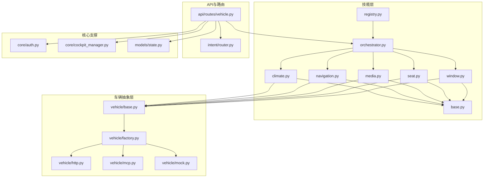
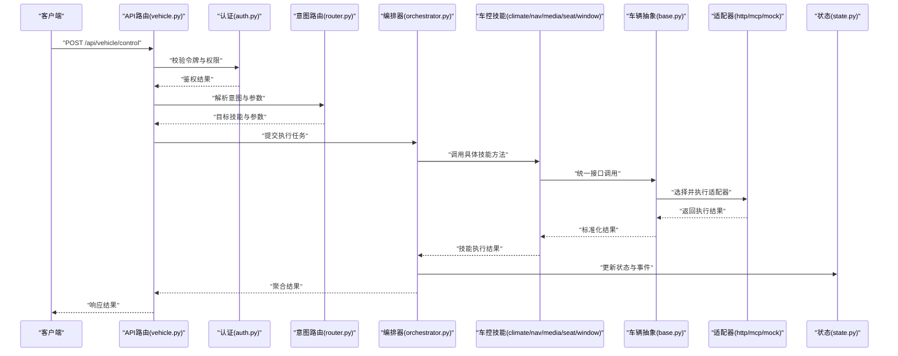
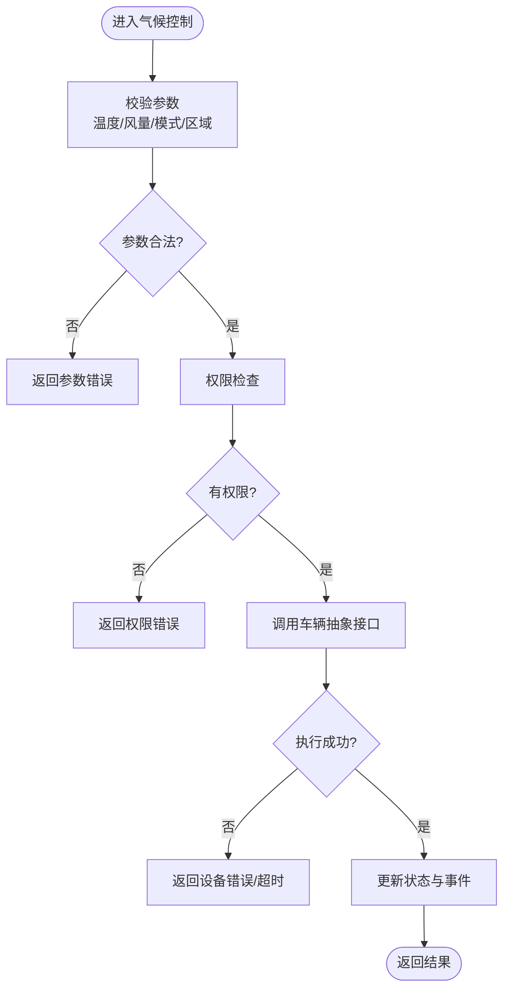
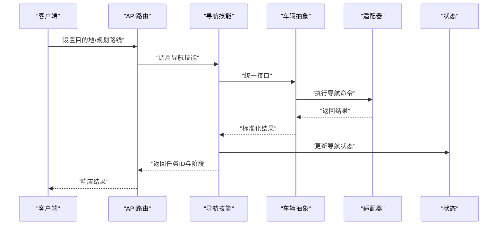
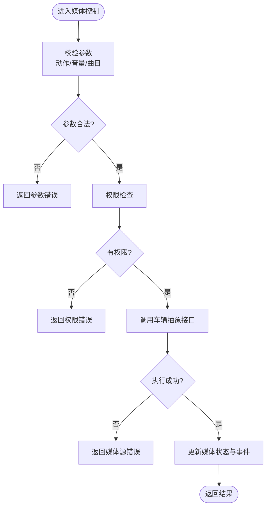
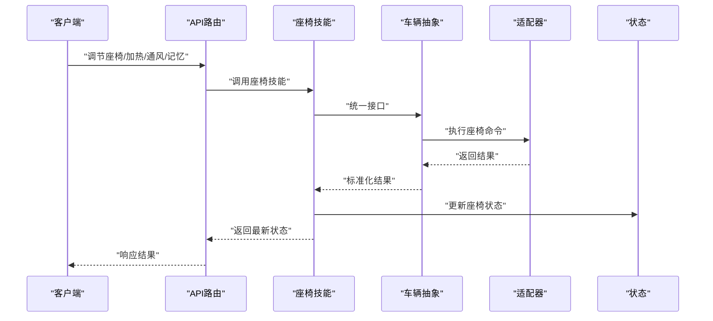
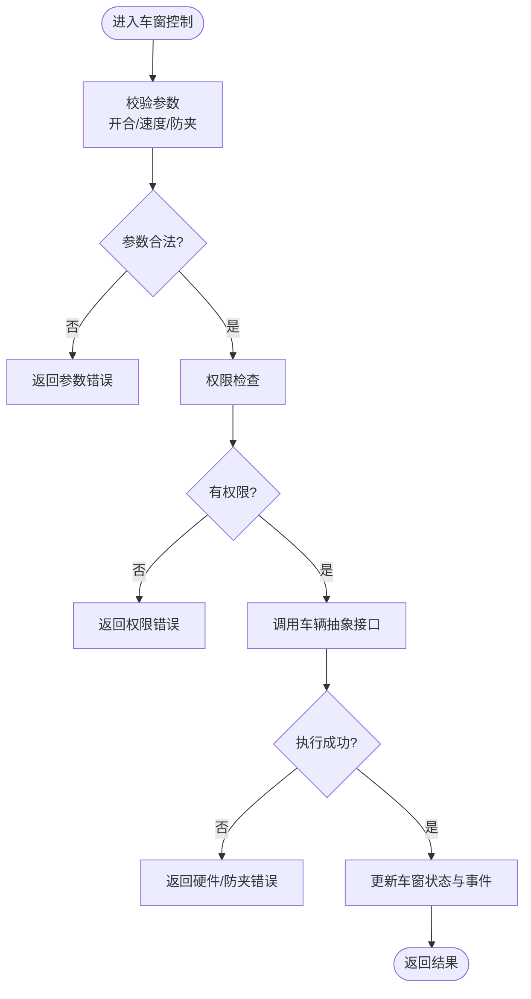
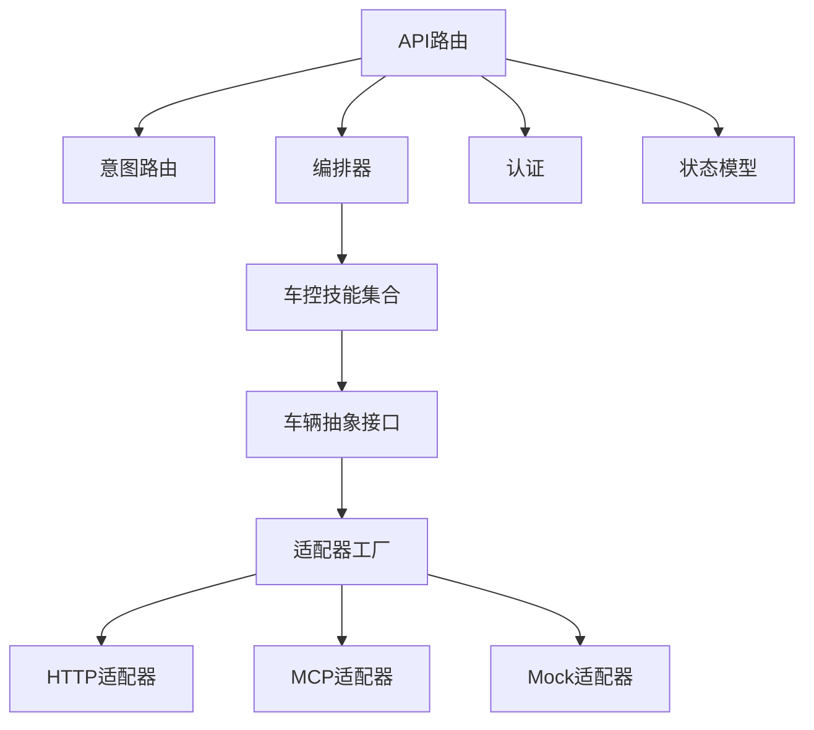

# 车控操作实现

<cite>
**本文引用的文件**   
- [backend_design/nexus/skills/vehicle/climate.py](file://backend_design/nexus/skills/vehicle/climate.py)
- [backend_design/nexus/skills/vehicle/navigation.py](file://backend_design/nexus/skills/vehicle/navigation.py)
- [backend_design/nexus/skills/vehicle/media.py](file://backend_design/nexus/skills/vehicle/media.py)
- [backend_design/nexus/skills/vehicle/seat.py](file://backend_design/nexus/skills/vehicle/seat.py)
- [backend_design/nexus/skills/vehicle/window.py](file://backend_design/nexus/skills/vehicle/window.py)
- [backend_design/nexus/skills/base.py](file://backend_design/nexus/skills/base.py)
- [backend_design/nexus/skills/orchestrator.py](file://backend_design/nexus/skills/orchestrator.py)
- [backend_design/nexus/skills/registry.py](file://backend_design/nexus/skills/registry.py)
- [backend_design/nexus/vehicle/base.py](file://backend_design/nexus/vehicle/base.py)
- [backend_design/nexus/vehicle/factory.py](file://backend_design/nexus/vehicle/factory.py)
- [backend_design/nexus/vehicle/http.py](file://backend_design/nexus/vehicle/http.py)
- [backend_design/nexus/vehicle/mcp.py](file://backend_design/nexus/vehicle/mcp.py)
- [backend_design/nexus/vehicle/mock.py](file://backend_design/nexus/vehicle/mock.py)
- [backend_design/nexus/api/routes/vehicle.py](file://backend_design/nexus/api/routes/vehicle.py)
- [backend_design/nexus/core/auth.py](file://backend_design/nexus/core/auth.py)
- [backend_design/nexus/core/cockpit_manager.py](file://backend_design/nexus/core/cockpit_manager.py)
- [backend_design/nexus/models/state.py](file://backend_design/nexus/models/state.py)
- [backend_design/nexus/intent/router.py](file://backend_design/nexus/intent/router.py)
</cite>

## 目录
1. [简介](#简介)
2. [项目结构](#项目结构)
3. [核心组件](#核心组件)
4. [架构总览](#架构总览)
5. [详细组件分析](#详细组件分析)
6. [依赖关系分析](#依赖关系分析)
7. [性能考虑](#性能考虑)
8. [故障排查指南](#故障排查指南)
9. [结论](#结论)
10. [附录](#附录)

## 简介
本技术文档聚焦于“车控操作”的实现，覆盖五大核心功能：气候控制、导航控制、媒体控制、座椅控制与车窗控制。文档从系统架构、组件职责、数据流、处理逻辑、集成点、错误处理与性能特性等维度进行系统化阐述，并提供API调用示例与错误处理方案，同时给出安全考虑与异常恢复策略，帮助读者快速理解并正确使用车控能力。

## 项目结构
车控相关代码主要位于后端设计目录的 skills（技能层）与 vehicle（车辆抽象层），并通过 API 路由暴露给上层应用。整体组织方式采用“按领域划分”的技能模块，每个车控域对应一个独立文件；底层通过统一的车辆抽象接口适配多种通信协议（HTTP/MCP/Mock）。

图表来源
- [backend_design/nexus/skills/vehicle/climate.py](file://backend_design/nexus/skills/vehicle/climate.py)
- [backend_design/nexus/skills/vehicle/navigation.py](file://backend_design/nexus/skills/vehicle/navigation.py)
- [backend_design/nexus/skills/vehicle/media.py](file://backend_design/nexus/skills/vehicle/media.py)
- [backend_design/nexus/skills/vehicle/seat.py](file://backend_design/nexus/skills/vehicle/seat.py)
- [backend_design/nexus/skills/vehicle/window.py](file://backend_design/nexus/skills/vehicle/window.py)
- [backend_design/nexus/skills/base.py](file://backend_design/nexus/skills/base.py)
- [backend_design/nexus/skills/orchestrator.py](file://backend_design/nexus/skills/orchestrator.py)
- [backend_design/nexus/skills/registry.py](file://backend_design/nexus/skills/registry.py)
- [backend_design/nexus/vehicle/base.py](file://backend_design/nexus/vehicle/base.py)
- [backend_design/nexus/vehicle/factory.py](file://backend_design/nexus/vehicle/factory.py)
- [backend_design/nexus/vehicle/http.py](file://backend_design/nexus/vehicle/http.py)
- [backend_design/nexus/vehicle/mcp.py](file://backend_design/nexus/vehicle/mcp.py)
- [backend_design/nexus/vehicle/mock.py](file://backend_design/nexus/vehicle/mock.py)
- [backend_design/nexus/api/routes/vehicle.py](file://backend_design/nexus/api/routes/vehicle.py)
- [backend_design/nexus/intent/router.py](file://backend_design/nexus/intent/router.py)
- [backend_design/nexus/core/auth.py](file://backend_design/nexus/core/auth.py)
- [backend_design/nexus/core/cockpit_manager.py](file://backend_design/nexus/core/cockpit_manager.py)
- [backend_design/nexus/models/state.py](file://backend_design/nexus/models/state.py)

章节来源
- [backend_design/nexus/skills/vehicle/climate.py](file://backend_design/nexus/skills/vehicle/climate.py)
- [backend_design/nexus/skills/vehicle/navigation.py](file://backend_design/nexus/skills/vehicle/navigation.py)
- [backend_design/nexus/skills/vehicle/media.py](file://backend_design/nexus/skills/vehicle/media.py)
- [backend_design/nexus/skills/vehicle/seat.py](file://backend_design/nexus/skills/vehicle/seat.py)
- [backend_design/nexus/skills/vehicle/window.py](file://backend_design/nexus/skills/vehicle/window.py)
- [backend_design/nexus/skills/base.py](file://backend_design/nexus/skills/base.py)
- [backend_design/nexus/skills/orchestrator.py](file://backend_design/nexus/skills/orchestrator.py)
- [backend_design/nexus/skills/registry.py](file://backend_design/nexus/skills/registry.py)
- [backend_design/nexus/vehicle/base.py](file://backend_design/nexus/vehicle/base.py)
- [backend_design/nexus/vehicle/factory.py](file://backend_design/nexus/vehicle/factory.py)
- [backend_design/nexus/vehicle/http.py](file://backend_design/nexus/vehicle/http.py)
- [backend_design/nexus/vehicle/mcp.py](file://backend_design/nexus/vehicle/mcp.py)
- [backend_design/nexus/vehicle/mock.py](file://backend_design/nexus/vehicle/mock.py)
- [backend_design/nexus/api/routes/vehicle.py](file://backend_design/nexus/api/routes/vehicle.py)
- [backend_design/nexus/intent/router.py](file://backend_design/nexus/intent/router.py)
- [backend_design/nexus/core/auth.py](file://backend_design/nexus/core/auth.py)
- [backend_design/nexus/core/cockpit_manager.py](file://backend_design/nexus/core/cockpit_manager.py)
- [backend_design/nexus/models/state.py](file://backend_design/nexus/models/state.py)

## 核心组件
- 技能基类与注册器
  - 提供统一的能力描述、参数校验、权限检查与状态同步钩子。
  - 注册器负责将各车控技能加载到编排器中，供意图路由分发。
- 编排器
  - 协调多个技能的执行顺序与结果聚合，支持事务性语义与回滚策略。
- 车辆抽象层
  - 定义统一的车辆控制接口，具体实现包括HTTP、MCP与Mock三种适配器，便于在不同部署环境切换。
- API路由
  - 暴露REST接口，承载鉴权、参数校验、意图解析、调用编排与响应封装。
- 核心支撑
  - 认证授权、座舱上下文管理、状态模型用于权限判定、会话隔离与状态一致性。

章节来源
- [backend_design/nexus/skills/base.py](file://backend_design/nexus/skills/base.py)
- [backend_design/nexus/skills/registry.py](file://backend_design/nexus/skills/registry.py)
- [backend_design/nexus/skills/orchestrator.py](file://backend_design/nexus/skills/orchestrator.py)
- [backend_design/nexus/vehicle/base.py](file://backend_design/nexus/vehicle/base.py)
- [backend_design/nexus/vehicle/factory.py](file://backend_design/nexus/vehicle/factory.py)
- [backend_design/nexus/vehicle/http.py](file://backend_design/nexus/vehicle/http.py)
- [backend_design/nexus/vehicle/mcp.py](file://backend_design/nexus/vehicle/mcp.py)
- [backend_design/nexus/vehicle/mock.py](file://backend_design/nexus/vehicle/mock.py)
- [backend_design/nexus/api/routes/vehicle.py](file://backend_design/nexus/api/routes/vehicle.py)
- [backend_design/nexus/core/auth.py](file://backend_design/nexus/core/auth.py)
- [backend_design/nexus/core/cockpit_manager.py](file://backend_design/nexus/core/cockpit_manager.py)
- [backend_design/nexus/models/state.py](file://backend_design/nexus/models/state.py)

## 架构总览
下图展示了从API请求到车控执行的端到端流程，包含鉴权、意图路由、技能编排、车辆抽象适配与状态同步。

图表来源
- [backend_design/nexus/api/routes/vehicle.py](file://backend_design/nexus/api/routes/vehicle.py)
- [backend_design/nexus/core/auth.py](file://backend_design/nexus/core/auth.py)
- [backend_design/nexus/intent/router.py](file://backend_design/nexus/intent/router.py)
- [backend_design/nexus/skills/orchestrator.py](file://backend_design/nexus/skills/orchestrator.py)
- [backend_design/nexus/skills/vehicle/climate.py](file://backend_design/nexus/skills/vehicle/climate.py)
- [backend_design/nexus/skills/vehicle/navigation.py](file://backend_design/nexus/skills/vehicle/navigation.py)
- [backend_design/nexus/skills/vehicle/media.py](file://backend_design/nexus/skills/vehicle/media.py)
- [backend_design/nexus/skills/vehicle/seat.py](file://backend_design/nexus/skills/vehicle/seat.py)
- [backend_design/nexus/skills/vehicle/window.py](file://backend_design/nexus/skills/vehicle/window.py)
- [backend_design/nexus/vehicle/base.py](file://backend_design/nexus/vehicle/base.py)
- [backend_design/nexus/vehicle/http.py](file://backend_design/nexus/vehicle/http.py)
- [backend_design/nexus/vehicle/mcp.py](file://backend_design/nexus/vehicle/mcp.py)
- [backend_design/nexus/vehicle/mock.py](file://backend_design/nexus/vehicle/mock.py)
- [backend_design/nexus/models/state.py](file://backend_design/nexus/models/state.py)

## 详细组件分析

### 气候控制（空调温度调节、风量控制、模式切换）
- 指令格式
  - 典型字段：目标温度、风量档位、模式类型（自动/制冷/制热/除雾）、区域（主驾/副驾/后排）。
  - 参数范围与默认值由技能内部校验规则决定。
- 参数验证
  - 温度区间、风量档位枚举、模式合法性校验；非法参数直接拒绝并返回错误码。
- 权限检查
  - 基于用户角色与当前座舱上下文判断是否允许修改气候设置。
- 状态同步机制
  - 执行成功后写入状态模型，触发状态变更事件，供前端或子系统订阅。
- API调用示例
  - 请求路径与方法：参考API路由定义。
  - 请求体字段：温度、风量、模式、区域。
  - 成功响应：包含执行结果与最新状态快照。
  - 失败响应：包含错误码与错误信息。
- 错误处理方案
  - 参数错误：返回参数校验失败码。
  - 权限不足：返回未授权码。
  - 设备不可用：返回设备离线或超时码，并建议重试。
- 安全考虑
  - 防止越界温度与风量设置；对频繁操作进行限流。
- 异常恢复策略
  - 若设备无响应，采用指数退避重试；超过阈值降级为本地缓存提示。

图表来源
- [backend_design/nexus/skills/vehicle/climate.py](file://backend_design/nexus/skills/vehicle/climate.py)
- [backend_design/nexus/vehicle/base.py](file://backend_design/nexus/vehicle/base.py)
- [backend_design/nexus/models/state.py](file://backend_design/nexus/models/state.py)

章节来源
- [backend_design/nexus/skills/vehicle/climate.py](file://backend_design/nexus/skills/vehicle/climate.py)
- [backend_design/nexus/vehicle/base.py](file://backend_design/nexus/vehicle/base.py)
- [backend_design/nexus/models/state.py](file://backend_design/nexus/models/state.py)

### 导航控制（目的地设置、路线规划、路径引导）
- 指令格式
  - 典型字段：目的地名称或坐标、偏好（最短时间/最少拥堵）、引导模式（语音/屏幕）。
- 参数验证
  - 目的地有效性、坐标范围、偏好枚举校验。
- 权限检查
  - 仅允许具备导航权限的用户在当前座舱上下文中发起。
- 状态同步机制
  - 记录当前导航任务ID、阶段（规划中/进行中/完成），推送状态变更。
- API调用示例
  - 请求路径与方法：参考API路由定义。
  - 请求体字段：目的地、偏好、引导模式。
  - 成功响应：包含任务ID与阶段。
  - 失败响应：包含错误码与原因。
- 错误处理方案
  - 地址解析失败：返回地理编码错误。
  - 网络异常：返回服务不可用并建议稍后重试。
- 安全考虑
  - 限制高频重复规划；对敏感位置进行脱敏输出。
- 异常恢复策略
  - 规划失败时回退至最近已知有效路线；长时间无进展则提示用户确认。

图表来源
- [backend_design/nexus/skills/vehicle/navigation.py](file://backend_design/nexus/skills/vehicle/navigation.py)
- [backend_design/nexus/vehicle/base.py](file://backend_design/nexus/vehicle/base.py)
- [backend_design/nexus/models/state.py](file://backend_design/nexus/models/state.py)

章节来源
- [backend_design/nexus/skills/vehicle/navigation.py](file://backend_design/nexus/skills/vehicle/navigation.py)
- [backend_design/nexus/vehicle/base.py](file://backend_design/nexus/vehicle/base.py)
- [backend_design/nexus/models/state.py](file://backend_design/nexus/models/state.py)

### 媒体控制（播放控制、音量调节、曲目切换）
- 指令格式
  - 典型字段：动作（播放/暂停/下一首/上一首）、音量值、曲目标识或搜索关键词。
- 参数验证
  - 动作枚举、音量范围、曲目存在性校验。
- 权限检查
  - 根据用户角色与媒体源可用性进行授权。
- 状态同步机制
  - 更新当前播放状态、音量、曲目信息，并广播事件。
- API调用示例
  - 请求路径与方法：参考API路由定义。
  - 请求体字段：动作、音量、曲目信息。
  - 成功响应：包含最新媒体状态。
  - 失败响应：包含错误码与原因。
- 错误处理方案
  - 媒体源不可用：返回源错误并建议切换源。
  - 网络问题：返回服务不可用并建议重试。
- 安全考虑
  - 防止音量越界；对隐私内容不输出详细信息。
- 异常恢复策略
  - 播放中断时尝试自动恢复；多次失败则提示用户手动操作。

图表来源
- [backend_design/nexus/skills/vehicle/media.py](file://backend_design/nexus/skills/vehicle/media.py)
- [backend_design/nexus/vehicle/base.py](file://backend_design/nexus/vehicle/base.py)
- [backend_design/nexus/models/state.py](file://backend_design/nexus/models/state.py)

章节来源
- [backend_design/nexus/skills/vehicle/media.py](file://backend_design/nexus/skills/vehicle/media.py)
- [backend_design/nexus/vehicle/base.py](file://backend_design/nexus/vehicle/base.py)
- [backend_design/nexus/models/state.py](file://backend_design/nexus/models/state.py)

### 座椅控制（位置调节、加热通风、记忆设置）
- 指令格式
  - 典型字段：位置坐标或预设编号、加热/通风等级、记忆槽位。
- 参数验证
  - 位置范围、等级枚举、记忆槽位唯一性与容量校验。
- 权限检查
  - 仅允许当前用户或管理员在相应座位上进行操作。
- 状态同步机制
  - 更新座椅位置与舒适配置，记录操作历史与事件。
- API调用示例
  - 请求路径与方法：参考API路由定义。
  - 请求体字段：位置/预设、加热/通风等级、记忆槽位。
  - 成功响应：包含最新座椅状态。
  - 失败响应：包含错误码与原因。
- 错误处理方案
  - 机械限位冲突：返回硬件限制错误并建议调整幅度。
  - 设备不可用：返回离线或超时码。
- 安全考虑
  - 防止越界移动导致碰撞；对儿童锁状态进行额外校验。
- 异常恢复策略
  - 位置调节失败时回退至上次安全位置；多次失败提示人工介入。

图表来源
- [backend_design/nexus/skills/vehicle/seat.py](file://backend_design/nexus/skills/vehicle/seat.py)
- [backend_design/nexus/vehicle/base.py](file://backend_design/nexus/vehicle/base.py)
- [backend_design/nexus/models/state.py](file://backend_design/nexus/models/state.py)

章节来源
- [backend_design/nexus/skills/vehicle/seat.py](file://backend_design/nexus/skills/vehicle/seat.py)
- [backend_design/nexus/vehicle/base.py](file://backend_design/nexus/vehicle/base.py)
- [backend_design/nexus/models/state.py](file://backend_design/nexus/models/state.py)

### 车窗控制（开合程度、防夹保护）
- 指令格式
  - 典型字段：目标开合百分比、速度、防夹开关。
- 参数验证
  - 开合范围、速度档位、防夹标志合法性校验。
- 权限检查
  - 仅允许驾驶员或授权用户在当前座舱上下文中操作。
- 状态同步机制
  - 更新车窗开合状态与防夹标志，推送实时事件。
- API调用示例
  - 请求路径与方法：参考API路由定义。
  - 请求体字段：开合百分比、速度、防夹标志。
  - 成功响应：包含最新车窗状态。
  - 失败响应：包含错误码与原因。
- 错误处理方案
  - 防夹触发：立即停止并回弹一定距离，返回安全事件。
  - 电机卡滞：返回硬件错误并建议重启或人工检查。
- 安全考虑
  - 严格限制最小开合间隙；对儿童锁与宠物模式进行联动校验。
- 异常恢复策略
  - 防夹后自动复位；连续触发则锁定并提示维护。

图表来源
- [backend_design/nexus/skills/vehicle/window.py](file://backend_design/nexus/skills/vehicle/window.py)
- [backend_design/nexus/vehicle/base.py](file://backend_design/nexus/vehicle/base.py)
- [backend_design/nexus/models/state.py](file://backend_design/nexus/models/state.py)

章节来源
- [backend_design/nexus/skills/vehicle/window.py](file://backend_design/nexus/skills/vehicle/window.py)
- [backend_design/nexus/vehicle/base.py](file://backend_design/nexus/vehicle/base.py)
- [backend_design/nexus/models/state.py](file://backend_design/nexus/models/state.py)

## 依赖关系分析
- 组件耦合与内聚
  - 各车控技能高度内聚，依赖统一的车辆抽象接口，降低与具体协议的耦合。
  - 编排器集中管理跨技能协作，提升整体内聚性。
- 直接与间接依赖
  - 技能依赖车辆抽象；车辆抽象依赖适配器工厂；API路由依赖认证、意图路由与编排器。
- 潜在循环依赖
  - 通过分层与接口解耦避免循环依赖；确保技能与适配器单向依赖。
- 外部依赖与集成点
  - HTTP/MCP适配器对接外部车控系统；状态模型与事件总线用于前后端同步。
- 接口契约与实现细节
  - 统一接口定义明确输入输出与错误码；适配器实现遵循契约并做容错处理。

图表来源
- [backend_design/nexus/skills/vehicle/climate.py](file://backend_design/nexus/skills/vehicle/climate.py)
- [backend_design/nexus/skills/vehicle/navigation.py](file://backend_design/nexus/skills/vehicle/navigation.py)
- [backend_design/nexus/skills/vehicle/media.py](file://backend_design/nexus/skills/vehicle/media.py)
- [backend_design/nexus/skills/vehicle/seat.py](file://backend_design/nexus/skills/vehicle/seat.py)
- [backend_design/nexus/skills/vehicle/window.py](file://backend_design/nexus/skills/vehicle/window.py)
- [backend_design/nexus/vehicle/base.py](file://backend_design/nexus/vehicle/base.py)
- [backend_design/nexus/vehicle/factory.py](file://backend_design/nexus/vehicle/factory.py)
- [backend_design/nexus/vehicle/http.py](file://backend_design/nexus/vehicle/http.py)
- [backend_design/nexus/vehicle/mcp.py](file://backend_design/nexus/vehicle/mcp.py)
- [backend_design/nexus/vehicle/mock.py](file://backend_design/nexus/vehicle/mock.py)
- [backend_design/nexus/api/routes/vehicle.py](file://backend_design/nexus/api/routes/vehicle.py)
- [backend_design/nexus/intent/router.py](file://backend_design/nexus/intent/router.py)
- [backend_design/nexus/core/auth.py](file://backend_design/nexus/core/auth.py)
- [backend_design/nexus/models/state.py](file://backend_design/nexus/models/state.py)

章节来源
- [backend_design/nexus/skills/vehicle/climate.py](file://backend_design/nexus/skills/vehicle/climate.py)
- [backend_design/nexus/skills/vehicle/navigation.py](file://backend_design/nexus/skills/vehicle/navigation.py)
- [backend_design/nexus/skills/vehicle/media.py](file://backend_design/nexus/skills/vehicle/media.py)
- [backend_design/nexus/skills/vehicle/seat.py](file://backend_design/nexus/skills/vehicle/seat.py)
- [backend_design/nexus/skills/vehicle/window.py](file://backend_design/nexus/skills/vehicle/window.py)
- [backend_design/nexus/vehicle/base.py](file://backend_design/nexus/vehicle/base.py)
- [backend_design/nexus/vehicle/factory.py](file://backend_design/nexus/vehicle/factory.py)
- [backend_design/nexus/vehicle/http.py](file://backend_design/nexus/vehicle/http.py)
- [backend_design/nexus/vehicle/mcp.py](file://backend_design/nexus/vehicle/mcp.py)
- [backend_design/nexus/vehicle/mock.py](file://backend_design/nexus/vehicle/mock.py)
- [backend_design/nexus/api/routes/vehicle.py](file://backend_design/nexus/api/routes/vehicle.py)
- [backend_design/nexus/intent/router.py](file://backend_design/nexus/intent/router.py)
- [backend_design/nexus/core/auth.py](file://backend_design/nexus/core/auth.py)
- [backend_design/nexus/models/state.py](file://backend_design/nexus/models/state.py)

## 性能考虑
- 批量操作合并：对同一设备的多条指令进行批处理以减少网络往返。
- 异步执行与回调：非关键路径操作采用异步执行，提高吞吐。
- 缓存热点状态：对常用状态（如媒体信息、座椅预设）进行短期缓存。
- 限流与熔断：对高频操作实施限流，对不稳定设备启用熔断与降级。
- 连接复用：HTTP适配器使用连接池与持久连接，减少握手开销。

[本节为通用指导，无需特定文件引用]

## 故障排查指南
- 常见问题定位
  - 鉴权失败：检查令牌有效期与权限范围。
  - 参数错误：核对请求体字段与取值范围。
  - 设备不可用：查看适配器日志与设备心跳。
  - 状态不同步：检查状态模型更新与事件推送链路。
- 调试工具与日志
  - 启用详细日志级别，记录请求、响应与中间状态。
  - 使用Mock适配器进行离线测试与回归验证。
- 恢复策略
  - 重试与退避：对临时故障采用指数退避重试。
  - 降级与回滚：对复杂编排任务支持部分回滚与补偿。
  - 告警与通知：关键错误触发告警，及时通知运维。

章节来源
- [backend_design/nexus/core/auth.py](file://backend_design/nexus/core/auth.py)
- [backend_design/nexus/vehicle/mock.py](file://backend_design/nexus/vehicle/mock.py)
- [backend_design/nexus/models/state.py](file://backend_design/nexus/models/state.py)

## 结论
本车控实现以清晰的层次化架构与统一的车辆抽象接口为核心，结合技能化设计与编排器协同，实现了气候、导航、媒体、座椅与车窗五大功能的稳定可控。通过严格的参数验证、权限检查与状态同步机制，保障了安全性与一致性；配合完善的错误处理与异常恢复策略，提升了系统的鲁棒性与可维护性。

[本节为总结性内容，无需特定文件引用]

## 附录
- API调用示例清单
  - 气候控制：请求路径、方法与请求体字段参考API路由定义。
  - 导航控制：请求路径、方法与请求体字段参考API路由定义。
  - 媒体控制：请求路径、方法与请求体字段参考API路由定义。
  - 座椅控制：请求路径、方法与请求体字段参考API路由定义。
  - 车窗控制：请求路径、方法与请求体字段参考API路由定义。
- 错误码与含义
  - 参数错误、权限不足、设备不可用、硬件限制、服务超时等。
- 最佳实践
  - 合理拆分复杂操作；优先使用预设与快捷指令；关注状态一致性与事件订阅。

[本节为补充说明，无需特定文件引用]