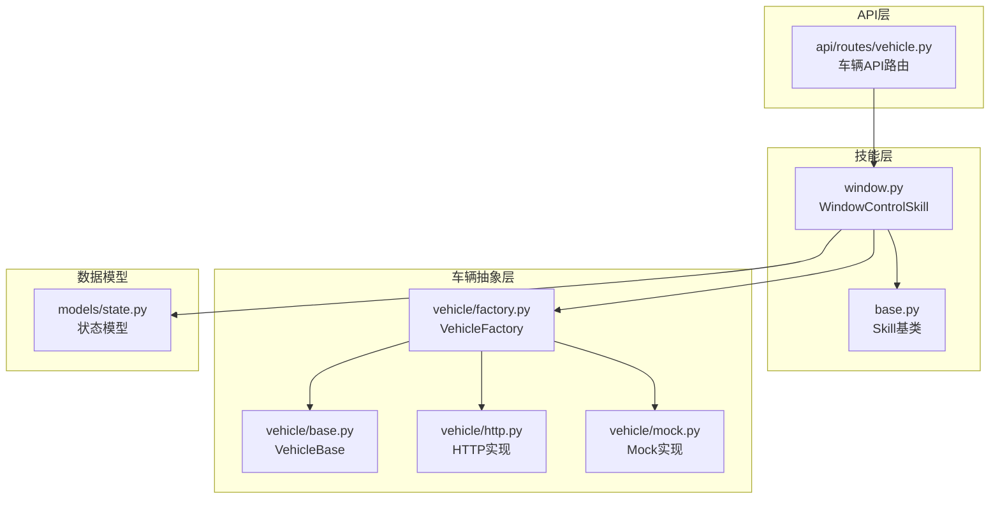
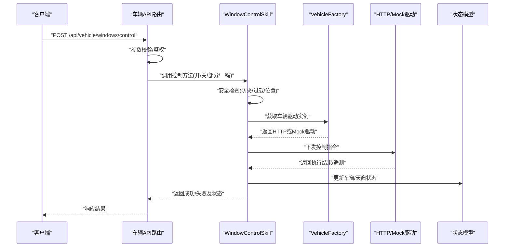
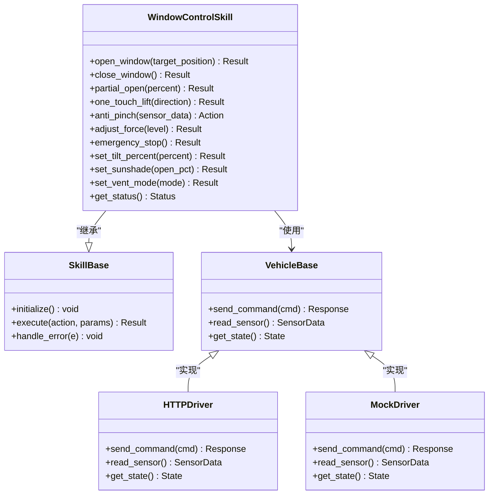
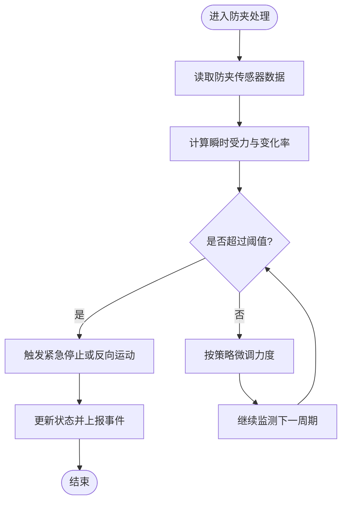
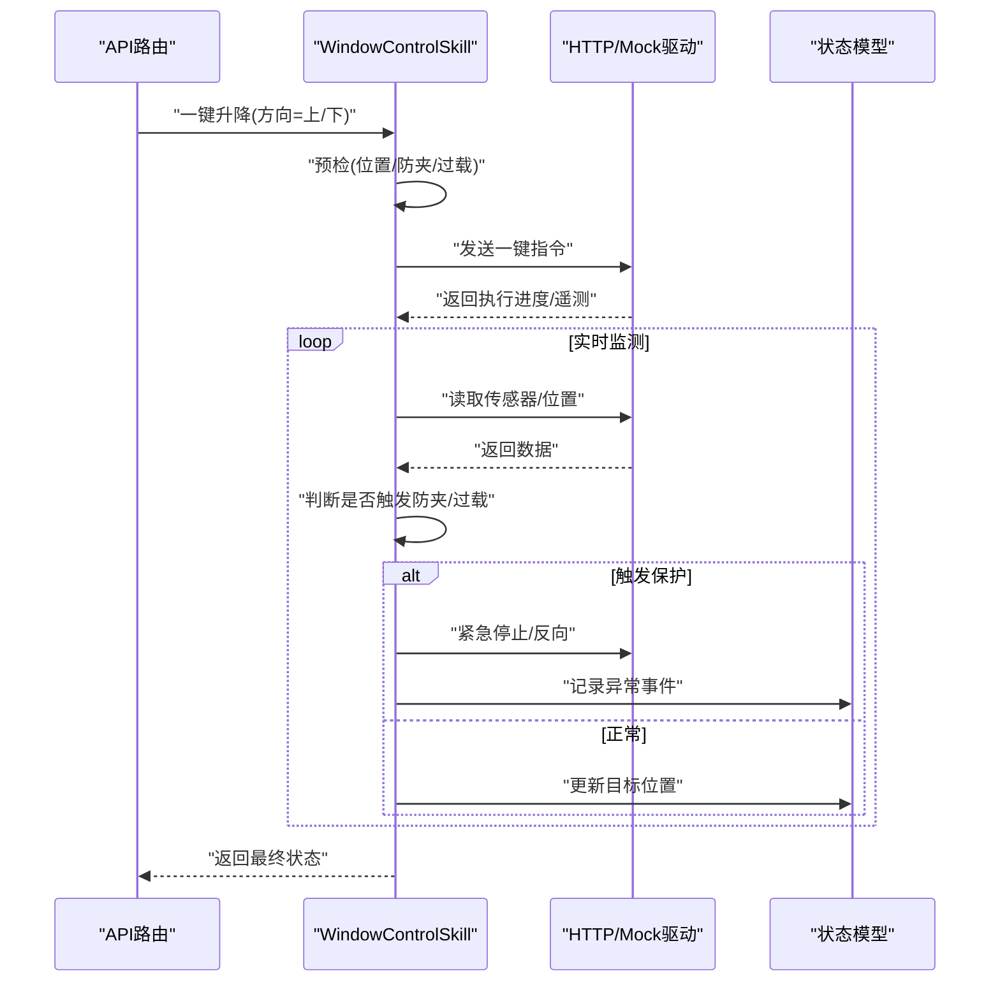
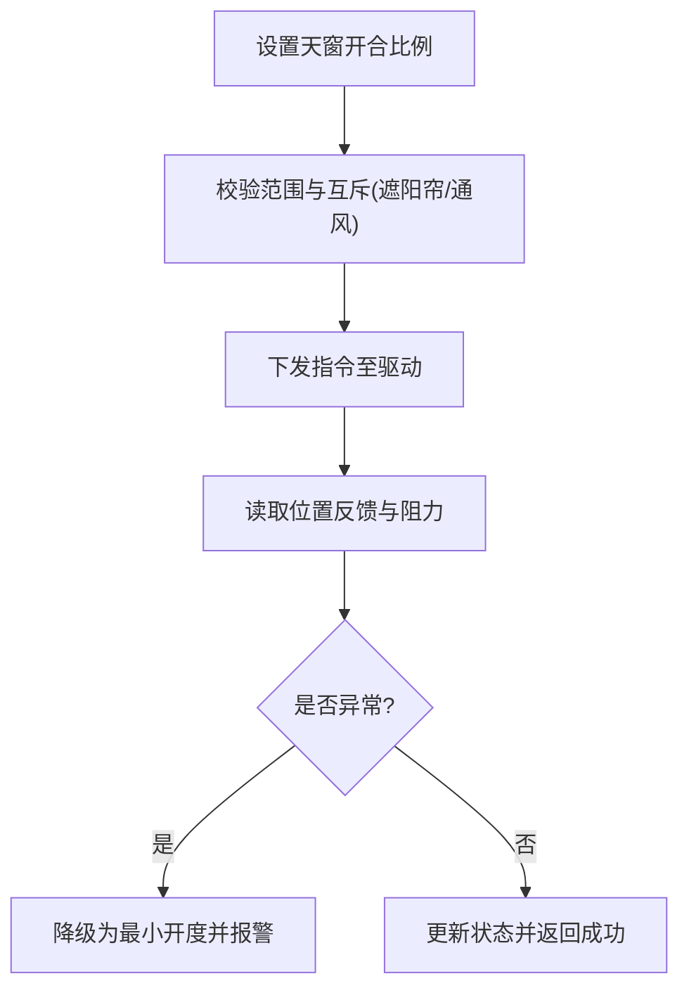
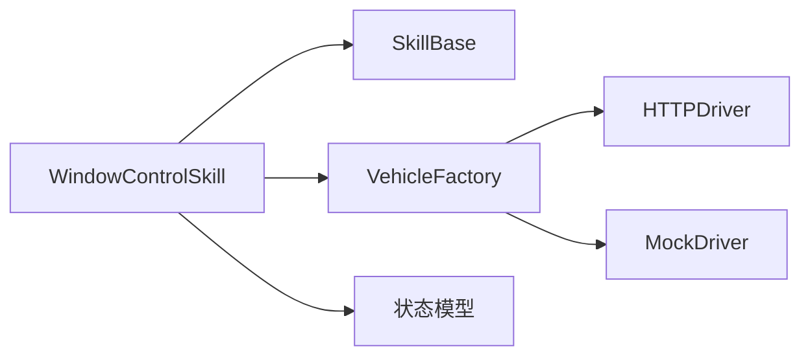

# 车窗控制操作

<cite>
**本文引用的文件**   
- [backend_design/nexus/skills/vehicle/window.py](file://backend_design/nexus/skills/vehicle/window.py)
- [backend_design/nexus/skills/base.py](file://backend_design/nexus/skills/base.py)
- [backend_design/nexus/vehicle/base.py](file://backend_design/nexus/vehicle/base.py)
- [backend_design/nexus/vehicle/factory.py](file://backend_design/nexus/vehicle/factory.py)
- [backend_design/nexus/vehicle/http.py](file://backend_design/nexus/vehicle/http.py)
- [backend_design/nexus/vehicle/mock.py](file://backend_design/nexus/vehicle/mock.py)
- [backend_design/nexus/api/routes/vehicle.py](file://backend_design/nexus/api/routes/vehicle.py)
- [backend_design/nexus/models/state.py](file://backend_design/nexus/models/state.py)
</cite>

## 目录
1. [简介](#简介)
2. [项目结构](#项目结构)
3. [核心组件](#核心组件)
4. [架构总览](#架构总览)
5. [详细组件分析](#详细组件分析)
6. [依赖分析](#依赖分析)
7. [性能考虑](#性能考虑)
8. [故障排查指南](#故障排查指南)
9. [结论](#结论)
10. [附录](#附录)

## 简介
本技术文档聚焦于“车窗控制”能力，覆盖以下目标：
- 开合控制：全开/全关、部分开启、一键升降
- 防夹保护：障碍物检测、力度调节、紧急停止
- 天窗管理：开合程度、遮阳帘控制、通风模式
- WindowControlSkill 安全机制：防夹传感器数据处理、电机过载保护、位置反馈系统
- 完整 API 示例：展示各种车窗操作场景的安全指令
- 状态监控、异常检测与自动恢复：确保乘客安全与车辆防护

## 项目结构
车窗控制相关代码主要位于后端技能层与车辆抽象层，API 路由暴露对外接口，模型用于状态持久化。

图表来源
- [backend_design/nexus/skills/vehicle/window.py](file://backend_design/nexus/skills/vehicle/window.py)
- [backend_design/nexus/skills/base.py](file://backend_design/nexus/skills/base.py)
- [backend_design/nexus/vehicle/base.py](file://backend_design/nexus/vehicle/base.py)
- [backend_design/nexus/vehicle/factory.py](file://backend_design/nexus/vehicle/factory.py)
- [backend_design/nexus/vehicle/http.py](file://backend_design/nexus/vehicle/http.py)
- [backend_design/nexus/vehicle/mock.py](file://backend_design/nexus/vehicle/mock.py)
- [backend_design/nexus/api/routes/vehicle.py](file://backend_design/nexus/api/routes/vehicle.py)
- [backend_design/nexus/models/state.py](file://backend_design/nexus/models/state.py)

章节来源
- [backend_design/nexus/skills/vehicle/window.py](file://backend_design/nexus/skills/vehicle/window.py)
- [backend_design/nexus/skills/base.py](file://backend_design/nexus/skills/base.py)
- [backend_design/nexus/vehicle/base.py](file://backend_design/nexus/vehicle/base.py)
- [backend_design/nexus/vehicle/factory.py](file://backend_design/nexus/vehicle/factory.py)
- [backend_design/nexus/vehicle/http.py](file://backend_design/nexus/vehicle/http.py)
- [backend_design/nexus/vehicle/mock.py](file://backend_design/nexus/vehicle/mock.py)
- [backend_design/nexus/api/routes/vehicle.py](file://backend_design/nexus/api/routes/vehicle.py)
- [backend_design/nexus/models/state.py](file://backend_design/nexus/models/state.py)

## 核心组件
- WindowControlSkill：封装车窗/天窗控制策略与安全逻辑，包括防夹、过载保护、位置反馈、一键升降、部分开启等。
- Skill 基类：提供通用生命周期、上下文、日志与错误处理模板。
- Vehicle 抽象与工厂：统一不同驱动（HTTP/Mock）的调用方式，屏蔽底层差异。
- API 路由：将外部请求映射到具体技能方法，进行参数校验与权限检查。
- 状态模型：定义车窗/天窗的状态字段与约束，支撑监控与恢复。

章节来源
- [backend_design/nexus/skills/vehicle/window.py](file://backend_design/nexus/skills/vehicle/window.py)
- [backend_design/nexus/skills/base.py](file://backend_design/nexus/skills/base.py)
- [backend_design/nexus/vehicle/base.py](file://backend_design/nexus/vehicle/base.py)
- [backend_design/nexus/vehicle/factory.py](file://backend_design/nexus/vehicle/factory.py)
- [backend_design/nexus/api/routes/vehicle.py](file://backend_design/nexus/api/routes/vehicle.py)
- [backend_design/nexus/models/state.py](file://backend_design/nexus/models/state.py)

## 架构总览
从请求到执行的整体流程如下：

图表来源
- [backend_design/nexus/api/routes/vehicle.py](file://backend_design/nexus/api/routes/vehicle.py)
- [backend_design/nexus/skills/vehicle/window.py](file://backend_design/nexus/skills/vehicle/window.py)
- [backend_design/nexus/vehicle/factory.py](file://backend_design/nexus/vehicle/factory.py)
- [backend_design/nexus/vehicle/http.py](file://backend_design/nexus/vehicle/http.py)
- [backend_design/nexus/vehicle/mock.py](file://backend_design/nexus/vehicle/mock.py)
- [backend_design/nexus/models/state.py](file://backend_design/nexus/models/state.py)

## 详细组件分析

### WindowControlSkill 类分析
职责边界
- 开合控制：全开/全关、部分开启、一键升降
- 防夹保护：障碍物检测、力度调节、紧急停止
- 天窗管理：开合程度、遮阳帘控制、通风模式
- 安全机制：防夹传感器数据处理、电机过载保护、位置反馈系统
- 状态同步：读取/更新车窗与天窗状态，支持监控与恢复

关键方法与输入输出要点
- 开合控制方法：接受目标位置或动作类型（开/关/部分/一键），返回执行结果与最终状态
- 防夹方法：接收传感器数据流，计算阈值与趋势，触发降力或反向
- 天窗方法：设置开合比例、遮阳帘开度、切换通风模式
- 状态查询：返回当前各窗位、天窗、遮阳帘、模式、健康指标

图表来源
- [backend_design/nexus/skills/vehicle/window.py](file://backend_design/nexus/skills/vehicle/window.py)
- [backend_design/nexus/skills/base.py](file://backend_design/nexus/skills/base.py)
- [backend_design/nexus/vehicle/base.py](file://backend_design/nexus/vehicle/base.py)
- [backend_design/nexus/vehicle/http.py](file://backend_design/nexus/vehicle/http.py)
- [backend_design/nexus/vehicle/mock.py](file://backend_design/nexus/vehicle/mock.py)

章节来源
- [backend_design/nexus/skills/vehicle/window.py](file://backend_design/nexus/skills/vehicle/window.py)
- [backend_design/nexus/skills/base.py](file://backend_design/nexus/skills/base.py)
- [backend_design/nexus/vehicle/base.py](file://backend_design/nexus/vehicle/base.py)
- [backend_design/nexus/vehicle/http.py](file://backend_design/nexus/vehicle/http.py)
- [backend_design/nexus/vehicle/mock.py](file://backend_design/nexus/vehicle/mock.py)

#### 防夹保护算法流程

图表来源
- [backend_design/nexus/skills/vehicle/window.py](file://backend_design/nexus/skills/vehicle/window.py)

章节来源
- [backend_design/nexus/skills/vehicle/window.py](file://backend_design/nexus/skills/vehicle/window.py)

#### 一键升降时序

图表来源
- [backend_design/nexus/api/routes/vehicle.py](file://backend_design/nexus/api/routes/vehicle.py)
- [backend_design/nexus/skills/vehicle/window.py](file://backend_design/nexus/skills/vehicle/window.py)
- [backend_design/nexus/vehicle/http.py](file://backend_design/nexus/vehicle/http.py)
- [backend_design/nexus/vehicle/mock.py](file://backend_design/nexus/vehicle/mock.py)
- [backend_design/nexus/models/state.py](file://backend_design/nexus/models/state.py)

章节来源
- [backend_design/nexus/api/routes/vehicle.py](file://backend_design/nexus/api/routes/vehicle.py)
- [backend_design/nexus/skills/vehicle/window.py](file://backend_design/nexus/skills/vehicle/window.py)
- [backend_design/nexus/vehicle/http.py](file://backend_design/nexus/vehicle/http.py)
- [backend_design/nexus/vehicle/mock.py](file://backend_design/nexus/vehicle/mock.py)
- [backend_design/nexus/models/state.py](file://backend_design/nexus/models/state.py)

#### 天窗管理与通风模式
- 开合程度：通过百分比控制天窗玻璃的开合角度
- 遮阳帘控制：独立控制遮阳帘开度，避免阳光直射
- 通风模式：在不完全打开的情况下引入空气流通，降低能耗

图表来源
- [backend_design/nexus/skills/vehicle/window.py](file://backend_design/nexus/skills/vehicle/window.py)

章节来源
- [backend_design/nexus/skills/vehicle/window.py](file://backend_design/nexus/skills/vehicle/window.py)

### API 路由与调用契约
- 端点：车辆控制相关 API 路由集中定义，负责参数校验、鉴权、转发到技能层
- 典型请求体字段：设备标识、目标位置/动作类型、防夹强度等级、天窗开合比例、遮阳帘开度、通风模式
- 响应体字段：执行结果、最终状态、事件告警、诊断信息

章节来源
- [backend_design/nexus/api/routes/vehicle.py](file://backend_design/nexus/api/routes/vehicle.py)

### 状态模型与监控
- 状态字段：各车窗位置、天窗开合比例、遮阳帘开度、通风模式、健康指标、最近事件
- 监控指标：防夹触发次数、过载保护次数、位置偏差、执行耗时
- 自动恢复：检测到异常后尝试复位、回退到安全位置、重试有限次数

章节来源
- [backend_design/nexus/models/state.py](file://backend_design/nexus/models/state.py)

## 依赖分析
- 耦合关系
  - WindowControlSkill 依赖 SkillBase 提供的通用能力
  - 通过 VehicleFactory 选择 HTTP 或 Mock 驱动，解耦底层通信
  - 读写状态由状态模型承载，便于监控与恢复
- 外部依赖
  - HTTP 驱动依赖网络与车载控制器
  - Mock 驱动用于测试与仿真
- 潜在循环依赖
  - 技能层不直接依赖 API 路由，避免反向耦合
  - 驱动仅实现基础命令收发，业务逻辑集中在技能层

图表来源
- [backend_design/nexus/skills/vehicle/window.py](file://backend_design/nexus/skills/vehicle/window.py)
- [backend_design/nexus/skills/base.py](file://backend_design/nexus/skills/base.py)
- [backend_design/nexus/vehicle/factory.py](file://backend_design/nexus/vehicle/factory.py)
- [backend_design/nexus/vehicle/http.py](file://backend_design/nexus/vehicle/http.py)
- [backend_design/nexus/vehicle/mock.py](file://backend_design/nexus/vehicle/mock.py)
- [backend_design/nexus/models/state.py](file://backend_design/nexus/models/state.py)

章节来源
- [backend_design/nexus/skills/vehicle/window.py](file://backend_design/nexus/skills/vehicle/window.py)
- [backend_design/nexus/skills/base.py](file://backend_design/nexus/skills/base.py)
- [backend_design/nexus/vehicle/factory.py](file://backend_design/nexus/vehicle/factory.py)
- [backend_design/nexus/vehicle/http.py](file://backend_design/nexus/vehicle/http.py)
- [backend_design/nexus/vehicle/mock.py](file://backend_design/nexus/vehicle/mock.py)
- [backend_design/nexus/models/state.py](file://backend_design/nexus/models/state.py)

## 性能考虑
- 传感器采样频率与防夹判定延迟需平衡，避免误报与漏报
- 批量控制时采用并发限制与队列，防止总线拥塞
- 位置反馈采用增量更新与去抖，减少无效状态变更
- 对频繁操作的窗口进行缓存与预热，缩短冷启动时间

[本节为通用指导，无需特定文件引用]

## 故障排查指南
- 常见问题
  - 防夹频繁触发：检查传感器校准、机械阻力、安装间隙
  - 电机过载保护：确认负载是否超限、供电电压是否稳定
  - 位置反馈异常：核对编码器/限位开关、通信链路质量
- 定位步骤
  - 查看状态模型中的最近事件与健康指标
  - 检查 API 路由的请求参数与鉴权结果
  - 对比 HTTP/Mock 驱动返回的遥测数据
- 自动恢复建议
  - 触发保护后先停止，再尝试小步反向释放
  - 若连续失败，降级到最小开度并上报运维告警

章节来源
- [backend_design/nexus/models/state.py](file://backend_design/nexus/models/state.py)
- [backend_design/nexus/api/routes/vehicle.py](file://backend_design/nexus/api/routes/vehicle.py)
- [backend_design/nexus/vehicle/http.py](file://backend_design/nexus/vehicle/http.py)
- [backend_design/nexus/vehicle/mock.py](file://backend_design/nexus/vehicle/mock.py)

## 结论
本方案以 WindowControlSkill 为核心，结合统一的车辆抽象与工厂模式，实现了车窗/天窗的全面控制与安全保护。通过防夹传感器数据处理、电机过载保护与位置反馈系统，确保在复杂工况下的可靠性与安全性。配合 API 路由与状态模型，形成完整的监控、异常检测与自动恢复闭环。

[本节为总结性内容，无需特定文件引用]

## 附录
- 术语
  - 防夹：在关闭过程中检测到障碍物后立即停止或反向，避免伤害
  - 一键升降：单次指令完成全开或全关，期间持续监测安全条件
  - 通风模式：在不显著改变开度的情况下引入空气流通
- 最佳实践
  - 在用户交互前进行预检，提示风险与限制
  - 对关键操作增加二次确认与审计日志
  - 定期校准传感器与限位，保持系统一致性

[本节为补充说明，无需特定文件引用]