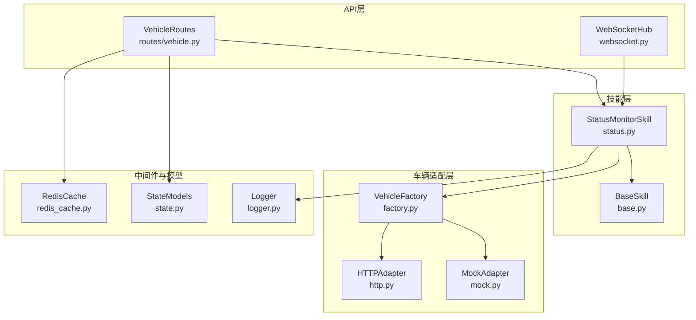
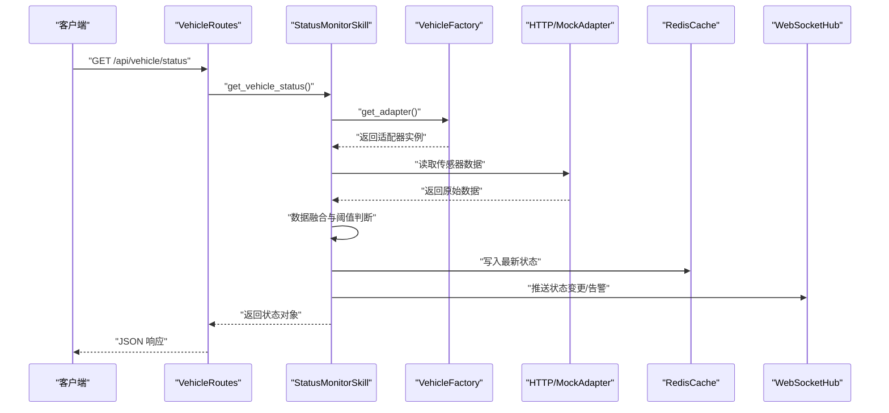
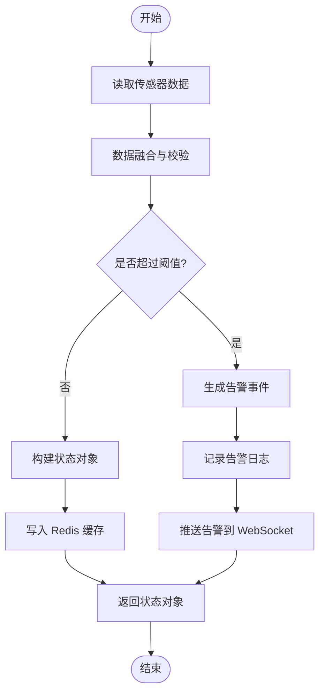
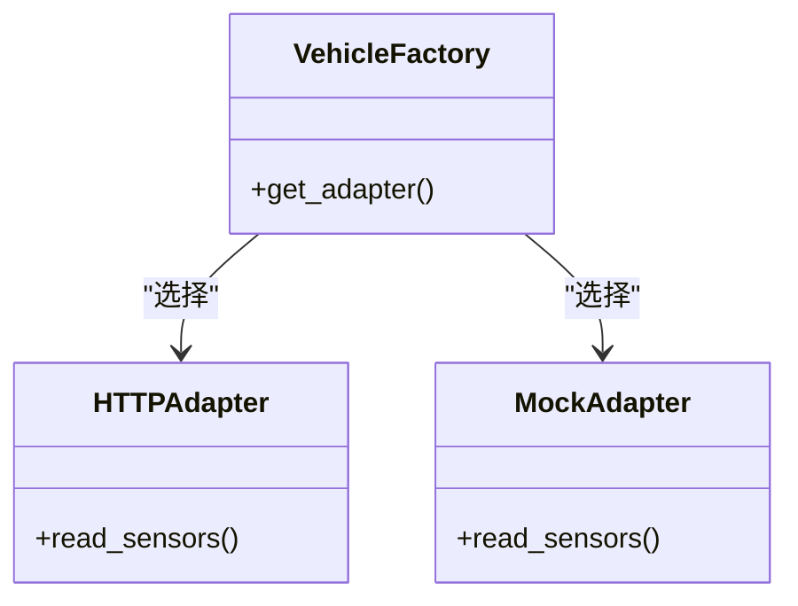
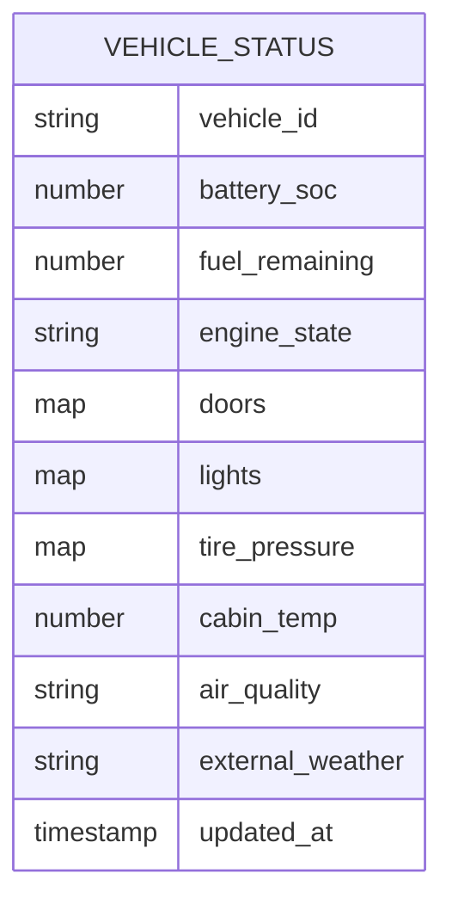
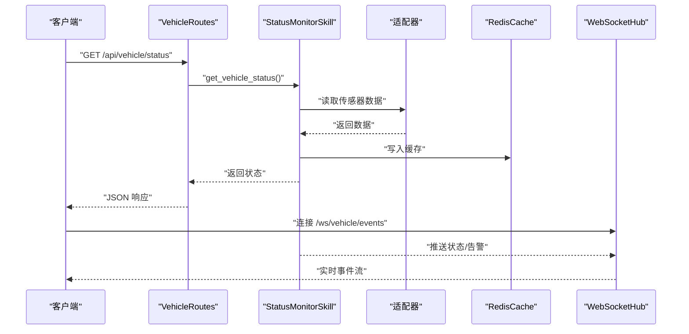
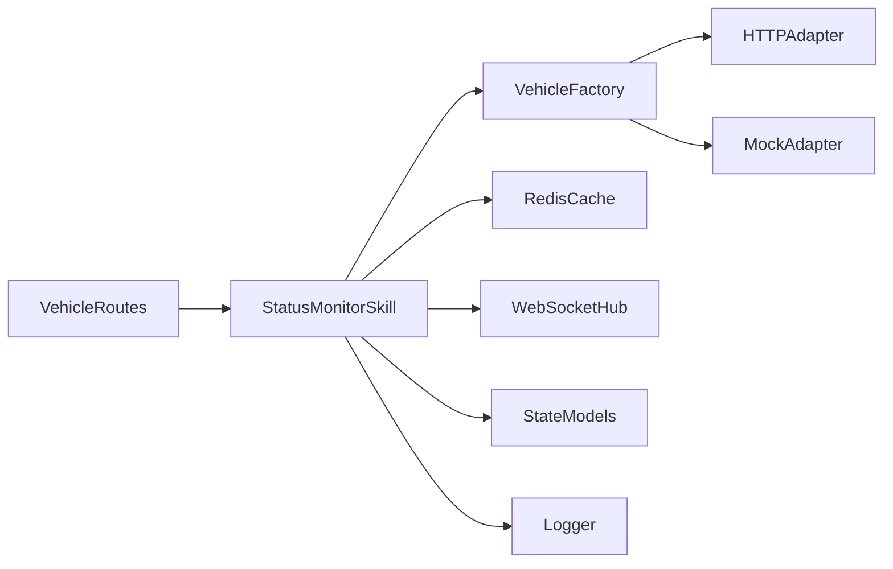

# 车辆状态监控

<cite>
**本文引用的文件**   
- [backend_design/nexus/skills/vehicle/status.py](file://backend_design/nexus/skills/vehicle/status.py)
- [backend_design/nexus/skills/base.py](file://backend_design/nexus/skills/base.py)
- [backend_design/nexus/vehicle/factory.py](file://backend_design/nexus/vehicle/factory.py)
- [backend_design/nexus/vehicle/http.py](file://backend_design/nexus/vehicle/http.py)
- [backend_design/nexus/vehicle/mock.py](file://backend_design/nexus/vehicle/mock.py)
- [backend_design/nexus/api/routes/vehicle.py](file://backend_design/nexus/api/routes/vehicle.py)
- [backend_design/nexus/middleware/redis_cache.py](file://backend_design/nexus/middleware/redis_cache.py)
- [backend_design/nexus/api/websocket.py](file://backend_design/nexus/api/websocket.py)
- [backend_design/nexus/models/state.py](file://backend_design/nexus/models/state.py)
- [backend_design/nexus/core/logger.py](file://backend_design/nexus/core/logger.py)
</cite>

## 目录
1. [简介](#简介)
2. [项目结构](#项目结构)
3. [核心组件](#核心组件)
4. [架构总览](#架构总览)
5. [详细组件分析](#详细组件分析)
6. [依赖关系分析](#依赖关系分析)
7. [性能考虑](#性能考虑)
8. [故障排查指南](#故障排查指南)
9. [结论](#结论)
10. [附录](#附录)

## 简介
本技术文档聚焦于“车辆状态监控”能力，覆盖动力系统（电池电量、燃油剩余、发动机状态）、车身系统（车门状态、灯光状态、轮胎压力）与环境感知（车内温度、空气质量、外部天气）。重点解析 StatusMonitorSkill 的数据采集机制：传感器数据融合、状态阈值判断与异常告警触发；并提供完整的状态查询 API 示例、缓存策略、实时监控推送与历史数据分析方案。

## 项目结构
与车辆状态监控相关的代码主要分布在以下模块：
- 技能层：skills/vehicle/status.py 实现状态监控技能
- 技能基类：skills/base.py 提供通用能力
- 车辆抽象与适配器：vehicle/* 提供 HTTP/Mock 等后端接入
- API 路由：api/routes/vehicle.py 暴露查询接口
- 中间件：middleware/redis_cache.py 提供缓存能力
- WebSocket：api/websocket.py 支持实时推送
- 模型：models/state.py 定义状态数据结构
- 日志：core/logger.py 统一日志输出

图表来源
- [backend_design/nexus/skills/vehicle/status.py](file://backend_design/nexus/skills/vehicle/status.py)
- [backend_design/nexus/skills/base.py](file://backend_design/nexus/skills/base.py)
- [backend_design/nexus/vehicle/factory.py](file://backend_design/nexus/vehicle/factory.py)
- [backend_design/nexus/vehicle/http.py](file://backend_design/nexus/vehicle/http.py)
- [backend_design/nexus/vehicle/mock.py](file://backend_design/nexus/vehicle/mock.py)
- [backend_design/nexus/api/routes/vehicle.py](file://backend_design/nexus/api/routes/vehicle.py)
- [backend_design/nexus/middleware/redis_cache.py](file://backend_design/nexus/middleware/redis_cache.py)
- [backend_design/nexus/api/websocket.py](file://backend_design/nexus/api/websocket.py)
- [backend_design/nexus/models/state.py](file://backend_design/nexus/models/state.py)
- [backend_design/nexus/core/logger.py](file://backend_design/nexus/core/logger.py)

章节来源
- [backend_design/nexus/skills/vehicle/status.py](file://backend_design/nexus/skills/vehicle/status.py)
- [backend_design/nexus/skills/base.py](file://backend_design/nexus/skills/base.py)
- [backend_design/nexus/vehicle/factory.py](file://backend_design/nexus/vehicle/factory.py)
- [backend_design/nexus/vehicle/http.py](file://backend_design/nexus/vehicle/http.py)
- [backend_design/nexus/vehicle/mock.py](file://backend_design/nexus/vehicle/mock.py)
- [backend_design/nexus/api/routes/vehicle.py](file://backend_design/nexus/api/routes/vehicle.py)
- [backend_design/nexus/middleware/redis_cache.py](file://backend_design/nexus/middleware/redis_cache.py)
- [backend_design/nexus/api/websocket.py](file://backend_design/nexus/api/websocket.py)
- [backend_design/nexus/models/state.py](file://backend_design/nexus/models/state.py)
- [backend_design/nexus/core/logger.py](file://backend_design/nexus/core/logger.py)

## 核心组件
- StatusMonitorSkill：负责聚合多源传感器数据，执行阈值判断与告警生成，并对外提供状态查询与事件上报能力。
- VehicleFactory：根据配置选择具体车辆适配器（HTTP/Mock），屏蔽底层差异。
- HTTPAdapter/MockAdapter：分别对接真实车端服务或本地模拟数据。
- RedisCache：为高频状态查询提供缓存，降低后端压力。
- WebSocketHub：将状态变更与告警事件实时推送到前端。
- StateModels：定义统一的车辆状态数据结构，便于跨层传递。
- Logger：统一记录关键流程与异常信息，辅助排障。

章节来源
- [backend_design/nexus/skills/vehicle/status.py](file://backend_design/nexus/skills/vehicle/status.py)
- [backend_design/nexus/vehicle/factory.py](file://backend_design/nexus/vehicle/factory.py)
- [backend_design/nexus/vehicle/http.py](file://backend_design/nexus/vehicle/http.py)
- [backend_design/nexus/vehicle/mock.py](file://backend_design/nexus/vehicle/mock.py)
- [backend_design/nexus/middleware/redis_cache.py](file://backend_design/nexus/middleware/redis_cache.py)
- [backend_design/nexus/api/websocket.py](file://backend_design/nexus/api/websocket.py)
- [backend_design/nexus/models/state.py](file://backend_design/nexus/models/state.py)
- [backend_design/nexus/core/logger.py](file://backend_design/nexus/core/logger.py)

## 架构总览
整体采用“技能 + 适配器 + 缓存 + 推送”的分层架构。上层通过 API 路由调用技能，技能通过工厂选择适配器获取原始数据，结合阈值规则进行融合与告警判定，结果写入缓存并通过 WebSocket 推送。

图表来源
- [backend_design/nexus/api/routes/vehicle.py](file://backend_design/nexus/api/routes/vehicle.py)
- [backend_design/nexus/skills/vehicle/status.py](file://backend_design/nexus/skills/vehicle/status.py)
- [backend_design/nexus/vehicle/factory.py](file://backend_design/nexus/vehicle/factory.py)
- [backend_design/nexus/vehicle/http.py](file://backend_design/nexus/vehicle/http.py)
- [backend_design/nexus/vehicle/mock.py](file://backend_design/nexus/vehicle/mock.py)
- [backend_design/nexus/middleware/redis_cache.py](file://backend_design/nexus/middleware/redis_cache.py)
- [backend_design/nexus/api/websocket.py](file://backend_design/nexus/api/websocket.py)

## 详细组件分析

### StatusMonitorSkill 数据采集与处理
- 数据源接入：通过 VehicleFactory 动态选择 HTTP 或 Mock 适配器，统一读取动力系统、车身系统与环境感知三类传感器数据。
- 数据融合：对多源数据进行时间对齐与字段映射，合并为统一的状态模型。
- 阈值判断：依据内置规则对关键指标（如电池电量、胎压、温度等）进行越界检测。
- 异常告警：当检测到异常时，生成告警事件并写入日志，同时通过 WebSocket 推送给订阅者。
- 缓存策略：将最新状态写入 Redis，设置合理过期时间，提高查询性能。
- 历史数据：可基于时间窗口拉取历史快照，用于趋势分析与报表展示。

图表来源
- [backend_design/nexus/skills/vehicle/status.py](file://backend_design/nexus/skills/vehicle/status.py)
- [backend_design/nexus/middleware/redis_cache.py](file://backend_design/nexus/middleware/redis_cache.py)
- [backend_design/nexus/api/websocket.py](file://backend_design/nexus/api/websocket.py)
- [backend_design/nexus/core/logger.py](file://backend_design/nexus/core/logger.py)

章节来源
- [backend_design/nexus/skills/vehicle/status.py](file://backend_design/nexus/skills/vehicle/status.py)
- [backend_design/nexus/middleware/redis_cache.py](file://backend_design/nexus/middleware/redis_cache.py)
- [backend_design/nexus/api/websocket.py](file://backend_design/nexus/api/websocket.py)
- [backend_design/nexus/core/logger.py](file://backend_design/nexus/core/logger.py)

### 车辆适配器与工厂
- VehicleFactory：根据运行环境或配置项选择 HTTPAdapter 或 MockAdapter，屏蔽底层差异。
- HTTPAdapter：通过 HTTP 协议从车端服务或网关拉取传感器数据。
- MockAdapter：在开发/测试环境中提供稳定的模拟数据，便于联调与回归。

图表来源
- [backend_design/nexus/vehicle/factory.py](file://backend_design/nexus/vehicle/factory.py)
- [backend_design/nexus/vehicle/http.py](file://backend_design/nexus/vehicle/http.py)
- [backend_design/nexus/vehicle/mock.py](file://backend_design/nexus/vehicle/mock.py)

章节来源
- [backend_design/nexus/vehicle/factory.py](file://backend_design/nexus/vehicle/factory.py)
- [backend_design/nexus/vehicle/http.py](file://backend_design/nexus/vehicle/http.py)
- [backend_design/nexus/vehicle/mock.py](file://backend_design/nexus/vehicle/mock.py)

### 状态模型与数据结构
- 统一状态模型：定义动力、车身、环境三类状态的字段与类型，确保前后端一致。
- 扩展性：新增传感器或告警类型时，仅需扩展模型与规则，不影响既有接口。

图表来源
- [backend_design/nexus/models/state.py](file://backend_design/nexus/models/state.py)

章节来源
- [backend_design/nexus/models/state.py](file://backend_design/nexus/models/state.py)

### API 路由与查询示例
- 查询当前状态：GET /api/vehicle/status
- 查询历史快照：GET /api/vehicle/history?window=5m
- 订阅实时推送：WebSocket /ws/vehicle/events

图表来源
- [backend_design/nexus/api/routes/vehicle.py](file://backend_design/nexus/api/routes/vehicle.py)
- [backend_design/nexus/skills/vehicle/status.py](file://backend_design/nexus/skills/vehicle/status.py)
- [backend_design/nexus/middleware/redis_cache.py](file://backend_design/nexus/middleware/redis_cache.py)
- [backend_design/nexus/api/websocket.py](file://backend_design/nexus/api/websocket.py)

章节来源
- [backend_design/nexus/api/routes/vehicle.py](file://backend_design/nexus/api/routes/vehicle.py)
- [backend_design/nexus/api/websocket.py](file://backend_design/nexus/api/websocket.py)

## 依赖关系分析
- 松耦合：技能层通过工厂与适配器解耦，便于替换数据源。
- 高内聚：状态模型集中管理，减少跨层不一致风险。
- 可扩展：新增传感器或告警规则只需修改技能与模型，无需改动 API。

图表来源
- [backend_design/nexus/api/routes/vehicle.py](file://backend_design/nexus/api/routes/vehicle.py)
- [backend_design/nexus/skills/vehicle/status.py](file://backend_design/nexus/skills/vehicle/status.py)
- [backend_design/nexus/vehicle/factory.py](file://backend_design/nexus/vehicle/factory.py)
- [backend_design/nexus/vehicle/http.py](file://backend_design/nexus/vehicle/http.py)
- [backend_design/nexus/vehicle/mock.py](file://backend_design/nexus/vehicle/mock.py)
- [backend_design/nexus/middleware/redis_cache.py](file://backend_design/nexus/middleware/redis_cache.py)
- [backend_design/nexus/api/websocket.py](file://backend_design/nexus/api/websocket.py)
- [backend_design/nexus/models/state.py](file://backend_design/nexus/models/state.py)
- [backend_design/nexus/core/logger.py](file://backend_design/nexus/core/logger.py)

章节来源
- [backend_design/nexus/api/routes/vehicle.py](file://backend_design/nexus/api/routes/vehicle.py)
- [backend_design/nexus/skills/vehicle/status.py](file://backend_design/nexus/skills/vehicle/status.py)
- [backend_design/nexus/vehicle/factory.py](file://backend_design/nexus/vehicle/factory.py)
- [backend_design/nexus/vehicle/http.py](file://backend_design/nexus/vehicle/http.py)
- [backend_design/nexus/vehicle/mock.py](file://backend_design/nexus/vehicle/mock.py)
- [backend_design/nexus/middleware/redis_cache.py](file://backend_design/nexus/middleware/redis_cache.py)
- [backend_design/nexus/api/websocket.py](file://backend_design/nexus/api/websocket.py)
- [backend_design/nexus/models/state.py](file://backend_design/nexus/models/state.py)
- [backend_design/nexus/core/logger.py](file://backend_design/nexus/core/logger.py)

## 性能考虑
- 缓存命中：对热点状态使用 Redis 缓存，显著降低后端压力。
- 批量读取：适配器侧尽量批量拉取传感器数据，减少网络往返。
- 异步推送：WebSocket 推送采用异步队列，避免阻塞主流程。
- 阈值计算：阈值判断逻辑保持轻量，复杂分析可下沉至离线任务。

[本节为通用指导，不直接分析具体文件]

## 故障排查指南
- 日志定位：查看统一日志输出，确认数据读取、阈值判断与告警触发路径。
- 缓存检查：验证 Redis 中状态键是否存在与过期时间是否符合预期。
- 适配器连通性：检查 HTTP 适配器是否能正常访问车端服务或网关。
- WebSocket 连接：确认客户端是否正确订阅事件通道，服务端是否正常广播。

章节来源
- [backend_design/nexus/core/logger.py](file://backend_design/nexus/core/logger.py)
- [backend_design/nexus/middleware/redis_cache.py](file://backend_design/nexus/middleware/redis_cache.py)
- [backend_design/nexus/vehicle/http.py](file://backend_design/nexus/vehicle/http.py)
- [backend_design/nexus/api/websocket.py](file://backend_design/nexus/api/websocket.py)

## 结论
本方案以 StatusMonitorSkill 为核心，结合工厂化适配器、统一状态模型、Redis 缓存与 WebSocket 推送，实现了车辆状态的高效采集、融合、告警与分发。该架构具备良好的扩展性与可维护性，能够支撑未来更多传感器与更复杂的分析需求。

[本节为总结性内容，不直接分析具体文件]

## 附录
- 状态字段说明（示例）
  - 动力系统：电池电量、燃油剩余、发动机状态
  - 车身系统：车门状态、灯光状态、轮胎压力
  - 环境感知：车内温度、空气质量、外部天气
- 常见阈值建议（示例）
  - 电池电量低于 20% 告警
  - 胎压偏差超过 10% 告警
  - 车内温度高于 35°C 告警
- 历史分析建议
  - 按 5 分钟窗口聚合，绘制趋势图
  - 对告警事件进行统计与归因分析

[本节为概念性补充，不直接分析具体文件]