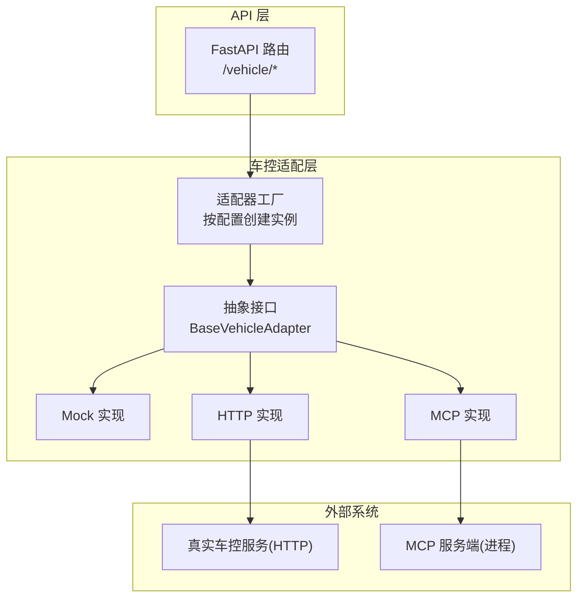
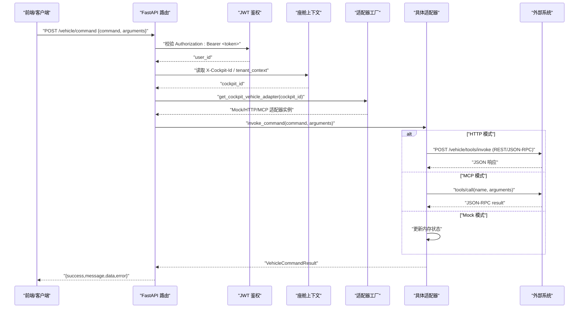
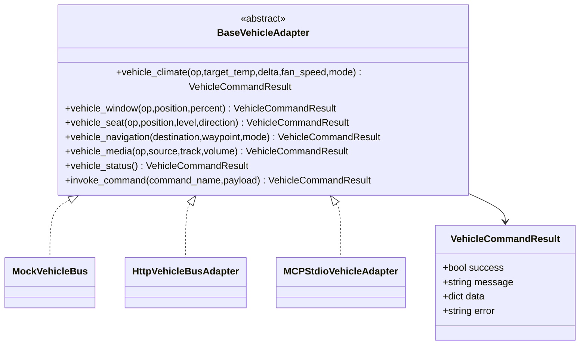
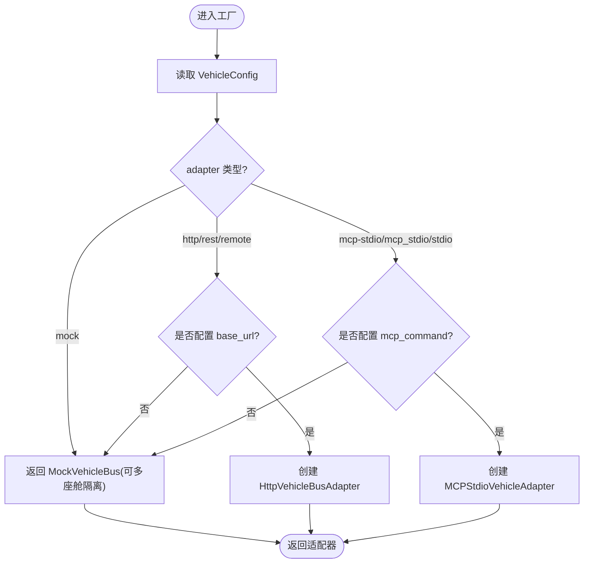
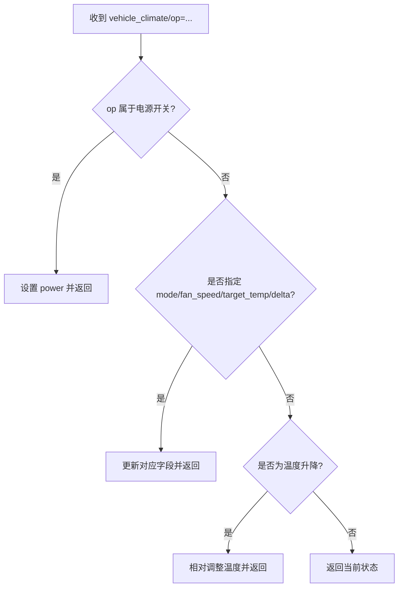
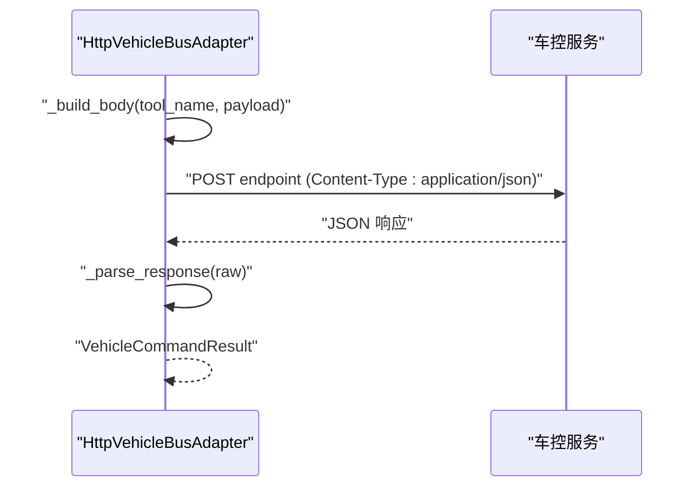
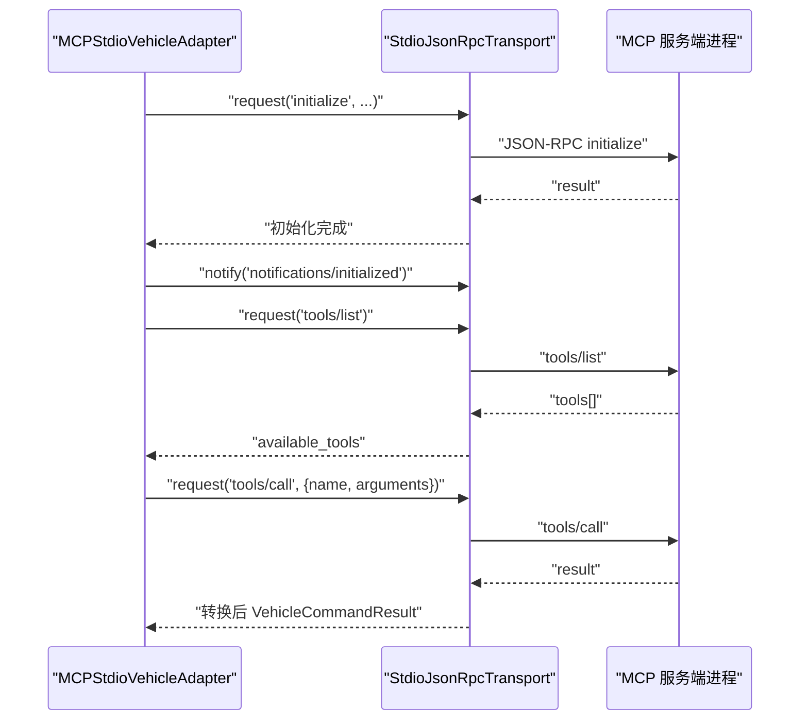
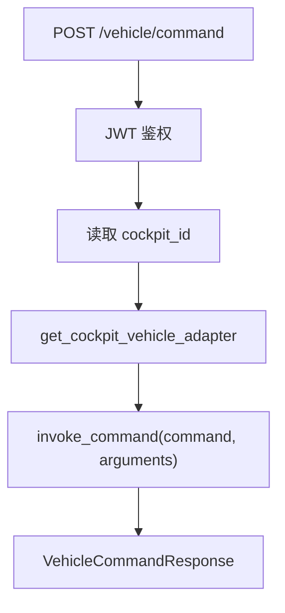
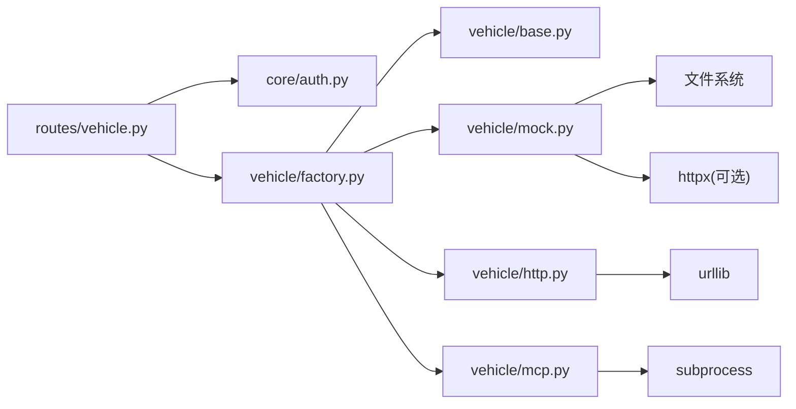

# 车控系统

<cite>
**本文引用的文件**   
- [base.py](file://backend_design/nexus/vehicle/base.py)
- [factory.py](file://backend_design/nexus/vehicle/factory.py)
- [mock.py](file://backend_design/nexus/vehicle/mock.py)
- [http.py](file://backend_design/nexus/vehicle/http.py)
- [mcp.py](file://backend_design/nexus/vehicle/mcp.py)
- [config.py](file://backend_design/nexus/config.py)
- [vehicle.py](file://backend_design/nexus/api/routes/vehicle.py)
- [schemas.py](file://backend_design/nexus/models/schemas.py)
- [auth.py](file://backend_design/nexus/core/auth.py)
- [cockpit_manager.py](file://backend_design/nexus/core/cockpit_manager.py)
- [climate.py](file://backend_design/nexus/skills/vehicle/climate.py)
- [navigation.py](file://backend_design/nexus/skills/vehicle/navigation.py)
- [media.py](file://backend_design/nexus/skills/vehicle/media.py)
- [seat.py](file://backend_design/nexus/skills/vehicle/seat.py)
- [window.py](file://backend_design/nexus/skills/vehicle/window.py)
</cite>

## 目录
1. [简介](#简介)
2. [项目结构](#项目结构)
3. [核心组件](#核心组件)
4. [架构总览](#架构总览)
5. [详细组件分析](#详细组件分析)
6. [依赖关系分析](#依赖关系分析)
7. [性能与可靠性](#性能与可靠性)
8. [故障诊断与排错](#故障诊断与排错)
9. [结论](#结论)
10. [附录：协议扩展与集成指南](#附录协议扩展与集成指南)

## 简介
本技术文档面向 NexusCockpit 车控子系统，系统性阐述车控适配器架构设计与实现，覆盖三种适配模式：
- Mock 模式（开发调试）：本地内存状态模拟，支持多座舱隔离。
- HTTP 模式（标准 API）：通过 REST/JSON-RPC 调用真实车控服务。
- MCP 模式（stdio 协议）：基于 Model Context Protocol 的 stdio JSON-RPC 传输，进程内启动并管理外部 MCP 服务。

文档同时说明车辆状态监控、设备远程控制、故障诊断与预警的核心能力；定义车控指令标准化格式、权限控制与安全验证机制；给出空调、导航、媒体、座椅、车窗等常见操作的示例路径；并提供协议扩展与第三方系统集成方案。

## 项目结构
车控相关代码主要位于 backend_design/nexus 下，围绕“抽象接口 + 工厂选择 + 多实现”的分层组织：
- 抽象接口：统一车控命令集与返回结果模型
- 适配器实现：Mock/HTTP/MCP 三种后端
- 工厂与配置：根据环境变量动态创建适配器实例，支持每座舱隔离
- API 路由：对外暴露 /vehicle/command 与 /vehicle/status 等端点
- 技能封装：上层 Agent/Skill 以工具名调用车控能力
- 认证与上下文：JWT 鉴权、座舱上下文注入

图表来源
- [factory.py:39-123](file://backend_design/nexus/vehicle/factory.py#L39-L123)
- [base.py:35-92](file://backend_design/nexus/vehicle/base.py#L35-L92)
- [vehicle.py:47-91](file://backend_design/nexus/api/routes/vehicle.py#L47-L91)

章节来源
- [factory.py:1-148](file://backend_design/nexus/vehicle/factory.py#L1-L148)
- [base.py:1-92](file://backend_design/nexus/vehicle/base.py#L1-L92)
- [vehicle.py:1-129](file://backend_design/nexus/api/routes/vehicle.py#L1-L129)

## 核心组件
- 抽象接口与结果模型
  - BaseVehicleAdapter：定义空调、车窗、座椅、导航、媒体、状态查询与通用 invoke_command 方法。
  - VehicleCommandResult：统一的成功/失败、消息、结构化数据与错误码。
- 适配器工厂
  - build_vehicle_adapter/get_cockpit_vehicle_adapter：依据配置与环境变量选择具体实现；v2.1 支持每座舱独立 Mock 实例。
- 适配器实现
  - MockVehicleBus：内存维护空调/车窗/座椅/媒体/导航/车况状态，提供别名映射与位置解析。
  - HttpVehicleBusAdapter：REST/JSON-RPC 两种协议体构造与响应解析，支持超时与鉴权头。
  - MCPStdioVehicleAdapter：基于 Content-Length Framing 的 stdio JSON-RPC 传输，自动 initialize/tools/list/call。
- 配置中心
  - VehicleConfig：VEHICLE_ADAPTER、VEHICLE_API_*、VEHICLE_MCP_* 等开关与参数。
- API 路由
  - POST /vehicle/command、GET /vehicle/status、POST /vehicle/location：统一入口，JWT 鉴权，座舱隔离。
- 安全与上下文
  - JWT 鉴权：get_current_user 依赖注入用户标识。
  - 座舱上下文：从请求头或中间件设置 cockpit_id，驱动适配器实例隔离。

章节来源
- [base.py:19-92](file://backend_design/nexus/vehicle/base.py#L19-L92)
- [factory.py:39-123](file://backend_design/nexus/vehicle/factory.py#L39-L123)
- [mock.py:22-108](file://backend_design/nexus/vehicle/mock.py#L22-L108)
- [http.py:23-118](file://backend_design/nexus/vehicle/http.py#L23-L118)
- [mcp.py:181-292](file://backend_design/nexus/vehicle/mcp.py#L181-L292)
- [config.py:295-329](file://backend_design/nexus/config.py#L295-L329)
- [vehicle.py:47-129](file://backend_design/nexus/api/routes/vehicle.py#L47-L129)
- [auth.py:86-123](file://backend_design/nexus/core/auth.py#L86-L123)
- [cockpit_manager.py:77-112](file://backend_design/nexus/core/cockpit_manager.py#L77-L112)

## 架构总览
下图展示一次典型的车控指令从前端到适配器的完整链路，包括鉴权、座舱隔离与不同适配器的执行路径。

图表来源
- [vehicle.py:47-91](file://backend_design/nexus/api/routes/vehicle.py#L47-L91)
- [auth.py:86-123](file://backend_design/nexus/core/auth.py#L86-L123)
- [factory.py:56-84](file://backend_design/nexus/vehicle/factory.py#L56-L84)
- [http.py:63-118](file://backend_design/nexus/vehicle/http.py#L63-L118)
- [mcp.py:251-292](file://backend_design/nexus/vehicle/mcp.py#L251-L292)
- [mock.py:563-589](file://backend_design/nexus/vehicle/mock.py#L563-L589)

## 详细组件分析

### 抽象接口与结果模型
- BaseVehicleAdapter 定义了统一的工具方法族，屏蔽底层通信差异，使上层技能无需关心具体实现。
- VehicleCommandResult 作为跨适配器的统一返回体，便于上层聚合与展示。

图表来源
- [base.py:19-92](file://backend_design/nexus/vehicle/base.py#L19-L92)

章节来源
- [base.py:1-92](file://backend_design/nexus/vehicle/base.py#L1-92)

### 适配器工厂与切换机制
- 根据 VEHICLE_ADAPTER 选择实现：
  - mock：默认，适合开发与联调。
  - http/rest/remote：需要 VEHICLE_API_BASE_URL 等参数。
  - mcp-stdio/mcp_stdio/stdio：需要 VEHICLE_MCP_COMMAND 等参数。
- v2.1 多座舱隔离：
  - get_cockpit_vehicle_adapter(cockpit_id) 在 Mock 模式下为每个座舱创建独立实例，确保状态隔离。
  - HTTP/MCP 无状态，复用单例。

图表来源
- [factory.py:87-123](file://backend_design/nexus/vehicle/factory.py#L87-L123)
- [factory.py:56-84](file://backend_design/nexus/vehicle/factory.py#L56-L84)
- [config.py:295-329](file://backend_design/nexus/config.py#L295-L329)

章节来源
- [factory.py:1-148](file://backend_design/nexus/vehicle/factory.py#L1-L148)
- [config.py:295-329](file://backend_design/nexus/config.py#L295-L329)

### Mock 适配器（开发调试）
- 内存状态：维护 climate/windows/seats/media/navigation/status 等字典。
- 播放列表：动态扫描 assets/audio/music/ 目录构建曲目清单。
- 位置解析：优先高德逆地理编码，其次 Nominatim，再降级 IP 定位，最终坐标回退。
- 命令别名：COMMAND_ALIASES 将多种自然语言风格命令归一化到内部方法。

图表来源
- [mock.py:167-209](file://backend_design/nexus/vehicle/mock.py#L167-L209)

章节来源
- [mock.py:22-108](file://backend_design/nexus/vehicle/mock.py#L22-L108)
- [mock.py:110-166](file://backend_design/nexus/vehicle/mock.py#L110-L166)
- [mock.py:305-449](file://backend_design/nexus/vehicle/mock.py#L305-L449)
- [mock.py:563-589](file://backend_design/nexus/vehicle/mock.py#L563-L589)

### HTTP 适配器（标准 API）
- 协议支持：
  - rest：body = {"tool": name, "arguments": payload}
  - jsonrpc：body = {"jsonrpc":"2.0","id":...,"method":name,"params":payload}
- 鉴权：可选 Authorization: Bearer <token>
- 响应解析：兼容多种返回结构，提取 success/message/data/error。

图表来源
- [http.py:63-118](file://backend_design/nexus/vehicle/http.py#L63-L118)

章节来源
- [http.py:23-118](file://backend_design/nexus/vehicle/http.py#L23-L118)

### MCP 适配器（stdio 协议）
- 传输层：StdioJsonRpcTransport 使用 Content-Length Framing 进行 JSON-RPC 2.0 编解码。
- 生命周期：initialize → notifications/initialized → tools/list → tools/call。
- 错误处理：对 is_error/content/structuredContent 进行规范化，统一转换为 VehicleCommandResult。

图表来源
- [mcp.py:28-179](file://backend_design/nexus/vehicle/mcp.py#L28-L179)
- [mcp.py:206-229](file://backend_design/nexus/vehicle/mcp.py#L206-L229)
- [mcp.py:251-292](file://backend_design/nexus/vehicle/mcp.py#L251-L292)

章节来源
- [mcp.py:181-292](file://backend_design/nexus/vehicle/mcp.py#L181-L292)

### API 路由与标准化指令
- 端点
  - POST /vehicle/command：直接执行车控命令，绕过 Agent 工作流，适用于面板按钮直调。
  - GET /vehicle/status：获取各子系统状态。
  - POST /vehicle/location：接收浏览器 GPS 坐标，仅存储坐标，地址按需逆地理编码。
- 标准化请求体
  - VehicleCommandRequest：{command, arguments, user_id}
  - VehicleCommandResponse：{success, message, data, error}
- 座舱隔离
  - 从 X-Cockpit-Id 或 tenant_context 解析 cockpit_id，选择对应适配器实例。

图表来源
- [vehicle.py:47-91](file://backend_design/nexus/api/routes/vehicle.py#L47-L91)
- [schemas.py:55-68](file://backend_design/nexus/models/schemas.py#L55-L68)
- [auth.py:86-123](file://backend_design/nexus/core/auth.py#L86-L123)

章节来源
- [vehicle.py:1-129](file://backend_design/nexus/api/routes/vehicle.py#L1-L129)
- [schemas.py:1-88](file://backend_design/nexus/models/schemas.py#L1-L88)
- [auth.py:1-141](file://backend_design/nexus/core/auth.py#L1-L141)

### 技能封装与常用操作示例
- 技能类均继承 VehicleBaseSkill，声明 tool_name 与参数描述，execute 中委托 _invoke 调用适配器。
- 常见操作示例（仅列出示例路径，不展示代码内容）：
  - 空调：[climate.py:19-24](file://backend_design/nexus/skills/vehicle/climate.py#L19-L24)
  - 导航：[navigation.py:19-24](file://backend_design/nexus/skills/vehicle/navigation.py#L19-L24)
  - 媒体：[media.py:19-24](file://backend_design/nexus/skills/vehicle/media.py#L19-L24)
  - 座椅：[seat.py:19-23](file://backend_design/nexus/skills/vehicle/seat.py#L19-L23)
  - 车窗：[window.py:19-23](file://backend_design/nexus/skills/vehicle/window.py#L19-L23)

章节来源
- [climate.py:1-35](file://backend_design/nexus/skills/vehicle/climate.py#L1-L35)
- [navigation.py:1-34](file://backend_design/nexus/skills/vehicle/navigation.py#L1-L34)
- [media.py:1-34](file://backend_design/nexus/skills/vehicle/media.py#L1-L34)
- [seat.py:1-33](file://backend_design/nexus/skills/vehicle/seat.py#L1-L33)
- [window.py:1-32](file://backend_design/nexus/skills/vehicle/window.py#L1-L32)

## 依赖关系分析
- 模块耦合
  - API 路由依赖认证与座舱上下文，再通过工厂获取适配器实例。
  - 适配器实现依赖配置中心与环境变量。
  - Mock 实现依赖文件系统（音乐目录）与网络库（定位）。
  - HTTP 实现依赖 urllib 发起 HTTP 请求。
  - MCP 实现依赖 subprocess 启动外部进程并通过 stdio 通信。
- 潜在循环依赖
  - 适配器与工厂之间通过抽象接口解耦，未见循环导入。
- 外部依赖
  - httpx（Mock 定位）、urllib（HTTP 适配器）、subprocess（MCP 适配器）。

图表来源
- [vehicle.py:1-129](file://backend_design/nexus/api/routes/vehicle.py#L1-L129)
- [factory.py:1-148](file://backend_design/nexus/vehicle/factory.py#L1-L148)
- [http.py:1-118](file://backend_design/nexus/vehicle/http.py#L1-L118)
- [mcp.py:1-292](file://backend_design/nexus/vehicle/mcp.py#L1-L292)
- [mock.py:1-589](file://backend_design/nexus/vehicle/mock.py#L1-L589)

章节来源
- [vehicle.py:1-129](file://backend_design/nexus/api/routes/vehicle.py#L1-L129)
- [factory.py:1-148](file://backend_design/nexus/vehicle/factory.py#L1-L148)
- [http.py:1-118](file://backend_design/nexus/vehicle/http.py#L1-L118)
- [mcp.py:1-292](file://backend_design/nexus/vehicle/mcp.py#L1-L292)
- [mock.py:1-589](file://backend_design/nexus/vehicle/mock.py#L1-L589)

## 性能与可靠性
- 连接与超时
  - HTTP 适配器支持 api_timeout 配置，避免长尾阻塞。
  - MCP 适配器支持 tool_timeout，防止外部服务挂起。
- 并发与资源
  - Mock 模式内存读写开销极低，适合高并发测试。
  - MCP 模式通过线程读 stdout/stderr，避免阻塞主流程。
- 降级策略
  - Mock 定位服务失败时，依次尝试高德/Nominatim/IP 定位，最终回退坐标字符串，保证可用性。
- 可观测性
  - 路由层记录 SKILL_EXECUTIONS 指标，便于统计成功率与延迟。

章节来源
- [http.py:26-40](file://backend_design/nexus/vehicle/http.py#L26-L40)
- [mcp.py:184-205](file://backend_design/nexus/vehicle/mcp.py#L184-L205)
- [mock.py:305-449](file://backend_design/nexus/vehicle/mock.py#L305-L449)
- [vehicle.py:67-68](file://backend_design/nexus/api/routes/vehicle.py#L67-L68)

## 故障诊断与排错
- 常见问题
  - Token 无效或过期：检查 Authorization 头是否正确携带 Bearer Token。
  - 无法连接真实车控服务：确认 VEHICLE_API_BASE_URL 与网络连通性。
  - MCP 进程启动失败：检查 VEHICLE_MCP_COMMAND 与运行环境。
  - 定位服务不可用：检查 AMAP_KEY 或网络可达性，关注降级日志。
- 排查建议
  - 查看适配器返回的 error 字段与 message，快速定位失败原因。
  - 在 Mock 模式下先验证业务逻辑，再切换到 HTTP/MCP。
  - 使用 /vehicle/status 对比期望状态与实际状态。

章节来源
- [auth.py:86-123](file://backend_design/nexus/core/auth.py#L86-L123)
- [http.py:80-86](file://backend_design/nexus/vehicle/http.py#L80-L86)
- [mcp.py:251-266](file://backend_design/nexus/vehicle/mcp.py#L251-L266)
- [mock.py:305-449](file://backend_design/nexus/vehicle/mock.py#L305-L449)

## 结论
NexusCockpit 车控子系统通过抽象接口与工厂模式实现了 Mock/HTTP/MCP 三套适配器的无缝切换，结合 JWT 鉴权与座舱隔离，提供了稳定可扩展的车控能力。Mock 模式满足开发与联调需求，HTTP 模式对接现有车机服务，MCP 模式则面向未来进程化、标准化的工具生态。配合完善的配置与可观测性，系统具备良好的可维护性与演进空间。

## 附录：协议扩展与集成指南
- 新增车控命令
  - 在 BaseVehicleAdapter 中补充抽象方法，并在各适配器中实现。
  - 在 Mock 中补充 COMMAND_ALIASES 与业务逻辑。
  - 在 HTTP/MCP 中保持工具名一致，确保上游技能无需改动。
- 扩展 HTTP 协议
  - 在 _build_body/_parse_response 中增加新协议分支，注意向后兼容。
- 扩展 MCP 工具
  - 确保外部 MCP 服务暴露 tools/call 与 tools/list，名称与参数与内部保持一致。
- 第三方系统集成
  - 网关侧：Go 网关负责鉴权、限流与转发，Python 后端专注业务。
  - 前端：通过 /vehicle/command 与 /vehicle/status 交互，结合 WebSocket 推送实时状态。
- 配置项速查（节选）
  - VEHICLE_ADAPTER：mock/http/mcp-stdio
  - VEHICLE_API_BASE_URL/PROTOCOL/ENDPOINT/TIMEOUT/TOKEN
  - VEHICLE_MCP_COMMAND/ARGS/WORKDIR/VALIDATE_TOOLS

章节来源
- [base.py:35-92](file://backend_design/nexus/vehicle/base.py#L35-L92)
- [http.py:88-118](file://backend_design/nexus/vehicle/http.py#L88-L118)
- [mcp.py:221-229](file://backend_design/nexus/vehicle/mcp.py#L221-L229)
- [config.py:295-329](file://backend_design/nexus/config.py#L295-L329)