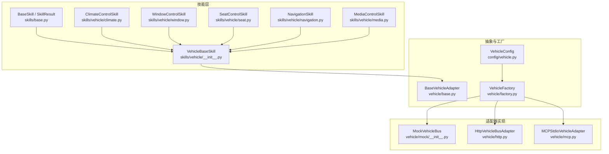
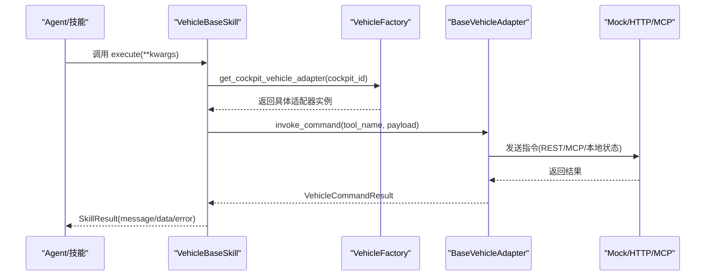
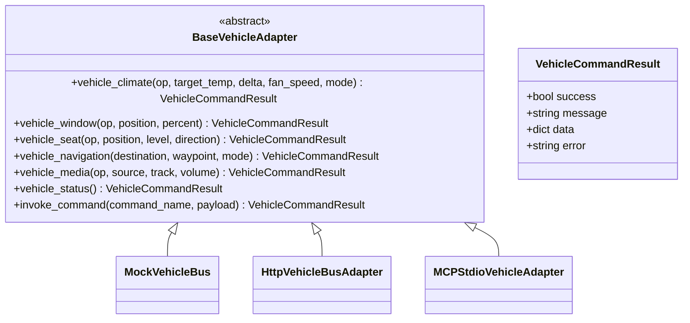
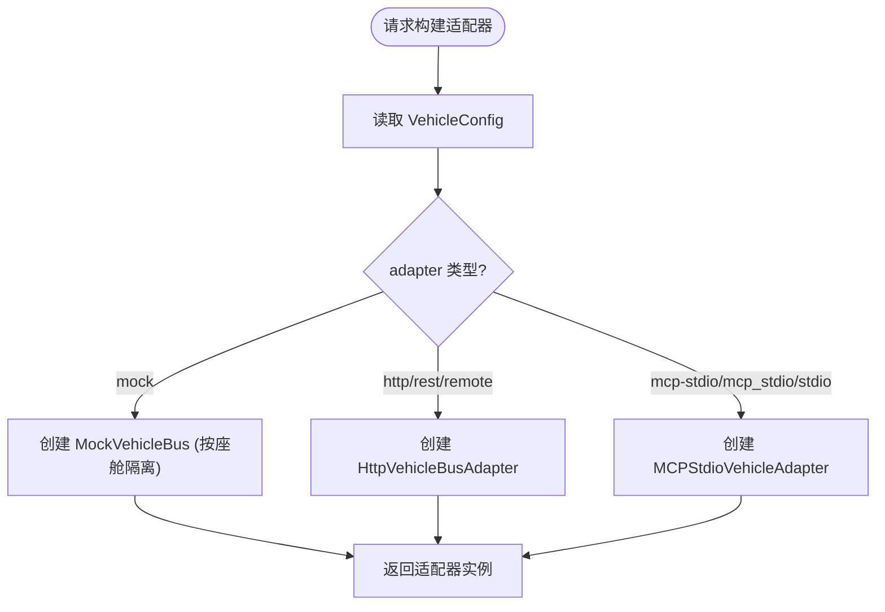
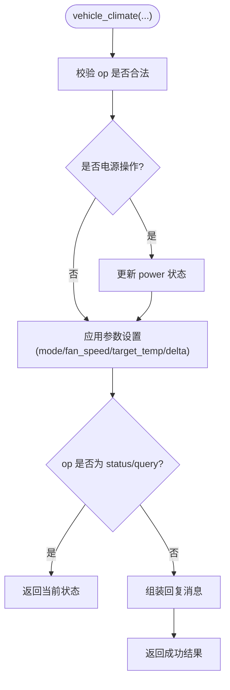
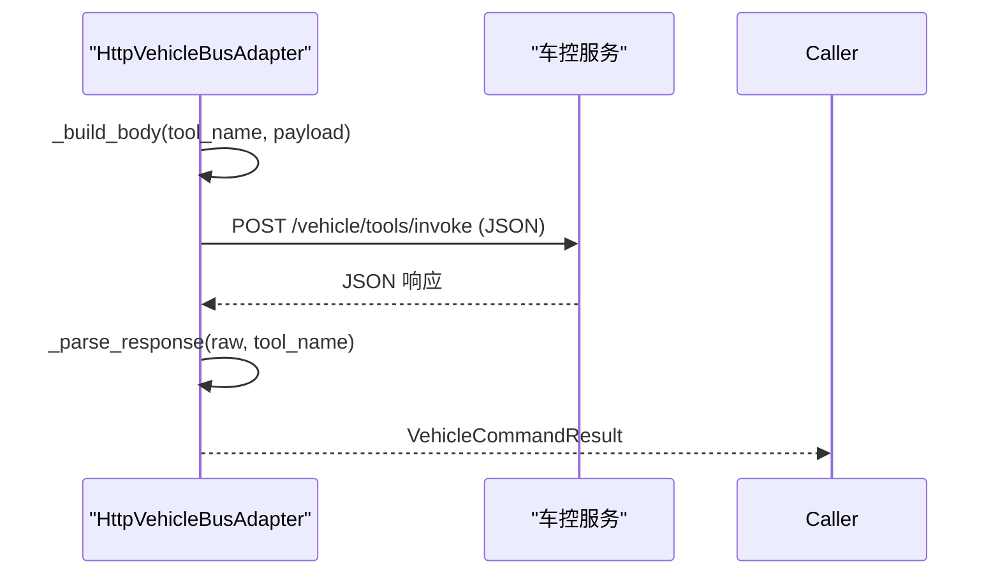
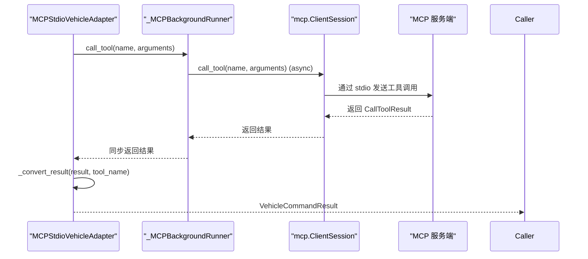
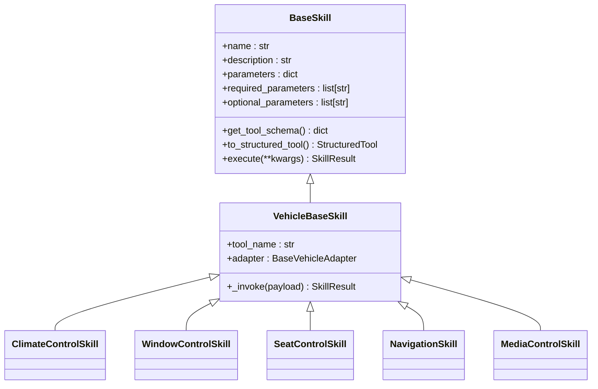
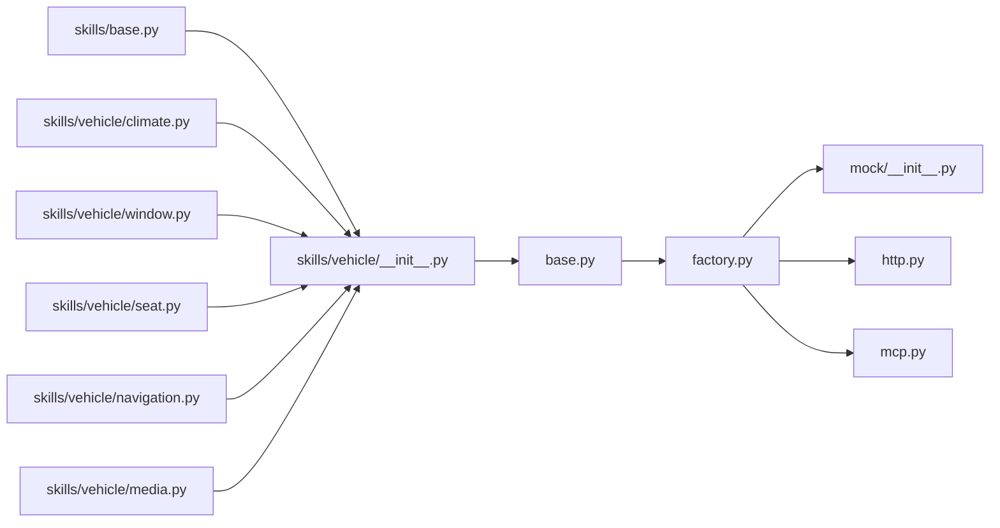

# 车控系统

<cite>
**本文引用的文件**   
- [backend_design/nexus/vehicle/base.py](file://backend_design/nexus/vehicle/base.py)
- [backend_design/nexus/vehicle/factory.py](file://backend_design/nexus/vehicle/factory.py)
- [backend_design/nexus/vehicle/http.py](file://backend_design/nexus/vehicle/http.py)
- [backend_design/nexus/vehicle/mcp.py](file://backend_design/nexus/vehicle/mcp.py)
- [backend_design/nexus/vehicle/mock/__init__.py](file://backend_design/nexus/vehicle/mock/__init__.py)
- [backend_design/nexus/vehicle/mock/climate_state.py](file://backend_design/nexus/vehicle/mock/climate_state.py)
- [backend_design/nexus/skills/base.py](file://backend_design/nexus/skills/base.py)
- [backend_design/nexus/skills/vehicle/__init__.py](file://backend_design/nexus/skills/vehicle/__init__.py)
- [backend_design/nexus/skills/vehicle/climate.py](file://backend_design/nexus/skills/vehicle/climate.py)
- [backend_design/nexus/skills/vehicle/window.py](file://backend_design/nexus/skills/vehicle/window.py)
- [backend_design/nexus/skills/vehicle/seat.py](file://backend_design/nexus/skills/vehicle/seat.py)
- [backend_design/nexus/skills/vehicle/navigation.py](file://backend_design/nexus/skills/vehicle/navigation.py)
- [backend_design/nexus/skills/vehicle/media.py](file://backend_design/nexus/skills/vehicle/media.py)
- [backend_design/nexus/config/vehicle.py](file://backend_design/nexus/config/vehicle.py)
</cite>

## 目录
1. [简介](#简介)
2. [项目结构](#项目结构)
3. [核心组件](#核心组件)
4. [架构总览](#架构总览)
5. [详细组件分析](#详细组件分析)
6. [依赖关系分析](#依赖关系分析)
7. [性能与可靠性](#性能与可靠性)
8. [故障排查指南](#故障排查指南)
9. [结论](#结论)
10. [附录：扩展指南与最佳实践](#附录扩展指南与最佳实践)

## 简介
本技术文档面向车辆开发者，系统性阐述 NexusCockpit 车控系统的适配器模式与三模式实现（Mock、HTTP RESTful、MCP 标准协议），并覆盖空调控制、车窗控制、座椅调节、导航控制和媒体播放等具体功能。文档解释命令执行流程、状态同步机制、错误处理策略，以及车控总线的消息格式与事件驱动架构。同时提供安全性考虑、权限控制与操作审计建议，帮助开发者快速扩展新的车控能力并适配不同车辆接口。

## 项目结构
车控子系统围绕“统一抽象 + 多后端适配”的架构展开：
- 抽象层：定义统一的 BaseVehicleAdapter 接口与结果模型 VehicleCommandResult
- 适配层：Mock、HTTP、MCP 三种适配器实现同一接口
- 工厂层：根据配置选择具体适配器，支持多座舱隔离
- 技能层：将业务意图封装为 Skill，通过 VehicleBaseSkill 调用适配器
- 配置层：集中管理适配器类型、HTTP/MCP 参数

```mermaid
graph TB
subgraph "抽象与工厂"
A["BaseVehicleAdapter<br/>vehicle/base.py"]
F["VehicleFactory<br/>vehicle/factory.py"]
Cfg["VehicleConfig<br/>config/vehicle.py"]
end
subgraph "适配器实现"
M["MockVehicleBus<br/>vehicle/mock/__init__.py"]
H["HttpVehicleBusAdapter<br/>vehicle/http.py"]
P["MCPStdioVehicleAdapter<br/>vehicle/mcp.py"]
end
subgraph "技能层"
SB["BaseSkill / SkillResult<br/>skills/base.py"]
VS["VehicleBaseSkill<br/>skills/vehicle/__init__.py"]
SC["ClimateControlSkill<br/>skills/vehicle/climate.py"]
SW["WindowControlSkill<br/>skills/vehicle/window.py"]
SS["SeatControlSkill<br/>skills/vehicle/seat.py"]
SN["NavigationSkill<br/>skills/vehicle/navigation.py"]
SM["MediaControlSkill<br/>skills/vehicle/media.py"]
end
Cfg --> F
F --> M
F --> H
F --> P
SB --> VS
VS --> A
SC --> VS
SW --> VS
SS --> VS
SN --> VS
SM --> VS
```

图表来源
- [backend_design/nexus/vehicle/base.py:35-92](file://backend_design/nexus/vehicle/base.py#L35-L92)
- [backend_design/nexus/vehicle/factory.py:38-122](file://backend_design/nexus/vehicle/factory.py#L38-L122)
- [backend_design/nexus/config/vehicle.py:15-49](file://backend_design/nexus/config/vehicle.py#L15-L49)
- [backend_design/nexus/vehicle/mock/__init__.py:39-220](file://backend_design/nexus/vehicle/mock/__init__.py#L39-L220)
- [backend_design/nexus/vehicle/http.py:23-127](file://backend_design/nexus/vehicle/http.py#L23-L127)
- [backend_design/nexus/vehicle/mcp.py:167-285](file://backend_design/nexus/vehicle/mcp.py#L167-L285)
- [backend_design/nexus/skills/base.py:116-264](file://backend_design/nexus/skills/base.py#L116-L264)
- [backend_design/nexus/skills/vehicle/__init__.py:21-55](file://backend_design/nexus/skills/vehicle/__init__.py#L21-L55)

章节来源
- [backend_design/nexus/vehicle/base.py:35-92](file://backend_design/nexus/vehicle/base.py#L35-L92)
- [backend_design/nexus/vehicle/factory.py:38-122](file://backend_design/nexus/vehicle/factory.py#L38-L122)
- [backend_design/nexus/config/vehicle.py:15-49](file://backend_design/nexus/config/vehicle.py#L15-L49)

## 核心组件
- 抽象接口与结果模型
  - BaseVehicleAdapter：定义空调、车窗、座椅、导航、媒体、状态查询与通用命令调用等统一方法
  - VehicleCommandResult：统一返回结构，包含成功标志、人类可读消息、结构化数据与错误码
- 适配器工厂
  - build_vehicle_adapter/get_cockpit_vehicle_adapter：按配置创建单例或按座舱隔离实例；支持 mock/http/mcp-stdio
- 适配器实现
  - MockVehicleBus：门面模式，内部委托到各状态子模块（空调/车窗/座椅/导航/媒体/车况）
  - HttpVehicleBusAdapter：通过 HTTP/REST 或 JSON-RPC 调用远端车控服务
  - MCPStdioVehicleAdapter：通过 MCP SDK stdio 通道与外部 MCP 服务通信，后台线程运行异步事件循环
- 技能层
  - BaseSkill/SkillResult：技能基类与统一结果，支持 OpenAI Function Calling Schema 生成与 LangChain StructuredTool 集成
  - VehicleBaseSkill：统一通过适配器调用 invoke_command，自动按座舱隔离获取适配器
  - 具体技能：climate/window/seat/navigation/media 等，声明工具名、参数与示例

章节来源
- [backend_design/nexus/vehicle/base.py:19-92](file://backend_design/nexus/vehicle/base.py#L19-L92)
- [backend_design/nexus/vehicle/factory.py:38-122](file://backend_design/nexus/vehicle/factory.py#L38-L122)
- [backend_design/nexus/vehicle/mock/__init__.py:39-220](file://backend_design/nexus/vehicle/mock/__init__.py#L39-L220)
- [backend_design/nexus/vehicle/http.py:23-127](file://backend_design/nexus/vehicle/http.py#L23-L127)
- [backend_design/nexus/vehicle/mcp.py:167-285](file://backend_design/nexus/vehicle/mcp.py#L167-L285)
- [backend_design/nexus/skills/base.py:92-264](file://backend_design/nexus/skills/base.py#L92-L264)
- [backend_design/nexus/skills/vehicle/__init__.py:21-55](file://backend_design/nexus/skills/vehicle/__init__.py#L21-L55)

## 架构总览
车控系统采用“适配器模式 + 工厂 + 技能编排”的分层架构。上层 Agent/技能只关心统一接口，不感知底层通信细节；工厂负责按环境动态选择后端；适配器屏蔽差异，向上返回统一结果。

```mermaid
sequenceDiagram
participant Agent as "Agent/技能"
participant Skill as "VehicleBaseSkill"
participant Factory as "VehicleFactory"
participant Adapter as "BaseVehicleAdapter"
participant Backend as "Mock/HTTP/MCP"
Agent->>Skill : 调用 execute(**kwargs)
Skill->>Factory : get_cockpit_vehicle_adapter(cockpit_id)
Factory-->>Skill : 返回具体适配器实例
Skill->>Adapter : invoke_command(tool_name, payload)
Adapter->>Backend : 发送指令(REST/MCP/本地状态)
Backend-->>Adapter : 返回结果
Adapter-->>Skill : VehicleCommandResult
Skill-->>Agent : SkillResult(message/data/error)
```

图表来源
- [backend_design/nexus/skills/vehicle/__init__.py:21-55](file://backend_design/nexus/skills/vehicle/__init__.py#L21-L55)
- [backend_design/nexus/vehicle/factory.py:55-84](file://backend_design/nexus/vehicle/factory.py#L55-L84)
- [backend_design/nexus/vehicle/base.py:89-92](file://backend_design/nexus/vehicle/base.py#L89-L92)

## 详细组件分析

### 抽象接口与结果模型
- BaseVehicleAdapter 定义了以下统一方法：
  - vehicle_climate：空调控制（温度、风量、模式、开关）
  - vehicle_window：车窗控制（开合、位置百分比）
  - vehicle_seat：座椅控制（加热/通风/按摩、位置调整）
  - vehicle_navigation：导航控制（目的地、途经点、模式）
  - vehicle_media：媒体控制（播放/暂停/切歌/音量/来源）
  - vehicle_status：全量状态查询
  - invoke_command：通用命令入口，便于扩展新工具
- VehicleCommandResult 提供 success/message/data/error 的统一返回结构，便于上层一致处理

```mermaid
classDiagram
class BaseVehicleAdapter {
<<abstract>>
+vehicle_climate(op, target_temp, delta, fan_speed, mode) VehicleCommandResult
+vehicle_window(op, position, percent) VehicleCommandResult
+vehicle_seat(op, position, level, direction) VehicleCommandResult
+vehicle_navigation(destination, waypoint, mode) VehicleCommandResult
+vehicle_media(op, source, track, volume) VehicleCommandResult
+vehicle_status() VehicleCommandResult
+invoke_command(command_name, payload) VehicleCommandResult
}
class VehicleCommandResult {
+bool success
+string message
+dict data
+string error
}
class MockVehicleBus
class HttpVehicleBusAdapter
class MCPStdioVehicleAdapter
BaseVehicleAdapter <|-- MockVehicleBus
BaseVehicleAdapter <|-- HttpVehicleBusAdapter
BaseVehicleAdapter <|-- MCPStdioVehicleAdapter
```

图表来源
- [backend_design/nexus/vehicle/base.py:19-92](file://backend_design/nexus/vehicle/base.py#L19-L92)

章节来源
- [backend_design/nexus/vehicle/base.py:19-92](file://backend_design/nexus/vehicle/base.py#L19-L92)

### 适配器工厂与多座舱隔离
- 工厂根据环境变量 VEHICLE_ADAPTER 选择后端：
  - mock：开发测试用，每座舱独立实例，状态物理隔离
  - http/rest/remote：通过 HTTP/REST 或 JSON-RPC 调用远端服务
  - mcp-stdio/mcp_stdio/stdio：通过 MCP SDK stdio 启动外部进程
- 多座舱隔离：
  - Mock 模式：每个 cockpit_id 拥有独立 MockVehicleBus 实例
  - HTTP/MCP 模式：无状态，复用单例

```mermaid
flowchart TD
Start(["请求构建适配器"]) --> ReadCfg["读取 VehicleConfig"]
ReadCfg --> Kind{"adapter 类型?"}
Kind --> |mock| CreateMock["创建 MockVehicleBus (按座舱隔离)"]
Kind --> |http/rest/remote| CreateHTTP["创建 HttpVehicleBusAdapter"]
Kind --> |mcp-stdio/mcp_stdio/stdio| CreateMCP["创建 MCPStdioVehicleAdapter"]
CreateMock --> Return["返回适配器实例"]
CreateHTTP --> Return
CreateMCP --> Return
```

图表来源
- [backend_design/nexus/vehicle/factory.py:86-122](file://backend_design/nexus/vehicle/factory.py#L86-L122)
- [backend_design/nexus/config/vehicle.py:15-49](file://backend_design/nexus/config/vehicle.py#L15-L49)

章节来源
- [backend_design/nexus/vehicle/factory.py:38-122](file://backend_design/nexus/vehicle/factory.py#L38-L122)
- [backend_design/nexus/config/vehicle.py:15-49](file://backend_design/nexus/config/vehicle.py#L15-L49)

### Mock 模拟环境（Facade 门面模式）
- MockVehicleBus 作为门面，内部委托到各状态子模块：
  - ClimateState：空调状态与控制逻辑（电源、温度、风量、模式、查询）
  - WindowState：车窗状态与控制
  - SeatState：座椅状态与控制
  - NavigationState：导航状态与控制（含 IP 定位）
  - MediaState：媒体状态与控制（播放列表扫描）
  - StatusState：车况摘要
- 支持命令别名映射 COMMAND_ALIASES，兼容历史命令风格
- 复合指令优化：如“打开空调温度22度风速1”，电源与参数设置顺序保证都生效

```mermaid
flowchart TD
Entry(["vehicle_climate(...)"]) --> ValidateOp["校验 op 是否合法"]
ValidateOp --> PowerOps{"是否电源操作?"}
PowerOps --> |是| SetPower["更新 power 状态"]
PowerOps --> |否| Params["应用参数设置(mode/fan_speed/target_temp/delta)"]
SetPower --> Params
Params --> QueryCheck{"op 是否为 status/query?"}
QueryCheck --> |是| ReturnStatus["返回当前状态"]
QueryCheck --> |否| BuildMsg["组装回复消息"]
BuildMsg --> ReturnOK["返回成功结果"]
```

图表来源
- [backend_design/nexus/vehicle/mock/__init__.py:39-220](file://backend_design/nexus/vehicle/mock/__init__.py#L39-L220)
- [backend_design/nexus/vehicle/mock/climate_state.py:22-143](file://backend_design/nexus/vehicle/mock/climate_state.py#L22-L143)

章节来源
- [backend_design/nexus/vehicle/mock/__init__.py:39-220](file://backend_design/nexus/vehicle/mock/__init__.py#L39-L220)
- [backend_design/nexus/vehicle/mock/climate_state.py:22-143](file://backend_design/nexus/vehicle/mock/climate_state.py#L22-L143)

### HTTP RESTful 接口适配器
- 通过 urllib.request 发起 POST 请求，支持两种协议：
  - rest：{"tool": name, "arguments": payload}
  - jsonrpc：{"jsonrpc":"2.0","id":...,"method":name,"params":payload}
- 响应解析：
  - 支持 {"success","message","data","error"} 或 {"result":{"..."}, "error":{...}} 等常见结构
  - 非 JSON 或连接失败时返回明确错误码
- 认证：可选 Authorization: Bearer token

```mermaid
sequenceDiagram
participant Adapter as "HttpVehicleBusAdapter"
participant HTTP as "车控服务"
Adapter->>Adapter : _build_body(tool_name, payload)
Adapter->>HTTP : POST /vehicle/tools/invoke (JSON)
HTTP-->>Adapter : JSON 响应
Adapter->>Adapter : _parse_response(raw, tool_name)
Adapter-->>Caller : VehicleCommandResult
```

图表来源
- [backend_design/nexus/vehicle/http.py:69-127](file://backend_design/nexus/vehicle/http.py#L69-L127)

章节来源
- [backend_design/nexus/vehicle/http.py:23-127](file://backend_design/nexus/vehicle/http.py#L23-L127)

### MCP 标准协议适配器
- 使用 MCP SDK 的 ClientSession + StdioServerParameters，通过标准输入输出与外部 MCP 服务通信
- 后台线程运行 asyncio 事件循环，暴露同步接口给上层
- 初始化流程：
  - 启动后台线程与事件循环
  - 建立 stdio_client 与 ClientSession
  - session.initialize() 与 list_tools() 获取可用工具
- 调用流程：
  - call_tool(name, arguments) 通过 run_coroutine_threadsafe 桥接异步调用
  - 将 CallToolResult 转换为 VehicleCommandResult（提取文本内容、structuredContent、错误标志）

```mermaid
sequenceDiagram
participant Adapter as "MCPStdioVehicleAdapter"
participant Runner as "_MCPBackgroundRunner"
participant Session as "mcp.ClientSession"
participant Server as "MCP 服务端"
Adapter->>Runner : call_tool(name, arguments)
Runner->>Session : call_tool(name, arguments) (async)
Session->>Server : 通过 stdio 发送工具调用
Server-->>Session : 返回 CallToolResult
Session-->>Runner : 返回结果
Runner-->>Adapter : 同步返回结果
Adapter->>Adapter : _convert_result(result, tool_name)
Adapter-->>Caller : VehicleCommandResult
```

图表来源
- [backend_design/nexus/vehicle/mcp.py:25-165](file://backend_design/nexus/vehicle/mcp.py#L25-L165)
- [backend_design/nexus/vehicle/mcp.py:167-285](file://backend_design/nexus/vehicle/mcp.py#L167-L285)

章节来源
- [backend_design/nexus/vehicle/mcp.py:167-285](file://backend_design/nexus/vehicle/mcp.py#L167-L285)

### 技能层与车控总线集成
- BaseSkill/SkillResult：统一技能元信息、Schema 生成与结果封装
- VehicleBaseSkill：
  - 通过 tenant_context 获取 cockpit_id，调用 factory.get_cockpit_vehicle_adapter 获取对应适配器
  - _invoke 统一调用 adapter.invoke_command(tool_name, payload)，并将 VehicleCommandResult 转为 SkillResult
- 具体技能（climate/window/seat/navigation/media）：
  - 声明 tool_name、parameters、examples，execute 中直接调用 _invoke

```mermaid
classDiagram
class BaseSkill {
+name : str
+description : str
+parameters : dict
+required_parameters : list[str]
+optional_parameters : list[str]
+get_tool_schema() dict
+to_structured_tool() StructuredTool
+execute(**kwargs) SkillResult
}
class VehicleBaseSkill {
+tool_name : str
+adapter : BaseVehicleAdapter
+_invoke(payload) SkillResult
}
class ClimateControlSkill
class WindowControlSkill
class SeatControlSkill
class NavigationSkill
class MediaControlSkill
BaseSkill <|-- VehicleBaseSkill
VehicleBaseSkill <|-- ClimateControlSkill
VehicleBaseSkill <|-- WindowControlSkill
VehicleBaseSkill <|-- SeatControlSkill
VehicleBaseSkill <|-- NavigationSkill
VehicleBaseSkill <|-- MediaControlSkill
```

图表来源
- [backend_design/nexus/skills/base.py:116-264](file://backend_design/nexus/skills/base.py#L116-L264)
- [backend_design/nexus/skills/vehicle/__init__.py:21-55](file://backend_design/nexus/skills/vehicle/__init__.py#L21-L55)
- [backend_design/nexus/skills/vehicle/climate.py:15-37](file://backend_design/nexus/skills/vehicle/climate.py#L15-L37)
- [backend_design/nexus/skills/vehicle/window.py:15-34](file://backend_design/nexus/skills/vehicle/window.py#L15-L34)
- [backend_design/nexus/skills/vehicle/seat.py:15-35](file://backend_design/nexus/skills/vehicle/seat.py#L15-L35)
- [backend_design/nexus/skills/vehicle/navigation.py:15-39](file://backend_design/nexus/skills/vehicle/navigation.py#L15-L39)
- [backend_design/nexus/skills/vehicle/media.py:15-36](file://backend_design/nexus/skills/vehicle/media.py#L15-L36)

章节来源
- [backend_design/nexus/skills/base.py:116-264](file://backend_design/nexus/skills/base.py#L116-L264)
- [backend_design/nexus/skills/vehicle/__init__.py:21-55](file://backend_design/nexus/skills/vehicle/__init__.py#L21-L55)
- [backend_design/nexus/skills/vehicle/climate.py:15-37](file://backend_design/nexus/skills/vehicle/climate.py#L15-L37)
- [backend_design/nexus/skills/vehicle/window.py:15-34](file://backend_design/nexus/skills/vehicle/window.py#L15-L34)
- [backend_design/nexus/skills/vehicle/seat.py:15-35](file://backend_design/nexus/skills/vehicle/seat.py#L15-L35)
- [backend_design/nexus/skills/vehicle/navigation.py:15-39](file://backend_design/nexus/skills/vehicle/navigation.py#L15-L39)
- [backend_design/nexus/skills/vehicle/media.py:15-36](file://backend_design/nexus/skills/vehicle/media.py#L15-L36)

## 依赖关系分析
- 组件耦合与内聚
  - BaseVehicleAdapter 高内聚地定义车控能力边界，适配器实现低耦合替换
  - 工厂集中管理生命周期与选择策略，避免散落的 if/else
  - 技能层仅依赖抽象接口，不感知具体通信方式
- 外部依赖
  - HTTP 适配器依赖 urllib.request
  - MCP 适配器依赖 mcp.ClientSession 与 stdio_client
  - 技能层依赖 LangChain StructuredTool 与 Pydantic 动态模型
- 潜在循环依赖
  - 通过延迟导入（在函数体内 import）避免模块级循环

```mermaid
graph LR
Base["base.py"] --> Factory["factory.py"]
Factory --> Mock["mock/__init__.py"]
Factory --> HTTP["http.py"]
Factory --> MCP["mcp.py"]
SkillsBase["skills/base.py"] --> VehicleBase["skills/vehicle/__init__.py"]
VehicleBase --> Base
SkillsClimate["skills/vehicle/climate.py"] --> VehicleBase
SkillsWindow["skills/vehicle/window.py"] --> VehicleBase
SkillsSeat["skills/vehicle/seat.py"] --> VehicleBase
SkillsNav["skills/vehicle/navigation.py"] --> VehicleBase
SkillsMedia["skills/vehicle/media.py"] --> VehicleBase
```

图表来源
- [backend_design/nexus/vehicle/base.py:35-92](file://backend_design/nexus/vehicle/base.py#L35-L92)
- [backend_design/nexus/vehicle/factory.py:38-122](file://backend_design/nexus/vehicle/factory.py#L38-L122)
- [backend_design/nexus/skills/base.py:116-264](file://backend_design/nexus/skills/base.py#L116-L264)
- [backend_design/nexus/skills/vehicle/__init__.py:21-55](file://backend_design/nexus/skills/vehicle/__init__.py#L21-L55)

章节来源
- [backend_design/nexus/vehicle/base.py:35-92](file://backend_design/nexus/vehicle/base.py#L35-L92)
- [backend_design/nexus/vehicle/factory.py:38-122](file://backend_design/nexus/vehicle/factory.py#L38-L122)
- [backend_design/nexus/skills/base.py:116-264](file://backend_design/nexus/skills/base.py#L116-L264)
- [backend_design/nexus/skills/vehicle/__init__.py:21-55](file://backend_design/nexus/skills/vehicle/__init__.py#L21-L55)

## 性能与可靠性
- 性能特性
  - Mock：内存操作，零网络开销，适合开发与单元测试
  - HTTP：基于 urllib 的同步请求，超时可配置；适合轻量集成
  - MCP：后台线程 + 异步事件循环，减少阻塞；工具列表缓存降低重复探测
- 可靠性策略
  - 超时与重试：HTTP 与 MCP 均支持超时配置；可在上层引入重试与熔断
  - 错误分类：connection_failed、invalid_response、tool_not_exposed、mcp_call_failed 等
  - 多座舱隔离：Mock 模式下状态互不影响，避免跨座舱污染

[本节为通用指导，无需引用具体文件]

## 故障排查指南
- 常见问题与定位
  - 无法连接真实车控服务：检查 VEHICLE_API_BASE_URL、VEHICLE_API_PROTOCOL、VEHICLE_API_ENDPOINT 与网络连通性
  - 非 JSON 响应：确认后端返回格式是否符合约定（支持 result/error 包裹）
  - MCP 工具未暴露：确保 MCP 服务端已正确注册工具名称，且 validate_tools=True
  - 超时错误：适当增大 api_timeout 或 MCP tool_timeout
- 日志与诊断
  - 工厂创建日志：记录选择的适配器与关键参数
  - HTTP/MCP 调用异常：捕获并记录错误码与原始响应片段
  - Mock 状态：通过属性 climate/windows/seats/media/navigation/status 查看当前状态

章节来源
- [backend_design/nexus/vehicle/http.py:82-92](file://backend_design/nexus/vehicle/http.py#L82-L92)
- [backend_design/nexus/vehicle/mcp.py:225-237](file://backend_design/nexus/vehicle/mcp.py#L225-L237)
- [backend_design/nexus/vehicle/factory.py:86-122](file://backend_design/nexus/vehicle/factory.py#L86-L122)

## 结论
NexusCockpit 车控系统通过适配器模式实现了 Mock/HTTP/MCP 三模式的统一抽象，使上层技能与 Agent 无需关心底层通信细节。工厂层提供灵活的后端选择与多座舱隔离，技能层以标准化 Schema 与大模型工具调用无缝对接。该设计具备良好的可扩展性与可维护性，适合快速接入不同车辆接口并持续演进。

[本节为总结，无需引用具体文件]

## 附录：扩展指南与最佳实践

### 新增车控功能的步骤
- 定义技能
  - 在 skills/vehicle 下新建 Python 文件，继承 VehicleBaseSkill
  - 声明 name、tool_name、description、parameters、examples
  - 在 execute 中调用 self._invoke(kwargs)
- 若需新增适配器能力
  - 在 BaseVehicleAdapter 中增加抽象方法
  - 在各适配器实现中补充对应逻辑（Mock/HTTP/MCP）
  - 在 MockVehicleBus 中委托到相应状态子模块
- 配置与选择
  - 通过 VehicleConfig 设置 VEHICLE_ADAPTER 及相关参数
  - 工厂会自动创建并缓存适配器实例

章节来源
- [backend_design/nexus/skills/base.py:116-264](file://backend_design/nexus/skills/base.py#L116-L264)
- [backend_design/nexus/skills/vehicle/__init__.py:21-55](file://backend_design/nexus/skills/vehicle/__init__.py#L21-L55)
- [backend_design/nexus/vehicle/base.py:35-92](file://backend_design/nexus/vehicle/base.py#L35-L92)
- [backend_design/nexus/config/vehicle.py:15-49](file://backend_design/nexus/config/vehicle.py#L15-L49)

### 安全与权限控制建议
- 传输安全
  - HTTP 模式启用 HTTPS，配置 api_token 进行鉴权
  - MCP 模式限制进程白名单与工作目录，避免任意命令执行
- 权限与审计
  - 在技能层增加 requires_auth/risk_level/idempotent 标记，结合网关或中间件做鉴权与限流
  - 对敏感操作（如导航、媒体切换）记录审计日志（用户、座舱、时间、参数、结果）
- 输入校验
  - 使用 Pydantic 动态模型对参数进行严格校验，拒绝非法值
  - 对字符串参数进行长度与字符集限制，防止注入

[本节为通用指导，无需引用具体文件]

### 事件驱动与状态同步
- 事件驱动架构
  - 上层可通过 WebSocket 推送车控状态变更（例如空调温度变化、车窗开合状态）
  - 前端订阅事件，实时更新 UI
- 状态同步机制
  - Mock：内存状态字典，实时可见
  - HTTP/MCP：由远端服务主动推送或通过轮询拉取最新状态
  - 建议在适配器层增加状态缓存与一致性校验

[本节为通用指导，无需引用具体文件]

### 集成最佳实践
- 分层清晰：技能层只关注业务语义，适配器层专注通信细节
- 配置外置：所有后端参数通过环境变量或配置文件注入，便于部署切换
- 可观测性：统一日志、指标与追踪，便于问题定位与性能优化
- 渐进式迁移：先以 Mock 验证逻辑，再切换到 HTTP/MCP 进行端到端联调

[本节为通用指导，无需引用具体文件]