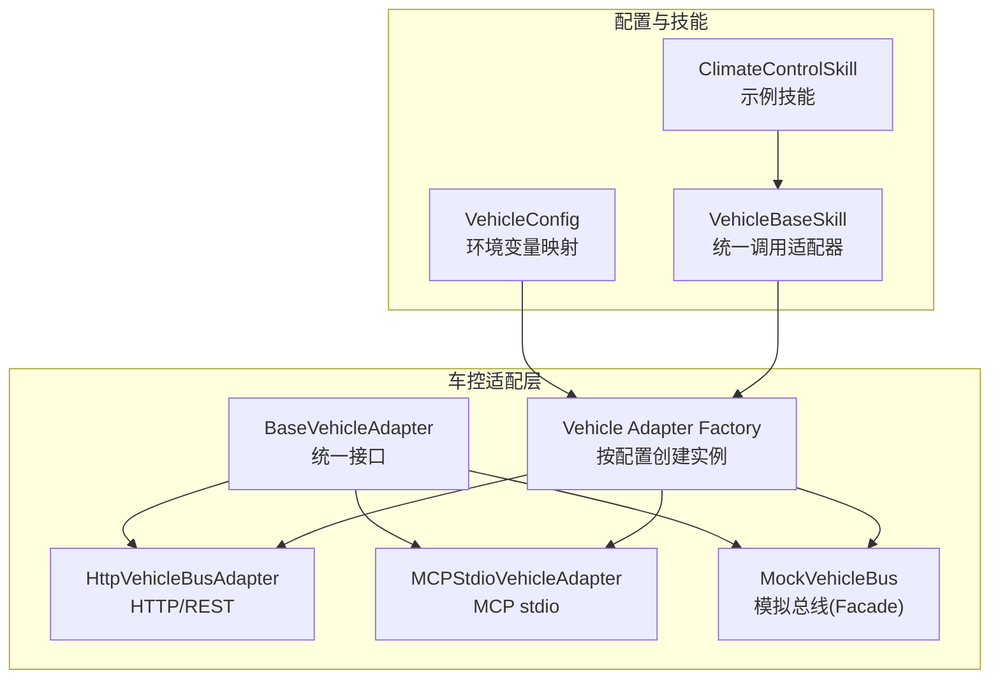
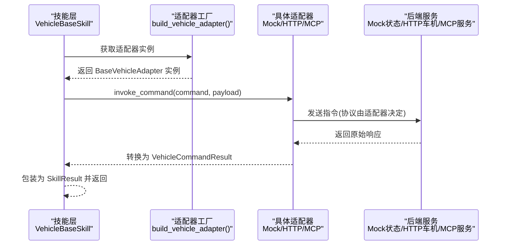
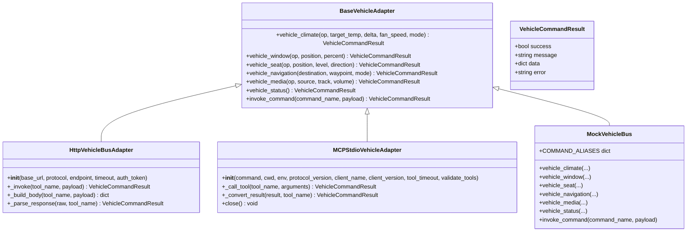
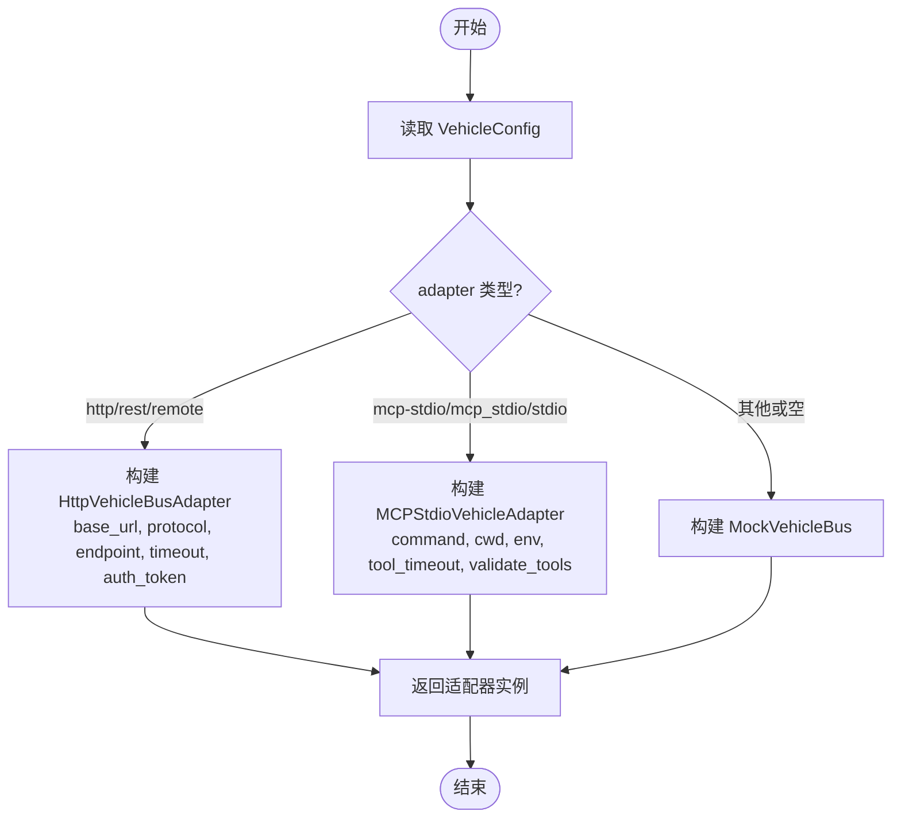
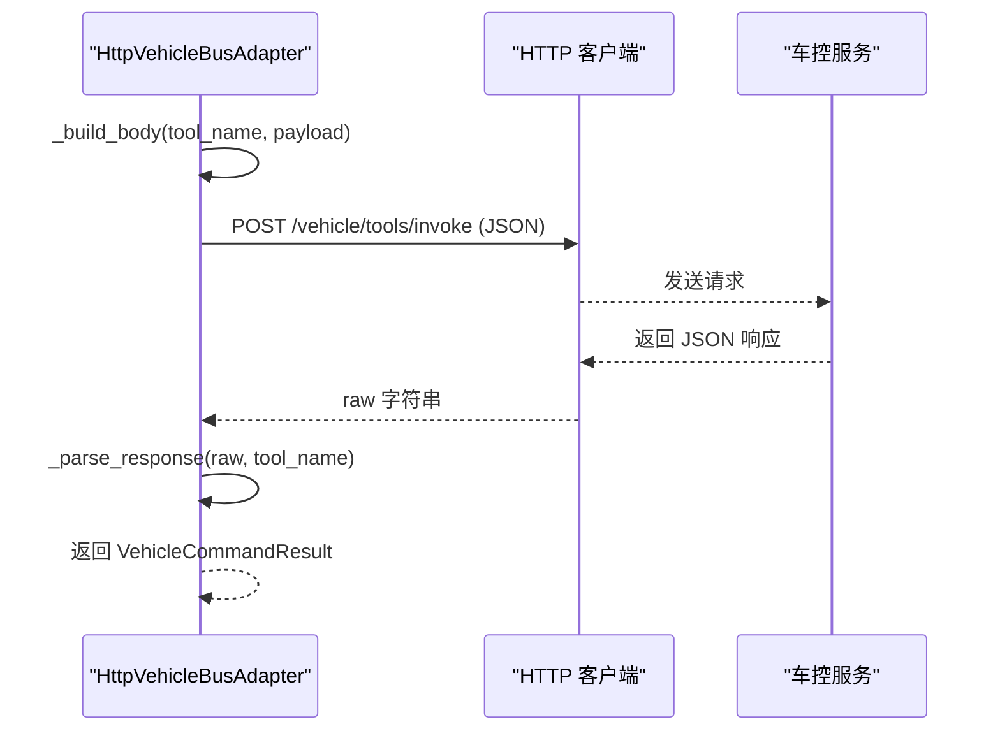
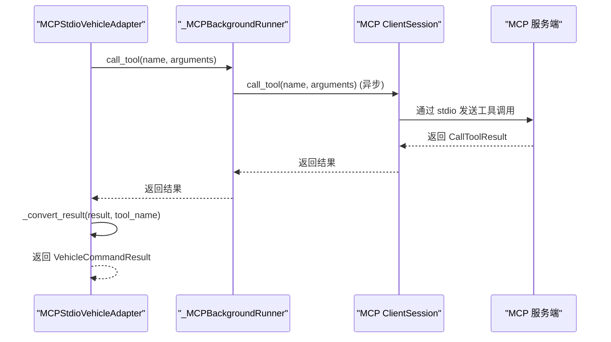
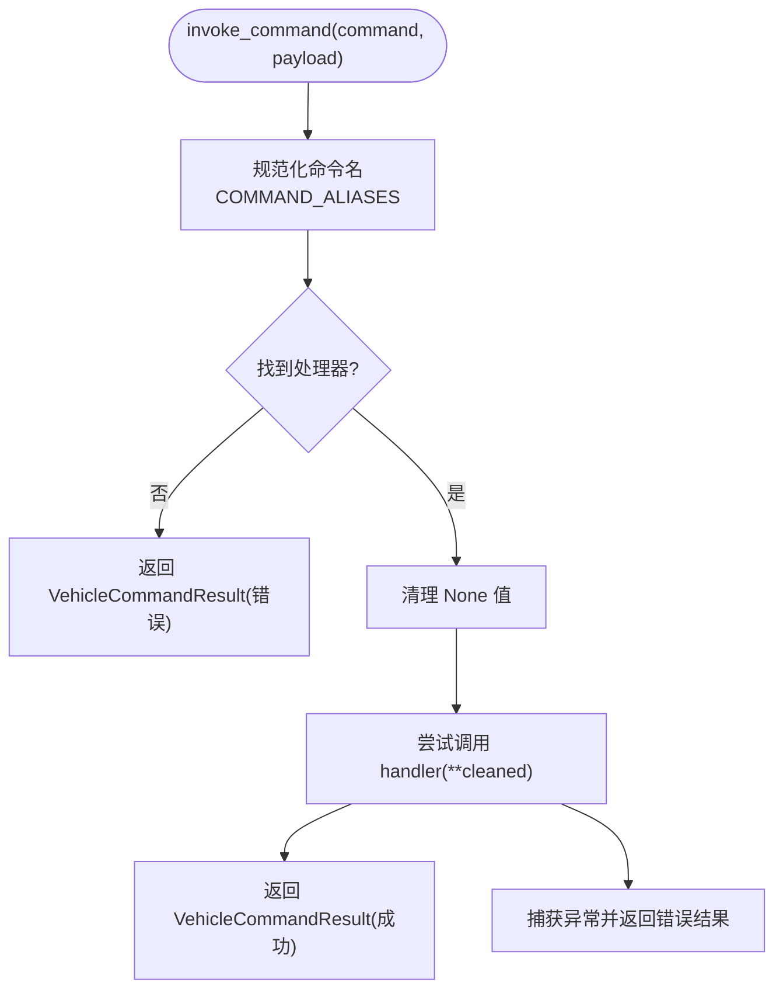
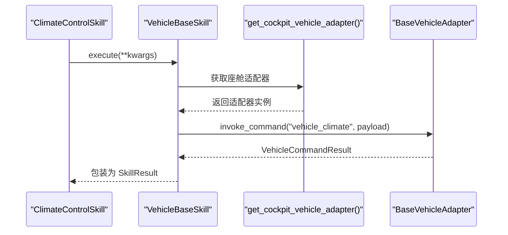
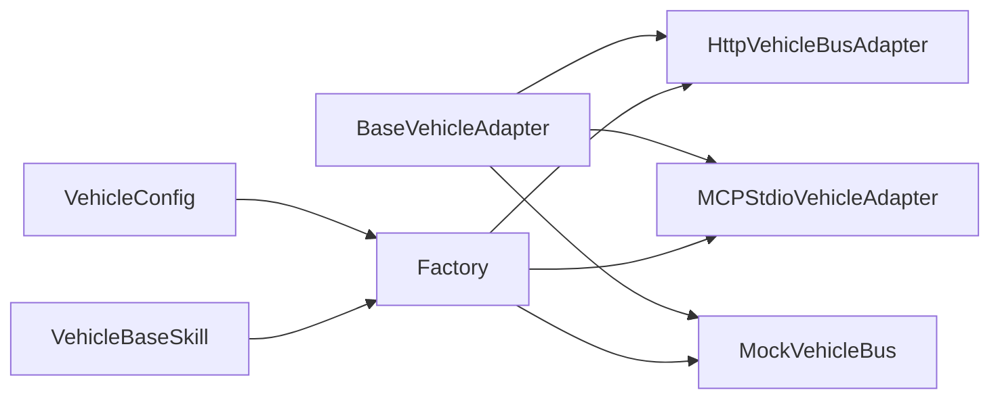

# 车控适配器模式设计

<cite>
**本文引用的文件**   
- [base.py](file://backend_design/nexus/vehicle/base.py)
- [factory.py](file://backend_design/nexus/vehicle/factory.py)
- [http.py](file://backend_design/nexus/vehicle/http.py)
- [mcp.py](file://backend_design/nexus/vehicle/mcp.py)
- [mock/__init__.py](file://backend_design/nexus/vehicle/mock/__init__.py)
- [climate_state.py](file://backend_design/nexus/vehicle/mock/climate_state.py)
- [vehicle.py](file://backend_design/nexus/config/vehicle.py)
- [skills_vehicle_init.py](file://backend_design/nexus/skills/vehicle/__init__.py)
- [climate_skill.py](file://backend_design/nexus/skills/vehicle/climate.py)
</cite>

## 目录
1. [简介](#简介)
2. [项目结构](#项目结构)
3. [核心组件](#核心组件)
4. [架构总览](#架构总览)
5. [详细组件分析](#详细组件分析)
6. [依赖关系分析](#依赖关系分析)
7. [性能考量](#性能考量)
8. [故障排查指南](#故障排查指南)
9. [结论](#结论)
10. [附录：扩展最佳实践与示例](#附录：扩展最佳实践与示例)

## 简介
本技术文档围绕 NexusCockpit 的“车控适配器模式”展开，系统性阐述 BaseVehicleAdapter 抽象基类的设计理念、统一接口规范与 VehicleCommandResult 数据模型；解释如何通过适配器模式对 Mock、HTTP、MCP 三种通信方式进行统一抽象，使上层技能层无需关心具体车控通信方式；并说明工厂模式在适配器实例化与配置管理中的作用。文档同时提供接口设计规范、错误处理策略与扩展最佳实践，帮助开发者快速理解与扩展新的车控适配器实现。

## 项目结构
NexusCockpit 的车控适配层位于 backend_design/nexus/vehicle 目录下，采用清晰的模块化组织：
- base.py：定义抽象基类与统一结果模型
- factory.py：根据配置选择并创建具体适配器（Mock/HTTP/MCP）
- http.py：HTTP REST 适配器实现
- mcp.py：MCP stdio 适配器实现（含后台异步事件循环桥接）
- mock/__init__.py：Mock 门面实现，内部委托到各状态子模块
- config/vehicle.py：车控适配器相关配置项（环境变量映射）
- skills/vehicle/*：基于适配器封装的技能实现（如空调控制）

图表来源
- [base.py:35-92](file://backend_design/nexus/vehicle/base.py#L35-L92)
- [factory.py:38-122](file://backend_design/nexus/vehicle/factory.py#L38-L122)
- [http.py:23-68](file://backend_design/nexus/vehicle/http.py#L23-L68)
- [mcp.py:167-224](file://backend_design/nexus/vehicle/mcp.py#L167-L224)
- [mock/__init__.py:39-220](file://backend_design/nexus/vehicle/mock/__init__.py#L39-L220)
- [vehicle.py:15-49](file://backend_design/nexus/config/vehicle.py#L15-L49)
- [skills_vehicle_init.py:21-55](file://backend_design/nexus/skills/vehicle/__init__.py#L21-L55)
- [climate_skill.py:15-37](file://backend_design/nexus/skills/vehicle/climate.py#L15-L37)

章节来源
- [base.py:1-92](file://backend_design/nexus/vehicle/base.py#L1-L92)
- [factory.py:1-147](file://backend_design/nexus/vehicle/factory.py#L1-L147)
- [http.py:1-127](file://backend_design/nexus/vehicle/http.py#L1-L127)
- [mcp.py:1-285](file://backend_design/nexus/vehicle/mcp.py#L1-L285)
- [mock/__init__.py:1-220](file://backend_design/nexus/vehicle/mock/__init__.py#L1-L220)
- [vehicle.py:1-50](file://backend_design/nexus/config/vehicle.py#L1-L50)
- [skills_vehicle_init.py:1-55](file://backend_design/nexus/skills/vehicle/__init__.py#L1-L55)
- [climate_skill.py:1-37](file://backend_design/nexus/skills/vehicle/climate.py#L1-L37)

## 核心组件
- BaseVehicleAdapter：定义统一的车辆控制接口（空调、车窗、座椅、导航、媒体、状态查询、通用命令调用），所有具体适配器必须实现这些方法，确保上层调用一致。
- VehicleCommandResult：统一的结果数据结构，包含 success、message、data、error 四个字段，屏蔽不同后端的返回差异。
- 适配器实现：
  - HttpVehicleBusAdapter：通过 HTTP/REST 或 JSON-RPC 协议与真实车控服务通信，统一解析响应为 VehicleCommandResult。
  - MCPStdioVehicleAdapter：通过 MCP SDK 的 stdio 通道与外部 MCP 服务通信，内部使用后台线程运行异步事件循环，对外暴露同步接口。
  - MockVehicleBus：面向开发与测试的模拟实现，Facade 门面模式将请求分发到各子系统状态模块，支持命令别名映射。
- 工厂模式：根据配置（VEHICLE_ADAPTER 等）动态创建对应适配器实例，并提供单例与多座舱隔离能力。
- 配置管理：VehicleConfig 通过 pydantic-settings 从环境变量加载配置，驱动工厂选择合适的适配器。

章节来源
- [base.py:19-92](file://backend_design/nexus/vehicle/base.py#L19-L92)
- [http.py:23-127](file://backend_design/nexus/vehicle/http.py#L23-L127)
- [mcp.py:167-285](file://backend_design/nexus/vehicle/mcp.py#L167-L285)
- [mock/__init__.py:39-220](file://backend_design/nexus/vehicle/mock/__init__.py#L39-L220)
- [factory.py:38-122](file://backend_design/nexus/vehicle/factory.py#L38-L122)
- [vehicle.py:15-49](file://backend_design/nexus/config/vehicle.py#L15-L49)

## 架构总览
下图展示了车控适配层的整体架构与数据流：上层技能通过 VehicleBaseSkill 调用适配器，工厂根据配置返回具体实现；Mock/HTTP/MCP 三种方式均返回统一的 VehicleCommandResult，屏蔽底层差异。

图表来源
- [skills_vehicle_init.py:44-55](file://backend_design/nexus/skills/vehicle/__init__.py#L44-L55)
- [factory.py:38-84](file://backend_design/nexus/vehicle/factory.py#L38-L84)
- [http.py:69-127](file://backend_design/nexus/vehicle/http.py#L69-L127)
- [mcp.py:225-280](file://backend_design/nexus/vehicle/mcp.py#L225-L280)
- [mock/__init__.py:194-220](file://backend_design/nexus/vehicle/mock/__init__.py#L194-L220)

## 详细组件分析

### BaseVehicleAdapter 与 VehicleCommandResult
- BaseVehicleAdapter 定义了统一的接口集合，包括空调、车窗、座椅、导航、媒体、状态查询以及通用命令调用。子类必须实现这些方法以保证多态一致性。
- VehicleCommandResult 是统一的结果载体，包含成功标志、人类可读消息、结构化数据和错误信息，便于上层统一处理。

图表来源
- [base.py:19-92](file://backend_design/nexus/vehicle/base.py#L19-L92)
- [http.py:23-127](file://backend_design/nexus/vehicle/http.py#L23-L127)
- [mcp.py:167-285](file://backend_design/nexus/vehicle/mcp.py#L167-L285)
- [mock/__init__.py:39-220](file://backend_design/nexus/vehicle/mock/__init__.py#L39-L220)

章节来源
- [base.py:19-92](file://backend_design/nexus/vehicle/base.py#L19-L92)

### 工厂模式与配置管理
- build_vehicle_adapter：首次调用时根据配置创建适配器实例并缓存为单例，后续直接返回，避免重复初始化。
- get_cockpit_vehicle_adapter：按座舱 ID 返回独立适配器实例（Mock 模式每座舱独立状态；HTTP/MCP 无状态复用单例）。
- _create_adapter：根据配置中的 adapter 类型选择具体实现，并传入相应参数（如 HTTP 的 base_url、endpoint、timeout、auth_token；MCP 的 command、cwd、env、tool_timeout 等）。
- VehicleConfig：通过环境变量映射配置项，支持 mock/http/mcp 三种模式及丰富的运行时参数。

图表来源
- [factory.py:86-122](file://backend_design/nexus/vehicle/factory.py#L86-L122)
- [vehicle.py:15-49](file://backend_design/nexus/config/vehicle.py#L15-L49)

章节来源
- [factory.py:38-147](file://backend_design/nexus/vehicle/factory.py#L38-L147)
- [vehicle.py:15-49](file://backend_design/nexus/config/vehicle.py#L15-L49)

### HTTP 适配器实现细节
- 构造参数：base_url、protocol（rest/jsonrpc）、endpoint、timeout、auth_token。
- 统一调用：每个业务方法（如 vehicle_climate）将参数封装为 payload，调用 _invoke。
- 请求体构建：根据 protocol 生成 JSON-RPC 或 REST 格式的请求体。
- 响应解析：统一解析为 VehicleCommandResult，兼容多种返回结构（result 包裹、error 块、纯数据等）。
- 错误处理：捕获 HTTP 错误、连接失败与通用异常，返回明确的错误码与消息。

图表来源
- [http.py:69-127](file://backend_design/nexus/vehicle/http.py#L69-L127)

章节来源
- [http.py:23-127](file://backend_design/nexus/vehicle/http.py#L23-L127)

### MCP 适配器实现细节
- 背景线程与事件循环：_MCPBackgroundRunner 在后台 daemon 线程中运行 asyncio 事件循环，维护 MCP ClientSession 生命周期。
- 工具列表校验：可选 validate_tools，启动时列出可用工具并缓存，调用前校验工具是否暴露。
- 同步接口桥接：通过 run_coroutine_threadsafe 将同步调用桥接到异步 session.call_tool。
- 结果转换：将 MCP CallToolResult 转换为 VehicleCommandResult，提取文本内容、结构化内容与错误标志。

图表来源
- [mcp.py:137-151](file://backend_design/nexus/vehicle/mcp.py#L137-L151)
- [mcp.py:225-280](file://backend_design/nexus/vehicle/mcp.py#L225-L280)

章节来源
- [mcp.py:25-165](file://backend_design/nexus/vehicle/mcp.py#L25-L165)
- [mcp.py:167-285](file://backend_design/nexus/vehicle/mcp.py#L167-L285)

### Mock 适配器与状态管理
- Facade 门面：MockVehicleBus 对外保持与 BaseVehicleAdapter 一致的接口，内部委托到 ClimateState、WindowState、SeatState、NavigationState、MediaState、StatusState。
- 命令别名：COMMAND_ALIASES 支持多种命令名映射到统一方法，增强兼容性。
- 状态聚合：vehicle_status 聚合所有子系统状态，便于一次性查询。
- 空调状态逻辑：ClimateState.handle 支持电源开关、温度调节、风量设置、模式切换等操作，保证复合指令顺序执行。

图表来源
- [mock/__init__.py:194-220](file://backend_design/nexus/vehicle/mock/__init__.py#L194-L220)
- [climate_state.py:41-143](file://backend_design/nexus/vehicle/mock/climate_state.py#L41-L143)

章节来源
- [mock/__init__.py:39-220](file://backend_design/nexus/vehicle/mock/__init__.py#L39-L220)
- [climate_state.py:22-143](file://backend_design/nexus/vehicle/mock/climate_state.py#L22-L143)

### 技能层与适配器集成
- VehicleBaseSkill：统一通过适配器调用车控功能，自动根据当前座舱上下文获取独立适配器实例，确保多座舱隔离。
- 示例技能 ClimateControlSkill：声明工具名、参数描述与示例，execute 中调用 _invoke 完成实际调用。

图表来源
- [skills_vehicle_init.py:31-55](file://backend_design/nexus/skills/vehicle/__init__.py#L31-L55)
- [climate_skill.py:35-37](file://backend_design/nexus/skills/vehicle/climate.py#L35-L37)

章节来源
- [skills_vehicle_init.py:21-55](file://backend_design/nexus/skills/vehicle/__init__.py#L21-L55)
- [climate_skill.py:15-37](file://backend_design/nexus/skills/vehicle/climate.py#L15-L37)

## 依赖关系分析
- BaseVehicleAdapter 是所有适配器的共同父类，确保接口一致性。
- 工厂依赖配置模块 VehicleConfig，根据环境变量选择具体适配器。
- HTTP 适配器依赖 urllib 进行网络请求，统一解析响应。
- MCP 适配器依赖 mcp SDK，通过后台线程与事件循环桥接异步调用。
- Mock 适配器依赖多个状态子模块，Facade 模式简化调用。
- 技能层依赖工厂与适配器，屏蔽底层差异。

图表来源
- [base.py:35-92](file://backend_design/nexus/vehicle/base.py#L35-L92)
- [factory.py:38-122](file://backend_design/nexus/vehicle/factory.py#L38-L122)
- [vehicle.py:15-49](file://backend_design/nexus/config/vehicle.py#L15-L49)
- [skills_vehicle_init.py:21-55](file://backend_design/nexus/skills/vehicle/__init__.py#L21-L55)

章节来源
- [base.py:35-92](file://backend_design/nexus/vehicle/base.py#L35-L92)
- [factory.py:38-122](file://backend_design/nexus/vehicle/factory.py#L38-L122)
- [vehicle.py:15-49](file://backend_design/nexus/config/vehicle.py#L15-L49)
- [skills_vehicle_init.py:21-55](file://backend_design/nexus/skills/vehicle/__init__.py#L21-L55)

## 性能考量
- 单例与多座舱隔离：工厂默认返回单例适配器，减少重复初始化开销；Mock 模式下按座舱独立实例，避免状态污染。
- HTTP 超时与重试：合理设置 api_timeout，避免阻塞；可在上层增加重试与熔断机制。
- MCP 后台线程：后台事件循环避免阻塞主线程；工具调用超时需合理配置，防止长时间等待。
- 响应解析优化：HTTP 与 MCP 适配器统一解析响应，减少上层分支判断。

[本节为通用指导，不直接分析具体文件]

## 故障排查指南
- HTTP 适配器错误：
  - HTTPError：检查车控服务地址、端口与认证 Token。
  - URLError：检查网络连接与服务可用性。
  - 非 JSON 响应：确认服务端返回格式是否符合预期。
- MCP 适配器错误：
  - 初始化超时：检查 MCP 启动命令与工作目录是否正确。
  - 工具未暴露：确认 MCP 服务是否暴露所需工具名称。
  - 调用失败：查看 structuredContent 与 isError 标志定位问题。
- Mock 适配器错误：
  - 命令不支持：检查 COMMAND_ALIASES 映射与方法签名。
  - 参数不匹配：清理 None 值并核对参数类型。

章节来源
- [http.py:86-92](file://backend_design/nexus/vehicle/http.py#L86-L92)
- [mcp.py:225-280](file://backend_design/nexus/vehicle/mcp.py#L225-L280)
- [mock/__init__.py:194-220](file://backend_design/nexus/vehicle/mock/__init__.py#L194-L220)

## 结论
NexusCockpit 的车控适配器模式通过 BaseVehicleAdapter 抽象统一接口、VehicleCommandResult 统一结果模型、工厂模式动态选择实现，成功屏蔽了 Mock/HTTP/MCP 三种通信方式的差异，使上层技能层以一致的方式调用车控功能。该设计具备良好的可扩展性与可维护性，适合持续演进与多场景适配。

[本节为总结，不直接分析具体文件]

## 附录：扩展最佳实践与示例
- 新增适配器步骤：
  1. 继承 BaseVehicleAdapter，实现所有抽象方法。
  2. 在工厂的 _create_adapter 中添加新类型的分支，根据配置创建实例。
  3. 确保返回 VehicleCommandResult，遵循统一的数据结构与错误码约定。
- 接口设计规范：
  - 方法签名保持一致，参数命名清晰，默认值合理。
  - 错误处理明确，success=false 时提供 error 与 message。
- 错误处理策略：
  - 区分网络错误、服务错误与参数错误，提供可追溯的错误码。
  - 记录关键日志，便于问题定位。
- 扩展示例（代码片段路径）：
  - 参考现有适配器实现：[http.py:23-127](file://backend_design/nexus/vehicle/http.py#L23-L127)、[mcp.py:167-285](file://backend_design/nexus/vehicle/mcp.py#L167-L285)
  - 参考工厂配置分支：[factory.py:86-122](file://backend_design/nexus/vehicle/factory.py#L86-L122)
  - 参考技能层调用方式：[skills_vehicle_init.py:44-55](file://backend_design/nexus/skills/vehicle/__init__.py#L44-L55)

章节来源
- [http.py:23-127](file://backend_design/nexus/vehicle/http.py#L23-L127)
- [mcp.py:167-285](file://backend_design/nexus/vehicle/mcp.py#L167-L285)
- [factory.py:86-122](file://backend_design/nexus/vehicle/factory.py#L86-L122)
- [skills_vehicle_init.py:44-55](file://backend_design/nexus/skills/vehicle/__init__.py#L44-L55)