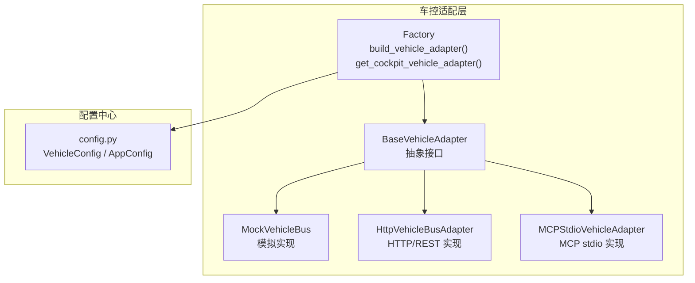
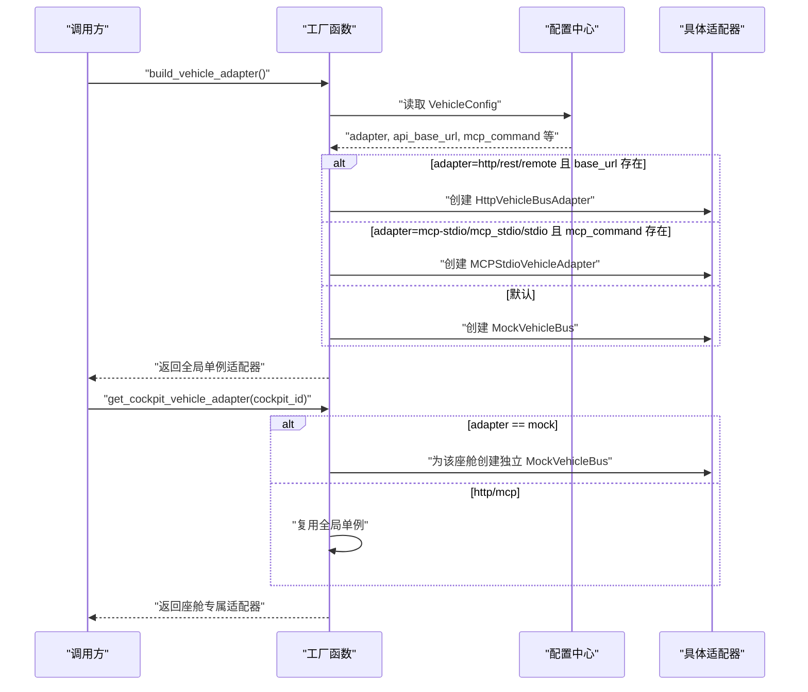
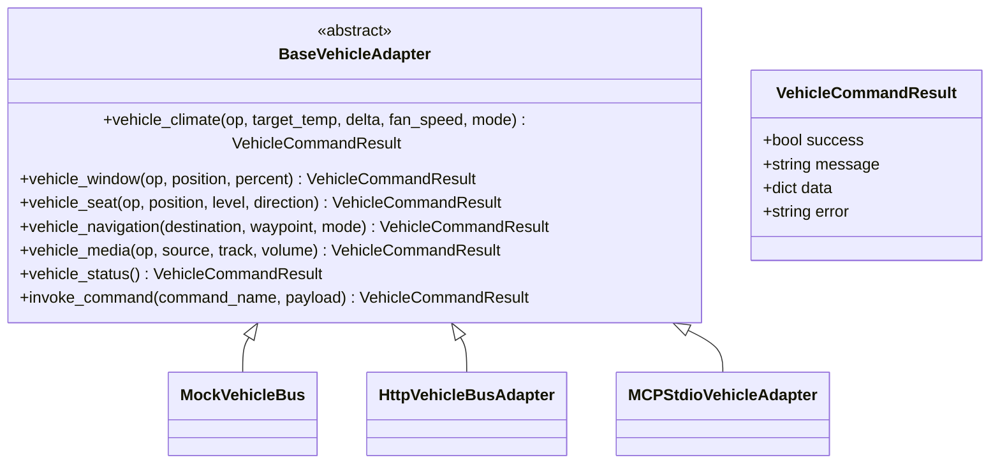
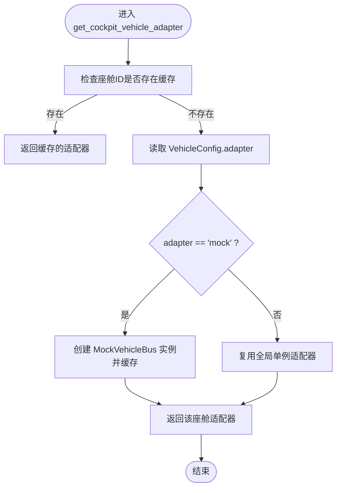
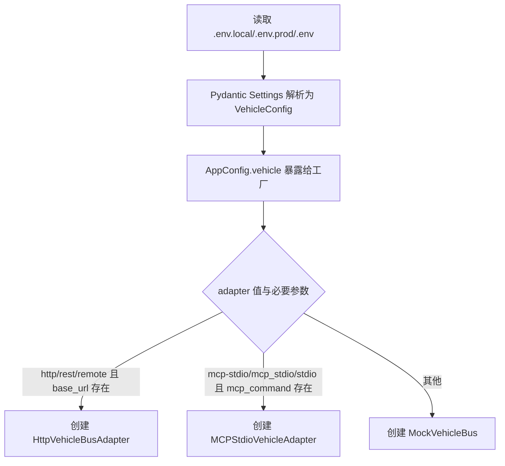
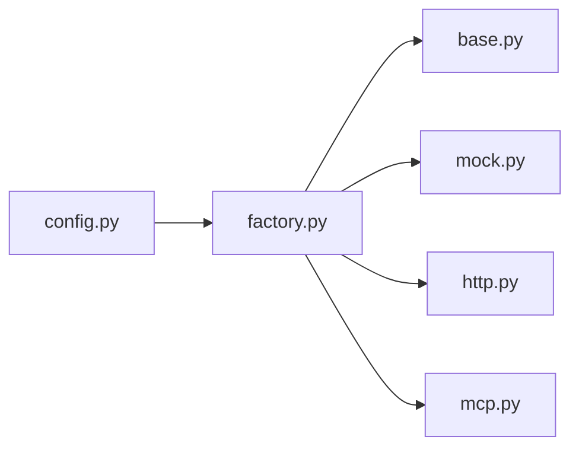

# 适配器架构设计

<cite>
**本文引用的文件列表**
- [backend_design/nexus/vehicle/base.py](file://backend_design/nexus/vehicle/base.py)
- [backend_design/nexus/vehicle/factory.py](file://backend_design/nexus/vehicle/factory.py)
- [backend_design/nexus/vehicle/mock.py](file://backend_design/nexus/vehicle/mock.py)
- [backend_design/nexus/vehicle/http.py](file://backend_design/nexus/vehicle/http.py)
- [backend_design/nexus/vehicle/mcp.py](file://backend_design/nexus/vehicle/mcp.py)
- [backend_design/nexus/config.py](file://backend_design/nexus/config.py)
</cite>

## 目录
1. [简介](#简介)
2. [项目结构](#项目结构)
3. [核心组件](#核心组件)
4. [架构总览](#架构总览)
5. [详细组件分析](#详细组件分析)
6. [依赖关系分析](#依赖关系分析)
7. [性能与扩展性](#性能与扩展性)
8. [故障排查指南](#故障排查指南)
9. [结论](#结论)
10. [附录：新适配器开发指南](#附录新适配器开发指南)

## 简介
本技术文档聚焦于车控适配层的设计与实现，围绕以下目标展开：
- 深入解释 BaseVehicleAdapter 抽象基类的设计理念、统一接口规范、错误处理机制与生命周期管理。
- 详细说明工厂模式在适配器选择中的应用，包括 build_vehicle_adapter() 单例模式与 get_cockpit_vehicle_adapter() 多座舱隔离机制的实现原理。
- 描述适配器配置系统，包括 VEHICLE_ADAPTER 环境变量的解析、配置优先级与动态切换机制。
- 提供适配器扩展开发指南，包括新适配器类型的实现步骤与最佳实践。

## 项目结构
车控适配层位于 backend_design/nexus/vehicle 目录下，包含抽象基类、三种具体适配器（Mock/HTTP/MCP）以及工厂模块；配置中心位于 config.py，负责从 .env 加载并聚合各子系统配置。

图表来源
- [backend_design/nexus/vehicle/base.py:35-91](file://backend_design/nexus/vehicle/base.py#L35-L91)
- [backend_design/nexus/vehicle/mock.py:22-108](file://backend_design/nexus/vehicle/mock.py#L22-L108)
- [backend_design/nexus/vehicle/http.py:23-62](file://backend_design/nexus/vehicle/http.py#L23-L62)
- [backend_design/nexus/vehicle/mcp.py:181-250](file://backend_design/nexus/vehicle/mcp.py#L181-L250)
- [backend_design/nexus/vehicle/factory.py:39-123](file://backend_design/nexus/vehicle/factory.py#L39-L123)
- [backend_design/nexus/config.py:295-329](file://backend_design/nexus/config.py#L295-L329)

章节来源
- [backend_design/nexus/vehicle/base.py:1-92](file://backend_design/nexus/vehicle/base.py#L1-L92)
- [backend_design/nexus/vehicle/factory.py:1-148](file://backend_design/nexus/vehicle/factory.py#L1-L148)
- [backend_design/nexus/config.py:295-329](file://backend_design/nexus/config.py#L295-L329)

## 核心组件
- 抽象接口与结果模型
  - BaseVehicleAdapter：定义统一的车辆控制方法族（空调、车窗、座椅、导航、媒体、状态查询、通用命令调用），所有具体适配器必须实现这些方法。
  - VehicleCommandResult：统一的结果数据结构，包含 success、message、data、error 字段，用于向上层返回一致的结构化响应。
- 具体适配器
  - MockVehicleBus：本地内存状态机，适合开发与联调，支持完整车辆状态模型与播放列表扫描。
  - HttpVehicleBusAdapter：通过 HTTP/REST 或 JSON-RPC 协议与真实车控服务通信，封装请求构建、鉴权、超时与错误映射。
  - MCPStdioVehicleAdapter：基于 Model Context Protocol 的 stdio JSON-RPC 传输层，启动外部 MCP 进程并通过 Content-Length Framing 进行消息交换。
- 工厂与生命周期
  - build_vehicle_adapter()：根据配置创建并缓存全局单例适配器实例，避免重复初始化。
  - get_cockpit_vehicle_adapter(cockpit_id)：按座舱维度返回独立适配器实例（Mock 模式为每座舱独立实例，HTTP/MCP 复用单例）。

章节来源
- [backend_design/nexus/vehicle/base.py:19-91](file://backend_design/nexus/vehicle/base.py#L19-L91)
- [backend_design/nexus/vehicle/mock.py:22-108](file://backend_design/nexus/vehicle/mock.py#L22-L108)
- [backend_design/nexus/vehicle/http.py:23-62](file://backend_design/nexus/vehicle/http.py#L23-L62)
- [backend_design/nexus/vehicle/mcp.py:181-250](file://backend_design/nexus/vehicle/mcp.py#L181-L250)
- [backend_design/nexus/vehicle/factory.py:39-84](file://backend_design/nexus/vehicle/factory.py#L39-L84)

## 架构总览
下图展示了配置驱动下的适配器选择流程与多座舱隔离策略。

图表来源
- [backend_design/nexus/vehicle/factory.py:39-123](file://backend_design/nexus/vehicle/factory.py#L39-L123)
- [backend_design/nexus/config.py:295-329](file://backend_design/nexus/config.py#L295-L329)

## 详细组件分析

### BaseVehicleAdapter 抽象基类
- 设计理念
  - 通过抽象基类统一上层技能层对车控总线的访问方式，屏蔽底层通信差异。
  - 所有业务方法均返回统一的 VehicleCommandResult，便于错误处理与数据透传。
- 接口规范
  - vehicle_climate：空调控制（开关、温度、风量、模式、增量调节等）。
  - vehicle_window：车窗控制（开合、百分比位置、全部/指定位置）。
  - vehicle_seat：座椅控制（加热/制冷/按摩、位置调整）。
  - vehicle_navigation：导航设置（目的地、途经点、模式）。
  - vehicle_media：媒体控制（播放/暂停/切歌/音量/来源）。
  - vehicle_status：整车状态查询。
  - invoke_command：通用命令入口，支持动态工具名与参数。
- 错误处理机制
  - 所有方法返回 VehicleCommandResult，success 表示执行是否成功，error 携带错误码或信息，data 承载结构化数据。
- 生命周期管理
  - 抽象基类不持有外部资源，具体子类负责自身生命周期（如 MCP 子进程、HTTP 连接等）。

图表来源
- [backend_design/nexus/vehicle/base.py:19-91](file://backend_design/nexus/vehicle/base.py#L19-L91)
- [backend_design/nexus/vehicle/mock.py:22-108](file://backend_design/nexus/vehicle/mock.py#L22-L108)
- [backend_design/nexus/vehicle/http.py:23-62](file://backend_design/nexus/vehicle/http.py#L23-L62)
- [backend_design/nexus/vehicle/mcp.py:181-250](file://backend_design/nexus/vehicle/mcp.py#L181-L250)

章节来源
- [backend_design/nexus/vehicle/base.py:1-92](file://backend_design/nexus/vehicle/base.py#L1-L92)

### 工厂模式与单例/多座舱隔离
- 单例模式（build_vehicle_adapter）
  - 首次调用时根据配置创建具体适配器，后续直接返回同一实例，避免周期性任务反复初始化。
  - 内部 _create_adapter 依据配置决定使用 HTTP、MCP 或 Mock。
- 多座舱隔离（get_cockpit_vehicle_adapter）
  - 维护一个座舱 ID 到适配器实例的映射表。
  - Mock 模式下，每个座舱拥有独立的 MockVehicleBus 实例，确保状态物理隔离。
  - HTTP/MCP 模式为无状态，复用全局单例。

图表来源
- [backend_design/nexus/vehicle/factory.py:56-84](file://backend_design/nexus/vehicle/factory.py#L56-L84)
- [backend_design/nexus/vehicle/factory.py:87-123](file://backend_design/nexus/vehicle/factory.py#L87-L123)

章节来源
- [backend_design/nexus/vehicle/factory.py:39-84](file://backend_design/nexus/vehicle/factory.py#L39-L84)
- [backend_design/nexus/vehicle/factory.py:87-123](file://backend_design/nexus/vehicle/factory.py#L87-L123)

### 配置系统与环境变量解析
- 配置入口
  - VehicleConfig 定义了车控相关的所有配置项，包括 adapter、HTTP 地址与认证、MCP 命令与参数等。
  - 所有字段通过 validation_alias 绑定到环境变量，例如 VEHICLE_ADAPTER、VEHICLE_API_BASE_URL、VEHICLE_MCP_COMMAND 等。
- 解析与优先级
  - 应用启动时由 AppConfig 聚合各子配置，get_config() 返回全局单例。
  - 工厂函数在创建适配器时读取 get_config().vehicle，并根据 adapter 值与必要参数判断具体实现。
- 动态切换机制
  - 由于配置通过全局单例暴露，若运行时重新加载配置（例如热重载场景），需重置工厂的单例与座舱缓存以生效新配置。当前代码未内置自动热重载逻辑，建议在需要时显式重置。

图表来源
- [backend_design/nexus/config.py:295-329](file://backend_design/nexus/config.py#L295-L329)
- [backend_design/nexus/vehicle/factory.py:87-123](file://backend_design/nexus/vehicle/factory.py#L87-L123)

章节来源
- [backend_design/nexus/config.py:295-329](file://backend_design/nexus/config.py#L295-L329)
- [backend_design/nexus/vehicle/factory.py:87-123](file://backend_design/nexus/vehicle/factory.py#L87-L123)

### 具体适配器实现要点

#### MockVehicleBus（模拟总线）
- 特点
  - 维护完整的车辆状态模型（空调、车窗、座椅、媒体、导航、整车状态）。
  - 支持媒体播放列表动态扫描 assets/audio/music 目录，解析标题与 URL。
  - 提供命令别名映射，统一 invoke_command 入口。
- 错误处理
  - 不支持的命令返回失败结果并附带错误码。
  - 参数类型不匹配时尝试降级调用，捕获异常后返回失败结果。

章节来源
- [backend_design/nexus/vehicle/mock.py:22-108](file://backend_design/nexus/vehicle/mock.py#L22-L108)
- [backend_design/nexus/vehicle/mock.py:563-589](file://backend_design/nexus/vehicle/mock.py#L563-L589)

#### HttpVehicleBusAdapter（HTTP/REST 适配器）
- 特点
  - 支持 REST 与 JSON-RPC 两种协议体格式。
  - 支持 Authorization Bearer Token 鉴权。
  - 统一封装网络请求、超时、HTTP 错误与连接失败的错误映射。
- 错误处理
  - HTTPError/URLError/通用异常分别映射为不同错误码与消息。
  - 非 JSON 响应或结构不符合预期时返回 invalid_response 错误。

章节来源
- [backend_design/nexus/vehicle/http.py:23-62](file://backend_design/nexus/vehicle/http.py#L23-L62)
- [backend_design/nexus/vehicle/http.py:63-118](file://backend_design/nexus/vehicle/http.py#L63-L118)

#### MCPStdioVehicleAdapter（MCP stdio 适配器）
- 特点
  - 通过 StdioJsonRpcTransport 启动外部 MCP 进程，使用 Content-Length Framing 进行 JSON-RPC 通信。
  - 支持 initialize 握手、tools/list 工具发现、tools/call 工具调用。
  - 异步读写线程处理 stdout/stderr，保证并发安全。
- 错误处理
  - 工具未暴露时返回 tool_not_exposed。
  - 调用超时或异常时返回 mcp_call_failed。
  - 将 MCP 返回的 structuredContent 与文本内容整合为统一结果。

章节来源
- [backend_design/nexus/vehicle/mcp.py:28-179](file://backend_design/nexus/vehicle/mcp.py#L28-L179)
- [backend_design/nexus/vehicle/mcp.py:181-292](file://backend_design/nexus/vehicle/mcp.py#L181-L292)

## 依赖关系分析
- 耦合与内聚
  - 工厂模块仅依赖配置中心与具体适配器，职责单一，内聚度高。
  - 具体适配器之间无相互依赖，均通过抽象基类解耦。
- 外部依赖
  - HTTP 适配器依赖标准库 urllib.request/urllib.error。
  - MCP 适配器依赖 subprocess、threading、queue 等标准库。
  - 配置中心依赖 pydantic-settings 与 dotenv。
- 潜在循环依赖
  - 当前代码未发现循环导入；工厂仅在需要时动态导入 MCP 适配器，避免启动期强依赖。

图表来源
- [backend_design/nexus/vehicle/factory.py:1-148](file://backend_design/nexus/vehicle/factory.py#L1-L148)
- [backend_design/nexus/config.py:295-329](file://backend_design/nexus/config.py#L295-L329)

章节来源
- [backend_design/nexus/vehicle/factory.py:1-148](file://backend_design/nexus/vehicle/factory.py#L1-L148)
- [backend_design/nexus/config.py:295-329](file://backend_design/nexus/config.py#L295-L329)

## 性能与扩展性
- 性能特性
  - 单例模式减少重复初始化开销，适用于周期性巡检与高频调用场景。
  - Mock 模式为纯内存操作，延迟极低，适合快速迭代与自动化测试。
  - HTTP 模式受网络与远端服务影响，建议合理设置超时与重试策略。
  - MCP 模式涉及子进程与 I/O，需注意工具超时与进程生命周期管理。
- 扩展性建议
  - 新增适配器类型只需继承 BaseVehicleAdapter 并在工厂中注册对应分支。
  - 对于有状态适配器（如 Mock），在多座舱场景下应遵循“每座舱独立实例”的策略。
  - 对于无状态适配器（如 HTTP/MCP），可复用单例以提升性能。

[本节为通用指导，无需特定文件引用]

## 故障排查指南
- 常见问题定位
  - 配置未生效：确认 VEHICLE_ADAPTER 及对应参数是否正确设置，检查 .env.local/.env.prod 加载路径与覆盖顺序。
  - HTTP 调用失败：查看错误码 connection_failed、invalid_response、invoke_failed，核对 base_url、endpoint、鉴权 token 与超时时间。
  - MCP 调用失败：检查 mcp_command 与 mcp_args 解析结果，确认外部 MCP 服务已正确启动并暴露所需工具。
  - 多座舱状态污染：确认使用的是 get_cockpit_vehicle_adapter(cockpit_id) 而非全局单例，尤其在 Mock 模式下。
- 日志与诊断
  - 工厂与各适配器均记录关键日志（如创建实例、工具列表刷新、错误原因），结合日志级别定位问题。

章节来源
- [backend_design/nexus/vehicle/factory.py:39-123](file://backend_design/nexus/vehicle/factory.py#L39-L123)
- [backend_design/nexus/vehicle/http.py:63-118](file://backend_design/nexus/vehicle/http.py#L63-L118)
- [backend_design/nexus/vehicle/mcp.py:221-292](file://backend_design/nexus/vehicle/mcp.py#L221-L292)

## 结论
车控适配层通过抽象基类统一了上层调用接口，借助工厂模式实现了配置驱动的适配器选择与生命周期管理，并结合多座舱隔离机制满足复杂场景需求。Mock/HTTP/MCP 三种适配器覆盖了从开发联调到生产集成的全链路需求。配置中心提供了类型安全的配置管理与环境变量解析，使系统具备良好的可维护性与可扩展性。

[本节为总结性内容，无需特定文件引用]

## 附录：新适配器开发指南
- 实现步骤
  1. 新建适配器类并继承 BaseVehicleAdapter，实现所有抽象方法。
  2. 在工厂的 _create_adapter 中增加新的 adapter_kind 分支，根据配置创建新适配器实例。
  3. 如需多座舱隔离，参考 get_cockpit_vehicle_adapter 的逻辑，在 Mock 模式下为每个座舱创建独立实例；无状态适配器则复用单例。
  4. 在 VehicleConfig 中新增必要的配置项（如新协议的参数），并通过 validation_alias 绑定环境变量。
- 最佳实践
  - 统一返回 VehicleCommandResult，保持错误处理一致性。
  - 对网络与外部进程调用设置合理的超时与重试策略。
  - 在调试阶段优先使用 Mock 适配器，逐步切换到真实后端。
  - 对敏感配置（如 Token）使用 .env.prod 管理，避免泄露。

章节来源
- [backend_design/nexus/vehicle/base.py:35-91](file://backend_design/nexus/vehicle/base.py#L35-L91)
- [backend_design/nexus/vehicle/factory.py:87-123](file://backend_design/nexus/vehicle/factory.py#L87-L123)
- [backend_design/nexus/config.py:295-329](file://backend_design/nexus/config.py#L295-L329)