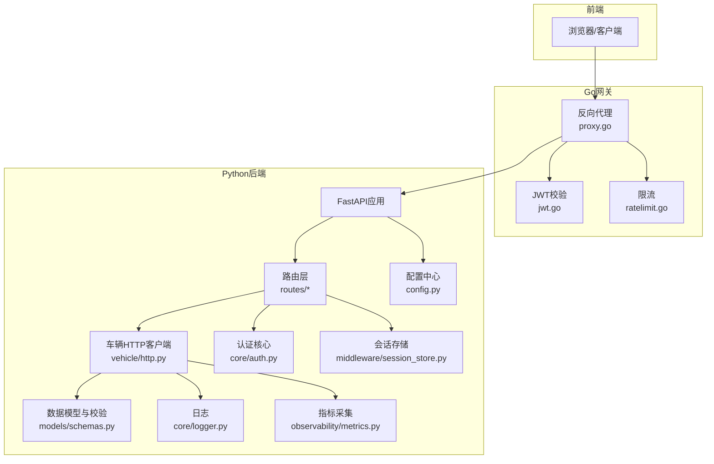
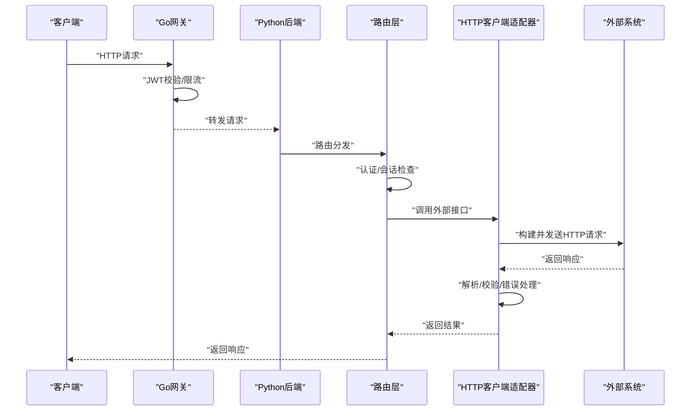
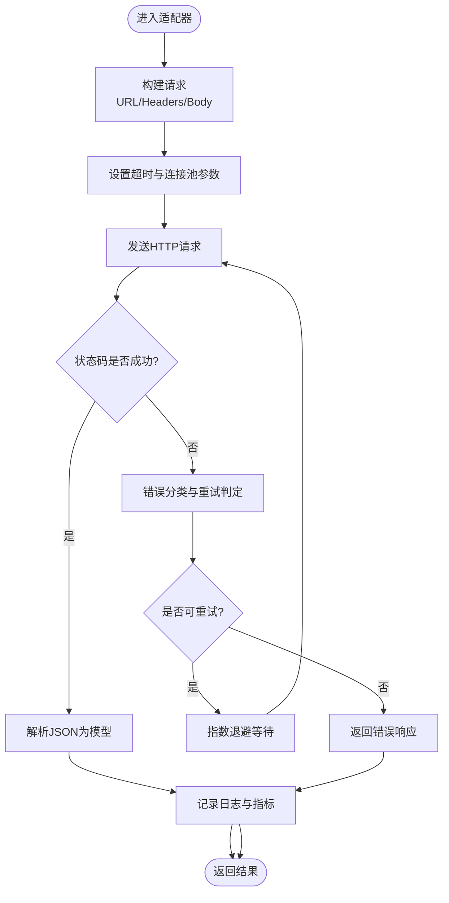
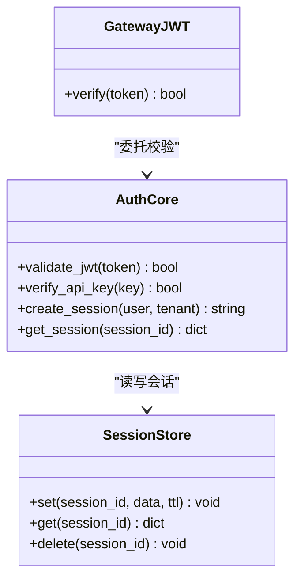
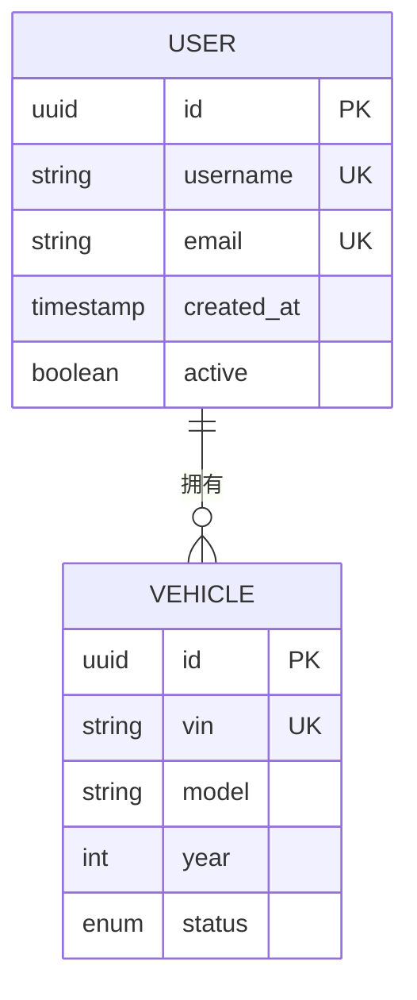
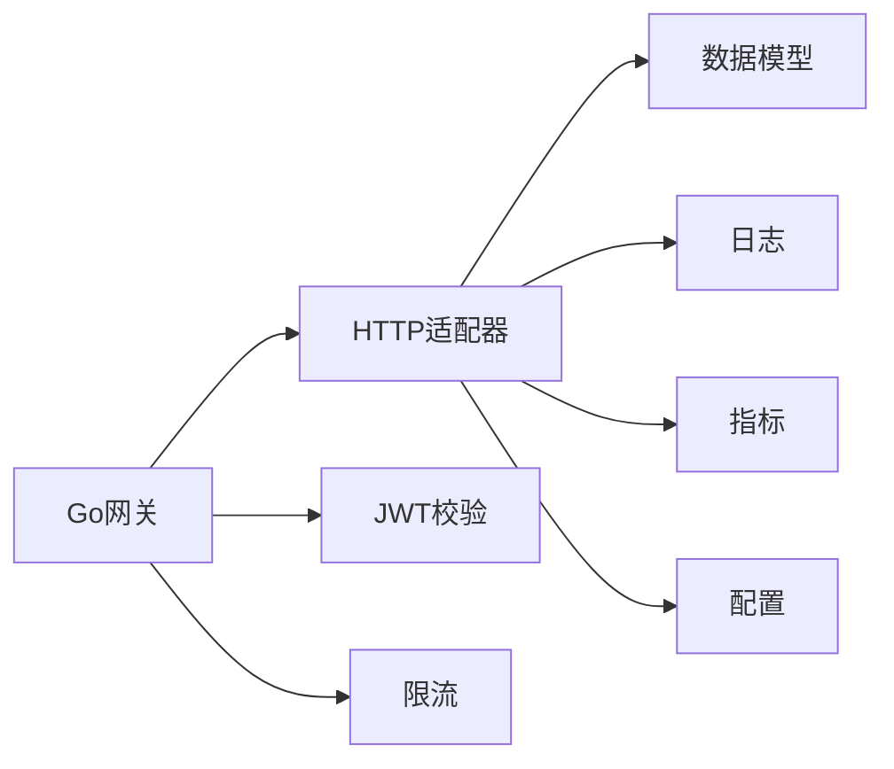

# HTTP API适配器

<cite>
**本文引用的文件**   
- [backend_design/nexus/vehicle/http.py](file://backend_design/nexus/vehicle/http.py)
- [backend_design/nexus/core/auth.py](file://backend_design/nexus/core/auth.py)
- [backend_design/nexus/api/routes/auth.py](file://backend_design/nexus/api/routes/auth.py)
- [backend_design/nexus/middleware/session_store.py](file://backend_design/nexus/middleware/session_store.py)
- [backend_design/nexus/models/schemas.py](file://backend_design/nexus/models/schemas.py)
- [backend_design/nexus/config.py](file://backend_design/nexus/config.py)
- [backend_design/nexus/core/logger.py](file://backend_design/nexus/core/logger.py)
- [backend_design/nexus/observability/metrics.py](file://backend_design/nexus/observability/metrics.py)
- [backend_design/nexus_gate/internal/proxy/proxy.go](file://backend_design/nexus_gate/internal/proxy/proxy.go)
- [backend_design/nexus_gate/internal/auth/jwt.go](file://backend_design/nexus_gate/internal/auth/jwt.go)
- [backend_design/nexus_gate/internal/ratelimit/ratelimit.go](file://backend_design/nexus_gate/internal/ratelimit/ratelimit.go)
</cite>

## 目录
1. [简介](#简介)
2. [项目结构](#项目结构)
3. [核心组件](#核心组件)
4. [架构总览](#架构总览)
5. [详细组件分析](#详细组件分析)
6. [依赖关系分析](#依赖关系分析)
7. [性能考虑](#性能考虑)
8. [故障排查指南](#故障排查指南)
9. [结论](#结论)
10. [附录](#附录)

## 简介
本技术文档聚焦于HTTP API适配器的设计与实现，覆盖RESTful接口调用、认证机制（JWT令牌管理、API密钥验证与会话保持）、数据格式转换（JSON序列化、类型映射、字段校验）、连接池与超时配置、重试策略、客户端初始化与中间件扩展、性能优化、监控指标采集以及故障排查方法。文档面向具备不同技术背景的读者，力求以循序渐进的方式呈现从高层架构到代码级细节的完整知识体系。

## 项目结构
本项目采用前后端分离与网关代理相结合的多语言架构：
- Python后端提供业务API与HTTP客户端能力，负责请求构建、响应解析、错误处理、认证与会话、数据模型与校验等。
- Go网关承担鉴权、限流、反向代理与WebSocket转发等职责。
- 前端通过API层访问后端服务。

图表来源
- [backend_design/nexus/vehicle/http.py](file://backend_design/nexus/vehicle/http.py)
- [backend_design/nexus/core/auth.py](file://backend_design/nexus/core/auth.py)
- [backend_design/nexus/middleware/session_store.py](file://backend_design/nexus/middleware/session_store.py)
- [backend_design/nexus/models/schemas.py](file://backend_design/nexus/models/schemas.py)
- [backend_design/nexus/config.py](file://backend_design/nexus/config.py)
- [backend_design/nexus/core/logger.py](file://backend_design/nexus/core/logger.py)
- [backend_design/nexus/observability/metrics.py](file://backend_design/nexus/observability/metrics.py)
- [backend_design/nexus_gate/internal/proxy/proxy.go](file://backend_design/nexus_gate/internal/proxy/proxy.go)
- [backend_design/nexus_gate/internal/auth/jwt.go](file://backend_design/nexus_gate/internal/auth/jwt.go)
- [backend_design/nexus_gate/internal/ratelimit/ratelimit.go](file://backend_design/nexus_gate/internal/ratelimit/ratelimit.go)

章节来源
- [backend_design/nexus/vehicle/http.py](file://backend_design/nexus/vehicle/http.py)
- [backend_design/nexus/core/auth.py](file://backend_design/nexus/core/auth.py)
- [backend_design/nexus/middleware/session_store.py](file://backend_design/nexus/middleware/session_store.py)
- [backend_design/nexus/models/schemas.py](file://backend_design/nexus/models/schemas.py)
- [backend_design/nexus/config.py](file://backend_design/nexus/config.py)
- [backend_design/nexus/core/logger.py](file://backend_design/nexus/core/logger.py)
- [backend_design/nexus/observability/metrics.py](file://backend_design/nexus/observability/metrics.py)
- [backend_design/nexus_gate/internal/proxy/proxy.go](file://backend_design/nexus_gate/internal/proxy/proxy.go)
- [backend_design/nexus_gate/internal/auth/jwt.go](file://backend_design/nexus_gate/internal/auth/jwt.go)
- [backend_design/nexus_gate/internal/ratelimit/ratelimit.go](file://backend_design/nexus_gate/internal/ratelimit/ratelimit.go)

## 核心组件
- HTTP客户端适配器：封装外部HTTP调用的请求构建、响应解析、错误处理、重试与指标上报。
- 认证核心：统一JWT签发/校验、API密钥校验、会话上下文注入。
- 会话存储：基于中间件的会话持久化与读取。
- 数据模型与校验：使用Pydantic进行JSON反序列化、类型映射与字段约束。
- 配置中心：集中管理连接池、超时、重试、认证参数等。
- 日志与指标：结构化日志输出与Prometheus指标采集。
- Go网关：JWT校验、限流、反向代理与WebSocket转发。

章节来源
- [backend_design/nexus/vehicle/http.py](file://backend_design/nexus/vehicle/http.py)
- [backend_design/nexus/core/auth.py](file://backend_design/nexus/core/auth.py)
- [backend_design/nexus/middleware/session_store.py](file://backend_design/nexus/middleware/session_store.py)
- [backend_design/nexus/models/schemas.py](file://backend_design/nexus/models/schemas.py)
- [backend_design/nexus/config.py](file://backend_design/nexus/config.py)
- [backend_design/nexus/core/logger.py](file://backend_design/nexus/core/logger.py)
- [backend_design/nexus/observability/metrics.py](file://backend_design/nexus/observability/metrics.py)
- [backend_design/nexus_gate/internal/proxy/proxy.go](file://backend_design/nexus_gate/internal/proxy/proxy.go)
- [backend_design/nexus_gate/internal/auth/jwt.go](file://backend_design/nexus_gate/internal/auth/jwt.go)
- [backend_design/nexus_gate/internal/ratelimit/ratelimit.go](file://backend_design/nexus_gate/internal/ratelimit/ratelimit.go)

## 架构总览
整体调用链路如下：
- 客户端请求经Go网关进行JWT校验与限流后，转发至Python后端。
- 后端路由层根据路径分发到具体处理器，必要时进行认证与会话检查。
- 业务逻辑调用HTTP客户端适配器发起对外部系统的REST调用。
- 适配器负责构建请求、设置认证头、发送请求、解析响应、处理错误、记录日志与上报指标。
- 响应经路由层返回给客户端。

图表来源
- [backend_design/nexus_gate/internal/proxy/proxy.go](file://backend_design/nexus_gate/internal/proxy/proxy.go)
- [backend_design/nexus_gate/internal/auth/jwt.go](file://backend_design/nexus_gate/internal/auth/jwt.go)
- [backend_design/nexus_gate/internal/ratelimit/ratelimit.go](file://backend_design/nexus_gate/internal/ratelimit/ratelimit.go)
- [backend_design/nexus/vehicle/http.py](file://backend_design/nexus/vehicle/http.py)
- [backend_design/nexus/core/auth.py](file://backend_design/nexus/core/auth.py)
- [backend_design/nexus/middleware/session_store.py](file://backend_design/nexus/middleware/session_store.py)

## 详细组件分析

### HTTP客户端适配器（REST调用）
- 请求构建
  - 支持GET/POST/PUT/DELETE等方法；自动拼接基础URL与路径；可附加查询参数与请求体。
  - 统一设置Content-Type为application/json；支持自定义Header注入（如Authorization、X-API-Key）。
  - 支持请求体JSON序列化与响应体JSON反序列化为Pydantic模型。
- 响应解析
  - 按状态码分支处理：成功时解析JSON为强类型对象；失败时抛出领域异常或返回错误结构。
  - 支持分页、列表、嵌套对象的类型映射与默认值填充。
- 错误处理
  - 网络异常、超时、SSL握手失败、DNS解析失败等捕获并转换为统一错误码。
  - 对幂等请求实施指数退避重试；非幂等请求避免自动重试。
- 连接池与超时
  - 复用底层HTTP连接池；配置最大空闲连接数、每主机最大连接数、连接存活时间。
  - 设置连接超时、读超时、写超时；支持全局与请求级覆盖。
- 重试策略
  - 基于状态码（如5xx）与特定异常触发重试；可配置最大重试次数与退避因子。
  - 支持熔断器集成，防止雪崩。
- 指标与日志
  - 记录请求耗时、状态码分布、重试次数、错误分类；上报Prometheus指标。
  - 结构化日志包含trace_id、method、path、status、latency、error_code。

图表来源
- [backend_design/nexus/vehicle/http.py](file://backend_design/nexus/vehicle/http.py)
- [backend_design/nexus/models/schemas.py](file://backend_design/nexus/models/schemas.py)
- [backend_design/nexus/core/logger.py](file://backend_design/nexus/core/logger.py)
- [backend_design/nexus/observability/metrics.py](file://backend_design/nexus/observability/metrics.py)

章节来源
- [backend_design/nexus/vehicle/http.py](file://backend_design/nexus/vehicle/http.py)
- [backend_design/nexus/models/schemas.py](file://backend_design/nexus/models/schemas.py)
- [backend_design/nexus/core/logger.py](file://backend_design/nexus/core/logger.py)
- [backend_design/nexus/observability/metrics.py](file://backend_design/nexus/observability/metrics.py)

### 认证机制（JWT、API密钥、会话保持）
- JWT令牌管理
  - 登录成功后签发JWT，包含用户标识、角色、租户等信息；支持过期时间与刷新策略。
  - 网关层校验签名与有效期；后端可选二次校验或补充权限判断。
- API密钥验证
  - 支持在Header中携带X-API-Key；后端校验密钥有效性及权限范围。
- 会话保持
  - 中间件维护会话上下文，支持跨请求的用户信息、租户ID、追踪ID等。
  - 会话存储可对接Redis或内存存储，支持TTL与失效策略。

图表来源
- [backend_design/nexus/core/auth.py](file://backend_design/nexus/core/auth.py)
- [backend_design/nexus/middleware/session_store.py](file://backend_design/nexus/middleware/session_store.py)
- [backend_design/nexus_gate/internal/auth/jwt.go](file://backend_design/nexus_gate/internal/auth/jwt.go)

章节来源
- [backend_design/nexus/core/auth.py](file://backend_design/nexus/core/auth.py)
- [backend_design/nexus/middleware/session_store.py](file://backend_design/nexus/middleware/session_store.py)
- [backend_design/nexus/api/routes/auth.py](file://backend_design/nexus/api/routes/auth.py)
- [backend_design/nexus_gate/internal/auth/jwt.go](file://backend_design/nexus_gate/internal/auth/jwt.go)

### 数据格式转换（JSON序列化、类型映射、字段验证）
- JSON序列化/反序列化
  - 使用Pydantic模型定义输入输出结构；自动完成类型转换与默认值填充。
- 类型映射
  - 将外部系统字段映射到内部模型；支持枚举、日期时间、数值精度控制。
- 字段验证
  - 必填、长度、正则、范围、唯一性等约束；失败时返回标准化错误信息。

图表来源
- [backend_design/nexus/models/schemas.py](file://backend_design/nexus/models/schemas.py)

章节来源
- [backend_design/nexus/models/schemas.py](file://backend_design/nexus/models/schemas.py)

### 连接池配置、超时设置与重试策略
- 连接池
  - 最大空闲连接数、每主机最大连接数、连接存活时间、连接回收策略。
- 超时
  - 连接超时、读超时、写超时；支持全局与请求级覆盖。
- 重试
  - 指数退避、抖动、最大重试次数；仅对幂等请求启用；结合熔断器。

章节来源
- [backend_design/nexus/vehicle/http.py](file://backend_design/nexus/vehicle/http.py)
- [backend_design/nexus/config.py](file://backend_design/nexus/config.py)

### HTTP客户端初始化与自定义中间件开发
- 客户端初始化
  - 加载配置中心参数；创建连接池与超时策略；注册日志与指标拦截器。
- 自定义中间件
  - 在请求进入适配器前注入Header、签名、追踪ID；在响应返回前记录指标与审计日志。
  - 中间件需保证异常隔离与性能开销最小化。

章节来源
- [backend_design/nexus/vehicle/http.py](file://backend_design/nexus/vehicle/http.py)
- [backend_design/nexus/config.py](file://backend_design/nexus/config.py)
- [backend_design/nexus/core/logger.py](file://backend_design/nexus/core/logger.py)
- [backend_design/nexus/observability/metrics.py](file://backend_design/nexus/observability/metrics.py)

### Go网关集成（JWT校验、限流、反向代理）
- JWT校验
  - 网关层校验JWT签名与有效期，拒绝非法请求。
- 限流
  - 基于IP或用户维度限制QPS，保护后端资源。
- 反向代理
  - 透明转发请求与响应，支持WebSocket升级。

章节来源
- [backend_design/nexus_gate/internal/proxy/proxy.go](file://backend_design/nexus_gate/internal/proxy/proxy.go)
- [backend_design/nexus_gate/internal/auth/jwt.go](file://backend_design/nexus_gate/internal/auth/jwt.go)
- [backend_design/nexus_gate/internal/ratelimit/ratelimit.go](file://backend_design/nexus_gate/internal/ratelimit/ratelimit.go)

## 依赖关系分析
- 耦合与内聚
  - HTTP适配器高内聚封装外部调用细节，低耦合依赖配置、日志与指标模块。
  - 认证与会话解耦，便于替换存储与校验策略。
- 直接/间接依赖
  - 适配器依赖Schemas进行类型映射；依赖Logger与Metrics进行观测。
  - 网关依赖JWT与限流模块，再转发至后端。
- 外部依赖
  - HTTP客户端库、Pydantic、Prometheus客户端、Redis（可选）。

图表来源
- [backend_design/nexus/vehicle/http.py](file://backend_design/nexus/vehicle/http.py)
- [backend_design/nexus/models/schemas.py](file://backend_design/nexus/models/schemas.py)
- [backend_design/nexus/core/logger.py](file://backend_design/nexus/core/logger.py)
- [backend_design/nexus/observability/metrics.py](file://backend_design/nexus/observability/metrics.py)
- [backend_design/nexus/config.py](file://backend_design/nexus/config.py)
- [backend_design/nexus_gate/internal/proxy/proxy.go](file://backend_design/nexus_gate/internal/proxy/proxy.go)
- [backend_design/nexus_gate/internal/auth/jwt.go](file://backend_design/nexus_gate/internal/auth/jwt.go)
- [backend_design/nexus_gate/internal/ratelimit/ratelimit.go](file://backend_design/nexus_gate/internal/ratelimit/ratelimit.go)

章节来源
- [backend_design/nexus/vehicle/http.py](file://backend_design/nexus/vehicle/http.py)
- [backend_design/nexus/models/schemas.py](file://backend_design/nexus/models/schemas.py)
- [backend_design/nexus/core/logger.py](file://backend_design/nexus/core/logger.py)
- [backend_design/nexus/observability/metrics.py](file://backend_design/nexus/observability/metrics.py)
- [backend_design/nexus/config.py](file://backend_design/nexus/config.py)
- [backend_design/nexus_gate/internal/proxy/proxy.go](file://backend_design/nexus_gate/internal/proxy/proxy.go)
- [backend_design/nexus_gate/internal/auth/jwt.go](file://backend_design/nexus_gate/internal/auth/jwt.go)
- [backend_design/nexus_gate/internal/ratelimit/ratelimit.go](file://backend_design/nexus_gate/internal/ratelimit/ratelimit.go)

## 性能考虑
- 连接复用与池化
  - 合理设置最大空闲连接与每主机最大连接数，避免频繁建立/销毁连接。
- 超时与背压
  - 精细配置连接/读/写超时，防止慢下游拖垮上游；结合熔断与降级。
- 重试与退避
  - 仅对幂等请求启用重试；使用指数退避与抖动降低风暴风险。
- 序列化与校验
  - 减少不必要的深拷贝与大对象传输；按需字段映射。
- 指标与采样
  - 关键路径打点，聚合统计；采样高频指标避免过载。
- 缓存与会话
  - 热点数据缓存；会话存储选择高性能后端（如Redis集群）。

[本节为通用指导，不直接分析具体文件]

## 故障排查指南
- 常见问题定位
  - 认证失败：检查JWT签名、过期时间、API密钥有效性与会话状态。
  - 超时与重试：查看适配器日志中的状态码分布、重试次数与退避间隔。
  - 连接池耗尽：观察连接池使用率与等待队列长度。
  - 数据校验错误：核对Pydantic模型字段约束与外部系统字段映射。
- 日志与指标
  - 使用结构化日志关键字段（trace_id、method、path、status、latency、error_code）快速检索。
  - 通过Prometheus指标面板观察P95/P99延迟、错误率、重试率、连接池利用率。
- 诊断步骤
  - 复现问题并收集网关与后端日志；对比指标峰值与异常时间点。
  - 逐步关闭重试与缓存，定位根因；必要时开启调试模式增加日志粒度。

章节来源
- [backend_design/nexus/core/logger.py](file://backend_design/nexus/core/logger.py)
- [backend_design/nexus/observability/metrics.py](file://backend_design/nexus/observability/metrics.py)
- [backend_design/nexus/vehicle/http.py](file://backend_design/nexus/vehicle/http.py)

## 结论
HTTP API适配器在本项目中承担了对外部系统调用的统一封装职责，结合Go网关的鉴权与限流能力，形成稳定可靠的端到端调用链路。通过严格的认证与会话管理、健壮的错误处理与重试策略、完善的连接池与超时配置、以及全面的日志与指标采集，系统在可用性、性能与可观测性方面达到生产要求。建议在生产环境持续优化连接池与超时参数，完善熔断与降级策略，并加强监控告警与自动化排障能力。

[本节为总结性内容，不直接分析具体文件]

## 附录
- 最佳实践清单
  - 所有外部调用必须带超时与重试上限；幂等性明确标注。
  - 敏感信息不落盘；日志脱敏；指标命名规范。
  - 配置项集中管理，支持热更新与灰度切换。
- 参考实现路径
  - HTTP客户端适配器：[backend_design/nexus/vehicle/http.py](file://backend_design/nexus/vehicle/http.py)
  - 认证核心与会话：[backend_design/nexus/core/auth.py](file://backend_design/nexus/core/auth.py)、[backend_design/nexus/middleware/session_store.py](file://backend_design/nexus/middleware/session_store.py)
  - 数据模型与校验：[backend_design/nexus/models/schemas.py](file://backend_design/nexus/models/schemas.py)
  - 配置中心：[backend_design/nexus/config.py](file://backend_design/nexus/config.py)
  - 日志与指标：[backend_design/nexus/core/logger.py](file://backend_design/nexus/core/logger.py)、[backend_design/nexus/observability/metrics.py](file://backend_design/nexus/observability/metrics.py)
  - Go网关：[backend_design/nexus_gate/internal/proxy/proxy.go](file://backend_design/nexus_gate/internal/proxy/proxy.go)、[backend_design/nexus_gate/internal/auth/jwt.go](file://backend_design/nexus_gate/internal/auth/jwt.go)、[backend_design/nexus_gate/internal/ratelimit/ratelimit.go](file://backend_design/nexus_gate/internal/ratelimit/ratelimit.go)