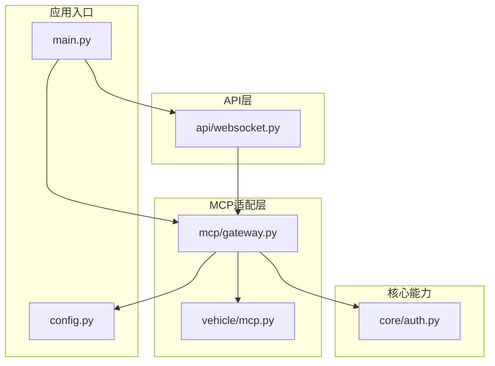
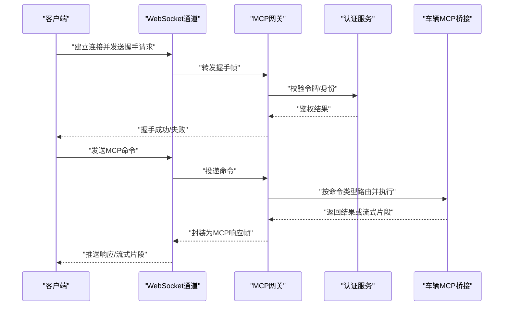
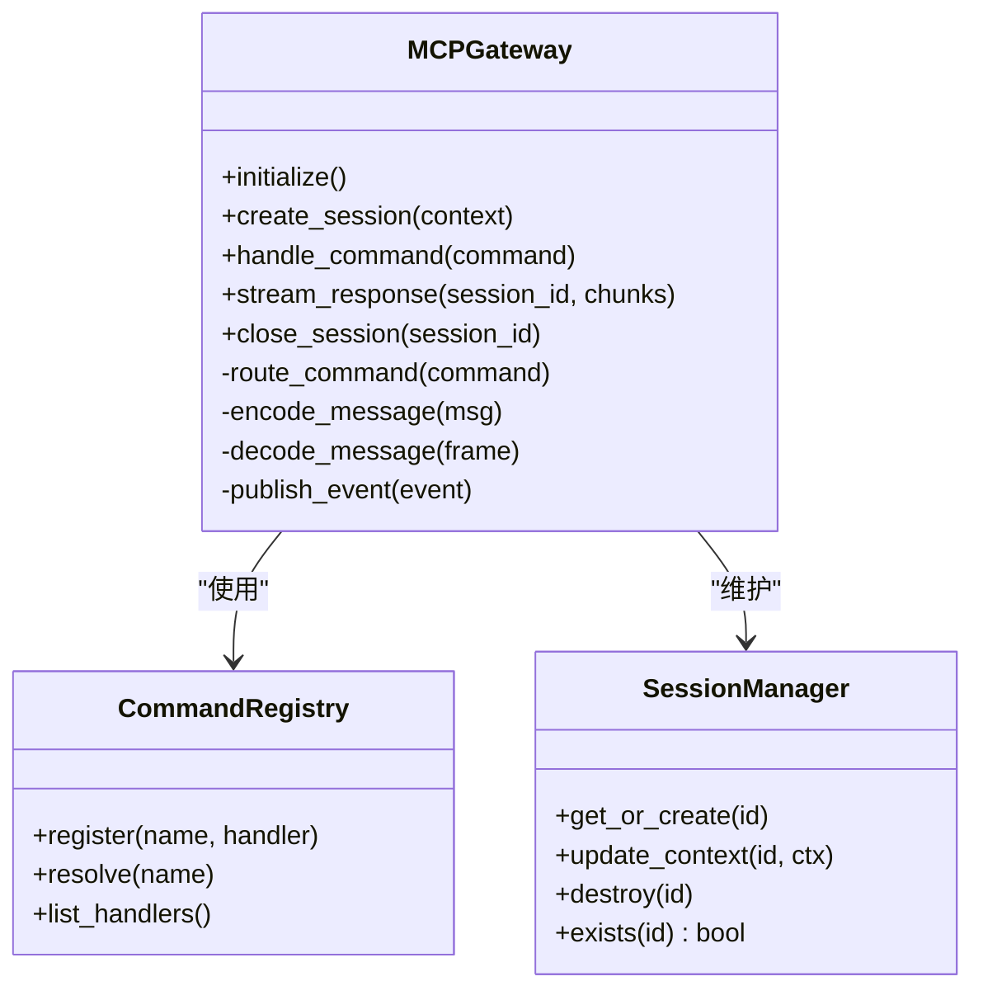
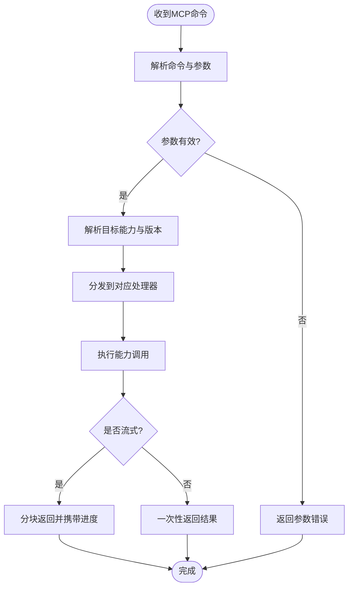
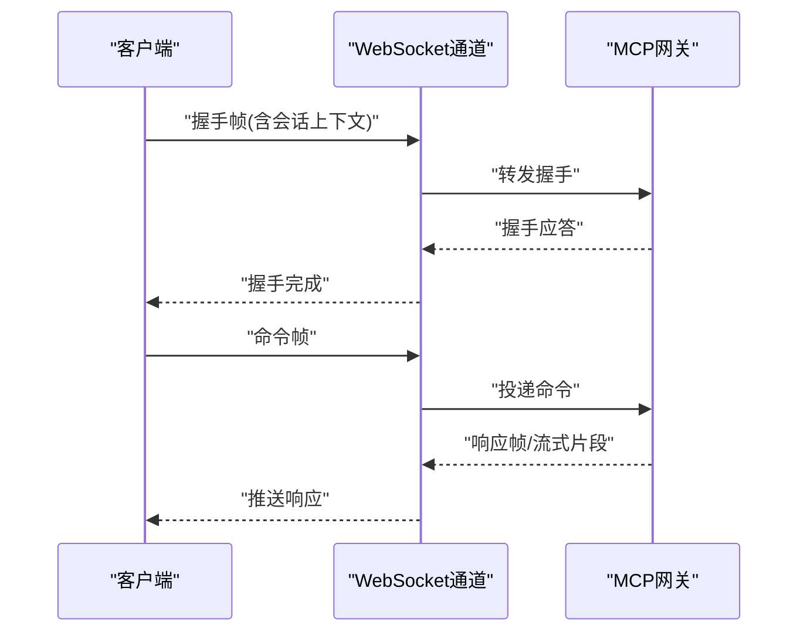
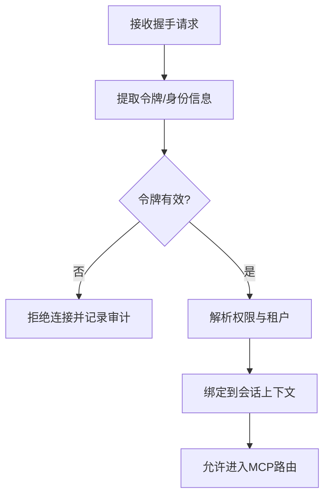
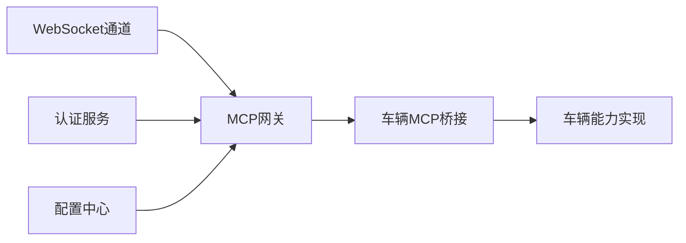

# MCP协议适配器

<cite>
**本文引用的文件**   
- [backend_design/nexus/mcp/gateway.py](file://backend_design/nexus/mcp/gateway.py)
- [backend_design/nexus/vehicle/mcp.py](file://backend_design/nexus/vehicle/mcp.py)
- [backend_design/nexus/api/websocket.py](file://backend_design/nexus/api/websocket.py)
- [backend_design/nexus/core/auth.py](file://backend_design/nexus/core/auth.py)
- [backend_design/nexus/config.py](file://backend_design/nexus/config.py)
- [backend_design/nexus/main.py](file://backend_design/nexus/main.py)
</cite>

## 目录
1. [简介](#简介)
2. [项目结构](#项目结构)
3. [核心组件](#核心组件)
4. [架构总览](#架构总览)
5. [详细组件分析](#详细组件分析)
6. [依赖关系分析](#依赖关系分析)
7. [性能考虑](#性能考虑)
8. [故障排查指南](#故障排查指南)
9. [结论](#结论)
10. [附录](#附录)

## 简介
本技术文档聚焦于MCP（Model Context Protocol）协议适配器的设计与实现，覆盖以下关键主题：
- 协议集成方式：消息格式、会话管理、实时通信机制
- 客户端初始化与配置：连接建立、握手协议、身份验证
- 消息路由：命令分发、响应处理、异常传播
- 流式数据传输：分块传输、进度回调、中断处理
- 服务注册发现与动态加载
- 协议兼容性检查、版本管理与向后兼容策略

该适配器位于后端Nexus模块中，通过网关层暴露统一接口，并与车辆子系统能力进行桥接。

## 项目结构
MCP相关代码主要分布在以下位置：
- MCP网关与协议适配：backend_design/nexus/mcp/gateway.py
- 车辆侧MCP桥接：backend_design/nexus/vehicle/mcp.py
- WebSocket实时通道：backend_design/nexus/api/websocket.py
- 认证与鉴权：backend_design/nexus/core/auth.py
- 全局配置：backend_design/nexus/config.py
- 应用入口与生命周期：backend_design/nexus/main.py

图表来源
- [backend_design/nexus/main.py](file://backend_design/nexus/main.py)
- [backend_design/nexus/api/websocket.py](file://backend_design/nexus/api/websocket.py)
- [backend_design/nexus/mcp/gateway.py](file://backend_design/nexus/mcp/gateway.py)
- [backend_design/nexus/vehicle/mcp.py](file://backend_design/nexus/vehicle/mcp.py)
- [backend_design/nexus/core/auth.py](file://backend_design/nexus/core/auth.py)
- [backend_design/nexus/config.py](file://backend_design/nexus/config.py)

章节来源
- [backend_design/nexus/main.py](file://backend_design/nexus/main.py)
- [backend_design/nexus/config.py](file://backend_design/nexus/config.py)

## 核心组件
- MCP网关（Gateway）
  - 职责：对外提供MCP协议适配入口，负责会话生命周期、消息编解码、路由分发、错误封装与上报、流式数据转发。
  - 关键点：与WebSocket通道对接，将上层请求转换为内部MCP调用；维护会话上下文与状态机。
- 车辆MCP桥接（Vehicle MCP）
  - 职责：将MCP语义映射到车辆能力（如导航、媒体、空调等），负责参数校验、结果聚合与事件回推。
- WebSocket通道（API/WebSocket）
  - 职责：承载实时双向通信，负责连接管理、心跳保活、消息广播与订阅。
- 认证与鉴权（Core/Auth）
  - 职责：对MCP接入进行身份核验与权限控制，支持令牌校验与会话绑定。
- 配置（Config）
  - 职责：集中管理MCP服务端点、超时、重试、限流、日志与可观测性开关。

章节来源
- [backend_design/nexus/mcp/gateway.py](file://backend_design/nexus/mcp/gateway.py)
- [backend_design/nexus/vehicle/mcp.py](file://backend_design/nexus/vehicle/mcp.py)
- [backend_design/nexus/api/websocket.py](file://backend_design/nexus/api/websocket.py)
- [backend_design/nexus/core/auth.py](file://backend_design/nexus/core/auth.py)
- [backend_design/nexus/config.py](file://backend_design/nexus/config.py)

## 架构总览
下图展示了从客户端到MCP网关再到车辆能力的端到端交互流程，包括握手、鉴权、路由与流式返回。

图表来源
- [backend_design/nexus/api/websocket.py](file://backend_design/nexus/api/websocket.py)
- [backend_design/nexus/mcp/gateway.py](file://backend_design/nexus/mcp/gateway.py)
- [backend_design/nexus/vehicle/mcp.py](file://backend_design/nexus/vehicle/mcp.py)
- [backend_design/nexus/core/auth.py](file://backend_design/nexus/core/auth.py)

## 详细组件分析

### MCP网关（Gateway）
- 功能要点
  - 会话管理：创建、更新、销毁会话；维护会话上下文（用户、租户、设备、能力集）。
  - 消息编解码：定义MCP消息体结构（头部、负载、序列号、时间戳、签名等），确保幂等与顺序。
  - 路由分发：根据命令类型与目标能力选择处理器；支持多路复用与并发限制。
  - 错误处理：统一错误码与错误体，包含可追踪ID与诊断信息；向上游透传必要上下文。
  - 流式转发：将长任务或大对象拆分为分片，附带进度与断点信息，支持客户端恢复。
- 设计模式
  - 工厂/注册表：动态加载命令处理器与能力插件。
  - 观察者/发布订阅：事件驱动的状态变更与指标上报。
  - 责任链：鉴权、审计、限流、缓存、重试等横切逻辑。

图表来源
- [backend_design/nexus/mcp/gateway.py](file://backend_design/nexus/mcp/gateway.py)

章节来源
- [backend_design/nexus/mcp/gateway.py](file://backend_design/nexus/mcp/gateway.py)

### 车辆MCP桥接（Vehicle MCP）
- 功能要点
  - 能力映射：将MCP命令映射到具体车辆能力（如导航、媒体、空调、座椅、车窗等）。
  - 参数校验：基于能力契约进行入参校验与默认值填充。
  - 结果聚合：合并多个子能力结果，生成统一的MCP响应。
  - 事件回推：将车辆状态变化以事件形式推送至网关，再由网关转发给客户端。
- 扩展性
  - 插件化：新增能力只需注册新处理器与元数据，无需修改核心路由。
  - 版本兼容：能力接口支持多版本并存，按客户端协商版本选择实现。

图表来源
- [backend_design/nexus/vehicle/mcp.py](file://backend_design/nexus/vehicle/mcp.py)

章节来源
- [backend_design/nexus/vehicle/mcp.py](file://backend_design/nexus/vehicle/mcp.py)

### WebSocket通道（API/WebSocket）
- 功能要点
  - 连接管理：建立/关闭连接、心跳检测、重连策略。
  - 消息投递：将MCP帧在客户端与网关之间可靠投递，支持优先级与背压。
  - 订阅广播：将事件型消息按会话或主题广播。
- 安全与隔离
  - 会话隔离：每个连接绑定唯一会话ID，防止跨会话泄漏。
  - 访问控制：结合认证服务进行细粒度权限控制。

图表来源
- [backend_design/nexus/api/websocket.py](file://backend_design/nexus/api/websocket.py)
- [backend_design/nexus/mcp/gateway.py](file://backend_design/nexus/mcp/gateway.py)

章节来源
- [backend_design/nexus/api/websocket.py](file://backend_design/nexus/api/websocket.py)

### 认证与鉴权（Core/Auth）
- 功能要点
  - 令牌校验：验证JWT/会话令牌有效性、过期时间与签名。
  - 权限模型：基于角色/资源/动作的访问控制，支持租户隔离。
  - 会话绑定：将认证结果与MCP会话关联，用于后续授权决策。
- 集成点
  - 网关在握手阶段调用认证服务，拒绝非法连接。
  - 命令执行前再次校验权限，避免越权操作。

图表来源
- [backend_design/nexus/core/auth.py](file://backend_design/nexus/core/auth.py)
- [backend_design/nexus/mcp/gateway.py](file://backend_design/nexus/mcp/gateway.py)

章节来源
- [backend_design/nexus/core/auth.py](file://backend_design/nexus/core/auth.py)

### 配置（Config）
- 关键配置项（示例说明）
  - 服务端点：MCP网关地址、WebSocket端口、TLS证书路径。
  - 超时与重试：握手超时、命令执行超时、重试次数与退避策略。
  - 限流与熔断：QPS限制、并发上限、熔断阈值与恢复策略。
  - 日志与可观测性：日志级别、采样率、指标导出开关。
- 使用方式
  - 启动时加载配置，注入到网关与服务实例。
  - 运行时热更新（可选）：支持部分配置项的动态刷新。

章节来源
- [backend_design/nexus/config.py](file://backend_design/nexus/config.py)

## 依赖关系分析
- 组件耦合
  - 网关强依赖WebSocket通道与认证服务；弱依赖车辆MCP桥接（通过注册表解耦）。
  - 车辆MCP桥接仅依赖能力实现与配置，不感知上层协议细节。
- 外部依赖
  - 认证服务：可能为独立微服务或内置模块。
  - 存储与缓存：会话状态、能力元数据、限流计数器等。
  - 消息总线：事件广播与异步任务队列（可选）。

图表来源
- [backend_design/nexus/api/websocket.py](file://backend_design/nexus/api/websocket.py)
- [backend_design/nexus/mcp/gateway.py](file://backend_design/nexus/mcp/gateway.py)
- [backend_design/nexus/vehicle/mcp.py](file://backend_design/nexus/vehicle/mcp.py)
- [backend_design/nexus/core/auth.py](file://backend_design/nexus/core/auth.py)
- [backend_design/nexus/config.py](file://backend_design/nexus/config.py)

章节来源
- [backend_design/nexus/mcp/gateway.py](file://backend_design/nexus/mcp/gateway.py)
- [backend_design/nexus/vehicle/mcp.py](file://backend_design/nexus/vehicle/mcp.py)
- [backend_design/nexus/api/websocket.py](file://backend_design/nexus/api/websocket.py)
- [backend_design/nexus/core/auth.py](file://backend_design/nexus/core/auth.py)
- [backend_design/nexus/config.py](file://backend_design/nexus/config.py)

## 性能考虑
- 连接与消息
  - 使用零拷贝与缓冲池减少GC压力；批量写入降低系统调用开销。
  - 心跳间隔与超时合理设置，避免误判断开。
- 路由与执行
  - 命令处理器无状态化，便于水平扩展；热点能力引入本地缓存。
  - 流式传输采用背压控制，防止下游过载。
- 资源治理
  - 限流与熔断保护整体稳定性；降级策略保障核心能力可用。
  - 指标采集与告警覆盖关键路径延迟与错误率。

[本节为通用指导，不涉及具体文件分析]

## 故障排查指南
- 常见问题
  - 握手失败：检查令牌有效性、网络连通性与TLS配置。
  - 命令超时：确认下游能力健康度、线程池与队列积压情况。
  - 流式中断：检查网络抖动、客户端取消信号与服务器端中断处理。
- 定位手段
  - 启用调试日志与链路追踪，关注会话ID与命令ID。
  - 查看指标面板中的P99延迟、错误率与吞吐。
  - 复现最小用例，逐步缩小范围至具体能力或通道。

章节来源
- [backend_design/nexus/mcp/gateway.py](file://backend_design/nexus/mcp/gateway.py)
- [backend_design/nexus/api/websocket.py](file://backend_design/nexus/api/websocket.py)
- [backend_design/nexus/core/auth.py](file://backend_design/nexus/core/auth.py)

## 结论
MCP协议适配器通过网关层实现了协议无关的能力抽象，结合WebSocket提供低延迟的实时通信，并通过注册表与版本协商达成良好的可扩展性与兼容性。建议在生产环境完善可观测性与自动化测试，持续优化流式传输与错误恢复策略。

[本节为总结性内容，不涉及具体文件分析]

## 附录

### 消息格式定义（概念性）
- 头部字段
  - 协议版本、消息类型、会话ID、命令ID、时间戳、签名/校验和
- 负载字段
  - 命令名、参数、上下文（用户/租户/设备）、扩展元数据
- 响应字段
  - 状态码、结果数据、进度（流式）、错误详情（含可追踪ID）

[本节为概念性说明，不涉及具体文件分析]

### 会话管理与状态机（概念性）
- 状态转换
  - 新建 -> 已认证 -> 活跃 -> 挂起 -> 关闭
- 上下文保持
  - 用户偏好、能力集、临时缓存、事务边界

[本节为概念性说明，不涉及具体文件分析]

### 流式数据传输（概念性）
- 分块策略
  - 固定大小或自适应分片，携带序号与累计进度
- 进度回调
  - 周期性推送进度事件，支持客户端展示与取消
- 中断处理
  - 客户端主动取消或网络异常时，服务端清理资源并返回终止标记

[本节为概念性说明，不涉及具体文件分析]

### 服务注册发现与动态加载（概念性）
- 注册表
  - 能力名称、版本、描述、依赖、健康检查端点
- 动态加载
  - 启动扫描与运行时热插拔，支持灰度发布与回滚
- 发现机制
  - 本地注册表或远程服务发现（如Consul/Nacos）

[本节为概念性说明，不涉及具体文件分析]

### 协议兼容性检查与版本管理（概念性）
- 协商过程
  - 客户端声明支持的版本列表，服务端选择最优兼容版本
- 向后兼容
  - 废弃字段保留但忽略，新增字段默认值与可选标志
- 迁移策略
  - 双写期并行运行新旧版本，逐步切换流量

[本节为概念性说明，不涉及具体文件分析]