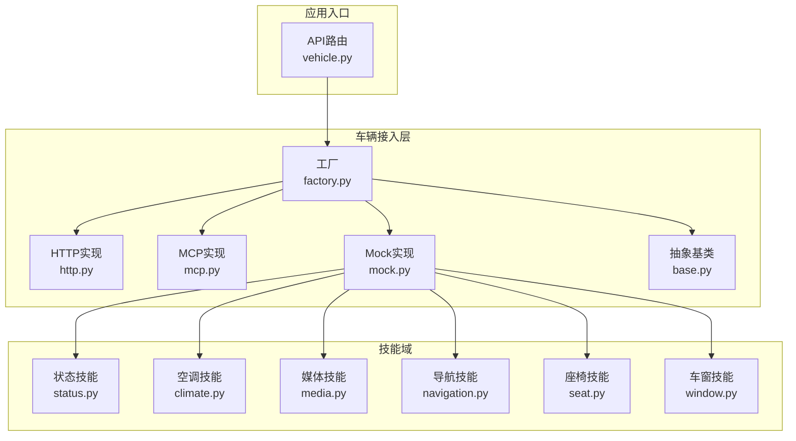
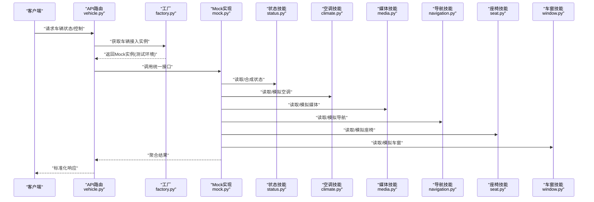
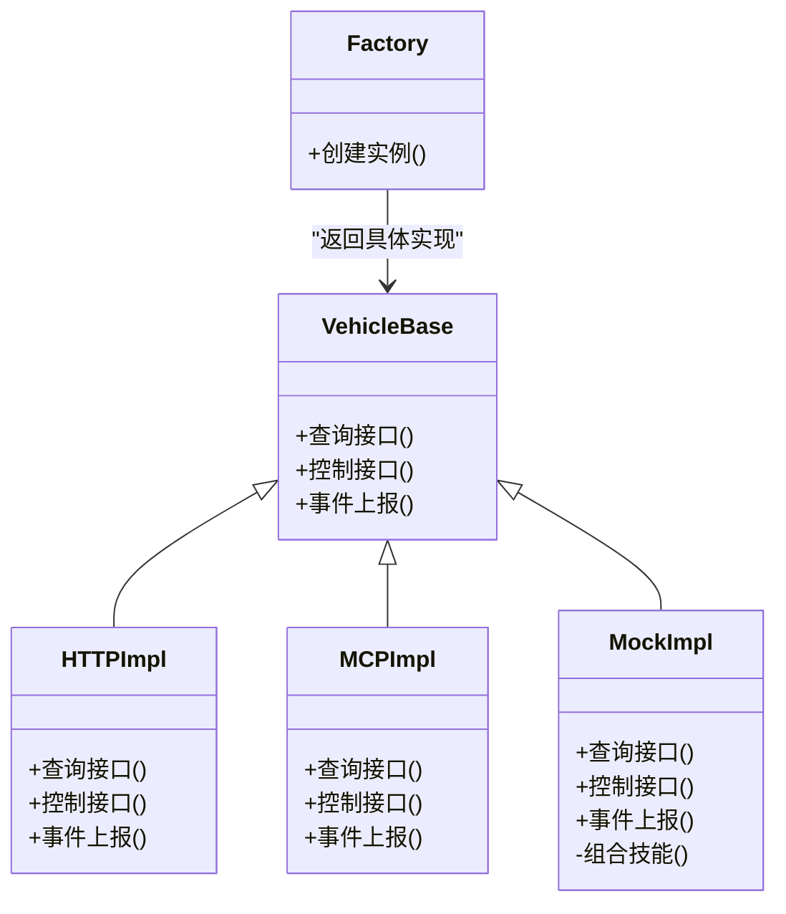
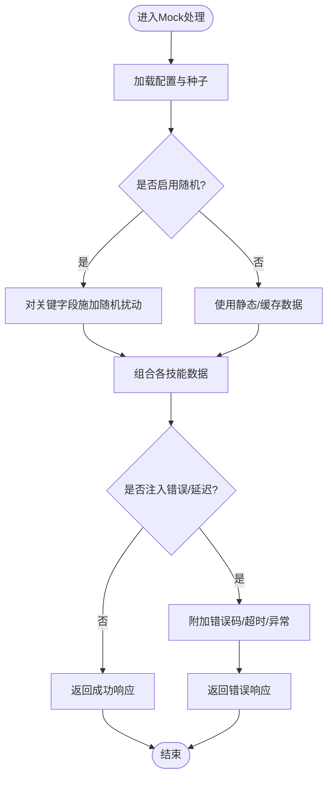
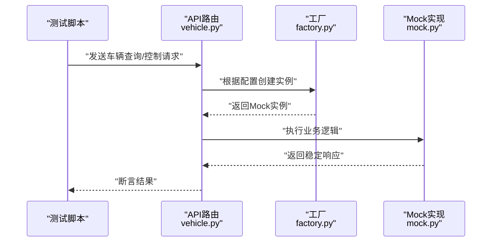
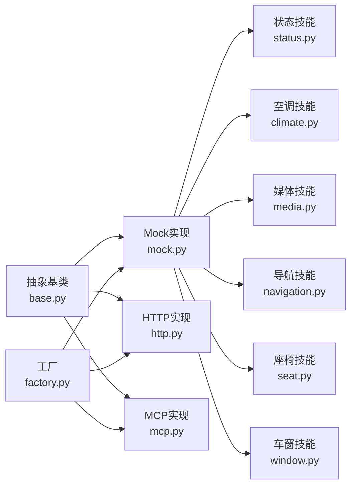

# Mock适配器

<cite>
**本文引用的文件**   
- [backend_design/nexus/vehicle/mock.py](file://backend_design/nexus/vehicle/mock.py)
- [backend_design/nexus/vehicle/base.py](file://backend_design/nexus/vehicle/base.py)
- [backend_design/nexus/vehicle/factory.py](file://backend_design/nexus/vehicle/factory.py)
- [backend_design/nexus/vehicle/http.py](file://backend_design/nexus/vehicle/http.py)
- [backend_design/nexus/vehicle/mcp.py](file://backend_design/nexus/vehicle/mcp.py)
- [backend_design/nexus/skills/vehicle/status.py](file://backend_design/nexus/skills/vehicle/status.py)
- [backend_design/nexus/skills/vehicle/climate.py](file://backend_design/nexus/skills/vehicle/climate.py)
- [backend_design/nexus/skills/vehicle/media.py](file://backend_design/nexus/skills/vehicle/media.py)
- [backend_design/nexus/skills/vehicle/navigation.py](file://backend_design/nexus/skills/vehicle/navigation.py)
- [backend_design/nexus/skills/vehicle/seat.py](file://backend_design/nexus/skills/vehicle/seat.py)
- [backend_design/nexus/skills/vehicle/window.py](file://backend_design/nexus/skills/vehicle/window.py)
- [backend_design/nexus/core/logger.py](file://backend_design/nexus/core/logger.py)
- [backend_design/nexus/config.py](file://backend_design/nexus/config.py)
- [backend_design/nexus/api/routes/vehicle.py](file://backend_design/nexus/api/routes/vehicle.py)
- [backend_design/tests/test_core.py](file://backend_design/tests/test_core.py)
</cite>

## 目录
1. [简介](#简介)
2. [项目结构](#项目结构)
3. [核心组件](#核心组件)
4. [架构总览](#架构总览)
5. [详细组件分析](#详细组件分析)
6. [依赖关系分析](#依赖关系分析)
7. [性能考虑](#性能考虑)
8. [故障排查指南](#故障排查指南)
9. [结论](#结论)
10. [附录](#附录)

## 简介
本文件面向开发与测试人员，系统性说明Mock适配器的能力与用法。内容覆盖：
- 模拟车辆状态、预设响应数据与随机行为生成
- 测试场景配置（正常流程、异常场景、边界条件）
- Mock数据定义与管理（静态、动态、外部数据源集成）
- 性能测试支持（高并发、负载、压力）
- 使用示例与最佳实践
- 调试工具、日志记录与测试报告生成

## 项目结构
与Mock适配器相关的代码主要位于后端Python模块的vehicle层与skills层，并通过API路由暴露给上层调用。关键位置如下：
- vehicle层：提供HTTP/MCP/Mock三种车辆接入实现及工厂选择
- skills层：按功能域组织技能（状态、空调、媒体、导航、座椅、车窗等），便于在Mock中组合与回放
- API层：对外暴露车辆相关接口，内部可切换至Mock实现
- 配置与日志：集中管理开关、阈值与日志输出

图示来源
- [backend_design/nexus/api/routes/vehicle.py](file://backend_design/nexus/api/routes/vehicle.py)
- [backend_design/nexus/vehicle/factory.py](file://backend_design/nexus/vehicle/factory.py)
- [backend_design/nexus/vehicle/base.py](file://backend_design/nexus/vehicle/base.py)
- [backend_design/nexus/vehicle/http.py](file://backend_design/nexus/vehicle/http.py)
- [backend_design/nexus/vehicle/mcp.py](file://backend_design/nexus/vehicle/mcp.py)
- [backend_design/nexus/vehicle/mock.py](file://backend_design/nexus/vehicle/mock.py)
- [backend_design/nexus/skills/vehicle/status.py](file://backend_design/nexus/skills/vehicle/status.py)
- [backend_design/nexus/skills/vehicle/climate.py](file://backend_design/nexus/skills/vehicle/climate.py)
- [backend_design/nexus/skills/vehicle/media.py](file://backend_design/nexus/skills/vehicle/media.py)
- [backend_design/nexus/skills/vehicle/navigation.py](file://backend_design/nexus/skills/vehicle/navigation.py)
- [backend_design/nexus/skills/vehicle/seat.py](file://backend_design/nexus/skills/vehicle/seat.py)
- [backend_design/nexus/skills/vehicle/window.py](file://backend_design/nexus/skills/vehicle/window.py)

章节来源
- [backend_design/nexus/vehicle/mock.py](file://backend_design/nexus/vehicle/mock.py)
- [backend_design/nexus/vehicle/base.py](file://backend_design/nexus/vehicle/base.py)
- [backend_design/nexus/vehicle/factory.py](file://backend_design/nexus/vehicle/factory.py)
- [backend_design/nexus/vehicle/http.py](file://backend_design/nexus/vehicle/http.py)
- [backend_design/nexus/vehicle/mcp.py](file://backend_design/nexus/vehicle/mcp.py)
- [backend_design/nexus/skills/vehicle/status.py](file://backend_design/nexus/skills/vehicle/status.py)
- [backend_design/nexus/skills/vehicle/climate.py](file://backend_design/nexus/skills/vehicle/climate.py)
- [backend_design/nexus/skills/vehicle/media.py](file://backend_design/nexus/skills/vehicle/media.py)
- [backend_design/nexus/skills/vehicle/navigation.py](file://backend_design/nexus/skills/vehicle/navigation.py)
- [backend_design/nexus/skills/vehicle/seat.py](file://backend_design/nexus/skills/vehicle/seat.py)
- [backend_design/nexus/skills/vehicle/window.py](file://backend_design/nexus/skills/vehicle/window.py)
- [backend_design/nexus/api/routes/vehicle.py](file://backend_design/nexus/api/routes/vehicle.py)

## 核心组件
- 抽象基类：统一车辆接入接口契约，规范查询、控制与事件上报方法签名
- 工厂：根据配置或上下文选择具体实现（HTTP/MCP/Mock）
- Mock实现：在不连接真实车辆的情况下，提供稳定可控的响应与行为
- 技能域：将车辆能力拆分为独立模块，Mock通过组合这些技能快速拼装复杂场景
- API路由：对外暴露接口，内部透明切换至Mock以支撑开发/测试

章节来源
- [backend_design/nexus/vehicle/base.py](file://backend_design/nexus/vehicle/base.py)
- [backend_design/nexus/vehicle/factory.py](file://backend_design/nexus/vehicle/factory.py)
- [backend_design/nexus/vehicle/mock.py](file://backend_design/nexus/vehicle/mock.py)
- [backend_design/nexus/skills/vehicle/status.py](file://backend_design/nexus/skills/vehicle/status.py)
- [backend_design/nexus/skills/vehicle/climate.py](file://backend_design/nexus/skills/vehicle/climate.py)
- [backend_design/nexus/skills/vehicle/media.py](file://backend_design/nexus/skills/vehicle/media.py)
- [backend_design/nexus/skills/vehicle/navigation.py](file://backend_design/nexus/skills/vehicle/navigation.py)
- [backend_design/nexus/skills/vehicle/seat.py](file://backend_design/nexus/skills/vehicle/seat.py)
- [backend_design/nexus/skills/vehicle/window.py](file://backend_design/nexus/skills/vehicle/window.py)

## 架构总览
下图展示从API到车辆接入层的调用路径，以及Mock如何组合各技能完成响应。

图示来源
- [backend_design/nexus/api/routes/vehicle.py](file://backend_design/nexus/api/routes/vehicle.py)
- [backend_design/nexus/vehicle/factory.py](file://backend_design/nexus/vehicle/factory.py)
- [backend_design/nexus/vehicle/mock.py](file://backend_design/nexus/vehicle/mock.py)
- [backend_design/nexus/skills/vehicle/status.py](file://backend_design/nexus/skills/vehicle/status.py)
- [backend_design/nexus/skills/vehicle/climate.py](file://backend_design/nexus/skills/vehicle/climate.py)
- [backend_design/nexus/skills/vehicle/media.py](file://backend_design/nexus/skills/vehicle/media.py)
- [backend_design/nexus/skills/vehicle/navigation.py](file://backend_design/nexus/skills/vehicle/navigation.py)
- [backend_design/nexus/skills/vehicle/seat.py](file://backend_design/nexus/skills/vehicle/seat.py)
- [backend_design/nexus/skills/vehicle/window.py](file://backend_design/nexus/skills/vehicle/window.py)

## 详细组件分析

### 抽象基类与工厂
- 抽象基类定义了统一的查询、控制与事件方法，确保不同实现具备一致的行为契约
- 工厂负责依据配置或运行环境选择具体实现；在测试/开发环境下优先返回Mock实现，保证稳定性与可重复性

图示来源
- [backend_design/nexus/vehicle/base.py](file://backend_design/nexus/vehicle/base.py)
- [backend_design/nexus/vehicle/http.py](file://backend_design/nexus/vehicle/http.py)
- [backend_design/nexus/vehicle/mcp.py](file://backend_design/nexus/vehicle/mcp.py)
- [backend_design/nexus/vehicle/mock.py](file://backend_design/nexus/vehicle/mock.py)
- [backend_design/nexus/vehicle/factory.py](file://backend_design/nexus/vehicle/factory.py)

章节来源
- [backend_design/nexus/vehicle/base.py](file://backend_design/nexus/vehicle/base.py)
- [backend_design/nexus/vehicle/factory.py](file://backend_design/nexus/vehicle/factory.py)

### Mock实现与技能组合
- Mock实现不依赖真实车辆，通过组合各技能模块拼装完整响应
- 支持静态数据、动态计算与随机扰动，满足多类测试需求
- 可按需注入延迟、错误码与异常分支，用于异常与边界场景验证

图示来源
- [backend_design/nexus/vehicle/mock.py](file://backend_design/nexus/vehicle/mock.py)
- [backend_design/nexus/skills/vehicle/status.py](file://backend_design/nexus/skills/vehicle/status.py)
- [backend_design/nexus/skills/vehicle/climate.py](file://backend_design/nexus/skills/vehicle/climate.py)
- [backend_design/nexus/skills/vehicle/media.py](file://backend_design/nexus/skills/vehicle/media.py)
- [backend_design/nexus/skills/vehicle/navigation.py](file://backend_design/nexus/skills/vehicle/navigation.py)
- [backend_design/nexus/skills/vehicle/seat.py](file://backend_design/nexus/skills/vehicle/seat.py)
- [backend_design/nexus/skills/vehicle/window.py](file://backend_design/nexus/skills/vehicle/window.py)

章节来源
- [backend_design/nexus/vehicle/mock.py](file://backend_design/nexus/vehicle/mock.py)
- [backend_design/nexus/skills/vehicle/status.py](file://backend_design/nexus/skills/vehicle/status.py)
- [backend_design/nexus/skills/vehicle/climate.py](file://backend_design/nexus/skills/vehicle/climate.py)
- [backend_design/nexus/skills/vehicle/media.py](file://backend_design/nexus/skills/vehicle/media.py)
- [backend_design/nexus/skills/vehicle/navigation.py](file://backend_design/nexus/skills/vehicle/navigation.py)
- [backend_design/nexus/skills/vehicle/seat.py](file://backend_design/nexus/skills/vehicle/seat.py)
- [backend_design/nexus/skills/vehicle/window.py](file://backend_design/nexus/skills/vehicle/window.py)

### API路由与Mock切换
- API路由接收请求后，由工厂决定使用Mock还是真实实现
- 在测试/开发环境中默认走Mock，避免外部依赖不稳定影响用例执行

图示来源
- [backend_design/nexus/api/routes/vehicle.py](file://backend_design/nexus/api/routes/vehicle.py)
- [backend_design/nexus/vehicle/factory.py](file://backend_design/nexus/vehicle/factory.py)
- [backend_design/nexus/vehicle/mock.py](file://backend_design/nexus/vehicle/mock.py)

章节来源
- [backend_design/nexus/api/routes/vehicle.py](file://backend_design/nexus/api/routes/vehicle.py)
- [backend_design/nexus/vehicle/factory.py](file://backend_design/nexus/vehicle/factory.py)

## 依赖关系分析
- 低耦合：Mock仅依赖技能模块与配置/日志，不直接依赖网络或硬件
- 可替换：通过工厂与抽象基类，Mock与HTTP/MCP实现可无缝替换
- 可扩展：新增车辆能力只需扩展对应技能并在Mock中组合

图示来源
- [backend_design/nexus/vehicle/base.py](file://backend_design/nexus/vehicle/base.py)
- [backend_design/nexus/vehicle/mock.py](file://backend_design/nexus/vehicle/mock.py)
- [backend_design/nexus/vehicle/http.py](file://backend_design/nexus/vehicle/http.py)
- [backend_design/nexus/vehicle/mcp.py](file://backend_design/nexus/vehicle/mcp.py)
- [backend_design/nexus/vehicle/factory.py](file://backend_design/nexus/vehicle/factory.py)
- [backend_design/nexus/skills/vehicle/status.py](file://backend_design/nexus/skills/vehicle/status.py)
- [backend_design/nexus/skills/vehicle/climate.py](file://backend_design/nexus/skills/vehicle/climate.py)
- [backend_design/nexus/skills/vehicle/media.py](file://backend_design/nexus/skills/vehicle/media.py)
- [backend_design/nexus/skills/vehicle/navigation.py](file://backend_design/nexus/skills/vehicle/navigation.py)
- [backend_design/nexus/skills/vehicle/seat.py](file://backend_design/nexus/skills/vehicle/seat.py)
- [backend_design/nexus/skills/vehicle/window.py](file://backend_design/nexus/skills/vehicle/window.py)

章节来源
- [backend_design/nexus/vehicle/base.py](file://backend_design/nexus/vehicle/base.py)
- [backend_design/nexus/vehicle/mock.py](file://backend_design/nexus/vehicle/mock.py)
- [backend_design/nexus/vehicle/factory.py](file://backend_design/nexus/vehicle/factory.py)

## 性能考虑
- 高并发模拟：通过并发调用API并统计P95/P99时延与错误率，验证系统吞吐与稳定性
- 负载测试：逐步提升QPS，观察资源占用与降级策略生效情况
- 压力测试：持续拉满并发，关注内存泄漏、连接池耗尽与GC抖动
- 随机性与确定性：为压测固定随机种子，保证结果可复现；同时保留开启扰动的开关以覆盖更多路径

[本节为通用指导，无需特定文件引用]

## 故障排查指南
- 日志定位：检查统一日志输出，确认Mock是否被正确选择、技能组合是否完整、错误注入是否生效
- 常见异常：超时、空指针、字段缺失、类型不一致；建议在Mock中增加校验与兜底默认值
- 断点与追踪：在API路由与Mock入口设置断点，结合日志ID进行链路追踪
- 回归保障：将典型失败路径纳入自动化用例，确保修复后不再回归

章节来源
- [backend_design/nexus/core/logger.py](file://backend_design/nexus/core/logger.py)
- [backend_design/tests/test_core.py](file://backend_design/tests/test_core.py)

## 结论
Mock适配器通过抽象基类与工厂机制，实现了与真实车辆实现的解耦；借助技能化拆分，可在不依赖外部系统的情况下，灵活构造正常、异常与边界场景，并提供稳定的性能测试基础。配合完善的日志与测试框架，可有效提升开发与测试效率与质量。

[本节为总结性内容，无需特定文件引用]

## 附录

### 测试场景配置建议
- 正常流程：关闭随机扰动，使用静态数据，验证端到端主流程
- 异常场景：注入错误码、超时、空响应、非法参数，验证容错与降级
- 边界条件：极值输入、空集合、超长字符串、特殊字符，验证健壮性

[本节为通用指导，无需特定文件引用]

### 使用示例与最佳实践
- 在测试环境强制使用Mock，避免外部依赖不稳定
- 为每个用例指定明确的随机种子与期望结果，保证可复现
- 将常用场景封装为“场景模板”，减少重复配置
- 对关键路径添加断言与覆盖率收集，持续提升质量

[本节为通用指导，无需特定文件引用]

### 调试工具、日志与报告
- 调试：在API与Mock入口打印关键入参/出参，结合链路ID定位问题
- 日志：统一日志格式，包含时间戳、级别、模块、请求ID与耗时
- 报告：汇总用例通过率、失败堆栈、平均/分位耗时与错误分布，便于复盘

章节来源
- [backend_design/nexus/core/logger.py](file://backend_design/nexus/core/logger.py)
- [backend_design/nexus/config.py](file://backend_design/nexus/config.py)
- [backend_design/tests/test_core.py](file://backend_design/tests/test_core.py)