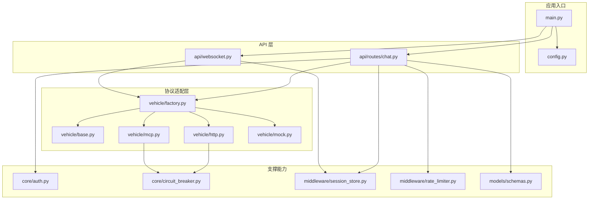
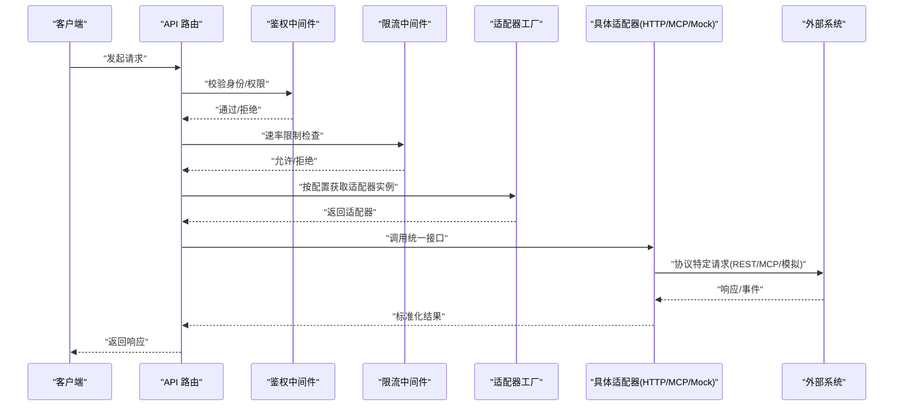
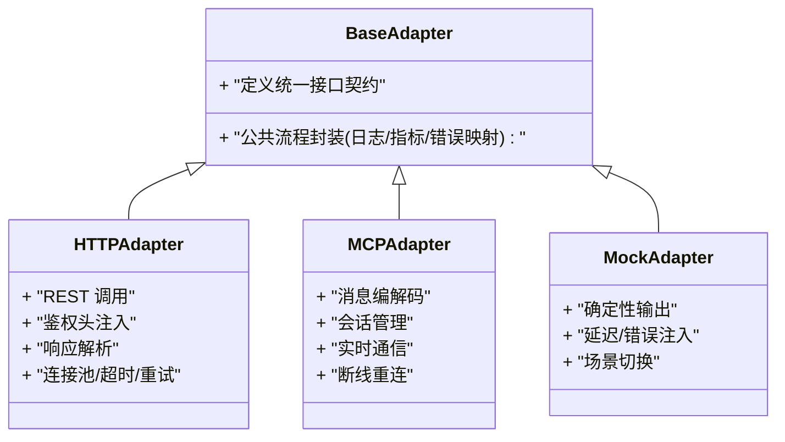
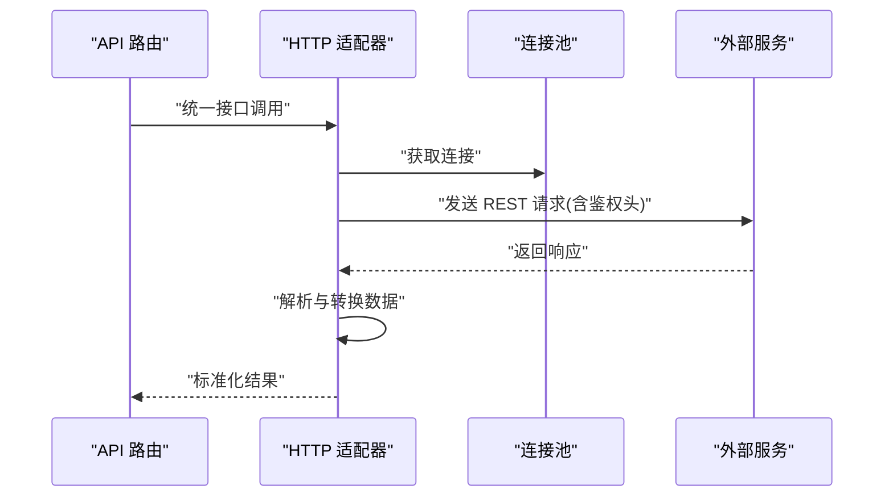
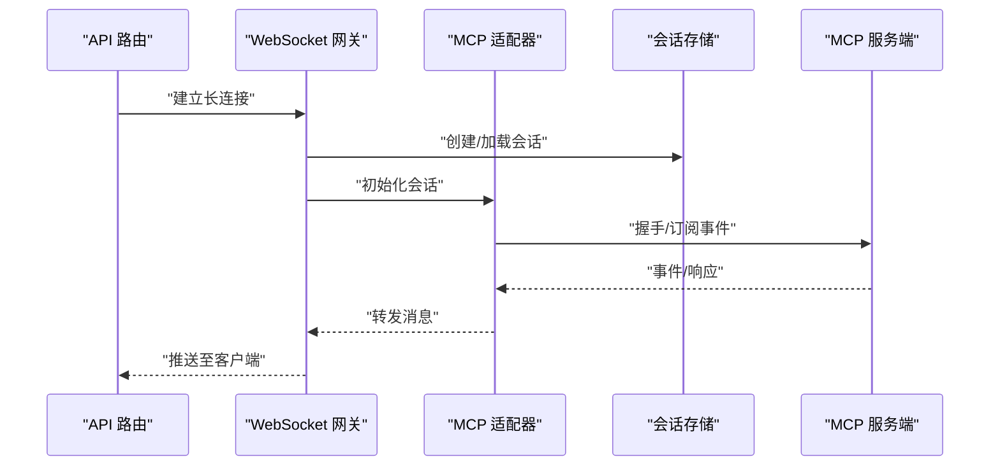
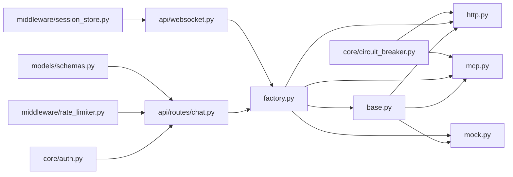

# 协议适配器

<cite>
**本文引用的文件**   
- [backend_design/nexus/vehicle/base.py](file://backend_design/nexus/vehicle/base.py)
- [backend_design/nexus/vehicle/http.py](file://backend_design/nexus/vehicle/http.py)
- [backend_design/nexus/vehicle/mcp.py](file://backend_design/nexus/vehicle/mcp.py)
- [backend_design/nexus/vehicle/mock.py](file://backend_design/nexus/vehicle/mock.py)
- [backend_design/nexus/vehicle/factory.py](file://backend_design/nexus/vehicle/factory.py)
- [backend_design/nexus/api/routes/chat.py](file://backend_design/nexus/api/routes/chat.py)
- [backend_design/nexus/api/websocket.py](file://backend_design/nexus/api/websocket.py)
- [backend_design/nexus/core/auth.py](file://backend_design/nexus/core/auth.py)
- [backend_design/nexus/core/circuit_breaker.py](file://backend_design/nexus/core/circuit_breaker.py)
- [backend_design/nexus/middleware/session_store.py](file://backend_design/nexus/middleware/session_store.py)
- [backend_design/nexus/middleware/rate_limiter.py](file://backend_design/nexus/middleware/rate_limiter.py)
- [backend_design/nexus/models/schemas.py](file://backend_design/nexus/models/schemas.py)
- [backend_design/nexus/config.py](file://backend_design/nexus/config.py)
- [backend_design/nexus/main.py](file://backend_design/nexus/main.py)
</cite>

## 目录
1. [简介](#简介)
2. [项目结构](#项目结构)
3. [核心组件](#核心组件)
4. [架构总览](#架构总览)
5. [详细组件分析](#详细组件分析)
6. [依赖关系分析](#依赖关系分析)
7. [性能考虑](#性能考虑)
8. [故障排查指南](#故障排查指南)
9. [结论](#结论)
10. [附录](#附录)

## 简介
本技术文档聚焦于“协议适配器”子系统，围绕以下目标展开：
- HTTP API 适配器的实现细节：RESTful 接口调用、认证机制与数据格式转换。
- MCP 协议的集成方式：消息格式、会话管理与实时通信。
- Mock 适配器的开发与测试支持能力。
- 不同协议间的差异处理与统一抽象。
- 新协议适配器的开发指南与配置方法。
- 性能优化、连接池管理与错误恢复策略。

## 项目结构
协议适配器位于后端模块的 vehicle 子系统中，采用“统一抽象 + 多实现”的分层设计：
- 统一抽象层：定义协议无关的接口契约（如查询车辆状态、执行控制指令等）。
- 协议实现层：提供多种具体协议实现（HTTP、MCP、Mock）。
- 工厂与路由：根据配置选择并创建具体适配器实例。
- 上层集成：API 路由、WebSocket 网关、中间件（鉴权、限流、会话）与模型序列化。

图表来源
- [backend_design/nexus/main.py](file://backend_design/nexus/main.py)
- [backend_design/nexus/config.py](file://backend_design/nexus/config.py)
- [backend_design/nexus/api/routes/chat.py](file://backend_design/nexus/api/routes/chat.py)
- [backend_design/nexus/api/websocket.py](file://backend_design/nexus/api/websocket.py)
- [backend_design/nexus/vehicle/base.py](file://backend_design/nexus/vehicle/base.py)
- [backend_design/nexus/vehicle/http.py](file://backend_design/nexus/vehicle/http.py)
- [backend_design/nexus/vehicle/mcp.py](file://backend_design/nexus/vehicle/mcp.py)
- [backend_design/nexus/vehicle/mock.py](file://backend_design/nexus/vehicle/mock.py)
- [backend_design/nexus/vehicle/factory.py](file://backend_design/nexus/vehicle/factory.py)
- [backend_design/nexus/core/auth.py](file://backend_design/nexus/core/auth.py)
- [backend_design/nexus/core/circuit_breaker.py](file://backend_design/nexus/core/circuit_breaker.py)
- [backend_design/nexus/middleware/session_store.py](file://backend_design/nexus/middleware/session_store.py)
- [backend_design/nexus/middleware/rate_limiter.py](file://backend_design/nexus/middleware/rate_limiter.py)
- [backend_design/nexus/models/schemas.py](file://backend_design/nexus/models/schemas.py)

章节来源
- [backend_design/nexus/main.py](file://backend_design/nexus/main.py)
- [backend_design/nexus/config.py](file://backend_design/nexus/config.py)
- [backend_design/nexus/vehicle/base.py](file://backend_design/nexus/vehicle/base.py)
- [backend_design/nexus/vehicle/http.py](file://backend_design/nexus/vehicle/http.py)
- [backend_design/nexus/vehicle/mcp.py](file://backend_design/nexus/vehicle/mcp.py)
- [backend_design/nexus/vehicle/mock.py](file://backend_design/nexus/vehicle/mock.py)
- [backend_design/nexus/vehicle/factory.py](file://backend_design/nexus/vehicle/factory.py)
- [backend_design/nexus/api/routes/chat.py](file://backend_design/nexus/api/routes/chat.py)
- [backend_design/nexus/api/websocket.py](file://backend_design/nexus/api/websocket.py)
- [backend_design/nexus/core/auth.py](file://backend_design/nexus/core/auth.py)
- [backend_design/nexus/core/circuit_breaker.py](file://backend_design/nexus/core/circuit_breaker.py)
- [backend_design/nexus/middleware/session_store.py](file://backend_design/nexus/middleware/session_store.py)
- [backend_design/nexus/middleware/rate_limiter.py](file://backend_design/nexus/middleware/rate_limiter.py)
- [backend_design/nexus/models/schemas.py](file://backend_design/nexus/models/schemas.py)

## 核心组件
- 统一抽象接口（Base Adapter）
  - 职责：定义跨协议一致的调用契约，包括查询、控制、事件订阅等通用方法签名与返回约定。
  - 价值：屏蔽底层协议差异，使上层业务无需关心具体实现。
- HTTP 适配器
  - 职责：基于 RESTful 风格访问远端服务；负责请求构建、鉴权头注入、响应解析与异常映射。
  - 特性：可配置超时、重试、熔断；支持连接复用与连接池参数调优。
- MCP 适配器
  - 职责：对接 MCP 协议的消息通道；管理会话生命周期；处理双向或单向实时消息。
  - 特性：消息编解码、会话上下文维护、断线重连与背压控制。
- Mock 适配器
  - 职责：为本地开发与测试提供确定性输出；支持延迟、错误注入与场景切换。
  - 特性：便于自动化测试、混沌工程演练与回归验证。
- 工厂与配置
  - 职责：依据运行时配置动态创建具体适配器实例；集中管理协议相关参数。
- 上层集成
  - API 路由：将 HTTP 请求转换为适配器调用，并进行输入校验与输出序列化。
  - WebSocket：承载长连接与实时推送，结合会话存储进行上下文关联。
  - 鉴权与限流：在接入层完成身份校验与流量治理。
  - 熔断与降级：保护下游不稳定依赖，保障系统整体可用性。

章节来源
- [backend_design/nexus/vehicle/base.py](file://backend_design/nexus/vehicle/base.py)
- [backend_design/nexus/vehicle/http.py](file://backend_design/nexus/vehicle/http.py)
- [backend_design/nexus/vehicle/mcp.py](file://backend_design/nexus/vehicle/mcp.py)
- [backend_design/nexus/vehicle/mock.py](file://backend_design/nexus/vehicle/mock.py)
- [backend_design/nexus/vehicle/factory.py](file://backend_design/nexus/vehicle/factory.py)
- [backend_design/nexus/api/routes/chat.py](file://backend_design/nexus/api/routes/chat.py)
- [backend_design/nexus/api/websocket.py](file://backend_design/nexus/api/websocket.py)
- [backend_design/nexus/core/auth.py](file://backend_design/nexus/core/auth.py)
- [backend_design/nexus/core/circuit_breaker.py](file://backend_design/nexus/core/circuit_breaker.py)
- [backend_design/nexus/middleware/session_store.py](file://backend_design/nexus/middleware/session_store.py)
- [backend_design/nexus/middleware/rate_limiter.py](file://backend_design/nexus/middleware/rate_limiter.py)
- [backend_design/nexus/models/schemas.py](file://backend_design/nexus/models/schemas.py)

## 架构总览
协议适配器处于“接入层—适配层—外部系统”之间的关键位置，承担协议转换、会话管理、错误隔离与性能优化等职责。

图表来源
- [backend_design/nexus/api/routes/chat.py](file://backend_design/nexus/api/routes/chat.py)
- [backend_design/nexus/core/auth.py](file://backend_design/nexus/core/auth.py)
- [backend_design/nexus/middleware/rate_limiter.py](file://backend_design/nexus/middleware/rate_limiter.py)
- [backend_design/nexus/vehicle/factory.py](file://backend_design/nexus/vehicle/factory.py)
- [backend_design/nexus/vehicle/http.py](file://backend_design/nexus/vehicle/http.py)
- [backend_design/nexus/vehicle/mcp.py](file://backend_design/nexus/vehicle/mcp.py)
- [backend_design/nexus/vehicle/mock.py](file://backend_design/nexus/vehicle/mock.py)

## 详细组件分析

### 统一抽象层（Base Adapter）
- 设计要点
  - 定义统一的调用契约，确保各协议实现具备一致的方法签名与返回约定。
  - 抽象出公共流程（如日志、指标、错误码映射），降低重复代码。
- 复杂度与扩展性
  - 新增协议只需实现统一接口，并在工厂中注册即可接入。
- 典型交互
  - 上层通过工厂获取适配器后，以统一接口进行调用，屏蔽协议差异。

图表来源
- [backend_design/nexus/vehicle/base.py](file://backend_design/nexus/vehicle/base.py)
- [backend_design/nexus/vehicle/http.py](file://backend_design/nexus/vehicle/http.py)
- [backend_design/nexus/vehicle/mcp.py](file://backend_design/nexus/vehicle/mcp.py)
- [backend_design/nexus/vehicle/mock.py](file://backend_design/nexus/vehicle/mock.py)

章节来源
- [backend_design/nexus/vehicle/base.py](file://backend_design/nexus/vehicle/base.py)

### HTTP API 适配器
- 功能范围
  - RESTful 接口调用：构造请求路径、查询参数、请求体与头部。
  - 认证机制：注入令牌、签名或证书等鉴权信息。
  - 数据格式转换：将外部 JSON/表单/二进制等转换为内部标准模型。
  - 错误处理：网络异常、超时、非 2xx 响应、业务错误码的统一映射。
- 性能与可靠性
  - 连接复用与连接池：减少握手开销，提升吞吐。
  - 超时与重试：合理设置超时阈值与重试策略，避免雪崩。
  - 熔断器：对不稳定下游快速失败，保护上游。
- 典型调用序列

图表来源
- [backend_design/nexus/api/routes/chat.py](file://backend_design/nexus/api/routes/chat.py)
- [backend_design/nexus/vehicle/http.py](file://backend_design/nexus/vehicle/http.py)
- [backend_design/nexus/core/circuit_breaker.py](file://backend_design/nexus/core/circuit_breaker.py)

章节来源
- [backend_design/nexus/vehicle/http.py](file://backend_design/nexus/vehicle/http.py)
- [backend_design/nexus/core/circuit_breaker.py](file://backend_design/nexus/core/circuit_breaker.py)
- [backend_design/nexus/models/schemas.py](file://backend_design/nexus/models/schemas.py)

### MCP 协议适配器
- 集成要点
  - 消息格式：定义请求/响应/事件的消息结构与字段语义。
  - 会话管理：建立、保持与销毁会话，维护上下文与状态。
  - 实时通信：支持双向或单向消息流，处理心跳与保活。
- 健壮性
  - 断线重连：指数退避与最大重试次数控制。
  - 背压与限流：防止下游过载导致内存膨胀。
- 典型流程

图表来源
- [backend_design/nexus/api/websocket.py](file://backend_design/nexus/api/websocket.py)
- [backend_design/nexus/vehicle/mcp.py](file://backend_design/nexus/vehicle/mcp.py)
- [backend_design/nexus/middleware/session_store.py](file://backend_design/nexus/middleware/session_store.py)

章节来源
- [backend_design/nexus/vehicle/mcp.py](file://backend_design/nexus/vehicle/mcp.py)
- [backend_design/nexus/api/websocket.py](file://backend_design/nexus/api/websocket.py)
- [backend_design/nexus/middleware/session_store.py](file://backend_design/nexus/middleware/session_store.py)

### Mock 适配器
- 能力说明
  - 确定性输出：固定响应或基于种子生成，便于稳定复现。
  - 延迟与错误注入：模拟网络抖动、超时、业务异常等。
  - 场景切换：按配置或环境变量启用不同行为。
- 测试支持
  - 单元测试：无需真实外部依赖，快速覆盖边界条件。
  - 集成测试：组合多个 Mock 场景验证端到端链路。
  - 混沌演练：随机化失败率与延迟分布，评估系统韧性。

章节来源
- [backend_design/nexus/vehicle/mock.py](file://backend_design/nexus/vehicle/mock.py)

### 工厂与配置
- 工厂职责
  - 根据配置选择并创建具体适配器实例（HTTP/MCP/Mock）。
  - 注入共享资源（连接池、熔断器、会话存储等）。
- 配置项建议
  - 协议类型、目标地址、鉴权参数、超时、重试、连接池大小、熔断阈值等。
- 动态切换
  - 支持热更新或进程内切换，便于灰度与回滚。

章节来源
- [backend_design/nexus/vehicle/factory.py](file://backend_design/nexus/vehicle/factory.py)
- [backend_design/nexus/config.py](file://backend_design/nexus/config.py)

### 鉴权与限流
- 鉴权
  - 在 API 层完成身份校验与权限判断，确保仅合法用户可访问。
- 限流
  - 基于 IP/用户/接口的多维度限流，防止滥用与突发流量冲击。

章节来源
- [backend_design/nexus/core/auth.py](file://backend_design/nexus/core/auth.py)
- [backend_design/nexus/middleware/rate_limiter.py](file://backend_design/nexus/middleware/rate_limiter.py)

### 数据模型与序列化
- 统一模型
  - 使用标准模型描述请求与响应，保证跨层一致性。
- 序列化/反序列化
  - 在适配器层完成外部格式到内部模型的转换，在上层完成模型到响应的序列化。

章节来源
- [backend_design/nexus/models/schemas.py](file://backend_design/nexus/models/schemas.py)

## 依赖关系分析
- 耦合与内聚
  - 适配器层对内聚统一接口，对外依赖具体协议实现，降低上层耦合。
  - 工厂集中管理依赖注入，提高内聚性与可测试性。
- 外部依赖
  - HTTP 适配器依赖网络库与连接池。
  - MCP 适配器依赖消息通道与会话存储。
  - 熔断器与限流作为横切关注点被广泛使用。
- 潜在循环依赖
  - 通过工厂与接口解耦，避免直接相互引用导致的循环依赖。

图表来源
- [backend_design/nexus/vehicle/base.py](file://backend_design/nexus/vehicle/base.py)
- [backend_design/nexus/vehicle/http.py](file://backend_design/nexus/vehicle/http.py)
- [backend_design/nexus/vehicle/mcp.py](file://backend_design/nexus/vehicle/mcp.py)
- [backend_design/nexus/vehicle/mock.py](file://backend_design/nexus/vehicle/mock.py)
- [backend_design/nexus/vehicle/factory.py](file://backend_design/nexus/vehicle/factory.py)
- [backend_design/nexus/api/routes/chat.py](file://backend_design/nexus/api/routes/chat.py)
- [backend_design/nexus/api/websocket.py](file://backend_design/nexus/api/websocket.py)
- [backend_design/nexus/core/auth.py](file://backend_design/nexus/core/auth.py)
- [backend_design/nexus/core/circuit_breaker.py](file://backend_design/nexus/core/circuit_breaker.py)
- [backend_design/nexus/middleware/session_store.py](file://backend_design/nexus/middleware/session_store.py)
- [backend_design/nexus/middleware/rate_limiter.py](file://backend_design/nexus/middleware/rate_limiter.py)
- [backend_design/nexus/models/schemas.py](file://backend_design/nexus/models/schemas.py)

章节来源
- [backend_design/nexus/vehicle/base.py](file://backend_design/nexus/vehicle/base.py)
- [backend_design/nexus/vehicle/factory.py](file://backend_design/nexus/vehicle/factory.py)
- [backend_design/nexus/api/routes/chat.py](file://backend_design/nexus/api/routes/chat.py)
- [backend_design/nexus/api/websocket.py](file://backend_design/nexus/api/websocket.py)
- [backend_design/nexus/core/auth.py](file://backend_design/nexus/core/auth.py)
- [backend_design/nexus/core/circuit_breaker.py](file://backend_design/nexus/core/circuit_breaker.py)
- [backend_design/nexus/middleware/session_store.py](file://backend_design/nexus/middleware/session_store.py)
- [backend_design/nexus/middleware/rate_limiter.py](file://backend_design/nexus/middleware/rate_limiter.py)
- [backend_design/nexus/models/schemas.py](file://backend_design/nexus/models/schemas.py)

## 性能考虑
- 连接池管理
  - 合理设置最大连接数、空闲回收时间与连接复用策略，平衡资源占用与并发能力。
- 超时与重试
  - 区分读/写超时，设置合理的重试次数与退避策略，避免放大下游压力。
- 熔断与降级
  - 基于错误率与慢调用比例触发熔断，快速失败并返回降级结果。
- 背压与限流
  - 在实时通道（MCP/WebSocket）引入背压，结合全局与局部限流保护系统。
- 缓存与幂等
  - 对只读查询引入缓存，对写操作确保幂等，减少重复计算与副作用。

[本节为通用指导，不直接分析具体文件]

## 故障排查指南
- 常见问题定位
  - 鉴权失败：检查令牌有效期、签名算法与权限范围。
  - 连接超时：确认目标地址可达、端口开放与防火墙策略。
  - 熔断频繁触发：观察下游错误率与慢调用比例，调整阈值与超时。
  - 会话丢失：核查会话存储可用性与清理策略。
- 诊断手段
  - 开启详细日志与指标采集，定位瓶颈与异常路径。
  - 使用 Mock 适配器复现问题，隔离外部依赖影响。
  - 通过混沌注入验证系统在异常下的稳定性。

章节来源
- [backend_design/nexus/core/auth.py](file://backend_design/nexus/core/auth.py)
- [backend_design/nexus/core/circuit_breaker.py](file://backend_design/nexus/core/circuit_breaker.py)
- [backend_design/nexus/middleware/session_store.py](file://backend_design/nexus/middleware/session_store.py)
- [backend_design/nexus/vehicle/mock.py](file://backend_design/nexus/vehicle/mock.py)

## 结论
协议适配器通过统一抽象与多实现模式，有效屏蔽了 HTTP、MCP 与 Mock 等协议的差异，提升了系统的可扩展性与可维护性。配合工厂、鉴权、限流、熔断与会话管理等横切能力，形成了高可用、高性能且易测试的接入体系。遵循本文的开发指南与最佳实践，可快速扩展新的协议适配器并保持整体架构的一致性。

[本节为总结性内容，不直接分析具体文件]

## 附录

### 新协议适配器开发指南
- 步骤概览
  - 继承统一抽象接口，实现必要方法。
  - 在工厂中注册新适配器，并提供配置项。
  - 编写单测与集成用例，覆盖正常与异常路径。
  - 接入指标与日志，便于上线后监控。
- 配置项建议
  - 协议标识、目标地址、鉴权参数、超时、重试、连接池、熔断阈值等。
- 示例参考
  - 参考现有 HTTP/MCP/Mock 的实现思路与组织方式。

章节来源
- [backend_design/nexus/vehicle/base.py](file://backend_design/nexus/vehicle/base.py)
- [backend_design/nexus/vehicle/factory.py](file://backend_design/nexus/vehicle/factory.py)
- [backend_design/nexus/config.py](file://backend_design/nexus/config.py)

### 配置方法与运行入口
- 运行入口
  - 主程序负责加载配置、启动服务与挂载路由。
- 配置加载
  - 从配置文件或环境变量读取协议相关参数，驱动工厂创建实例。

章节来源
- [backend_design/nexus/main.py](file://backend_design/nexus/main.py)
- [backend_design/nexus/config.py](file://backend_design/nexus/config.py)