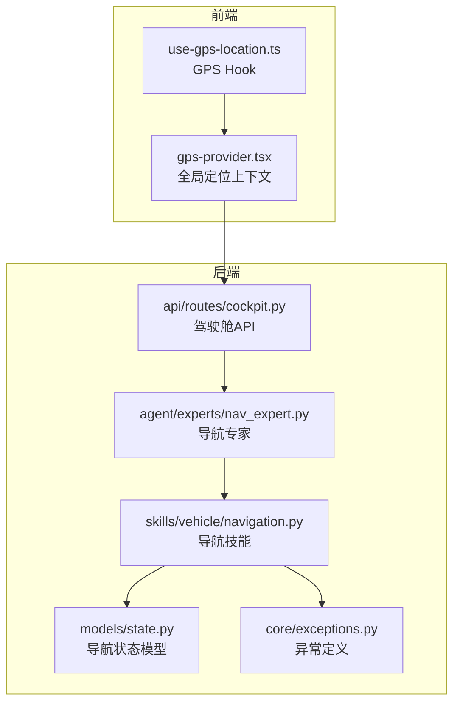
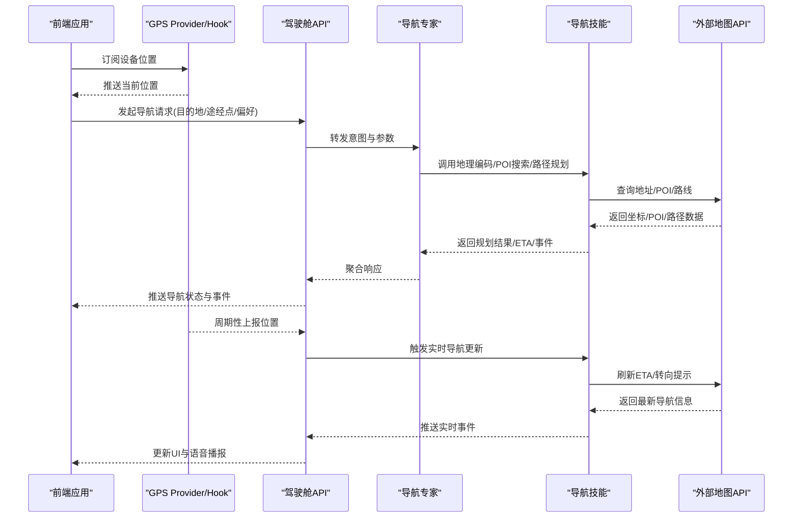
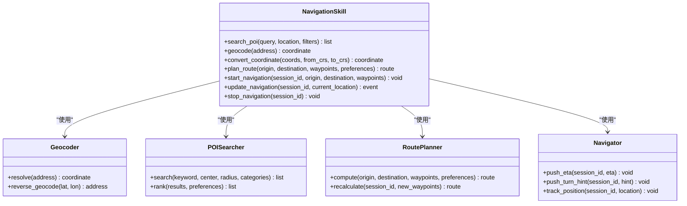
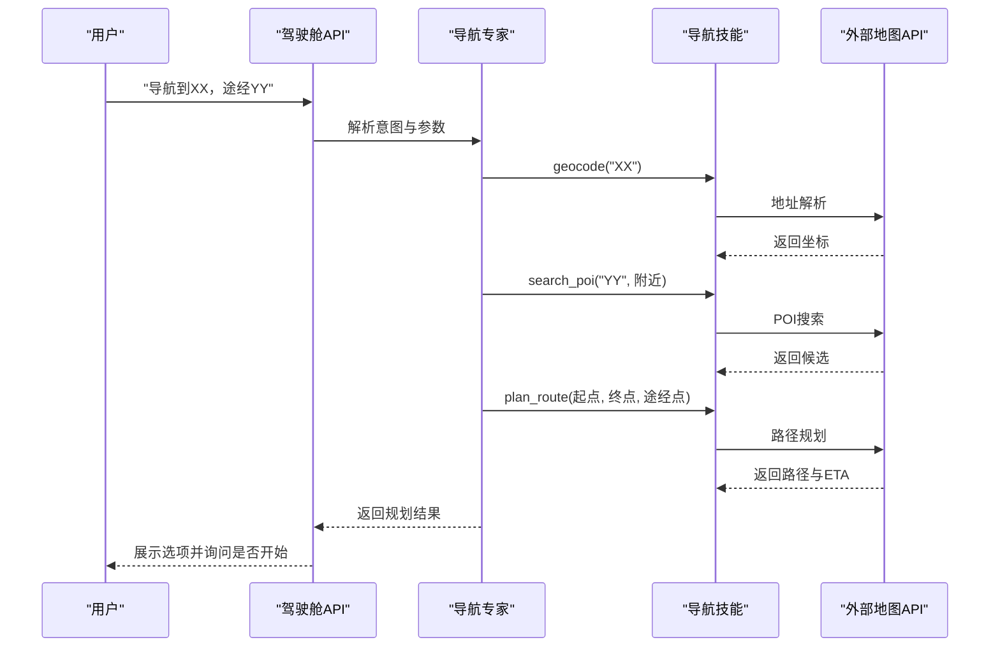
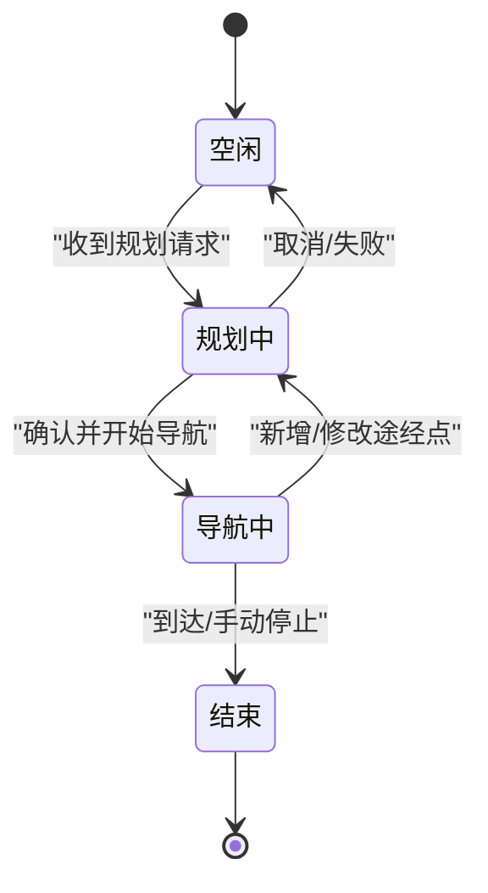
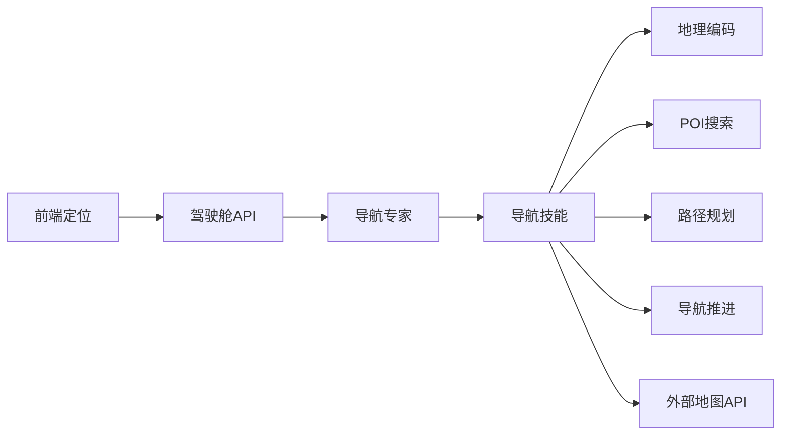

# 导航控制技能

<cite>
**本文引用的文件**   
- [backend_design/nexus/skills/vehicle/navigation.py](file://backend_design/nexus/skills/vehicle/navigation.py)
- [backend_design/nexus/agent/experts/nav_expert.py](file://backend_design/nexus/agent/experts/nav_expert.py)
- [backend_design/nexus/api/routes/cockpit.py](file://backend_design/nexus/api/routes/cockpit.py)
- [backend_design/nexus/core/exceptions.py](file://backend_design/nexus/core/exceptions.py)
- [backend_design/nexus/models/state.py](file://backend_design/nexus/models/state.py)
- [frontend_design/src/hooks/use-gps-location.ts](file://frontend_design/src/hooks/use-gps-location.ts)
- [frontend_design/src/components/layout/gps-provider.tsx](file://frontend_design/src/components/layout/gps-provider.tsx)
</cite>

## 目录
1. [简介](#简介)
2. [项目结构](#项目结构)
3. [核心组件](#核心组件)
4. [架构总览](#架构总览)
5. [详细组件分析](#详细组件分析)
6. [依赖关系分析](#依赖关系分析)
7. [性能考虑](#性能考虑)
8. [故障排查指南](#故障排查指南)
9. [结论](#结论)
10. [附录](#附录)

## 简介
本技术文档聚焦于NexusCockpit的“导航控制技能”，围绕目的地搜索、路线规划、实时导航、途经点设置等能力，系统阐述地理编码服务集成、POI搜索算法与路径优化策略、导航状态管理与实时更新机制，并给出地址解析、坐标转换与地图服务的集成示例。同时覆盖权限管理、隐私保护与数据安全考量，以及与外部地图API对接方式和错误处理策略。

## 项目结构
导航相关代码主要分布在后端技能层、专家路由层、API网关层以及前端定位能力中：
- 技能实现：位于后端技能模块的车辆子域，提供导航能力的具体业务逻辑封装。
- 专家路由：Agent专家体系中的导航专家负责意图识别与任务编排。
- API接口：驾驶舱API暴露导航相关的HTTP/WebSocket端点。
- 前端定位：前端通过Hook与Provider获取设备GPS位置，驱动导航UI与状态同步。

图表来源
- [backend_design/nexus/skills/vehicle/navigation.py](file://backend_design/nexus/skills/vehicle/navigation.py)
- [backend_design/nexus/agent/experts/nav_expert.py](file://backend_design/nexus/agent/experts/nav_expert.py)
- [backend_design/nexus/api/routes/cockpit.py](file://backend_design/nexus/api/routes/cockpit.py)
- [backend_design/nexus/models/state.py](file://backend_design/nexus/models/state.py)
- [backend_design/nexus/core/exceptions.py](file://backend_design/nexus/core/exceptions.py)
- [frontend_design/src/hooks/use-gps-location.ts](file://frontend_design/src/hooks/use-gps-location.ts)
- [frontend_design/src/components/layout/gps-provider.tsx](file://frontend_design/src/components/layout/gps-provider.tsx)

章节来源
- [backend_design/nexus/skills/vehicle/navigation.py](file://backend_design/nexus/skills/vehicle/navigation.py)
- [backend_design/nexus/agent/experts/nav_expert.py](file://backend_design/nexus/agent/experts/nav_expert.py)
- [backend_design/nexus/api/routes/cockpit.py](file://backend_design/nexus/api/routes/cockpit.py)
- [backend_design/nexus/models/state.py](file://backend_design/nexus/models/state.py)
- [backend_design/nexus/core/exceptions.py](file://backend_design/nexus/core/exceptions.py)
- [frontend_design/src/hooks/use-gps-location.ts](file://frontend_design/src/hooks/use-gps-location.ts)
- [frontend_design/src/components/layout/gps-provider.tsx](file://frontend_design/src/components/layout/gps-provider.tsx)

## 核心组件
- 导航技能（navigation.py）
  - 职责：封装目的地搜索、地址解析、坐标转换、路线规划、途经点管理、导航状态更新、与外部地图API交互等。
  - 关键能力：
    - 目的地搜索：支持关键词、类别、距离范围过滤；返回候选POI列表及评分排序。
    - 地址解析：将自然语言或结构化地址转换为经纬度坐标。
    - 坐标转换：在WGS84与目标地图坐标系之间进行转换。
    - 路线规划：计算起点到终点的最优路径，支持多途经点与偏好权重（如最短时间、最少拥堵）。
    - 实时导航：基于当前GPS位置推送ETA、剩余里程、下一步转向提示。
    - 途经点设置：动态增删改途经点，重算路径与ETA。
    - 状态管理：维护导航会话、阶段、事件流与持久化快照。
    - 错误处理：统一异常类型、重试与降级策略。
- 导航专家（nav_expert.py）
  - 职责：接收上层意图，调用导航技能完成具体任务；协调其他专家（如车辆专家）协同执行。
  - 关键能力：
    - 意图识别与参数抽取：从对话中提取目的地、途经点、偏好等。
    - 任务编排：按步骤调用地理编码、POI搜索、路径规划、导航启动等。
    - 结果聚合与反馈：将复杂结果简化为可播报/可视化的响应。
- 驾驶舱API（cockpit.py）
  - 职责：对外暴露导航相关HTTP/WebSocket接口，供前端订阅导航状态与触发导航操作。
  - 关键能力：
    - 导航会话创建/销毁
    - 发起搜索与规划请求
    - 推送实时导航事件（位置、ETA、转向提示）
- 导航状态模型（state.py）
  - 职责：定义导航会话、阶段、事件、轨迹、ETA等数据结构。
- 异常定义（exceptions.py）
  - 职责：统一定义导航相关异常类型与错误码，便于跨层传播与处理。
- 前端定位能力（use-gps-location.ts, gps-provider.tsx）
  - 职责：获取设备GPS位置，提供全局定位上下文，驱动导航UI与状态同步。

章节来源
- [backend_design/nexus/skills/vehicle/navigation.py](file://backend_design/nexus/skills/vehicle/navigation.py)
- [backend_design/nexus/agent/experts/nav_expert.py](file://backend_design/nexus/agent/experts/nav_expert.py)
- [backend_design/nexus/api/routes/cockpit.py](file://backend_design/nexus/api/routes/cockpit.py)
- [backend_design/nexus/models/state.py](file://backend_design/nexus/models/state.py)
- [backend_design/nexus/core/exceptions.py](file://backend_design/nexus/core/exceptions.py)
- [frontend_design/src/hooks/use-gps-location.ts](file://frontend_design/src/hooks/use-gps-location.ts)
- [frontend_design/src/components/layout/gps-provider.tsx](file://frontend_design/src/components/layout/gps-provider.tsx)

## 架构总览
导航控制技能采用“前端定位—API网关—专家编排—技能实现—外部地图API”的分层架构。前端通过GPS Hook与Provider获取位置并订阅导航事件；后端通过驾驶舱API接收导航指令，由导航专家进行意图解析与任务编排，最终调用导航技能完成地理编码、POI搜索、路径规划与导航推进，并与外部地图API交互。

图表来源
- [backend_design/nexus/api/routes/cockpit.py](file://backend_design/nexus/api/routes/cockpit.py)
- [backend_design/nexus/agent/experts/nav_expert.py](file://backend_design/nexus/agent/experts/nav_expert.py)
- [backend_design/nexus/skills/vehicle/navigation.py](file://backend_design/nexus/skills/vehicle/navigation.py)
- [frontend_design/src/hooks/use-gps-location.ts](file://frontend_design/src/hooks/use-gps-location.ts)
- [frontend_design/src/components/layout/gps-provider.tsx](file://frontend_design/src/components/layout/gps-provider.tsx)

## 详细组件分析

### 导航技能（navigation.py）
- 设计模式与职责
  - 单一职责：仅关注导航领域逻辑，不耦合用户认证、会话管理等通用能力。
  - 分层清晰：内部再分地理编码、POI搜索、路径规划、导航推进等子模块。
- 关键流程
  - 地址解析：输入地址字符串→调用地图服务→返回经纬度。
  - POI搜索：输入关键词+位置+过滤条件→返回候选列表→评分排序。
  - 路径规划：输入起点/终点/途经点+偏好→调用地图服务→返回路径与ETA。
  - 实时导航：输入当前位置→计算剩余里程/ETA/下一步转向→推送事件。
- 数据结构与复杂度
  - 候选POI列表：通常使用倒排索引或向量检索加速匹配，时间复杂度近似O(log n)或O(n log n)。
  - 路径规划：Dijkstra/A*变体，复杂度取决于图规模与启发函数质量。
- 错误处理与降级
  - 网络超时/限流：重试与熔断；失败时返回部分结果或友好提示。
  - 坐标无效：校验边界与精度，必要时回退至默认区域中心。
- 优化机会
  - 缓存热点POI与常用地址解析结果。
  - 批量请求合并与异步并行调用。
  - 路径规划增量更新，避免全量重算。

章节来源
- [backend_design/nexus/skills/vehicle/navigation.py](file://backend_design/nexus/skills/vehicle/navigation.py)

#### 类图（导航技能）

图表来源
- [backend_design/nexus/skills/vehicle/navigation.py](file://backend_design/nexus/skills/vehicle/navigation.py)

### 导航专家（nav_expert.py）
- 职责与协作
  - 意图识别：从用户输入提取目的地、途经点、偏好等实体。
  - 任务编排：顺序/并行调用地理编码、POI搜索、路径规划、导航启动。
  - 结果聚合：将复杂结果转化为简洁的播报与可视化数据。
- 典型调用链
  - 用户说“导航到XX，途经YY”→专家抽取参数→调用技能→返回规划结果→确认是否开始导航。
- 错误处理
  - 参数缺失：引导用户补充必要信息。
  - 外部服务不可用：降级为本地缓存或推荐替代方案。

章节来源
- [backend_design/nexus/agent/experts/nav_expert.py](file://backend_design/nexus/agent/experts/nav_expert.py)

#### 序列图（导航专家编排）

图表来源
- [backend_design/nexus/agent/experts/nav_expert.py](file://backend_design/nexus/agent/experts/nav_expert.py)
- [backend_design/nexus/skills/vehicle/navigation.py](file://backend_design/nexus/skills/vehicle/navigation.py)
- [backend_design/nexus/api/routes/cockpit.py](file://backend_design/nexus/api/routes/cockpit.py)

### 驾驶舱API（cockpit.py）
- 职责
  - 暴露导航相关HTTP/WebSocket接口，承载导航会话生命周期管理。
  - 转发前端请求至专家与技能，并将实时事件推送给前端。
- 关键端点
  - 创建/销毁导航会话
  - 发起搜索与规划
  - 订阅/取消订阅导航事件
- 安全与鉴权
  - 接入统一鉴权中间件，校验用户身份与权限。
  - 对敏感参数进行脱敏与审计。

章节来源
- [backend_design/nexus/api/routes/cockpit.py](file://backend_design/nexus/api/routes/cockpit.py)

### 导航状态模型（state.py）
- 字段说明
  - 会话ID、阶段（空闲/规划中/导航中/结束）、起点/终点/途经点、路径几何、ETA、事件队列、轨迹记录等。
- 状态机
  - 空闲→规划中→导航中→结束
  - 任意阶段可因错误进入终止态，需显式重置。
- 持久化
  - 建议落盘或内存数据库，保证重启恢复与会话一致性。

章节来源
- [backend_design/nexus/models/state.py](file://backend_design/nexus/models/state.py)

#### 状态机图（导航阶段）

图表来源
- [backend_design/nexus/models/state.py](file://backend_design/nexus/models/state.py)

### 前端定位能力（use-gps-location.ts, gps-provider.tsx）
- 职责
  - use-gps-location：封装浏览器/设备定位API，提供位置订阅与误差处理。
  - gps-provider：在全局上下文中共享定位状态，供导航UI消费。
- 集成要点
  - 权限申请：首次访问需用户授权。
  - 精度与频率：根据导航阶段调整采样频率与阈值。
  - 离线降级：无定位时回退至上次已知位置或默认中心。

章节来源
- [frontend_design/src/hooks/use-gps-location.ts](file://frontend_design/src/hooks/use-gps-location.ts)
- [frontend_design/src/components/layout/gps-provider.tsx](file://frontend_design/src/components/layout/gps-provider.tsx)

## 依赖关系分析
- 组件耦合
  - 导航技能依赖地理编码、POI搜索、路径规划、导航推进四个子模块，内聚性高。
  - 导航专家依赖导航技能与外部地图API，承担编排职责。
  - 驾驶舱API作为入口，解耦前端与后端实现细节。
- 外部依赖
  - 地图服务API：地址解析、POI搜索、路径规划、交通状况、ETA计算。
  - 定位服务：前端设备GPS或IP定位。
- 潜在循环依赖
  - 通过明确分层与接口契约避免循环引用。

图表来源
- [backend_design/nexus/api/routes/cockpit.py](file://backend_design/nexus/api/routes/cockpit.py)
- [backend_design/nexus/agent/experts/nav_expert.py](file://backend_design/nexus/agent/experts/nav_expert.py)
- [backend_design/nexus/skills/vehicle/navigation.py](file://backend_design/nexus/skills/vehicle/navigation.py)

章节来源
- [backend_design/nexus/api/routes/cockpit.py](file://backend_design/nexus/api/routes/cockpit.py)
- [backend_design/nexus/agent/experts/nav_expert.py](file://backend_design/nexus/agent/experts/nav_expert.py)
- [backend_design/nexus/skills/vehicle/navigation.py](file://backend_design/nexus/skills/vehicle/navigation.py)

## 性能考虑
- 缓存策略
  - 地址解析与热门POI结果缓存，减少重复请求。
  - 路径规划结果缓存，结合变更检测增量更新。
- 并发与批处理
  - 并行调用多个地图服务（如POI与交通），缩短端到端延迟。
  - 批量更新导航事件，降低WebSocket消息风暴。
- 资源限制
  - 限流与熔断：防止外部服务抖动影响整体可用性。
  - 超时与重试：合理设置超时时间与重试次数，避免雪崩。
- 前端优化
  - 按需订阅定位事件，避免高频轮询。
  - UI渲染节流，减少频繁重绘。

[本节为通用指导，无需特定文件来源]

## 故障排查指南
- 常见问题
  - 定位权限未授予：检查前端权限弹窗与用户选择。
  - 地址无法解析：验证地址格式与区域限定；必要时回退至城市中心。
  - 路径规划失败：检查起点/终点有效性、途经点数量与偏好配置。
  - ETA异常：确认交通数据可用性与时间戳有效性。
- 错误分类与处理
  - 网络错误：重试与降级，提示用户稍后重试。
  - 参数错误：返回明确错误码与修复建议。
  - 服务不可用：启用熔断与备用策略（如静态地图或离线路径）。
- 日志与观测
  - 记录关键节点耗时与错误堆栈。
  - 监控外部API成功率与延迟分布。

章节来源
- [backend_design/nexus/core/exceptions.py](file://backend_design/nexus/core/exceptions.py)

## 结论
导航控制技能以清晰的模块化设计与分层架构实现了完整的导航闭环：从前端定位到后端编排，再到外部地图服务交互，形成稳定可靠的导航体验。通过合理的缓存、并发、限流与错误处理策略，系统在性能与可用性方面具备良好表现。后续可进一步引入更智能的路径优化与个性化偏好，提升用户体验。

[本节为总结性内容，无需特定文件来源]

## 附录

### 权限管理与隐私保护
- 权限管理
  - 前端需在首次使用时申请定位权限，并提供关闭后的降级方案。
  - 后端对导航会话进行鉴权与审计，确保仅授权用户可操作。
- 隐私保护
  - 最小化采集：仅收集必要的定位与导航数据。
  - 数据脱敏：日志与上报中去除个人标识信息。
  - 数据保留：设定合理的留存周期与清理策略。
- 数据安全
  - 传输加密：HTTPS/WSS保障通信安全。
  - 存储加密：敏感数据落盘加密。
  - 访问控制：细粒度权限与最小权限原则。

[本节为通用指导，无需特定文件来源]

### 与外部地图API对接方式与错误处理策略
- 对接方式
  - 统一适配器：抽象地图服务接口，屏蔽不同供应商差异。
  - 配置化：通过配置文件切换供应商与参数。
- 错误处理
  - 分类错误码：网络、参数、配额、服务不可用等。
  - 重试与退避：指数退避与最大重试次数。
  - 降级策略：返回部分结果或友好提示，保持用户体验。

[本节为通用指导，无需特定文件来源]