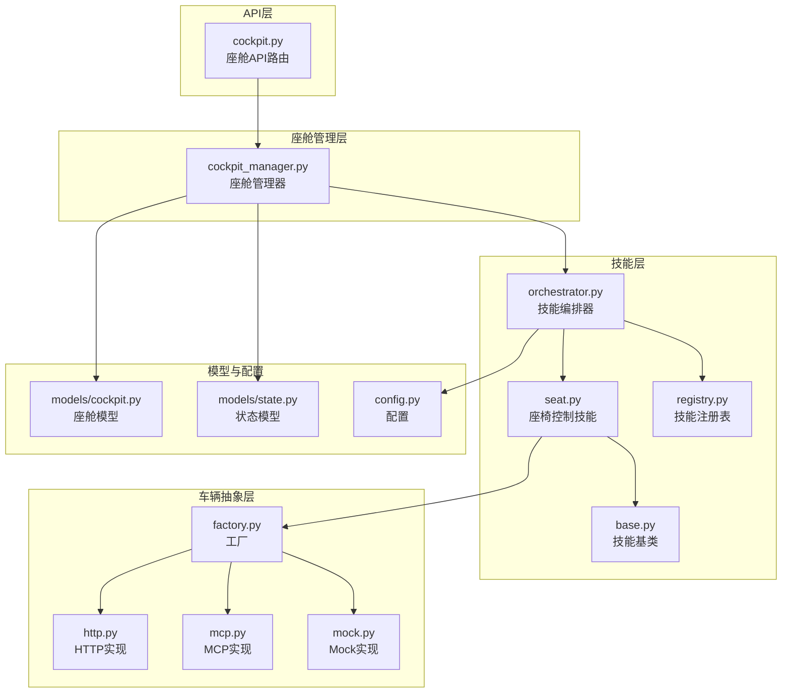
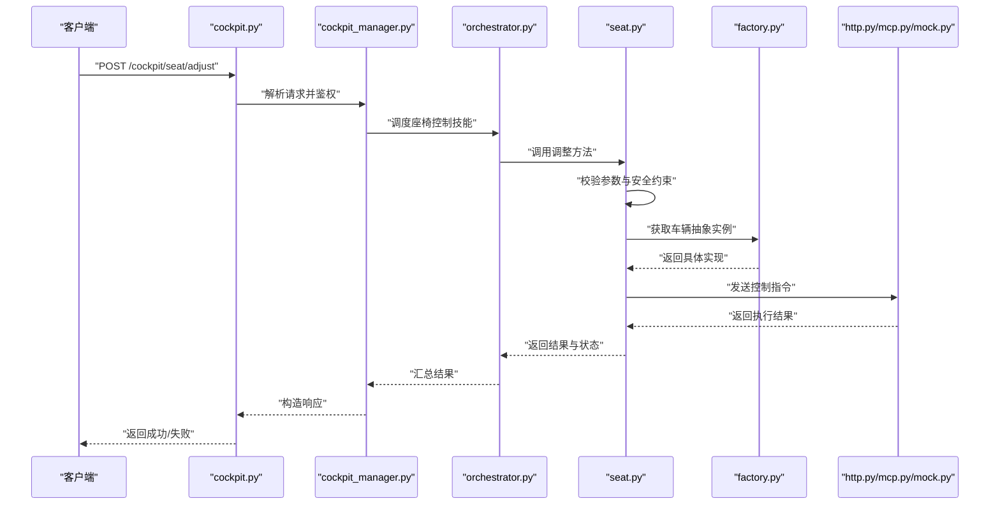
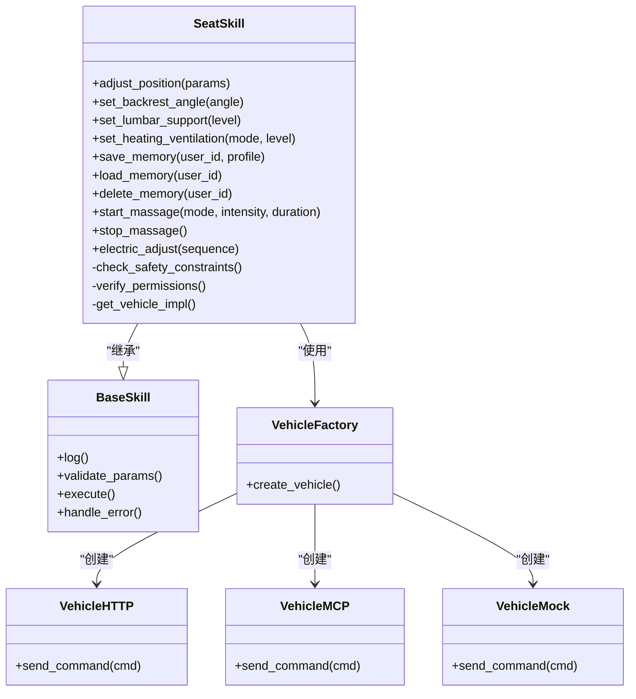
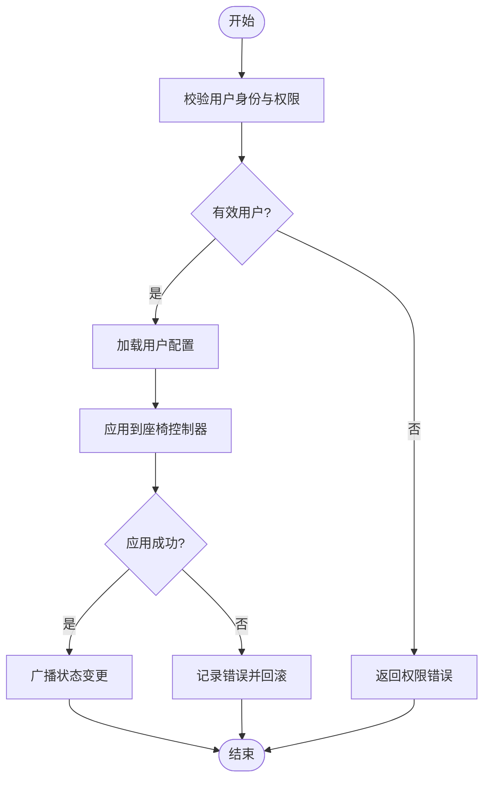
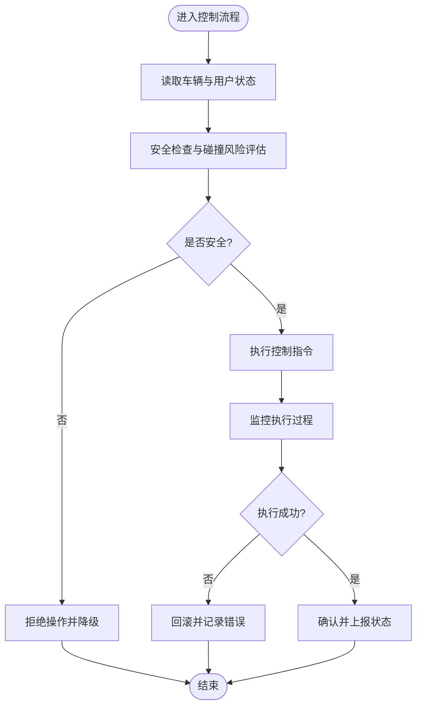
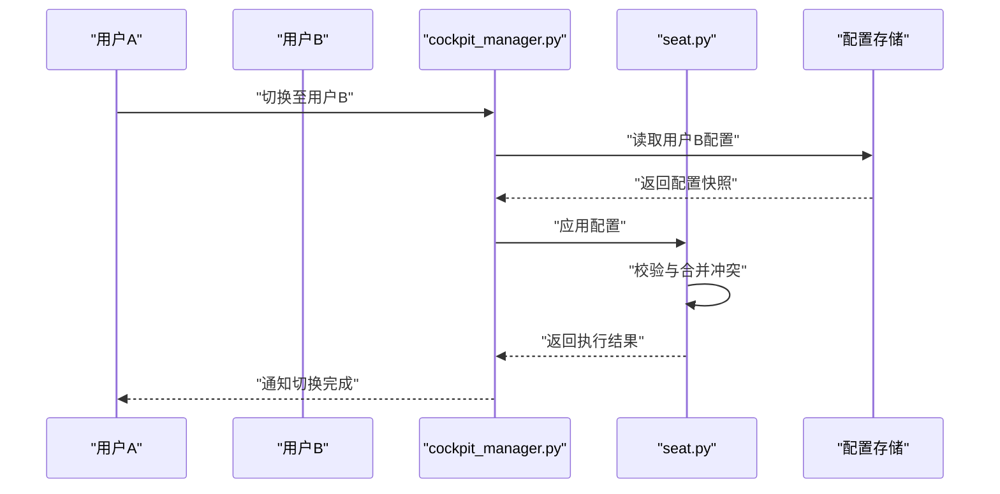
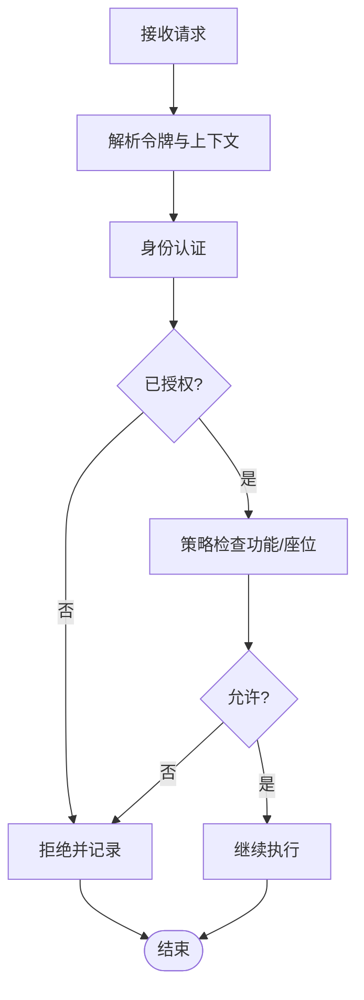
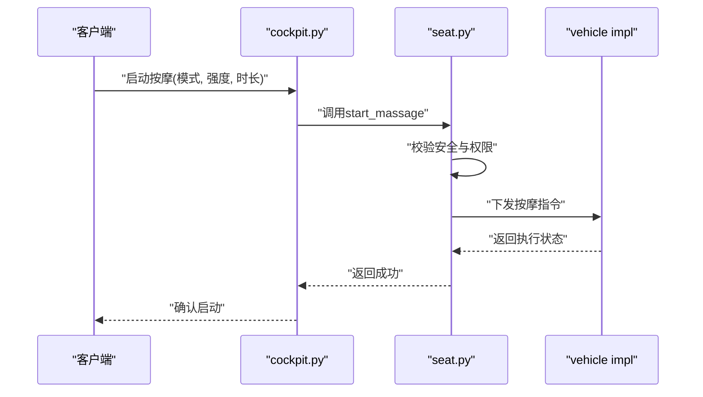
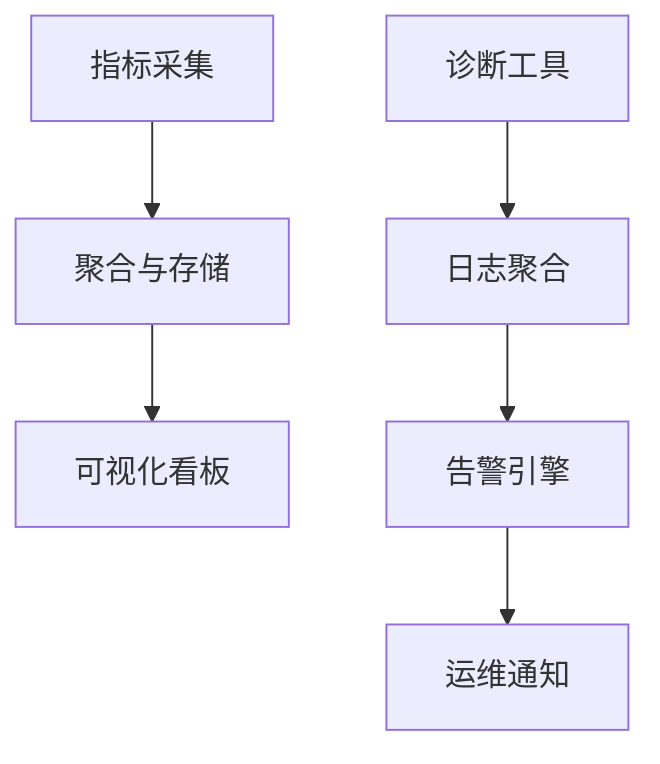
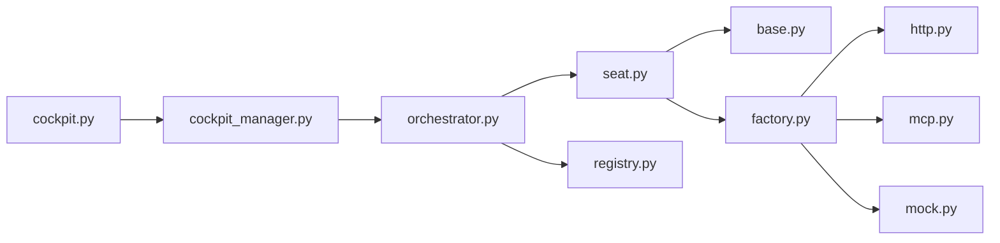

# 座椅控制技能

<cite>
**本文引用的文件**   
- [backend_design/nexus/skills/vehicle/seat.py](file://backend_design/nexus/skills/vehicle/seat.py)
- [backend_design/nexus/skills/base.py](file://backend_design/nexus/skills/base.py)
- [backend_design/nexus/skills/orchestrator.py](file://backend_design/nexus/skills/orchestrator.py)
- [backend_design/nexus/skills/registry.py](file://backend_design/nexus/skills/registry.py)
- [backend_design/nexus/vehicle/factory.py](file://backend_design/nexus/vehicle/factory.py)
- [backend_design/nexus/vehicle/http.py](file://backend_design/nexus/vehicle/http.py)
- [backend_design/nexus/vehicle/mcp.py](file://backend_design/nexus/vehicle/mcp.py)
- [backend_design/nexus/vehicle/mock.py](file://backend_design/nexus/vehicle/mock.py)
- [backend_design/nexus/api/routes/cockpit.py](file://backend_design/nexus/api/routes/cockpit.py)
- [backend_design/nexus/core/cockpit_manager.py](file://backend_design/nexus/core/cockpit_manager.py)
- [backend_design/nexus/models/cockpit.py](file://backend_design/nexus/models/cockpit.py)
- [backend_design/nexus/models/state.py](file://backend_design/nexus/models/state.py)
- [backend_design/nexus/config.py](file://backend_design/nexus/config.py)
</cite>

## 目录
1. [简介](#简介)
2. [项目结构](#项目结构)
3. [核心组件](#核心组件)
4. [架构总览](#架构总览)
5. [详细组件分析](#详细组件分析)
6. [依赖关系分析](#依赖关系分析)
7. [性能考虑](#性能考虑)
8. [故障排查指南](#故障排查指南)
9. [结论](#结论)
10. [附录](#附录)

## 简介
本技术文档聚焦于NexusCockpit的“座椅控制技能”，覆盖以下能力与主题：
- 位置调节、靠背角度、腰部支撑、加热通风等基础功能
- 座椅记忆与用户配置文件管理
- 安全限制与碰撞保护机制
- 多用户配置同步与切换逻辑
- 权限验证与安全约束
- 按摩、电动调节等高级功能的集成示例
- 状态监控与故障诊断机制

该技能位于后端技能层，通过统一的车辆抽象接口对接不同实现（HTTP/MCP/Mock），并由编排器与注册表进行生命周期与路由管理。

## 项目结构
与座椅控制相关的代码主要分布在以下模块：
- 技能定义与基类：skills/base.py、skills/vehicle/seat.py
- 技能编排与注册：skills/orchestrator.py、skills/registry.py
- 车辆抽象与实现：vehicle/factory.py、vehicle/http.py、vehicle/mcp.py、vehicle/mock.py
- API与座舱上下文：api/routes/cockpit.py、core/cockpit_manager.py
- 数据模型与状态：models/cockpit.py、models/state.py
- 配置项：config.py

图表来源
- [backend_design/nexus/api/routes/cockpit.py](file://backend_design/nexus/api/routes/cockpit.py)
- [backend_design/nexus/core/cockpit_manager.py](file://backend_design/nexus/core/cockpit_manager.py)
- [backend_design/nexus/skills/orchestrator.py](file://backend_design/nexus/skills/orchestrator.py)
- [backend_design/nexus/skills/registry.py](file://backend_design/nexus/skills/registry.py)
- [backend_design/nexus/skills/base.py](file://backend_design/nexus/skills/base.py)
- [backend_design/nexus/skills/vehicle/seat.py](file://backend_design/nexus/skills/vehicle/seat.py)
- [backend_design/nexus/vehicle/factory.py](file://backend_design/nexus/vehicle/factory.py)
- [backend_design/nexus/vehicle/http.py](file://backend_design/nexus/vehicle/http.py)
- [backend_design/nexus/vehicle/mcp.py](file://backend_design/nexus/vehicle/mcp.py)
- [backend_design/nexus/vehicle/mock.py](file://backend_design/nexus/vehicle/mock.py)
- [backend_design/nexus/models/cockpit.py](file://backend_design/nexus/models/cockpit.py)
- [backend_design/nexus/models/state.py](file://backend_design/nexus/models/state.py)
- [backend_design/nexus/config.py](file://backend_design/nexus/config.py)

章节来源
- [backend_design/nexus/skills/vehicle/seat.py](file://backend_design/nexus/skills/vehicle/seat.py)
- [backend_design/nexus/skills/base.py](file://backend_design/nexus/skills/base.py)
- [backend_design/nexus/skills/orchestrator.py](file://backend_design/nexus/skills/orchestrator.py)
- [backend_design/nexus/skills/registry.py](file://backend_design/nexus/skills/registry.py)
- [backend_design/nexus/vehicle/factory.py](file://backend_design/nexus/vehicle/factory.py)
- [backend_design/nexus/vehicle/http.py](file://backend_design/nexus/vehicle/http.py)
- [backend_design/nexus/vehicle/mcp.py](file://backend_design/nexus/vehicle/mcp.py)
- [backend_design/nexus/vehicle/mock.py](file://backend_design/nexus/vehicle/mock.py)
- [backend_design/nexus/api/routes/cockpit.py](file://backend_design/nexus/api/routes/cockpit.py)
- [backend_design/nexus/core/cockpit_manager.py](file://backend_design/nexus/core/cockpit_manager.py)
- [backend_design/nexus/models/cockpit.py](file://backend_design/nexus/models/cockpit.py)
- [backend_design/nexus/models/state.py](file://backend_design/nexus/models/state.py)
- [backend_design/nexus/config.py](file://backend_design/nexus/config.py)

## 核心组件
- 座椅控制技能（SeatSkill）
  - 职责：封装所有与座椅相关的控制能力，包括位置、靠背、腰撑、加热/通风、记忆、按摩、电动调节等。
  - 输入输出：以结构化参数对象为输入，返回执行结果与状态信息。
  - 安全与权限：在执行前校验用户身份、权限与当前车辆状态，必要时触发安全限制或拒绝操作。
  - 可观测性：记录关键事件、错误码与耗时指标，便于监控与排障。

- 技能基类（BaseSkill）
  - 提供通用能力：日志、异常处理、配置读取、上下文注入、统一响应格式等。
  - 作为所有技能的继承基类，确保一致的行为与扩展点。

- 编排器（Orchestrator）
  - 负责技能发现、调用链编排、并发控制与重试策略。
  - 将来自API的请求映射到具体技能方法，并协调跨技能协作。

- 注册表（Registry）
  - 维护技能元数据与版本信息，支持动态加载与热更新。
  - 提供按名称或标签查询技能的能力。

- 车辆抽象层（Vehicle Abstraction）
  - 工厂（Factory）：根据配置选择具体实现（HTTP/MCP/Mock）。
  - HTTP实现：通过REST/JSON与车端服务通信。
  - MCP实现：通过消息通道协议与车端交互。
  - Mock实现：用于开发与测试环境模拟。

- API与座舱管理
  - cockpit.py：暴露座舱相关API，如获取/设置座椅状态、保存/加载记忆、切换用户配置等。
  - cockpit_manager.py：维护座舱上下文（用户、会话、权限、设备状态），驱动技能执行。

- 模型与状态
  - models/cockpit.py：定义座舱实体与数据结构。
  - models/state.py：定义系统状态机与状态转换规则。

- 配置
  - config.py：集中管理运行期配置，包括超时、重试、开关、限流等。

章节来源
- [backend_design/nexus/skills/vehicle/seat.py](file://backend_design/nexus/skills/vehicle/seat.py)
- [backend_design/nexus/skills/base.py](file://backend_design/nexus/skills/base.py)
- [backend_design/nexus/skills/orchestrator.py](file://backend_design/nexus/skills/orchestrator.py)
- [backend_design/nexus/skills/registry.py](file://backend_design/nexus/skills/registry.py)
- [backend_design/nexus/vehicle/factory.py](file://backend_design/nexus/vehicle/factory.py)
- [backend_design/nexus/vehicle/http.py](file://backend_design/nexus/vehicle/http.py)
- [backend_design/nexus/vehicle/mcp.py](file://backend_design/nexus/vehicle/mcp.py)
- [backend_design/nexus/vehicle/mock.py](file://backend_design/nexus/vehicle/mock.py)
- [backend_design/nexus/api/routes/cockpit.py](file://backend_design/nexus/api/routes/cockpit.py)
- [backend_design/nexus/core/cockpit_manager.py](file://backend_design/nexus/core/cockpit_manager.py)
- [backend_design/nexus/models/cockpit.py](file://backend_design/nexus/models/cockpit.py)
- [backend_design/nexus/models/state.py](file://backend_design/nexus/models/state.py)
- [backend_design/nexus/config.py](file://backend_design/nexus/config.py)

## 架构总览
下图展示了从API到座椅控制的完整调用链路，以及各组件间的依赖关系。

图表来源
- [backend_design/nexus/api/routes/cockpit.py](file://backend_design/nexus/api/routes/cockpit.py)
- [backend_design/nexus/core/cockpit_manager.py](file://backend_design/nexus/core/cockpit_manager.py)
- [backend_design/nexus/skills/orchestrator.py](file://backend_design/nexus/skills/orchestrator.py)
- [backend_design/nexus/skills/vehicle/seat.py](file://backend_design/nexus/skills/vehicle/seat.py)
- [backend_design/nexus/vehicle/factory.py](file://backend_design/nexus/vehicle/factory.py)
- [backend_design/nexus/vehicle/http.py](file://backend_design/nexus/vehicle/http.py)
- [backend_design/nexus/vehicle/mcp.py](file://backend_design/nexus/vehicle/mcp.py)
- [backend_design/nexus/vehicle/mock.py](file://backend_design/nexus/vehicle/mock.py)

## 详细组件分析

### 座椅控制技能（SeatSkill）
- 功能范围
  - 位置调节：前后移动、高度调节、倾斜角
  - 靠背角度：角度设定与步进调节
  - 腰部支撑：支撑强度与位置调节
  - 加热/通风：档位控制与温度目标
  - 记忆：保存/加载/删除用户配置
  - 按摩：模式、强度、时长控制
  - 电动调节：组合动作与序列控制
- 安全与权限
  - 用户身份与角色校验
  - 车辆状态检查（例如行驶中禁止某些调节）
  - 碰撞保护：在检测到潜在碰撞风险时拒绝危险操作
  - 参数边界校验：防止越界与冲突指令
- 可观测性与诊断
  - 事件上报：操作开始、完成、失败
  - 指标采集：延迟、成功率、错误码分布
  - 诊断信息：最近一次错误堆栈、硬件反馈码

图表来源
- [backend_design/nexus/skills/base.py](file://backend_design/nexus/skills/base.py)
- [backend_design/nexus/skills/vehicle/seat.py](file://backend_design/nexus/skills/vehicle/seat.py)
- [backend_design/nexus/vehicle/factory.py](file://backend_design/nexus/vehicle/factory.py)
- [backend_design/nexus/vehicle/http.py](file://backend_design/nexus/vehicle/http.py)
- [backend_design/nexus/vehicle/mcp.py](file://backend_design/nexus/vehicle/mcp.py)
- [backend_design/nexus/vehicle/mock.py](file://backend_design/nexus/vehicle/mock.py)

章节来源
- [backend_design/nexus/skills/vehicle/seat.py](file://backend_design/nexus/skills/vehicle/seat.py)
- [backend_design/nexus/skills/base.py](file://backend_design/nexus/skills/base.py)
- [backend_design/nexus/vehicle/factory.py](file://backend_design/nexus/vehicle/factory.py)
- [backend_design/nexus/vehicle/http.py](file://backend_design/nexus/vehicle/http.py)
- [backend_design/nexus/vehicle/mcp.py](file://backend_design/nexus/vehicle/mcp.py)
- [backend_design/nexus/vehicle/mock.py](file://backend_design/nexus/vehicle/mock.py)

### 记忆与用户配置管理
- 保存记忆
  - 输入：用户标识、当前座椅参数快照
  - 处理：校验用户权限、写入持久化存储、返回确认
- 加载记忆
  - 输入：用户标识
  - 处理：读取配置、应用至当前座位、返回执行结果
- 删除记忆
  - 输入：用户标识
  - 处理：移除对应配置、返回确认
- 多用户切换
  - 场景：驾驶员/副驾/后排乘客
  - 逻辑：识别当前用户、加载其配置、合并冲突策略、广播状态变更

图表来源
- [backend_design/nexus/skills/vehicle/seat.py](file://backend_design/nexus/skills/vehicle/seat.py)
- [backend_design/nexus/core/cockpit_manager.py](file://backend_design/nexus/core/cockpit_manager.py)
- [backend_design/nexus/models/cockpit.py](file://backend_design/nexus/models/cockpit.py)

章节来源
- [backend_design/nexus/skills/vehicle/seat.py](file://backend_design/nexus/skills/vehicle/seat.py)
- [backend_design/nexus/core/cockpit_manager.py](file://backend_design/nexus/core/cockpit_manager.py)
- [backend_design/nexus/models/cockpit.py](file://backend_design/nexus/models/cockpit.py)

### 安全限制与碰撞保护
- 安全约束
  - 行驶中限制：禁止大幅度位置调节与复杂按摩动作
  - 边界限制：角度、位移、温度等参数的上下限
  - 冲突检测：同时多个调节指令的优先级与互斥
- 碰撞保护
  - 传感器融合：结合车速、距离、加速度等信号
  - 紧急降级：在高风险场景自动停止危险动作并恢复安全姿态
  - 告警与记录：触发告警并记录事件详情

图表来源
- [backend_design/nexus/skills/vehicle/seat.py](file://backend_design/nexus/skills/vehicle/seat.py)
- [backend_design/nexus/models/state.py](file://backend_design/nexus/models/state.py)

章节来源
- [backend_design/nexus/skills/vehicle/seat.py](file://backend_design/nexus/skills/vehicle/seat.py)
- [backend_design/nexus/models/state.py](file://backend_design/nexus/models/state.py)

### 多用户配置同步与切换逻辑
- 同步策略
  - 增量同步：仅同步差异字段，减少带宽与处理开销
  - 冲突解决：基于优先级与时间戳的策略
- 切换流程
  - 识别当前用户
  - 加载目标用户配置
  - 合并与校验
  - 应用并广播
  - 记录审计日志

图表来源
- [backend_design/nexus/core/cockpit_manager.py](file://backend_design/nexus/core/cockpit_manager.py)
- [backend_design/nexus/skills/vehicle/seat.py](file://backend_design/nexus/skills/vehicle/seat.py)
- [backend_design/nexus/models/cockpit.py](file://backend_design/nexus/models/cockpit.py)

章节来源
- [backend_design/nexus/core/cockpit_manager.py](file://backend_design/nexus/core/cockpit_manager.py)
- [backend_design/nexus/skills/vehicle/seat.py](file://backend_design/nexus/skills/vehicle/seat.py)
- [backend_design/nexus/models/cockpit.py](file://backend_design/nexus/models/cockpit.py)

### 权限验证与安全约束
- 权限模型
  - 用户角色：驾驶员、乘客、管理员
  - 资源访问：特定座位、特定功能（如按摩、记忆）
- 验证流程
  - 令牌校验与签名验证
  - 资源授权检查
  - 操作白名单与黑名单
- 安全约束
  - 最小权限原则
  - 敏感操作二次确认
  - 审计日志与不可抵赖性

图表来源
- [backend_design/nexus/api/routes/cockpit.py](file://backend_design/nexus/api/routes/cockpit.py)
- [backend_design/nexus/core/cockpit_manager.py](file://backend_design/nexus/core/cockpit_manager.py)

章节来源
- [backend_design/nexus/api/routes/cockpit.py](file://backend_design/nexus/api/routes/cockpit.py)
- [backend_design/nexus/core/cockpit_manager.py](file://backend_design/nexus/core/cockpit_manager.py)

### 高级功能集成示例（按摩、电动调节）
- 按摩
  - 模式：波浪、揉捏、敲击
  - 强度：低/中/高
  - 时长：秒级控制
  - 安全：行驶中限制强度与时长
- 电动调节
  - 序列：组合多个动作，支持并行与串行
  - 优先级：高优先级动作可中断低优先级
  - 回退：失败时回滚到上一安全状态

图表来源
- [backend_design/nexus/api/routes/cockpit.py](file://backend_design/nexus/api/routes/cockpit.py)
- [backend_design/nexus/skills/vehicle/seat.py](file://backend_design/nexus/skills/vehicle/seat.py)
- [backend_design/nexus/vehicle/http.py](file://backend_design/nexus/vehicle/http.py)
- [backend_design/nexus/vehicle/mcp.py](file://backend_design/nexus/vehicle/mcp.py)
- [backend_design/nexus/vehicle/mock.py](file://backend_design/nexus/vehicle/mock.py)

章节来源
- [backend_design/nexus/api/routes/cockpit.py](file://backend_design/nexus/api/routes/cockpit.py)
- [backend_design/nexus/skills/vehicle/seat.py](file://backend_design/nexus/skills/vehicle/seat.py)
- [backend_design/nexus/vehicle/http.py](file://backend_design/nexus/vehicle/http.py)
- [backend_design/nexus/vehicle/mcp.py](file://backend_design/nexus/vehicle/mcp.py)
- [backend_design/nexus/vehicle/mock.py](file://backend_design/nexus/vehicle/mock.py)

### 状态监控与故障诊断
- 监控指标
  - 操作成功率、平均延迟、错误码分布
  - 内存/CPU占用、队列长度、重试次数
- 诊断工具
  - 最近错误堆栈与上下文快照
  - 设备健康检查与自检报告
  - 日志聚合与检索（按用户、会话、座位）
- 告警策略
  - 阈值告警：错误率、延迟、资源使用
  - 事件告警：碰撞风险、权限违规、硬件异常

图表来源
- [backend_design/nexus/core/cockpit_manager.py](file://backend_design/nexus/core/cockpit_manager.py)
- [backend_design/nexus/skills/vehicle/seat.py](file://backend_design/nexus/skills/vehicle/seat.py)

章节来源
- [backend_design/nexus/core/cockpit_manager.py](file://backend_design/nexus/core/cockpit_manager.py)
- [backend_design/nexus/skills/vehicle/seat.py](file://backend_design/nexus/skills/vehicle/seat.py)

## 依赖关系分析
- 组件耦合
  - 座椅技能依赖车辆抽象层，屏蔽底层实现差异
  - 编排器与注册表松耦合，支持插件化扩展
- 外部依赖
  - HTTP/MCP协议与车端服务通信
  - 配置中心与运行时配置
- 循环依赖
  - 通过接口与工厂解耦，避免直接循环引用

图表来源
- [backend_design/nexus/skills/vehicle/seat.py](file://backend_design/nexus/skills/vehicle/seat.py)
- [backend_design/nexus/skills/base.py](file://backend_design/nexus/skills/base.py)
- [backend_design/nexus/vehicle/factory.py](file://backend_design/nexus/vehicle/factory.py)
- [backend_design/nexus/vehicle/http.py](file://backend_design/nexus/vehicle/http.py)
- [backend_design/nexus/vehicle/mcp.py](file://backend_design/nexus/vehicle/mcp.py)
- [backend_design/nexus/vehicle/mock.py](file://backend_design/nexus/vehicle/mock.py)
- [backend_design/nexus/api/routes/cockpit.py](file://backend_design/nexus/api/routes/cockpit.py)
- [backend_design/nexus/core/cockpit_manager.py](file://backend_design/nexus/core/cockpit_manager.py)
- [backend_design/nexus/skills/orchestrator.py](file://backend_design/nexus/skills/orchestrator.py)
- [backend_design/nexus/skills/registry.py](file://backend_design/nexus/skills/registry.py)

章节来源
- [backend_design/nexus/skills/vehicle/seat.py](file://backend_design/nexus/skills/vehicle/seat.py)
- [backend_design/nexus/skills/base.py](file://backend_design/nexus/skills/base.py)
- [backend_design/nexus/vehicle/factory.py](file://backend_design/nexus/vehicle/factory.py)
- [backend_design/nexus/vehicle/http.py](file://backend_design/nexus/vehicle/http.py)
- [backend_design/nexus/vehicle/mcp.py](file://backend_design/nexus/vehicle/mcp.py)
- [backend_design/nexus/vehicle/mock.py](file://backend_design/nexus/vehicle/mock.py)
- [backend_design/nexus/api/routes/cockpit.py](file://backend_design/nexus/api/routes/cockpit.py)
- [backend_design/nexus/core/cockpit_manager.py](file://backend_design/nexus/core/cockpit_manager.py)
- [backend_design/nexus/skills/orchestrator.py](file://backend_design/nexus/skills/orchestrator.py)
- [backend_design/nexus/skills/registry.py](file://backend_design/nexus/skills/registry.py)

## 性能考虑
- 指令批处理：合并相邻的小幅度调节指令，降低总线负载
- 异步执行：非关键路径采用异步回调，提升响应速度
- 缓存策略：用户配置本地缓存，减少远程读取开销
- 限流与熔断：对高频操作进行限流，异常时快速失败
- 资源回收：及时释放临时资源，避免内存泄漏

[本节为通用指导，不直接分析具体文件]

## 故障排查指南
- 常见问题
  - 权限不足：检查令牌与角色授权
  - 参数越界：核对输入范围与边界值
  - 通信失败：检查HTTP/MCP连接与超时配置
  - 碰撞风险：查看车辆状态与传感器数据
- 定位步骤
  - 查看最近错误日志与堆栈
  - 复现问题并抓取上下文快照
  - 使用Mock实现隔离车端问题
  - 对比健康检查与自检报告
- 恢复措施
  - 重启相关服务或重置会话
  - 回滚到上一个稳定配置
  - 升级固件或刷新车端服务

章节来源
- [backend_design/nexus/skills/vehicle/seat.py](file://backend_design/nexus/skills/vehicle/seat.py)
- [backend_design/nexus/vehicle/mock.py](file://backend_design/nexus/vehicle/mock.py)
- [backend_design/nexus/config.py](file://backend_design/nexus/config.py)

## 结论
座椅控制技能通过清晰的层次化设计与严格的权限与安全约束，提供了完整的座椅调节、记忆、按摩与电动调节能力。借助车辆抽象层，系统具备良好的可扩展性与可移植性。配合完善的监控与诊断机制，能够在复杂环境中保持稳定与可靠。

[本节为总结性内容，不直接分析具体文件]

## 附录
- 术语表
  - 座椅记忆：保存与恢复用户偏好配置
  - 碰撞保护：在潜在碰撞风险下采取的安全策略
  - 电动调节：通过电机驱动的机械调节方式
- 参考实现路径
  - 技能定义与调用：[backend_design/nexus/skills/vehicle/seat.py](file://backend_design/nexus/skills/vehicle/seat.py)
  - 车辆抽象与实现：[backend_design/nexus/vehicle/factory.py](file://backend_design/nexus/vehicle/factory.py)、[backend_design/nexus/vehicle/http.py](file://backend_design/nexus/vehicle/http.py)、[backend_design/nexus/vehicle/mcp.py](file://backend_design/nexus/vehicle/mcp.py)、[backend_design/nexus/vehicle/mock.py](file://backend_design/nexus/vehicle/mock.py)
  - API与座舱管理：[backend_design/nexus/api/routes/cockpit.py](file://backend_design/nexus/api/routes/cockpit.py)、[backend_design/nexus/core/cockpit_manager.py](file://backend_design/nexus/core/cockpit_manager.py)
  - 模型与状态：[backend_design/nexus/models/cockpit.py](file://backend_design/nexus/models/cockpit.py)、[backend_design/nexus/models/state.py](file://backend_design/nexus/models/state.py)
  - 配置项：[backend_design/nexus/config.py](file://backend_design/nexus/config.py)