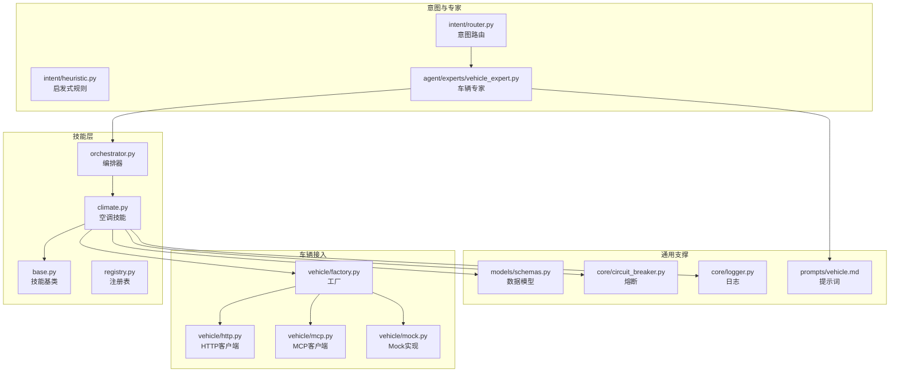
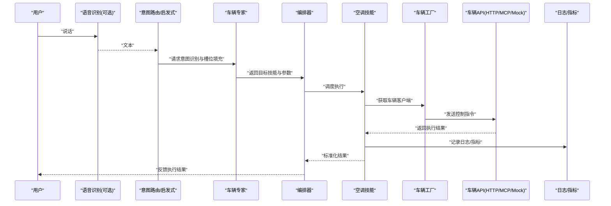
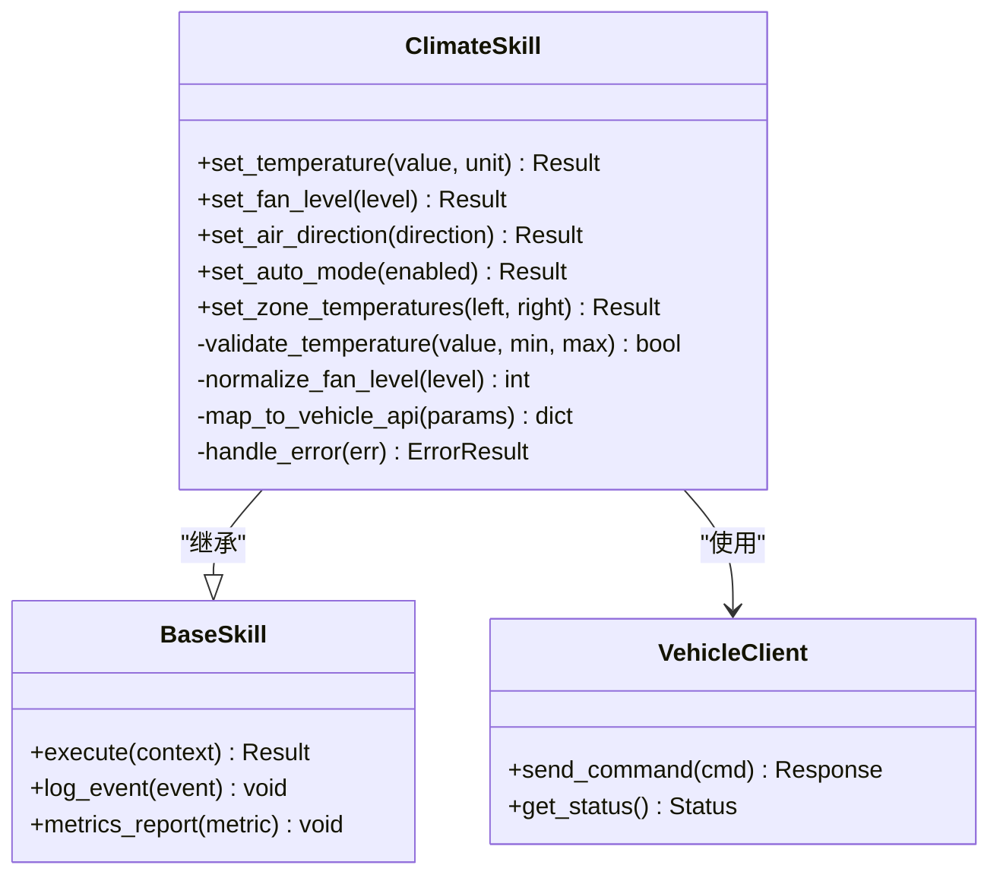
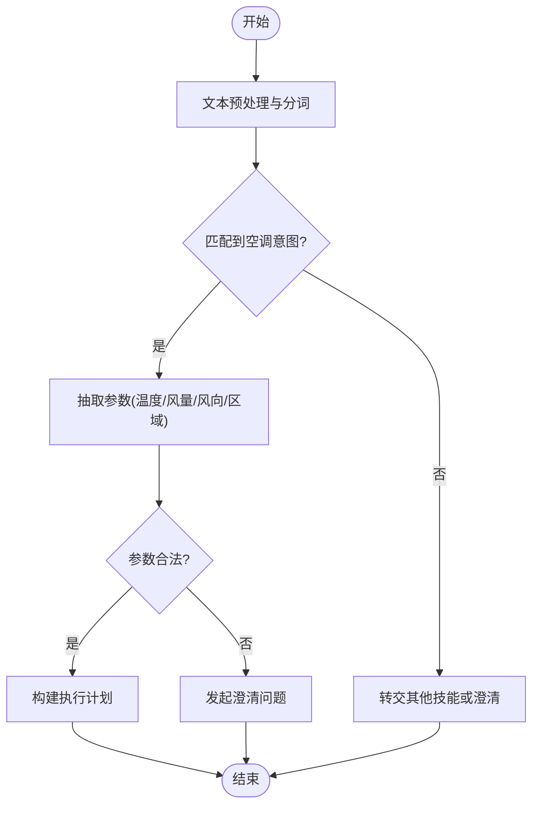
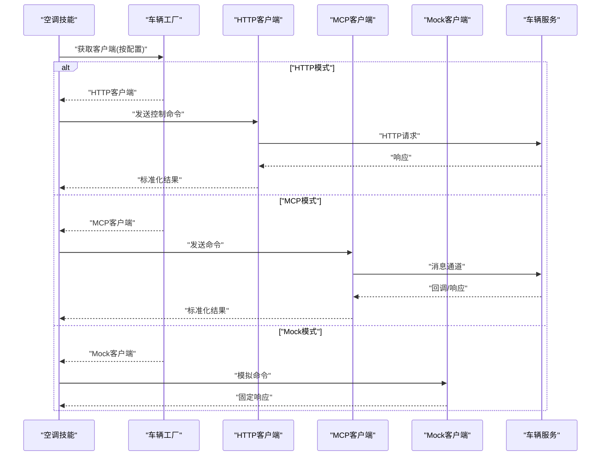
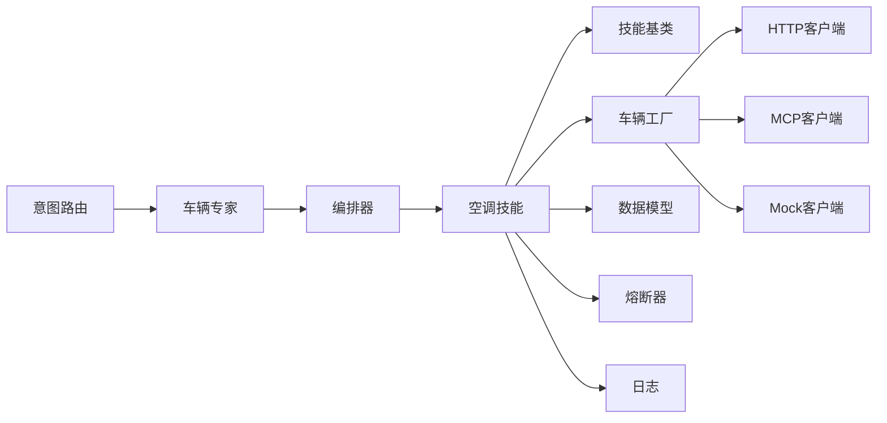

# 空调控制技能

<cite>
**本文引用的文件**   
- [backend_design/nexus/skills/vehicle/climate.py](file://backend_design/nexus/skills/vehicle/climate.py)
- [backend_design/nexus/skills/base.py](file://backend_design/nexus/skills/base.py)
- [backend_design/nexus/skills/orchestrator.py](file://backend_design/nexus/skills/orchestrator.py)
- [backend_design/nexus/skills/registry.py](file://backend_design/nexus/skills/registry.py)
- [backend_design/nexus/agent/experts/vehicle_expert.py](file://backend_design/nexus/agent/experts/vehicle_expert.py)
- [backend_design/nexus/intent/router.py](file://backend_design/nexus/intent/router.py)
- [backend_design/nexus/intent/heuristic.py](file://backend_design/nexus/intent/heuristic.py)
- [backend_design/nexus/vehicle/factory.py](file://backend_design/nexus/vehicle/factory.py)
- [backend_design/nexus/vehicle/http.py](file://backend_design/nexus/vehicle/http.py)
- [backend_design/nexus/vehicle/mcp.py](file://backend_design/nexus/vehicle/mcp.py)
- [backend_design/nexus/vehicle/mock.py](file://backend_design/nexus/vehicle/mock.py)
- [backend_design/nexus/core/circuit_breaker.py](file://backend_design/nexus/core/circuit_breaker.py)
- [backend_design/nexus/core/logger.py](file://backend_design/nexus/core/logger.py)
- [backend_design/nexus/models/schemas.py](file://backend_design/nexus/models/schemas.py)
- [backend_design/nexus/prompts/vehicle.md](file://backend_design/nexus/prompts/vehicle.md)
</cite>

## 目录
1. [简介](#简介)
2. [项目结构](#项目结构)
3. [核心组件](#核心组件)
4. [架构总览](#架构总览)
5. [详细组件分析](#详细组件分析)
6. [依赖关系分析](#依赖关系分析)
7. [性能考虑](#性能考虑)
8. [故障排查指南](#故障排查指南)
9. [结论](#结论)
10. [附录](#附录)

## 简介
本技术文档聚焦于NexusCockpit的“空调控制技能”，覆盖以下方面：
- 控制接口设计：温度调节、风量控制、风向设置、自动模式等能力
- 自然语言指令解析与参数提取机制
- 支持的温度范围、风速等级、风向选项
- 与车辆API的集成方式与数据格式转换
- 完整调用示例、错误处理策略与异常恢复机制
- 性能优化建议与用户体验改进方案

## 项目结构
围绕空调控制技能，相关代码主要分布在以下模块：
- 技能层：skills/vehicle/climate.py（空调技能实现）、skills/base.py（技能基类）、skills/orchestrator.py（编排器）、skills/registry.py（注册表）
- 意图与专家：intent/router.py、intent/heuristic.py（意图路由与启发式规则），agent/experts/vehicle_expert.py（车辆专家）
- 车辆接入：vehicle/factory.py、vehicle/http.py、vehicle/mcp.py、vehicle/mock.py（HTTP/MCP/Mock三种后端）
- 通用支撑：core/circuit_breaker.py（熔断）、core/logger.py（日志）、models/schemas.py（数据模型）、prompts/vehicle.md（提示词）

图表来源
- [backend_design/nexus/skills/vehicle/climate.py](file://backend_design/nexus/skills/vehicle/climate.py)
- [backend_design/nexus/skills/base.py](file://backend_design/nexus/skills/base.py)
- [backend_design/nexus/skills/orchestrator.py](file://backend_design/nexus/skills/orchestrator.py)
- [backend_design/nexus/skills/registry.py](file://backend_design/nexus/skills/registry.py)
- [backend_design/nexus/agent/experts/vehicle_expert.py](file://backend_design/nexus/agent/experts/vehicle_expert.py)
- [backend_design/nexus/intent/router.py](file://backend_design/nexus/intent/router.py)
- [backend_design/nexus/intent/heuristic.py](file://backend_design/nexus/intent/heuristic.py)
- [backend_design/nexus/vehicle/factory.py](file://backend_design/nexus/vehicle/factory.py)
- [backend_design/nexus/vehicle/http.py](file://backend_design/nexus/vehicle/http.py)
- [backend_design/nexus/vehicle/mcp.py](file://backend_design/nexus/vehicle/mcp.py)
- [backend_design/nexus/vehicle/mock.py](file://backend_design/nexus/vehicle/mock.py)
- [backend_design/nexus/core/circuit_breaker.py](file://backend_design/nexus/core/circuit_breaker.py)
- [backend_design/nexus/core/logger.py](file://backend_design/nexus/core/logger.py)
- [backend_design/nexus/models/schemas.py](file://backend_design/nexus/models/schemas.py)
- [backend_design/nexus/prompts/vehicle.md](file://backend_design/nexus/prompts/vehicle.md)

章节来源
- [backend_design/nexus/skills/vehicle/climate.py](file://backend_design/nexus/skills/vehicle/climate.py)
- [backend_design/nexus/skills/base.py](file://backend_design/nexus/skills/base.py)
- [backend_design/nexus/skills/orchestrator.py](file://backend_design/nexus/skills/orchestrator.py)
- [backend_design/nexus/skills/registry.py](file://backend_design/nexus/skills/registry.py)
- [backend_design/nexus/agent/experts/vehicle_expert.py](file://backend_design/nexus/agent/experts/vehicle_expert.py)
- [backend_design/nexus/intent/router.py](file://backend_design/nexus/intent/router.py)
- [backend_design/nexus/intent/heuristic.py](file://backend_design/nexus/intent/heuristic.py)
- [backend_design/nexus/vehicle/factory.py](file://backend_design/nexus/vehicle/factory.py)
- [backend_design/nexus/vehicle/http.py](file://backend_design/nexus/vehicle/http.py)
- [backend_design/nexus/vehicle/mcp.py](file://backend_design/nexus/vehicle/mcp.py)
- [backend_design/nexus/vehicle/mock.py](file://backend_design/nexus/vehicle/mock.py)
- [backend_design/nexus/core/circuit_breaker.py](file://backend_design/nexus/core/circuit_breaker.py)
- [backend_design/nexus/core/logger.py](file://backend_design/nexus/core/logger.py)
- [backend_design/nexus/models/schemas.py](file://backend_design/nexus/models/schemas.py)
- [backend_design/nexus/prompts/vehicle.md](file://backend_design/nexus/prompts/vehicle.md)

## 核心组件
- 空调技能（Climate Skill）
  - 职责：将用户意图转换为对车辆的空调控制操作；负责参数校验、边界检查、状态回写与结果反馈。
  - 关键能力：温度设定、风量调节、风向选择、自动模式开关、分区控制（如左右温区）。
- 技能基类（Base Skill）
  - 职责：提供统一的执行上下文、生命周期钩子、日志与指标上报、错误封装。
- 编排器（Orchestrator）
  - 职责：协调多个技能执行顺序、合并结果、处理并发与重试。
- 注册表（Registry）
  - 职责：维护技能清单、按名称或类型查找并实例化具体技能。
- 车辆专家（Vehicle Expert）
  - 职责：结合提示词与上下文，进行意图识别、槽位填充、澄清与确认。
- 意图路由（Intent Router & Heuristics）
  - 职责：基于规则与启发式方法将输入文本映射到目标技能与动作。
- 车辆接入（Factory/HTTP/MCP/Mock）
  - 职责：抽象车辆API访问，统一协议适配，支持多后端切换与降级。
- 通用支撑（熔断/日志/模型/提示词）
  - 职责：保障稳定性、可观测性与一致性。

章节来源
- [backend_design/nexus/skills/vehicle/climate.py](file://backend_design/nexus/skills/vehicle/climate.py)
- [backend_design/nexus/skills/base.py](file://backend_design/nexus/skills/base.py)
- [backend_design/nexus/skills/orchestrator.py](file://backend_design/nexus/skills/orchestrator.py)
- [backend_design/nexus/skills/registry.py](file://backend_design/nexus/skills/registry.py)
- [backend_design/nexus/agent/experts/vehicle_expert.py](file://backend_design/nexus/agent/experts/vehicle_expert.py)
- [backend_design/nexus/intent/router.py](file://backend_design/nexus/intent/router.py)
- [backend_design/nexus/intent/heuristic.py](file://backend_design/nexus/intent/heuristic.py)
- [backend_design/nexus/vehicle/factory.py](file://backend_design/nexus/vehicle/factory.py)
- [backend_design/nexus/vehicle/http.py](file://backend_design/nexus/vehicle/http.py)
- [backend_design/nexus/vehicle/mcp.py](file://backend_design/nexus/vehicle/mcp.py)
- [backend_design/nexus/vehicle/mock.py](file://backend_design/nexus/vehicle/mock.py)
- [backend_design/nexus/core/circuit_breaker.py](file://backend_design/nexus/core/circuit_breaker.py)
- [backend_design/nexus/core/logger.py](file://backend_design/nexus/core/logger.py)
- [backend_design/nexus/models/schemas.py](file://backend_design/nexus/models/schemas.py)
- [backend_design/nexus/prompts/vehicle.md](file://backend_design/nexus/prompts/vehicle.md)

## 架构总览
从用户语音/文本输入到车辆空调控制的端到端流程如下：

图表来源
- [backend_design/nexus/intent/router.py](file://backend_design/nexus/intent/router.py)
- [backend_design/nexus/intent/heuristic.py](file://backend_design/nexus/intent/heuristic.py)
- [backend_design/nexus/agent/experts/vehicle_expert.py](file://backend_design/nexus/agent/experts/vehicle_expert.py)
- [backend_design/nexus/skills/orchestrator.py](file://backend_design/nexus/skills/orchestrator.py)
- [backend_design/nexus/skills/vehicle/climate.py](file://backend_design/nexus/skills/vehicle/climate.py)
- [backend_design/nexus/vehicle/factory.py](file://backend_design/nexus/vehicle/factory.py)
- [backend_design/nexus/vehicle/http.py](file://backend_design/nexus/vehicle/http.py)
- [backend_design/nexus/vehicle/mcp.py](file://backend_design/nexus/vehicle/mcp.py)
- [backend_design/nexus/vehicle/mock.py](file://backend_design/nexus/vehicle/mock.py)
- [backend_design/nexus/core/logger.py](file://backend_design/nexus/core/logger.py)

## 详细组件分析

### 空调技能（Climate Skill）
- 功能要点
  - 温度调节：支持设定目标温度，包含上下限校验与单位换算。
  - 风量控制：支持多级风速档位，含最小/最大限制与无效值兜底。
  - 风向设置：支持前风挡、面部、脚部、组合等常见风向。
  - 自动模式：开启/关闭自动温控，必要时联动温度与风量。
  - 分区控制：如左右温区独立设定（取决于车型能力）。
- 参数校验与边界检查
  - 温度范围：依据车型配置或默认范围进行校验。
  - 风速等级：映射为离散档位，非法值回退至默认或最近有效值。
  - 风向选项：白名单校验，未知值拒绝并提示。
- 与车辆API的数据格式转换
  - 将领域模型（如温度、风量、风向）转换为车辆API所需的字段与枚举。
  - 对响应数据进行标准化，便于上层统一展示与后续处理。
- 错误处理与恢复
  - 网络超时/不可用：触发熔断与重试策略。
  - 参数越界：返回明确错误码与修复建议。
  - 权限/认证失败：引导重新授权或提示联系管理员。
- 可观测性
  - 记录关键步骤日志与指标（耗时、成功率、错误分类）。

图表来源
- [backend_design/nexus/skills/vehicle/climate.py](file://backend_design/nexus/skills/vehicle/climate.py)
- [backend_design/nexus/skills/base.py](file://backend_design/nexus/skills/base.py)
- [backend_design/nexus/vehicle/http.py](file://backend_design/nexus/vehicle/http.py)
- [backend_design/nexus/vehicle/mcp.py](file://backend_design/nexus/vehicle/mcp.py)
- [backend_design/nexus/vehicle/mock.py](file://backend_design/nexus/vehicle/mock.py)

章节来源
- [backend_design/nexus/skills/vehicle/climate.py](file://backend_design/nexus/skills/vehicle/climate.py)
- [backend_design/nexus/skills/base.py](file://backend_design/nexus/skills/base.py)
- [backend_design/nexus/vehicle/http.py](file://backend_design/nexus/vehicle/http.py)
- [backend_design/nexus/vehicle/mcp.py](file://backend_design/nexus/vehicle/mcp.py)
- [backend_design/nexus/vehicle/mock.py](file://backend_design/nexus/vehicle/mock.py)

### 意图解析与参数提取
- 意图路由
  - 基于关键词、正则与语义相似度，将输入映射到“空调控制”意图。
- 启发式规则
  - 针对常见口语表达（如“调高一点”、“太冷了”）进行归一化处理。
- 车辆专家
  - 结合上下文与提示词，完成槽位填充（温度、风量、风向、区域等）。
  - 在信息不足时发起澄清问题，确保执行安全与准确。
- 输出规范
  - 结构化意图对象：包含意图类型、动作、参数字典、置信度与澄清项。

图表来源
- [backend_design/nexus/intent/router.py](file://backend_design/nexus/intent/router.py)
- [backend_design/nexus/intent/heuristic.py](file://backend_design/nexus/intent/heuristic.py)
- [backend_design/nexus/agent/experts/vehicle_expert.py](file://backend_design/nexus/agent/experts/vehicle_expert.py)
- [backend_design/nexus/prompts/vehicle.md](file://backend_design/nexus/prompts/vehicle.md)

章节来源
- [backend_design/nexus/intent/router.py](file://backend_design/nexus/intent/router.py)
- [backend_design/nexus/intent/heuristic.py](file://backend_design/nexus/intent/heuristic.py)
- [backend_design/nexus/agent/experts/vehicle_expert.py](file://backend_design/nexus/agent/experts/vehicle_expert.py)
- [backend_design/nexus/prompts/vehicle.md](file://backend_design/nexus/prompts/vehicle.md)

### 车辆API集成与数据格式转换
- 工厂模式
  - 根据配置选择HTTP、MCP或Mock客户端，统一对外暴露相同接口。
- HTTP客户端
  - 负责REST调用、鉴权、重试、超时与错误码映射。
- MCP客户端
  - 通过消息通道与车辆服务交互，适合异步或事件驱动场景。
- Mock客户端
  - 用于开发与测试，模拟不同响应与异常路径。
- 数据格式转换
  - 领域模型到车辆API模型的序列化/反序列化，保证字段一致性与枚举正确性。

图表来源
- [backend_design/nexus/vehicle/factory.py](file://backend_design/nexus/vehicle/factory.py)
- [backend_design/nexus/vehicle/http.py](file://backend_design/nexus/vehicle/http.py)
- [backend_design/nexus/vehicle/mcp.py](file://backend_design/nexus/vehicle/mcp.py)
- [backend_design/nexus/vehicle/mock.py](file://backend_design/nexus/vehicle/mock.py)

章节来源
- [backend_design/nexus/vehicle/factory.py](file://backend_design/nexus/vehicle/factory.py)
- [backend_design/nexus/vehicle/http.py](file://backend_design/nexus/vehicle/http.py)
- [backend_design/nexus/vehicle/mcp.py](file://backend_design/nexus/vehicle/mcp.py)
- [backend_design/nexus/vehicle/mock.py](file://backend_design/nexus/vehicle/mock.py)

### 调用示例与错误处理
- 典型调用流程
  - 用户说：“把温度调到24度，风量三级，吹脸。”
  - 系统解析意图为“空调控制”，抽取参数：温度=24℃，风量=3级，风向=面部。
  - 编排器调度空调技能，校验参数后通过车辆工厂调用对应客户端下发指令。
  - 返回执行结果，前端或语音播报反馈给用户。
- 错误处理策略
  - 参数越界：返回错误码与修正建议（例如“温度超出允许范围，请设置为XX~XX”）。
  - 网络异常：触发熔断与指数退避重试，失败则降级到Mock或提示稍后再试。
  - 权限失败：引导重新登录或授权，记录审计日志。
- 异常恢复机制
  - 短时抖动：自动重试与缓存最近成功状态。
  - 持续失败：打开熔断器，快速失败并提示用户。
  - 部分成功：仅对失败的子任务进行补偿或回滚。

章节来源
- [backend_design/nexus/skills/vehicle/climate.py](file://backend_design/nexus/skills/vehicle/climate.py)
- [backend_design/nexus/core/circuit_breaker.py](file://backend_design/nexus/core/circuit_breaker.py)
- [backend_design/nexus/core/logger.py](file://backend_design/nexus/core/logger.py)

### 支持的能力与取值范围
- 温度调节
  - 支持摄氏度/华氏度，默认范围由车型配置决定；越界值将被拒绝并给出建议范围。
- 风量控制
  - 支持多级档位（如1~5或1~7），非法档位回退到默认或最近有效值。
- 风向设置
  - 支持前风挡、面部、脚部、组合等常见选项；未知值拒绝并提示可用选项。
- 自动模式
  - 开启后系统自动调节温度与风量以维持舒适；关闭后恢复手动控制。
- 分区控制
  - 若车型支持，可分别设定左右温区；不支持时忽略或提示。

章节来源
- [backend_design/nexus/skills/vehicle/climate.py](file://backend_design/nexus/skills/vehicle/climate.py)
- [backend_design/nexus/models/schemas.py](file://backend_design/nexus/models/schemas.py)

## 依赖关系分析
- 组件耦合
  - 空调技能依赖车辆工厂与基础技能；通过工厂解耦具体客户端实现。
  - 意图路由与车辆专家共同决定执行路径，降低硬编码耦合。
- 外部依赖
  - HTTP/MCP客户端依赖网络与远端服务；Mock用于本地验证。
- 潜在循环依赖
  - 通过分层与接口隔离避免循环引用；工厂与注册表作为装配点。
- 接口契约
  - 车辆客户端统一接口定义，确保替换实现不影响上层逻辑。

图表来源
- [backend_design/nexus/intent/router.py](file://backend_design/nexus/intent/router.py)
- [backend_design/nexus/agent/experts/vehicle_expert.py](file://backend_design/nexus/agent/experts/vehicle_expert.py)
- [backend_design/nexus/skills/orchestrator.py](file://backend_design/nexus/skills/orchestrator.py)
- [backend_design/nexus/skills/vehicle/climate.py](file://backend_design/nexus/skills/vehicle/climate.py)
- [backend_design/nexus/skills/base.py](file://backend_design/nexus/skills/base.py)
- [backend_design/nexus/vehicle/factory.py](file://backend_design/nexus/vehicle/factory.py)
- [backend_design/nexus/vehicle/http.py](file://backend_design/nexus/vehicle/http.py)
- [backend_design/nexus/vehicle/mcp.py](file://backend_design/nexus/vehicle/mcp.py)
- [backend_design/nexus/vehicle/mock.py](file://backend_design/nexus/vehicle/mock.py)
- [backend_design/nexus/models/schemas.py](file://backend_design/nexus/models/schemas.py)
- [backend_design/nexus/core/circuit_breaker.py](file://backend_design/nexus/core/circuit_breaker.py)
- [backend_design/nexus/core/logger.py](file://backend_design/nexus/core/logger.py)

章节来源
- [backend_design/nexus/intent/router.py](file://backend_design/nexus/intent/router.py)
- [backend_design/nexus/agent/experts/vehicle_expert.py](file://backend_design/nexus/agent/experts/vehicle_expert.py)
- [backend_design/nexus/skills/orchestrator.py](file://backend_design/nexus/skills/orchestrator.py)
- [backend_design/nexus/skills/vehicle/climate.py](file://backend_design/nexus/skills/vehicle/climate.py)
- [backend_design/nexus/skills/base.py](file://backend_design/nexus/skills/base.py)
- [backend_design/nexus/vehicle/factory.py](file://backend_design/nexus/vehicle/factory.py)
- [backend_design/nexus/vehicle/http.py](file://backend_design/nexus/vehicle/http.py)
- [backend_design/nexus/vehicle/mcp.py](file://backend_design/nexus/vehicle/mcp.py)
- [backend_design/nexus/vehicle/mock.py](file://backend_design/nexus/vehicle/mock.py)
- [backend_design/nexus/models/schemas.py](file://backend_design/nexus/models/schemas.py)
- [backend_design/nexus/core/circuit_breaker.py](file://backend_design/nexus/core/circuit_breaker.py)
- [backend_design/nexus/core/logger.py](file://backend_design/nexus/core/logger.py)

## 性能考虑
- 减少不必要的网络往返
  - 批量操作合并（如同时设置温度与风量）。
  - 使用缓存保存最近成功状态，避免重复下发。
- 超时与重试
  - 合理设置超时阈值与重试次数，采用指数退避与抖动。
- 熔断与降级
  - 连续失败时快速失败，保护上游资源；降级到Mock或只读查询。
- 日志与指标
  - 精简日志内容，避免高频打印；关键路径埋点耗时与错误率。
- 前端体验
  - 乐观更新UI，失败再回滚；提供明确的进度与错误提示。

[本节为通用指导，不直接分析具体文件]

## 故障排查指南
- 常见问题定位
  - 参数错误：检查温度范围、风量档位、风向选项是否合法。
  - 网络异常：查看HTTP/MCP客户端日志，确认鉴权、超时与重试策略。
  - 权限问题：确认会话令牌有效，必要时重新授权。
- 诊断工具
  - 启用调试日志，关注关键步骤的时间戳与错误堆栈。
  - 使用Mock客户端复现问题，隔离外部依赖影响。
- 恢复措施
  - 重启服务或重置熔断器状态。
  - 清理过期会话与缓存，重新建立连接。

章节来源
- [backend_design/nexus/core/logger.py](file://backend_design/nexus/core/logger.py)
- [backend_design/nexus/core/circuit_breaker.py](file://backend_design/nexus/core/circuit_breaker.py)
- [backend_design/nexus/vehicle/mock.py](file://backend_design/nexus/vehicle/mock.py)

## 结论
空调控制技能通过清晰的层次结构与模块化设计，实现了从自然语言到车辆控制的稳定链路。借助意图路由、车辆专家与工厂模式，系统在可扩展性与健壮性上具备良好表现。配合熔断、重试与完善的日志指标，能够在复杂环境下保持高可用。未来可进一步优化参数校验与用户提示，提升整体体验。

[本节为总结，不直接分析具体文件]

## 附录
- 术语说明
  - 意图：用户对系统行为的描述，如“空调控制”。
  - 槽位：意图中的关键参数，如温度、风量、风向。
  - 熔断：当错误率超过阈值时快速失败，防止雪崩。
- 参考文件
  - 数据模型：models/schemas.py
  - 提示词：prompts/vehicle.md

[本节为补充信息，不直接分析具体文件]