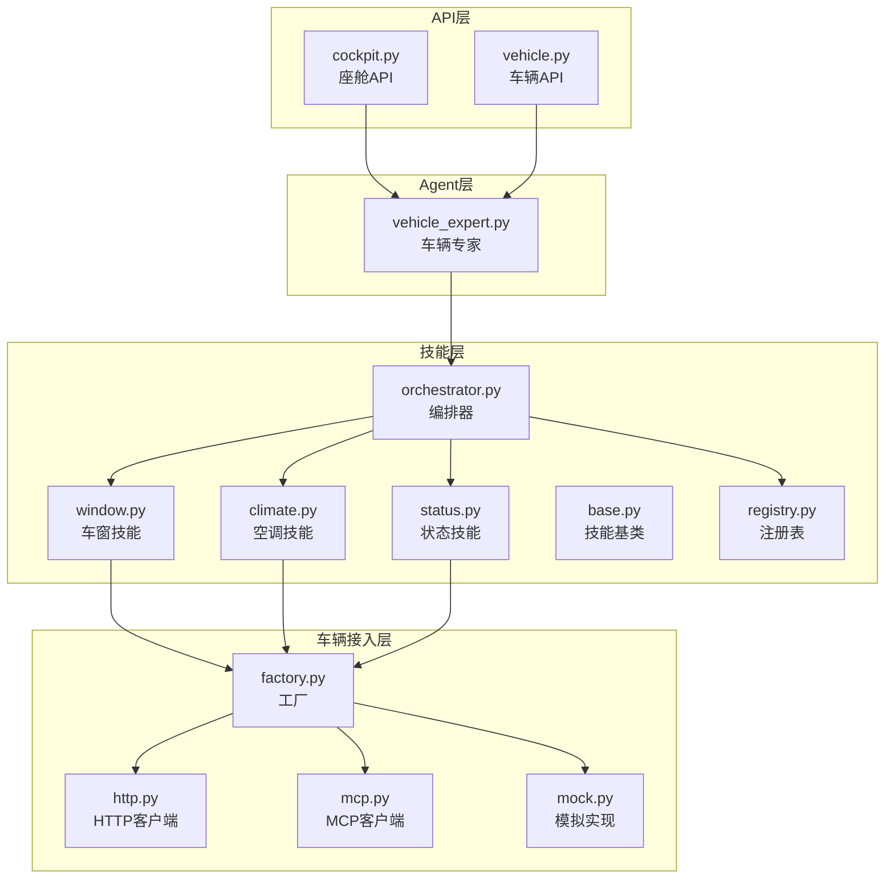
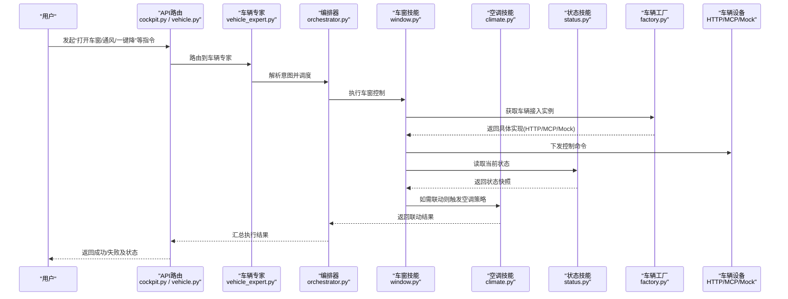
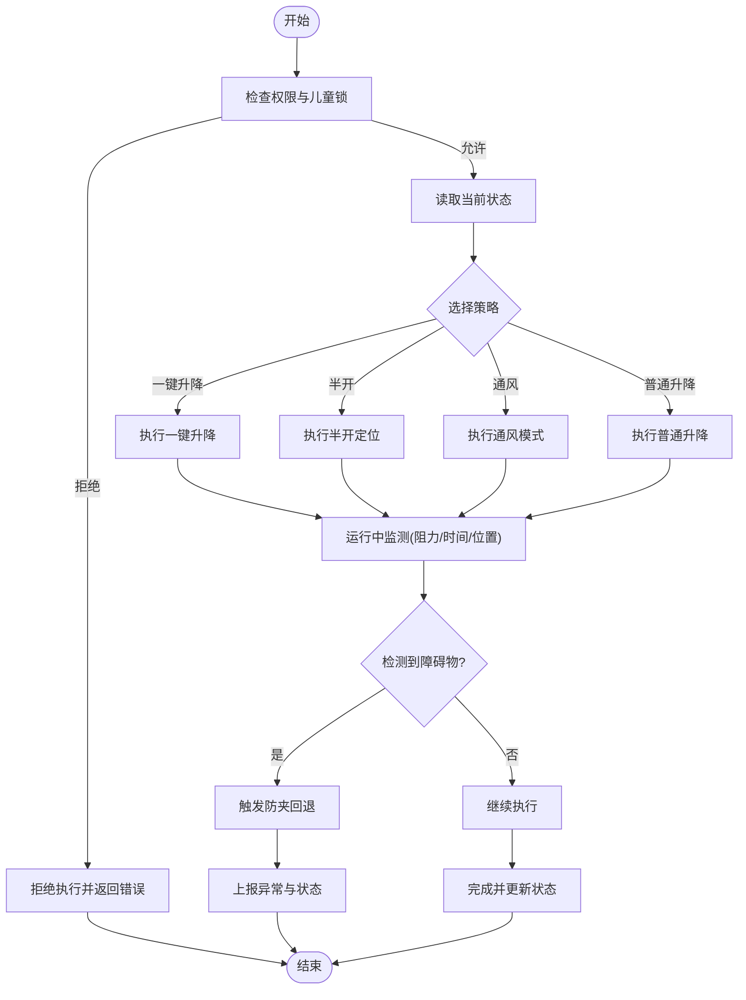
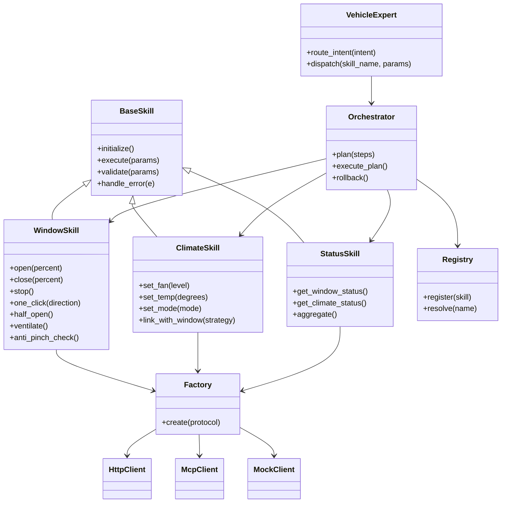

# 车窗控制技能

<cite>
**本文引用的文件**   
- [backend_design/nexus/skills/vehicle/window.py](file://backend_design/nexus/skills/vehicle/window.py)
- [backend_design/nexus/skills/vehicle/climate.py](file://backend_design/nexus/skills/vehicle/climate.py)
- [backend_design/nexus/skills/vehicle/status.py](file://backend_design/nexus/skills/vehicle/status.py)
- [backend_design/nexus/skills/base.py](file://backend_design/nexus/skills/base.py)
- [backend_design/nexus/skills/orchestrator.py](file://backend_design/nexus/skills/orchestrator.py)
- [backend_design/nexus/skills/registry.py](file://backend_design/nexus/skills/registry.py)
- [backend_design/nexus/agent/experts/vehicle_expert.py](file://backend_design/nexus/agent/experts/vehicle_expert.py)
- [backend_design/nexus/api/routes/cockpit.py](file://backend_design/nexus/api/routes/cockpit.py)
- [backend_design/nexus/api/routes/vehicle.py](file://backend_design/nexus/api/routes/vehicle.py)
- [backend_design/nexus/vehicle/factory.py](file://backend_design/nexus/vehicle/factory.py)
- [backend_design/nexus/vehicle/http.py](file://backend_design/nexus/vehicle/http.py)
- [backend_design/nexus/vehicle/mcp.py](file://backend_design/nexus/vehicle/mcp.py)
- [backend_design/nexus/vehicle/mock.py](file://backend_design/nexus/vehicle/mock.py)
</cite>

## 目录
1. [简介](#简介)
2. [项目结构](#项目结构)
3. [核心组件](#核心组件)
4. [架构总览](#架构总览)
5. [详细组件分析](#详细组件分析)
6. [依赖关系分析](#依赖关系分析)
7. [性能考虑](#性能考虑)
8. [故障诊断与排障指南](#故障诊断与排障指南)
9. [结论](#结论)
10. [附录](#附录)

## 简介
本技术文档面向NexusCockpit的车窗控制技能，覆盖以下能力：
- 车窗升降、天窗控制、遮阳板调节
- 防夹手安全机制与障碍物检测
- 状态监控与故障诊断
- 一键升降、半开模式、通风模式等智能策略
- 与空调系统的联动控制逻辑
- 权限管理与儿童锁
- 安全规范与法规要求

该文档以代码仓库中的实际实现为依据，结合架构图与流程图帮助读者快速理解系统设计与运行机制。

## 项目结构
与车窗控制相关的核心代码位于后端设计目录的skills/vehicle与vehicle子系统中，并通过API路由暴露给上层Agent与前端。关键路径如下：
- 技能层：window.py（车窗）、climate.py（空调）、status.py（状态）
- 技能编排与注册：orchestrator.py、registry.py、base.py
- Agent侧：vehicle_expert.py
- API层：cockpit.py、vehicle.py
- 车辆接入层：factory.py、http.py、mcp.py、mock.py

图示来源
- [backend_design/nexus/skills/vehicle/window.py](file://backend_design/nexus/skills/vehicle/window.py)
- [backend_design/nexus/skills/vehicle/climate.py](file://backend_design/nexus/skills/vehicle/climate.py)
- [backend_design/nexus/skills/vehicle/status.py](file://backend_design/nexus/skills/vehicle/status.py)
- [backend_design/nexus/skills/base.py](file://backend_design/nexus/skills/base.py)
- [backend_design/nexus/skills/orchestrator.py](file://backend_design/nexus/skills/orchestrator.py)
- [backend_design/nexus/skills/registry.py](file://backend_design/nexus/skills/registry.py)
- [backend_design/nexus/agent/experts/vehicle_expert.py](file://backend_design/nexus/agent/experts/vehicle_expert.py)
- [backend_design/nexus/api/routes/cockpit.py](file://backend_design/nexus/api/routes/cockpit.py)
- [backend_design/nexus/api/routes/vehicle.py](file://backend_design/nexus/api/routes/vehicle.py)
- [backend_design/nexus/vehicle/factory.py](file://backend_design/nexus/vehicle/factory.py)
- [backend_design/nexus/vehicle/http.py](file://backend_design/nexus/vehicle/http.py)
- [backend_design/nexus/vehicle/mcp.py](file://backend_design/nexus/nexus/vehicle/mcp.py)
- [backend_design/nexus/vehicle/mock.py](file://backend_design/nexus/vehicle/mock.py)

章节来源
- [backend_design/nexus/skills/vehicle/window.py](file://backend_design/nexus/skills/vehicle/window.py)
- [backend_design/nexus/skills/vehicle/climate.py](file://backend_design/nexus/skills/vehicle/climate.py)
- [backend_design/nexus/skills/vehicle/status.py](file://backend_design/nexus/skills/vehicle/status.py)
- [backend_design/nexus/skills/base.py](file://backend_design/nexus/skills/base.py)
- [backend_design/nexus/skills/orchestrator.py](file://backend_design/nexus/skills/orchestrator.py)
- [backend_design/nexus/skills/registry.py](file://backend_design/nexus/skills/registry.py)
- [backend_design/nexus/agent/experts/vehicle_expert.py](file://backend_design/nexus/agent/experts/vehicle_expert.py)
- [backend_design/nexus/api/routes/cockpit.py](file://backend_design/nexus/api/routes/cockpit.py)
- [backend_design/nexus/api/routes/vehicle.py](file://backend_design/nexus/api/routes/vehicle.py)
- [backend_design/nexus/vehicle/factory.py](file://backend_design/nexus/vehicle/factory.py)
- [backend_design/nexus/vehicle/http.py](file://backend_design/nexus/vehicle/http.py)
- [backend_design/nexus/vehicle/mcp.py](file://backend_design/nexus/vehicle/mcp.py)
- [backend_design/nexus/vehicle/mock.py](file://backend_design/nexus/vehicle/mock.py)

## 核心组件
- 车窗技能（window.py）
  - 负责车窗/天窗/遮阳板的控制指令解析与执行，包含一键升降、半开、通风等策略，以及防夹与障碍物检测流程。
- 空调技能（climate.py）
  - 提供空调相关控制接口，用于与车窗进行联动（如自动通风、温度/空气质量协同）。
- 状态技能（status.py）
  - 聚合并上报车窗、天窗、遮阳板的状态信息，支撑监控与诊断。
- 技能基类（base.py）
  - 定义技能的通用生命周期、参数校验、错误处理与日志记录等基础能力。
- 编排器（orchestrator.py）
  - 协调多个技能协作执行，管理调用顺序与并发。
- 注册表（registry.py）
  - 维护技能发现与加载机制，支持动态扩展。
- 车辆专家（vehicle_expert.py）
  - 在Agent侧对车辆相关意图进行识别与分发，将请求委派至对应技能。
- API路由（cockpit.py、vehicle.py）
  - 对外暴露座舱与车辆控制接口，承载鉴权、限流、审计等横切关注点。
- 车辆接入层（factory.py、http.py、mcp.py、mock.py）
  - 抽象车辆通信协议，统一通过工厂选择具体实现（HTTP/MCP/模拟），屏蔽底层差异。

章节来源
- [backend_design/nexus/skills/vehicle/window.py](file://backend_design/nexus/skills/vehicle/window.py)
- [backend_design/nexus/skills/vehicle/climate.py](file://backend_design/nexus/skills/vehicle/climate.py)
- [backend_design/nexus/skills/vehicle/status.py](file://backend_design/nexus/skills/vehicle/status.py)
- [backend_design/nexus/skills/base.py](file://backend_design/nexus/skills/base.py)
- [backend_design/nexus/skills/orchestrator.py](file://backend_design/nexus/skills/orchestrator.py)
- [backend_design/nexus/skills/registry.py](file://backend_design/nexus/skills/registry.py)
- [backend_design/nexus/agent/experts/vehicle_expert.py](file://backend_design/nexus/agent/experts/vehicle_expert.py)
- [backend_design/nexus/api/routes/cockpit.py](file://backend_design/nexus/api/routes/cockpit.py)
- [backend_design/nexus/api/routes/vehicle.py](file://backend_design/nexus/api/routes/vehicle.py)
- [backend_design/nexus/vehicle/factory.py](file://backend_design/nexus/vehicle/factory.py)
- [backend_design/nexus/vehicle/http.py](file://backend_design/nexus/vehicle/http.py)
- [backend_design/nexus/vehicle/mcp.py](file://backend_design/nexus/vehicle/mcp.py)
- [backend_design/nexus/vehicle/mock.py](file://backend_design/nexus/vehicle/mock.py)

## 架构总览
从用户语音或界面输入到车窗动作执行的端到端流程如下：

图示来源
- [backend_design/nexus/api/routes/cockpit.py](file://backend_design/nexus/api/routes/cockpit.py)
- [backend_design/nexus/api/routes/vehicle.py](file://backend_design/nexus/api/routes/vehicle.py)
- [backend_design/nexus/agent/experts/vehicle_expert.py](file://backend_design/nexus/agent/experts/vehicle_expert.py)
- [backend_design/nexus/skills/orchestrator.py](file://backend_design/nexus/skills/orchestrator.py)
- [backend_design/nexus/skills/vehicle/window.py](file://backend_design/nexus/skills/vehicle/window.py)
- [backend_design/nexus/skills/vehicle/climate.py](file://backend_design/nexus/skills/vehicle/climate.py)
- [backend_design/nexus/skills/vehicle/status.py](file://backend_design/nexus/skills/vehicle/status.py)
- [backend_design/nexus/vehicle/factory.py](file://backend_design/nexus/vehicle/factory.py)
- [backend_design/nexus/vehicle/http.py](file://backend_design/nexus/vehicle/http.py)
- [backend_design/nexus/vehicle/mcp.py](file://backend_design/nexus/vehicle/mcp.py)
- [backend_design/nexus/vehicle/mock.py](file://backend_design/nexus/vehicle/mock.py)

## 详细组件分析

### 车窗技能（window.py）
- 功能范围
  - 车窗/天窗/遮阳板控制：升、降、停止、定位（百分比）、一键升降、半开、通风模式
  - 防夹手与障碍物检测：运行中监测阻力/电流/时间阈值，遇阻回退
  - 状态同步：上报位置、速度、异常码、健康状态
  - 联动策略：与空调配合实现自动通风、除雾、温度均衡
- 关键流程（防夹与障碍物检测）

图示来源
- [backend_design/nexus/skills/vehicle/window.py](file://backend_design/nexus/skills/vehicle/window.py)
- [backend_design/nexus/skills/vehicle/status.py](file://backend_design/nexus/skills/vehicle/status.py)
- [backend_design/nexus/skills/vehicle/climate.py](file://backend_design/nexus/skills/vehicle/climate.py)

章节来源
- [backend_design/nexus/skills/vehicle/window.py](file://backend_design/nexus/skills/vehicle/window.py)
- [backend_design/nexus/skills/vehicle/status.py](file://backend_design/nexus/skills/vehicle/status.py)
- [backend_design/nexus/skills/vehicle/climate.py](file://backend_design/nexus/skills/vehicle/climate.py)

### 空调技能（climate.py）
- 功能范围
  - 风量、温度、风向、内外循环、除雾、空气净化等控制
  - 与车窗联动：根据环境温湿度、空气质量、乘员舒适度策略自动调节
- 联动示例
  - 通风模式：开窗一定角度+开启外循环+低风量
  - 除雾模式：关闭部分车窗+提高风量+调整风向
  - 温度均衡：根据各区域温度差微调空调输出

章节来源
- [backend_design/nexus/skills/vehicle/climate.py](file://backend_design/nexus/skills/vehicle/climate.py)

### 状态技能（status.py）
- 功能范围
  - 聚合车窗、天窗、遮阳板、空调等子系统状态
  - 提供查询接口供上层展示与诊断
- 典型字段
  - 位置（百分比）、速度、目标位置、异常码、健康状态、更新时间戳

章节来源
- [backend_design/nexus/skills/vehicle/status.py](file://backend_design/nexus/skills/vehicle/status.py)

### 技能基类（base.py）
- 职责
  - 定义技能通用方法：初始化、参数校验、日志、错误封装、重试/超时策略
  - 为window/climate/status等提供一致的行为契约

章节来源
- [backend_design/nexus/skills/base.py](file://backend_design/nexus/skills/base.py)

### 编排器（orchestrator.py）
- 职责
  - 多技能协作编排：按依赖顺序执行、并行优化、事务性回滚（若需要）
  - 与注册表交互，动态发现并加载技能

章节来源
- [backend_design/nexus/skills/orchestrator.py](file://backend_design/nexus/skills/orchestrator.py)
- [backend_design/nexus/skills/registry.py](file://backend_design/nexus/skills/registry.py)

### 车辆专家（vehicle_expert.py）
- 职责
  - 在Agent侧识别车辆相关意图，将请求分派到相应技能（车窗/空调/状态等）
  - 与API路由对接，形成统一的入口

章节来源
- [backend_design/nexus/agent/experts/vehicle_expert.py](file://backend_design/nexus/agent/experts/vehicle_expert.py)

### API路由（cockpit.py、vehicle.py）
- 职责
  - 暴露REST/WebSocket接口，承载鉴权、限流、审计、错误码标准化
  - 将请求转发至车辆专家与编排器

章节来源
- [backend_design/nexus/api/routes/cockpit.py](file://backend_design/nexus/api/routes/cockpit.py)
- [backend_design/nexus/api/routes/vehicle.py](file://backend_design/nexus/api/routes/vehicle.py)

### 车辆接入层（factory.py、http.py、mcp.py、mock.py）
- 职责
  - 通过工厂选择具体通信实现（HTTP/MCP/Mock），屏蔽协议差异
  - 提供统一的控制与状态查询接口

章节来源
- [backend_design/nexus/vehicle/factory.py](file://backend_design/nexus/vehicle/factory.py)
- [backend_design/nexus/vehicle/http.py](file://backend_design/nexus/vehicle/http.py)
- [backend_design/nexus/vehicle/mcp.py](file://backend_design/nexus/vehicle/mcp.py)
- [backend_design/nexus/vehicle/mock.py](file://backend_design/nexus/vehicle/mock.py)

## 依赖关系分析
- 耦合与内聚
  - window/climate/status均继承自base，具备高内聚；通过orchestrator解耦多技能协作
  - 车辆接入层通过factory抽象，降低与上层耦合
- 外部依赖
  - HTTP/MCP为外部设备通信协议；Mock用于测试与开发
- 潜在环依赖
  - 通过注册表与编排器避免直接循环导入

图示来源
- [backend_design/nexus/skills/base.py](file://backend_design/nexus/skills/base.py)
- [backend_design/nexus/skills/vehicle/window.py](file://backend_design/nexus/skills/vehicle/window.py)
- [backend_design/nexus/skills/vehicle/climate.py](file://backend_design/nexus/skills/vehicle/climate.py)
- [backend_design/nexus/skills/vehicle/status.py](file://backend_design/nexus/skills/vehicle/status.py)
- [backend_design/nexus/skills/orchestrator.py](file://backend_design/nexus/skills/orchestrator.py)
- [backend_design/nexus/skills/registry.py](file://backend_design/nexus/skills/registry.py)
- [backend_design/nexus/agent/experts/vehicle_expert.py](file://backend_design/nexus/agent/experts/vehicle_expert.py)
- [backend_design/nexus/vehicle/factory.py](file://backend_design/nexus/vehicle/factory.py)
- [backend_design/nexus/vehicle/http.py](file://backend_design/nexus/vehicle/http.py)
- [backend_design/nexus/vehicle/mcp.py](file://backend_design/nexus/vehicle/mcp.py)
- [backend_design/nexus/vehicle/mock.py](file://backend_design/nexus/vehicle/mock.py)

章节来源
- [backend_design/nexus/skills/base.py](file://backend_design/nexus/skills/base.py)
- [backend_design/nexus/skills/vehicle/window.py](file://backend_design/nexus/skills/vehicle/window.py)
- [backend_design/nexus/skills/vehicle/climate.py](file://backend_design/nexus/skills/vehicle/climate.py)
- [backend_design/nexus/skills/vehicle/status.py](file://backend_design/nexus/skills/vehicle/status.py)
- [backend_design/nexus/skills/orchestrator.py](file://backend_design/nexus/skills/orchestrator.py)
- [backend_design/nexus/skills/registry.py](file://backend_design/nexus/skills/registry.py)
- [backend_design/nexus/agent/experts/vehicle_expert.py](file://backend_design/nexus/agent/experts/vehicle_expert.py)
- [backend_design/nexus/vehicle/factory.py](file://backend_design/nexus/vehicle/factory.py)
- [backend_design/nexus/vehicle/http.py](file://backend_design/nexus/vehicle/http.py)
- [backend_design/nexus/vehicle/mcp.py](file://backend_design/nexus/vehicle/mcp.py)
- [backend_design/nexus/vehicle/mock.py](file://backend_design/nexus/vehicle/mock.py)

## 性能考虑
- 控制命令去抖与合并：高频指令应合并或节流，避免频繁下发导致总线拥塞
- 状态轮询与事件驱动：优先采用事件推送减少轮询开销
- 防夹检测采样频率：在保证实时性的前提下平衡CPU与总线负载
- 缓存与预取：常用状态可短期缓存，减少重复查询
- 超时与重试：对网络不稳定场景设置合理超时与重试上限，避免雪崩

[本节为通用指导，不直接分析具体文件]

## 故障诊断与排障指南
- 常见问题
  - 权限不足：检查用户角色与会话上下文
  - 儿童锁启用：需解锁后方可执行
  - 设备离线：切换至Mock或检查HTTP/MCP连接
  - 防夹误触发：检查传感器数据与阈值配置
- 诊断步骤
  - 查看状态技能聚合结果，确认各子系统健康度
  - 核对API层日志与错误码，定位失败阶段
  - 使用Mock验证控制链路是否可达
  - 逐步缩小范围：先单控再联动

章节来源
- [backend_design/nexus/skills/vehicle/status.py](file://backend_design/nexus/skills/vehicle/status.py)
- [backend_design/nexus/api/routes/cockpit.py](file://backend_design/nexus/api/routes/cockpit.py)
- [backend_design/nexus/api/routes/vehicle.py](file://backend_design/nexus/api/routes/vehicle.py)
- [backend_design/nexus/vehicle/mock.py](file://backend_design/nexus/vehicle/mock.py)

## 结论
车窗控制技能通过清晰的层次化设计与解耦的接入层，实现了可控、可扩展且安全的车窗管理能力。结合防夹与状态监控，系统在用户体验与安全合规之间取得良好平衡。建议在生产环境中完善遥测与告警，持续优化联动策略与性能指标。

[本节为总结性内容，不直接分析具体文件]

## 附录
- 术语
  - 一键升降：单次指令完成全开/全关
  - 半开模式：固定小角度开窗，兼顾通风与隐私
  - 通风模式：与空调联动，维持空气流通与舒适温度
- 安全与法规要点
  - 防夹力与回退距离符合相关标准
  - 儿童锁与权限控制确保操作受控
  - 状态上报与审计满足可追溯性要求

[本节为概念性补充，不直接分析具体文件]