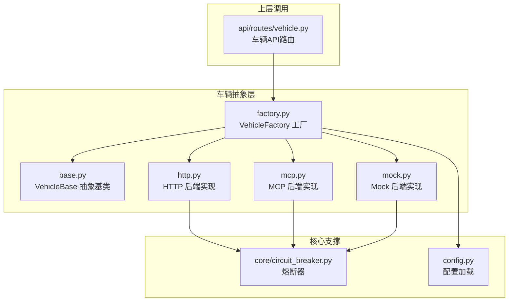
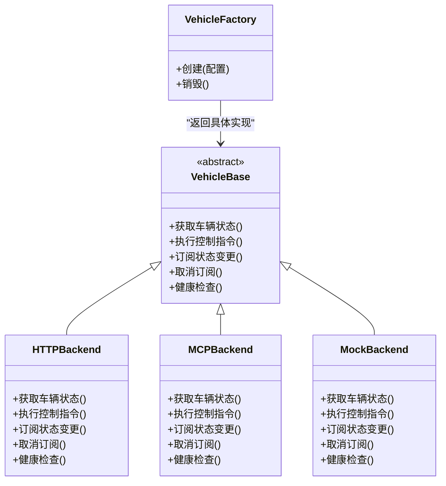
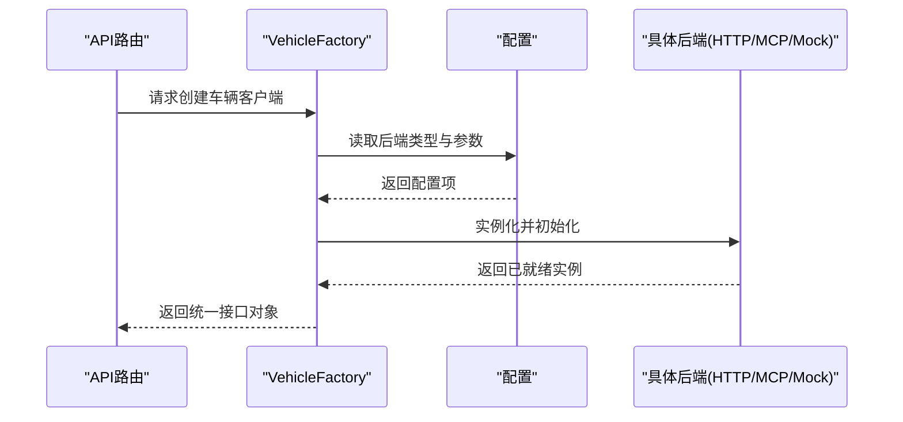
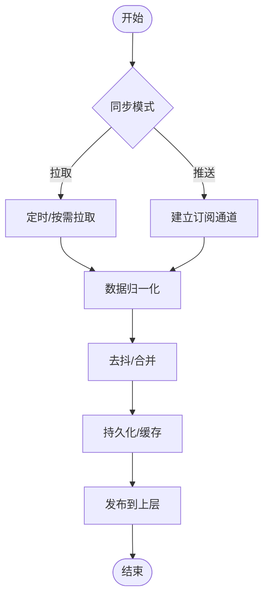
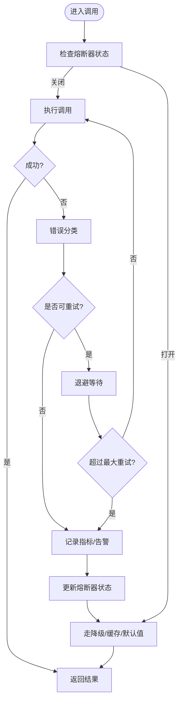
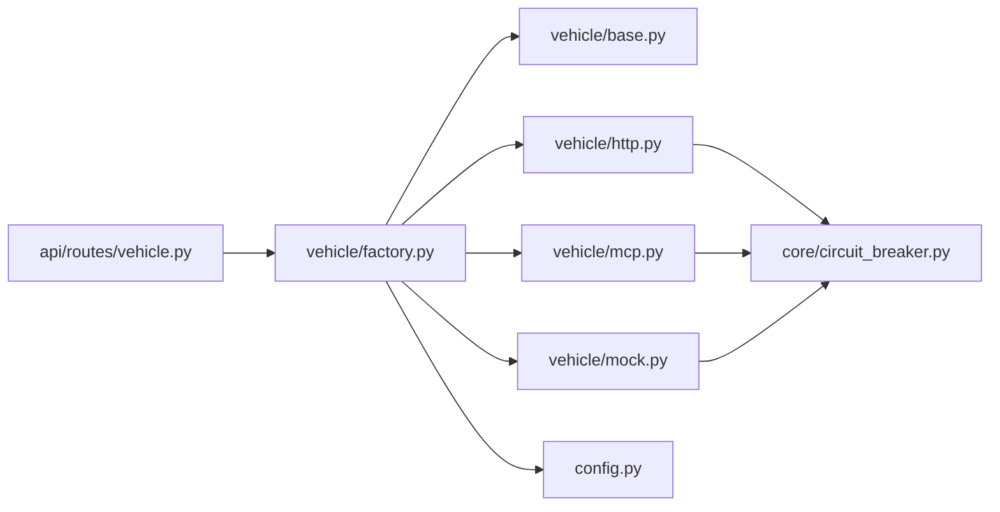

# 车辆API抽象层

<cite>
**本文引用的文件**   
- [backend_design/nexus/vehicle/base.py](file://backend_design/nexus/vehicle/base.py)
- [backend_design/nexus/vehicle/factory.py](file://backend_design/nexus/vehicle/factory.py)
- [backend_design/nexus/vehicle/http.py](file://backend_design/nexus/vehicle/http.py)
- [backend_design/nexus/vehicle/mcp.py](file://backend_design/nexus/vehicle/mcp.py)
- [backend_design/nexus/vehicle/mock.py](file://backend_design/nexus/vehicle/mock.py)
- [backend_design/nexus/api/routes/vehicle.py](file://backend_design/nexus/api/routes/vehicle.py)
- [backend_design/nexus/core/circuit_breaker.py](file://backend_design/nexus/core/circuit_breaker.py)
- [backend_design/nexus/config.py](file://backend_design/nexus/config.py)
</cite>

## 目录
1. [简介](#简介)
2. [项目结构](#项目结构)
3. [核心组件](#核心组件)
4. [架构总览](#架构总览)
5. [详细组件分析](#详细组件分析)
6. [依赖关系分析](#依赖关系分析)
7. [性能考虑](#性能考虑)
8. [故障排查指南](#故障排查指南)
9. [结论](#结论)
10. [附录](#附录)

## 简介
本技术文档聚焦于NexusCockpit中的“车辆API抽象层”，围绕VehicleBase基类的设计模式与接口定义，系统阐述HTTP、MCP、Mock三种后端实现差异与适用场景；深入解析车辆工厂模式的动态实例化策略与配置管理；说明车辆状态同步机制、错误处理策略与重试逻辑；并提供扩展新车辆后端的实践指导与性能优化建议。

## 项目结构
车辆API抽象层位于后端模块的nexus/vehicle目录下，包含统一抽象、工厂以及多种后端实现；上层通过API路由暴露对外能力，并通过核心模块提供熔断等稳定性保障。

图表来源
- [backend_design/nexus/vehicle/base.py](file://backend_design/nexus/vehicle/base.py)
- [backend_design/nexus/vehicle/factory.py](file://backend_design/nexus/vehicle/factory.py)
- [backend_design/nexus/vehicle/http.py](file://backend_design/nexus/vehicle/http.py)
- [backend_design/nexus/vehicle/mcp.py](file://backend_design/nexus/vehicle/mcp.py)
- [backend_design/nexus/vehicle/mock.py](file://backend_design/nexus/vehicle/mock.py)
- [backend_design/nexus/api/routes/vehicle.py](file://backend_design/nexus/api/routes/vehicle.py)
- [backend_design/nexus/core/circuit_breaker.py](file://backend_design/nexus/core/circuit_breaker.py)
- [backend_design/nexus/config.py](file://backend_design/nexus/config.py)

章节来源
- [backend_design/nexus/vehicle/base.py](file://backend_design/nexus/vehicle/base.py)
- [backend_design/nexus/vehicle/factory.py](file://backend_design/nexus/vehicle/factory.py)
- [backend_design/nexus/vehicle/http.py](file://backend_design/nexus/vehicle/http.py)
- [backend_design/nexus/vehicle/mcp.py](file://backend_design/nexus/vehicle/mcp.py)
- [backend_design/nexus/vehicle/mock.py](file://backend_design/nexus/vehicle/mock.py)
- [backend_design/nexus/api/routes/vehicle.py](file://backend_design/nexus/api/routes/vehicle.py)
- [backend_design/nexus/core/circuit_breaker.py](file://backend_design/nexus/core/circuit_breaker.py)
- [backend_design/nexus/config.py](file://backend_design/nexus/config.py)

## 核心组件
- VehicleBase：定义统一的车辆能力契约（如查询状态、控制设备、订阅事件等），屏蔽底层差异，供上层一致调用。
- VehicleFactory：根据配置动态选择并实例化具体后端（HTTP/MCP/Mock），集中管理生命周期与参数注入。
- HTTP后端：基于HTTP协议与车端服务通信，适合标准REST/JSON或OpenAPI风格的服务。
- MCP后端：基于MCP协议进行工具/资源交互，适合以模型为中心的工具编排场景。
- Mock后端：用于本地开发、联调与自动化测试，快速验证上层逻辑。

章节来源
- [backend_design/nexus/vehicle/base.py](file://backend_design/nexus/vehicle/base.py)
- [backend_design/nexus/vehicle/factory.py](file://backend_design/nexus/vehicle/factory.py)
- [backend_design/nexus/vehicle/http.py](file://backend_design/nexus/vehicle/http.py)
- [backend_design/nexus/vehicle/mcp.py](file://backend_design/nexus/vehicle/mcp.py)
- [backend_design/nexus/vehicle/mock.py](file://backend_design/nexus/vehicle/mock.py)

## 架构总览
整体采用“抽象基类 + 工厂 + 多后端实现”的分层设计。上层API路由仅依赖抽象与工厂，不感知具体后端；工厂负责按配置创建对应后端实例；各后端在内部复用核心能力（如熔断、日志、指标）以保证一致性与可观测性。

图表来源
- [backend_design/nexus/vehicle/base.py](file://backend_design/nexus/vehicle/base.py)
- [backend_design/nexus/vehicle/http.py](file://backend_design/nexus/vehicle/http.py)
- [backend_design/nexus/vehicle/mcp.py](file://backend_design/nexus/vehicle/mcp.py)
- [backend_design/nexus/vehicle/mock.py](file://backend_design/nexus/vehicle/mock.py)
- [backend_design/nexus/vehicle/factory.py](file://backend_design/nexus/vehicle/factory.py)

## 详细组件分析

### VehicleBase 抽象基类
- 设计目标：为所有车辆后端提供统一的能力边界与调用约定，确保上层对后端无感切换。
- 关键职责：
  - 定义统一方法签名（状态查询、控制指令、订阅/取消订阅、健康检查）。
  - 提供通用校验、参数规范化与结果归一化逻辑。
  - 作为工厂返回类型的约束，保证类型安全与IDE友好。
- 扩展点：新增能力时优先在基类中声明，再在各后端逐步落地。

章节来源
- [backend_design/nexus/vehicle/base.py](file://backend_design/nexus/vehicle/base.py)

### 工厂模式与动态实例化
- 配置驱动：从配置中心读取后端类型与连接参数，决定实例化策略。
- 动态创建：根据配置映射到具体后端类，完成初始化与依赖注入。
- 生命周期：支持按需创建、缓存复用与优雅销毁。
- 可扩展性：新增后端只需注册到工厂映射表，无需改动上层调用。

图表来源
- [backend_design/nexus/vehicle/factory.py](file://backend_design/nexus/vehicle/factory.py)
- [backend_design/nexus/config.py](file://backend_design/nexus/config.py)
- [backend_design/nexus/api/routes/vehicle.py](file://backend_design/nexus/api/routes/vehicle.py)

章节来源
- [backend_design/nexus/vehicle/factory.py](file://backend_design/nexus/vehicle/factory.py)
- [backend_design/nexus/config.py](file://backend_design/nexus/config.py)

### HTTP 后端实现
- 适用场景：车端提供标准HTTP/JSON接口，具备良好生态与易用性。
- 关键特性：
  - 使用HTTP客户端发起请求，封装鉴权、超时、重试与错误码映射。
  - 将响应体统一转换为领域模型，便于上层消费。
  - 可选集成熔断器，避免雪崩。
- 注意事项：
  - 合理设置超时与重试退避策略。
  - 对幂等与非幂等操作区分处理。

章节来源
- [backend_design/nexus/vehicle/http.py](file://backend_design/nexus/vehicle/http.py)
- [backend_design/nexus/core/circuit_breaker.py](file://backend_design/nexus/core/circuit_breaker.py)

### MCP 后端实现
- 适用场景：以模型为中心的工具/资源编排，强调语义化能力发现与组合。
- 关键特性：
  - 通过MCP协议与远端服务交互，支持工具调用与资源访问。
  - 适配MCP的错误与限流语义，结合熔断器提升鲁棒性。
- 注意事项：
  - 关注MCP版本兼容性与能力协商。
  - 对长耗时操作引入异步与超时控制。

章节来源
- [backend_design/nexus/vehicle/mcp.py](file://backend_design/nexus/vehicle/mcp.py)
- [backend_design/nexus/core/circuit_breaker.py](file://backend_design/nexus/core/circuit_breaker.py)

### Mock 后端实现
- 适用场景：本地开发、联调与自动化测试，快速验证上层流程。
- 关键特性：
  - 模拟常见状态与控制指令，支持预设数据与随机扰动。
  - 可注入延迟与异常，用于压测与混沌演练。
- 注意事项：
  - 保持与真实后端一致的接口行为，避免掩盖潜在问题。

章节来源
- [backend_design/nexus/vehicle/mock.py](file://backend_design/nexus/vehicle/mock.py)

### 状态同步机制
- 拉取模式：定时轮询或按需触发，适用于低频变化状态。
- 推送模式：基于长连接或事件通道，适用于高频实时状态。
- 去抖与合并：对频繁变更做聚合，降低下游压力。
- 一致性：在并发更新场景下采用版本号或时间戳避免覆盖。

[此图为概念流程图，未直接映射具体源码文件]

### 错误处理与重试策略
- 错误分类：网络错误、业务错误、超时、熔断打开、限流等。
- 重试原则：
  - 仅对幂等且瞬时失败的操作重试。
  - 采用指数退避与抖动，避免惊群效应。
  - 限制最大重试次数与总时长。
- 熔断降级：
  - 连续失败达到阈值后快速失败，保护下游。
  - 半开探测恢复，逐步放量。

图表来源
- [backend_design/nexus/core/circuit_breaker.py](file://backend_design/nexus/core/circuit_breaker.py)

章节来源
- [backend_design/nexus/core/circuit_breaker.py](file://backend_design/nexus/core/circuit_breaker.py)

### 扩展新的车辆后端实现（步骤指引）
- 步骤概览：
  1) 新建后端类，继承VehicleBase并实现全部抽象方法。
  2) 在工厂中注册新后端类型与构造参数映射。
  3) 在配置文件中增加后端类型与连接参数。
  4) 编写单元测试，覆盖正常路径与异常路径。
  5) 接入熔断器与可观测性（日志、指标）。
- 参考路径：
  - 抽象基类定义位置：[backend_design/nexus/vehicle/base.py](file://backend_design/nexus/vehicle/base.py)
  - 工厂注册与实例化位置：[backend_design/nexus/vehicle/factory.py](file://backend_design/nexus/vehicle/factory.py)
  - 现有HTTP实现参考：[backend_design/nexus/vehicle/http.py](file://backend_design/nexus/vehicle/http.py)
  - 现有MCP实现参考：[backend_design/nexus/vehicle/mcp.py](file://backend_design/nexus/vehicle/mcp.py)
  - 现有Mock实现参考：[backend_design/nexus/vehicle/mock.py](file://backend_design/nexus/vehicle/mock.py)
  - 配置加载位置：[backend_design/nexus/config.py](file://backend_design/nexus/config.py)

章节来源
- [backend_design/nexus/vehicle/base.py](file://backend_design/nexus/vehicle/base.py)
- [backend_design/nexus/vehicle/factory.py](file://backend_design/nexus/vehicle/factory.py)
- [backend_design/nexus/vehicle/http.py](file://backend_design/nexus/vehicle/http.py)
- [backend_design/nexus/vehicle/mcp.py](file://backend_design/nexus/vehicle/mcp.py)
- [backend_design/nexus/vehicle/mock.py](file://backend_design/nexus/vehicle/mock.py)
- [backend_design/nexus/config.py](file://backend_design/nexus/config.py)

## 依赖关系分析
- 耦合度：
  - 上层API仅依赖抽象与工厂，低耦合。
  - 各后端独立实现，高内聚。
- 外部依赖：
  - HTTP后端依赖HTTP客户端库。
  - MCP后端依赖MCP协议栈。
  - 熔断器为核心公共依赖，被多后端复用。
- 循环依赖：
  - 当前分层清晰，未见循环依赖迹象。

图表来源
- [backend_design/nexus/api/routes/vehicle.py](file://backend_design/nexus/api/routes/vehicle.py)
- [backend_design/nexus/vehicle/factory.py](file://backend_design/nexus/vehicle/factory.py)
- [backend_design/nexus/vehicle/base.py](file://backend_design/nexus/vehicle/base.py)
- [backend_design/nexus/vehicle/http.py](file://backend_design/nexus/vehicle/http.py)
- [backend_design/nexus/vehicle/mcp.py](file://backend_design/nexus/vehicle/mcp.py)
- [backend_design/nexus/vehicle/mock.py](file://backend_design/nexus/vehicle/mock.py)
- [backend_design/nexus/core/circuit_breaker.py](file://backend_design/nexus/core/circuit_breaker.py)
- [backend_design/nexus/config.py](file://backend_design/nexus/config.py)

章节来源
- [backend_design/nexus/api/routes/vehicle.py](file://backend_design/nexus/api/routes/vehicle.py)
- [backend_design/nexus/vehicle/factory.py](file://backend_design/nexus/vehicle/factory.py)
- [backend_design/nexus/vehicle/base.py](file://backend_design/nexus/vehicle/base.py)
- [backend_design/nexus/vehicle/http.py](file://backend_design/nexus/vehicle/http.py)
- [backend_design/nexus/vehicle/mcp.py](file://backend_design/nexus/vehicle/mcp.py)
- [backend_design/nexus/vehicle/mock.py](file://backend_design/nexus/vehicle/mock.py)
- [backend_design/nexus/core/circuit_breaker.py](file://backend_design/nexus/core/circuit_breaker.py)
- [backend_design/nexus/config.py](file://backend_design/nexus/config.py)

## 性能考虑
- 连接池与复用：
  - HTTP后端启用连接池，减少握手开销。
  - 工厂缓存实例，避免重复创建。
- 超时与并发：
  - 合理设置读写超时与最大并发数，防止资源耗尽。
  - 对长耗时操作采用异步与背压。
- 缓存与去重：
  - 热点状态加入本地缓存，缩短P99延迟。
  - 对批量更新做合并与去抖。
- 熔断与限流：
  - 熔断器快速失败，保护系统。
  - 配合限流器平滑突发流量。
- 监控与可观测性：
  - 记录关键指标（成功率、延迟、熔断状态）。
  - 结构化日志便于定位问题。

[本节为通用性能建议，不直接分析具体文件]

## 故障排查指南
- 常见问题定位：
  - 后端不可用：检查熔断器状态与错误计数，确认是否进入半开探测。
  - 超时频发：核查上游服务负载与网络质量，调整超时与重试策略。
  - 状态不同步：检查订阅通道是否断开，核对去抖与合并策略。
- 诊断手段：
  - 查看熔断器指标与日志，判断失败原因与恢复进度。
  - 对比Mock与真实后端的行为差异，隔离问题域。
  - 使用压测脚本复现问题，观察延迟分布与错误率。

章节来源
- [backend_design/nexus/core/circuit_breaker.py](file://backend_design/nexus/core/circuit_breaker.py)

## 结论
通过VehicleBase抽象与工厂模式，NexusCockpit实现了车辆后端的解耦与可插拔，HTTP/MCP/Mock三类后端覆盖主流场景。结合熔断、重试与状态同步机制，系统在可用性与可维护性上取得平衡。遵循本文的最佳实践与扩展指引，可高效引入新的车辆后端并保持系统稳定。

## 附录
- 相关入口与参考：
  - 抽象基类：[backend_design/nexus/vehicle/base.py](file://backend_design/nexus/vehicle/base.py)
  - 工厂与配置：[backend_design/nexus/vehicle/factory.py](file://backend_design/nexus/vehicle/factory.py)、[backend_design/nexus/config.py](file://backend_design/nexus/config.py)
  - 后端实现：[backend_design/nexus/vehicle/http.py](file://backend_design/nexus/vehicle/http.py)、[backend_design/nexus/vehicle/mcp.py](file://backend_design/nexus/vehicle/mcp.py)、[backend_design/nexus/vehicle/mock.py](file://backend_design/nexus/vehicle/mock.py)
  - 上层API：[backend_design/nexus/api/routes/vehicle.py](file://backend_design/nexus/api/routes/vehicle.py)
  - 熔断器：[backend_design/nexus/core/circuit_breaker.py](file://backend_design/nexus/core/circuit_breaker.py)