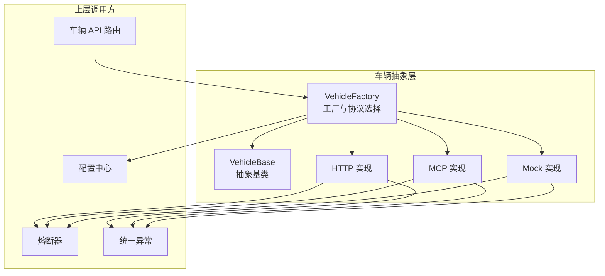
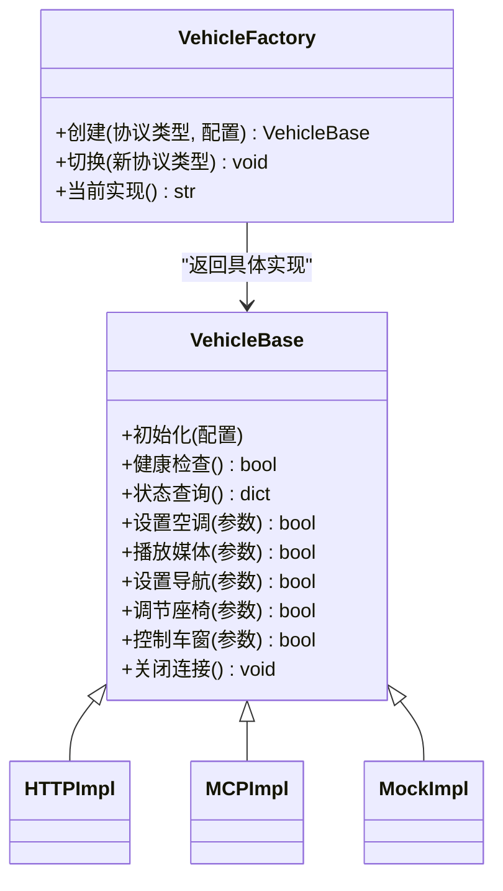
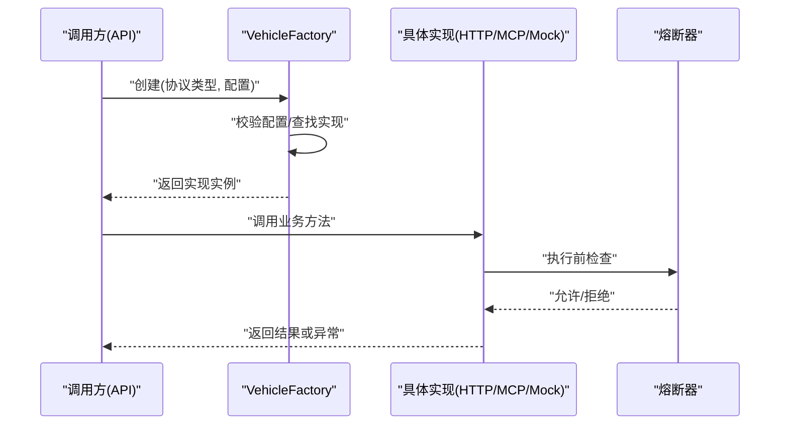
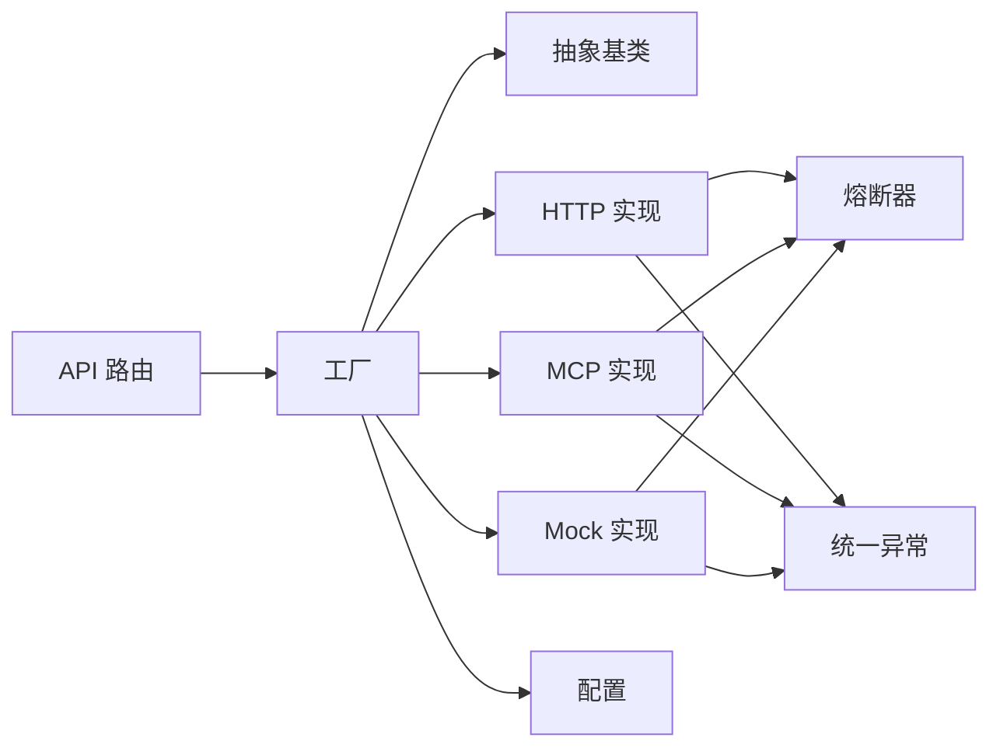
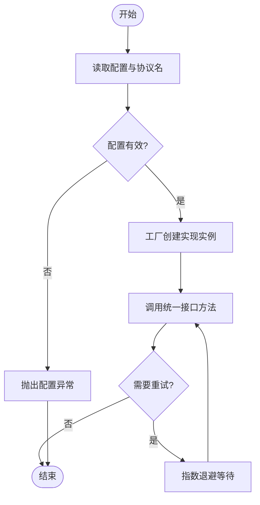

# 车辆接口抽象层

<cite>
**本文引用的文件**   
- [backend_design/nexus/vehicle/base.py](file://backend_design/nexus/vehicle/base.py)
- [backend_design/nexus/vehicle/factory.py](file://backend_design/nexus/vehicle/factory.py)
- [backend_design/nexus/vehicle/http.py](file://backend_design/nexus/vehicle/http.py)
- [backend_design/nexus/vehicle/mcp.py](file://backend_design/nexus/vehicle/mcp.py)
- [backend_design/nexus/vehicle/mock.py](file://backend_design/nexus/vehicle/mock.py)
- [backend_design/nexus/api/routes/vehicle.py](file://backend_design/nexus/api/routes/vehicle.py)
- [backend_design/nexus/core/circuit_breaker.py](file://backend_design/nexus/core/circuit_breaker.py)
- [backend_design/nexus/core/exceptions.py](file://backend_design/nexus/core/exceptions.py)
- [backend_design/nexus/config.py](file://backend_design/nexus/config.py)
</cite>

## 目录
1. [简介](#简介)
2. [项目结构](#项目结构)
3. [核心组件](#核心组件)
4. [架构总览](#架构总览)
5. [详细组件分析](#详细组件分析)
6. [依赖关系分析](#依赖关系分析)
7. [性能与可靠性](#性能与可靠性)
8. [故障排查指南](#故障排查指南)
9. [结论](#结论)
10. [附录：自定义适配器开发指南](#附录自定义适配器开发指南)

## 简介
本文件面向“车辆接口抽象层”，聚焦统一车辆接口的抽象设计模式、基类实现、工厂模式与协议选择逻辑、接口契约与向后兼容策略，以及错误处理、重试机制与超时控制。目标是帮助开发者快速理解并扩展该抽象层，以适配多种车辆通信协议（如 HTTP、MCP、Mock），同时保证上层业务稳定与可演进。

## 项目结构
车辆接口抽象层位于后端模块的 vehicle 子包中，包含统一的抽象基类、多协议实现与工厂选择器；API 路由通过统一接口访问底层不同协议实现；核心模块提供熔断、异常等通用能力；配置模块提供运行时参数。

图表来源
- [backend_design/nexus/vehicle/base.py](file://backend_design/nexus/vehicle/base.py)
- [backend_design/nexus/vehicle/factory.py](file://backend_design/nexus/vehicle/factory.py)
- [backend_design/nexus/vehicle/http.py](file://backend_design/nexus/vehicle/http.py)
- [backend_design/nexus/vehicle/mcp.py](file://backend_design/nexus/vehicle/mcp.py)
- [backend_design/nexus/vehicle/mock.py](file://backend_design/nexus/vehicle/mock.py)
- [backend_design/nexus/api/routes/vehicle.py](file://backend_design/nexus/api/routes/vehicle.py)
- [backend_design/nexus/core/circuit_breaker.py](file://backend_design/nexus/core/circuit_breaker.py)
- [backend_design/nexus/core/exceptions.py](file://backend_design/nexus/core/exceptions.py)
- [backend_design/nexus/config.py](file://backend_design/nexus/config.py)

章节来源
- [backend_design/nexus/vehicle/base.py](file://backend_design/nexus/vehicle/base.py)
- [backend_design/nexus/vehicle/factory.py](file://backend_design/nexus/vehicle/factory.py)
- [backend_design/nexus/vehicle/http.py](file://backend_design/nexus/vehicle/http.py)
- [backend_design/nexus/vehicle/mcp.py](file://backend_design/nexus/vehicle/mcp.py)
- [backend_design/nexus/vehicle/mock.py](file://backend_design/nexus/vehicle/mock.py)
- [backend_design/nexus/api/routes/vehicle.py](file://backend_design/nexus/api/routes/vehicle.py)
- [backend_design/nexus/core/circuit_breaker.py](file://backend_design/nexus/core/circuit_breaker.py)
- [backend_design/nexus/core/exceptions.py](file://backend_design/nexus/core/exceptions.py)
- [backend_design/nexus/config.py](file://backend_design/nexus/config.py)

## 核心组件
- 抽象基类 VehicleBase：定义统一车辆操作契约（如状态查询、空调、媒体、导航、座椅、车窗等），并提供通用生命周期管理、日志、指标埋点与默认降级行为。
- 工厂 VehicleFactory：根据配置动态创建具体协议实现实例，支持运行时切换与热更新。
- 协议实现：
  - HTTP：基于 HTTP 协议的远程车辆服务调用封装。
  - MCP：基于 MCP 协议的远程车辆服务调用封装。
  - Mock：用于开发与测试的模拟实现。
- 上层集成：API 路由通过工厂获取统一接口，屏蔽底层差异。
- 支撑能力：熔断器、统一异常、配置项。

章节来源
- [backend_design/nexus/vehicle/base.py](file://backend_design/nexus/vehicle/base.py)
- [backend_design/nexus/vehicle/factory.py](file://backend_design/nexus/vehicle/factory.py)
- [backend_design/nexus/vehicle/http.py](file://backend_design/nexus/vehicle/http.py)
- [backend_design/nexus/vehicle/mcp.py](file://backend_design/nexus/vehicle/mcp.py)
- [backend_design/nexus/vehicle/mock.py](file://backend_design/nexus/vehicle/mock.py)
- [backend_design/nexus/api/routes/vehicle.py](file://backend_design/nexus/api/routes/vehicle.py)
- [backend_design/nexus/core/circuit_breaker.py](file://backend_design/nexus/core/circuit_breaker.py)
- [backend_design/nexus/core/exceptions.py](file://backend_design/nexus/core/exceptions.py)
- [backend_design/nexus/config.py](file://backend_design/nexus/config.py)

## 架构总览
统一接口抽象层采用“抽象基类 + 多实现 + 工厂”的组合模式，将上层对车辆的调用与底层协议解耦。工厂依据配置在运行时选择具体实现，并通过熔断器与统一异常保障稳定性与可观测性。

图表来源
- [backend_design/nexus/vehicle/base.py](file://backend_design/nexus/vehicle/base.py)
- [backend_design/nexus/vehicle/factory.py](file://backend_design/nexus/vehicle/factory.py)
- [backend_design/nexus/vehicle/http.py](file://backend_design/nexus/vehicle/http.py)
- [backend_design/nexus/vehicle/mcp.py](file://backend_design/nexus/vehicle/mcp.py)
- [backend_design/nexus/vehicle/mock.py](file://backend_design/nexus/vehicle/mock.py)

## 详细组件分析

### 抽象基类 VehicleBase
- 职责
  - 定义统一方法签名与返回约定，确保各协议实现一致。
  - 提供通用能力：连接管理、重试包装、超时控制、熔断器接入、指标与日志埋点、默认降级策略。
- 关键属性与方法（概念说明）
  - 配置对象：保存连接地址、认证信息、超时、重试次数、熔断阈值等。
  - 生命周期：初始化、健康检查、关闭连接。
  - 业务方法：状态查询、空调、媒体、导航、座椅、车窗等。
  - 内部工具：请求封装、错误分类、重试与退避、超时控制、熔断开关。
- 复杂度与性能
  - 方法多为薄封装，时间复杂度取决于底层 I/O；通过重试与熔断避免雪崩。
- 错误处理
  - 将底层异常转换为统一异常类型，便于上层捕获与告警。
- 向后兼容
  - 新增可选参数时保持默认值，旧实现无需修改即可运行。

章节来源
- [backend_design/nexus/vehicle/base.py](file://backend_design/nexus/vehicle/base.py)
- [backend_design/nexus/core/exceptions.py](file://backend_design/nexus/core/exceptions.py)
- [backend_design/nexus/core/circuit_breaker.py](file://backend_design/nexus/core/circuit_breaker.py)

### 工厂模式与协议选择
- 职责
  - 根据配置中的协议类型动态创建对应实现实例。
  - 支持运行时切换实现，便于灰度与回滚。
- 动态实例创建
  - 维护已注册实现的映射表，按名称查找并构造。
  - 若未注册或配置非法，抛出明确异常。
- 协议选择逻辑
  - 从配置读取目标协议（如 http、mcp、mock）。
  - 校验必要参数（如 URL、鉴权头），缺失则拒绝创建。
- 线程安全
  - 使用锁保护全局注册表与当前实例切换。
- 可观测性
  - 记录创建与切换事件，便于追踪与审计。

图表来源
- [backend_design/nexus/vehicle/factory.py](file://backend_design/nexus/vehicle/factory.py)
- [backend_design/nexus/core/circuit_breaker.py](file://backend_design/nexus/core/circuit_breaker.py)

章节来源
- [backend_design/nexus/vehicle/factory.py](file://backend_design/nexus/vehicle/factory.py)
- [backend_design/nexus/config.py](file://backend_design/nexus/config.py)

### HTTP 实现
- 职责
  - 将统一接口方法映射为 HTTP 请求，处理序列化、鉴权、重试与超时。
- 关键特性
  - 连接池与复用，减少握手开销。
  - 幂等读操作自动重试，写操作谨慎重试。
  - 超时分层：连接超时、读取超时、整体超时。
  - 错误码到统一异常的映射。
- 性能建议
  - 合理设置并发与队列长度，避免下游拥塞。
  - 启用压缩与缓存（仅适用于幂等读）。

章节来源
- [backend_design/nexus/vehicle/http.py](file://backend_design/nexus/vehicle/http.py)
- [backend_design/nexus/core/exceptions.py](file://backend_design/nexus/core/exceptions.py)

### MCP 实现
- 职责
  - 基于 MCP 协议进行远程交互，封装消息编解码、会话管理与重连。
- 关键特性
  - 长连接与会话保活。
  - 断线自动重连与指数退避。
  - 错误语义映射至统一异常。
- 性能建议
  - 控制并发与批处理大小，避免背压。

章节来源
- [backend_design/nexus/vehicle/mcp.py](file://backend_design/nexus/vehicle/mcp.py)
- [backend_design/nexus/core/exceptions.py](file://backend_design/nexus/core/exceptions.py)

### Mock 实现
- 职责
  - 提供确定性响应，用于本地开发与自动化测试。
- 关键特性
  - 可注入延迟与失败场景，验证重试与熔断路径。
  - 暴露统计信息，辅助测试评估。

章节来源
- [backend_design/nexus/vehicle/mock.py](file://backend_design/nexus/vehicle/mock.py)

### API 路由集成
- 职责
  - 接收外部请求，通过工厂获取统一接口，转发到具体实现。
- 关键点
  - 参数校验与权限控制。
  - 统一响应格式与错误码。
  - 结合熔断器与限流策略。

章节来源
- [backend_design/nexus/api/routes/vehicle.py](file://backend_design/nexus/api/routes/vehicle.py)
- [backend_design/nexus/core/circuit_breaker.py](file://backend_design/nexus/core/circuit_breaker.py)

## 依赖关系分析
- 耦合与内聚
  - 抽象层与实现间通过基类松耦合；工厂集中管理依赖注入。
  - 各实现独立，内聚于各自协议细节。
- 外部依赖
  - 熔断器、统一异常、配置中心。
- 潜在循环依赖
  - 工厂不依赖具体实现细节，仅依赖注册表，避免循环。

图表来源
- [backend_design/nexus/api/routes/vehicle.py](file://backend_design/nexus/api/routes/vehicle.py)
- [backend_design/nexus/vehicle/factory.py](file://backend_design/nexus/vehicle/factory.py)
- [backend_design/nexus/vehicle/base.py](file://backend_design/nexus/vehicle/base.py)
- [backend_design/nexus/vehicle/http.py](file://backend_design/nexus/vehicle/http.py)
- [backend_design/nexus/vehicle/mcp.py](file://backend_design/nexus/vehicle/mcp.py)
- [backend_design/nexus/vehicle/mock.py](file://backend_design/nexus/vehicle/mock.py)
- [backend_design/nexus/core/circuit_breaker.py](file://backend_design/nexus/core/circuit_breaker.py)
- [backend_design/nexus/core/exceptions.py](file://backend_design/nexus/core/exceptions.py)
- [backend_design/nexus/config.py](file://backend_design/nexus/config.py)

章节来源
- [backend_design/nexus/vehicle/factory.py](file://backend_design/nexus/vehicle/factory.py)
- [backend_design/nexus/vehicle/base.py](file://backend_design/nexus/vehicle/base.py)
- [backend_design/nexus/core/circuit_breaker.py](file://backend_design/nexus/core/circuit_breaker.py)
- [backend_design/nexus/core/exceptions.py](file://backend_design/nexus/core/exceptions.py)
- [backend_design/nexus/config.py](file://backend_design/nexus/config.py)

## 性能与可靠性
- 重试机制
  - 针对幂等读操作启用自动重试，带指数退避与抖动，限制最大重试次数。
  - 写操作仅在特定错误下重试，避免重复指令。
- 超时控制
  - 分层超时：连接、读取、整体；超过阈值立即中断并上报。
- 熔断器
  - 基于错误率与慢调用比例触发熔断，半开探测恢复。
- 资源管理
  - 连接池、缓冲与并发上限调优，防止内存泄漏与背压。
- 可观测性
  - 指标埋点：成功率、P95/P99 延迟、熔断状态、重试次数。

章节来源
- [backend_design/nexus/core/circuit_breaker.py](file://backend_design/nexus/core/circuit_breaker.py)
- [backend_design/nexus/vehicle/http.py](file://backend_design/nexus/vehicle/http.py)
- [backend_design/nexus/vehicle/mcp.py](file://backend_design/nexus/vehicle/mcp.py)

## 故障排查指南
- 常见问题定位
  - 配置错误：协议类型不存在或缺少必要参数，查看工厂创建日志与异常信息。
  - 网络问题：超时与连接失败，检查熔断器状态与重试计数。
  - 协议不一致：字段缺失或类型不匹配，对比契约变更与版本兼容性。
- 诊断步骤
  - 开启调试日志，关注请求链路 ID。
  - 查看熔断器面板，确认是否进入熔断或半开状态。
  - 回放失败请求，比对期望响应与实际响应。
- 恢复策略
  - 临时降级：切换到 Mock 或只读缓存。
  - 滚动升级：先切灰度流量，观察指标后再全量。

章节来源
- [backend_design/nexus/core/exceptions.py](file://backend_design/nexus/core/exceptions.py)
- [backend_design/nexus/core/circuit_breaker.py](file://backend_design/nexus/core/circuit_breaker.py)
- [backend_design/nexus/vehicle/factory.py](file://backend_design/nexus/vehicle/factory.py)

## 结论
通过抽象基类、工厂与多协议实现，车辆接口抽象层实现了高内聚、低耦合的统一访问面。配合重试、超时与熔断，系统在多变环境下具备良好稳定性与可扩展性。遵循接口契约与向后兼容策略，可在不影响上层的条件下平滑演进。

## 附录：自定义适配器开发指南
- 开发步骤
  - 继承抽象基类，实现所有必需方法，保持方法与返回约定一致。
  - 在工厂中注册新实现，提供协议名称与构造参数。
  - 编写单元测试覆盖正常、异常与边界场景。
- 最佳实践
  - 幂等性与重试：仅对幂等操作启用重试，写操作谨慎处理。
  - 超时与熔断：为每个 I/O 设置合理超时，接入熔断器。
  - 错误分类：将底层错误映射为统一异常，便于上层处理。
  - 可观测性：记录关键指标与上下文信息，便于排障。
  - 向后兼容：新增字段需有默认值，避免破坏旧客户端。
- 示例流程（概念图）

[此图为概念流程图，不直接映射具体源码文件]