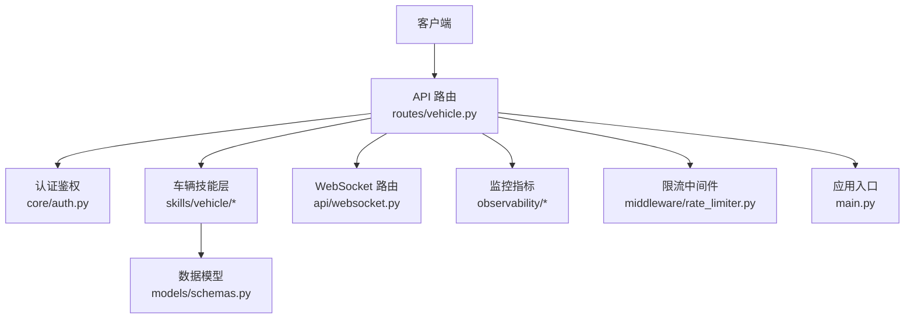
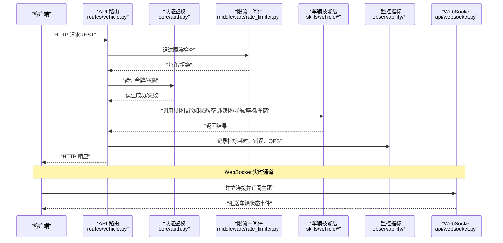
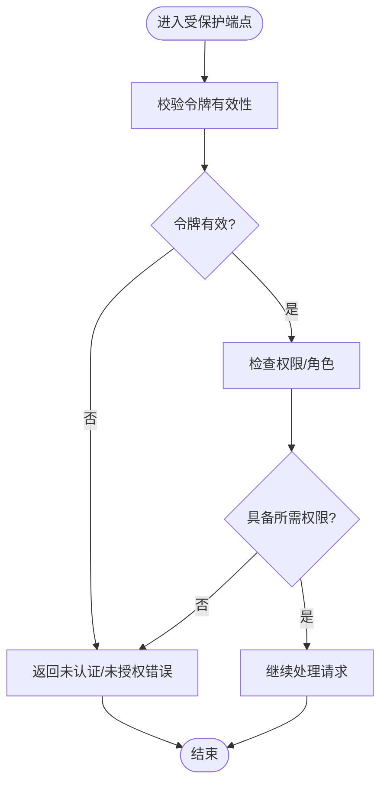
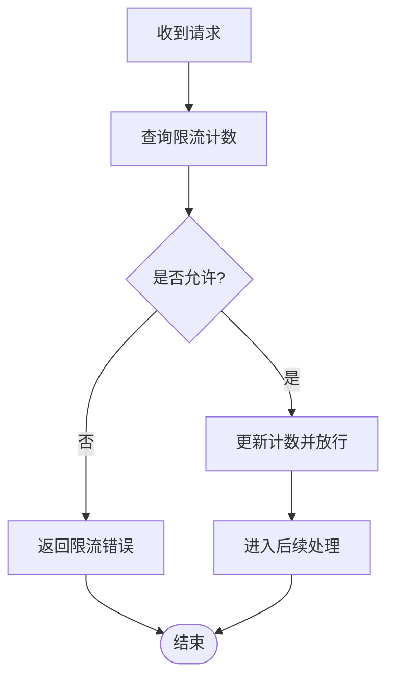
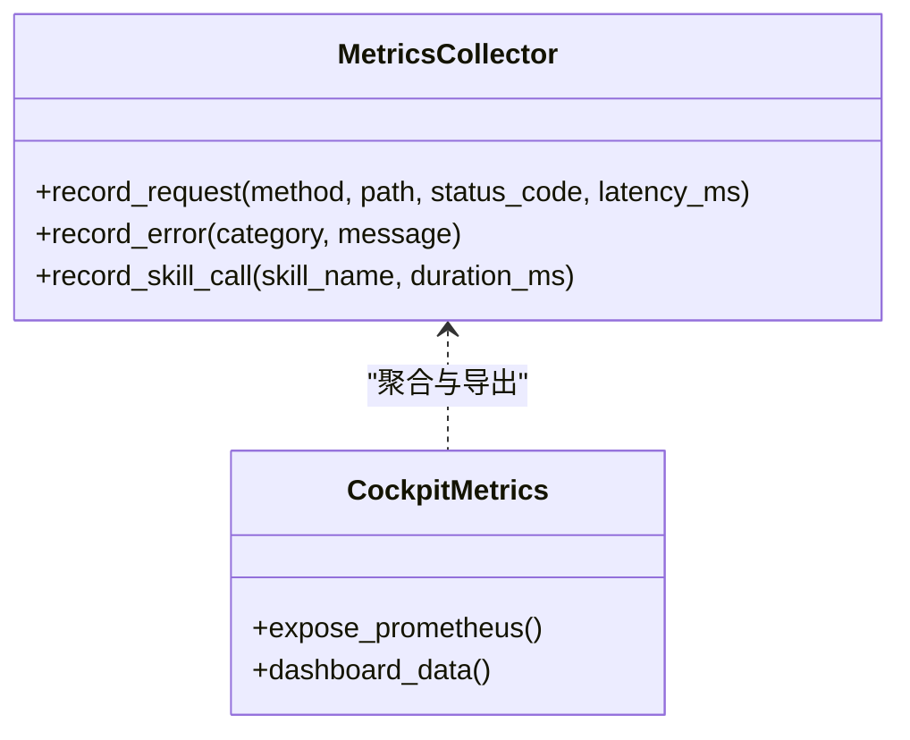
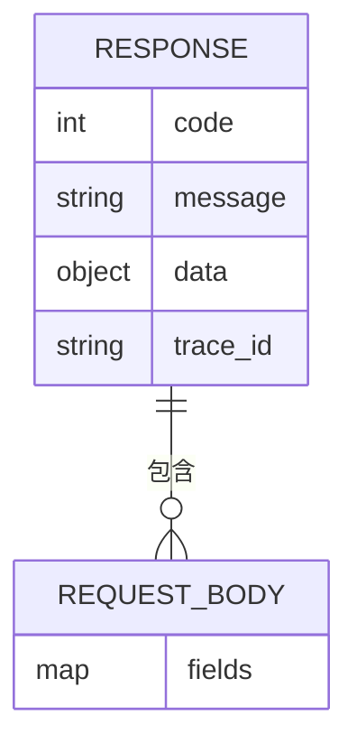
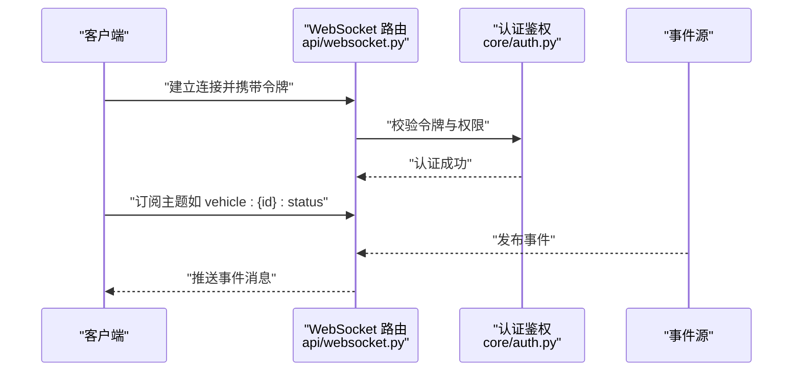
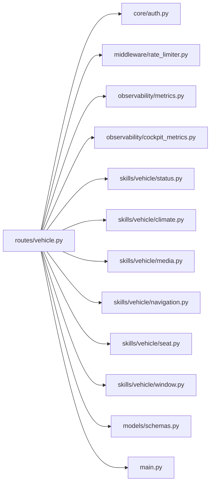

# 车辆控制API路由

<cite>
**本文引用的文件**   
- [backend_design/nexus/api/routes/vehicle.py](file://backend_design/nexus/api/routes/vehicle.py)
- [backend_design/nexus/api/websocket.py](file://backend_design/nexus/api/websocket.py)
- [backend_design/nexus/core/auth.py](file://backend_design/nexus/core/auth.py)
- [backend_design/nexus/middleware/rate_limiter.py](file://backend_design/nexus/middleware/rate_limiter.py)
- [backend_design/nexus/observability/metrics.py](file://backend_design/nexus/observability/metrics.py)
- [backend_design/nexus/observability/cockpit_metrics.py](file://backend_design/nexus/observability/cockpit_metrics.py)
- [backend_design/nexus/skills/vehicle/status.py](file://backend_design/nexus/skills/vehicle/status.py)
- [backend_design/nexus/skills/vehicle/climate.py](file://backend_design/nexus/skills/vehicle/climate.py)
- [backend_design/nexus/skills/vehicle/media.py](file://backend_design/nexus/skills/vehicle/media.py)
- [backend_design/nexus/skills/vehicle/navigation.py](file://backend_design/nexus/skills/vehicle/navigation.py)
- [backend_design/nexus/skills/vehicle/seat.py](file://backend_design/nexus/skills/vehicle/seat.py)
- [backend_design/nexus/skills/vehicle/window.py](file://backend_design/nexus/skills/vehicle/window.py)
- [backend_design/nexus/models/schemas.py](file://backend_design/nexus/models/schemas.py)
- [backend_design/nexus/main.py](file://backend_design/nexus/main.py)
</cite>

## 目录
1. [简介](#简介)
2. [项目结构](#项目结构)
3. [核心组件](#核心组件)
4. [架构总览](#架构总览)
5. [详细组件分析](#详细组件分析)
6. [依赖关系分析](#依赖关系分析)
7. [性能与并发](#性能与并发)
8. [故障排查指南](#故障排查指南)
9. [结论](#结论)
10. [附录](#附录)

## 简介
本文件为 NexusCockpit 的车辆控制 API 路由提供全面接口文档，覆盖以下方面：
- RESTful 车辆控制端点（HTTP 方法、URL 路径、请求参数、响应格式）
- 认证授权与访问权限控制
- WebSocket 实时通信接口（车辆状态推送）
- 完整的请求/响应示例与错误码说明
- API 版本管理与向后兼容性策略
- 限流策略与并发控制机制
- API 调用日志记录与监控指标

## 项目结构
与车辆控制 API 相关的关键代码位于后端设计目录的 nexus 子模块中：
- API 路由层：routes/vehicle.py、websocket.py
- 认证与安全：core/auth.py
- 中间件：middleware/rate_limiter.py
- 可观测性：observability/metrics.py、observability/cockpit_metrics.py
- 技能实现：skills/vehicle/*（状态、空调、媒体、导航、座椅、车窗等）
- 数据模型：models/schemas.py
- 应用入口：main.py（注册路由、挂载中间件、启动服务）

图表来源
- [backend_design/nexus/api/routes/vehicle.py](file://backend_design/nexus/api/routes/vehicle.py)
- [backend_design/nexus/api/websocket.py](file://backend_design/nexus/api/websocket.py)
- [backend_design/nexus/core/auth.py](file://backend_design/nexus/core/auth.py)
- [backend_design/nexus/middleware/rate_limiter.py](file://backend_design/nexus/middleware/rate_limiter.py)
- [backend_design/nexus/observability/metrics.py](file://backend_design/nexus/observability/metrics.py)
- [backend_design/nexus/observability/cockpit_metrics.py](file://backend_design/nexus/observability/cockpit_metrics.py)
- [backend_design/nexus/skills/vehicle/status.py](file://backend_design/nexus/skills/vehicle/status.py)
- [backend_design/nexus/skills/vehicle/climate.py](file://backend_design/nexus/skills/vehicle/climate.py)
- [backend_design/nexus/skills/vehicle/media.py](file://backend_design/nexus/skills/vehicle/media.py)
- [backend_design/nexus/skills/vehicle/navigation.py](file://backend_design/nexus/skills/vehicle/navigation.py)
- [backend_design/nexus/skills/vehicle/seat.py](file://backend_design/nexus/skills/vehicle/seat.py)
- [backend_design/nexus/skills/vehicle/window.py](file://backend_design/nexus/skills/vehicle/window.py)
- [backend_design/nexus/models/schemas.py](file://backend_design/nexus/models/schemas.py)
- [backend_design/nexus/main.py](file://backend_design/nexus/main.py)

章节来源
- [backend_design/nexus/api/routes/vehicle.py](file://backend_design/nexus/api/routes/vehicle.py)
- [backend_design/nexus/api/websocket.py](file://backend_design/nexus/api/websocket.py)
- [backend_design/nexus/core/auth.py](file://backend_design/nexus/core/auth.py)
- [backend_design/nexus/middleware/rate_limiter.py](file://backend_design/nexus/middleware/rate_limiter.py)
- [backend_design/nexus/observability/metrics.py](file://backend_design/nexus/observability/metrics.py)
- [backend_design/nexus/observability/cockpit_metrics.py](file://backend_design/nexus/observability/cockpit_metrics.py)
- [backend_design/nexus/skills/vehicle/status.py](file://backend_design/nexus/skills/vehicle/status.py)
- [backend_design/nexus/skills/vehicle/climate.py](file://backend_design/nexus/skills/vehicle/climate.py)
- [backend_design/nexus/skills/vehicle/media.py](file://backend_design/nexus/skills/vehicle/media.py)
- [backend_design/nexus/skills/vehicle/navigation.py](file://backend_design/nexus/skills/vehicle/navigation.py)
- [backend_design/nexus/skills/vehicle/seat.py](file://backend_design/nexus/skills/vehicle/seat.py)
- [backend_design/nexus/skills/vehicle/window.py](file://backend_design/nexus/skills/vehicle/window.py)
- [backend_design/nexus/models/schemas.py](file://backend_design/nexus/models/schemas.py)
- [backend_design/nexus/main.py](file://backend_design/nexus/main.py)

## 核心组件
- 车辆控制路由：集中定义车辆相关的 REST 端点，负责参数校验、权限检查、调用技能层并返回统一响应。
- 认证鉴权：基于令牌或会话的认证与权限校验，确保仅授权用户可执行敏感操作。
- 限流中间件：对 API 进行速率限制与并发控制，防止滥用与过载。
- 监控指标：暴露关键指标（请求量、延迟、错误率、资源使用），便于 Prometheus/Grafana 采集。
- 技能层：按功能域拆分（状态、空调、媒体、导航、座椅、车窗），提供具体业务逻辑。
- WebSocket：用于车辆状态的实时推送与双向交互。

章节来源
- [backend_design/nexus/api/routes/vehicle.py](file://backend_design/nexus/api/routes/vehicle.py)
- [backend_design/nexus/core/auth.py](file://backend_design/nexus/core/auth.py)
- [backend_design/nexus/middleware/rate_limiter.py](file://backend_design/nexus/middleware/rate_limiter.py)
- [backend_design/nexus/observability/metrics.py](file://backend_design/nexus/observability/metrics.py)
- [backend_design/nexus/observability/cockpit_metrics.py](file://backend_design/nexus/observability/cockpit_metrics.py)
- [backend_design/nexus/skills/vehicle/status.py](file://backend_design/nexus/skills/vehicle/status.py)
- [backend_design/nexus/skills/vehicle/climate.py](file://backend_design/nexus/skills/vehicle/climate.py)
- [backend_design/nexus/skills/vehicle/media.py](file://backend_design/nexus/skills/vehicle/media.py)
- [backend_design/nexus/skills/vehicle/navigation.py](file://backend_design/nexus/skills/vehicle/navigation.py)
- [backend_design/nexus/skills/vehicle/seat.py](file://backend_design/nexus/skills/vehicle/seat.py)
- [backend_design/nexus/skills/vehicle/window.py](file://backend_design/nexus/skills/vehicle/window.py)
- [backend_design/nexus/api/websocket.py](file://backend_design/nexus/api/websocket.py)

## 架构总览
下图展示了从客户端到车辆技能的完整调用链路，包括认证、限流、监控与 WebSocket 实时通道。

图表来源
- [backend_design/nexus/api/routes/vehicle.py](file://backend_design/nexus/api/routes/vehicle.py)
- [backend_design/nexus/core/auth.py](file://backend_design/nexus/core/auth.py)
- [backend_design/nexus/middleware/rate_limiter.py](file://backend_design/nexus/middleware/rate_limiter.py)
- [backend_design/nexus/observability/metrics.py](file://backend_design/nexus/observability/metrics.py)
- [backend_design/nexus/observability/cockpit_metrics.py](file://backend_design/nexus/observability/cockpit_metrics.py)
- [backend_design/nexus/skills/vehicle/status.py](file://backend_design/nexus/skills/vehicle/status.py)
- [backend_design/nexus/skills/vehicle/climate.py](file://backend_design/nexus/skills/vehicle/climate.py)
- [backend_design/nexus/skills/vehicle/media.py](file://backend_design/nexus/skills/vehicle/media.py)
- [backend_design/nexus/skills/vehicle/navigation.py](file://backend_design/nexus/skills/vehicle/navigation.py)
- [backend_design/nexus/skills/vehicle/seat.py](file://backend_design/nexus/skills/vehicle/seat.py)
- [backend_design/nexus/skills/vehicle/window.py](file://backend_design/nexus/skills/vehicle/window.py)
- [backend_design/nexus/api/websocket.py](file://backend_design/nexus/api/websocket.py)

## 详细组件分析

### 认证与授权机制
- 认证方式：支持基于令牌的认证（例如 JWT），在请求头携带凭证；服务端校验签名、有效期与租户上下文。
- 权限控制：基于角色或资源的访问控制，区分只读与写操作；敏感操作需更高权限。
- 安全建议：强制 HTTPS、最小权限原则、令牌刷新与撤销机制。

图表来源
- [backend_design/nexus/core/auth.py](file://backend_design/nexus/core/auth.py)

章节来源
- [backend_design/nexus/core/auth.py](file://backend_design/nexus/core/auth.py)

### 限流与并发控制
- 限流策略：基于 IP/用户/租户维度的速率限制，支持滑动窗口或令牌桶算法。
- 并发控制：限制同一时间内的并发请求数，避免下游系统过载。
- 响应行为：超过阈值时返回限流错误，客户端应实施退避重试。

图表来源
- [backend_design/nexus/middleware/rate_limiter.py](file://backend_design/nexus/middleware/rate_limiter.py)

章节来源
- [backend_design/nexus/middleware/rate_limiter.py](file://backend_design/nexus/middleware/rate_limiter.py)

### 监控与日志
- 指标收集：请求总量、成功率、P95/P99 延迟、错误分类、技能调用耗时。
- 日志记录：结构化日志包含请求 ID、用户标识、耗时、状态码、错误堆栈摘要。
- 可视化：Prometheus 抓取指标，Grafana 展示仪表盘。

图表来源
- [backend_design/nexus/observability/metrics.py](file://backend_design/nexus/observability/metrics.py)
- [backend_design/nexus/observability/cockpit_metrics.py](file://backend_design/nexus/observability/cockpit_metrics.py)

章节来源
- [backend_design/nexus/observability/metrics.py](file://backend_design/nexus/observability/metrics.py)
- [backend_design/nexus/observability/cockpit_metrics.py](file://backend_design/nexus/observability/cockpit_metrics.py)

### 数据模型与响应规范
- 统一响应体：包含状态码、消息、数据载荷、追踪 ID。
- 请求体：遵循 Pydantic 模型校验，字段类型、必填项、取值范围明确。
- 分页与过滤：列表接口支持分页参数与条件过滤。

图表来源
- [backend_design/nexus/models/schemas.py](file://backend_design/nexus/models/schemas.py)

章节来源
- [backend_design/nexus/models/schemas.py](file://backend_design/nexus/models/schemas.py)

### WebSocket 实时通信
- 连接建立：客户端通过 ws:// 或 wss:// 建立连接，携带认证信息。
- 订阅主题：支持按车辆 ID、区域或事件类型订阅。
- 推送事件：车辆状态变更、告警、控制结果等实时推送。
- 断线重连：客户端实现指数退避重连，服务端维护会话与心跳。

图表来源
- [backend_design/nexus/api/websocket.py](file://backend_design/nexus/api/websocket.py)
- [backend_design/nexus/core/auth.py](file://backend_design/nexus/core/auth.py)

章节来源
- [backend_design/nexus/api/websocket.py](file://backend_design/nexus/api/websocket.py)
- [backend_design/nexus/core/auth.py](file://backend_design/nexus/core/auth.py)

### 车辆控制 REST 端点清单
以下为车辆控制相关的主要 REST 端点（以实际路由定义为准）。每个端点均受认证与限流保护，并记录监控指标。

- 获取车辆状态
  - 方法：GET
  - 路径：/api/v1/vehicle/status
  - 请求参数：无（或可选查询参数如 vehicle_id）
  - 响应格式：统一响应体，data 包含车辆状态对象（电量、里程、车门、车窗、空调、媒体、导航等）
  - 权限：只读
  - 示例响应：见“请求/响应示例”

- 设置空调
  - 方法：POST
  - 路径：/api/v1/vehicle/climate/set
  - 请求体：温度、模式、风量、目标区域等
  - 响应格式：统一响应体，data 包含执行结果与确认状态
  - 权限：写操作
  - 示例请求/响应：见“请求/响应示例”

- 控制媒体
  - 方法：POST
  - 路径：/api/v1/vehicle/media/control
  - 请求体：播放、暂停、切歌、音量等指令
  - 响应格式：统一响应体
  - 权限：写操作

- 设置导航
  - 方法：POST
  - 路径：/api/v1/vehicle/navigation/set
  - 请求体：目的地坐标、路线偏好、途经点等
  - 响应格式：统一响应体
  - 权限：写操作

- 调节座椅
  - 方法：POST
  - 路径：/api/v1/vehicle/seat/adjust
  - 请求体：位置、角度、加热/通风等级
  - 响应格式：统一响应体
  - 权限：写操作

- 控制车窗
  - 方法：POST
  - 路径：/api/v1/vehicle/window/control
  - 请求体：开/关、百分比、速度
  - 响应格式：统一响应体
  - 权限：写操作

- 批量控制
  - 方法：POST
  - 路径：/api/v1/vehicle/batch
  - 请求体：多条指令数组
  - 响应格式：统一响应体，包含各指令执行结果
  - 权限：写操作

- 查询历史状态
  - 方法：GET
  - 路径：/api/v1/vehicle/history
  - 请求参数：时间范围、维度筛选
  - 响应格式：分页列表
  - 权限：只读

注意：以上路径与参数以 routes/vehicle.py 的实际定义为最终依据。

章节来源
- [backend_design/nexus/api/routes/vehicle.py](file://backend_design/nexus/api/routes/vehicle.py)
- [backend_design/nexus/skills/vehicle/status.py](file://backend_design/nexus/skills/vehicle/status.py)
- [backend_design/nexus/skills/vehicle/climate.py](file://backend_design/nexus/skills/vehicle/climate.py)
- [backend_design/nexus/skills/vehicle/media.py](file://backend_design/nexus/skills/vehicle/media.py)
- [backend_design/nexus/skills/vehicle/navigation.py](file://backend_design/nexus/skills/vehicle/navigation.py)
- [backend_design/nexus/skills/vehicle/seat.py](file://backend_design/nexus/skills/vehicle/seat.py)
- [backend_design/nexus/skills/vehicle/window.py](file://backend_design/nexus/skills/vehicle/window.py)

### 请求/响应示例与错误码
- 成功响应示例（JSON）
  - 状态码：200
  - 响应体：
    - code: 0
    - message: "success"
    - data: { ... 具体数据 ... }
    - trace_id: "唯一追踪ID"

- 常见错误码
  - 400：参数校验失败
  - 401：未认证或令牌无效
  - 403：权限不足
  - 404：资源不存在
  - 429：限流触发
  - 500：服务器内部错误
  - 503：服务不可用（下游超时/熔断）

- 错误响应示例（JSON）
  - 状态码：400/401/403/429/500/503
  - 响应体：
    - code: 错误码
    - message: "错误描述"
    - data: null
    - trace_id: "唯一追踪ID"

章节来源
- [backend_design/nexus/models/schemas.py](file://backend_design/nexus/models/schemas.py)
- [backend_design/nexus/api/routes/vehicle.py](file://backend_design/nexus/api/routes/vehicle.py)

### API 版本管理与向后兼容
- 版本前缀：所有 API 使用 /api/vN/ 前缀，便于多版本并存。
- 弃用策略：旧版本保留一定周期，并在响应头标注弃用提示。
- 变更规则：新增字段保持向后兼容，删除字段需提前公告并提供迁移期。
- 灰度发布：通过网关或路由开关逐步放量新版本。

章节来源
- [backend_design/nexus/api/routes/vehicle.py](file://backend_design/nexus/api/routes/vehicle.py)
- [backend_design/nexus/main.py](file://backend_design/nexus/main.py)

## 依赖关系分析
- 路由层依赖认证、限流、监控与技能层。
- 技能层之间相对独立，通过统一模型进行数据交换。
- 监控与日志贯穿全链路，便于问题定位与容量规划。

图表来源
- [backend_design/nexus/api/routes/vehicle.py](file://backend_design/nexus/api/routes/vehicle.py)
- [backend_design/nexus/core/auth.py](file://backend_design/nexus/core/auth.py)
- [backend_design/nexus/middleware/rate_limiter.py](file://backend_design/nexus/middleware/rate_limiter.py)
- [backend_design/nexus/observability/metrics.py](file://backend_design/nexus/observability/metrics.py)
- [backend_design/nexus/observability/cockpit_metrics.py](file://backend_design/nexus/observability/cockpit_metrics.py)
- [backend_design/nexus/skills/vehicle/status.py](file://backend_design/nexus/skills/vehicle/status.py)
- [backend_design/nexus/skills/vehicle/climate.py](file://backend_design/nexus/skills/vehicle/climate.py)
- [backend_design/nexus/skills/vehicle/media.py](file://backend_design/nexus/skills/vehicle/media.py)
- [backend_design/nexus/skills/vehicle/navigation.py](file://backend_design/nexus/skills/vehicle/navigation.py)
- [backend_design/nexus/skills/vehicle/seat.py](file://backend_design/nexus/skills/vehicle/seat.py)
- [backend_design/nexus/skills/vehicle/window.py](file://backend_design/nexus/skills/vehicle/window.py)
- [backend_design/nexus/models/schemas.py](file://backend_design/nexus/models/schemas.py)
- [backend_design/nexus/main.py](file://backend_design/nexus/main.py)

章节来源
- [backend_design/nexus/api/routes/vehicle.py](file://backend_design/nexus/api/routes/vehicle.py)
- [backend_design/nexus/main.py](file://backend_design/nexus/main.py)

## 性能与并发
- 限流配置：按用户/租户/IP 维度设置 QPS 上限，结合令牌桶平滑突发流量。
- 并发控制：对写操作设置最大并发数，避免同时修改同一资源导致冲突。
- 缓存策略：只读接口可使用 Redis 缓存热点数据，降低数据库压力。
- 异步处理：长耗时任务采用队列异步执行，返回任务 ID 供查询进度。
- 监控指标：关注 P95/P99 延迟、错误率、CPU/内存使用、下游依赖延迟。

[本节为通用指导，不直接分析具体文件]

## 故障排查指南
- 常见问题
  - 401/403：检查令牌有效期、权限范围与租户上下文。
  - 429：查看限流配置与峰值，适当放宽或扩容。
  - 500/503：查看错误日志与下游依赖健康状态，必要时启用熔断。
- 定位步骤
  - 使用 trace_id 检索全链路日志。
  - 核对请求参数是否符合模型校验。
  - 检查监控指标异常点（延迟突增、错误率上升）。
- 恢复措施
  - 降级非关键功能，优先保障核心控制。
  - 重启异常实例，清理过期会话与缓存。
  - 回滚最近变更，观察稳定性。

章节来源
- [backend_design/nexus/observability/metrics.py](file://backend_design/nexus/observability/metrics.py)
- [backend_design/nexus/observability/cockpit_metrics.py](file://backend_design/nexus/observability/cockpit_metrics.py)
- [backend_design/nexus/api/routes/vehicle.py](file://backend_design/nexus/api/routes/vehicle.py)

## 结论
本文档系统化梳理了 NexusCockpit 车辆控制 API 的路由、认证、限流、监控与 WebSocket 实时通信能力，提供了清晰的端点清单、错误码说明与排障建议。建议在上线前完成压测与监控接入，确保高可用与可观测性。

[本节为总结性内容，不直接分析具体文件]

## 附录
- 术语表
  - 令牌：用于身份认证的凭据（如 JWT）。
  - 限流：对请求速率进行控制的策略。
  - 熔断：当依赖服务异常时快速失败，避免雪崩。
- 参考文件
  - 路由定义：routes/vehicle.py
  - WebSocket：api/websocket.py
  - 认证：core/auth.py
  - 限流：middleware/rate_limiter.py
  - 监控：observability/metrics.py、observability/cockpit_metrics.py
  - 技能：skills/vehicle/*
  - 模型：models/schemas.py
  - 入口：main.py

[本节为补充信息，不直接分析具体文件]