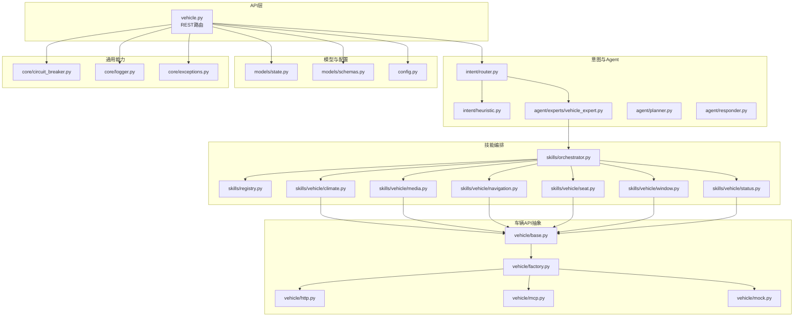
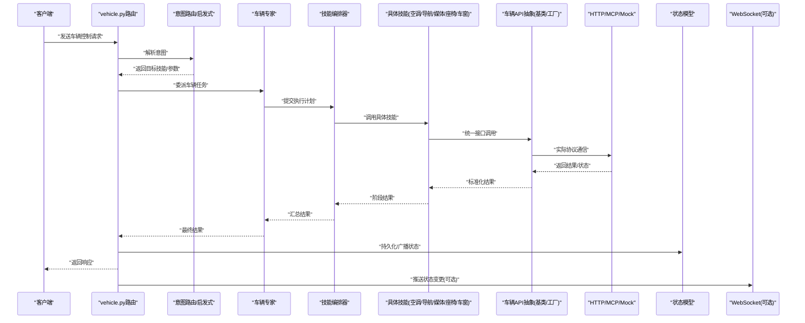
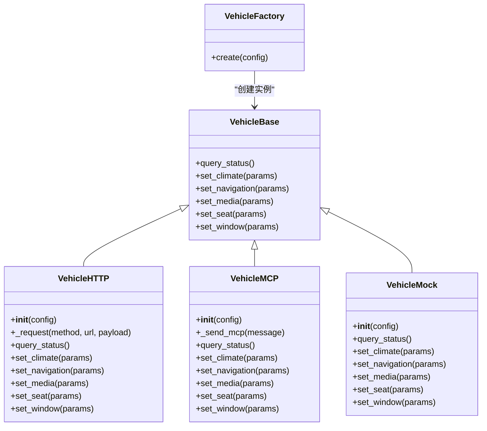
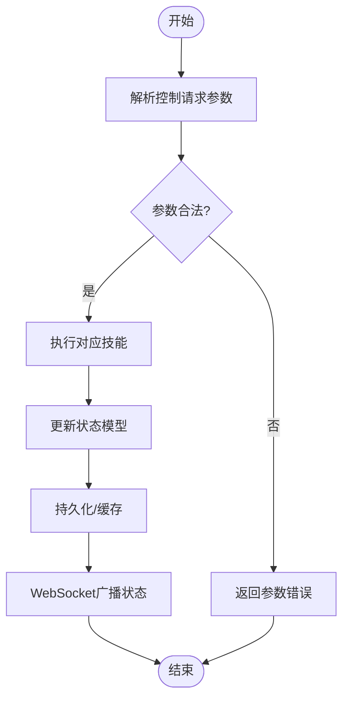
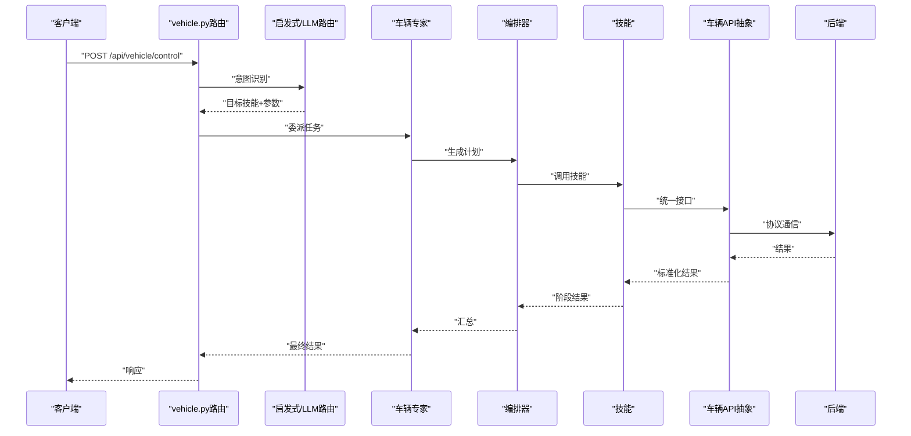
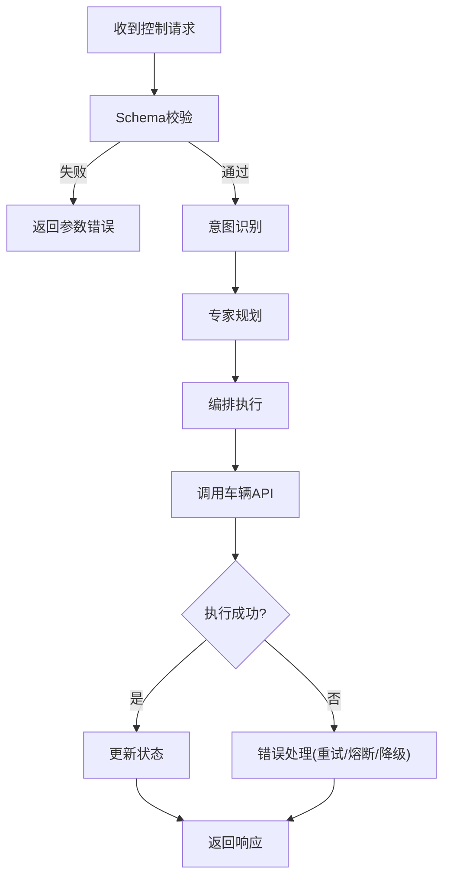
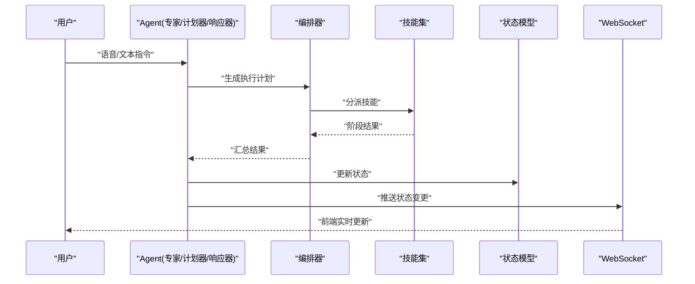
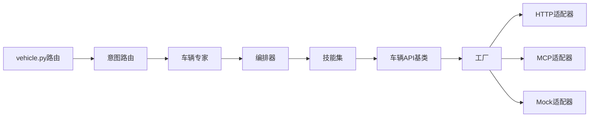

# 车辆控制系统

<cite>
**本文引用的文件**   
- [backend_design/nexus/vehicle/base.py](file://backend_design/nexus/vehicle/base.py)
- [backend_design/nexus/vehicle/factory.py](file://backend_design/nexus/vehicle/factory.py)
- [backend_design/nexus/vehicle/http.py](file://backend_design/nexus/vehicle/http.py)
- [backend_design/nexus/vehicle/mcp.py](file://backend_design/nexus/vehicle/mcp.py)
- [backend_design/nexus/vehicle/mock.py](file://backend_design/nexus/vehicle/mock.py)
- [backend_design/nexus/skills/vehicle/climate.py](file://backend_design/nexus/skills/vehicle/climate.py)
- [backend_design/nexus/skills/vehicle/media.py](file://backend_design/nexus/skills/vehicle/media.py)
- [backend_design/nexus/skills/vehicle/navigation.py](file://backend_design/nexus/skills/vehicle/navigation.py)
- [backend_design/nexus/skills/vehicle/seat.py](file://backend_design/nexus/skills/vehicle/seat.py)
- [backend_design/nexus/skills/vehicle/status.py](file://backend_design/nexus/skills/vehicle/status.py)
- [backend_design/nexus/skills/vehicle/window.py](file://backend_design/nexus/skills/vehicle/window.py)
- [backend_design/nexus/api/routes/vehicle.py](file://backend_design/nexus/api/routes/vehicle.py)
- [backend_design/nexus/core/circuit_breaker.py](file://backend_design/nexus/core/circuit_breaker.py)
- [backend_design/nexus/core/logger.py](file://backend_design/nexus/core/logger.py)
- [backend_design/nexus/core/exceptions.py](file://backend_design/nexus/core/exceptions.py)
- [backend_design/nexus/models/state.py](file://backend_design/nexus/models/state.py)
- [backend_design/nexus/models/schemas.py](file://backend_design/nexus/models/schemas.py)
- [backend_design/nexus/intent/router.py](file://backend_design/nexus/intent/router.py)
- [backend_design/nexus/intent/heuristic.py](file://backend_design/nexus/intent/heuristic.py)
- [backend_design/nexus/skills/orchestrator.py](file://backend_design/nexus/skills/orchestrator.py)
- [backend_design/nexus/skills/registry.py](file://backend_design/nexus/skills/registry.py)
- [backend_design/nexus/agent/experts/vehicle_expert.py](file://backend_design/nexus/agent/experts/vehicle_expert.py)
- [backend_design/nexus/agent/planner.py](file://backend_design/nexus/agent/planner.py)
- [backend_design/nexus/agent/responder.py](file://backend_design/nexus/agent/responder.py)
- [backend_design/nexus/config.py](file://backend_design/nexus/config.py)
</cite>

## 目录
1. [简介](#简介)
2. [项目结构](#项目结构)
3. [核心组件](#核心组件)
4. [架构总览](#架构总览)
5. [详细组件分析](#详细组件分析)
6. [依赖关系分析](#依赖关系分析)
7. [性能考虑](#性能考虑)
8. [故障排查指南](#故障排查指南)
9. [结论](#结论)
10. [附录](#附录)

## 简介
本技术文档面向NexusCockpit的车辆控制系统，聚焦以下目标：
- 车辆API抽象层设计：统一多后端（HTTP/MCP/Mock）访问接口，屏蔽差异。
- 车辆状态管理机制：定义状态模型、变更与同步策略。
- 控制命令处理流程：从意图识别到技能编排再到执行与反馈。
- 车辆控制技能实现：空调、导航、媒体、座椅、车窗等。
- API集成示例与错误处理：REST接口调用、异常分类与恢复。
- Agent系统集成与实时状态同步：专家路由、计划器、响应器与WebSocket推送。
- 权限管理与安全考量：鉴权、限流、熔断与审计。

## 项目结构
围绕“车辆”主题的关键目录与职责：
- backend_design/nexus/vehicle：车辆API抽象层与具体适配器（HTTP/MCP/Mock）。
- backend_design/nexus/skills/vehicle：按功能划分的车辆控制技能（空调、导航、媒体、座椅、车窗、状态）。
- backend_design/nexus/api/routes/vehicle.py：对外暴露的车辆相关REST接口。
- backend_design/nexus/models/state.py、schemas.py：状态与数据模型定义。
- backend_design/nexus/intent/*：意图识别与路由（启发式/LLM路由）。
- backend_design/nexus/agent/*：Agent侧的专家、计划器、响应器，负责将自然语言指令转化为可执行任务。
- backend_design/nexus/core/*：通用能力（熔断、日志、异常）。
- backend_design/nexus/skills/orchestrator.py、registry.py：技能编排与注册中心。

图表来源
- [backend_design/nexus/api/routes/vehicle.py](file://backend_design/nexus/api/routes/vehicle.py)
- [backend_design/nexus/intent/router.py](file://backend_design/nexus/intent/router.py)
- [backend_design/nexus/intent/heuristic.py](file://backend_design/nexus/intent/heuristic.py)
- [backend_design/nexus/agent/experts/vehicle_expert.py](file://backend_design/nexus/agent/experts/vehicle_expert.py)
- [backend_design/nexus/skills/orchestrator.py](file://backend_design/nexus/skills/orchestrator.py)
- [backend_design/nexus/skills/registry.py](file://backend_design/nexus/skills/registry.py)
- [backend_design/nexus/skills/vehicle/climate.py](file://backend_design/nexus/skills/vehicle/climate.py)
- [backend_design/nexus/skills/vehicle/media.py](file://backend_design/nexus/skills/vehicle/media.py)
- [backend_design/nexus/skills/vehicle/navigation.py](file://backend_design/nexus/skills/vehicle/navigation.py)
- [backend_design/nexus/skills/vehicle/seat.py](file://backend_design/nexus/skills/vehicle/seat.py)
- [backend_design/nexus/skills/vehicle/window.py](file://backend_design/nexus/skills/vehicle/window.py)
- [backend_design/nexus/skills/vehicle/status.py](file://backend_design/nexus/skills/vehicle/status.py)
- [backend_design/nexus/vehicle/base.py](file://backend_design/nexus/vehicle/base.py)
- [backend_design/nexus/vehicle/factory.py](file://backend_design/nexus/vehicle/factory.py)
- [backend_design/nexus/vehicle/http.py](file://backend_design/nexus/vehicle/http.py)
- [backend_design/nexus/vehicle/mcp.py](file://backend_design/nexus/vehicle/mcp.py)
- [backend_design/nexus/vehicle/mock.py](file://backend_design/nexus/vehicle/mock.py)
- [backend_design/nexus/models/state.py](file://backend_design/nexus/models/state.py)
- [backend_design/nexus/models/schemas.py](file://backend_design/nexus/models/schemas.py)
- [backend_design/nexus/core/circuit_breaker.py](file://backend_design/nexus/core/circuit_breaker.py)
- [backend_design/nexus/core/logger.py](file://backend_design/nexus/core/logger.py)
- [backend_design/nexus/core/exceptions.py](file://backend_design/nexus/core/exceptions.py)
- [backend_design/nexus/config.py](file://backend_design/nexus/config.py)

章节来源
- [backend_design/nexus/api/routes/vehicle.py](file://backend_design/nexus/api/routes/vehicle.py)
- [backend_design/nexus/vehicle/base.py](file://backend_design/nexus/vehicle/base.py)
- [backend_design/nexus/vehicle/factory.py](file://backend_design/nexus/vehicle/factory.py)
- [backend_design/nexus/vehicle/http.py](file://backend_design/nexus/vehicle/http.py)
- [backend_design/nexus/vehicle/mcp.py](file://backend_design/nexus/vehicle/mcp.py)
- [backend_design/nexus/vehicle/mock.py](file://backend_design/nexus/vehicle/mock.py)
- [backend_design/nexus/skills/vehicle/climate.py](file://backend_design/nexus/skills/vehicle/climate.py)
- [backend_design/nexus/skills/vehicle/media.py](file://backend_design/nexus/skills/vehicle/media.py)
- [backend_design/nexus/skills/vehicle/navigation.py](file://backend_design/nexus/skills/vehicle/navigation.py)
- [backend_design/nexus/skills/vehicle/seat.py](file://backend_design/nexus/skills/vehicle/seat.py)
- [backend_design/nexus/skills/vehicle/window.py](file://backend_design/nexus/skills/vehicle/window.py)
- [backend_design/nexus/skills/vehicle/status.py](file://backend_design/nexus/skills/vehicle/status.py)
- [backend_design/nexus/models/state.py](file://backend_design/nexus/models/state.py)
- [backend_design/nexus/models/schemas.py](file://backend_design/nexus/models/schemas.py)
- [backend_design/nexus/intent/router.py](file://backend_design/nexus/intent/router.py)
- [backend_design/nexus/intent/heuristic.py](file://backend_design/nexus/intent/heuristic.py)
- [backend_design/nexus/agent/experts/vehicle_expert.py](file://backend_design/nexus/agent/experts/vehicle_expert.py)
- [backend_design/nexus/agent/planner.py](file://backend_design/nexus/agent/planner.py)
- [backend_design/nexus/agent/responder.py](file://backend_design/nexus/agent/responder.py)
- [backend_design/nexus/skills/orchestrator.py](file://backend_design/nexus/skills/orchestrator.py)
- [backend_design/nexus/skills/registry.py](file://backend_design/nexus/skills/registry.py)
- [backend_design/nexus/core/circuit_breaker.py](file://backend_design/nexus/core/circuit_breaker.py)
- [backend_design/nexus/core/logger.py](file://backend_design/nexus/core/logger.py)
- [backend_design/nexus/core/exceptions.py](file://backend_design/nexus/core/exceptions.py)
- [backend_design/nexus/config.py](file://backend_design/nexus/config.py)

## 核心组件
本节概述车辆控制系统的核心模块及其职责边界。

- 车辆API抽象层
  - 基类与工厂：提供统一的车辆操作接口与实例化策略，支持HTTP/MCP/Mock三种后端。
  - 适配器实现：分别封装不同协议或模拟环境，向上层技能透明暴露一致方法。
- 技能层
  - 各功能域技能（空调、导航、媒体、座椅、车窗、状态）通过统一接口调用底层车辆API。
  - 编排器负责组合多个技能完成复杂任务；注册表集中管理技能发现与生命周期。
- 意图与Agent
  - 意图路由器根据输入选择启发式或LLM路由，并将任务委派给车辆专家。
  - 计划器将高层目标拆解为步骤序列；响应器负责生成用户可见的回复与状态更新。
- 模型与配置
  - 状态模型描述车辆当前属性集合；Schema用于请求/响应校验。
  - 配置项涵盖后端URL、超时、重试、熔断阈值等。
- 通用能力
  - 熔断器保护下游服务；日志记录关键路径；异常类型统一分类。

章节来源
- [backend_design/nexus/vehicle/base.py](file://backend_design/nexus/vehicle/base.py)
- [backend_design/nexus/vehicle/factory.py](file://backend_design/nexus/vehicle/factory.py)
- [backend_design/nexus/vehicle/http.py](file://backend_design/nexus/vehicle/http.py)
- [backend_design/nexus/vehicle/mcp.py](file://backend_design/nexus/vehicle/mcp.py)
- [backend_design/nexus/vehicle/mock.py](file://backend_design/nexus/vehicle/mock.py)
- [backend_design/nexus/skills/orchestrator.py](file://backend_design/nexus/skills/orchestrator.py)
- [backend_design/nexus/skills/registry.py](file://backend_design/nexus/skills/registry.py)
- [backend_design/nexus/intent/router.py](file://backend_design/nexus/intent/router.py)
- [backend_design/nexus/intent/heuristic.py](file://backend_design/nexus/intent/heuristic.py)
- [backend_design/nexus/agent/experts/vehicle_expert.py](file://backend_design/nexus/agent/experts/vehicle_expert.py)
- [backend_design/nexus/agent/planner.py](file://backend_design/nexus/agent/planner.py)
- [backend_design/nexus/agent/responder.py](file://backend_design/nexus/agent/responder.py)
- [backend_design/nexus/models/state.py](file://backend_design/nexus/models/state.py)
- [backend_design/nexus/models/schemas.py](file://backend_design/nexus/models/schemas.py)
- [backend_design/nexus/core/circuit_breaker.py](file://backend_design/nexus/core/circuit_breaker.py)
- [backend_design/nexus/core/logger.py](file://backend_design/nexus/core/logger.py)
- [backend_design/nexus/core/exceptions.py](file://backend_design/nexus/core/exceptions.py)
- [backend_design/nexus/config.py](file://backend_design/nexus/config.py)

## 架构总览
下图展示从外部请求到车辆执行的端到端流程，包括意图识别、技能编排、API适配与状态同步。

图表来源
- [backend_design/nexus/api/routes/vehicle.py](file://backend_design/nexus/api/routes/vehicle.py)
- [backend_design/nexus/intent/router.py](file://backend_design/nexus/intent/router.py)
- [backend_design/nexus/intent/heuristic.py](file://backend_design/nexus/intent/heuristic.py)
- [backend_design/nexus/agent/experts/vehicle_expert.py](file://backend_design/nexus/agent/experts/vehicle_expert.py)
- [backend_design/nexus/skills/orchestrator.py](file://backend_design/nexus/skills/orchestrator.py)
- [backend_design/nexus/skills/vehicle/climate.py](file://backend_design/nexus/skills/vehicle/climate.py)
- [backend_design/nexus/skills/vehicle/navigation.py](file://backend_design/nexus/skills/vehicle/navigation.py)
- [backend_design/nexus/skills/vehicle/media.py](file://backend_design/nexus/skills/vehicle/media.py)
- [backend_design/nexus/skills/vehicle/seat.py](file://backend_design/nexus/skills/vehicle/seat.py)
- [backend_design/nexus/skills/vehicle/window.py](file://backend_design/nexus/skills/vehicle/window.py)
- [backend_design/nexus/vehicle/base.py](file://backend_design/nexus/vehicle/base.py)
- [backend_design/nexus/vehicle/factory.py](file://backend_design/nexus/vehicle/factory.py)
- [backend_design/nexus/vehicle/http.py](file://backend_design/nexus/vehicle/http.py)
- [backend_design/nexus/vehicle/mcp.py](file://backend_design/nexus/vehicle/mcp.py)
- [backend_design/nexus/vehicle/mock.py](file://backend_design/nexus/vehicle/mock.py)
- [backend_design/nexus/models/state.py](file://backend_design/nexus/models/state.py)

## 详细组件分析

### 车辆API抽象层
- 设计要点
  - 基类定义统一方法签名（如查询状态、设置属性、执行动作），确保上层技能无需关心后端差异。
  - 工厂根据配置动态创建HTTP/MCP/Mock实例，便于测试与灰度切换。
  - 适配器内部封装协议细节（HTTP请求、MCP消息、Mock数据），并统一异常映射。
- 关键关系
  - 基类作为契约，HTTP/MCP/Mock实现具体通信逻辑。
  - 工厂集中管理实例化与生命周期。

图表来源
- [backend_design/nexus/vehicle/base.py](file://backend_design/nexus/vehicle/base.py)
- [backend_design/nexus/vehicle/http.py](file://backend_design/nexus/vehicle/http.py)
- [backend_design/nexus/vehicle/mcp.py](file://backend_design/nexus/vehicle/mcp.py)
- [backend_design/nexus/vehicle/mock.py](file://backend_design/nexus/vehicle/mock.py)
- [backend_design/nexus/vehicle/factory.py](file://backend_design/nexus/vehicle/factory.py)

章节来源
- [backend_design/nexus/vehicle/base.py](file://backend_design/nexus/vehicle/base.py)
- [backend_design/nexus/vehicle/factory.py](file://backend_design/nexus/vehicle/factory.py)
- [backend_design/nexus/vehicle/http.py](file://backend_design/nexus/vehicle/http.py)
- [backend_design/nexus/vehicle/mcp.py](file://backend_design/nexus/vehicle/mcp.py)
- [backend_design/nexus/vehicle/mock.py](file://backend_design/nexus/vehicle/mock.py)

### 车辆状态管理机制
- 状态模型
  - 使用结构化模型表示车辆属性（如温度、门窗状态、媒体播放状态、导航目的地等）。
  - 提供序列化/反序列化能力，配合Schema进行校验。
- 状态同步
  - 控制完成后更新本地状态缓存，并通过WebSocket向订阅者推送变更。
  - 支持幂等写入与冲突合并策略，避免并发覆盖。

图表来源
- [backend_design/nexus/models/state.py](file://backend_design/nexus/models/state.py)
- [backend_design/nexus/models/schemas.py](file://backend_design/nexus/models/schemas.py)
- [backend_design/nexus/api/routes/vehicle.py](file://backend_design/nexus/api/routes/vehicle.py)

章节来源
- [backend_design/nexus/models/state.py](file://backend_design/nexus/models/state.py)
- [backend_design/nexus/models/schemas.py](file://backend_design/nexus/models/schemas.py)
- [backend_design/nexus/api/routes/vehicle.py](file://backend_design/nexus/api/routes/vehicle.py)

### 控制命令处理流程
- 入口
  - REST路由接收请求，校验Schema，进入意图识别。
- 意图识别
  - 启发式规则快速匹配常见指令；复杂场景交由LLM路由。
- 专家与编排
  - 车辆专家将意图转换为执行计划；编排器调度具体技能。
- 执行与反馈
  - 技能通过统一API抽象层调用后端；结果回写状态并返回响应。

图表来源
- [backend_design/nexus/api/routes/vehicle.py](file://backend_design/nexus/api/routes/vehicle.py)
- [backend_design/nexus/intent/heuristic.py](file://backend_design/nexus/intent/heuristic.py)
- [backend_design/nexus/intent/router.py](file://backend_design/nexus/intent/router.py)
- [backend_design/nexus/agent/experts/vehicle_expert.py](file://backend_design/nexus/agent/experts/vehicle_expert.py)
- [backend_design/nexus/skills/orchestrator.py](file://backend_design/nexus/skills/orchestrator.py)
- [backend_design/nexus/vehicle/base.py](file://backend_design/nexus/vehicle/base.py)

章节来源
- [backend_design/nexus/api/routes/vehicle.py](file://backend_design/nexus/api/routes/vehicle.py)
- [backend_design/nexus/intent/heuristic.py](file://backend_design/nexus/intent/heuristic.py)
- [backend_design/nexus/intent/router.py](file://backend_design/nexus/intent/router.py)
- [backend_design/nexus/agent/experts/vehicle_expert.py](file://backend_design/nexus/agent/experts/vehicle_expert.py)
- [backend_design/nexus/skills/orchestrator.py](file://backend_design/nexus/skills/orchestrator.py)

### 技能实现概览
- 空调控制
  - 功能：设定温度、风量、模式、分区控制等。
  - 交互：调用车辆API的空调设置接口，返回执行结果与当前状态。
- 导航管理
  - 功能：设置目的地、取消导航、获取路线信息。
  - 交互：通过导航技能触发后端导航服务，必要时结合地图服务。
- 媒体播放
  - 功能：播放/暂停、切歌、音量调节、列表管理。
  - 交互：调用媒体控制接口，维护播放状态。
- 座椅调节
  - 功能：位置、角度、加热/通风控制。
  - 交互：调用座椅控制接口，注意权限与安全限制。
- 车窗控制
  - 功能：开/关、百分比控制、防夹检测。
  - 交互：调用车窗控制接口，确保状态一致性。
- 状态查询
  - 功能：聚合读取车辆当前状态，供前端展示与决策。

章节来源
- [backend_design/nexus/skills/vehicle/climate.py](file://backend_design/nexus/skills/vehicle/climate.py)
- [backend_design/nexus/skills/vehicle/navigation.py](file://backend_design/nexus/skills/vehicle/navigation.py)
- [backend_design/nexus/skills/vehicle/media.py](file://backend_design/nexus/skills/vehicle/media.py)
- [backend_design/nexus/skills/vehicle/seat.py](file://backend_design/nexus/skills/vehicle/seat.py)
- [backend_design/nexus/skills/vehicle/window.py](file://backend_design/nexus/skills/vehicle/window.py)
- [backend_design/nexus/skills/vehicle/status.py](file://backend_design/nexus/skills/vehicle/status.py)

### 车辆API集成示例
- 典型调用链
  - 客户端发起控制请求 → 路由校验 → 意图识别 → 专家规划 → 技能编排 → 统一API调用 → 后端执行 → 状态更新 → 响应返回。
- 错误处理策略
  - 参数校验失败：立即返回错误码与提示。
  - 后端不可用：熔断器介入，降级至Mock或缓存状态。
  - 网络异常：重试与退避策略，记录日志并上报指标。
  - 业务异常：分类抛出领域异常，由响应器生成友好提示。

图表来源
- [backend_design/nexus/api/routes/vehicle.py](file://backend_design/nexus/api/routes/vehicle.py)
- [backend_design/nexus/core/circuit_breaker.py](file://backend_design/nexus/core/circuit_breaker.py)
- [backend_design/nexus/core/exceptions.py](file://backend_design/nexus/core/exceptions.py)
- [backend_design/nexus/vehicle/base.py](file://backend_design/nexus/vehicle/base.py)

章节来源
- [backend_design/nexus/api/routes/vehicle.py](file://backend_design/nexus/api/routes/vehicle.py)
- [backend_design/nexus/core/circuit_breaker.py](file://backend_design/nexus/core/circuit_breaker.py)
- [backend_design/nexus/core/exceptions.py](file://backend_design/nexus/core/exceptions.py)
- [backend_design/nexus/vehicle/base.py](file://backend_design/nexus/vehicle/base.py)

### 与Agent系统的集成与实时状态同步
- 集成方式
  - 车辆专家负责将自然语言指令转化为可执行计划，编排器协调技能执行。
  - 计划器输出步骤序列，响应器生成用户可见的反馈。
- 实时同步
  - 状态变更后通过WebSocket推送给前端或其他订阅者。
  - 支持增量更新与去抖，降低带宽与渲染压力。

图表来源
- [backend_design/nexus/agent/experts/vehicle_expert.py](file://backend_design/nexus/agent/experts/vehicle_expert.py)
- [backend_design/nexus/agent/planner.py](file://backend_design/nexus/agent/planner.py)
- [backend_design/nexus/agent/responder.py](file://backend_design/nexus/agent/responder.py)
- [backend_design/nexus/skills/orchestrator.py](file://backend_design/nexus/skills/orchestrator.py)
- [backend_design/nexus/models/state.py](file://backend_design/nexus/models/state.py)

章节来源
- [backend_design/nexus/agent/experts/vehicle_expert.py](file://backend_design/nexus/agent/experts/vehicle_expert.py)
- [backend_design/nexus/agent/planner.py](file://backend_design/nexus/agent/planner.py)
- [backend_design/nexus/agent/responder.py](file://backend_design/nexus/agent/responder.py)
- [backend_design/nexus/skills/orchestrator.py](file://backend_design/nexus/skills/orchestrator.py)
- [backend_design/nexus/models/state.py](file://backend_design/nexus/models/state.py)

### 权限管理与安全考虑
- 鉴权与授权
  - 在路由层进行身份验证与权限检查，仅允许具备车辆控制权限的用户执行敏感操作。
- 限流与熔断
  - 对高频控制接口实施限流，防止滥用；对后端服务启用熔断，保障系统稳定性。
- 审计与日志
  - 记录关键控制操作的上下文与结果，便于追溯与问题定位。
- 数据安全
  - 传输加密（HTTPS/TLS）、敏感字段脱敏、最小权限原则。

章节来源
- [backend_design/nexus/api/routes/vehicle.py](file://backend_design/nexus/api/routes/vehicle.py)
- [backend_design/nexus/core/circuit_breaker.py](file://backend_design/nexus/core/circuit_breaker.py)
- [backend_design/nexus/core/logger.py](file://backend_design/nexus/core/logger.py)
- [backend_design/nexus/config.py](file://backend_design/nexus/config.py)

## 依赖关系分析
- 组件耦合
  - 路由层依赖意图与Agent，Agent依赖编排器与技能，技能依赖车辆API抽象层。
  - 抽象层与后端解耦，通过工厂注入具体实现。
- 外部依赖
  - HTTP/MCP后端服务、WebSocket通道、配置中心。
- 潜在循环依赖
  - 通过分层与接口隔离避免循环；若出现，应引入事件总线或异步队列解耦。

图表来源
- [backend_design/nexus/api/routes/vehicle.py](file://backend_design/nexus/api/routes/vehicle.py)
- [backend_design/nexus/intent/router.py](file://backend_design/nexus/intent/router.py)
- [backend_design/nexus/agent/experts/vehicle_expert.py](file://backend_design/nexus/agent/experts/vehicle_expert.py)
- [backend_design/nexus/skills/orchestrator.py](file://backend_design/nexus/skills/orchestrator.py)
- [backend_design/nexus/vehicle/base.py](file://backend_design/nexus/vehicle/base.py)
- [backend_design/nexus/vehicle/factory.py](file://backend_design/nexus/vehicle/factory.py)
- [backend_design/nexus/vehicle/http.py](file://backend_design/nexus/vehicle/http.py)
- [backend_design/nexus/vehicle/mcp.py](file://backend_design/nexus/vehicle/mcp.py)
- [backend_design/nexus/vehicle/mock.py](file://backend_design/nexus/vehicle/mock.py)

章节来源
- [backend_design/nexus/api/routes/vehicle.py](file://backend_design/nexus/api/routes/vehicle.py)
- [backend_design/nexus/intent/router.py](file://backend_design/nexus/intent/router.py)
- [backend_design/nexus/agent/experts/vehicle_expert.py](file://backend_design/nexus/agent/experts/vehicle_expert.py)
- [backend_design/nexus/skills/orchestrator.py](file://backend_design/nexus/skills/orchestrator.py)
- [backend_design/nexus/vehicle/base.py](file://backend_design/nexus/vehicle/base.py)
- [backend_design/nexus/vehicle/factory.py](file://backend_design/nexus/vehicle/factory.py)
- [backend_design/nexus/vehicle/http.py](file://backend_design/nexus/vehicle/http.py)
- [backend_design/nexus/vehicle/mcp.py](file://backend_design/nexus/vehicle/mcp.py)
- [backend_design/nexus/vehicle/mock.py](file://backend_design/nexus/vehicle/mock.py)

## 性能考虑
- 连接复用与池化：HTTP客户端连接池减少握手开销。
- 批量与合并：状态更新合并推送，减少WebSocket消息数量。
- 缓存与只读优化：频繁读取的状态采用缓存，降低后端压力。
- 异步与并行：非阻塞I/O与并发执行提升吞吐。
- 监控与告警：关键指标采集与阈值告警，辅助容量规划。

[本节为通用指导，不直接分析具体文件]

## 故障排查指南
- 常见问题
  - 参数校验失败：检查请求体结构与必填字段。
  - 后端不可用：查看熔断器状态与后端健康检查。
  - 网络超时：调整超时与重试策略，检查网络连通性。
  - 权限不足：确认用户角色与资源权限。
- 诊断工具
  - 日志检索：基于请求ID追踪完整链路。
  - 指标看板：观察QPS、延迟、错误率。
  - 断点与回放：在编排器与适配器层插入观测点。

章节来源
- [backend_design/nexus/core/logger.py](file://backend_design/nexus/core/logger.py)
- [backend_design/nexus/core/exceptions.py](file://backend_design/nexus/core/exceptions.py)
- [backend_design/nexus/core/circuit_breaker.py](file://backend_design/nexus/core/circuit_breaker.py)

## 结论
本控制系统通过清晰的层次划分与抽象设计，实现了多后端兼容、可扩展的技能体系与稳定的执行流程。借助Agent系统与实时状态同步，提供了良好的用户体验与运维可观测性。建议在后续迭代中持续完善权限模型、增强容错与性能优化，并丰富监控与审计能力。

[本节为总结性内容，不直接分析具体文件]

## 附录
- 术语表
  - 车辆API抽象层：统一封装不同后端协议的访问接口。
  - 技能：针对特定功能的可执行单元。
  - 编排器：协调多个技能完成复杂任务的组件。
  - 熔断器：保护下游服务的可靠性组件。
- 参考路径
  - 路由与接口：[backend_design/nexus/api/routes/vehicle.py](file://backend_design/nexus/api/routes/vehicle.py)
  - 抽象与适配器：[backend_design/nexus/vehicle/base.py](file://backend_design/nexus/vehicle/base.py)、[backend_design/nexus/vehicle/http.py](file://backend_design/nexus/vehicle/http.py)、[backend_design/nexus/vehicle/mcp.py](file://backend_design/nexus/vehicle/mcp.py)、[backend_design/nexus/vehicle/mock.py](file://backend_design/nexus/vehicle/mock.py)
  - 技能实现：[backend_design/nexus/skills/vehicle/*.py](file://backend_design/nexus/skills/vehicle/)
  - 模型与配置：[backend_design/nexus/models/state.py](file://backend_design/nexus/models/state.py)、[backend_design/nexus/models/schemas.py](file://backend_design/nexus/models/schemas.py)、[backend_design/nexus/config.py](file://backend_design/nexus/config.py)
  - 通用能力：[backend_design/nexus/core/circuit_breaker.py](file://backend_design/nexus/core/circuit_breaker.py)、[backend_design/nexus/core/logger.py](file://backend_design/nexus/core/logger.py)、[backend_design/nexus/core/exceptions.py](file://backend_design/nexus/core/exceptions.py)