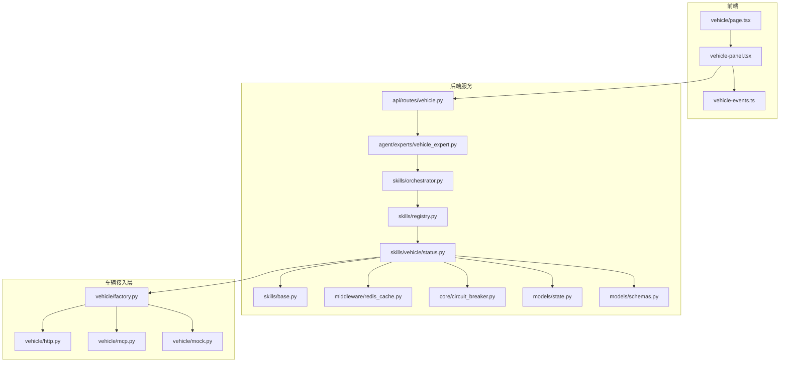
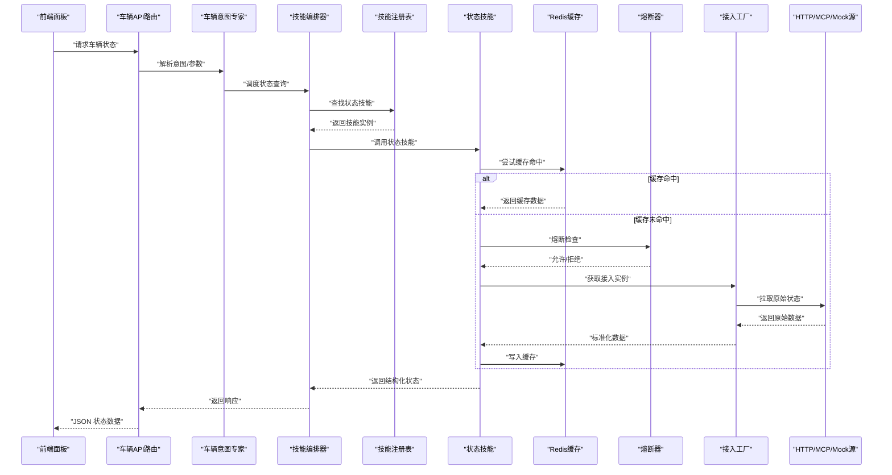
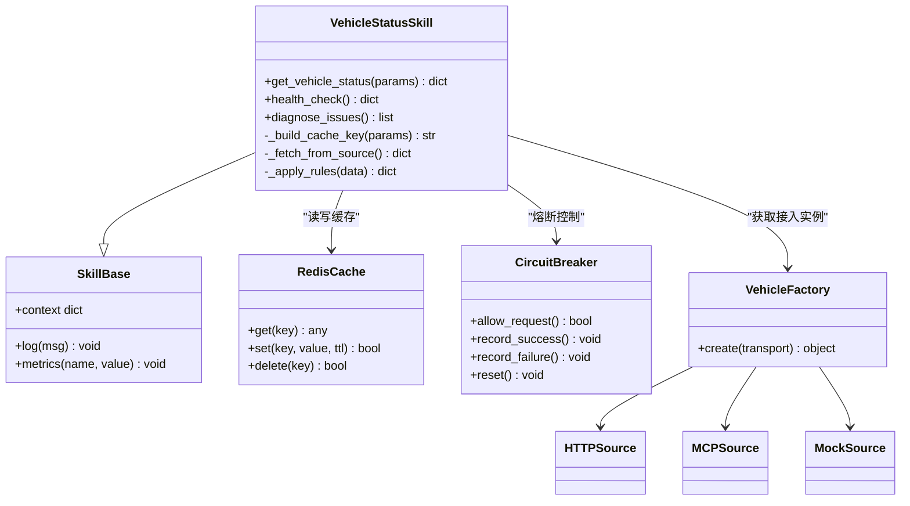
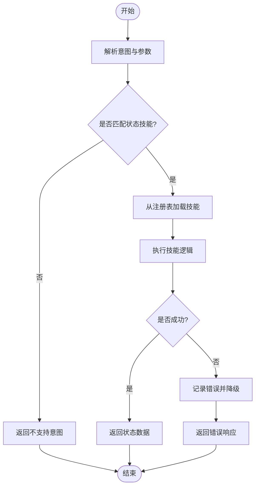
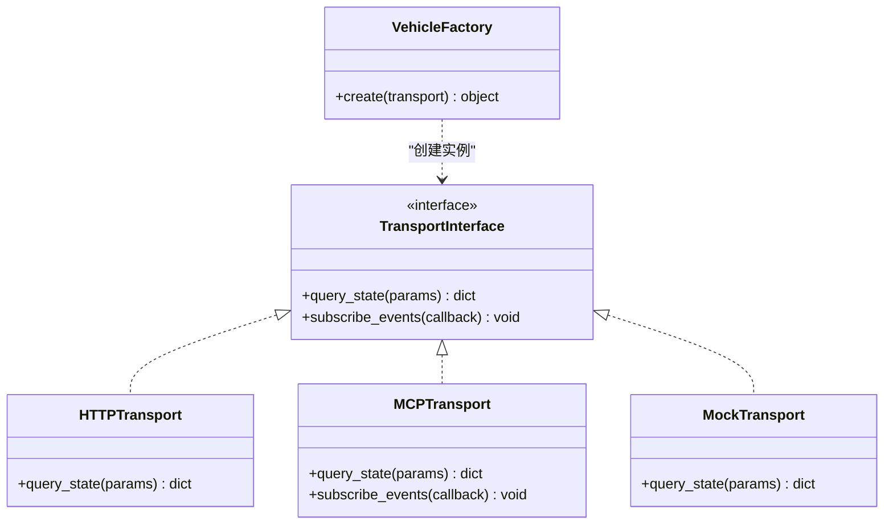
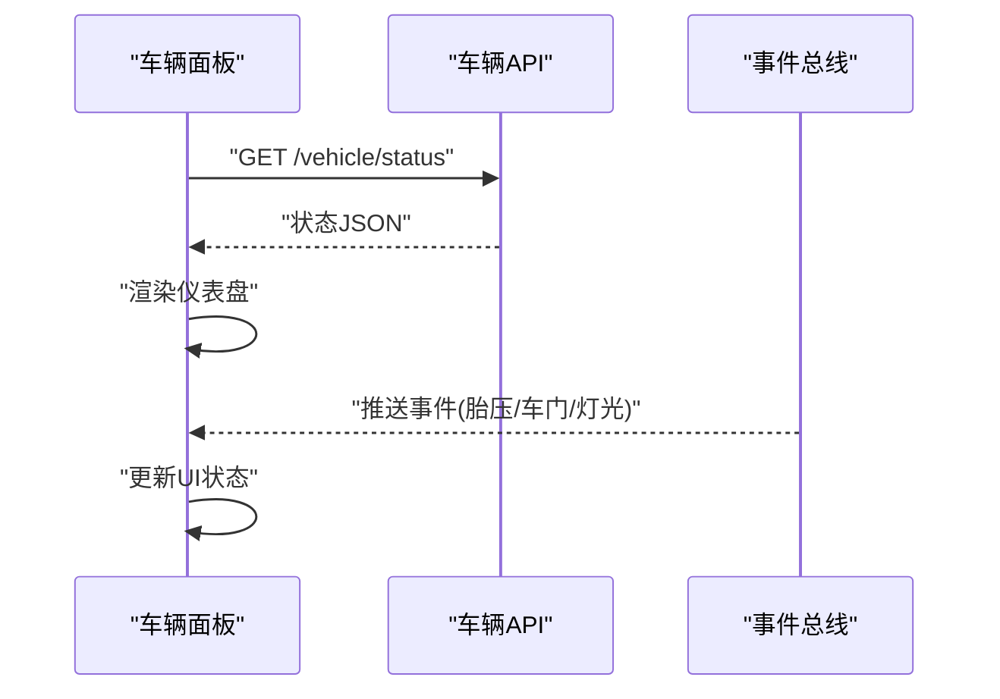
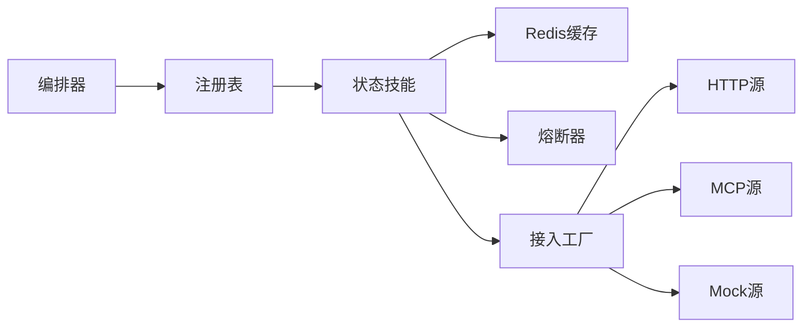
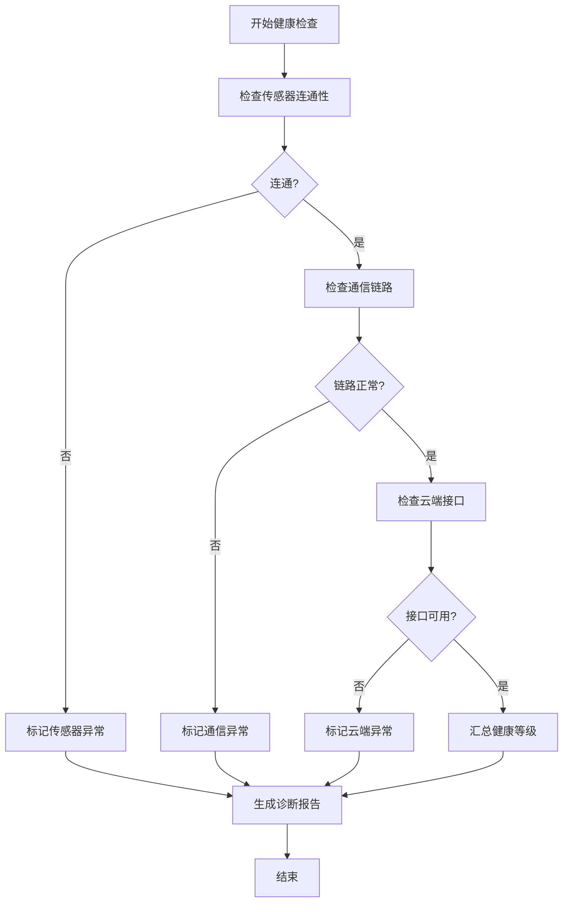

# 车辆状态查询技能

<cite>
**本文引用的文件**   
- [backend_design/nexus/skills/vehicle/status.py](file://backend_design/nexus/skills/vehicle/status.py)
- [backend_design/nexus/skills/base.py](file://backend_design/nexus/skills/base.py)
- [backend_design/nexus/skills/orchestrator.py](file://backend_design/nexus/skills/orchestrator.py)
- [backend_design/nexus/skills/registry.py](file://backend_design/nexus/skills/registry.py)
- [backend_design/nexus/api/routes/vehicle.py](file://backend_design/nexus/api/routes/vehicle.py)
- [backend_design/nexus/agent/experts/vehicle_expert.py](file://backend_design/nexus/agent/experts/vehicle_expert.py)
- [backend_design/nexus/vehicle/factory.py](file://backend_design/nexus/vehicle/factory.py)
- [backend_design/nexus/vehicle/http.py](file://backend_design/nexus/vehicle/http.py)
- [backend_design/nexus/vehicle/mcp.py](file://backend_design/nexus/vehicle/mcp.py)
- [backend_design/nexus/vehicle/mock.py](file://backend_design/nexus/vehicle/mock.py)
- [backend_design/nexus/core/circuit_breaker.py](file://backend_design/nexus/core/circuit_breaker.py)
- [backend_design/nexus/middleware/redis_cache.py](file://backend_design/nexus/middleware/redis_cache.py)
- [backend_design/nexus/models/state.py](file://backend_design/nexus/models/state.py)
- [backend_design/nexus/models/schemas.py](file://backend_design/nexus/models/schemas.py)
- [frontend_design/src/app/vehicle/page.tsx](file://frontend_design/src/app/vehicle/page.tsx)
- [frontend_design/src/components/vehicle/vehicle-panel.tsx](file://frontend_design/src/components/vehicle/vehicle-panel.tsx)
- [frontend_design/src/lib/vehicle-events.ts](file://frontend_design/src/lib/vehicle-events.ts)
</cite>

## 目录
1. [简介](#简介)
2. [项目结构](#项目结构)
3. [核心组件](#核心组件)
4. [架构总览](#架构总览)
5. [详细组件分析](#详细组件分析)
6. [依赖关系分析](#依赖关系分析)
7. [性能与缓存策略](#性能与缓存策略)
8. [告警与通知机制](#告警与通知机制)
9. [可视化与趋势分析](#可视化与趋势分析)
10. [故障诊断与健康检查](#故障诊断与健康检查)
11. [保养提醒与预测性维护](#保养提醒与预测性维护)
12. [数据同步与一致性](#数据同步与一致性)
13. [故障排查指南](#故障排查指南)
14. [结论](#结论)

## 简介
本技术文档围绕 NexusCockpit 的“车辆状态查询技能”，系统性阐述车辆状态监控体系，包括油量电量、轮胎压力、车门状态、灯光状态等关键指标；说明健康检查与故障诊断流程；描述数据采集频率与缓存策略；解释告警与通知推送；给出保养提醒与预测性维护建议；并提供前端可视化与趋势分析方法。同时涵盖性能优化与数据同步策略，帮助开发者快速理解并扩展该技能。

## 项目结构
与车辆状态查询相关的代码主要分布在以下模块：
- 技能层：skills/vehicle/status.py 实现状态查询能力，base.py 定义技能基类，orchestrator.py 负责编排调用，registry.py 注册技能。
- 路由与专家：api/routes/vehicle.py 暴露 HTTP API，agent/experts/vehicle_expert.py 将自然语言意图映射到具体技能。
- 车辆接入：vehicle/factory.py 统一创建接入实例，http.py/mcp.py/mock.py 分别对接真实车云、MCP 协议或模拟源。
- 中间件与模型：middleware/redis_cache.py 提供缓存，core/circuit_breaker.py 提供熔断保护，models/state.py 与 models/schemas.py 定义状态结构与接口契约。
- 前端展示：frontend_design/src/app/vehicle/page.tsx 页面入口，components/vehicle/vehicle-panel.tsx 面板组件，lib/vehicle-events.ts 事件总线。

图表来源
- [backend_design/nexus/api/routes/vehicle.py](file://backend_design/nexus/api/routes/vehicle.py)
- [backend_design/nexus/agent/experts/vehicle_expert.py](file://backend_design/nexus/agent/experts/vehicle_expert.py)
- [backend_design/nexus/skills/orchestrator.py](file://backend_design/nexus/skills/orchestrator.py)
- [backend_design/nexus/skills/registry.py](file://backend_design/nexus/skills/registry.py)
- [backend_design/nexus/skills/vehicle/status.py](file://backend_design/nexus/skills/vehicle/status.py)
- [backend_design/nexus/skills/base.py](file://backend_design/nexus/skills/base.py)
- [backend_design/nexus/middleware/redis_cache.py](file://backend_design/nexus/middleware/redis_cache.py)
- [backend_design/nexus/core/circuit_breaker.py](file://backend_design/nexus/core/circuit_breaker.py)
- [backend_design/nexus/models/state.py](file://backend_design/nexus/models/state.py)
- [backend_design/nexus/models/schemas.py](file://backend_design/nexus/models/schemas.py)
- [backend_design/nexus/vehicle/factory.py](file://backend_design/nexus/vehicle/factory.py)
- [backend_design/nexus/vehicle/http.py](file://backend_design/nexus/vehicle/http.py)
- [backend_design/nexus/vehicle/mcp.py](file://backend_design/nexus/vehicle/mcp.py)
- [backend_design/nexus/vehicle/mock.py](file://backend_design/nexus/vehicle/mock.py)
- [frontend_design/src/app/vehicle/page.tsx](file://frontend_design/src/app/vehicle/page.tsx)
- [frontend_design/src/components/vehicle/vehicle-panel.tsx](file://frontend_design/src/components/vehicle/vehicle-panel.tsx)
- [frontend_design/src/lib/vehicle-events.ts](file://frontend_design/src/lib/vehicle-events.ts)

章节来源
- [backend_design/nexus/skills/vehicle/status.py](file://backend_design/nexus/skills/vehicle/status.py)
- [backend_design/nexus/skills/base.py](file://backend_design/nexus/skills/base.py)
- [backend_design/nexus/skills/orchestrator.py](file://backend_design/nexus/skills/orchestrator.py)
- [backend_design/nexus/skills/registry.py](file://backend_design/nexus/skills/registry.py)
- [backend_design/nexus/api/routes/vehicle.py](file://backend_design/nexus/api/routes/vehicle.py)
- [backend_design/nexus/agent/experts/vehicle_expert.py](file://backend_design/nexus/agent/experts/vehicle_expert.py)
- [backend_design/nexus/vehicle/factory.py](file://backend_design/nexus/vehicle/factory.py)
- [backend_design/nexus/vehicle/http.py](file://backend_design/nexus/vehicle/http.py)
- [backend_design/nexus/vehicle/mcp.py](file://backend_design/nexus/vehicle/mcp.py)
- [backend_design/nexus/vehicle/mock.py](file://backend_design/nexus/vehicle/mock.py)
- [backend_design/nexus/middleware/redis_cache.py](file://backend_design/nexus/middleware/redis_cache.py)
- [backend_design/nexus/core/circuit_breaker.py](file://backend_design/nexus/core/circuit_breaker.py)
- [backend_design/nexus/models/state.py](file://backend_design/nexus/models/state.py)
- [backend_design/nexus/models/schemas.py](file://backend_design/nexus/models/schemas.py)
- [frontend_design/src/app/vehicle/page.tsx](file://frontend_design/src/app/vehicle/page.tsx)
- [frontend_design/src/components/vehicle/vehicle-panel.tsx](file://frontend_design/src/components/vehicle/vehicle-panel.tsx)
- [frontend_design/src/lib/vehicle-events.ts](file://frontend_design/src/lib/vehicle-events.ts)

## 核心组件
- 车辆状态技能（status.py）
  - 职责：聚合车辆多类状态（油电、胎压、车门、灯光等），执行健康检查与诊断，返回结构化结果。
  - 关键点：支持缓存命中优先、熔断降级、异常归一化、时间戳与版本信息。
- 技能基类（base.py）
  - 职责：定义技能通用接口、上下文传递、日志与度量埋点。
- 技能编排（orchestrator.py）
  - 职责：根据意图选择并调度对应技能，管理并发与超时。
- 技能注册（registry.py）
  - 职责：集中注册与发现技能，便于扩展与维护。
- 车辆接入工厂（factory.py + http/mcp/mock.py）
  - 职责：按配置动态选择接入方式，屏蔽底层差异。
- 缓存与熔断（redis_cache.py, circuit_breaker.py）
  - 职责：提升读取性能与稳定性，避免雪崩。
- 数据模型（state.py, schemas.py）
  - 职责：定义状态字段、校验规则与序列化格式。
- 前端展示（page.tsx, vehicle-panel.tsx, vehicle-events.ts）
  - 职责：拉取状态、渲染仪表盘、订阅实时事件。

章节来源
- [backend_design/nexus/skills/vehicle/status.py](file://backend_design/nexus/skills/vehicle/status.py)
- [backend_design/nexus/skills/base.py](file://backend_design/nexus/skills/base.py)
- [backend_design/nexus/skills/orchestrator.py](file://backend_design/nexus/skills/orchestrator.py)
- [backend_design/nexus/skills/registry.py](file://backend_design/nexus/skills/registry.py)
- [backend_design/nexus/vehicle/factory.py](file://backend_design/nexus/vehicle/factory.py)
- [backend_design/nexus/vehicle/http.py](file://backend_design/nexus/vehicle/http.py)
- [backend_design/nexus/vehicle/mcp.py](file://backend_design/nexus/vehicle/mcp.py)
- [backend_design/nexus/vehicle/mock.py](file://backend_design/nexus/nexus/vehicle/mock.py)
- [backend_design/nexus/middleware/redis_cache.py](file://backend_design/nexus/middleware/redis_cache.py)
- [backend_design/nexus/core/circuit_breaker.py](file://backend_design/nexus/core/circuit_breaker.py)
- [backend_design/nexus/models/state.py](file://backend_design/nexus/models/state.py)
- [backend_design/nexus/models/schemas.py](file://backend_design/nexus/models/schemas.py)
- [frontend_design/src/app/vehicle/page.tsx](file://frontend_design/src/app/vehicle/page.tsx)
- [frontend_design/src/components/vehicle/vehicle-panel.tsx](file://frontend_design/src/components/vehicle/vehicle-panel.tsx)
- [frontend_design/src/lib/vehicle-events.ts](file://frontend_design/src/lib/vehicle-events.ts)

## 架构总览
整体采用“前端面板 -> API 路由 -> 意图专家 -> 技能编排 -> 具体技能 -> 接入工厂 -> 车端/云端”的分层架构。通过缓存与熔断保障高可用，通过模型与模式约束保证数据一致性。

图表来源
- [backend_design/nexus/api/routes/vehicle.py](file://backend_design/nexus/api/routes/vehicle.py)
- [backend_design/nexus/agent/experts/vehicle_expert.py](file://backend_design/nexus/agent/experts/vehicle_expert.py)
- [backend_design/nexus/skills/orchestrator.py](file://backend_design/nexus/skills/orchestrator.py)
- [backend_design/nexus/skills/registry.py](file://backend_design/nexus/skills/registry.py)
- [backend_design/nexus/skills/vehicle/status.py](file://backend_design/nexus/skills/vehicle/status.py)
- [backend_design/nexus/middleware/redis_cache.py](file://backend_design/nexus/middleware/redis_cache.py)
- [backend_design/nexus/core/circuit_breaker.py](file://backend_design/nexus/core/circuit_breaker.py)
- [backend_design/nexus/vehicle/factory.py](file://backend_design/nexus/vehicle/factory.py)
- [backend_design/nexus/vehicle/http.py](file://backend_design/nexus/vehicle/http.py)
- [backend_design/nexus/vehicle/mcp.py](file://backend_design/nexus/vehicle/mcp.py)
- [backend_design/nexus/vehicle/mock.py](file://backend_design/nexus/vehicle/mock.py)

## 详细组件分析

### 车辆状态技能（status.py）
- 功能要点
  - 聚合多类状态：油电、胎压、车门、灯光等。
  - 健康检查：逐项检测子系统可用性，汇总健康等级。
  - 故障诊断：基于阈值与规则生成诊断结论与建议。
  - 缓存策略：按车辆ID与查询维度生成键，设置过期时间。
  - 熔断保护：在下游不可用时快速失败，避免级联故障。
- 数据结构
  - 使用 state.py 中的状态模型进行序列化与校验。
  - 遵循 schemas.py 定义的输入输出契约。
- 错误处理
  - 捕获网络/协议异常，转换为统一错误码与消息。
  - 记录关键路径日志，便于追踪。

图表来源
- [backend_design/nexus/skills/vehicle/status.py](file://backend_design/nexus/skills/vehicle/status.py)
- [backend_design/nexus/skills/base.py](file://backend_design/nexus/skills/base.py)
- [backend_design/nexus/middleware/redis_cache.py](file://backend_design/nexus/middleware/redis_cache.py)
- [backend_design/nexus/core/circuit_breaker.py](file://backend_design/nexus/core/circuit_breaker.py)
- [backend_design/nexus/vehicle/factory.py](file://backend_design/nexus/vehicle/factory.py)
- [backend_design/nexus/vehicle/http.py](file://backend_design/nexus/vehicle/http.py)
- [backend_design/nexus/vehicle/mcp.py](file://backend_design/nexus/vehicle/mcp.py)
- [backend_design/nexus/vehicle/mock.py](file://backend_design/nexus/vehicle/mock.py)

章节来源
- [backend_design/nexus/skills/vehicle/status.py](file://backend_design/nexus/skills/vehicle/status.py)
- [backend_design/nexus/skills/base.py](file://backend_design/nexus/skills/base.py)
- [backend_design/nexus/middleware/redis_cache.py](file://backend_design/nexus/middleware/redis_cache.py)
- [backend_design/nexus/core/circuit_breaker.py](file://backend_design/nexus/core/circuit_breaker.py)
- [backend_design/nexus/vehicle/factory.py](file://backend_design/nexus/vehicle/factory.py)
- [backend_design/nexus/vehicle/http.py](file://backend_design/nexus/vehicle/http.py)
- [backend_design/nexus/vehicle/mcp.py](file://backend_design/nexus/vehicle/mcp.py)
- [backend_design/nexus/vehicle/mock.py](file://backend_design/nexus/vehicle/mock.py)

### 技能编排与注册（orchestrator.py, registry.py）
- 编排器
  - 根据意图识别结果选择目标技能，管理并发与超时。
  - 对异常进行兜底处理，返回友好错误。
- 注册表
  - 集中维护技能名称到实现的映射，支持热插拔。

图表来源
- [backend_design/nexus/skills/orchestrator.py](file://backend_design/nexus/skills/orchestrator.py)
- [backend_design/nexus/skills/registry.py](file://backend_design/nexus/skills/registry.py)

章节来源
- [backend_design/nexus/skills/orchestrator.py](file://backend_design/nexus/skills/orchestrator.py)
- [backend_design/nexus/skills/registry.py](file://backend_design/nexus/skills/registry.py)

### 车辆接入层（factory.py, http.py, mcp.py, mock.py）
- 工厂模式
  - 根据配置选择 HTTP、MCP 或 Mock 源，统一抽象为可替换的传输层。
- 传输差异
  - HTTP：REST 风格接口，需处理鉴权与重试。
  - MCP：基于消息协议的通道，适合低延迟与双向通信。
  - Mock：用于开发与测试，提供稳定数据。

图表来源
- [backend_design/nexus/vehicle/factory.py](file://backend_design/nexus/vehicle/factory.py)
- [backend_design/nexus/vehicle/http.py](file://backend_design/nexus/vehicle/http.py)
- [backend_design/nexus/vehicle/mcp.py](file://backend_design/nexus/vehicle/mcp.py)
- [backend_design/nexus/vehicle/mock.py](file://backend_design/nexus/vehicle/mock.py)

章节来源
- [backend_design/nexus/vehicle/factory.py](file://backend_design/nexus/vehicle/factory.py)
- [backend_design/nexus/vehicle/http.py](file://backend_design/nexus/vehicle/http.py)
- [backend_design/nexus/vehicle/mcp.py](file://backend_design/nexus/vehicle/mcp.py)
- [backend_design/nexus/vehicle/mock.py](file://backend_design/nexus/vehicle/mock.py)

### 数据模型与接口契约（state.py, schemas.py）
- 状态模型
  - 包含油电百分比、剩余里程、胎压值、车门开闭、灯光开关等字段。
  - 提供时间戳、版本号与来源标识，便于溯源。
- 接口契约
  - 定义请求参数、响应结构与错误码，确保前后端一致。

章节来源
- [backend_design/nexus/models/state.py](file://backend_design/nexus/models/state.py)
- [backend_design/nexus/models/schemas.py](file://backend_design/nexus/models/schemas.py)

### 前端展示与事件（page.tsx, vehicle-panel.tsx, vehicle-events.ts）
- 页面与面板
  - 拉取状态数据，渲染仪表盘卡片与列表。
- 事件总线
  - 订阅车辆事件（如胎压报警、车门打开），实时更新 UI。

图表来源
- [frontend_design/src/app/vehicle/page.tsx](file://frontend_design/src/app/vehicle/page.tsx)
- [frontend_design/src/components/vehicle/vehicle-panel.tsx](file://frontend_design/src/components/vehicle/vehicle-panel.tsx)
- [frontend_design/src/lib/vehicle-events.ts](file://frontend_design/src/lib/vehicle-events.ts)

章节来源
- [frontend_design/src/app/vehicle/page.tsx](file://frontend_design/src/app/vehicle/page.tsx)
- [frontend_design/src/components/vehicle/vehicle-panel.tsx](file://frontend_design/src/components/vehicle/vehicle-panel.tsx)
- [frontend_design/src/lib/vehicle-events.ts](file://frontend_design/src/lib/vehicle-events.ts)

## 依赖关系分析
- 耦合与内聚
  - 状态技能依赖缓存、熔断与接入工厂，内聚于单一职责。
  - 编排器与注册表松耦合，便于扩展新技能。
- 外部依赖
  - Redis 用于缓存，HTTP/MCP 用于远程通信，Mock 用于本地调试。
- 潜在循环依赖
  - 当前分层清晰，未见直接循环引用。

图表来源
- [backend_design/nexus/skills/vehicle/status.py](file://backend_design/nexus/skills/vehicle/status.py)
- [backend_design/nexus/middleware/redis_cache.py](file://backend_design/nexus/middleware/redis_cache.py)
- [backend_design/nexus/core/circuit_breaker.py](file://backend_design/nexus/core/circuit_breaker.py)
- [backend_design/nexus/vehicle/factory.py](file://backend_design/nexus/vehicle/factory.py)
- [backend_design/nexus/vehicle/http.py](file://backend_design/nexus/vehicle/http.py)
- [backend_design/nexus/vehicle/mcp.py](file://backend_design/nexus/vehicle/mcp.py)
- [backend_design/nexus/vehicle/mock.py](file://backend_design/nexus/vehicle/mock.py)
- [backend_design/nexus/skills/orchestrator.py](file://backend_design/nexus/skills/orchestrator.py)
- [backend_design/nexus/skills/registry.py](file://backend_design/nexus/skills/registry.py)

章节来源
- [backend_design/nexus/skills/vehicle/status.py](file://backend_design/nexus/skills/vehicle/status.py)
- [backend_design/nexus/middleware/redis_cache.py](file://backend_design/nexus/middleware/redis_cache.py)
- [backend_design/nexus/core/circuit_breaker.py](file://backend_design/nexus/core/circuit_breaker.py)
- [backend_design/nexus/vehicle/factory.py](file://backend_design/nexus/vehicle/factory.py)
- [backend_design/nexus/vehicle/http.py](file://backend_design/nexus/vehicle/http.py)
- [backend_design/nexus/vehicle/mcp.py](file://backend_design/nexus/vehicle/mcp.py)
- [backend_design/nexus/vehicle/mock.py](file://backend_design/nexus/vehicle/mock.py)
- [backend_design/nexus/skills/orchestrator.py](file://backend_design/nexus/skills/orchestrator.py)
- [backend_design/nexus/skills/registry.py](file://backend_design/nexus/skills/registry.py)

## 性能与缓存策略
- 采集频率
  - 默认低频轮询（例如分钟级），高频场景可按需调整。
- 缓存策略
  - 键设计：包含车辆ID、查询维度与时间窗口。
  - TTL：根据数据新鲜度要求设置合理过期时间。
  - 穿透防护：空结果也缓存短TTL，防止热点击穿。
- 熔断与限流
  - 熔断：连续失败达到阈值后快速失败，周期性探测恢复。
  - 限流：对热点接口进行速率限制，保护下游。
- 前端优化
  - 去抖与节流：减少重复请求。
  - 增量更新：仅更新变化字段，降低渲染开销。

章节来源
- [backend_design/nexus/middleware/redis_cache.py](file://backend_design/nexus/middleware/redis_cache.py)
- [backend_design/nexus/core/circuit_breaker.py](file://backend_design/nexus/core/circuit_breaker.py)
- [frontend_design/src/components/vehicle/vehicle-panel.tsx](file://frontend_design/src/components/vehicle/vehicle-panel.tsx)

## 告警与通知机制
- 告警规则
  - 阈值触发：如胎压低于下限、车门长时间未关闭、灯光异常。
  - 趋势预警：如电量持续下降且无充电行为。
- 通知渠道
  - 前端弹窗与声音提示。
  - 可选推送至移动端或工作群（可扩展）。
- 降噪策略
  - 合并同类告警，抑制抖动。
  - 分级告警：提示、警告、严重。

章节来源
- [backend_design/nexus/skills/vehicle/status.py](file://backend_design/nexus/skills/vehicle/status.py)
- [frontend_design/src/lib/vehicle-events.ts](file://frontend_design/src/lib/vehicle-events.ts)

## 可视化与趋势分析
- 仪表盘
  - 油电进度条、胎压环形图、车门/灯光状态卡片。
- 趋势图
  - 电量/油耗随时间曲线，胎压波动折线。
- 交互
  - 时间范围选择、筛选条件、导出报表。
- 数据来源
  - 历史状态持久化后可供趋势分析（可扩展存储层）。

章节来源
- [frontend_design/src/app/vehicle/page.tsx](file://frontend_design/src/app/vehicle/page.tsx)
- [frontend_design/src/components/vehicle/vehicle-panel.tsx](file://frontend_design/src/components/vehicle/vehicle-panel.tsx)

## 故障诊断与健康检查
- 健康检查
  - 逐项检测子系统：传感器、通信链路、云端接口。
  - 汇总健康等级：正常、亚健康、异常。
- 故障诊断
  - 规则引擎：基于阈值与组合条件定位问题。
  - 建议措施：给出用户可操作建议或维修指引。
- 可观测性
  - 关键指标上报，便于监控与排障。

图表来源
- [backend_design/nexus/skills/vehicle/status.py](file://backend_design/nexus/skills/vehicle/status.py)

章节来源
- [backend_design/nexus/skills/vehicle/status.py](file://backend_design/nexus/skills/vehicle/status.py)

## 保养提醒与预测性维护
- 保养提醒
  - 基于里程/时间触发：机油更换、轮胎换位、刹车片检查。
  - 结合驾驶习惯与路况数据个性化推荐。
- 预测性维护
  - 利用趋势与异常模式预测部件寿命。
  - 提前生成维护计划与备件清单。

章节来源
- [backend_design/nexus/skills/vehicle/status.py](file://backend_design/nexus/skills/vehicle/status.py)

## 数据同步与一致性
- 同步策略
  - 主动拉取：定时任务刷新状态。
  - 被动推送：MCP 事件驱动更新。
- 一致性保障
  - 版本号与时间戳比对，避免脏读。
  - 冲突解决：以最新时间戳为准。
- 离线容错
  - 本地缓存兜底，网络恢复后增量同步。

章节来源
- [backend_design/nexus/vehicle/mcp.py](file://backend_design/nexus/vehicle/mcp.py)
- [backend_design/nexus/middleware/redis_cache.py](file://backend_design/nexus/middleware/redis_cache.py)

## 故障排查指南
- 常见问题
  - 缓存未命中：检查键设计与TTL。
  - 熔断频繁：查看下游错误率与超时配置。
  - 数据不一致：核对版本号与时间戳。
- 定位步骤
  - 查看接口日志与指标。
  - 复现最小用例，隔离问题域。
  - 切换 Mock 源验证链路。
- 工具与脚本
  - 使用测试脚本验证 API 与缓存。
  - 启用调试日志，收集关键上下文。

章节来源
- [backend_design/nexus/middleware/redis_cache.py](file://backend_design/nexus/middleware/redis_cache.py)
- [backend_design/nexus/core/circuit_breaker.py](file://backend_design/nexus/core/circuit_breaker.py)
- [backend_design/nexus/vehicle/mock.py](file://backend_design/nexus/vehicle/mock.py)

## 结论
车辆状态查询技能通过分层架构、缓存与熔断、统一接入与模型契约，实现了高可用、可扩展的状态监控与诊断能力。配合前端可视化与事件推送，为用户提供实时、直观的车辆健康视图。未来可进一步引入更丰富的预测性维护算法与多源数据融合，持续提升用户体验与系统可靠性。