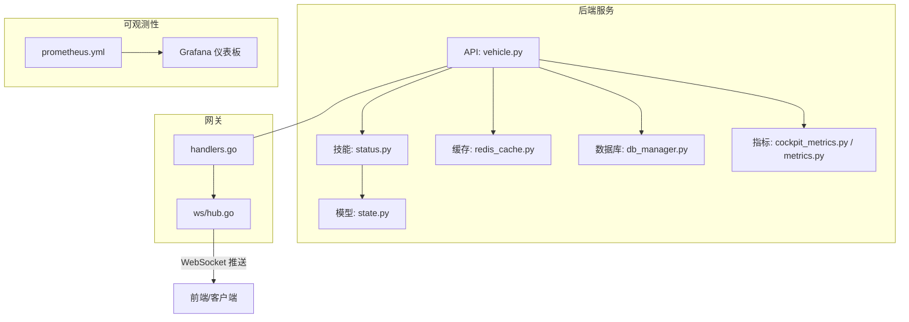
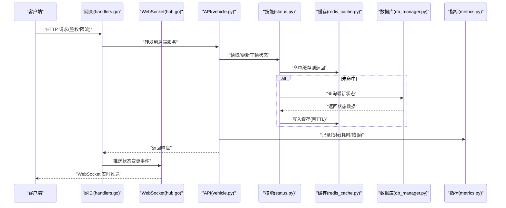
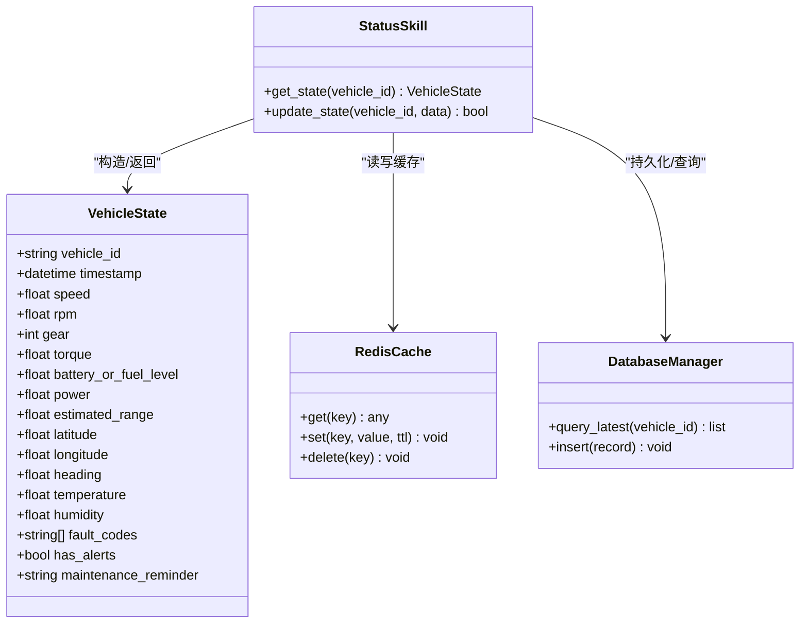
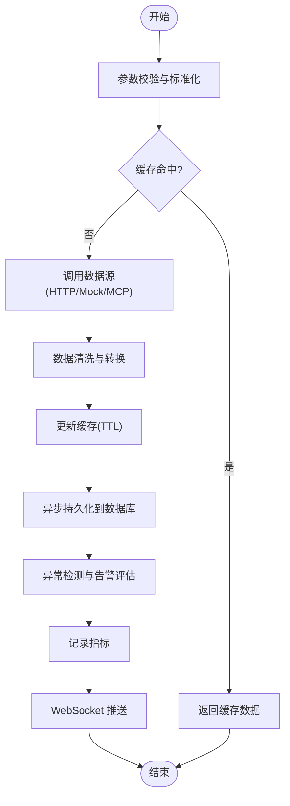
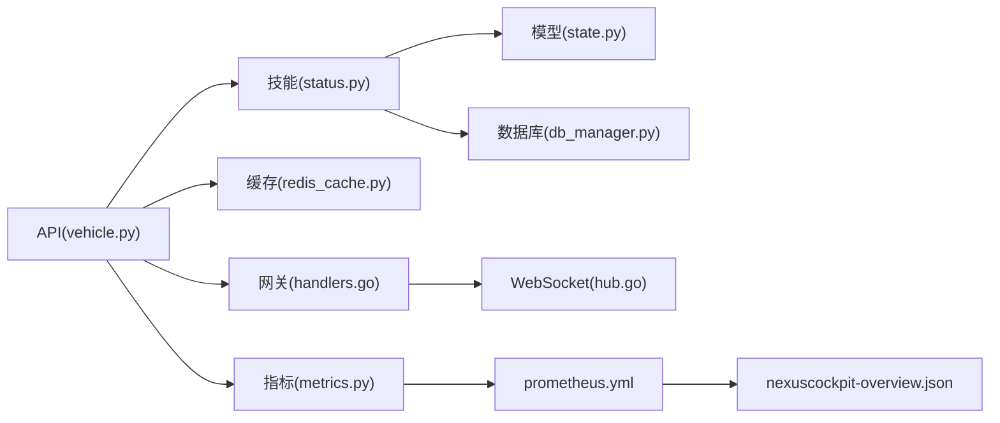

# 车辆状态监控

<cite>
**本文引用的文件**   
- [backend_design/nexus/api/routes/vehicle.py](file://backend_design/nexus/api/routes/vehicle.py)
- [backend_design/nexus/skills/vehicle/status.py](file://backend_design/nexus/skills/vehicle/status.py)
- [backend_design/nexus/models/state.py](file://backend_design/nexus/models/state.py)
- [backend_design/nexus/middleware/redis_cache.py](file://backend_design/nexus/middleware/redis_cache.py)
- [backend_design/nexus/observability/cockpit_metrics.py](file://backend_design/nexus/observability/cockpit_metrics.py)
- [backend_design/nexus/observability/metrics.py](file://backend_design/nexus/observability/metrics.py)
- [backend_design/nexus/core/db_manager.py](file://backend_design/nexus/core/db_manager.py)
- [backend_design/nexus/config.py](file://backend_design/nexus/config.py)
- [backend_design/nexus/main.py](file://backend_design/nexus/main.py)
- [backend_design/nexus_gate/internal/handlers/handlers.go](file://backend_design/nexus_gate/internal/handlers/handlers.go)
- [backend_design/nexus_gate/internal/ws/hub.go](file://backend_design/nexus_gate/internal/ws/hub.go)
- [config/prometheus/prometheus.yml](file://config/prometheus/prometheus.yml)
- [config/grafana/provisioning/dashboards/nexuscockpit-overview.json](file://config/grafana/provisioning/dashboards/nexuscockpit-overview.json)
</cite>

## 目录
1. [简介](#简介)
2. [项目结构](#项目结构)
3. [核心组件](#核心组件)
4. [架构总览](#架构总览)
5. [详细组件分析](#详细组件分析)
6. [依赖关系分析](#依赖关系分析)
7. [性能考虑](#性能考虑)
8. [故障排查指南](#故障排查指南)
9. [结论](#结论)
10. [附录](#附录)

## 简介
本技术文档面向“车辆状态监控系统”，聚焦以下目标：
- 实时数据采集的架构设计与数据流处理
- 车辆状态模型定义与字段含义
- 异常检测算法与告警触发机制
- 状态缓存策略与性能优化方案
- 监控指标的定义与采集方法
- 历史数据存储、查询接口与分析工具使用指南

系统由后端服务（Python）、网关（Go）与前端组成，结合 Redis 缓存、数据库持久化与 Prometheus/Grafana 可观测性体系，提供高吞吐、低延迟的车辆状态接入、处理、缓存、存储与可视化能力。

## 项目结构
与车辆状态监控相关的关键目录与文件：
- API 层：接收并路由车辆状态请求
- 技能层：封装车辆状态获取与解析逻辑
- 模型层：定义状态数据结构
- 中间件层：Redis 缓存与会话管理
- 可观测性：指标采集与导出
- 网关层：WebSocket 推送与鉴权限流
- 配置与部署：Prometheus/Grafana 集成

图表来源
- [backend_design/nexus/api/routes/vehicle.py](file://backend_design/nexus/api/routes/vehicle.py)
- [backend_design/nexus/skills/vehicle/status.py](file://backend_design/nexus/skills/vehicle/status.py)
- [backend_design/nexus/models/state.py](file://backend_design/nexus/models/state.py)
- [backend_design/nexus/middleware/redis_cache.py](file://backend_design/nexus/middleware/redis_cache.py)
- [backend_design/nexus/observability/cockpit_metrics.py](file://backend_design/nexus/observability/cockpit_metrics.py)
- [backend_design/nexus/observability/metrics.py](file://backend_design/nexus/observability/metrics.py)
- [backend_design/nexus/core/db_manager.py](file://backend_design/nexus/core/db_manager.py)
- [backend_design/nexus_gate/internal/handlers/handlers.go](file://backend_design/nexus_gate/internal/handlers/handlers.go)
- [backend_design/nexus_gate/internal/ws/hub.go](file://backend_design/nexus_gate/internal/ws/hub.go)
- [config/prometheus/prometheus.yml](file://config/prometheus/prometheus.yml)
- [config/grafana/provisioning/dashboards/nexuscockpit-overview.json](file://config/grafana/provisioning/dashboards/nexuscockpit-overview.json)

章节来源
- [backend_design/nexus/main.py](file://backend_design/nexus/main.py)
- [backend_design/nexus/config.py](file://backend_design/nexus/config.py)

## 核心组件
- 车辆状态 API：提供查询与上报接口，统一入口
- 车辆状态技能：封装具体状态源（HTTP/Mock/MCP）的调用与结果归一化
- 状态模型：定义字段语义、类型与校验规则
- 缓存中间件：基于 Redis 的状态缓存与过期策略
- 指标与可观测性：暴露运行时指标，支持 Prometheus 抓取
- 网关与 WebSocket：实现实时推送与鉴权限流
- 数据库与持久化：历史数据落库与查询

章节来源
- [backend_design/nexus/api/routes/vehicle.py](file://backend_design/nexus/api/routes/vehicle.py)
- [backend_design/nexus/skills/vehicle/status.py](file://backend_design/nexus/skills/vehicle/status.py)
- [backend_design/nexus/models/state.py](file://backend_design/nexus/models/state.py)
- [backend_design/nexus/middleware/redis_cache.py](file://backend_design/nexus/middleware/redis_cache.py)
- [backend_design/nexus/observability/cockpit_metrics.py](file://backend_design/nexus/observability/cockpit_metrics.py)
- [backend_design/nexus/observability/metrics.py](file://backend_design/nexus/observability/metrics.py)
- [backend_design/nexus/core/db_manager.py](file://backend_design/nexus/core/db_manager.py)
- [backend_design/nexus_gate/internal/handlers/handlers.go](file://backend_design/nexus_gate/internal/handlers/handlers.go)
- [backend_design/nexus_gate/internal/ws/hub.go](file://backend_design/nexus_gate/internal/ws/hub.go)

## 架构总览
整体数据流从“采集 -> 处理 -> 缓存 -> 存储 -> 展示”形成闭环，同时通过网关进行实时推送与鉴权限流。

图表来源
- [backend_design/nexus/api/routes/vehicle.py](file://backend_design/nexus/api/routes/vehicle.py)
- [backend_design/nexus/skills/vehicle/status.py](file://backend_design/nexus/skills/vehicle/status.py)
- [backend_design/nexus/middleware/redis_cache.py](file://backend_design/nexus/middleware/redis_cache.py)
- [backend_design/nexus/core/db_manager.py](file://backend_design/nexus/core/db_manager.py)
- [backend_design/nexus/observability/metrics.py](file://backend_design/nexus/observability/metrics.py)
- [backend_design/nexus_gate/internal/handlers/handlers.go](file://backend_design/nexus_gate/internal/handlers/handlers.go)
- [backend_design/nexus_gate/internal/ws/hub.go](file://backend_design/nexus_gate/internal/ws/hub.go)

## 详细组件分析

### 车辆状态模型与字段定义
- 目的：统一描述车辆当前运行状态，包括动力、能耗、位置、环境等维度
- 关键字段建议（示例说明，具体以代码为准）：
  - 标识类：车辆ID、时间戳、版本
  - 动力类：车速、转速、档位、扭矩
  - 能耗类：电量/油量、功率、续航估算
  - 位置类：经纬度、航向、速度矢量
  - 环境类：温度、湿度、空气质量
  - 健康类：故障码、告警标志、维护提醒
- 数据来源：技能层根据配置选择 HTTP/Mock/MCP 等适配器
- 校验与转换：在模型层进行类型校验、单位换算、缺失值填充

章节来源
- [backend_design/nexus/models/state.py](file://backend_design/nexus/models/state.py)
- [backend_design/nexus/skills/vehicle/status.py](file://backend_design/nexus/skills/vehicle/status.py)

#### 类图（概念映射）

图表来源
- [backend_design/nexus/models/state.py](file://backend_design/nexus/models/state.py)
- [backend_design/nexus/skills/vehicle/status.py](file://backend_design/nexus/skills/vehicle/status.py)
- [backend_design/nexus/middleware/redis_cache.py](file://backend_design/nexus/middleware/redis_cache.py)
- [backend_design/nexus/core/db_manager.py](file://backend_design/nexus/core/db_manager.py)

### 实时数据采集与数据流处理
- 采集入口：API 层暴露统一接口，支持批量与增量上报
- 处理流程：
  - 参数校验与标准化
  - 缓存优先：若命中有效缓存则直接返回
  - 未命中时访问数据源（HTTP/Mock/MCP），并进行数据清洗与转换
  - 写入缓存并异步持久化至数据库
  - 触发指标统计与告警评估
- 实时推送：网关将状态变更事件通过 WebSocket 推送给前端

图表来源
- [backend_design/nexus/api/routes/vehicle.py](file://backend_design/nexus/api/routes/vehicle.py)
- [backend_design/nexus/skills/vehicle/status.py](file://backend_design/nexus/skills/vehicle/status.py)
- [backend_design/nexus/middleware/redis_cache.py](file://backend_design/nexus/middleware/redis_cache.py)
- [backend_design/nexus/core/db_manager.py](file://backend_design/nexus/core/db_manager.py)
- [backend_design/nexus/observability/metrics.py](file://backend_design/nexus/observability/metrics.py)
- [backend_design/nexus_gate/internal/ws/hub.go](file://backend_design/nexus_gate/internal/ws/hub.go)

章节来源
- [backend_design/nexus/api/routes/vehicle.py](file://backend_design/nexus/api/routes/vehicle.py)
- [backend_design/nexus/skills/vehicle/status.py](file://backend_design/nexus/skills/vehicle/status.py)
- [backend_design/nexus/middleware/redis_cache.py](file://backend_design/nexus/middleware/redis_cache.py)
- [backend_design/nexus/core/db_manager.py](file://backend_design/nexus/core/db_manager.py)
- [backend_design/nexus/observability/metrics.py](file://backend_design/nexus/observability/metrics.py)
- [backend_design/nexus_gate/internal/ws/hub.go](file://backend_design/nexus_gate/internal/ws/hub.go)

### 异常检测算法与告警触发机制
- 检测维度：
  - 阈值越界：如车速、温度、电量等超过安全范围
  - 趋势异常：短时波动或持续恶化
  - 组合条件：多字段联合判断（如高转速+低油量）
- 触发策略：
  - 立即告警：严重异常即时推送
  - 延时告警：持续一定时间窗口后触发，避免抖动
  - 抑制与去抖：相同告警合并与冷却期
- 输出形式：
  - 结构化告警事件（包含车辆ID、时间、级别、原因）
  - 指标与日志埋点，便于追踪与回放

章节来源
- [backend_design/nexus/skills/vehicle/status.py](file://backend_design/nexus/skills/vehicle/status.py)
- [backend_design/nexus/observability/cockpit_metrics.py](file://backend_design/nexus/observability/cockpit_metrics.py)

### 状态缓存策略与性能优化
- 缓存键设计：按车辆ID与时间粒度生成唯一键
- TTL 策略：短周期高频字段设置较短过期时间，长周期低频字段较长
- 一致性保障：写穿透与失效策略，保证读多写少场景下的正确性
- 并发控制：分布式锁或原子操作避免缓存击穿
- 降级策略：缓存不可用时回退到直连数据源，并记录降级指标

章节来源
- [backend_design/nexus/middleware/redis_cache.py](file://backend_design/nexus/middleware/redis_cache.py)
- [backend_design/nexus/config.py](file://backend_design/nexus/config.py)

### 监控指标定义与采集方法
- 指标类别：
  - 业务指标：状态读取成功率、告警数量、推送延迟
  - 系统指标：CPU/内存、GC、连接池、缓存命中率
  - 链路指标：API 耗时、网关转发耗时、WebSocket 连接数
- 采集方式：
  - 应用内埋点：在关键路径记录指标
  - 中间件自动采集：请求/响应生命周期钩子
  - 外部抓取：Prometheus 定期拉取 /metrics 端点
- 可视化：
  - Grafana 仪表板聚合展示，支持告警规则与阈值

章节来源
- [backend_design/nexus/observability/cockpit_metrics.py](file://backend_design/nexus/observability/cockpit_metrics.py)
- [backend_design/nexus/observability/metrics.py](file://backend_design/nexus/observability/metrics.py)
- [config/prometheus/prometheus.yml](file://config/prometheus/prometheus.yml)
- [config/grafana/provisioning/dashboards/nexuscockpit-overview.json](file://config/grafana/provisioning/dashboards/nexuscockpit-overview.json)

### 历史数据存储与查询接口
- 存储策略：
  - 时序表：按时间分区，支持高效范围查询
  - 冷热分层：近期热数据保留在高性能存储，历史冷数据归档
- 查询接口：
  - 按车辆ID与时间范围检索
  - 聚合查询：均值、峰值、分位数
  - 过滤与排序：按字段筛选与分页
- 数据治理：
  - 数据完整性校验
  - 重复数据去重
  - 索引优化：时间戳、车辆ID复合索引

章节来源
- [backend_design/nexus/core/db_manager.py](file://backend_design/nexus/core/db_manager.py)

### 网关与 WebSocket 实时推送
- 鉴权与限流：
  - JWT 鉴权，确保请求合法性
  - 令牌桶/漏桶限流，保护后端资源
- 推送机制：
  - 状态变更后广播给订阅者
  - 断线重连与心跳保活
  - 消息去重与顺序保证

章节来源
- [backend_design/nexus_gate/internal/handlers/handlers.go](file://backend_design/nexus_gate/internal/handlers/handlers.go)
- [backend_design/nexus_gate/internal/ws/hub.go](file://backend_design/nexus_gate/internal/ws/hub.go)

## 依赖关系分析
- 模块耦合：
  - API 层依赖技能层与缓存中间件
  - 技能层依赖模型与数据源适配器
  - 可观测性贯穿各层，提供统一指标出口
- 外部依赖：
  - Redis：缓存与会话
  - 数据库：持久化与查询
  - Prometheus/Grafana：监控与可视化
  - WebSocket：实时通信

图表来源
- [backend_design/nexus/api/routes/vehicle.py](file://backend_design/nexus/api/routes/vehicle.py)
- [backend_design/nexus/skills/vehicle/status.py](file://backend_design/nexus/skills/vehicle/status.py)
- [backend_design/nexus/models/state.py](file://backend_design/nexus/models/state.py)
- [backend_design/nexus/middleware/redis_cache.py](file://backend_design/nexus/middleware/redis_cache.py)
- [backend_design/nexus/core/db_manager.py](file://backend_design/nexus/core/db_manager.py)
- [backend_design/nexus/observability/metrics.py](file://backend_design/nexus/observability/metrics.py)
- [backend_design/nexus_gate/internal/handlers/handlers.go](file://backend_design/nexus_gate/internal/handlers/handlers.go)
- [backend_design/nexus_gate/internal/ws/hub.go](file://backend_design/nexus_gate/internal/ws/hub.go)
- [config/prometheus/prometheus.yml](file://config/prometheus/prometheus.yml)
- [config/grafana/provisioning/dashboards/nexuscockpit-overview.json](file://config/grafana/provisioning/dashboards/nexuscockpit-overview.json)

章节来源
- [backend_design/nexus/main.py](file://backend_design/nexus/main.py)
- [backend_design/nexus/config.py](file://backend_design/nexus/config.py)

## 性能考虑
- 缓存命中率优化：合理设置 TTL 与键空间，减少热点键竞争
- 异步持久化：非阻塞写入，降低主路径延迟
- 连接池与批处理：数据库与外部服务采用连接复用与批量提交
- 指标采样：对高频指标进行采样降频，避免采集开销过大
- 网关扩容：水平扩展实例，配合负载均衡提升吞吐

[本节为通用指导，不直接分析具体文件]

## 故障排查指南
- 常见问题定位：
  - 缓存不可用：检查 Redis 连通性与权限
  - 指标缺失：确认 /metrics 端点可达与 Prometheus 抓取配置
  - WebSocket 断开：检查心跳与重连逻辑
  - 告警风暴：启用抑制与冷却期，合并同类告警
- 诊断手段：
  - 查看应用日志与链路追踪
  - 使用 Grafana 仪表板观察指标趋势
  - 复现问题并回放历史数据

章节来源
- [backend_design/nexus/observability/cockpit_metrics.py](file://backend_design/nexus/observability/cockpit_metrics.py)
- [backend_design/nexus/observability/metrics.py](file://backend_design/nexus/observability/metrics.py)
- [config/prometheus/prometheus.yml](file://config/prometheus/prometheus.yml)
- [config/grafana/provisioning/dashboards/nexuscockpit-overview.json](file://config/grafana/provisioning/dashboards/nexuscockpit-overview.json)

## 结论
本系统通过清晰的层次划分与模块化设计，实现了车辆状态的实时采集、处理、缓存、存储与可视化。借助网关的鉴权限流与 WebSocket 推送，以及 Prometheus/Grafana 的可观测性体系，系统在性能、可靠性与可维护性方面具备良好基础。后续可进一步引入更丰富的异常检测算法与智能告警策略，以提升运维效率与用户体验。

[本节为总结性内容，不直接分析具体文件]

## 附录
- 配置项参考：
  - 缓存 TTL、连接池大小、限流阈值等可在配置文件中调整
- 部署与验证：
  - 启动后端服务与网关，确认指标端点与 WebSocket 通道正常
  - 使用 Grafana 仪表板验证数据展示与告警规则生效

章节来源
- [backend_design/nexus/config.py](file://backend_design/nexus/config.py)
- [backend_design/nexus/main.py](file://backend_design/nexus/main.py)
- [config/prometheus/prometheus.yml](file://config/prometheus/prometheus.yml)
- [config/grafana/provisioning/dashboards/nexuscockpit-overview.json](file://config/grafana/provisioning/dashboards/nexuscockpit-overview.json)