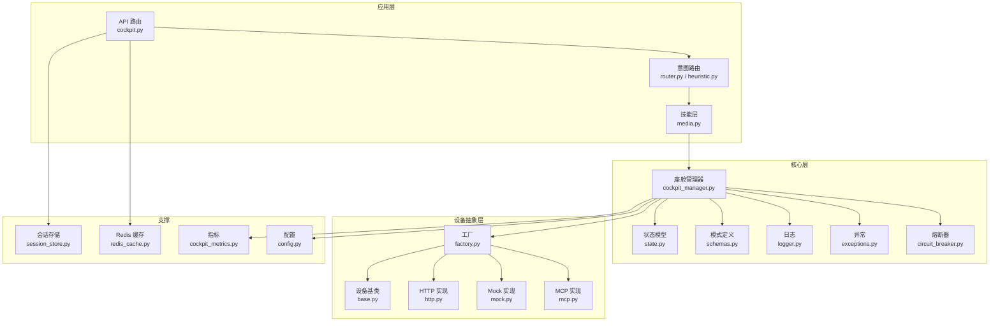
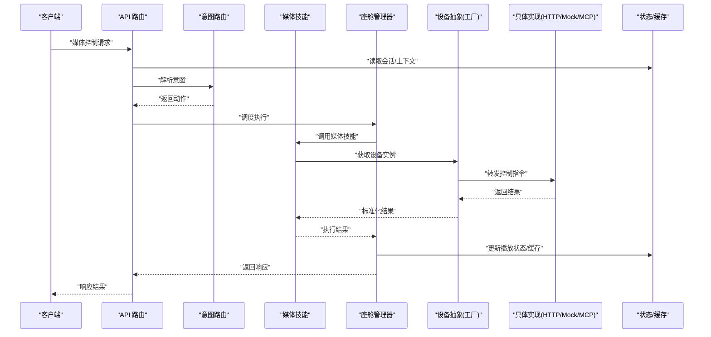
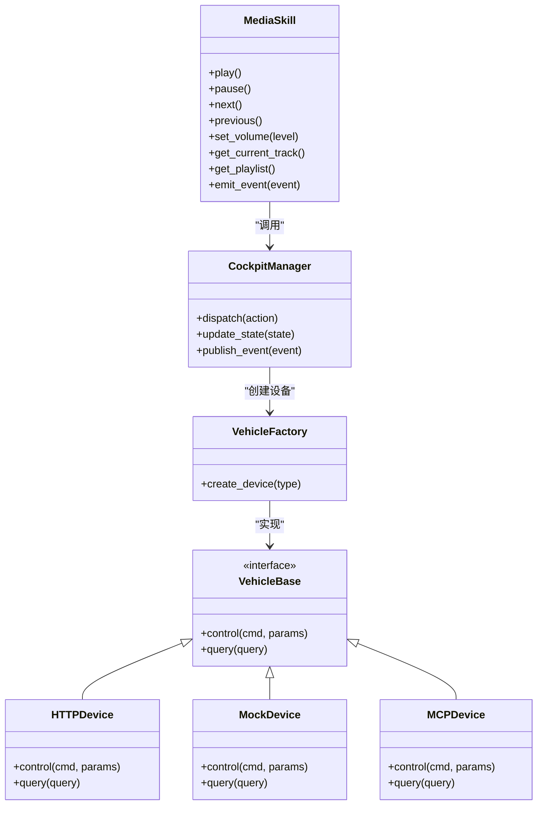
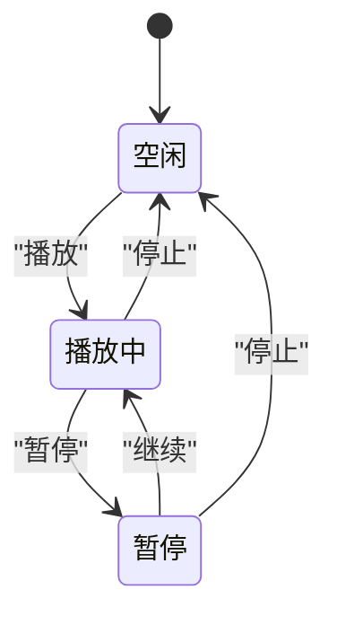
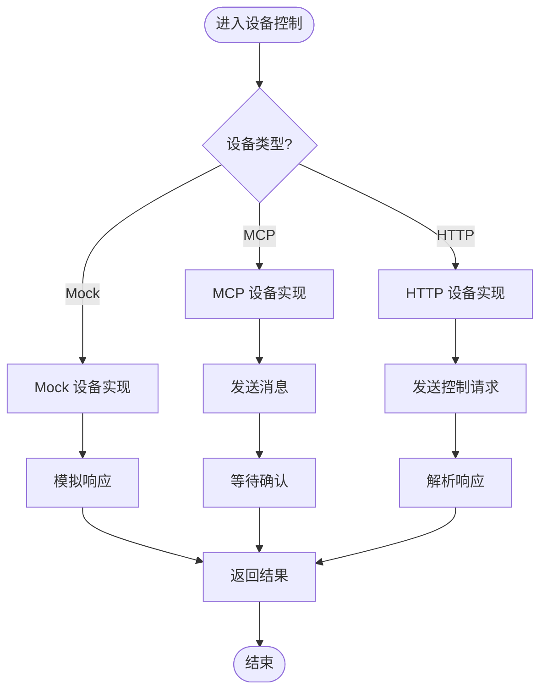
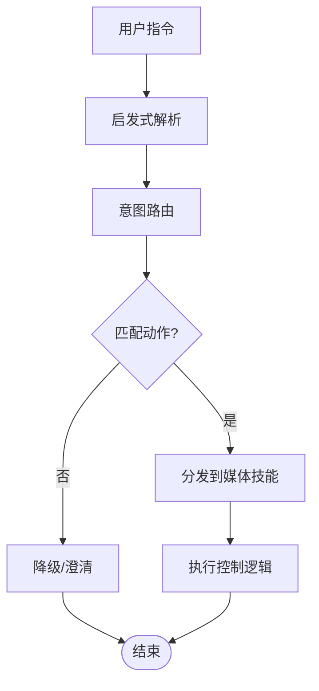
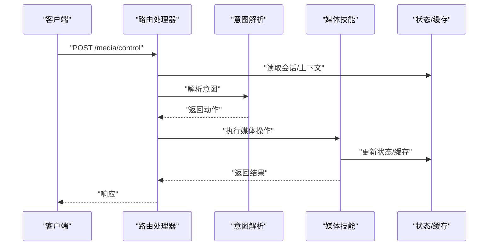
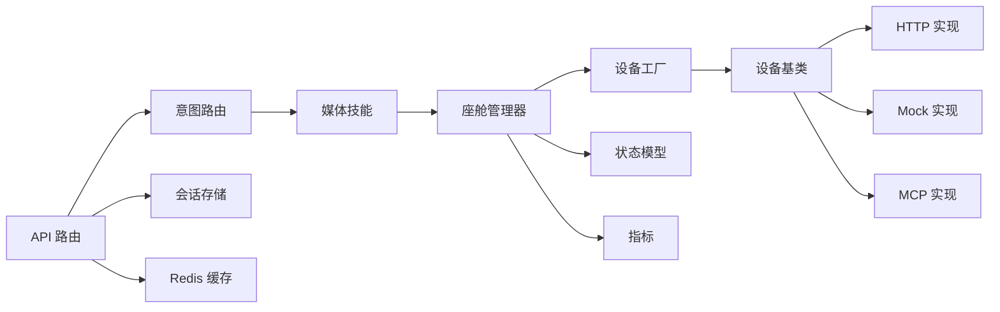

# 媒体播放控制

<cite>
**本文引用的文件**   
- [backend_design/nexus/skills/vehicle/media.py](file://backend_design/nexus/skills/vehicle/media.py)
- [backend_design/nexus/api/routes/cockpit.py](file://backend_design/nexus/api/routes/cockpit.py)
- [backend_design/nexus/core/cockpit_manager.py](file://backend_design/nexus/core/cockpit_manager.py)
- [backend_design/nexus/models/state.py](file://backend_design/nexus/models/state.py)
- [backend_design/nexus/models/schemas.py](file://backend_design/nexus/models/schemas.py)
- [backend_design/nexus/vehicle/base.py](file://backend_design/nexus/vehicle/base.py)
- [backend_design/nexus/vehicle/factory.py](file://backend_design/nexus/vehicle/factory.py)
- [backend_design/nexus/vehicle/http.py](file://backend_design/nexus/vehicle/http.py)
- [backend_design/nexus/vehicle/mcp.py](file://backend_design/nexus/vehicle/mcp.py)
- [backend_design/nexus/vehicle/mock.py](file://backend_design/nexus/vehicle/mock.py)
- [backend_design/nexus/intent/router.py](file://backend_design/nexus/intent/router.py)
- [backend_design/nexus/intent/heuristic.py](file://backend_design/nexus/intent/heuristic.py)
- [backend_design/nexus/core/logger.py](file://backend_design/nexus/core/logger.py)
- [backend_design/nexus/core/exceptions.py](file://backend_design/nexus/core/exceptions.py)
- [backend_design/nexus/core/circuit_breaker.py](file://backend_design/nexus/core/circuit_breaker.py)
- [backend_design/nexus/middleware/session_store.py](file://backend_design/nexus/middleware/session_store.py)
- [backend_design/nexus/middleware/redis_cache.py](file://backend_design/nexus/middleware/redis_cache.py)
- [backend_design/nexus/observability/cockpit_metrics.py](file://backend_design/nexus/observability/cockpit_metrics.py)
- [backend_design/nexus/config.py](file://backend_design/nexus/config.py)
</cite>

## 目录
1. [简介](#简介)
2. [项目结构](#项目结构)
3. [核心组件](#核心组件)
4. [架构总览](#架构总览)
5. [详细组件分析](#详细组件分析)
6. [依赖关系分析](#依赖关系分析)
7. [性能与缓存策略](#性能与缓存策略)
8. [故障排查指南](#故障排查指南)
9. [结论](#结论)
10. [附录：API 使用示例与最佳实践](#附录api-使用示例与最佳实践)

## 简介
本技术文档面向“媒体播放控制系统”，聚焦于车载娱乐场景下的媒体播放控制能力，包括播放、暂停、切歌、音量调节等核心功能。文档从系统架构、组件职责、数据流、异常处理、协议适配、集成方式到 API 使用示例与最佳实践进行系统化阐述，并给出音频流处理与缓存策略建议，帮助开发者快速理解与落地。

## 项目结构
本项目采用分层与按领域组织相结合的结构：
- 技能层（skills）：封装具体业务域能力，如车辆媒体控制。
- 意图路由（intent）：将自然语言或结构化指令解析为可执行动作。
- 控制器/API（api）：对外暴露 HTTP/WebSocket 接口，协调上层流程。
- 核心服务（core）：提供通用能力（日志、异常、熔断、会话、状态管理等）。
- 设备抽象（vehicle）：统一车载设备访问接口，支持多种后端实现（HTTP/Mock/MCP）。
- 模型（models）：定义数据模型、状态与请求响应模式。
- 可观测性（observability）：指标与监控。
- 中间件（middleware）：会话、缓存、限流等横切能力。
- 配置（config）：全局配置项。

图表来源
- [backend_design/nexus/api/routes/cockpit.py](file://backend_design/nexus/api/routes/cockpit.py)
- [backend_design/nexus/intent/router.py](file://backend_design/nexus/intent/router.py)
- [backend_design/nexus/intent/heuristic.py](file://backend_design/nexus/intent/heuristic.py)
- [backend_design/nexus/skills/vehicle/media.py](file://backend_design/nexus/skills/vehicle/media.py)
- [backend_design/nexus/core/cockpit_manager.py](file://backend_design/nexus/core/cockpit_manager.py)
- [backend_design/nexus/models/state.py](file://backend_design/nexus/models/state.py)
- [backend_design/nexus/models/schemas.py](file://backend_design/nexus/models/schemas.py)
- [backend_design/nexus/core/logger.py](file://backend_design/nexus/core/logger.py)
- [backend_design/nexus/core/exceptions.py](file://backend_design/nexus/core/exceptions.py)
- [backend_design/nexus/core/circuit_breaker.py](file://backend_design/nexus/core/circuit_breaker.py)
- [backend_design/nexus/vehicle/base.py](file://backend_design/nexus/vehicle/base.py)
- [backend_design/nexus/vehicle/factory.py](file://backend_design/nexus/vehicle/factory.py)
- [backend_design/nexus/vehicle/http.py](file://backend_design/nexus/vehicle/http.py)
- [backend_design/nexus/vehicle/mock.py](file://backend_design/nexus/vehicle/mock.py)
- [backend_design/nexus/vehicle/mcp.py](file://backend_design/nexus/nexus/vehicle/mcp.py)
- [backend_design/nexus/middleware/session_store.py](file://backend_design/nexus/middleware/session_store.py)
- [backend_design/nexus/middleware/redis_cache.py](file://backend_design/nexus/middleware/redis_cache.py)
- [backend_design/nexus/observability/cockpit_metrics.py](file://backend_design/nexus/observability/cockpit_metrics.py)
- [backend_design/nexus/config.py](file://backend_design/nexus/config.py)

章节来源
- [backend_design/nexus/skills/vehicle/media.py](file://backend_design/nexus/skills/vehicle/media.py)
- [backend_design/nexus/api/routes/cockpit.py](file://backend_design/nexus/api/routes/cockpit.py)
- [backend_design/nexus/core/cockpit_manager.py](file://backend_design/nexus/core/cockpit_manager.py)
- [backend_design/nexus/models/state.py](file://backend_design/nexus/models/state.py)
- [backend_design/nexus/models/schemas.py](file://backend_design/nexus/models/schemas.py)
- [backend_design/nexus/vehicle/base.py](file://backend_design/nexus/vehicle/base.py)
- [backend_design/nexus/vehicle/factory.py](file://backend_design/nexus/vehicle/factory.py)
- [backend_design/nexus/vehicle/http.py](file://backend_design/nexus/vehicle/http.py)
- [backend_design/nexus/vehicle/mcp.py](file://backend_design/nexus/vehicle/mcp.py)
- [backend_design/nexus/vehicle/mock.py](file://backend_design/nexus/vehicle/mock.py)
- [backend_design/nexus/intent/router.py](file://backend_design/nexus/intent/router.py)
- [backend_design/nexus/intent/heuristic.py](file://backend_design/nexus/intent/heuristic.py)
- [backend_design/nexus/core/logger.py](file://backend_design/nexus/core/logger.py)
- [backend_design/nexus/core/exceptions.py](file://backend_design/nexus/core/exceptions.py)
- [backend_design/nexus/core/circuit_breaker.py](file://backend_design/nexus/core/circuit_breaker.py)
- [backend_design/nexus/middleware/session_store.py](file://backend_design/nexus/middleware/session_store.py)
- [backend_design/nexus/middleware/redis_cache.py](file://backend_design/nexus/middleware/redis_cache.py)
- [backend_design/nexus/observability/cockpit_metrics.py](file://backend_design/nexus/observability/cockpit_metrics.py)
- [backend_design/nexus/config.py](file://backend_design/nexus/config.py)

## 核心组件
- 媒体技能（Media Skill）：封装播放、暂停、切歌、音量调节、播放列表管理、当前曲目信息等媒体相关能力，向上暴露统一的技能接口。
- 座舱管理器（Cockpit Manager）：编排跨模块协作，负责调用媒体技能、维护播放状态、触发事件上报、对接设备抽象层。
- 设备抽象层（Vehicle Abstraction）：通过基类与工厂方法屏蔽底层差异，支持 HTTP、Mock、MCP 等多种车载娱乐系统接入方式。
- 意图路由（Intent Router）：将用户指令解析为媒体操作动作，驱动技能执行。
- 状态与模式（State & Schemas）：定义播放状态机、媒体元数据、请求/响应模式，确保前后端一致。
- 可观测性与中间件：日志、异常、熔断、会话、缓存、指标采集贯穿全链路。

章节来源
- [backend_design/nexus/skills/vehicle/media.py](file://backend_design/nexus/skills/vehicle/media.py)
- [backend_design/nexus/core/cockpit_manager.py](file://backend_design/nexus/core/cockpit_manager.py)
- [backend_design/nexus/vehicle/base.py](file://backend_design/nexus/vehicle/base.py)
- [backend_design/nexus/vehicle/factory.py](file://backend_design/nexus/vehicle/factory.py)
- [backend_design/nexus/models/state.py](file://backend_design/nexus/models/state.py)
- [backend_design/nexus/models/schemas.py](file://backend_design/nexus/models/schemas.py)

## 架构总览
媒体播放控制的整体流程如下：
- 客户端通过 API 发起媒体控制请求。
- API 路由校验参数、加载上下文与会话信息。
- 意图路由将请求映射为媒体操作动作。
- 座舱管理器协调媒体技能执行，更新状态并持久化。
- 设备抽象层根据配置选择具体实现（HTTP/Mock/MCP），下发控制指令至车载娱乐系统。
- 可观测性组件记录指标与日志，异常路径由熔断与错误码统一处理。

图表来源
- [backend_design/nexus/api/routes/cockpit.py](file://backend_design/nexus/api/routes/cockpit.py)
- [backend_design/nexus/intent/router.py](file://backend_design/nexus/intent/router.py)
- [backend_design/nexus/skills/vehicle/media.py](file://backend_design/nexus/skills/vehicle/media.py)
- [backend_design/nexus/core/cockpit_manager.py](file://backend_design/nexus/core/cockpit_manager.py)
- [backend_design/nexus/vehicle/factory.py](file://backend_design/nexus/vehicle/factory.py)
- [backend_design/nexus/vehicle/http.py](file://backend_design/nexus/vehicle/http.py)
- [backend_design/nexus/vehicle/mock.py](file://backend_design/nexus/vehicle/mock.py)
- [backend_design/nexus/vehicle/mcp.py](file://backend_design/nexus/vehicle/mcp.py)
- [backend_design/nexus/middleware/session_store.py](file://backend_design/nexus/middleware/session_store.py)
- [backend_design/nexus/middleware/redis_cache.py](file://backend_design/nexus/middleware/redis_cache.py)

## 详细组件分析

### 媒体技能（Media Skill）
职责与能力：
- 播放控制：播放、暂停、继续、停止。
- 曲目切换：上一首、下一首、随机/循环模式切换。
- 音量控制：设置音量、静音开关。
- 播放列表与当前曲目：查询/更新列表、获取当前播放信息。
- 事件上报：播放状态变更、曲目切换、音量变化等事件。

关键交互：
- 通过座舱管理器调用设备抽象层，完成对车载娱乐系统的控制。
- 与状态模型同步播放状态，保证 UI 与后端一致。
- 结合缓存提升热点数据（如当前曲目、音量）的读取性能。

图表来源
- [backend_design/nexus/skills/vehicle/media.py](file://backend_design/nexus/skills/vehicle/media.py)
- [backend_design/nexus/core/cockpit_manager.py](file://backend_design/nexus/core/cockpit_manager.py)
- [backend_design/nexus/vehicle/base.py](file://backend_design/nexus/vehicle/base.py)
- [backend_design/nexus/vehicle/factory.py](file://backend_design/nexus/vehicle/factory.py)
- [backend_design/nexus/vehicle/http.py](file://backend_design/nexus/vehicle/http.py)
- [backend_design/nexus/vehicle/mock.py](file://backend_design/nexus/vehicle/mock.py)
- [backend_design/nexus/vehicle/mcp.py](file://backend_design/nexus/vehicle/mcp.py)

章节来源
- [backend_design/nexus/skills/vehicle/media.py](file://backend_design/nexus/skills/vehicle/media.py)
- [backend_design/nexus/core/cockpit_manager.py](file://backend_design/nexus/core/cockpit_manager.py)
- [backend_design/nexus/vehicle/base.py](file://backend_design/nexus/vehicle/base.py)
- [backend_design/nexus/vehicle/factory.py](file://backend_design/nexus/vehicle/factory.py)
- [backend_design/nexus/vehicle/http.py](file://backend_design/nexus/vehicle/http.py)
- [backend_design/nexus/vehicle/mock.py](file://backend_design/nexus/vehicle/mock.py)
- [backend_design/nexus/vehicle/mcp.py](file://backend_design/nexus/vehicle/mcp.py)

### 播放状态机与同步
- 状态定义：包含播放状态（空闲、播放中、暂停）、曲目索引、音量等级、循环/随机模式等。
- 状态同步：每次媒体操作后更新状态，并通过事件机制推送给前端或其他子系统。
- 一致性保障：在并发场景下，通过会话隔离与原子更新避免状态竞争。

图表来源
- [backend_design/nexus/models/state.py](file://backend_design/nexus/models/state.py)

章节来源
- [backend_design/nexus/models/state.py](file://backend_design/nexus/models/state.py)

### 设备抽象与协议适配
- 基类契约：定义统一的控制与查询接口，屏蔽底层差异。
- 工厂方法：根据配置动态创建具体设备实现（HTTP/Mock/MCP）。
- 协议适配：
  - HTTP：通过 REST 接口与车载娱乐系统通信，适合标准网关。
  - Mock：用于开发与测试，模拟设备行为。
  - MCP：通过消息通道与车载系统交互，适合复杂事件与双向通信。

图表来源
- [backend_design/nexus/vehicle/base.py](file://backend_design/nexus/vehicle/base.py)
- [backend_design/nexus/vehicle/factory.py](file://backend_design/nexus/vehicle/factory.py)
- [backend_design/nexus/vehicle/http.py](file://backend_design/nexus/vehicle/http.py)
- [backend_design/nexus/vehicle/mock.py](file://backend_design/nexus/vehicle/mock.py)
- [backend_design/nexus/vehicle/mcp.py](file://backend_design/nexus/vehicle/mcp.py)

章节来源
- [backend_design/nexus/vehicle/base.py](file://backend_design/nexus/vehicle/base.py)
- [backend_design/nexus/vehicle/factory.py](file://backend_design/nexus/vehicle/factory.py)
- [backend_design/nexus/vehicle/http.py](file://backend_design/nexus/vehicle/http.py)
- [backend_design/nexus/vehicle/mock.py](file://backend_design/nexus/vehicle/mock.py)
- [backend_design/nexus/vehicle/mcp.py](file://backend_design/nexus/vehicle/mcp.py)

### 意图路由与指令解析
- 路由策略：基于启发式规则与可扩展路由器，将用户指令映射为媒体操作。
- 动作映射：例如“播放”、“暂停”、“下一首”、“调高音量”等。
- 上下文增强：结合会话信息与偏好设置，提高解析准确率。

图表来源
- [backend_design/nexus/intent/router.py](file://backend_design/nexus/intent/router.py)
- [backend_design/nexus/intent/heuristic.py](file://backend_design/nexus/intent/heuristic.py)

章节来源
- [backend_design/nexus/intent/router.py](file://backend_design/nexus/intent/router.py)
- [backend_design/nexus/intent/heuristic.py](file://backend_design/nexus/intent/heuristic.py)

### API 路由与请求处理
- 入口点：媒体控制相关的 HTTP 路由位于 cockpit 路由模块。
- 处理流程：参数校验、会话加载、意图解析、调度执行、结果返回。
- 错误处理：统一异常捕获与错误码返回，便于前端处理。

图表来源
- [backend_design/nexus/api/routes/cockpit.py](file://backend_design/nexus/api/routes/cockpit.py)
- [backend_design/nexus/intent/router.py](file://backend_design/nexus/intent/router.py)
- [backend_design/nexus/skills/vehicle/media.py](file://backend_design/nexus/skills/vehicle/media.py)
- [backend_design/nexus/middleware/session_store.py](file://backend_design/nexus/middleware/session_store.py)
- [backend_design/nexus/middleware/redis_cache.py](file://backend_design/nexus/middleware/redis_cache.py)

章节来源
- [backend_design/nexus/api/routes/cockpit.py](file://backend_design/nexus/api/routes/cockpit.py)
- [backend_design/nexus/middleware/session_store.py](file://backend_design/nexus/middleware/session_store.py)
- [backend_design/nexus/middleware/redis_cache.py](file://backend_design/nexus/middleware/redis_cache.py)

## 依赖关系分析
- 低耦合高内聚：媒体技能专注于业务逻辑，设备抽象层屏蔽底层差异，座舱管理器负责编排。
- 直接依赖：
  - 媒体技能依赖座舱管理器与状态模型。
  - 座舱管理器依赖设备工厂与可观测性组件。
  - 设备工厂依赖具体设备实现。
- 间接依赖：
  - API 路由依赖意图路由与中间件。
  - 可观测性组件贯穿各层，提供指标与日志。

图表来源
- [backend_design/nexus/api/routes/cockpit.py](file://backend_design/nexus/api/routes/cockpit.py)
- [backend_design/nexus/intent/router.py](file://backend_design/nexus/intent/router.py)
- [backend_design/nexus/skills/vehicle/media.py](file://backend_design/nexus/skills/vehicle/media.py)
- [backend_design/nexus/core/cockpit_manager.py](file://backend_design/nexus/core/cockpit_manager.py)
- [backend_design/nexus/vehicle/factory.py](file://backend_design/nexus/vehicle/factory.py)
- [backend_design/nexus/vehicle/base.py](file://backend_design/nexus/vehicle/base.py)
- [backend_design/nexus/vehicle/http.py](file://backend_design/nexus/vehicle/http.py)
- [backend_design/nexus/vehicle/mock.py](file://backend_design/nexus/vehicle/mock.py)
- [backend_design/nexus/vehicle/mcp.py](file://backend_design/nexus/vehicle/mcp.py)
- [backend_design/nexus/models/state.py](file://backend_design/nexus/models/state.py)
- [backend_design/nexus/observability/cockpit_metrics.py](file://backend_design/nexus/observability/cockpit_metrics.py)
- [backend_design/nexus/middleware/session_store.py](file://backend_design/nexus/middleware/session_store.py)
- [backend_design/nexus/middleware/redis_cache.py](file://backend_design/nexus/middleware/redis_cache.py)

章节来源
- [backend_design/nexus/api/routes/cockpit.py](file://backend_design/nexus/api/routes/cockpit.py)
- [backend_design/nexus/skills/vehicle/media.py](file://backend_design/nexus/skills/vehicle/media.py)
- [backend_design/nexus/core/cockpit_manager.py](file://backend_design/nexus/core/cockpit_manager.py)
- [backend_design/nexus/vehicle/factory.py](file://backend_design/nexus/vehicle/factory.py)
- [backend_design/nexus/vehicle/base.py](file://backend_design/nexus/vehicle/base.py)
- [backend_design/nexus/models/state.py](file://backend_design/nexus/models/state.py)
- [backend_design/nexus/observability/cockpit_metrics.py](file://backend_design/nexus/observability/cockpit_metrics.py)
- [backend_design/nexus/middleware/session_store.py](file://backend_design/nexus/middleware/session_store.py)
- [backend_design/nexus/middleware/redis_cache.py](file://backend_design/nexus/middleware/redis_cache.py)

## 性能与缓存策略
- 热点数据缓存：当前曲目、音量、播放状态等高频读取数据放入 Redis，降低状态查询延迟。
- 批量操作优化：对于批量切歌或列表更新，合并状态变更，减少写放大。
- 连接复用与超时：HTTP 设备实现应启用连接池与合理超时，避免阻塞。
- 异步与背压：在长耗时操作（如网络请求）中使用异步与重试退避，防止雪崩。
- 指标监控：通过指标组件采集关键路径耗时与错误率，指导容量规划与优化。

[本节为通用性能建议，不直接分析具体文件]

## 故障排查指南
- 日志定位：使用统一日志组件记录关键路径与异常堆栈，便于问题复现。
- 异常分类：区分参数错误、设备不可用、网络超时、内部错误等，返回明确错误码。
- 熔断保护：对不稳定设备实现启用熔断，避免级联失败。
- 健康检查：提供健康检查接口，验证设备连通性与状态一致性。
- 回放与审计：记录媒体控制事件与状态变更，辅助审计与回溯。

章节来源
- [backend_design/nexus/core/logger.py](file://backend_design/nexus/core/logger.py)
- [backend_design/nexus/core/exceptions.py](file://backend_design/nexus/core/exceptions.py)
- [backend_design/nexus/core/circuit_breaker.py](file://backend_design/nexus/core/circuit_breaker.py)

## 结论
本系统通过清晰的层次划分与设备抽象，实现了媒体播放控制的灵活扩展与稳定运行。媒体技能聚焦业务逻辑，座舱管理器负责编排与状态同步，设备抽象层屏蔽底层差异，配合意图路由与可观测性组件，形成完整的媒体控制闭环。在生产环境中，建议结合缓存、熔断与健康检查，持续提升稳定性与用户体验。

[本节为总结性内容，不直接分析具体文件]

## 附录：API 使用示例与最佳实践

- 播放控制
  - 播放：调用媒体控制接口，传入动作“播放”。
  - 暂停：调用媒体控制接口，传入动作“暂停”。
  - 切歌：调用媒体控制接口，传入动作“下一首/上一首”。
  - 音量：调用媒体控制接口，传入动作“设置音量”，附带音量值。
- 状态查询
  - 当前曲目：调用媒体信息查询接口，返回当前曲目元数据。
  - 播放状态：调用状态查询接口，返回播放状态、音量、模式等。
- 最佳实践
  - 幂等设计：对重复请求进行去重，避免多次下发控制指令。
  - 超时与重试：为设备通信设置合理超时与重试策略。
  - 错误处理：前端根据错误码提示用户或自动恢复。
  - 事件订阅：订阅播放状态变更事件，保持 UI 实时同步。
  - 安全与鉴权：对媒体控制接口实施鉴权与权限控制。

章节来源
- [backend_design/nexus/api/routes/cockpit.py](file://backend_design/nexus/api/routes/cockpit.py)
- [backend_design/nexus/models/schemas.py](file://backend_design/nexus/models/schemas.py)
- [backend_design/nexus/skills/vehicle/media.py](file://backend_design/nexus/skills/vehicle/media.py)
- [backend_design/nexus/core/cockpit_manager.py](file://backend_design/nexus/core/cockpit_manager.py)