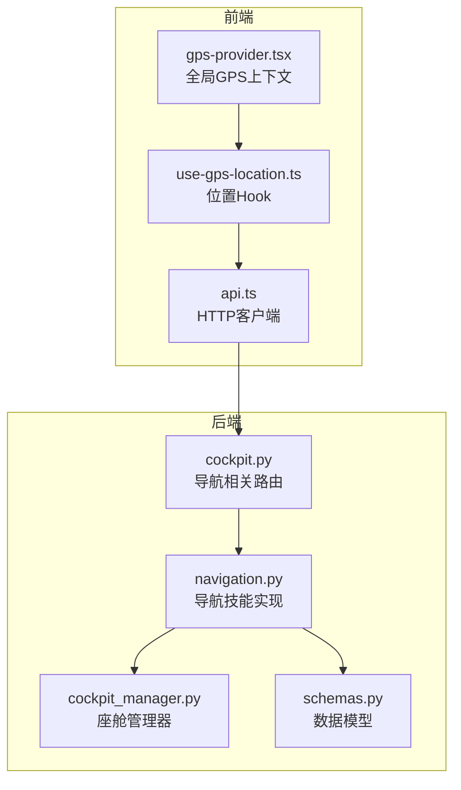
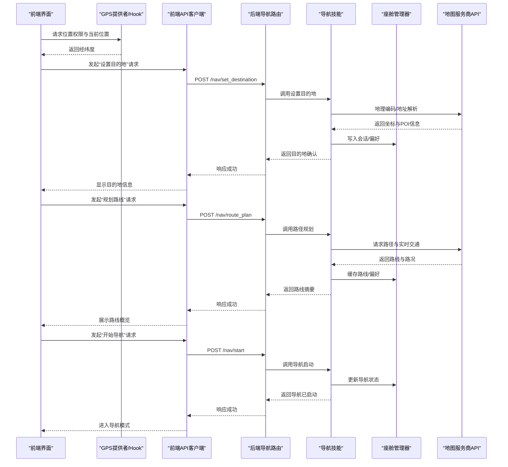
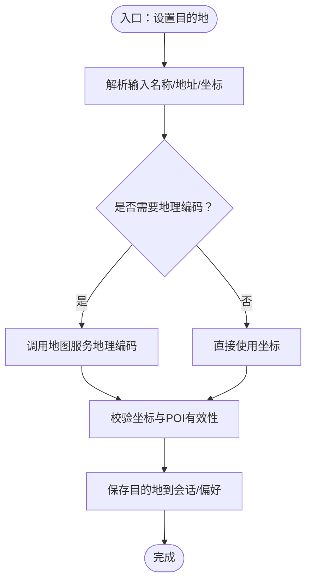
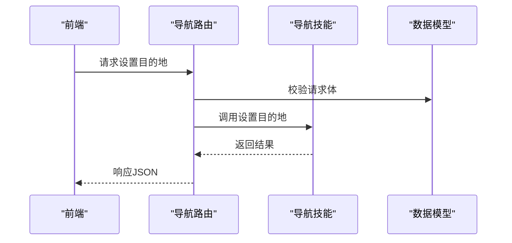
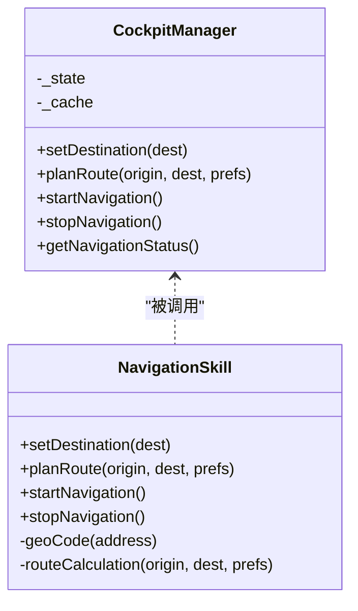
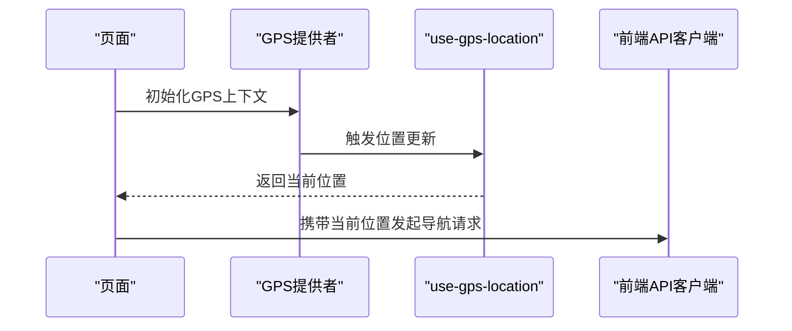
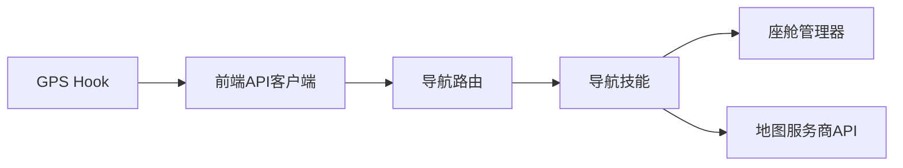

# 导航设置控制

<cite>
**本文引用的文件**   
- [backend_design/nexus/skills/vehicle/navigation.py](file://backend_design/nexus/skills/vehicle/navigation.py)
- [backend_design/nexus/api/routes/cockpit.py](file://backend_design/nexus/api/routes/cockpit.py)
- [backend_design/nexus/core/cockpit_manager.py](file://backend_design/nexus/core/cockpit_manager.py)
- [backend_design/nexus/models/schemas.py](file://backend_design/nexus/models/schemas.py)
- [frontend_design/src/components/layout/gps-provider.tsx](file://frontend_design/src/components/layout/gps-provider.tsx)
- [frontend_design/src/hooks/use-gps-location.ts](file://frontend_design/src/hooks/use-gps-location.ts)
- [frontend_design/src/lib/api.ts](file://frontend_design/src/lib/api.ts)
</cite>

## 目录
1. [简介](#简介)
2. [项目结构](#项目结构)
3. [核心组件](#核心组件)
4. [架构总览](#架构总览)
5. [详细组件分析](#详细组件分析)
6. [依赖分析](#依赖分析)
7. [性能考虑](#性能考虑)
8. [故障排查指南](#故障排查指南)
9. [结论](#结论)
10. [附录](#附录)

## 简介
本技术文档聚焦于“导航设置控制系统”，覆盖目的地设置、路线规划、导航启动等关键能力，并说明地理编码服务集成、路径计算算法与实时交通信息处理。同时描述与地图服务提供商的API对接和数据同步机制，提供导航控制的调用示例与错误处理方案，并包含位置权限管理与隐私保护建议。

## 项目结构
导航相关功能在后端以“技能（Skill）”方式组织，前端通过API与服务交互，结合GPS定位能力完成端到端的导航体验。

图表来源
- [frontend_design/src/lib/api.ts](file://frontend_design/src/lib/api.ts)
- [frontend_design/src/components/layout/gps-provider.tsx](file://frontend_design/src/components/layout/gps-provider.tsx)
- [frontend_design/src/hooks/use-gps-location.ts](file://frontend_design/src/hooks/use-gps-location.ts)
- [backend_design/nexus/api/routes/cockpit.py](file://backend_design/nexus/api/routes/cockpit.py)
- [backend_design/nexus/skills/vehicle/navigation.py](file://backend_design/nexus/skills/vehicle/navigation.py)
- [backend_design/nexus/core/cockpit_manager.py](file://backend_design/nexus/core/cockpit_manager.py)
- [backend_design/nexus/models/schemas.py](file://backend_design/nexus/models/schemas.py)

章节来源
- [backend_design/nexus/skills/vehicle/navigation.py](file://backend_design/nexus/skills/vehicle/navigation.py)
- [backend_design/nexus/api/routes/cockpit.py](file://backend_design/nexus/api/routes/cockpit.py)
- [backend_design/nexus/core/cockpit_manager.py](file://backend_design/nexus/core/cockpit_manager.py)
- [backend_design/nexus/models/schemas.py](file://backend_design/nexus/models/schemas.py)
- [frontend_design/src/components/layout/gps-provider.tsx](file://frontend_design/src/components/layout/gps-provider.tsx)
- [frontend_design/src/hooks/use-gps-location.ts](file://frontend_design/src/hooks/use-gps-location.ts)
- [frontend_design/src/lib/api.ts](file://frontend_design/src/lib/api.ts)

## 核心组件
- 导航技能（Navigation Skill）：封装目的地解析、地理编码、路径规划、导航启停、偏好设置等核心逻辑。
- 座舱管理器（Cockpit Manager）：协调车辆状态、会话上下文与外部服务，为导航技能提供运行时支撑。
- 导航API路由：暴露REST接口，接收前端请求，校验参数，调度导航技能。
- 数据模型（Schemas）：定义输入输出结构，如目的地、路线、导航状态等。
- 前端GPS提供者与Hook：管理浏览器定位权限与位置更新，驱动导航流程。
- 前端API客户端：统一封装对后端的HTTP调用。

章节来源
- [backend_design/nexus/skills/vehicle/navigation.py](file://backend_design/nexus/skills/vehicle/navigation.py)
- [backend_design/nexus/core/cockpit_manager.py](file://backend_design/nexus/core/cockpit_manager.py)
- [backend_design/nexus/api/routes/cockpit.py](file://backend_design/nexus/api/routes/cockpit.py)
- [backend_design/nexus/models/schemas.py](file://backend_design/nexus/models/schemas.py)
- [frontend_design/src/components/layout/gps-provider.tsx](file://frontend_design/src/components/layout/gps-provider.tsx)
- [frontend_design/src/hooks/use-gps-location.ts](file://frontend_design/src/hooks/use-gps-location.ts)
- [frontend_design/src/lib/api.ts](file://frontend_design/src/lib/api.ts)

## 架构总览
导航系统采用前后端分离架构：前端负责用户交互与位置采集，后端通过导航技能编排地理编码、路径计算与导航控制，必要时与地图服务商API交互。

图表来源
- [backend_design/nexus/api/routes/cockpit.py](file://backend_design/nexus/api/routes/cockpit.py)
- [backend_design/nexus/skills/vehicle/navigation.py](file://backend_design/nexus/skills/vehicle/navigation.py)
- [backend_design/nexus/core/cockpit_manager.py](file://backend_design/nexus/core/cockpit_manager.py)
- [frontend_design/src/components/layout/gps-provider.tsx](file://frontend_design/src/components/layout/gps-provider.tsx)
- [frontend_design/src/hooks/use-gps-location.ts](file://frontend_design/src/hooks/use-gps-location.ts)
- [frontend_design/src/lib/api.ts](file://frontend_design/src/lib/api.ts)

## 详细组件分析

### 导航技能（Navigation Skill）
职责
- 目的地设置：支持名称、地址、坐标等多种输入；进行地理编码与去重。
- 路线规划：基于起点、终点与偏好（最短时间、最少拥堵、避开高速等）生成路线。
- 导航控制：启动、暂停、结束导航；维护导航状态机。
- 实时交通：接入实时路况，动态调整推荐路线或提示。
- 偏好与记忆：持久化用户偏好（如默认路线策略、常用目的地）。

关键流程
- 地理编码：将文本地址转换为经纬度，并返回POI元数据。
- 路径计算：调用地图服务商的路径规划API，结合实时交通权重选择最优路线。
- 导航状态：在座舱管理器中维护当前导航状态，确保并发安全。

图表来源
- [backend_design/nexus/skills/vehicle/navigation.py](file://backend_design/nexus/skills/vehicle/navigation.py)
- [backend_design/nexus/core/cockpit_manager.py](file://backend_design/nexus/core/cockpit_manager.py)
- [backend_design/nexus/models/schemas.py](file://backend_design/nexus/models/schemas.py)

章节来源
- [backend_design/nexus/skills/vehicle/navigation.py](file://backend_design/nexus/skills/vehicle/navigation.py)
- [backend_design/nexus/core/cockpit_manager.py](file://backend_design/nexus/core/cockpit_manager.py)
- [backend_design/nexus/models/schemas.py](file://backend_design/nexus/models/schemas.py)

### 导航API路由（Cockpit Routes）
职责
- 暴露导航相关REST接口，包括设置目的地、规划路线、启动/停止导航、查询状态等。
- 参数校验、鉴权与会话绑定。
- 调用导航技能并返回标准化响应。

典型接口
- 设置目的地：POST /nav/set_destination
- 规划路线：POST /nav/route_plan
- 开始导航：POST /nav/start
- 停止导航：POST /nav/stop
- 查询状态：GET /nav/status

图表来源
- [backend_design/nexus/api/routes/cockpit.py](file://backend_design/nexus/api/routes/cockpit.py)
- [backend_design/nexus/models/schemas.py](file://backend_design/nexus/models/schemas.py)
- [backend_design/nexus/skills/vehicle/navigation.py](file://backend_design/nexus/skills/vehicle/navigation.py)

章节来源
- [backend_design/nexus/api/routes/cockpit.py](file://backend_design/nexus/api/routes/cockpit.py)
- [backend_design/nexus/models/schemas.py](file://backend_design/nexus/models/schemas.py)

### 座舱管理器（Cockpit Manager）
职责
- 维护会话上下文与导航状态。
- 协调外部服务（如地图API）与内部模块。
- 提供线程安全的状态读写与事件通知。

图表来源
- [backend_design/nexus/core/cockpit_manager.py](file://backend_design/nexus/core/cockpit_manager.py)
- [backend_design/nexus/skills/vehicle/navigation.py](file://backend_design/nexus/skills/vehicle/navigation.py)

章节来源
- [backend_design/nexus/core/cockpit_manager.py](file://backend_design/nexus/core/cockpit_manager.py)
- [backend_design/nexus/skills/vehicle/navigation.py](file://backend_design/nexus/skills/vehicle/navigation.py)

### 前端GPS提供者与Hook
职责
- 管理浏览器定位权限，订阅位置更新。
- 提供统一的GPS上下文与Hook，供页面与导航流程使用。

图表来源
- [frontend_design/src/components/layout/gps-provider.tsx](file://frontend_design/src/components/layout/gps-provider.tsx)
- [frontend_design/src/hooks/use-gps-location.ts](file://frontend_design/src/hooks/use-gps-location.ts)
- [frontend_design/src/lib/api.ts](file://frontend_design/src/lib/api.ts)

章节来源
- [frontend_design/src/components/layout/gps-provider.tsx](file://frontend_design/src/components/layout/gps-provider.tsx)
- [frontend_design/src/hooks/use-gps-location.ts](file://frontend_design/src/hooks/use-gps-location.ts)
- [frontend_design/src/lib/api.ts](file://frontend_design/src/lib/api.ts)

## 依赖分析
- 前端依赖
  - GPS提供者与Hook：用于获取设备位置与权限。
  - API客户端：统一封装HTTP请求与错误处理。
- 后端依赖
  - 导航技能：核心业务逻辑。
  - 座舱管理器：状态与会话管理。
  - 数据模型：输入输出校验与序列化。
- 外部依赖
  - 地图服务商API：地理编码、路径规划、实时交通。

图表来源
- [frontend_design/src/lib/api.ts](file://frontend_design/src/lib/api.ts)
- [frontend_design/src/hooks/use-gps-location.ts](file://frontend_design/src/hooks/use-gps-location.ts)
- [backend_design/nexus/api/routes/cockpit.py](file://backend_design/nexus/api/routes/cockpit.py)
- [backend_design/nexus/skills/vehicle/navigation.py](file://backend_design/nexus/skills/vehicle/navigation.py)
- [backend_design/nexus/core/cockpit_manager.py](file://backend_design/nexus/core/cockpit_manager.py)

章节来源
- [frontend_design/src/lib/api.ts](file://frontend_design/src/lib/api.ts)
- [frontend_design/src/hooks/use-gps-location.ts](file://frontend_design/src/hooks/use-gps-location.ts)
- [backend_design/nexus/api/routes/cockpit.py](file://backend_design/nexus/api/routes/cockpit.py)
- [backend_design/nexus/skills/vehicle/navigation.py](file://backend_design/nexus/skills/vehicle/navigation.py)
- [backend_design/nexus/core/cockpit_manager.py](file://backend_design/nexus/core/cockpit_manager.py)

## 性能考虑
- 地理编码与路径规划应引入缓存与去重策略，减少重复请求。
- 实时交通数据可采用增量更新与轮询策略，避免频繁全量刷新。
- 前端位置更新需节流与防抖，降低网络与计算开销。
- 后端对地图API调用增加熔断与降级策略，保障整体可用性。

## 故障排查指南
常见问题与处理
- 位置权限拒绝：前端应引导用户授权，并提供手动输入目的地的备选方案。
- 地理编码失败：检查地址格式、区域限制与服务商配额；记录错误码与重试策略。
- 路径规划超时：启用超时与重试，必要时回退到静态路线或提示用户稍后再试。
- 导航状态不一致：通过查询状态接口对齐前后端状态，必要时重置导航会话。

章节来源
- [backend_design/nexus/api/routes/cockpit.py](file://backend_design/nexus/api/routes/cockpit.py)
- [backend_design/nexus/skills/vehicle/navigation.py](file://backend_design/nexus/skills/vehicle/navigation.py)
- [backend_design/nexus/core/cockpit_manager.py](file://backend_design/nexus/core/cockpit_manager.py)
- [frontend_design/src/components/layout/gps-provider.tsx](file://frontend_design/src/components/layout/gps-provider.tsx)
- [frontend_design/src/hooks/use-gps-location.ts](file://frontend_design/src/hooks/use-gps-location.ts)
- [frontend_design/src/lib/api.ts](file://frontend_design/src/lib/api.ts)

## 结论
导航设置控制系统通过清晰的模块化设计与前后端协作，实现了从目的地设置、路线规划到导航启动的完整流程。借助地理编码与实时交通能力，系统能够提供更智能的导航体验。建议在后续迭代中完善错误处理、可观测性与隐私保护机制，以提升稳定性与用户体验。

## 附录

### 导航控制调用示例（概念性）
- 设置目的地
  - 方法：POST
  - 路径：/nav/set_destination
  - 请求体字段：目的地名称或地址或经纬度
  - 响应：目的地确认与坐标
- 规划路线
  - 方法：POST
  - 路径：/nav/route_plan
  - 请求体字段：起点、终点、偏好（时间/拥堵/高速）
  - 响应：路线摘要与预计时长
- 开始导航
  - 方法：POST
  - 路径：/nav/start
  - 响应：导航已启动
- 停止导航
  - 方法：POST
  - 路径：/nav/stop
  - 响应：导航已停止
- 查询状态
  - 方法：GET
  - 路径：/nav/status
  - 响应：当前导航状态与进度

章节来源
- [backend_design/nexus/api/routes/cockpit.py](file://backend_design/nexus/api/routes/cockpit.py)
- [backend_design/nexus/models/schemas.py](file://backend_design/nexus/models/schemas.py)

### 位置权限管理与隐私保护
- 权限管理
  - 前端应在首次使用前请求位置权限，并在拒绝时提供降级方案（手动输入目的地）。
  - 位置更新应采用最小必要原则，仅在导航过程中高频更新。
- 隐私保护
  - 不持久化敏感位置轨迹，如需存储应脱敏与加密。
  - 明确告知用户数据用途，并提供关闭与删除选项。
  - 遵循最小化收集原则，仅传输必要的坐标与目的地信息。

章节来源
- [frontend_design/src/components/layout/gps-provider.tsx](file://frontend_design/src/components/layout/gps-provider.tsx)
- [frontend_design/src/hooks/use-gps-location.ts](file://frontend_design/src/hooks/use-gps-location.ts)
- [frontend_design/src/lib/api.ts](file://frontend_design/src/lib/api.ts)